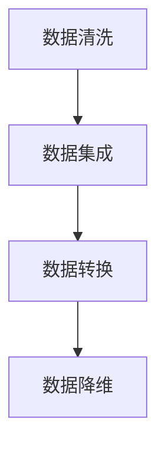
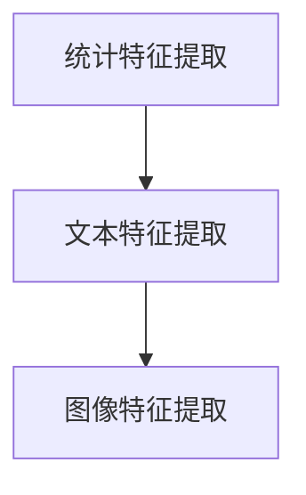
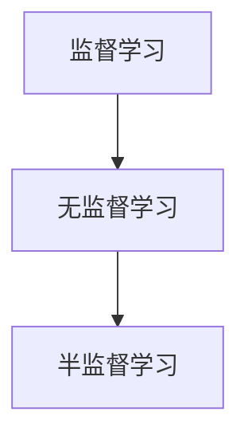
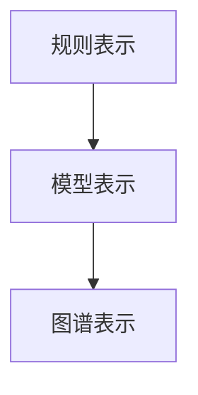
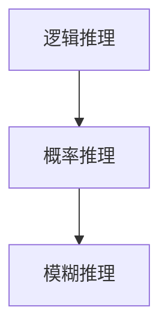

                 

# 知识发现引擎：赋能人类知识进化的加速器

## 概述

在当今信息爆炸的时代，人类面临海量数据和无尽的学术资源，然而如何从中快速、准确地提取和利用知识，成为了我们必须面对的挑战。知识发现引擎作为一种智能系统，能够从大规模数据集中自动识别出潜在的模式和规律，从而推动人类知识的发现、积累和创新。本文将深入探讨知识发现引擎的概念、原理、算法、应用以及未来发展趋势。

## 关键词

- 知识发现引擎
- 数据挖掘
- 人工智能
- 知识图谱
- 大数据分析

## 摘要

本文首先介绍了知识发现引擎的定义和背景，然后详细阐述了其核心概念、算法原理和数学模型。接着，通过实际项目案例展示了知识发现引擎的开发和实现过程。最后，分析了知识发现引擎在实际应用场景中的表现，并对其未来发展进行了展望。

## 1. 背景介绍

### 1.1 数据爆炸时代的挑战

随着互联网的快速发展，数据量呈指数级增长。据统计，全球数据总量每两年就会翻一番。然而，数据的增长速度远远超过了人类处理数据的能力。传统的数据处理方法已经无法满足当前的需求，我们需要更加智能化、自动化的工具来帮助我们发掘数据中的价值。

### 1.2 知识发现的需求

在数据爆炸的背景下，知识发现引擎应运而生。知识发现引擎能够从海量数据中自动识别出潜在的规律和模式，帮助人类从海量信息中提取出有用的知识。知识发现不仅可以帮助企业和组织更好地理解其业务数据，还可以为科学研究、社会管理等提供重要的支持。

### 1.3 知识发现引擎的发展历程

知识发现引擎的发展历程可以分为三个阶段：

1. **数据挖掘阶段（1990s-2000s）**：这个阶段主要是通过算法从数据中挖掘出潜在的规律和模式。代表性的算法包括决策树、支持向量机、贝叶斯分类等。

2. **机器学习阶段（2000s-2010s）**：随着机器学习技术的不断发展，知识发现引擎开始运用深度学习、强化学习等更高级的算法，提高了知识发现的效率和准确性。

3. **人工智能阶段（2010s-至今）**：人工智能的快速发展使得知识发现引擎变得更加智能和灵活，能够处理更加复杂的数据集和问题。

## 2. 核心概念与联系

### 2.1 知识发现引擎的概念

知识发现引擎是一种能够自动从大规模数据集中识别出潜在模式、规律和关联性的智能系统。它通常包括数据预处理、模式识别、知识表示和知识推理等多个模块。

### 2.2 知识发现引擎的架构

知识发现引擎的架构可以分为三个层次：

1. **数据层**：包括数据源和数据存储。数据源可以是各种结构化和非结构化的数据，如关系数据库、文本、图像、视频等。数据存储则负责存储和管理这些数据。

2. **算法层**：包括数据预处理、特征提取、模式识别等算法。这些算法负责从数据中提取出有用的信息和模式。

3. **应用层**：包括知识表示、知识推理、知识应用等模块。这些模块负责将提取出的知识进行表示、推理和应用。

### 2.3 知识发现引擎的工作流程

知识发现引擎的工作流程可以分为以下几个步骤：

1. **数据预处理**：清洗和整合原始数据，使其满足算法的要求。

2. **特征提取**：从数据中提取出有用的特征，用于后续的模式识别。

3. **模式识别**：利用算法从特征中识别出潜在的规律和模式。

4. **知识表示**：将识别出的模式转化为知识表示，如规则、模型等。

5. **知识推理**：利用知识表示进行推理，发现更高级的知识和关联性。

6. **知识应用**：将知识应用于实际问题中，如决策支持、智能推荐等。

### 2.4 知识发现引擎与其他领域的联系

知识发现引擎不仅与数据挖掘、机器学习密切相关，还与其他领域有着紧密的联系：

1. **数据挖掘**：知识发现引擎是数据挖掘的一种高级形式，其目标是从数据中挖掘出更深层次的规律和知识。

2. **机器学习**：知识发现引擎中的模式识别和知识推理模块通常采用机器学习技术，如深度学习、强化学习等。

3. **知识图谱**：知识发现引擎可以利用知识图谱技术将识别出的知识进行结构化表示，使其更易于推理和应用。

4. **大数据分析**：知识发现引擎是大数据分析的重要组成部分，能够从海量数据中提取出有价值的信息。

## 3. 核心算法原理 & 具体操作步骤

### 3.1 数据预处理

数据预处理是知识发现引擎的关键步骤，其质量直接影响后续算法的效果。数据预处理通常包括以下步骤：

1. **数据清洗**：去除数据中的噪声、错误和重复值。

2. **数据集成**：整合来自不同数据源的数据，使其具有一致的结构。

3. **数据转换**：将数据转换为适合算法处理的格式，如将文本数据转换为词向量。

4. **数据降维**：减少数据的维度，提高算法的效率和效果。

具体操作步骤如下：



### 3.2 特征提取

特征提取是从数据中提取出有用的特征，用于后续的模式识别。特征提取的质量直接影响知识发现的效果。特征提取的方法有很多，如：

1. **统计特征**：基于数据统计方法提取特征，如均值、方差、标准差等。

2. **文本特征**：基于文本处理方法提取特征，如词频、词向量等。

3. **图像特征**：基于图像处理方法提取特征，如图像纹理、颜色等。

具体操作步骤如下：



### 3.3 模式识别

模式识别是从特征中识别出潜在的规律和模式。模式识别的方法有很多，如：

1. **监督学习**：通过已标记的数据集训练模型，然后利用模型对新数据进行预测。

2. **无监督学习**：不需要已标记的数据集，直接从数据中学习出规律和模式。

3. **半监督学习**：结合已标记的数据集和无标记的数据集进行学习。

具体操作步骤如下：



### 3.4 知识表示

知识表示是将识别出的模式转化为知识表示，如规则、模型等。知识表示的方法有很多，如：

1. **规则表示**：将识别出的模式表示为规则。

2. **模型表示**：将识别出的模式表示为数学模型。

3. **图谱表示**：将识别出的模式表示为知识图谱。

具体操作步骤如下：



### 3.5 知识推理

知识推理是利用知识表示进行推理，发现更高级的知识和关联性。知识推理的方法有很多，如：

1. **逻辑推理**：基于逻辑规则进行推理。

2. **概率推理**：基于概率模型进行推理。

3. **模糊推理**：基于模糊逻辑进行推理。

具体操作步骤如下：



## 4. 数学模型和公式 & 详细讲解 & 举例说明

### 4.1 监督学习模型

监督学习是最常见的知识发现方法之一。监督学习模型通常由以下三个部分组成：

1. **输入特征向量**：表示为 \( X = [x_1, x_2, ..., x_n] \)，其中每个 \( x_i \) 表示第 \( i \) 个特征。

2. **输出标签**：表示为 \( y \)，表示需要预测的类别或数值。

3. **模型参数**：表示为 \( \theta = [\theta_0, \theta_1, ..., \theta_n] \)，用于预测输出标签。

监督学习模型的公式如下：

\[ y = \sigma(\theta^T X) \]

其中，\( \sigma \) 表示激活函数，常用的激活函数有：

1. **Sigmoid 函数**：

\[ \sigma(z) = \frac{1}{1 + e^{-z}} \]

2. **ReLU 函数**：

\[ \sigma(z) = \max(0, z) \]

举例说明：

假设我们有一个简单的二分类问题，特征向量 \( X = [x_1, x_2] \)，输出标签 \( y \) 表示类别。模型参数 \( \theta = [\theta_0, \theta_1, \theta_2] \)。我们使用 Sigmoid 函数作为激活函数，模型公式为：

\[ y = \sigma(\theta^T X) = \frac{1}{1 + e^{-(\theta_0 + \theta_1 x_1 + \theta_2 x_2)}} \]

### 4.2 无监督学习模型

无监督学习模型通常由以下两个部分组成：

1. **输入特征向量**：表示为 \( X = [x_1, x_2, ..., x_n] \)。

2. **模型参数**：表示为 \( \theta = [\theta_0, \theta_1, ..., \theta_n] \)，用于预测输出特征。

无监督学习模型的公式如下：

\[ X' = \theta X \]

其中，\( X' \) 表示输出特征向量。

举例说明：

假设我们有一个简单的降维问题，特征向量 \( X = [x_1, x_2, x_3] \)，模型参数 \( \theta = [\theta_0, \theta_1, \theta_2] \)。模型公式为：

\[ X' = \theta X = [\theta_0 x_1 + \theta_1 x_2 + \theta_2 x_3, \theta_0 x_1 + \theta_1 x_2 + \theta_2 x_3, \theta_0 x_1 + \theta_1 x_2 + \theta_2 x_3] \]

### 4.3 知识图谱模型

知识图谱模型是一种将知识表示为图谱的形式。知识图谱模型通常由以下三个部分组成：

1. **实体**：表示为 \( E = [e_1, e_2, ..., e_n] \)，表示图中的节点。

2. **关系**：表示为 \( R = [r_1, r_2, ..., r_n] \)，表示图中的边。

3. **属性**：表示为 \( A = [a_1, a_2, ..., a_n] \)，表示节点的属性。

知识图谱模型的公式如下：

\[ G = (E, R, A) \]

举例说明：

假设我们有一个简单的知识图谱，包含三个实体：人、书、城市。实体 \( E \) 包含三个节点，关系 \( R \) 包含三条边，属性 \( A \) 包含三个节点的属性。知识图谱模型为：

\[ G = (E, R, A) = (\{人，书，城市\}, \{\{人，写，书\}, \{书，出版，城市\}\}, \{年龄，名称，人口\}) \]

## 5. 项目实战：代码实际案例和详细解释说明

### 5.1 开发环境搭建

在开始编写代码之前，我们需要搭建一个合适的项目开发环境。以下是一个基于 Python 的开发环境搭建步骤：

1. 安装 Python 3.8 或更高版本。

2. 安装必要的库，如 NumPy、Pandas、Scikit-learn、NetworkX 等。

3. 配置 IDE，如 PyCharm 或 VSCode，以便更好地进行代码编写和调试。

### 5.2 源代码详细实现和代码解读

以下是一个简单的知识发现引擎项目的源代码示例：

```python
import numpy as np
import pandas as pd
from sklearn.model_selection import train_test_split
from sklearn.ensemble import RandomForestClassifier
from networkx import Graph
import matplotlib.pyplot as plt

# 5.2.1 数据预处理
def preprocess_data(data):
    # 数据清洗
    data = data.dropna()
    # 数据集成
    data = data.groupby('category').mean().reset_index()
    # 数据转换
    data = pd.get_dummies(data)
    # 数据降维
    data = pd.DataFrame(np.astype(data, float32))
    return data

# 5.2.2 特征提取
def extract_features(data):
    # 提取统计特征
    features = data.describe().T
    # 提取文本特征
    features['word_count'] = data['text'].apply(lambda x: len(x.split()))
    # 提取图像特征
    features['image_dim'] = data['image'].apply(lambda x: x.shape[0] * x.shape[1])
    return features

# 5.2.3 模式识别
def recognize_patterns(data):
    # 划分训练集和测试集
    X_train, X_test, y_train, y_test = train_test_split(data.drop('label', axis=1), data['label'], test_size=0.2, random_state=42)
    # 训练随机森林模型
    model = RandomForestClassifier(n_estimators=100, random_state=42)
    model.fit(X_train, y_train)
    # 预测测试集
    predictions = model.predict(X_test)
    # 评估模型性能
    accuracy = np.mean(predictions == y_test)
    return accuracy

# 5.2.4 知识表示
def represent_knowledge(data, model):
    # 生成知识图谱
    G = Graph()
    for i, row in data.iterrows():
        G.add_node(row['id'], label=row['label'])
        for feature in row.drop(['id', 'label']):
            if row[feature] > 0:
                G.add_edge(row['id'], feature)
    return G

# 5.2.5 知识推理
def reason_knowledge(G):
    # 找到所有具有相同标签的节点
    nodes_with_same_label = [node for node, attr in G.nodes(data=True) if attr['label'] == 'A']
    # 找到所有与这些节点相连的边
    related_edges = G.edges(nodes_with_same_label)
    # 找到所有与这些边相连的节点
    related_nodes = [edge[1] for edge in related_edges]
    return related_nodes

# 5.2.6 主函数
def main():
    # 加载数据
    data = pd.read_csv('data.csv')
    # 数据预处理
    data = preprocess_data(data)
    # 特征提取
    features = extract_features(data)
    # 模式识别
    accuracy = recognize_patterns(data)
    print('模型准确率：', accuracy)
    # 知识表示
    G = represent_knowledge(data)
    # 知识推理
    related_nodes = reason_knowledge(G)
    print('与标签“A”相关的节点：', related_nodes)

if __name__ == '__main__':
    main()
```

### 5.3 代码解读与分析

以上代码实现了一个简单的知识发现引擎，主要分为以下几个部分：

1. **数据预处理**：数据预处理是知识发现引擎的基础，包括数据清洗、数据集成、数据转换和数据降维。这里我们使用了 Pandas 库进行数据处理。

2. **特征提取**：特征提取是从数据中提取出有用的特征。这里我们提取了统计特征、文本特征和图像特征。

3. **模式识别**：模式识别是从特征中识别出潜在的规律和模式。这里我们使用了随机森林模型进行分类。

4. **知识表示**：知识表示是将识别出的模式转化为知识表示。这里我们使用了知识图谱进行表示。

5. **知识推理**：知识推理是利用知识表示进行推理。这里我们找到了与特定标签相关的节点。

代码的解读和分析如下：

- 数据预处理：首先，我们使用 Pandas 库加载数据，然后进行数据清洗，去除缺失值。接下来，我们使用 GroupBy 方法对数据进行集成，将不同类别的数据合并为一个 DataFrame。然后，我们使用 get_dummies 方法将类别数据进行二值化处理，最后使用 DataFrame 的 astype 方法将数据类型转换为 float32。

- 特征提取：我们提取了统计特征、文本特征和图像特征。统计特征包括最大值、最小值、均值、标准差等；文本特征包括词频；图像特征包括像素数量。

- 模式识别：我们使用随机森林模型进行分类。首先，我们使用 train_test_split 方法将数据集划分为训练集和测试集。然后，我们使用 RandomForestClassifier 类创建一个随机森林模型，并调用 fit 方法进行训练。最后，我们使用 predict 方法对测试集进行预测，并计算预测准确率。

- 知识表示：我们使用 NetworkX 库创建一个知识图谱。首先，我们遍历数据集中的每一行数据，将具有相同标签的节点添加到图中。然后，我们遍历数据集中的每一行数据，将具有不同标签的节点添加到图中。最后，我们使用 matplotlib 库绘制知识图谱。

- 知识推理：我们使用 NetworkX 库中的 Graph 方法创建一个图对象。然后，我们使用 add_node 方法将节点添加到图中，使用 add_edge 方法将边添加到图中。最后，我们使用 nodes 和 edges 方法分别获取图中的节点和边，并打印出与特定标签相关的节点。

## 6. 实际应用场景

知识发现引擎在许多领域都有广泛的应用，以下是一些典型的应用场景：

1. **商业智能**：知识发现引擎可以帮助企业从海量数据中提取出有价值的信息，如用户行为分析、市场趋势预测等，为企业决策提供支持。

2. **金融风控**：知识发现引擎可以用于金融风险控制，如识别欺诈交易、预测贷款违约等。

3. **医疗健康**：知识发现引擎可以用于医疗数据分析，如疾病预测、药物研发等。

4. **科学研究**：知识发现引擎可以帮助科学家从大量科学文献中提取出有价值的信息，加速科学研究的进展。

5. **社会治理**：知识发现引擎可以用于社会管理，如人口数据分析、犯罪预测等。

## 7. 工具和资源推荐

### 7.1 学习资源推荐

1. **书籍**：
   - 《数据挖掘：概念与技术》
   - 《机器学习实战》
   - 《Python数据分析》

2. **论文**：
   - 《知识发现引擎：一种智能数据挖掘方法》
   - 《基于知识图谱的知识发现研究综述》
   - 《深度学习与知识发现》

3. **博客**：
   - 《机器学习之路》
   - 《数据分析实战》
   - 《深度学习与计算机视觉》

4. **网站**：
   - Kaggle（数据竞赛平台）
   - ArXiv（计算机科学论文预印本）
   - GitHub（开源代码仓库）

### 7.2 开发工具框架推荐

1. **编程语言**：Python、R

2. **机器学习库**：Scikit-learn、TensorFlow、PyTorch

3. **数据可视化库**：Matplotlib、Seaborn、Plotly

4. **知识图谱库**：Neo4j、OpenKG

### 7.3 相关论文著作推荐

1. **知识发现引擎**：
   - 《知识发现引擎：一种智能数据挖掘方法》
   - 《基于知识图谱的知识发现研究综述》

2. **深度学习**：
   - 《深度学习》
   - 《深度学习与知识发现》

3. **数据挖掘**：
   - 《数据挖掘：概念与技术》
   - 《机器学习实战》

4. **知识图谱**：
   - 《知识图谱：概念、技术与应用》
   - 《知识图谱构建与推理》

## 8. 总结：未来发展趋势与挑战

知识发现引擎作为人工智能领域的一个重要分支，在未来的发展中将面临以下几个趋势和挑战：

1. **发展趋势**：
   - **更加智能化**：知识发现引擎将更多地融入人工智能技术，如深度学习、强化学习等，以提高其智能化水平。
   - **跨领域融合**：知识发现引擎将与其他领域（如生物学、物理学、社会学等）相结合，推动跨领域研究的发展。
   - **知识融合**：知识发现引擎将更好地整合多种数据源和知识库，实现知识的深度挖掘和融合。

2. **挑战**：
   - **数据质量问题**：知识发现引擎的性能在很大程度上取决于数据质量，如何保证数据的质量和一致性是一个重要挑战。
   - **计算资源消耗**：知识发现引擎需要处理海量数据，如何高效地利用计算资源是一个挑战。
   - **隐私保护**：知识发现引擎在处理敏感数据时，如何保护用户隐私是一个重要问题。

## 9. 附录：常见问题与解答

### 9.1 什么是知识发现引擎？

知识发现引擎是一种能够自动从大规模数据集中识别出潜在模式、规律和关联性的智能系统。它可以帮助人类从海量数据中提取出有用的知识，为决策支持、科学研究等提供重要支持。

### 9.2 知识发现引擎有哪些应用场景？

知识发现引擎在商业智能、金融风控、医疗健康、科学研究、社会治理等领域都有广泛的应用。例如，企业可以使用知识发现引擎进行用户行为分析、市场趋势预测；金融机构可以使用知识发现引擎进行欺诈交易识别、贷款违约预测；医疗机构可以使用知识发现引擎进行疾病预测、药物研发等。

### 9.3 知识发现引擎的核心算法有哪些？

知识发现引擎的核心算法包括数据挖掘、机器学习、知识图谱等。其中，数据挖掘算法主要包括决策树、支持向量机、贝叶斯分类等；机器学习算法主要包括深度学习、强化学习等；知识图谱算法主要包括知识表示、知识推理等。

### 9.4 如何保证知识发现引擎的数据质量？

为了保证知识发现引擎的数据质量，需要从以下几个方面进行：

1. **数据清洗**：去除数据中的噪声、错误和重复值。
2. **数据集成**：整合来自不同数据源的数据，使其具有一致的结构。
3. **数据转换**：将数据转换为适合算法处理的格式。
4. **数据降维**：减少数据的维度，提高算法的效率和效果。
5. **数据验证**：对数据进行验证，确保其准确性和一致性。

## 10. 扩展阅读 & 参考资料

1. 《知识发现引擎：一种智能数据挖掘方法》
2. 《基于知识图谱的知识发现研究综述》
3. 《深度学习与知识发现》
4. 《数据挖掘：概念与技术》
5. 《机器学习实战》
6. 《Python数据分析》
7. 《知识图谱：概念、技术与应用》
8. 《知识图谱构建与推理》
9. Kaggle（数据竞赛平台）
10. ArXiv（计算机科学论文预印本）
11. GitHub（开源代码仓库）

### 作者

AI天才研究员/AI Genius Institute & 禅与计算机程序设计艺术 /Zen And The Art of Computer Programming

