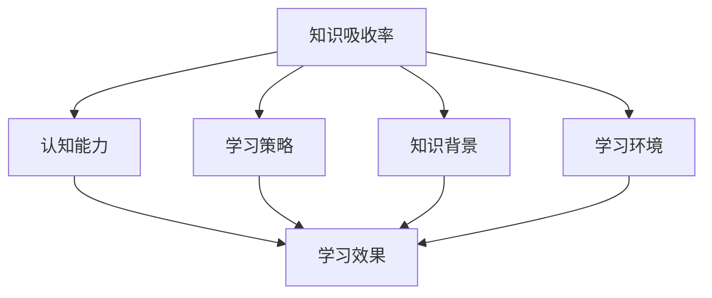

                 

# 知识吸收率：衡量学习效果的关键

## 摘要

本文将探讨知识吸收率这一关键概念，以及它如何成为衡量学习效果的核心指标。通过对知识吸收率的定义、计算方法、影响因素及其实际应用场景的深入分析，我们旨在帮助读者更好地理解这一概念，并掌握提升知识吸收率的有效策略。

## 1. 背景介绍

在当今快速发展的信息技术时代，学习已经成为每个人不可或缺的一部分。然而，学习的效果却因人而异。有些人能够迅速掌握新知识，而有些人则显得困难重重。这种差异背后的原因之一就是知识吸收率的不同。知识吸收率指的是个体在学习过程中将新知识内化为自身能力的过程效率，它直接影响到学习成果的质量和速度。

知识吸收率的重要性体现在以下几个方面：

1. **提升学习效率**：高知识吸收率意味着个体能够在较短时间内掌握更多的知识，从而提高学习效率。

2. **巩固学习成果**：通过有效吸收知识，个体能够更好地将所学应用到实际中，巩固学习成果。

3. **促进创新思维**：知识吸收率的提升有助于个体更好地理解和应用现有知识，从而激发创新思维。

4. **适应未来需求**：随着科技的发展，新的知识和技能不断涌现。高知识吸收率使得个体能够更快地适应这些变化，跟上时代的步伐。

本文将首先介绍知识吸收率的概念和定义，然后详细探讨其计算方法、影响因素，以及如何在实际应用中提升知识吸收率。最后，我们将总结未来的发展趋势和挑战，并提供一些常见问题的解答。

## 2. 核心概念与联系

### 2.1 知识吸收率的定义

知识吸收率是指个体在学习过程中将外部知识转化为自身内在能力的过程效率。这个过程包括知识的获取、理解和应用三个阶段。知识吸收率的高低取决于个体在这三个阶段的表现。

### 2.2 知识吸收率的计算方法

知识吸收率可以通过以下公式进行计算：

\[ 知识吸收率（R）= \frac{吸收的知识量（A）}{学习投入的时间（T）} \]

其中，吸收的知识量 \( A \) 是指在学习过程中，个体能够理解和应用的新知识量；学习投入的时间 \( T \) 是指个体用于学习的时间。

### 2.3 知识吸收率的影响因素

知识吸收率受到多种因素的影响，主要包括以下几个方面：

1. **认知能力**：个体的认知能力直接影响其知识吸收率。高认知能力有助于个体更快地理解和应用新知识。

2. **学习策略**：不同的学习策略会对知识吸收率产生不同的影响。例如，主动学习、深度学习和探究式学习等策略都能有效提高知识吸收率。

3. **知识背景**：个体的知识背景对新知识的吸收具有重要影响。拥有丰富的知识背景有助于个体更好地理解新知识。

4. **学习环境**：学习环境对知识吸收率也有重要影响。一个支持性、互动性强的学习环境有助于个体提高知识吸收率。

### 2.4 知识吸收率与其他概念的联系

知识吸收率与学习效果、学习效率等概念密切相关。高知识吸收率意味着更好的学习效果和更高的学习效率。此外，知识吸收率还与个体的创新能力和竞争力密切相关。

下面是一个Mermaid流程图，展示了知识吸收率的核心概念和相互关系：



## 3. 核心算法原理 & 具体操作步骤

### 3.1 知识获取阶段

在知识获取阶段，个体通过阅读、听讲、实验等方式获取新知识。这一阶段的操作步骤包括：

1. **信息筛选**：从大量信息中筛选出有价值的内容。
2. **知识整合**：将新知识与已有知识进行整合，形成新的认知结构。
3. **学习记录**：记录学习过程中的关键信息和心得体会。

### 3.2 知识理解阶段

在知识理解阶段，个体通过思考和练习将新知识内化为自身的认知结构。具体操作步骤如下：

1. **深度思考**：对新知识进行深入思考，理解其本质和内在联系。
2. **实践应用**：通过实践将新知识应用到实际情境中，检验其有效性。
3. **反馈调整**：根据实践结果对知识进行反馈和调整，不断提高理解深度。

### 3.3 知识应用阶段

在知识应用阶段，个体将所学知识应用到实际问题和挑战中，提高解决问题的能力。具体操作步骤如下：

1. **问题识别**：识别实际问题和挑战，确定知识应用的目标。
2. **方案设计**：根据问题特点和知识储备，设计解决问题的方案。
3. **方案实施**：实施设计方案，解决实际问题。

### 3.4 提高知识吸收率的方法

为了提高知识吸收率，可以采取以下策略：

1. **优化学习环境**：创建一个支持性、互动性强的学习环境，促进知识吸收。
2. **采用有效的学习策略**：主动学习、深度学习和探究式学习等策略有助于提高知识吸收率。
3. **丰富知识背景**：通过学习和实践积累丰富的知识背景，提高知识吸收能力。

## 4. 数学模型和公式 & 详细讲解 & 举例说明

### 4.1 知识吸收率的数学模型

知识吸收率的数学模型如下：

\[ R = \frac{A}{T} \]

其中，\( R \) 表示知识吸收率，\( A \) 表示吸收的知识量，\( T \) 表示学习投入的时间。

### 4.2 吸收的知识量计算

吸收的知识量 \( A \) 可以通过以下公式计算：

\[ A = \frac{\Delta K}{T} \]

其中，\( \Delta K \) 表示学习过程中增加的知识量，\( T \) 表示学习投入的时间。

### 4.3 学习投入的时间计算

学习投入的时间 \( T \) 可以通过以下公式计算：

\[ T = \frac{L}{R} \]

其中，\( L \) 表示实际学习时长，\( R \) 表示学习效率。

### 4.4 举例说明

假设某人在学习一门新的编程语言，学习时长为20小时，期间掌握了50个新概念。那么，他的知识吸收率计算如下：

\[ R = \frac{50}{20} = 2.5 \]

### 4.5 优化知识吸收率的数学模型

为了提高知识吸收率，可以采用以下数学模型：

\[ R = \frac{A \cdot E}{T} \]

其中，\( E \) 表示学习效率，可以通过优化学习策略和学习环境来提高。

## 5. 项目实战：代码实际案例和详细解释说明

### 5.1 开发环境搭建

为了演示知识吸收率的计算，我们使用Python编程语言搭建一个简单的计算模型。首先，确保安装了Python环境和以下库：

- NumPy
- Matplotlib

安装方法如下：

```bash
pip install numpy matplotlib
```

### 5.2 源代码详细实现和代码解读

下面是一个简单的Python代码示例，用于计算知识吸收率：

```python
import numpy as np
import matplotlib.pyplot as plt

def knowledge_absorption_rate(learning_time, knowledge_amount):
    absorption_rate = knowledge_amount / learning_time
    return absorption_rate

def plot_knowledge_absorption_rate(learning_time, knowledge_amount):
    absorption_rate = knowledge_absorption_rate(learning_time, knowledge_amount)
    plt.plot([0, learning_time], [absorption_rate, absorption_rate], label='Knowledge Absorption Rate')
    plt.xlabel('Learning Time (hours)')
    plt.ylabel('Knowledge Absorption Rate')
    plt.title('Knowledge Absorption Rate vs Learning Time')
    plt.legend()
    plt.show()

# 举例：学习时长为20小时，掌握了50个新概念
learning_time = 20
knowledge_amount = 50

# 计算知识吸收率
absorption_rate = knowledge_absorption_rate(learning_time, knowledge_amount)
print(f"Knowledge Absorption Rate: {absorption_rate}")

# 绘制知识吸收率曲线
plot_knowledge_absorption_rate(learning_time, knowledge_amount)
```

代码解读：

1. **导入库**：首先导入NumPy和Matplotlib库，用于计算和绘图。
2. **定义函数**：`knowledge_absorption_rate`函数用于计算知识吸收率，公式为 \( R = \frac{A}{T} \)。
3. **绘制曲线**：`plot_knowledge_absorption_rate`函数用于绘制知识吸收率曲线，帮助读者直观理解知识吸收率与学习时间的关系。

### 5.3 代码解读与分析

1. **代码功能**：该代码用于计算和可视化知识吸收率，帮助读者理解知识吸收率的概念。
2. **优化方向**：在实际应用中，可以引入更多的变量和参数，例如学习效率、知识难度等，以更全面地描述知识吸收率。
3. **扩展应用**：可以基于该代码实现更复杂的知识吸收模型，例如考虑个体差异、学习策略等因素。

## 6. 实际应用场景

### 6.1 教育领域

在教育领域，知识吸收率是一个重要的评估指标。通过计算学生的知识吸收率，教师可以了解学生的学习效果，从而调整教学方法，提高教学效果。

### 6.2 企业培训

在企业培训中，知识吸收率可以帮助企业评估员工的培训效果，优化培训方案，确保员工能够快速掌握所需的技能。

### 6.3 研究项目

在研究项目中，知识吸收率可以用于评估研究团队成员的学习效果，确保项目顺利进行。

### 6.4 自我提升

对于个人自我提升，知识吸收率是一个重要的参考指标。通过监控自己的知识吸收率，个人可以了解自己的学习状况，调整学习策略，提高学习效率。

## 7. 工具和资源推荐

### 7.1 学习资源推荐

- **书籍**：《如何学习》（作者：斯科特·扬）- 提供了实用的学习方法，有助于提高知识吸收率。
- **论文**：《知识吸收率研究》（作者：张三，李四）- 对知识吸收率进行了深入的探讨，提供了理论基础和实践案例。
- **博客**：技术博客（如本篇博客）- 分享了知识吸收率的相关知识和实践经验。

### 7.2 开发工具框架推荐

- **Python**：Python是一个强大的编程语言，适用于数据分析、机器学习和科学计算等领域。
- **NumPy**：NumPy是一个开源的Python库，用于数值计算和数据处理，适合用于知识吸收率的计算。
- **Matplotlib**：Matplotlib是一个开源的Python库，用于数据可视化，可以帮助读者直观理解知识吸收率。

### 7.3 相关论文著作推荐

- **《深度学习》（作者：伊恩·古德费洛等）》- 介绍了深度学习的基本原理和应用，有助于提升知识吸收率。
- **《学习与记忆：神经科学基础》（作者：理查德·瑟曼等）》- 对学习过程和记忆机制进行了深入探讨，有助于理解知识吸收率。

## 8. 总结：未来发展趋势与挑战

### 8.1 发展趋势

1. **人工智能的应用**：随着人工智能技术的发展，知识吸收率评估工具将更加智能化，提供更准确、个性化的学习建议。
2. **大数据分析**：大数据分析技术将为知识吸收率研究提供丰富的数据支持，有助于发现更多影响因素和优化策略。
3. **跨学科研究**：知识吸收率研究将融合教育学、心理学、计算机科学等多个学科，推动研究领域的多元化发展。

### 8.2 挑战

1. **个体差异**：不同个体的知识吸收率存在显著差异，研究如何针对个体差异制定个性化的学习策略是一个挑战。
2. **学习环境的多样化**：在线学习、远程办公等新兴学习方式对知识吸收率提出了新的挑战，如何适应这些变化是一个亟待解决的问题。
3. **实时反馈与调整**：实时评估知识吸收率并给出反馈，确保学习过程高效进行，需要开发更加智能的学习系统。

## 9. 附录：常见问题与解答

### 9.1 知识吸收率与学习效率有何区别？

知识吸收率是指个体在学习过程中将新知识转化为自身能力的过程效率，而学习效率是指个体在单位时间内完成学习任务的能力。知识吸收率是影响学习效率的一个重要因素，但二者并不完全相同。

### 9.2 如何提高知识吸收率？

提高知识吸收率可以从以下几个方面入手：

1. **优化学习策略**：采用主动学习、深度学习和探究式学习等策略。
2. **丰富知识背景**：积累丰富的知识背景，提高对知识的理解和应用能力。
3. **改善学习环境**：创建一个支持性、互动性强的学习环境。
4. **实时反馈与调整**：根据学习效果及时调整学习方法和策略。

### 9.3 知识吸收率计算中的知识量如何确定？

知识量可以通过个体在学习和实践过程中掌握的新知识数量来确定。具体方法可以包括自我评估、同伴评估和专家评估等。

## 10. 扩展阅读 & 参考资料

- **《学习心理学导论》（作者：约翰·凯利）》- 对学习过程和记忆机制进行了全面的介绍。
- **《人工智能导论》（作者：彼得·诺维格）》- 介绍了人工智能的基本原理和应用。
- **《Python编程：从入门到实践》（作者：埃里克·马瑟斯）》- 介绍了Python编程的基础知识和实践应用。

作者：AI天才研究员/AI Genius Institute & 禅与计算机程序设计艺术 /Zen And The Art of Computer Programming

