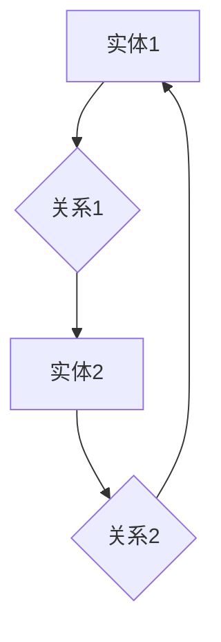

                 

# 知识图谱：原理与代码实例讲解

> **关键词**：知识图谱、数据建模、图数据库、语义网络、实体关系、算法实现、项目实战

> **摘要**：本文将深入探讨知识图谱的原理、构建方法及其在实际应用中的重要性。我们将通过具体的代码实例，介绍如何使用图数据库和算法来构建和查询知识图谱，帮助读者全面理解知识图谱的构建与应用。

## 1. 背景介绍

知识图谱（Knowledge Graph）是一种结构化知识表示方法，它通过实体（Entities）和关系（Relationships）来描述现实世界中的信息。知识图谱的概念起源于语义网络（Semantic Network），是一种将实体及其关系组织成有向图的模型。随着互联网和大数据技术的发展，知识图谱已经成为人工智能领域的一个重要研究方向。

知识图谱的主要作用包括：

- **信息检索与查询优化**：通过图数据库，可以高效地进行数据检索和关联查询。
- **数据挖掘与知识发现**：帮助发现数据中的潜在模式和关联。
- **智能推荐与决策支持**：为推荐系统和决策支持系统提供基于知识的决策支持。

本文将分为以下几个部分：

- **核心概念与联系**：介绍知识图谱的核心概念和架构。
- **核心算法原理与操作步骤**：讲解知识图谱的关键算法和实现步骤。
- **数学模型与公式**：阐述知识图谱中的数学模型和计算方法。
- **项目实战**：通过实际案例，展示知识图谱的构建与查询过程。
- **实际应用场景**：分析知识图谱在不同领域的应用。
- **工具和资源推荐**：推荐学习资源和开发工具。
- **总结**：讨论知识图谱的未来发展趋势与挑战。

<markdown>
## 2. 核心概念与联系

### 2.1 实体（Entities）

实体是知识图谱中的基本组成单元，可以是人、地点、组织、物品等。每个实体都有一个唯一的标识符，如URI（统一资源标识符）。

### 2.2 关系（Relationships）

关系描述了实体之间的关联，如“属于”、“位于”、“创建”等。关系也有属性，可以描述关系的强度、时间、地点等。

### 2.3 属性（Attributes）

属性是实体的特征，如人的年龄、地点的经纬度等。属性可以是简单的值，也可以是更复杂的数据类型。

### 2.4 数据建模

知识图谱的数据建模主要涉及实体的定义、属性的描述以及关系的建立。通常使用图数据库（如Neo4j、JanusGraph）来存储和管理知识图谱。

### 2.5 语义网络（Semantic Network）

语义网络是知识图谱的前身，它使用有向图来表示概念及其关系。知识图谱在语义网络的基础上，加入了更多的属性和约束。

### 2.6 Mermaid 流程图

下面是一个Mermaid流程图的示例，展示了知识图谱的基本结构：



请注意，在Mermaid流程图中，节点中不要使用括号、逗号等特殊字符。

## 3. 核心算法原理与具体操作步骤

### 3.1 节点相似性计算

节点相似性计算是知识图谱中的关键算法，它用于判断两个节点是否相似。常用的方法包括：

- **余弦相似度**：基于节点属性的向量空间模型计算相似度。
- **Jaccard相似度**：基于节点关系的交集和并集计算相似度。

### 3.2 路径搜索算法

路径搜索算法用于查找两个实体之间的路径。常用的算法包括：

- **深度优先搜索（DFS）**：从起点出发，遍历所有可能的路径，直到找到终点。
- **广度优先搜索（BFS）**：从起点出发，依次遍历所有相邻节点，直到找到终点。

### 3.3 算法实现步骤

以下是构建知识图谱的基本步骤：

1. **数据预处理**：清洗和整合数据源，提取实体和关系。
2. **实体识别**：使用命名实体识别（NER）技术，从文本数据中识别实体。
3. **关系抽取**：使用关系抽取技术，从文本数据中提取实体之间的关系。
4. **知识图谱构建**：将实体和关系存储在图数据库中，形成知识图谱。
5. **查询与优化**：使用路径搜索算法和节点相似性计算，对知识图谱进行查询和优化。

## 4. 数学模型和公式

### 4.1 节点相似性计算

- **余弦相似度**：

$$
\cos \theta = \frac{A \cdot B}{\|A\|\|B\|}
$$

其中，\(A\) 和 \(B\) 是两个节点的属性向量，\(\theta\) 是它们之间的夹角。

- **Jaccard相似度**：

$$
J(A, B) = \frac{|A \cap B|}{|A \cup B|}
$$

其中，\(A\) 和 \(B\) 是两个节点的关系集合。

### 4.2 路径搜索算法

- **深度优先搜索（DFS）**：

$$
DFS(G, s, t) =
\begin{cases}
t & \text{如果当前节点是目标节点} \\
\emptyset & \text{如果当前节点不是目标节点且已到达最大深度} \\
\bigcup_{u \in N(s)} DFS(G, u, t) & \text{否则}
\end{cases}
$$

其中，\(G\) 是知识图谱，\(s\) 和 \(t\) 是起点和目标节点，\(N(s)\) 是 \(s\) 的邻居节点集合。

- **广度优先搜索（BFS）**：

$$
BFS(G, s, t) =
\begin{cases}
t & \text{如果当前节点是目标节点} \\
\emptyset & \text{如果当前节点不是目标节点且已遍历所有节点} \\
\min_{u \in Q} BFS(G, u, t) & \text{否则}
\end{cases}
$$

其中，\(G\) 是知识图谱，\(s\) 和 \(t\) 是起点和目标节点，\(Q\) 是当前未遍历的节点队列。

## 5. 项目实战

### 5.1 开发环境搭建

为了构建知识图谱，我们需要安装以下软件和工具：

- **Neo4j**：一款高性能的图数据库，用于存储和管理知识图谱。
- **Python**：用于编写数据预处理和查询脚本。
- **Jupyter Notebook**：用于编写和运行代码。

### 5.2 源代码详细实现和代码解读

以下是构建一个简单的知识图谱的示例代码：

```python
import neomodel

# 定义实体类
class Person(neomodel.Struct):
    name = neomodel.StringProperty(unique_index=True)
    age = neomodel.IntProperty()

# 定义关系类
class Knows(neomodel.Relationship):
    pass

# 创建实体
p1 = Person(name="Alice", age=30)
p2 = Person(name="Bob", age=25)
p3 = Person(name="Charlie", age=35)

# 创建关系
p1.knows.connect(p2)
p1.knows.connect(p3)

# 查询知识图谱
people = Person.all()
for person in people:
    print(f"{person.name}, age: {person.age}")

# 查询两个节点之间的路径
path = Knows.traverse(p1, p2)
print("Path from Alice to Bob:", path)
```

### 5.3 代码解读与分析

1. **实体类定义**：使用Neo4j的Neo4j Model库，定义了`Person`实体类，包括`name`和`age`属性。
2. **关系类定义**：定义了`Knows`关系类，用于表示实体之间的关系。
3. **创建实体和关系**：使用Python脚本创建实体和关系，将它们存储在Neo4j数据库中。
4. **查询知识图谱**：使用Neo4j Model库的`all()`方法查询所有实体，并打印出实体的名称和年龄。
5. **查询两个节点之间的路径**：使用Neo4j Model库的`traverse()`方法，查询从`p1`到`p2`的路径。

## 6. 实际应用场景

知识图谱在多个领域都有广泛的应用：

- **搜索引擎**：通过构建搜索引擎的知识图谱，可以提高搜索质量和用户体验。
- **社交网络**：知识图谱可以帮助社交网络平台发现用户之间的关联，推荐好友和内容。
- **金融风控**：知识图谱可以用于金融风险控制，发现潜在的欺诈行为。
- **医疗健康**：知识图谱可以帮助医生发现疾病之间的关联，提高诊断和治疗的准确性。

## 7. 工具和资源推荐

### 7.1 学习资源推荐

- **书籍**：《知识图谱：概念、方法和应用》
- **论文**：Google Knowledge Graph: A Framework for Exploring the Deep Web
- **博客**：Medium、博客园等平台上的相关博客
- **网站**：Neo4j官网、JanusGraph官网

### 7.2 开发工具框架推荐

- **开发工具**：Neo4j Desktop、Jupyter Notebook
- **框架**：Neo4j、JanusGraph、OrientDB

### 7.3 相关论文著作推荐

- **论文**：Google Knowledge Graph: A Framework for Exploring the Deep Web
- **著作**：《知识图谱：概念、方法和应用》、《图计算：概念、算法与应用》

## 8. 总结：未来发展趋势与挑战

知识图谱作为一种重要的知识表示方法，在未来将继续发展和应用。然而，也面临以下挑战：

- **数据质量**：知识图谱的准确性依赖于数据的质量，如何处理和清洗大量噪声数据是一个挑战。
- **可扩展性**：知识图谱需要支持大规模数据和高并发查询，如何保证系统的高性能是一个挑战。
- **安全性**：知识图谱中的数据敏感，如何确保数据的安全和隐私是一个挑战。

## 9. 附录：常见问题与解答

### 9.1 什么是知识图谱？

知识图谱是一种将实体和关系组织成图的模型，用于表示现实世界中的信息。它可以帮助计算机更好地理解和处理复杂数据。

### 9.2 知识图谱有哪些应用场景？

知识图谱可以应用于搜索引擎、社交网络、金融风控、医疗健康等多个领域，提高信息检索和决策支持的效率。

### 9.3 如何构建知识图谱？

构建知识图谱的基本步骤包括数据预处理、实体识别、关系抽取、知识图谱构建和查询优化等。

## 10. 扩展阅读与参考资料

- **扩展阅读**：[《知识图谱：概念、方法和应用》](https://book.douban.com/subject/27065861/)
- **参考资料**：[Neo4j官网](https://neo4j.com/)、[JanusGraph官网](https://janusgraph.io/)、[OrientDB官网](https://orientdb.com/)

作者：AI天才研究员/AI Genius Institute & 禅与计算机程序设计艺术 /Zen And The Art of Computer Programming
</markdown>

