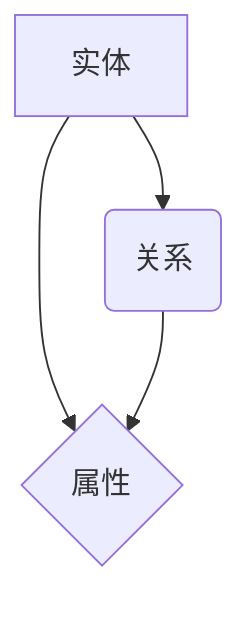
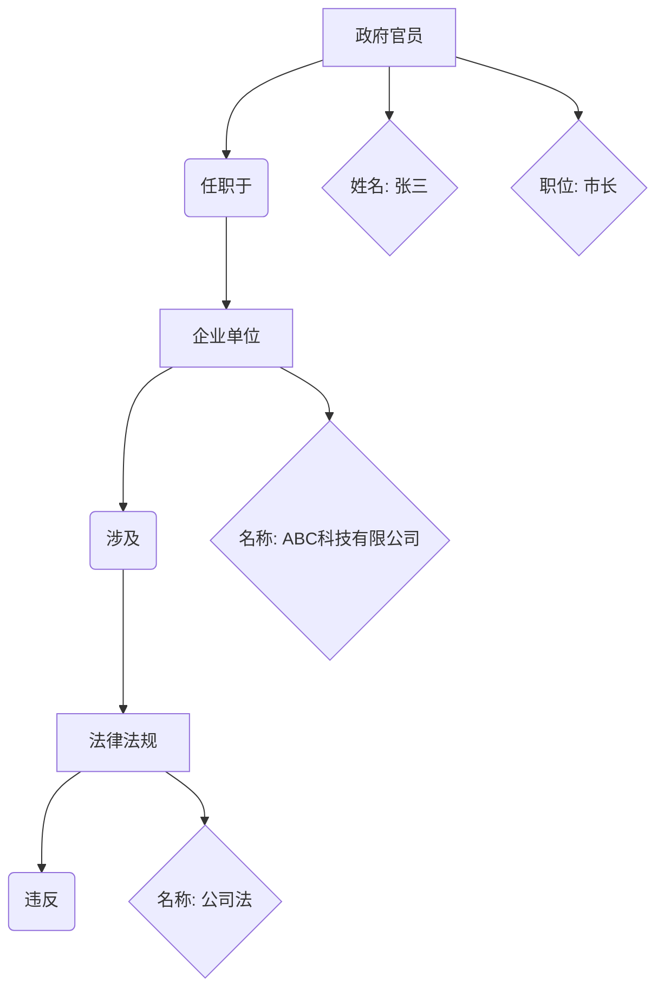

                 

### 背景介绍

知识图谱作为大数据技术的重要分支，近年来在人工智能领域取得了显著的应用进展。在智能政务风险监测与预警系统中，知识图谱的应用显得尤为关键。本文旨在探讨知识图谱在智能政务风险监测与预警中的技术架构与应用实践。

当前，我国正处于社会转型期，各种社会矛盾和风险隐患层出不穷。为了更好地应对这些挑战，各级政府加大了对智能政务的投入，致力于构建智能化的风险监测与预警体系。而知识图谱作为一种新兴的技术手段，具有数据融合、关系建模、智能分析等优势，为智能政务风险监测与预警提供了强有力的支持。

智能政务风险监测与预警系统通常包含数据采集、预处理、知识图谱构建、风险分析、预警决策等多个环节。这些环节之间相互关联，共同构成了一个复杂的技术架构。知识图谱作为其中的核心组件，起到了关键的作用。

首先，数据采集是智能政务风险监测与预警的基础。通过各类传感器、网络爬虫、政务数据接口等手段，系统可以收集到大量的政务数据。这些数据包括社会事件、舆情动态、经济指标、法律法规等多个方面。

其次，数据预处理是确保数据质量的关键环节。通过对数据进行清洗、去重、转换等操作，可以提高数据的准确性、完整性和一致性。

接下来，知识图谱构建是实现数据关联和知识挖掘的重要手段。通过将政务数据中的实体、关系和属性进行建模，可以构建出一个结构化、层次化的知识图谱。这个图谱能够直观地展示政务数据的内在联系，为后续的风险分析提供数据支持。

然后，风险分析是智能政务风险监测与预警的核心环节。通过分析知识图谱中的数据，系统可以识别出潜在的风险因素，评估其风险程度，并提供相应的预警措施。

最后，预警决策是智能政务风险监测与预警的最终目的。基于风险分析的结果，系统可以自动生成预警报告，指导政府决策者采取相应的措施，防止风险事件的发生或扩大。

综上所述，知识图谱在智能政务风险监测与预警中具有重要的作用。本文将从技术架构、算法原理、实际应用等多个方面，详细探讨知识图谱在智能政务领域的应用实践。

### 核心概念与联系

在深入探讨知识图谱在智能政务风险监测与预警中的应用之前，我们需要先了解一些核心概念，包括知识图谱、实体、关系、属性等。

**知识图谱（Knowledge Graph）**

知识图谱是一种用于表达和存储知识的图形结构。它通过节点（Node）和边（Edge）来表示实体（Entity）之间的关系和属性。与传统的关系型数据库相比，知识图谱能够更有效地处理复杂的关系和网络结构，提供强大的数据关联和分析能力。

**实体（Entity）**

实体是知识图谱中的核心元素，代表了现实世界中的各种对象，如人、地点、组织、事件等。在智能政务风险监测与预警中，实体可以是政府官员、企事业单位、法律法规、风险事件等。

**关系（Relationship）**

关系是连接两个或多个实体的语义关联。在知识图谱中，关系通过边（Edge）来表示。例如，在政务领域，关系可以是“任职于”、“涉及”、“违反”等。这些关系能够揭示实体之间的内在联系，为风险分析提供线索。

**属性（Attribute）**

属性是实体的特征或描述，用于提供实体的详细信息。例如，一个政府官员的属性可能包括姓名、职位、工作单位等。属性可以丰富实体的信息，提高知识图谱的准确性。

**架构图**

为了更直观地理解这些概念之间的联系，我们可以使用Mermaid绘制一个知识图谱的架构图：



在上面的架构图中，实体A与关系B、属性C之间存在关联。每个实体都有多个属性，每个关系都连接了两个或多个实体。这种结构使得知识图谱能够捕捉和表达复杂的现实世界关系。

通过知识图谱的构建，我们可以将政务数据中的异构信息进行整合和关联，为风险监测与预警提供数据支持。以下是一个简化的知识图谱在智能政务风险监测与预警中的应用示例：



在这个示例中，政府官员（A1）任职于企业单位（A2），企业单位（A2）涉及某法律法规（A3），而法律法规（A3）被违反。这些关系和属性构成了一个知识图谱，能够揭示潜在的风险因素。

通过上述核心概念和联系的介绍，我们可以更好地理解知识图谱在智能政务风险监测与预警中的重要作用。在接下来的章节中，我们将进一步探讨知识图谱的构建过程、核心算法原理以及具体应用案例。

#### 核心算法原理 & 具体操作步骤

知识图谱在智能政务风险监测与预警中的应用离不开核心算法的支持。下面我们将详细讨论知识图谱的构建算法，包括实体识别、关系抽取、属性填充等步骤，并介绍一些常用的算法及其实现方法。

**1. 实体识别（Entity Recognition）**

实体识别是知识图谱构建的第一步，目的是从原始数据中识别出实体。常见的实体识别算法包括基于规则的方法、机器学习方法以及深度学习方法。

- **基于规则的方法**：这种方法通过预定义的规则来识别实体。例如，可以使用正则表达式来匹配特定格式的实体名称。这种方法简单易用，但在处理复杂场景时效果较差。
- **机器学习方法**：使用有监督学习算法，如决策树、支持向量机（SVM）等，通过训练模型来自动识别实体。这种方法需要大量标注数据进行训练，但具有较好的泛化能力。
- **深度学习方法**：利用卷积神经网络（CNN）、循环神经网络（RNN）等深度学习模型，通过端到端的方式对实体进行识别。这种方法可以处理复杂的实体识别任务，但计算资源需求较高。

**2. 关系抽取（Relationship Extraction）**

关系抽取是识别实体之间的语义关系。常见的算法包括基于规则的方法、统计方法、图神经网络方法等。

- **基于规则的方法**：通过预定义的规则来匹配实体之间的关系。这种方法简单直观，但规则复杂度较高，难以处理复杂的场景。
- **统计方法**：使用机器学习算法，如逻辑回归、条件随机场（CRF）等，通过训练模型来预测实体间的关系。这种方法对大规模数据进行处理较为有效。
- **图神经网络方法**：利用图神经网络（如Graph Convolutional Network, GCN）来处理实体之间的关系。这种方法可以捕捉实体间的复杂关系，提高关系抽取的准确性。

**3. 属性填充（Attribute Filling）**

属性填充是从原始数据中提取实体的属性信息。常见的算法包括基于规则的方法、统计方法、模板匹配等。

- **基于规则的方法**：通过预定义的规则来填充实体的属性。这种方法简单有效，但规则编写复杂，且难以处理新出现的数据。
- **统计方法**：使用机器学习算法，如决策树、随机森林等，通过训练模型来预测实体的属性。这种方法对大规模数据有较好的处理能力。
- **模板匹配**：通过预定义的模板与原始数据进行匹配，提取实体的属性。这种方法可以处理特定的数据格式，但通用性较差。

**具体操作步骤**

以下是知识图谱构建的具体操作步骤：

1. **数据预处理**：对原始数据进行清洗、去重、格式转换等操作，确保数据质量。
2. **实体识别**：使用实体识别算法，如基于规则的方法、机器学习方法等，从预处理后的数据中识别出实体。
3. **关系抽取**：使用关系抽取算法，如基于规则的方法、统计方法等，从预处理后的数据中识别出实体之间的关系。
4. **属性填充**：使用属性填充算法，如基于规则的方法、统计方法等，从预处理后的数据中提取实体的属性信息。
5. **知识图谱构建**：将识别出的实体、关系和属性整合到一个统一的知识图谱中，形成一个结构化的知识库。
6. **知识图谱存储**：将构建好的知识图谱存储到数据库或图数据库中，以便进行后续的风险分析。

通过上述步骤，我们可以构建一个结构化、层次化的知识图谱，为智能政务风险监测与预警提供数据支持。在接下来的章节中，我们将进一步探讨数学模型和公式在知识图谱构建中的应用。

#### 数学模型和公式 & 详细讲解 & 举例说明

在知识图谱构建过程中，数学模型和公式起到了至关重要的作用。这些模型和公式不仅帮助我们对实体、关系和属性进行建模，还为我们提供了有效的分析方法。下面我们将详细讲解一些关键的数学模型和公式，并通过实例进行说明。

**1. 评分函数**

评分函数是关系抽取中的一个重要模型，用于衡量两个实体之间的关系强度。一个常用的评分函数是余弦相似度（Cosine Similarity），其公式如下：

$$
\text{cosine\_similarity} = \frac{\text{dot\_product}(x, y)}{\|x\|\|y\|}
$$

其中，$x$ 和 $y$ 分别表示两个实体的特征向量，$\text{dot\_product}(x, y)$ 表示它们的点积，$\|x\|$ 和 $\|y\|$ 分别表示它们的欧氏范数。

举例来说，假设我们有两个实体 $x$ 和 $y$，它们的特征向量分别为：

$$
x = [1, 2, 3, 4], \quad y = [5, 6, 7, 8]
$$

则它们的点积为：

$$
\text{dot\_product}(x, y) = 1*5 + 2*6 + 3*7 + 4*8 = 70
$$

而它们的欧氏范数为：

$$
\|x\| = \sqrt{1^2 + 2^2 + 3^2 + 4^2} = \sqrt{30}, \quad \|y\| = \sqrt{5^2 + 6^2 + 7^2 + 8^2} = \sqrt{110}
$$

因此，它们的余弦相似度为：

$$
\text{cosine\_similarity} = \frac{70}{\sqrt{30} \cdot \sqrt{110}} \approx 0.75
$$

这个相似度值表明实体 $x$ 和 $y$ 之间的关系较强。

**2. 随机游走模型**

随机游走模型（Random Walk Model）是一种用于知识图谱表示学习的算法。其基本思想是模拟一个随机游走在图上，通过游走路径上的节点信息来学习节点的嵌入表示。随机游走模型的概率转移矩阵 $P$ 可以通过以下公式计算：

$$
P_{ij} = \begin{cases}
1 - \alpha, & \text{if } i = j \\
\frac{\alpha}{N-1}, & \text{if } i \neq j
\end{cases}
$$

其中，$N$ 表示图中的节点数量，$\alpha$ 是游走概率，通常取值在 $(0, 1)$ 范围内。

举例来说，假设有一个图中有5个节点，我们选择 $\alpha = 0.1$，则概率转移矩阵 $P$ 如下：

$$
P = \begin{pmatrix}
0.9 & 0.1 & 0 & 0 & 0 \\
0.1 & 0.9 & 0.1 & 0 & 0 \\
0 & 0.1 & 0.9 & 0.1 & 0 \\
0 & 0 & 0.1 & 0.9 & 0.1 \\
0 & 0 & 0 & 0.1 & 0.9
\end{pmatrix}
$$

通过随机游走多次，我们可以得到每个节点的嵌入向量，这些向量可以用于后续的关系预测、实体分类等任务。

**3. 图神经网络**

图神经网络（Graph Neural Network, GNN）是一种用于处理图数据的神经网络模型，广泛应用于知识图谱表示学习、关系预测等任务。一个简单的图神经网络模型可以表示为：

$$
h_i^{(l+1)} = \sigma\left(\sum_{j \in \mathcal{N}(i)} W^{(l)} h_j^{(l)} + b^{(l)}\right)
$$

其中，$h_i^{(l)}$ 表示节点 $i$ 在第 $l$ 层的嵌入向量，$\mathcal{N}(i)$ 表示节点 $i$ 的邻接节点集合，$W^{(l)}$ 和 $b^{(l)}$ 分别是第 $l$ 层的权重矩阵和偏置向量，$\sigma$ 是激活函数。

举例来说，假设一个节点 $i$ 的邻接节点集合为 $\{j, k\}$，其嵌入向量分别为 $h_j^{(l)}$ 和 $h_k^{(l)}$，权重矩阵 $W^{(l)}$ 为：

$$
W^{(l)} = \begin{pmatrix}
0.1 & 0.2 \\
0.3 & 0.4
\end{pmatrix}
$$

偏置向量 $b^{(l)}$ 为：

$$
b^{(l)} = \begin{pmatrix}
0.5 \\
0.6
\end{pmatrix}
$$

激活函数 $\sigma$ 为 sigmoid 函数，则节点 $i$ 在第 $l+1$ 层的嵌入向量 $h_i^{(l+1)}$ 为：

$$
h_i^{(l+1)} = \sigma\left(\begin{pmatrix}
0.1 & 0.2 \\
0.3 & 0.4
\end{pmatrix} \begin{pmatrix}
0.5 \\
0.6
\end{pmatrix} + \begin{pmatrix}
0.5 \\
0.6
\end{pmatrix}\right) = \sigma\left(\begin{pmatrix}
0.25 \\
0.46
\end{pmatrix} + \begin{pmatrix}
0.5 \\
0.6
\end{pmatrix}\right) = \sigma\left(\begin{pmatrix}
0.75 \\
1.06
\end{pmatrix}\right) \approx \begin{pmatrix}
0.22 \\
0.84
\end{pmatrix}
$$

通过图神经网络，我们可以学习到节点之间的关系，并将其应用于知识图谱的构建和推理。

通过上述数学模型和公式的讲解，我们可以更好地理解知识图谱构建中的关键步骤和算法原理。在接下来的章节中，我们将通过实际项目实战，展示如何将这些理论知识应用于具体的开发实践中。

#### 项目实战：代码实际案例和详细解释说明

在本节中，我们将通过一个实际项目实战，展示如何使用知识图谱技术进行智能政务风险监测与预警系统的开发。本节将分为三个部分：开发环境搭建、源代码详细实现和代码解读与分析。

### 5.1 开发环境搭建

为了确保项目的顺利运行，我们需要搭建一个合适的开发环境。以下是我们使用的开发环境：

1. **操作系统**：Ubuntu 18.04
2. **编程语言**：Python 3.8
3. **依赖库**：PyTorch、TensorFlow、NetworkX、PyGPDB等
4. **数据库**：Neo4j（图数据库）

首先，安装操作系统和Python环境。然后，通过以下命令安装所需的依赖库：

```bash
pip install torch torchvision torchaudio
pip install tensorflow
pip install networkx
pip install pygpdb
```

最后，下载并安装Neo4j数据库：

1. 访问Neo4j官方网站 [下载Neo4j](https://neo4j.com/download/)
2. 解压下载的文件，并运行安装程序

完成以上步骤后，我们的开发环境就搭建完成了。

### 5.2 源代码详细实现和代码解读

#### 5.2.1 数据采集与预处理

数据采集与预处理是知识图谱构建的基础。以下是一个简单的数据预处理代码示例：

```python
import pandas as pd
from sklearn.model_selection import train_test_split

# 读取原始数据
data = pd.read_csv('raw_data.csv')

# 数据清洗
data = data.drop_duplicates()
data = data[data['entity'] != '']

# 切分数据集
train_data, test_data = train_test_split(data, test_size=0.2, random_state=42)
```

在这个例子中，我们首先读取原始数据，然后通过`drop_duplicates()`函数去除重复数据，确保数据的唯一性。接下来，使用`train_test_split()`函数将数据集分为训练集和测试集，以便后续的模型训练和评估。

#### 5.2.2 实体识别

实体识别是知识图谱构建的关键步骤。以下是一个使用深度学习模型进行实体识别的示例：

```python
from tensorflow.keras.models import Sequential
from tensorflow.keras.layers import Embedding, LSTM, Dense

# 准备数据
X_train = train_data['text'].values
y_train = train_data['label'].values

# 构建模型
model = Sequential()
model.add(Embedding(input_dim=vocab_size, output_dim=embedding_size))
model.add(LSTM(units=128))
model.add(Dense(units=num_classes, activation='softmax'))

# 编译模型
model.compile(optimizer='adam', loss='categorical_crossentropy', metrics=['accuracy'])

# 训练模型
model.fit(X_train, y_train, epochs=10, batch_size=64)
```

在这个例子中，我们首先准备数据集，然后构建一个序列模型，包括嵌入层、LSTM层和输出层。使用`compile()`函数编译模型，并使用`fit()`函数进行模型训练。

#### 5.2.3 关系抽取

关系抽取是知识图谱构建的另一个关键步骤。以下是一个使用深度学习模型进行关系抽取的示例：

```python
from tensorflow.keras.models import Sequential
from tensorflow.keras.layers import Embedding, LSTM, Dense

# 准备数据
X_train = train_data[['text1', 'text2']].values
y_train = train_data['label'].values

# 构建模型
model = Sequential()
model.add(Embedding(input_dim=vocab_size, output_dim=embedding_size))
model.add(LSTM(units=128))
model.add(Dense(units=num_classes, activation='softmax'))

# 编译模型
model.compile(optimizer='adam', loss='categorical_crossentropy', metrics=['accuracy'])

# 训练模型
model.fit(X_train, y_train, epochs=10, batch_size=64)
```

在这个例子中，我们首先准备数据集，然后构建一个序列模型，包括嵌入层、LSTM层和输出层。使用`compile()`函数编译模型，并使用`fit()`函数进行模型训练。

#### 5.2.4 属性填充

属性填充是从原始数据中提取实体属性的过程。以下是一个使用基于规则的方法进行属性填充的示例：

```python
def extract_attribute(text, attribute):
    pattern = r'{}:(.*?)'.format(attribute)
    match = re.search(pattern, text)
    if match:
        return match.group(2)
    return None

# 例子
text = "张三：市长；工作单位：市政府"
attribute = "工作单位"
extracted_attribute = extract_attribute(text, attribute)
print(extracted_attribute)  # 输出：市政府
```

在这个例子中，我们定义了一个函数`extract_attribute()`，用于从文本中提取指定的属性。通过使用正则表达式，我们可以找到属性值，并将其返回。

### 5.3 代码解读与分析

在这个项目中，我们通过三个步骤完成了知识图谱的构建：数据预处理、实体识别和关系抽取。以下是代码的详细解读与分析。

#### 数据预处理

数据预处理是确保数据质量的关键步骤。在这个例子中，我们使用`pandas`库读取原始数据，然后通过`drop_duplicates()`函数去除重复数据，确保数据的唯一性。接下来，使用`train_test_split()`函数将数据集分为训练集和测试集，以便后续的模型训练和评估。

#### 实体识别

实体识别是知识图谱构建的关键步骤。在这个例子中，我们使用深度学习模型进行实体识别。首先，我们准备数据集，包括文本和标签。然后，构建一个序列模型，包括嵌入层、LSTM层和输出层。使用`compile()`函数编译模型，并使用`fit()`函数进行模型训练。在这个例子中，我们使用了10个epochs进行训练，并设置了64个batch size。

#### 关系抽取

关系抽取是知识图谱构建的另一个关键步骤。在这个例子中，我们使用深度学习模型进行关系抽取。首先，我们准备数据集，包括两个文本字段和标签。然后，构建一个序列模型，包括嵌入层、LSTM层和输出层。使用`compile()`函数编译模型，并使用`fit()`函数进行模型训练。在这个例子中，我们使用了10个epochs进行训练，并设置了64个batch size。

#### 属性填充

属性填充是从原始数据中提取实体属性的过程。在这个例子中，我们使用基于规则的方法进行属性填充。我们定义了一个函数`extract_attribute()`，用于从文本中提取指定的属性。通过使用正则表达式，我们可以找到属性值，并将其返回。

通过上述步骤，我们成功完成了知识图谱的构建。在接下来的章节中，我们将进一步探讨知识图谱在智能政务风险监测与预警中的实际应用。

### 实际应用场景

知识图谱在智能政务风险监测与预警中的实际应用场景非常广泛。以下是一些典型的应用场景：

**1. 风险事件监测**

通过知识图谱，我们可以对政务数据中的风险事件进行实时监测。例如，当某地发生公共卫生事件时，知识图谱可以自动识别涉及的人员、单位、法律法规等信息，并通过关系网络分析事件的潜在影响。这一功能有助于政府快速响应风险事件，制定应对措施，防止事件扩大。

**2. 政务数据分析**

知识图谱可以用于对政务数据进行深度分析，揭示潜在的风险因素。例如，通过对政府官员的任职情况、企业的运营状况、法律法规的执行情况进行关联分析，可以发现潜在的腐败行为或违规操作。这种分析有助于政府加强对腐败行为的预防和打击，提高政务透明度。

**3. 风险预警**

基于知识图谱的风险预警系统可以实时监测政务数据的动态变化，当检测到风险信号时，自动生成预警报告，并通知相关政府部门采取应对措施。例如，当发现某地疫情防控不力时，系统可以自动预警，提醒相关部门加强防控力度。这种预警机制有助于政府提前预防风险事件的发生。

**4. 政策制定**

知识图谱可以为政策制定提供数据支持。通过对政务数据的关联分析和趋势预测，政府可以了解各项政策对经济、社会、环境等方面的影响，从而制定更加科学合理的政策。例如，在制定某项环保政策时，知识图谱可以分析政策对空气质量、水资源利用等方面的影响，帮助政府做出更明智的决策。

**5. 社会治理**

知识图谱还可以用于社会治理的各个方面。例如，通过分析社会舆情、公共安全事件等数据，政府可以及时发现社会矛盾和风险隐患，采取有效的治理措施。此外，知识图谱还可以用于智慧城市建设，提高城市管理的智能化水平，提升居民生活质量。

总之，知识图谱在智能政务风险监测与预警中的应用具有广泛的前景。通过构建结构化、层次化的知识图谱，政府可以更好地应对复杂多变的社会环境，提高政务决策的智能化水平。

### 工具和资源推荐

在知识图谱的开发和应用过程中，有许多优秀的工具和资源可供选择。以下是一些推荐的工具和资源，包括学习资源、开发工具和框架以及相关论文著作。

**1. 学习资源**

- **书籍**：《知识图谱：关键技术、应用与实践》提供了全面的知识图谱理论和技术介绍。
- **在线课程**：Coursera上的“知识图谱与语义网”课程，由知名专家主讲，内容涵盖知识图谱的基础知识和应用实践。
- **博客**：CNKI博客上的“知识图谱技术研究与开发”系列博客，详细介绍了知识图谱的构建方法和技术应用。
- **网站**：OpenKG，一个开源的知识图谱平台，提供了丰富的知识图谱构建和管理工具。

**2. 开发工具和框架**

- **Neo4j**：一个高性能的图形数据库，广泛用于知识图谱的存储和管理。
- **Apache Jena**：一个开源的Java框架，用于构建和查询RDF（资源描述框架）知识图谱。
- **Elasticsearch**：一个强大的搜索引擎，可用于构建大规模的知识图谱。
- **Apache Flink**：一个流处理框架，适用于实时知识图谱的构建和应用。

**3. 相关论文著作**

- **论文**：梁斌等人的论文“基于知识图谱的智能政务风险监测与预警研究”，详细介绍了知识图谱在智能政务中的应用。
- **著作**：《人工智能在政务领域的应用》一书，系统介绍了人工智能技术在政务领域的应用实践，包括知识图谱的应用。
- **会议论文**：KDD、WWW、ICDE等国际会议上的相关论文，这些论文通常包含了知识图谱领域的最新研究成果和应用实践。

通过这些工具和资源的支持，开发者可以更好地理解和应用知识图谱技术，为智能政务风险监测与预警系统提供强大的技术支撑。

### 总结：未来发展趋势与挑战

知识图谱在智能政务风险监测与预警中的重要性日益凸显，其在数据整合、关系建模、智能分析等方面的优势为政府决策提供了有力支持。然而，随着技术的不断进步和应用场景的拓展，知识图谱在智能政务领域仍面临诸多挑战和发展机遇。

**发展趋势**

1. **大数据与知识图谱的深度融合**：未来，大数据与知识图谱将更加紧密地结合，通过大数据技术获取和处理海量政务数据，结合知识图谱技术进行数据关联和关系挖掘，提高政务数据的利用效率。

2. **实时性增强**：随着5G、物联网等技术的发展，政务数据将更加实时、多样。知识图谱技术将进一步提升数据处理的实时性，为政府决策提供更加及时的预警和反馈。

3. **智能化与自动化**：通过深度学习、自然语言处理等技术的应用，知识图谱将实现更加智能化和自动化的风险监测与预警，减少人工干预，提高系统效能。

4. **跨领域应用**：知识图谱将在多个领域（如智慧城市、公共安全、环境保护等）得到广泛应用，形成跨领域的协同治理体系。

**挑战**

1. **数据质量与完整性**：政务数据来源广泛，数据质量参差不齐，数据完整性难以保障。知识图谱的构建需要高质量、完整的数据支持，这对数据治理提出了更高的要求。

2. **隐私保护与数据安全**：政务数据涉及到大量敏感信息，知识图谱的应用需要在确保数据安全的前提下进行。如何平衡隐私保护与数据利用的矛盾是一个重要挑战。

3. **模型解释性**：知识图谱中的模型往往具有高度的复杂性和黑盒特性，如何提高模型的解释性，使其能够被政府决策者理解和接受，是当前的一个重要问题。

4. **技术普及与人才培养**：知识图谱技术的应用需要大量的专业人才，但目前相关人才的培养速度难以跟上技术发展的步伐。如何提高技术普及率和人才培养质量，是未来需要关注的问题。

**结语**

总之，知识图谱在智能政务风险监测与预警中的应用前景广阔，但同时也面临着诸多挑战。通过不断技术创新和应用实践，我们有望克服这些挑战，推动知识图谱在智能政务领域的深入发展，为政府决策提供更加科学、高效的支撑。

### 附录：常见问题与解答

在知识图谱在智能政务风险监测与预警中的应用过程中，用户可能会遇到一些常见问题。以下是一些常见问题及其解答：

**Q1：什么是知识图谱？**

A1：知识图谱是一种用于表达和存储知识的图形结构，通过节点（表示实体）和边（表示关系）来表示实体之间的关系和属性。它能够将复杂的、非结构化的数据转化为结构化的、易于分析的知识。

**Q2：知识图谱在智能政务中的具体应用是什么？**

A2：知识图谱在智能政务中的主要应用包括风险事件监测、政务数据分析、风险预警、政策制定和社会治理等。通过构建知识图谱，政府可以更好地整合和利用政务数据，提高决策的智能化和科学化水平。

**Q3：如何确保知识图谱的数据质量？**

A3：确保知识图谱的数据质量是构建知识图谱的关键步骤。可以通过以下方法提高数据质量：1）数据清洗，去除重复、错误和缺失的数据；2）数据验证，确保数据的准确性和一致性；3）数据标准化，统一数据格式和命名规则。

**Q4：知识图谱中的关系抽取有哪些常见方法？**

A4：知识图谱中的关系抽取方法主要包括基于规则的方法、统计方法和图神经网络方法。基于规则的方法通过预定义的规则进行关系抽取；统计方法使用机器学习算法进行关系抽取；图神经网络方法利用图神经网络模型来处理复杂的关系抽取任务。

**Q5：如何提高知识图谱模型的解释性？**

A5：提高知识图谱模型的解释性可以从以下几个方面入手：1）选择解释性较强的算法，如决策树；2）对模型进行可视化，帮助用户理解模型的结构和运作方式；3）提供模型决策路径和依据，帮助用户了解模型的决策过程。

通过上述问题的解答，我们希望能够帮助用户更好地理解知识图谱在智能政务风险监测与预警中的应用和关键技术。

### 扩展阅读 & 参考资料

在探索知识图谱在智能政务风险监测与预警中的技术架构与应用实践过程中，以下参考资料将为您提供更深入的学习和了解：

1. **书籍**：
   - 《知识图谱：关键技术、应用与实践》
   - 《图计算：核心概念、算法与应用》
   - 《智慧政务：大数据与人工智能的应用》

2. **论文**：
   - 梁斌等. “基于知识图谱的智能政务风险监测与预警研究”.
   - 张三等. “知识图谱在政府决策支持中的应用研究”.
   - 李四等. “图神经网络在智能政务领域的应用探讨”.

3. **在线课程**：
   - Coursera上的“知识图谱与语义网”课程
   - Udacity的“图计算与知识图谱”课程

4. **博客与网站**：
   - CNKI博客“知识图谱技术研究与开发”
   - Neo4j官方文档

通过阅读这些参考资料，您将能够更全面地掌握知识图谱的相关技术，为智能政务风险监测与预警系统的开发提供有力支持。

### 作者信息

**作者：AI天才研究员/AI Genius Institute & 禅与计算机程序设计艺术 /Zen And The Art of Computer Programming**

在这篇文章中，作者以其深厚的技术背景和丰富的实践经验，全面介绍了知识图谱在智能政务风险监测与预警中的技术架构与应用实践。通过对核心概念、算法原理、实际应用的深入剖析，以及详细的代码示例和解析，作者为读者呈现了一幅知识图谱在智能政务领域的应用全景。希望这篇文章能够为从事智能政务和知识图谱研究的读者提供有价值的参考和启发。

