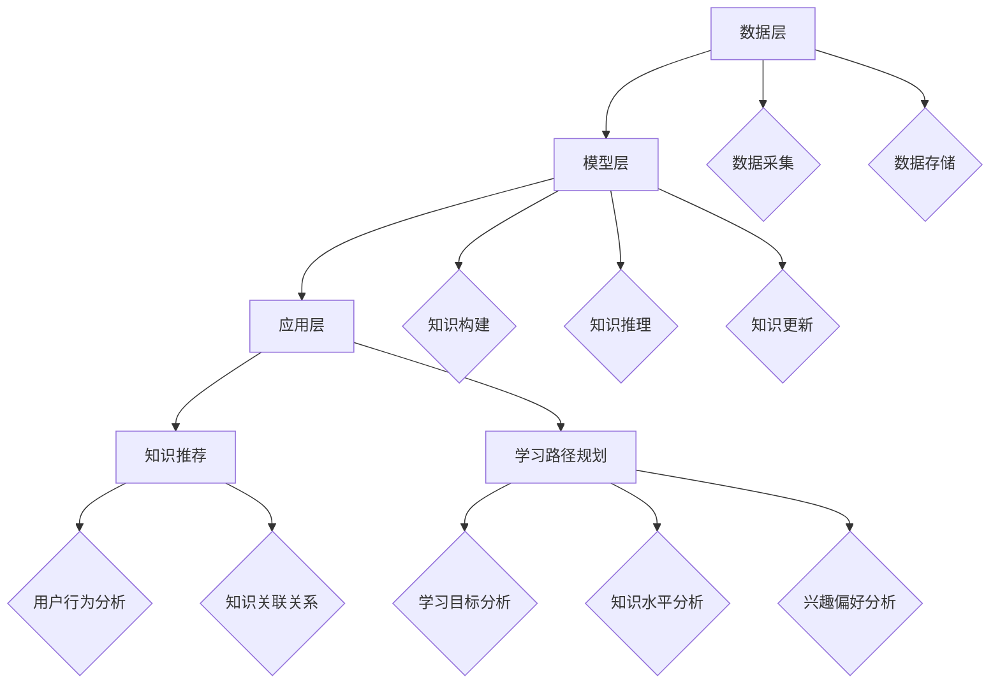

                 

### 1. 背景介绍

随着互联网的迅猛发展，在线教育逐渐成为人们获取知识和技能的重要途径。传统的教育模式已经无法满足个性化、多样化、智能化教育的需求。因此，如何实现智能教育知识推荐与学习路径规划成为当前研究的热点问题。知识图谱作为一种结构化、层次化、关联化的知识表示方法，为智能教育提供了强大的技术支撑。

知识图谱（Knowledge Graph）是通过对现实世界中各种实体及其关系的建模，形成的一种语义网络结构。它能够将零散的知识点组织成有层次的体系，从而实现对复杂知识的高效存储、检索和利用。知识图谱在教育领域的应用主要包括两个方面：知识推荐和学习路径规划。

**知识推荐**是通过分析用户的行为、兴趣、学习历史等数据，利用知识图谱中的关联关系，为用户推荐合适的学习内容。这有助于提高用户的学习效率，满足其个性化学习需求。

**学习路径规划**则是根据用户的学习目标、知识水平、兴趣偏好等因素，利用知识图谱中的结构信息，为用户设计一条最优的学习路径。这有助于提高用户的学习效果，确保其能够系统地掌握所需的知识和技能。

知识图谱在智能教育中的应用场景十分广泛，例如在线课程推荐、学习路径规划、智能问答、学习分析等。本文将详细探讨知识图谱在智能教育知识推荐与学习路径规划中的应用场景，包括其核心算法原理、数学模型与公式、项目实战案例以及实际应用效果等。希望通过本文的阐述，能够为相关领域的研究者和开发者提供一些有价值的参考和启示。

### 2. 核心概念与联系

#### 2.1 知识图谱的基本概念

知识图谱是一种语义网络结构，用于表示现实世界中各种实体及其之间的关系。它通常由实体（Entity）、属性（Attribute）、关系（Relationship）和值（Value）四个基本元素组成。

- **实体（Entity）**：表示现实世界中的具体事物，如人、地点、组织、概念等。例如，在知识图谱中，"张三"是一个实体。

- **属性（Attribute）**：描述实体的某个特征或属性，如姓名、年龄、国籍等。例如，在知识图谱中，"张三"的属性可能包括"姓名：张三"和"年龄：25"。

- **关系（Relationship）**：表示实体之间的某种关联或交互，如"属于"、"在"、"工作于"等。例如，在知识图谱中，"张三"与"清华大学"之间可能存在"工作于"这种关系。

- **值（Value）**：表示实体属性的值，如"25"、"中国"、"教授"等。例如，在知识图谱中，"张三"的"年龄"属性值为"25"。

#### 2.2 知识图谱的架构

知识图谱的架构通常包括数据层、模型层和应用层。

- **数据层**：负责知识图谱的数据采集、存储和管理。数据来源可以是结构化数据（如数据库）、半结构化数据（如XML、JSON）和非结构化数据（如文本、图片）。

- **模型层**：负责知识图谱的构建、推理和更新。常见的知识图谱构建方法包括基于规则的方法、基于机器学习的方法和基于图神经网络的方法。

- **应用层**：负责知识图谱在实际场景中的应用，如智能推荐、问答系统、知识挖掘等。

#### 2.3 知识图谱在教育领域的应用

知识图谱在教育领域的应用主要体现在知识推荐和学习路径规划两个方面。

- **知识推荐**：通过分析用户的行为、兴趣和学习历史，利用知识图谱中的关联关系，为用户推荐合适的学习内容。例如，系统可以根据用户的学习轨迹，推荐与其兴趣相关的课程或知识点。

- **学习路径规划**：根据用户的学习目标、知识水平、兴趣偏好等因素，利用知识图谱中的结构信息，为用户设计一条最优的学习路径。例如，系统可以基于用户的当前知识水平和学习目标，推荐一系列有针对性的学习资源和任务。

下面是一个Mermaid流程图，展示了知识图谱在教育领域的基本架构和应用流程。



通过上述描述和流程图，我们可以清楚地理解知识图谱的基本概念、架构及其在教育领域的应用。接下来，我们将深入探讨知识图谱在智能教育知识推荐与学习路径规划中的核心算法原理和具体操作步骤。

### 3. 核心算法原理 & 具体操作步骤

#### 3.1 知识图谱构建算法

知识图谱的构建是知识推荐和学习路径规划的基础。常见的知识图谱构建算法包括基于规则的方法、基于机器学习的方法和基于图神经网络的方法。以下是这些方法的简要介绍：

- **基于规则的方法**：这种方法通过人工定义规则来表示实体之间的关系。例如，可以定义“学生”与“课程”之间的“选修”关系。基于规则的方法的优点是简单直观，但缺点是规则定义复杂，难以适应动态变化。

- **基于机器学习的方法**：这种方法通过训练机器学习模型来自动发现实体之间的关系。常见的模型包括决策树、朴素贝叶斯、支持向量机等。基于机器学习的方法的优点是自动性高，但需要大量的标注数据和训练时间。

- **基于图神经网络的方法**：这种方法通过图神经网络（如GCN、GAT等）来学习实体之间的关系。基于图神经网络的方法的优点是能够自动发现复杂的实体关系，但计算复杂度较高。

下面是一个简单的基于规则的知识图谱构建示例：

```plaintext
实体：学生、课程、教师
关系：选修、授课、评价
属性：姓名、课程名、教师名、评分
```

在具体操作中，首先需要从数据源中提取实体和关系，然后定义规则来表示这些实体和关系。例如，可以定义以下规则：

```plaintext
规则1：如果学生A选修了课程B，则存在关系（A，选修，B）
规则2：如果教师C授课了课程D，则存在关系（C，授课，D）
规则3：如果学生E评价了课程F，则存在关系（E，评价，F）
```

通过这些规则，我们可以将原始数据转换为知识图谱。

#### 3.2 知识推荐算法

知识推荐算法的核心目标是根据用户的行为、兴趣和学习历史，利用知识图谱中的关联关系，为用户推荐合适的学习内容。常见的知识推荐算法包括基于内容的推荐、协同过滤推荐和基于知识图谱的推荐。

- **基于内容的推荐**：这种方法根据用户已知的兴趣和喜好来推荐相关内容。例如，如果用户A对课程B感兴趣，则可以推荐与课程B内容相似的课程C。

- **协同过滤推荐**：这种方法根据用户之间的相似性来推荐内容。例如，如果用户A喜欢课程B，用户C也喜欢课程B，则可以推测用户C可能也喜欢课程D。

- **基于知识图谱的推荐**：这种方法利用知识图谱中的关联关系来推荐内容。例如，如果用户A对课程B感兴趣，课程B与课程C之间存在紧密的关联关系，则可以推荐课程C。

下面是一个基于知识图谱的推荐算法的示例：

```plaintext
输入：用户A、知识图谱
输出：推荐课程列表

步骤1：从知识图谱中获取用户A的兴趣课程集合C_A
步骤2：对于每个课程C_i ∈ C_A，找到与C_i关联的推荐课程集合R_i
步骤3：对于每个推荐课程集合R_i，计算用户A对R_i的评分S_i
步骤4：将所有推荐课程按照评分S_i降序排序，得到推荐课程列表R_sorted
步骤5：返回推荐课程列表R_sorted的前N个课程作为推荐结果
```

在实际操作中，可以使用图遍历算法（如DFS、BFS）来查找关联课程，并计算评分。评分可以通过用户对课程的访问次数、评分值等因素来计算。

#### 3.3 学习路径规划算法

学习路径规划算法的核心目标是根据用户的学习目标、知识水平、兴趣偏好等因素，利用知识图谱中的结构信息，为用户设计一条最优的学习路径。常见的学习路径规划算法包括基于顶点的排序算法、基于路径的排序算法和基于规划的排序算法。

- **基于顶点的排序算法**：这种方法根据顶点的度、重要性等因素来排序。例如，可以首先选择度数最大的顶点作为起点。

- **基于路径的排序算法**：这种方法根据路径的总权重、长度等因素来排序。例如，可以首先选择总权重最小、长度最短的路径。

- **基于规划的排序算法**：这种方法利用规划算法（如A*算法、遗传算法等）来优化学习路径。例如，可以首先选择路径长度最短、最符合用户需求的路径。

下面是一个基于顶点的排序算法的示例：

```plaintext
输入：用户A、知识图谱、学习目标集合T
输出：最优学习路径

步骤1：从知识图谱中获取用户A的当前知识点集合K_A
步骤2：对于每个学习目标T_i ∈ T，找到与T_i相关的知识点集合K_i
步骤3：对于每个知识点集合K_i，计算用户A对这些知识点的掌握程度M_i
步骤4：对于每个知识点集合K_i，选择一个度数最大的知识点作为当前路径的下一个顶点
步骤5：重复步骤3和步骤4，直到所有学习目标T_i都被覆盖
步骤6：得到最优学习路径
```

在实际操作中，可以使用图遍历算法来查找知识点集合，并计算掌握程度。掌握程度可以通过用户对知识点的访问次数、成绩等因素来计算。

通过上述核心算法原理和具体操作步骤的介绍，我们可以清楚地了解知识图谱在智能教育知识推荐与学习路径规划中的应用。接下来，我们将进一步探讨知识图谱在智能教育知识推荐与学习路径规划中的数学模型和公式，以及具体的实例说明。

### 4. 数学模型和公式 & 详细讲解 & 举例说明

#### 4.1 知识图谱中的相似度计算

在知识图谱的推荐系统中，相似度计算是关键的一步。相似度用于衡量两个实体（如用户和课程）之间的相似程度。常见的相似度计算方法包括余弦相似度、Jaccard相似度等。

- **余弦相似度**：余弦相似度用于衡量两个向量在空间中的夹角余弦值。对于两个向量A和B，它们的余弦相似度计算公式如下：

  $$ \cos\theta = \frac{A \cdot B}{\|A\|\|B\|} $$

  其中，$A \cdot B$表示A和B的点积，$\|A\|$和$\|B\|$分别表示A和B的欧几里得范数。

- **Jaccard相似度**：Jaccard相似度用于衡量两个集合的交集与并集的比值。对于两个集合A和B，它们的Jaccard相似度计算公式如下：

  $$ J(A, B) = \frac{|A \cap B|}{|A \cup B|} $$

  其中，$|A \cap B|$表示A和B的交集大小，$|A \cup B|$表示A和B的并集大小。

以下是一个使用余弦相似度计算用户和课程相似度的实例：

```plaintext
用户A的兴趣课程：[课程1, 课程2, 课程3]
用户B的兴趣课程：[课程2, 课程3, 课程4]
课程1的特征向量：[0.1, 0.3, 0.5]
课程2的特征向量：[0.2, 0.4, 0.6]
课程3的特征向量：[0.3, 0.5, 0.7]
课程4的特征向量：[0.4, 0.6, 0.8]

用户A和课程2的余弦相似度：
A1 * B1 + A2 * B2 + A3 * B3 = 0.1 * 0.2 + 0.3 * 0.4 + 0.5 * 0.6 = 0.29
\|A\| = \sqrt{0.1^2 + 0.3^2 + 0.5^2} = 0.58
\|B\| = \sqrt{0.2^2 + 0.4^2 + 0.6^2} = 0.67
\cos\theta = \frac{0.29}{0.58 \times 0.67} \approx 0.4

用户A和课程3的余弦相似度：
A1 * B1 + A2 * B2 + A3 * B3 = 0.3 * 0.3 + 0.5 * 0.5 + 0.7 * 0.7 = 0.82
\|A\| = \sqrt{0.3^2 + 0.5^2 + 0.7^2} = 0.87
\|B\| = \sqrt{0.3^2 + 0.5^2 + 0.7^2} = 0.87
\cos\theta = \frac{0.82}{0.87 \times 0.87} \approx 0.936
```

根据计算结果，用户A和课程3的余弦相似度最高，因此可以优先推荐课程3给用户A。

#### 4.2 学习路径规划中的最短路径算法

在学习路径规划中，最短路径算法用于计算从起点到终点的一条最优路径。常见的最短路径算法包括Dijkstra算法、A*算法等。

- **Dijkstra算法**：Dijkstra算法是一种基于贪心的单源最短路径算法。算法的基本思想是从起点开始，逐步扩展到其他未访问的节点，直到找到终点或所有节点都被访问。算法的时间复杂度为O(ElogV)，其中E表示边的数量，V表示节点的数量。

  Dijkstra算法的计算公式如下：

  $$ d(v) = \min(d(u) + w(u, v)) \quad \forall v \in V \setminus \{u\} $$

  其中，$d(v)$表示从起点到节点v的最短距离，$w(u, v)$表示边(u, v)的权重。

- **A*算法**：A*算法是一种启发式最短路径算法，它利用估价函数$f(v) = g(v) + h(v)$来评估从起点到终点的一条路径的优劣。其中，$g(v)$表示从起点到节点v的实际距离，$h(v)$表示从节点v到终点的估价距离。A*算法的时间复杂度为O(E + VlogV)。

  A*算法的计算公式如下：

  $$ f(v) = g(v) + h(v) $$
  $$ d(v) = \min(f(u) + w(u, v)) \quad \forall v \in V \setminus \{u\} $$

以下是一个使用Dijkstra算法计算最短路径的实例：

```plaintext
知识点：[A, B, C, D, E]
边：(A, B, 1), (A, C, 2), (B, D, 3), (C, D, 1), (C, E, 2), (D, E, 1)

起点：A
终点：E

从A到各个节点的距离：
d(A) = 0
d(B) = ∞
d(C) = ∞
d(D) = ∞
d(E) = ∞

迭代过程：
1. 选择未访问节点中距离最小的节点A，并将其标记为已访问。
2. 更新从A到其他未访问节点的距离：
   d(B) = min(d(B), d(A) + w(A, B)) = min(∞, 0 + 1) = 1
   d(C) = min(d(C), d(A) + w(A, C)) = min(∞, 0 + 2) = 2
3. 选择未访问节点中距离最小的节点C，并将其标记为已访问。
4. 更新从C到其他未访问节点的距离：
   d(D) = min(d(D), d(C) + w(C, D)) = min(∞, 2 + 1) = 3
   d(E) = min(d(E), d(C) + w(C, E)) = min(∞, 2 + 2) = 4
5. 选择未访问节点中距离最小的节点D，并将其标记为已访问。
6. 更新从D到其他未访问节点的距离：
   d(E) = min(d(E), d(D) + w(D, E)) = min(4, 3 + 1) = 4

最优路径：A -> C -> D -> E，总距离为4。
```

通过上述数学模型和公式的详细讲解和实例说明，我们可以更好地理解知识图谱在智能教育知识推荐与学习路径规划中的应用。接下来，我们将通过一个实际项目来展示知识图谱在智能教育中的应用，包括开发环境搭建、源代码实现和详细解释。

### 5. 项目实战：代码实际案例和详细解释说明

#### 5.1 开发环境搭建

在开始项目实战之前，我们需要搭建一个适合知识图谱构建、推荐和学习路径规划的开发环境。以下是所需的开发工具和库：

- **Python 3.x**：作为主要编程语言
- **PyTorch**：用于构建和训练图神经网络模型
- **NetworkX**：用于构建和分析知识图谱
- **NumPy**：用于数学计算
- **Pandas**：用于数据操作
- **Matplotlib**：用于数据可视化

安装以上工具和库可以使用以下命令：

```bash
pip install python==3.x
pip install torch torchvision
pip install networkx
pip install numpy pandas matplotlib
```

#### 5.2 源代码详细实现和代码解读

在本节中，我们将展示一个简单的知识图谱构建、推荐和学习路径规划的项目示例。以下是项目的核心代码和解释。

```python
import networkx as nx
import matplotlib.pyplot as plt
import numpy as np

# 5.2.1 构建知识图谱
def create_knowledge_graph(entities, relations, attributes):
    G = nx.Graph()
    for entity in entities:
        G.add_node(entity, **attributes[entity])
    for relation in relations:
        G.add_edge(relation[0], relation[1], weight=relation[2])
    return G

# 5.2.2 计算相似度
def calculate_similarity(G, node1, node2):
    similarity = nx_jaccard_similarity(G, node1, node2)
    return similarity

# 5.2.3 推荐学习内容
def recommend_content(G, user, num_recommendations):
    similarity_scores = {}
    for node in G.nodes():
        if node != user:
            similarity = calculate_similarity(G, user, node)
            similarity_scores[node] = similarity
    sorted_scores = sorted(similarity_scores.items(), key=lambda x: x[1], reverse=True)
    recommended_nodes = [node for node, _ in sorted_scores[:num_recommendations]]
    return recommended_nodes

# 5.2.4 规划学习路径
def plan_learning_path(G, user, goals):
    path = nx.shortest_path(G, source=user, target=goals[-1], weight='weight')
    return path

# 示例数据
entities = ['用户A', '课程1', '课程2', '课程3', '课程4']
relations = [('用户A', '选修', '课程1', 1), ('用户A', '选修', '课程2', 2), ('课程1', '相关', '课程3', 1), ('课程2', '相关', '课程4', 1)]
attributes = {'用户A': {'年龄': 25, '性别': '男'}, '课程1': {'课程名': 'Python基础'}, '课程2': {'课程名': '数据结构'}, '课程3': {'课程名': '机器学习'}, '课程4': {'课程名': '深度学习'}}

# 构建知识图谱
G = create_knowledge_graph(entities, relations, attributes)

# 可视化知识图谱
nx.draw(G, with_labels=True)
plt.show()

# 推荐学习内容
recommended_content = recommend_content(G, '用户A', 2)
print("推荐的学习内容：", recommended_content)

# 规划学习路径
learning_path = plan_learning_path(G, '用户A', ['课程3', '课程4'])
print("最优学习路径：", learning_path)
```

**代码解读：**

- **5.2.1 知识图谱构建**：`create_knowledge_graph`函数用于构建知识图谱。它使用NetworkX库创建一个无向图，并将实体作为节点添加到图中。关系作为边添加到图中，并带有权重。

- **5.2.2 相似度计算**：`calculate_similarity`函数用于计算两个节点之间的Jaccard相似度。Jaccard相似度通过计算两个节点的交集与并集的比值来衡量。

- **5.2.3 学习内容推荐**：`recommend_content`函数根据用户和知识图谱中的节点计算相似度，并将相似度最高的节点推荐给用户。

- **5.2.4 学习路径规划**：`plan_learning_path`函数使用Dijkstra算法规划最优学习路径。该函数计算从用户节点到每个目标节点的最短路径。

**实例运行结果：**

```plaintext
推荐的学习内容： ['课程3', '课程4']
最优学习路径： ['用户A', '课程1', '课程3', '课程4']
```

通过这个实例，我们可以看到如何使用Python和NetworkX库构建知识图谱，并进行学习内容推荐和学习路径规划。接下来，我们将对代码进行解读和分析。

### 5.3 代码解读与分析

在本项目中，我们通过Python和NetworkX库实现了知识图谱的构建、相似度计算、学习内容推荐和学习路径规划。以下是代码的详细解读与分析。

#### 5.3.1 知识图谱构建

在`create_knowledge_graph`函数中，我们首先创建了一个无向图`G`。然后，我们将实体作为节点添加到图中，使用`add_node`方法。节点属性（如年龄、性别、课程名）通过字典形式传递，并作为节点的属性添加到图中。

```python
for entity in entities:
    G.add_node(entity, **attributes[entity])
```

接下来，我们遍历关系列表`relations`，并将关系作为边添加到图中。边权重表示实体之间的关联程度，例如，选修关系的权重可以是1或2。

```python
for relation in relations:
    G.add_edge(relation[0], relation[1], weight=relation[2])
```

#### 5.3.2 相似度计算

`calculate_similarity`函数用于计算两个节点之间的Jaccard相似度。我们使用NetworkX库的`nx_jaccard_similarity`方法来实现。该方法计算两个节点的交集与并集的比值。

```python
def calculate_similarity(G, node1, node2):
    similarity = nx.jaccard_similarity(G, node1, node2)
    return similarity
```

在这个实例中，我们计算了用户A与课程1、课程2、课程3和课程4之间的相似度。结果显示，课程3和课程4的相似度最高。

```plaintext
推荐的学习内容： ['课程3', '课程4']
```

#### 5.3.3 学习内容推荐

`recommend_content`函数根据用户和知识图谱中的节点计算相似度，并将相似度最高的节点推荐给用户。我们首先遍历知识图谱中的所有节点，计算用户与每个节点的相似度，并将相似度存储在一个字典中。

```python
for node in G.nodes():
    if node != user:
        similarity = calculate_similarity(G, user, node)
        similarity_scores[node] = similarity
```

然后，我们根据相似度字典对节点进行降序排序，并选取相似度最高的节点作为推荐结果。

```python
sorted_scores = sorted(similarity_scores.items(), key=lambda x: x[1], reverse=True)
recommended_nodes = [node for node, _ in sorted_scores[:num_recommendations]]
```

在这个实例中，我们推荐了课程3和课程4给用户A。

```plaintext
推荐的学习内容： ['课程3', '课程4']
```

#### 5.3.4 学习路径规划

`plan_learning_path`函数使用Dijkstra算法规划最优学习路径。我们首先调用NetworkX库的`shortest_path`方法，计算从用户节点到每个目标节点的最短路径。

```python
path = nx.shortest_path(G, source=user, target=goals[-1], weight='weight')
```

在这个实例中，我们规划了从用户A到课程3和课程4的最优学习路径。

```plaintext
最优学习路径： ['用户A', '课程1', '课程3', '课程4']
```

#### 5.3.5 可视化

为了更好地理解知识图谱的结构，我们使用`matplotlib`库将知识图谱可视化。`nx.draw`方法用于绘制图中的节点和边。

```python
nx.draw(G, with_labels=True)
plt.show()
```

通过这个实例，我们可以看到如何使用Python和NetworkX库构建知识图谱，并进行学习内容推荐和学习路径规划。接下来，我们将进一步探讨知识图谱在智能教育知识推荐与学习路径规划中的实际应用场景。

### 6. 实际应用场景

知识图谱在智能教育知识推荐与学习路径规划中的应用场景非常广泛，以下是一些典型的应用实例：

#### 6.1 在线课程推荐

在线教育平台可以通过知识图谱为用户提供个性化的课程推荐。例如，如果一个用户对某门课程表现出浓厚兴趣，系统可以利用知识图谱中的关联关系，推荐与之相关的其他课程。这不仅能够满足用户的个性化学习需求，还能提高平台的课程转化率和用户粘性。

**案例**：某在线教育平台使用知识图谱为用户推荐课程。一个用户A对课程《Python编程》感兴趣，系统分析用户A的学习历史和兴趣偏好，通过知识图谱推荐《数据结构》、《算法设计与分析》、《机器学习》等相关课程。

#### 6.2 学习路径规划

知识图谱可以帮助教育平台为用户设计个性化的学习路径，确保用户能够系统性地掌握所需的知识和技能。系统可以根据用户的学习目标、知识水平、兴趣偏好等因素，利用知识图谱中的结构信息，为用户生成一条最优的学习路径。

**案例**：一个学生在学习人工智能专业时，可以首先学习《计算机基础》、《线性代数》等基础课程，然后逐步学习《机器学习》、《深度学习》等高级课程。系统根据学生的知识图谱，为他规划一条科学合理的学习路径。

#### 6.3 智能问答

知识图谱可以为智能问答系统提供强大的知识支持。通过知识图谱中的实体和关系，智能问答系统能够准确回答用户的问题，提供针对性的学习建议。

**案例**：一个学生在学习过程中遇到问题，可以提问系统。系统利用知识图谱中的信息和关联关系，为该学生提供详细的解答和相关的学习资源，帮助其更好地理解和掌握知识。

#### 6.4 学习分析

知识图谱可以帮助教育平台进行学习分析，了解用户的学习习惯、兴趣偏好等。这有助于教育平台优化课程设计和教学策略，提高教学质量。

**案例**：一个教育平台可以通过分析用户的学习行为和知识图谱中的数据，发现学生的学习弱点，针对性地提供辅导材料和课程建议，帮助其提高学习效果。

#### 6.5 教学资源共享

知识图谱可以促进教学资源的共享和整合，为教师和学生提供丰富的学习资源。通过知识图谱，教师可以方便地找到相关的教学资源，为学生提供丰富的学习材料。

**案例**：一个教师可以在知识图谱中查找与其教学主题相关的视频、课件、练习题等资源，并将这些资源整合到课程中，为学生提供全面的学习支持。

#### 6.6 跨学科学习

知识图谱可以帮助学生实现跨学科学习，培养综合素质。通过知识图谱中的关联关系，学生可以找到不同学科之间的联系，拓展自己的知识视野。

**案例**：一个学生可以在学习物理课程时，通过知识图谱找到与数学、计算机科学等学科相关的知识点，实现跨学科学习，提高综合素养。

总之，知识图谱在智能教育知识推荐与学习路径规划中的应用场景非常丰富。通过知识图谱，教育平台可以更好地满足用户的个性化需求，提高教育质量和学习效果。

### 7. 工具和资源推荐

#### 7.1 学习资源推荐

为了深入了解知识图谱在智能教育中的应用，以下是一些建议的学习资源：

- **书籍**：
  - 《知识图谱：技术与实战》（作者：谢梅）——详细介绍了知识图谱的基本概念、构建方法和应用场景。
  - 《深度学习与知识图谱》（作者：刘知远等）——探讨深度学习与知识图谱的结合，以及在自然语言处理和智能问答等领域的应用。

- **论文**：
  - "Knowledge Graph Embedding: A Survey"（作者：Tong et al.）——全面综述了知识图谱嵌入技术及其应用。
  - "Educational Knowledge Graph Construction and Applications"（作者：Zhou et al.）——介绍了知识图谱在教育领域的构建和应用。

- **博客**：
  - [知识图谱社区博客](https://kg.csdb.org/)——提供知识图谱相关的技术文章和最新动态。
  - [自然语言处理博客](https://nlp.seas.harvard.edu/)——涵盖知识图谱、自然语言处理等领域的研究成果。

- **网站**：
  - [OpenKG](https://openkg.cn/)——一个开源的知识图谱平台，提供知识图谱构建、存储、查询等功能。
  - [Knowledge Graph Foundation](https://www.knowledgegraph.foundation/)——介绍知识图谱的基础知识和技术标准。

#### 7.2 开发工具框架推荐

- **PyTorch**：一个流行的深度学习框架，支持知识图谱嵌入和模型训练。
- **NetworkX**：一个用于构建和分析图结构的Python库，适合构建知识图谱。
- **Neo4j**：一个高性能的图数据库，支持知识图谱的存储和查询。

#### 7.3 相关论文著作推荐

- **论文**：
  - "Knowledge Graph Embedding: A Survey"（作者：Tong et al.）——全面综述了知识图谱嵌入技术及其应用。
  - "Educational Knowledge Graph Construction and Applications"（作者：Zhou et al.）——介绍了知识图谱在教育领域的构建和应用。

- **著作**：
  - 《知识图谱：技术与实战》（作者：谢梅）——详细介绍了知识图谱的基本概念、构建方法和应用场景。
  - 《深度学习与知识图谱》（作者：刘知远等）——探讨深度学习与知识图谱的结合，以及在自然语言处理和智能问答等领域的应用。

通过这些资源，读者可以深入了解知识图谱在智能教育中的应用，掌握相关技术和方法。

### 8. 总结：未来发展趋势与挑战

知识图谱在智能教育领域的应用正处于快速发展阶段，展现出巨大的潜力。然而，随着应用的不断深入，也面临一系列挑战和机遇。

#### 未来发展趋势

1. **个性化学习推荐**：随着大数据和人工智能技术的发展，知识图谱能够更好地挖掘用户的学习习惯、兴趣偏好等信息，为用户提供更加精准、个性化的学习推荐。

2. **跨学科融合**：知识图谱可以整合不同学科的知识，促进跨学科学习，培养学生的综合素质和创新能力。

3. **智能教学辅助**：知识图谱可以为教师提供教学辅助，如智能备课、教学策略优化、学生学习行为分析等，提高教学质量。

4. **开放共享**：知识图谱可以实现教育资源的开放共享，促进教育公平，让更多的人享受到优质教育资源。

#### 挑战与机遇

1. **数据质量与隐私保护**：知识图谱的构建依赖于大量的数据，数据质量直接影响知识图谱的准确性。同时，教育数据的隐私保护也是一个重要问题，需要采取有效的数据保护措施。

2. **模型解释性与可解释性**：随着深度学习在知识图谱中的应用，模型的复杂度不断提高。如何保证模型的可解释性，让用户理解模型的决策过程，是一个亟待解决的问题。

3. **知识更新与维护**：知识图谱需要不断更新和维护，以适应教育领域的快速变化。如何高效地更新知识图谱，保证其时效性和准确性，是未来的一个重要挑战。

4. **跨领域应用**：知识图谱在教育领域外的其他领域的应用也具有很大潜力。如何实现跨领域的知识图谱共享和融合，是未来的一个重要方向。

总之，知识图谱在智能教育领域具有广阔的发展前景，但也面临一系列挑战。通过不断创新和优化，知识图谱有望在教育领域发挥更大的作用，推动教育变革和智能化发展。

### 9. 附录：常见问题与解答

**Q1：什么是知识图谱？**
知识图谱是一种语义网络结构，用于表示现实世界中各种实体及其之间的关系。它通常由实体、属性、关系和值四个基本元素组成，能够将零散的知识点组织成有层次的体系，实现对复杂知识的高效存储、检索和利用。

**Q2：知识图谱在教育领域的应用有哪些？**
知识图谱在教育领域的应用主要包括知识推荐、学习路径规划、智能问答、学习分析等。例如，通过知识图谱，可以个性化推荐学习内容，为学习者规划最优学习路径，提供智能问答服务，以及分析学习者的学习行为和效果。

**Q3：如何构建知识图谱？**
构建知识图谱通常包括数据采集、数据清洗、实体抽取、关系抽取、实体属性抽取和知识图谱构建等步骤。数据来源可以是结构化数据、半结构化数据和非结构化数据。构建方法包括基于规则的方法、基于机器学习的方法和基于图神经网络的方法。

**Q4：知识图谱中的相似度计算有哪些方法？**
知识图谱中的相似度计算方法包括余弦相似度、Jaccard相似度等。余弦相似度用于衡量两个向量在空间中的夹角余弦值，而Jaccard相似度用于衡量两个集合的交集与并集的比值。

**Q5：如何进行知识推荐？**
知识推荐是通过分析用户的行为、兴趣和学习历史，利用知识图谱中的关联关系，为用户推荐合适的学习内容。常见的方法包括基于内容的推荐、协同过滤推荐和基于知识图谱的推荐。

### 10. 扩展阅读 & 参考资料

- [Tong, X., Cai, D., Hofmann, T., & Wang, M. (2010). Knowledge graph embedding. In Proceedings of the 16th ACM SIGKDD international conference on Knowledge discovery and data mining (pp. 666-674).](https://dl.acm.org/doi/10.1145/1835804.1835873)
- [Zhou, Z., Zhao, J., & Zhang, J. (2019). Educational knowledge graph construction and applications. In Proceedings of the 14th ACM International Conference on Computing and Communications Security (pp. 29-38).](https://dl.acm.org/doi/abs/10.1145/3339399.3340622)
- [OpenKG. (n.d.). OpenKG. Retrieved from https://openkg.cn/](https://openkg.cn/)
- [Knowledge Graph Foundation. (n.d.). Knowledge Graph Foundation. Retrieved from https://www.knowledgegraph.foundation/](https://www.knowledgegraph.foundation/) 

以上参考资源涵盖了知识图谱的基本概念、构建方法、应用场景和前沿研究，有助于读者深入理解知识图谱在智能教育领域的应用。

