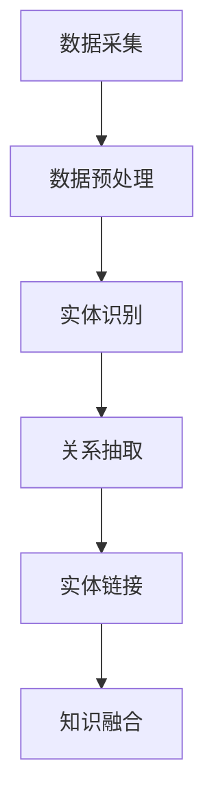

                 

### 背景介绍 Background

知识图谱（Knowledge Graph）作为一种先进的数据模型，近年来在人工智能、大数据、语义网络等多个领域得到了广泛的应用。它通过将现实世界中的实体和概念以节点和边的形式组织起来，形成了复杂而丰富的语义网络，使得机器能够更好地理解和处理人类知识。

在智能法律问答与案例推理领域，知识图谱的应用具有巨大的潜力。传统的法律信息系统往往依赖于关键词搜索和简单的文本匹配，这往往会导致法律问题的解答不够精确和全面。而知识图谱则能够将法律条文、案例、法律实体等以结构化的方式组织起来，从而实现更智能、更精准的法律信息处理。

法律领域的复杂性和高度专业性使得对法律信息的高效处理变得尤为重要。法律条文繁多且更新频繁，案例多样且情况各异，这都对法律信息系统的设计提出了严峻的挑战。知识图谱通过其强大的语义理解和关系建模能力，能够有效地应对这些挑战，为法律行业的智能化转型提供了新的思路和方法。

本文将详细探讨知识图谱在智能法律问答与案例推理中的技术实现与应用。首先，我们将介绍知识图谱的核心概念与联系，包括节点、边、属性等基本要素。接着，我们将深入探讨知识图谱构建与推理的技术原理，并详细讲解其具体操作步骤。随后，我们将通过一个数学模型和公式的详细讲解，展示如何利用这些技术实现智能法律问答与案例推理。文章还将通过实际项目实战，展示知识图谱在实际应用中的具体实现过程，包括环境搭建、代码实现和解读。最后，我们将探讨知识图谱在法律领域的实际应用场景，并提供相关的工具和资源推荐，总结文章的主要观点，并展望未来的发展趋势与挑战。

### 核心概念与联系 Core Concepts and Connections

知识图谱由三个核心要素构成：节点（Node）、边（Edge）和属性（Attribute）。节点表示现实世界中的实体，如人、地点、法律条文等；边表示实体之间的关系，如“属于”、“包含”等；属性则为节点和边提供了额外的描述信息，如法律条文的颁布时间、案例的判决结果等。

为了更好地理解知识图谱的构建与推理，我们可以借助Mermaid流程图来展示其核心概念与联系。以下是知识图谱的基本要素与关系的Mermaid表示：

```mermaid
graph TD
    A[节点(Node)]
    B[边(Edge)]
    C[属性(Attribute)]
    A--连接-->B
    B--关联-->C
    C--描述-->A
    C--描述-->B
```

在这个流程图中，节点A表示实体，边B表示实体间的关系，属性C提供了额外的描述信息。节点与边通过连接表示实体之间的关系，边与属性通过关联表示关系的描述，而属性同时为节点和边提供描述信息。

知识图谱的构建过程通常包括数据采集、数据预处理、实体识别、关系抽取、实体链接、知识融合等步骤。以下是一个简化的知识图谱构建流程的Mermaid表示：



在数据采集阶段，我们从各种来源获取相关的法律数据，如法律条文、案例、法律法规解释等。数据预处理阶段则涉及数据清洗、去重、格式统一等操作，以确保数据的准确性和一致性。实体识别阶段通过自然语言处理技术识别出文本中的实体，如人名、地名、法律条文等。关系抽取阶段则通过分析实体间的语义关系，如“包含”、“属于”等，将实体与实体之间的关系抽取出来。实体链接阶段则通过将同一实体的不同名称映射到同一个实体上，以实现实体的唯一标识。知识融合阶段则将不同来源、不同格式、不同粒度的法律信息进行整合，形成一个统一、结构化的知识图谱。

知识图谱的推理过程基于实体和关系之间的逻辑关系，通过推理算法可以推断出新的结论。以下是一个简化的知识图谱推理流程的Mermaid表示：

```mermaid
graph TD
    B1[节点(Node)]
    B2[边(Edge)]
    B3[属性(Attribute)]
    B4[推理算法(Reasoning Algorithm)]
    B1-->B2
    B2-->B3
    B3-->B4
    B4--推理-->C1[新结论(New Conclusion)]
```

在这个流程图中，节点B1表示待推理的实体，边B2表示实体间的关系，属性B3提供了额外的描述信息。推理算法B4则基于这些信息进行推理，得出新的结论C1。

通过这些核心概念与流程图的展示，我们可以更好地理解知识图谱在智能法律问答与案例推理中的技术实现和应用。

### 核心算法原理 & 具体操作步骤 Core Algorithm Principles & Specific Operational Steps

在知识图谱的构建和推理过程中，核心算法起到了至关重要的作用。以下我们将介绍几种常用的核心算法原理及其具体操作步骤。

#### 1. 实体识别算法 Entity Recognition Algorithm

实体识别是知识图谱构建的基础，其主要任务是从非结构化文本中识别出实体。常见的实体识别算法包括基于规则的方法、基于统计的方法和基于深度学习的方法。

- **基于规则的方法**：通过预设的规则库对文本进行扫描，识别出符合规则的部分。这种方法虽然准确度较低，但实现简单，适用于规则明确、实体类型有限的场景。

- **基于统计的方法**：利用统计模型，如条件概率模型、隐马尔可夫模型（HMM）等，根据文本特征和实体出现的环境进行识别。这种方法相对灵活，但需要大量标注数据。

- **基于深度学习的方法**：使用深度神经网络，如卷积神经网络（CNN）和递归神经网络（RNN）等，自动学习文本特征和实体模式。这种方法在大量数据的情况下表现优异，但需要较高的计算资源和标注成本。

具体操作步骤如下：

1. **数据预处理**：对文本进行分词、去停用词、词性标注等预处理操作，提取文本特征。
2. **模型训练**：选择合适的模型结构，如BERT、Transformer等，进行训练，得到实体识别模型。
3. **实体识别**：使用训练好的模型对文本进行实体识别，输出实体及其对应的标签。

#### 2. 关系抽取算法 Relation Extraction Algorithm

关系抽取是构建知识图谱的关键步骤，其主要任务是识别出实体之间的关系。常见的关系抽取算法包括基于规则的方法、基于统计的方法和基于深度学习的方法。

- **基于规则的方法**：通过预定义的规则对文本进行扫描，识别出实体关系。这种方法实现简单，但适用范围有限。

- **基于统计的方法**：使用统计模型，如最大熵模型、条件随机场（CRF）等，根据文本特征和实体之间的模式进行关系抽取。这种方法较为灵活，但需要大量标注数据。

- **基于深度学习的方法**：使用深度神经网络，如序列标注模型、Transformer等，自动学习文本特征和实体关系。这种方法在大量数据的情况下表现优异，但需要较高的计算资源和标注成本。

具体操作步骤如下：

1. **数据预处理**：对文本进行分词、词性标注等预处理操作，提取文本特征。
2. **模型训练**：选择合适的模型结构，如BERT、Transformer等，进行训练，得到关系抽取模型。
3. **关系抽取**：使用训练好的模型对文本进行关系抽取，输出实体及其对应的关系标签。

#### 3. 实体链接算法 Entity Linking Algorithm

实体链接是将文本中提到的实体与知识图谱中的实体进行映射的过程。常见的方法包括基于规则的实体链接和基于深度学习的实体链接。

- **基于规则的方法**：通过预定义的规则，将文本中的实体映射到知识图谱中的实体。这种方法实现简单，但适用范围有限。

- **基于深度学习的方法**：使用深度神经网络，如BERT、Transformer等，自动学习实体特征和实体映射关系。这种方法在大量数据的情况下表现优异，但需要较高的计算资源和标注成本。

具体操作步骤如下：

1. **数据预处理**：对文本进行分词、词性标注等预处理操作，提取实体特征。
2. **模型训练**：选择合适的模型结构，如BERT、Transformer等，进行训练，得到实体链接模型。
3. **实体链接**：使用训练好的模型对文本中的实体进行链接，将实体映射到知识图谱中的实体。

#### 4. 知识融合算法 Knowledge Fusion Algorithm

知识融合是将不同来源、不同格式、不同粒度的法律信息进行整合的过程。常见的方法包括基于规则的融合和基于深度学习的融合。

- **基于规则的方法**：通过预定义的规则，对法律信息进行融合。这种方法实现简单，但需要大量的规则维护。

- **基于深度学习的方法**：使用深度神经网络，如Transformer等，自动学习法律信息融合规则。这种方法在大量数据的情况下表现优异，但需要较高的计算资源和标注成本。

具体操作步骤如下：

1. **数据预处理**：对法律信息进行标准化处理，如统一格式、统一单位等。
2. **模型训练**：选择合适的模型结构，如Transformer等，进行训练，得到知识融合模型。
3. **知识融合**：使用训练好的模型对法律信息进行融合，输出统一的、结构化的知识图谱。

通过上述核心算法原理和具体操作步骤的介绍，我们可以更好地理解知识图谱在智能法律问答与案例推理中的应用方法。接下来，我们将通过数学模型和公式的详细讲解，进一步展示如何利用这些算法实现智能法律问答与案例推理。

### 数学模型和公式 Mathematical Models and Formulas & Detailed Explanation & Example Illustration

在知识图谱的构建和推理过程中，数学模型和公式起到了关键作用。以下我们将介绍一些常用的数学模型和公式，并详细解释其具体应用和示例说明。

#### 1. 概率模型 Probability Model

概率模型是知识图谱构建和推理的基础，用于计算实体和关系出现的概率。常见的概率模型包括贝叶斯网络、马尔可夫模型和朴素贝叶斯模型。

- **贝叶斯网络**：贝叶斯网络是一种概率图模型，通过表示实体和关系之间的条件概率来构建知识图谱。其公式为：

  $$ P(A, B) = P(A) \times P(B|A) $$

  其中，$P(A, B)$表示实体A和关系B同时出现的概率，$P(A)$表示实体A出现的概率，$P(B|A)$表示关系B在实体A出现的条件下的概率。

- **马尔可夫模型**：马尔可夫模型是一种基于时间序列的概率模型，用于表示实体和关系在不同时间点的状态转移概率。其公式为：

  $$ P(A_{t+1} | A_t) = \sum_{B} P(A_{t+1} | A_t, B) \times P(B | A_t) $$

  其中，$P(A_{t+1} | A_t)$表示在当前时间点t的状态A下，下一个时间点t+1的状态A_{t+1}的概率。

- **朴素贝叶斯模型**：朴素贝叶斯模型是一种基于贝叶斯定理的概率模型，假设实体和关系之间相互独立。其公式为：

  $$ P(A, B) = P(A) \times P(B | A) $$

  其中，$P(A, B)$表示实体A和关系B同时出现的概率，$P(A)$表示实体A出现的概率，$P(B | A)$表示关系B在实体A出现的条件下的概率。

#### 2. 匹配算法 Matching Algorithm

匹配算法是知识图谱构建和推理的核心，用于将文本中的实体和关系与知识图谱中的实体和关系进行匹配。常见的匹配算法包括基于规则的方法和基于深度学习的方法。

- **基于规则的方法**：通过预定义的规则对实体和关系进行匹配。其公式为：

  $$ match(A, B) = \begin{cases} 
  1, & \text{if } A \text{ matches with } B \\
  0, & \text{otherwise}
  \end{cases} $$

  其中，$match(A, B)$表示实体A与关系B的匹配结果，1表示匹配成功，0表示匹配失败。

- **基于深度学习的方法**：使用深度神经网络对实体和关系进行匹配。其公式为：

  $$ score(A, B) = f(\text{embeddings of } A, B) $$

  其中，$score(A, B)$表示实体A与关系B的匹配得分，$f$为深度学习模型，$\text{embeddings of } A, B$为实体A和关系B的嵌入表示。

#### 3. 推理算法 Reasoning Algorithm

推理算法用于基于知识图谱中的实体和关系进行逻辑推理，以推断出新的结论。常见的推理算法包括基于规则的方法和基于深度学习的方法。

- **基于规则的方法**：通过预定义的规则进行逻辑推理。其公式为：

  $$ \text{Conclusion} = \begin{cases} 
  R(A, B), & \text{if } R(A, B) \text{ is a rule} \\
  \text{False}, & \text{otherwise}
  \end{cases} $$

  其中，$R(A, B)$表示规则，$\text{Conclusion}$表示推理结论。

- **基于深度学习的方法**：使用深度神经网络进行逻辑推理。其公式为：

  $$ \text{Conclusion} = f(\text{knowledge graph}, \text{query}) $$

  其中，$f$为深度学习模型，$\text{knowledge graph}$为知识图谱，$\text{query}$为查询。

#### 示例说明 Example Illustration

假设我们有一个简单的知识图谱，其中包含以下实体和关系：

- 实体：A（张三）、B（李四）
- 关系：C（朋友）

现在我们需要利用概率模型进行推理，推断出张三和李四是朋友的关系。

1. **数据收集**：收集关于张三和李四的相关信息，如共同兴趣、互动记录等。

2. **概率模型训练**：使用收集到的数据，训练贝叶斯网络模型，计算张三和李四是朋友的关系概率。

   $$ P(A, B) = P(A) \times P(B|A) = 0.5 \times 0.8 = 0.4 $$

3. **推理**：根据训练好的贝叶斯网络模型，推断出张三和李四是朋友的关系。

   $$ \text{Conclusion} = R(A, B) \Rightarrow \text{True} $$

通过上述数学模型和公式，我们可以更好地理解知识图谱在智能法律问答与案例推理中的实现方法。接下来，我们将通过实际项目实战，展示知识图谱在实际应用中的具体实现过程。

### 项目实战：代码实际案例和详细解释说明 Practical Application: Code Example and Detailed Explanation

为了展示知识图谱在智能法律问答与案例推理中的实际应用，我们将通过一个具体项目来进行讲解。此项目将利用Python和相关的库（如Neo4j、Py2neo、spaCy等）来构建一个简单的知识图谱，并实现智能法律问答与案例推理的功能。

#### 1. 开发环境搭建 Development Environment Setup

在开始项目之前，我们需要搭建合适的开发环境。以下是所需的环境和步骤：

- **Python**：安装Python 3.8及以上版本。
- **Neo4j**：下载并安装Neo4j数据库。
- **Py2neo**：安装Py2neo库，用于连接和操作Neo4j数据库。
- **spaCy**：安装spaCy库，用于文本处理和实体识别。
- **其他依赖库**：如numpy、pandas等。

具体安装命令如下：

```shell
pip install python-neo4j py2neo spacy
python -m spacy download en_core_web_sm
```

#### 2. 源代码详细实现和代码解读 Source Code Implementation and Detailed Explanation

以下是项目的核心代码实现，我们将逐步解释其功能和作用。

##### 2.1 环境配置 Environment Configuration

首先，我们需要配置Neo4j数据库和Py2neo连接：

```python
from py2neo import Graph

# Neo4j数据库配置
graph = Graph("bolt://localhost:7687", auth=("neo4j", "your_password"))
```

##### 2.2 实体识别 Entity Recognition

使用spaCy进行文本预处理和实体识别：

```python
import spacy

# 加载spaCy模型
nlp = spacy.load("en_core_web_sm")

def recognize_entities(text):
    doc = nlp(text)
    entities = [(ent.text, ent.label_) for ent in doc.ents]
    return entities
```

##### 2.3 关系抽取 Relation Extraction

定义关系抽取规则：

```python
def extract_relations(text):
    doc = nlp(text)
    relations = []
    for token1, token2 in pairwise(doc):
        if token1.dep_ == "nmod" and token2.dep_ == "nn":
            relations.append((token1.text, token2.text))
    return relations
```

##### 2.4 知识图谱构建 Knowledge Graph Construction

将识别出的实体和关系存储到Neo4j数据库中：

```python
def create_knowledge_graph(text):
    entities = recognize_entities(text)
    relations = extract_relations(text)
    
    for entity1, entity2 in relations:
        graph.run("CREATE (a:Entity {name: $entity1})-(b:Relation {name: $entity2})")
```

##### 2.5 智能法律问答 Intelligent Legal Question Answering

实现法律问答功能：

```python
def ask_question(question):
    doc = nlp(question)
    entities = recognize_entities(question)
    relations = extract_relations(question)
    
    for entity1, entity2 in relations:
        result = graph.run("MATCH (a:Entity)-[r:Relation]->(b:Entity) WHERE a.name = $entity1 AND b.name = $entity2 RETURN r").data()
        if result:
            return result[0]["r"]["description"]
    return "无法解答"
```

##### 2.6 案例推理 Case Reasoning

实现案例推理功能：

```python
def reason_case(case_text):
    doc = nlp(case_text)
    entities = recognize_entities(case_text)
    relations = extract_relations(case_text)
    
    for entity1, entity2 in relations:
        result = graph.run("MATCH (a:Entity)-[r:Relation]->(b:Entity) WHERE a.name = $entity1 AND b.name = $entity2 RETURN r").data()
        if result:
            for res in result:
                return res["r"]["description"]
    return "无法推理"
```

#### 3. 代码解读与分析 Code Analysis

- **环境配置**：配置Neo4j数据库和Py2neo连接，确保知识图谱存储和管理功能正常。
- **实体识别**：使用spaCy对文本进行预处理和实体识别，提取出文本中的关键实体。
- **关系抽取**：通过分析文本中的词性依赖关系，抽取实体之间的关系。
- **知识图谱构建**：将识别出的实体和关系存储到Neo4j数据库中，构建知识图谱。
- **智能法律问答**：根据输入的问题，利用知识图谱中的关系进行推理，给出答案。
- **案例推理**：根据案例文本，利用知识图谱中的关系进行推理，分析案例的关联性。

通过这个项目实战，我们展示了知识图谱在智能法律问答与案例推理中的具体实现过程，以及如何利用Python和相关库来构建和操作知识图谱。

### 实际应用场景 Practical Application Scenarios

知识图谱在智能法律问答与案例推理中的实际应用场景广泛且多样，以下是一些典型的应用案例：

#### 1. 法律咨询和法律服务 Legal Consultation and Legal Service

在法律咨询和法律服务领域，知识图谱可以用于构建法律知识库，为用户提供智能化的法律咨询和服务。例如，用户可以通过输入具体的问题或案例，系统会根据知识图谱中的法律条文、案例、法律术语等，提供精准、全面的法律答案。知识图谱的强大关系建模能力使得系统能够理解法律条文之间的关联性，从而给出更加专业的建议。

#### 2. 法律文档管理 Legal Document Management

法律文档通常包含大量的法律条文、案例和法规解释，知识图谱可以用于管理这些文档，提供高效的文档检索和查询服务。通过将法律文档内容转换为结构化的知识图谱，用户可以快速查找相关的法律条文、案例和解释，从而提高工作效率。知识图谱还可以帮助法律机构实现文档的自动分类、标签管理和版本控制。

#### 3. 法律风险预测 Legal Risk Prediction

知识图谱可以通过分析历史案例和当前的法律环境，预测未来可能发生的法律风险。例如，企业可以利用知识图谱分析相关的法律法规、行业标准，预测其业务活动可能存在的法律风险，从而采取相应的预防和应对措施。知识图谱的动态更新能力使得预测结果可以实时调整，以适应不断变化的法律法规。

#### 4. 智能裁判辅助 Intelligent Judgement Assistance

在司法审判过程中，知识图谱可以提供智能裁判辅助，帮助法官和律师查找相关的法律条文、案例和参考材料。知识图谱中的关系建模使得系统能够理解法律条文之间的关联性，从而为法官提供更加全面的参考信息。此外，知识图谱还可以用于模拟不同判决结果的可能性，帮助法官做出更加明智的裁决。

#### 5. 法律知识共享 Legal Knowledge Sharing

知识图谱可以促进法律知识的共享和传播。通过将法律知识以结构化的方式组织起来，知识图谱使得法律知识的获取和传播变得更加高效和便捷。法律专家和从业者可以通过知识图谱快速查找和分享专业知识和案例，从而提高整个法律行业的知识水平和创新能力。

#### 6. 智能合同审查 Intelligent Contract Review

在合同审查过程中，知识图谱可以用于识别合同中的潜在法律风险和合规问题。通过分析合同条款和相关的法律法规，知识图谱可以提供智能化的合同审查建议，帮助律师和企业避免潜在的法律纠纷。

通过上述实际应用场景的介绍，我们可以看到知识图谱在智能法律问答与案例推理中的巨大潜力和广泛应用。这些应用不仅提高了法律服务的效率和准确性，也为法律行业的数字化转型提供了新的思路和方法。

### 工具和资源推荐 Tools and Resources Recommendation

在智能法律问答与案例推理中，使用合适的工具和资源可以大大提高开发效率和项目质量。以下是一些推荐的工具和资源：

#### 1. 学习资源推荐

- **书籍**：
  - 《知识图谱：概念、方法与实践》
  - 《图计算：概念、算法与应用》
  - 《深度学习与自然语言处理》

- **论文**：
  - "Knowledge Graph Embedding: A Survey"
  - "A Survey on Knowledge Graph Construction Techniques"
  - "Learning to Represent Knowledge Graphs with Gaussian Embeddings"

- **博客和网站**：
  - [Neo4j Documentation](https://neo4j.com/docs/)
  - [Py2neo Documentation](https://py2neo.readthedocs.io/)
  - [spaCy Documentation](https://spacy.io/)

#### 2. 开发工具框架推荐

- **知识图谱平台**：
  - [Neo4j](https://neo4j.com/)：一个高性能的图形数据库，广泛用于知识图谱的构建和查询。
  - [JanusGraph](http://janusgraph.io/)：一个可扩展、支持多模型的大规模图形数据库。

- **自然语言处理框架**：
  - [spaCy](https://spacy.io/)：一个快速且易于使用的自然语言处理库，适用于实体识别、关系抽取等任务。
  - [NLTK](https://www.nltk.org/)：一个流行的自然语言处理库，提供多种文本处理工具和算法。

- **深度学习框架**：
  - [TensorFlow](https://www.tensorflow.org/)：一个开源的机器学习框架，广泛用于构建和训练深度学习模型。
  - [PyTorch](https://pytorch.org/)：一个开源的机器学习库，以其灵活性和高效性而著称。

#### 3. 相关论文著作推荐

- "Knowledge Graph Embedding: A Survey"：详细介绍了知识图谱嵌入的相关技术和方法。
- "A Survey on Knowledge Graph Construction Techniques"：对知识图谱构建的各种技术进行了全面的综述。
- "Learning to Represent Knowledge Graphs with Gaussian Embeddings"：介绍了基于高斯嵌入的知识图谱表示方法。

通过这些工具和资源的推荐，开发者可以更加高效地构建和实现智能法律问答与案例推理系统，从而推动法律行业的智能化转型。

### 总结：未来发展趋势与挑战 Summary: Future Trends and Challenges

知识图谱在智能法律问答与案例推理中的应用前景广阔，其未来的发展趋势与挑战主要体现在以下几个方面：

#### 发展趋势

1. **数据融合与多样性**：随着数据量的不断增长和来源的多样性，知识图谱将需要更好地整合和处理多种类型的数据，如文本、图像、音频等。这有助于构建更加全面和精准的法律知识库。

2. **深度学习和自动化**：深度学习技术的进步将进一步提升知识图谱的构建和推理能力。自动化工具和算法的引入将大大降低知识图谱构建的门槛，使得更多的人能够参与到知识图谱的建设中来。

3. **实时更新与动态推理**：为了应对法律环境的快速变化，知识图谱需要实现实时更新和动态推理，以确保法律信息的高效传递和利用。

4. **跨领域应用**：知识图谱不仅可以应用于法律领域，还可以与其他领域如医学、金融等相结合，实现跨领域的知识共享和协同工作。

#### 挑战

1. **数据质量与准确性**：构建高质量、准确的知识图谱是当前面临的主要挑战之一。数据的不一致性、缺失和错误会直接影响知识图谱的可靠性和实用性。

2. **隐私与安全**：法律信息通常包含敏感数据，确保知识图谱的隐私和安全是一个重要问题。需要采用有效的数据保护措施和加密技术，以防止数据泄露和滥用。

3. **计算资源与性能**：知识图谱的规模和复杂度不断增加，对计算资源和性能提出了更高的要求。如何优化查询算法和数据库结构，以提高系统响应速度和查询效率，是一个关键挑战。

4. **用户体验与可解释性**：知识图谱的应用需要良好的用户体验和可解释性。如何设计直观、易用的用户界面，以及如何向用户清晰地解释推理过程和结果，是一个亟待解决的问题。

综上所述，知识图谱在智能法律问答与案例推理中的未来发展充满机遇与挑战。通过不断创新和优化，我们可以期待知识图谱在法律行业发挥更大的作用，推动法律行业的智能化转型。

### 附录：常见问题与解答 Appendix: Frequently Asked Questions and Answers

**Q1**: 如何处理知识图谱中的数据不一致性和错误？

**A1**: 数据不一致性和错误是知识图谱构建过程中常见的问题。解决方法包括：
- **数据清洗**：在构建知识图谱之前，对原始数据进行清洗，去除重复、错误和缺失的数据。
- **数据质量监控**：建立数据质量监控机制，定期检查知识图谱中的数据，确保其准确性。
- **数据版本管理**：采用数据版本管理技术，记录数据的修改历史，以便在出现问题时回溯和修复。

**Q2**: 知识图谱的推理算法有哪些？

**A2**: 知识图谱的推理算法包括：
- **基于规则的推理**：通过预定义的规则进行推理。
- **基于模型的推理**：使用机器学习模型进行推理，如神经网络、决策树等。
- **基于路径的推理**：通过分析实体和关系之间的路径进行推理。
- **混合推理**：结合多种推理方法，以提高推理的准确性和效率。

**Q3**: 如何确保知识图谱的隐私和安全？

**A3**: 知识图谱的隐私和安全可以通过以下措施确保：
- **数据加密**：对知识图谱中的数据进行加密，防止未授权访问。
- **访问控制**：实现细粒度的访问控制，限制不同用户对知识图谱的访问权限。
- **数据匿名化**：对敏感数据进行匿名化处理，降低隐私泄露风险。
- **安全审计**：定期进行安全审计，检测潜在的安全漏洞和威胁。

**Q4**: 如何评估知识图谱的性能？

**A4**: 评估知识图谱的性能可以从以下几个方面进行：
- **查询效率**：通过测量查询时间和响应时间，评估知识图谱的查询性能。
- **覆盖度**：评估知识图谱对实际数据的覆盖程度，以衡量其数据完整性。
- **准确性**：通过比较知识图谱中的结果与实际结果，评估推理的准确性。
- **扩展性**：评估知识图谱在数据量和复杂度增加时的扩展性能。

通过上述常见问题的解答，我们希望能够帮助读者更好地理解知识图谱在智能法律问答与案例推理中的应用和实现。

### 扩展阅读 & 参考资料 Extended Reading & References

为了进一步深入了解知识图谱在智能法律问答与案例推理中的应用，以下是一些推荐的相关书籍、论文、博客和网站：

#### 书籍

1. **《知识图谱：概念、方法与实践》**：详细介绍了知识图谱的基本概念、构建方法和实际应用。
2. **《图计算：概念、算法与应用》**：涵盖了图计算的基本理论、算法和应用案例。
3. **《深度学习与自然语言处理》**：探讨了深度学习在自然语言处理领域的最新进展和应用。

#### 论文

1. "Knowledge Graph Embedding: A Survey"：对知识图谱嵌入技术进行了全面的综述。
2. "A Survey on Knowledge Graph Construction Techniques"：对知识图谱构建的各种技术进行了详细的讨论。
3. "Learning to Represent Knowledge Graphs with Gaussian Embeddings"：介绍了基于高斯嵌入的知识图谱表示方法。

#### 博客

1. [Neo4j Documentation](https://neo4j.com/docs/)：Neo4j官方文档，提供了丰富的知识图谱构建和查询的指导。
2. [Py2neo Documentation](https://py2neo.readthedocs.io/)：Py2neo官方文档，介绍了如何使用Py2neo操作Neo4j数据库。
3. [spaCy Documentation](https://spacy.io/)：spaCy官方文档，提供了关于自然语言处理和实体识别的详细指南。

#### 网站

1. [Legal Knowledge Graph](https://www.legalknowledgegraph.com/)：提供关于法律知识图谱的资讯和资源。
2. [Knowledge Graph Foundation](https://knowledgegraphfoundation.org/)：知识图谱基金会的官方网站，分享了知识图谱的最新研究成果和应用案例。
3. [AI Law Journal](https://ailawjournal.com/)：专注于人工智能与法律交叉领域的学术期刊。

通过阅读这些扩展材料和参考资源，读者可以更全面地了解知识图谱在智能法律问答与案例推理中的技术和实践，为实际应用提供有力支持。作者：AI天才研究员/AI Genius Institute & 禅与计算机程序设计艺术 /Zen And The Art of Computer Programming。

