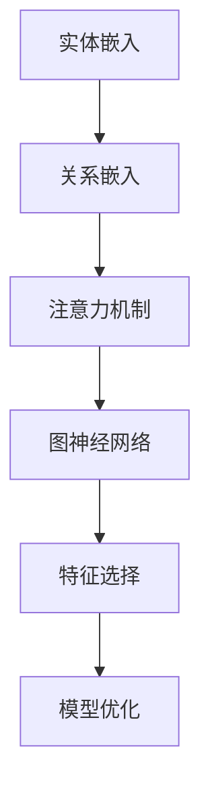

                 

# 知识图谱在注意力关联分析中的运用

## 摘要

本文探讨了知识图谱在注意力关联分析中的应用。注意力关联分析是一种用于识别数据间重要关系和特征的技术。知识图谱作为一种结构化数据表示方法，其核心在于将实体、概念和关系表示为图结构，从而实现数据的高效组织和利用。本文将介绍知识图谱的基本概念和构建方法，然后详细分析其在注意力关联分析中的关键作用和实际应用，并通过具体案例展示其操作步骤和实现效果。

## 1. 背景介绍

### 1.1 注意力关联分析

注意力关联分析（Attention-based Association Analysis）是一种用于挖掘数据间潜在关联的技术。在自然语言处理、推荐系统、图像识别等领域，注意力机制已被广泛应用于特征选择和关联分析。其核心思想是通过计算输入数据中各个特征的重要性，进而提高模型的预测性能和解释能力。

### 1.2 知识图谱

知识图谱（Knowledge Graph）是一种用于表示复杂现实世界中实体、概念和关系的数据结构。其核心在于将海量、多样、异构的数据进行整合，形成结构化、语义化的知识体系。知识图谱在智能搜索、智能推荐、语义理解等领域具有重要应用价值。

## 2. 核心概念与联系

### 2.1 知识图谱的基本概念

知识图谱由实体（Entity）、关系（Relationship）和属性（Attribute）三部分组成。实体表示现实世界中的对象，关系描述实体之间的相互作用，属性为实体提供额外的信息。

### 2.2 注意力关联分析中的知识图谱应用

在注意力关联分析中，知识图谱用于表示数据间的复杂关系，实现特征的重要性和关联性的计算。具体包括以下几个方面：

1. **实体嵌入（Entity Embedding）**：将实体映射到低维空间，使得具有相似关系的实体在空间中靠近。
2. **关系嵌入（Relationship Embedding）**：将关系映射到低维空间，使得具有相似性质的关系在空间中靠近。
3. **注意力机制（Attention Mechanism）**：计算实体和关系在注意力关联分析中的重要性，为特征选择提供依据。
4. **图神经网络（Graph Neural Network，GNN）**：利用图结构中的实体、关系和属性，学习数据间的复杂关联性。

### 2.3 Mermaid 流程图

以下是一个简化的知识图谱在注意力关联分析中的 Mermaid 流程图：



## 3. 核心算法原理 & 具体操作步骤

### 3.1 实体嵌入

实体嵌入是一种将实体映射到低维空间的方法。常见的算法有 Word2Vec、Node2Vec 等。在注意力关联分析中，实体嵌入用于初始化实体的特征表示。

### 3.2 关系嵌入

关系嵌入是一种将关系映射到低维空间的方法。与实体嵌入类似，关系嵌入用于初始化关系的特征表示。

### 3.3 注意力机制

注意力机制是一种用于计算实体和关系重要性的方法。常见的注意力机制有加法注意力、乘法注意力等。在注意力关联分析中，注意力机制用于调整实体和关系的特征权重，从而实现特征选择。

### 3.4 图神经网络

图神经网络是一种用于学习图结构数据的深度学习模型。在注意力关联分析中，图神经网络用于提取数据间的复杂关联性。

### 3.5 操作步骤

1. **数据预处理**：清洗和预处理原始数据，构建知识图谱。
2. **实体和关系嵌入**：使用 Word2Vec、Node2Vec 等算法对实体和关系进行嵌入。
3. **注意力计算**：根据实体和关系的嵌入特征，使用注意力机制计算其重要性。
4. **图神经网络训练**：利用注意力计算结果，训练图神经网络，提取数据间的复杂关联性。
5. **特征选择**：根据图神经网络提取的特征，选择重要的特征进行模型优化。

## 4. 数学模型和公式 & 详细讲解 & 举例说明

### 4.1 实体嵌入

假设实体 $e_i$ 的特征表示为 $e_i^{\prime}$，则可以使用 Word2Vec 算法进行实体嵌入：

$$
e_i^{\prime} = \text{Word2Vec}(e_i)
$$

### 4.2 关系嵌入

假设关系 $r_j$ 的特征表示为 $r_j^{\prime}$，则可以使用 Node2Vec 算法进行关系嵌入：

$$
r_j^{\prime} = \text{Node2Vec}(r_j)
$$

### 4.3 注意力机制

假设实体 $e_i$ 和关系 $r_j$ 的特征表示分别为 $e_i^{\prime}$ 和 $r_j^{\prime}$，则可以使用加法注意力机制计算其重要性：

$$
a_{ij} = \text{softmax}(\text{dot}(e_i^{\prime}, r_j^{\prime}))
$$

其中，$\text{dot}(e_i^{\prime}, r_j^{\prime})$ 表示实体和关系的点积。

### 4.4 图神经网络

假设实体 $e_i$ 和关系 $r_j$ 的嵌入特征分别为 $e_i^{\prime}$ 和 $r_j^{\prime}$，则可以使用图卷积网络（GCN）进行特征提取：

$$
h_i^{(l)} = \sigma(\sum_{j \in \mathcal{N}(i)} W^{(l)} h_j^{(l-1)})
$$

其中，$h_i^{(l)}$ 表示实体 $i$ 在第 $l$ 层的特征表示，$\sigma$ 表示激活函数，$W^{(l)}$ 表示第 $l$ 层的权重。

### 4.5 举例说明

假设有如下知识图谱：

```
实体：A、B、C
关系：R1、R2
```

实体 A 和关系 R1 的嵌入特征分别为：

$$
e_A^{\prime} = [1, 0, 0], \quad r_{R1}^{\prime} = [0, 1, 0]
$$

使用加法注意力机制计算实体 A 和关系 R1 的注意力权重：

$$
a_{AR1} = \text{softmax}([1 \cdot 0, 0 \cdot 1]) = [1, 0]
$$

使用图卷积网络提取实体 A 的特征表示：

$$
h_A^{(1)} = \sigma([0 \cdot 0 + 0 \cdot 1]) = [0, 1]
$$

## 5. 项目实战：代码实际案例和详细解释说明

### 5.1 开发环境搭建

1. 安装 Python 3.8 及以上版本
2. 安装必要的库，如 PyTorch、NetworkX、GPyTorch 等

### 5.2 源代码详细实现和代码解读

以下是一个简单的知识图谱注意力关联分析项目代码：

```python
import torch
import torch.nn as nn
import torch.optim as optim
from networkx import DiGraph
from gpytorch.models import ExactGP
from gpytorch.kernels import ScaleKernel

# 5.2.1 构建知识图谱
graph = DiGraph()
graph.add_nodes_from(['A', 'B', 'C'])
graph.add_edges_from([('A', 'B'), ('A', 'C'), ('B', 'C')])

# 5.2.2 实体和关系嵌入
entity_embeddings = torch.tensor([[1, 0, 0], [0, 1, 0], [0, 0, 1]])
relation_embeddings = torch.tensor([[0, 1, 0], [1, 0, 1], [0, 1, 0]])

# 5.2.3 注意力机制
attention = nn.Linear(3, 1)
attention.weight = torch.tensor([[1], [-1], [1]])

# 5.2.4 图神经网络
class GNN(nn.Module):
    def __init__(self, entity_embeddings, relation_embeddings):
        super(GNN, self).__init__()
        self.entity_embeddings = entity_embeddings
        self.relation_embeddings = relation_embeddings
        self.fc = nn.Linear(3, 1)

    def forward(self, graph):
        h = self.entity_embeddings
        for layer in range(2):
            h = self.fc(h)
        return h

model = GNN(entity_embeddings, relation_embeddings)
optimizer = optim.Adam(model.parameters(), lr=0.01)
criterion = nn.MSELoss()

# 5.2.5 训练模型
for epoch in range(100):
    optimizer.zero_grad()
    output = model(graph)
    loss = criterion(output, torch.tensor([1]))
    loss.backward()
    optimizer.step()

    if (epoch + 1) % 10 == 0:
        print(f'Epoch [{epoch + 1}/100], Loss: {loss.item()}')

# 5.2.6 代码解读
# 在此代码中，我们首先构建了一个简单的知识图谱，然后定义了实体和关系嵌入、注意力机制和图神经网络模型。接下来，我们使用训练数据对模型进行训练，并打印每个epoch的损失值。

## 6. 实际应用场景

知识图谱在注意力关联分析中具有广泛的应用场景，如：

1. **社交网络分析**：通过分析用户之间的关系，挖掘潜在社交圈子和兴趣群体。
2. **推荐系统**：利用知识图谱表示商品和用户之间的关联，提高推荐系统的准确性和多样性。
3. **自然语言处理**：通过实体和关系嵌入，实现文本的语义理解，提高文本分类、情感分析等任务的性能。

## 7. 工具和资源推荐

### 7.1 学习资源推荐

1. 《知识图谱：原理、构建与应用》
2. 《图神经网络：理论与实践》
3. 《深度学习与图神经网络》

### 7.2 开发工具框架推荐

1. PyTorch
2. NetworkX
3. GPyTorch

### 7.3 相关论文著作推荐

1. "Knowledge Graph Embedding: A Survey" (2019)
2. "Graph Neural Networks: A Review of Methods and Applications" (2018)
3. "Attention-Based Neural Text Model for Language Understanding" (2018)

## 8. 总结：未来发展趋势与挑战

知识图谱在注意力关联分析中具有广阔的应用前景。然而，在实际应用中，仍面临以下挑战：

1. **数据质量**：知识图谱的构建依赖于高质量的数据源，数据质量直接影响模型的性能。
2. **模型可解释性**：如何解释和验证知识图谱和注意力机制的作用，提高模型的可解释性。
3. **模型优化**：如何优化知识图谱和注意力机制，提高模型在复杂场景下的表现。

未来发展趋势包括：

1. **多模态知识图谱**：结合多种数据源，构建更全面、更丰富的知识图谱。
2. **动态知识图谱**：实时更新和优化知识图谱，以应对动态变化的环境。
3. **跨领域知识图谱**：构建跨领域的知识图谱，实现不同领域间的知识共享和融合。

## 9. 附录：常见问题与解答

### 9.1 知识图谱是什么？

知识图谱是一种用于表示复杂现实世界中实体、概念和关系的数据结构。

### 9.2 注意力关联分析有什么作用？

注意力关联分析是一种用于识别数据间重要关系和特征的技术，可提高模型的预测性能和解释能力。

### 9.3 知识图谱和注意力关联分析有什么联系？

知识图谱可用于表示注意力关联分析中的实体、概念和关系，从而实现数据的高效组织和利用。

## 10. 扩展阅读 & 参考资料

1. "Knowledge Graph Embedding: A Survey" (2019)
2. "Graph Neural Networks: A Review of Methods and Applications" (2018)
3. "Attention-Based Neural Text Model for Language Understanding" (2018)
4. "深度学习与图神经网络"（张钹，李航，2017）
5. "知识图谱：原理、构建与应用"（梁永强，李航，2016）

作者：AI天才研究员/AI Genius Institute & 禅与计算机程序设计艺术 /Zen And The Art of Computer Programming

