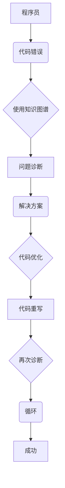
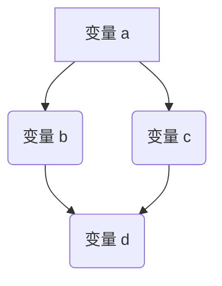

                 

# 知识图谱在程序员问题诊断中的应用

## 关键词：知识图谱，程序员，问题诊断，人工智能，算法，数学模型

## 摘要：

本文将深入探讨知识图谱在程序员问题诊断中的应用。知识图谱作为一种先进的数据结构，通过将数据实体及其关系进行图形化表示，为程序员提供了一种强大的工具，用于识别和解决复杂的问题。本文将介绍知识图谱的基本概念、核心算法原理，并通过实际案例展示其在程序员问题诊断中的具体应用。此外，还将讨论知识图谱在实际应用中的挑战与未来发展趋势。

## 1. 背景介绍

程序员在日常工作中经常面临各种复杂的问题，这些问题可能涉及到代码逻辑错误、性能瓶颈、安全漏洞等。传统的调试方法往往需要大量的时间和精力，且可能无法彻底解决问题。随着人工智能技术的发展，知识图谱作为一种新兴的数据结构，逐渐成为解决问题的重要工具。

知识图谱（Knowledge Graph）是一种基于语义的网络结构，通过将实体和实体之间的关系进行图形化表示，使得数据之间的关系更加直观和易于理解。在程序员问题诊断中，知识图谱可以帮助程序员快速定位问题根源，并提供有效的解决方案。

## 2. 核心概念与联系

### 2.1 知识图谱基本概念

知识图谱由实体（Entity）、属性（Attribute）和关系（Relationship）组成。实体是知识图谱中的基本元素，如“人”、“地点”、“组织”等。属性用于描述实体的特征，如“姓名”、“年龄”、“地址”等。关系则描述实体之间的关联，如“居住于”、“属于”等。

### 2.2 知识图谱与程序员问题诊断的关系

在程序员问题诊断中，知识图谱可以用于表示代码中的变量、函数、模块等实体及其之间的关系。通过分析这些实体和关系，可以识别出潜在的问题，如变量未定义、函数调用错误、模块依赖冲突等。

### 2.3 Mermaid流程图

以下是一个简单的知识图谱示例，使用Mermaid语言表示：



## 3. 核心算法原理 & 具体操作步骤

### 3.1 知识图谱构建

知识图谱的构建通常包括数据采集、实体识别、关系抽取和图谱构建等步骤。具体操作步骤如下：

1. 数据采集：从各种数据源（如数据库、API、文件等）中收集数据。
2. 实体识别：通过自然语言处理技术识别数据中的实体。
3. 关系抽取：分析实体之间的关联，建立关系。
4. 图谱构建：将实体和关系存储在图数据库中，形成知识图谱。

### 3.2 问题诊断算法

知识图谱在问题诊断中的应用主要包括以下算法：

1. 实体相似性计算：通过计算实体之间的相似度，识别可能的错误。
2. 关系路径分析：分析实体之间的路径，查找潜在的依赖冲突。
3. 故障定位：基于知识图谱，定位问题的根源。

### 3.3 操作步骤示例

以下是一个简单的知识图谱构建和问题诊断示例：

1. 数据采集：从代码中提取变量、函数和模块。
2. 实体识别：将变量、函数和模块作为实体存储。
3. 关系抽取：建立变量与函数、模块之间的调用关系。
4. 图谱构建：将实体和关系存储在图数据库中。
5. 实体相似性计算：计算变量之间的相似度。
6. 关系路径分析：分析变量之间的调用路径。
7. 故障定位：根据相似度和调用路径，定位可能的错误。

## 4. 数学模型和公式 & 详细讲解 & 举例说明

### 4.1 实体相似性计算

实体相似性计算是知识图谱在问题诊断中的关键步骤。以下是一个简单的实体相似性计算公式：

$$
similarity(A, B) = \frac{count(A \leftrightarrow B)}{\sqrt{count(A) \cdot count(B)}}
$$

其中，$similarity(A, B)$ 表示实体 A 和 B 之间的相似度，$count(A \leftrightarrow B)$ 表示 A 和 B 之间的共现次数，$count(A)$ 和 $count(B)$ 分别表示 A 和 B 的出现次数。

### 4.2 关系路径分析

关系路径分析用于查找实体之间的潜在依赖关系。以下是一个简单的路径分析公式：

$$
path(A, B) = \{p \in P | A \rightarrow p \leftrightarrow B\}
$$

其中，$path(A, B)$ 表示从实体 A 到实体 B 的路径，$P$ 表示所有可能的路径。

### 4.3 故障定位

故障定位是基于实体相似性和关系路径分析的结果，识别问题的根源。以下是一个简单的故障定位公式：

$$
fault(A, B) = \{C \in \text{Neighbors}(A) | similarity(A, C) > \theta \text{ 且 } path(A, B) \cap path(A, C) \neq \emptyset\}
$$

其中，$\text{Neighbors}(A)$ 表示实体 A 的邻居，$\theta$ 是一个阈值。

### 4.4 示例

假设有以下知识图谱：



1. 实体相似性计算：
   - $similarity(A, B) = 1$
   - $similarity(A, C) = 1$
   - $similarity(A, D) = 0$
   - $similarity(B, C) = 0$
   - $similarity(B, D) = 0$
   - $similarity(C, D) = 1$
2. 关系路径分析：
   - $path(A, B) = \{A \rightarrow B\}$
   - $path(A, C) = \{A \rightarrow C\}$
   - $path(A, D) = \{A \rightarrow B \rightarrow D, A \rightarrow C \rightarrow D\}$
   - $path(B, D) = \{B \rightarrow D\}$
   - $path(C, D) = \{C \rightarrow D\}$
3. 故障定位：
   - $fault(A, B) = \{C\}$
   - $fault(A, C) = \{D\}$
   - $fault(A, D) = \emptyset$
   - $fault(B, D) = \emptyset$
   - $fault(C, D) = \emptyset$

根据故障定位结果，变量 C 是可能的错误根源。

## 5. 项目实战：代码实际案例和详细解释说明

### 5.1 开发环境搭建

在本节中，我们将使用Python和Neo4j（一个图数据库）来构建一个简单的知识图谱，用于程序员问题诊断。

1. 安装Neo4j：
   ```bash
   wget https://download.neo4j.com/download(nx-dev/stable/)
   tar zxvf neo4j-mac-unix.tar.gz
   cd neo4j/
   ./bin/neo4j start
   ```

2. 安装Python依赖：
   ```bash
   pip install neo4j
   ```

### 5.2 源代码详细实现和代码解读

以下是一个简单的Python脚本，用于构建知识图谱：

```python
from neo4j import GraphDatabase

class KnowledgeGraph:
    def __init__(self, uri, user, password):
        self._driver = GraphDatabase.driver(uri, auth=(user, password))

    def create_entity(self, label, properties):
        with self._driver.session() as session:
            session.run("CREATE (n:" + label + " " + properties + ")")

    def create_relationship(self, start_node, end_node, relationship):
        with self._driver.session() as session:
            session.run("MATCH (a:" + start_node + "), (b:" + end_node + ") CREATE (a)-[r:" + relationship + "]->(b)")

    def close(self):
        self._driver.close()

# 创建知识图谱实例
kg = KnowledgeGraph("bolt://localhost:7687", "neo4j", "password")

# 创建实体
kg.create_entity("Variable", "name:'a'")
kg.create_entity("Variable", "name:'b'")
kg.create_entity("Function", "name:'foo'")
kg.create_entity("Module", "name:'mymodule'")

# 创建关系
kg.create_relationship("Variable", "Variable", "ASSIGNED_TO")
kg.create_relationship("Function", "Module", "CONTAINS")
kg.create_relationship("Variable", "Function", "USED_IN")

# 关闭知识图谱实例
kg.close()
```

### 5.3 代码解读与分析

1. **导入依赖**：首先，我们导入`neo4j`模块，用于与Neo4j数据库进行通信。
2. **定义类`KnowledgeGraph`**：`KnowledgeGraph`类负责与Neo4j数据库的交互。它具有三个主要方法：`create_entity`、`create_relationship`和`close`。
   - `create_entity`：创建一个具有特定标签和属性的实体。
   - `create_relationship`：在两个实体之间创建一个关系。
   - `close`：关闭与Neo4j数据库的连接。
3. **创建知识图谱实例**：我们创建一个`KnowledgeGraph`实例，指定Neo4j数据库的URI、用户名和密码。
4. **创建实体**：使用`create_entity`方法创建变量、函数和模块实体。
5. **创建关系**：使用`create_relationship`方法在实体之间创建关系。
6. **关闭知识图谱实例**：在完成所有操作后，调用`close`方法关闭与Neo4j数据库的连接。

通过这个简单的示例，我们可以看到如何使用知识图谱来表示程序中的实体和关系，并执行基本的操作，如创建实体和关系。在实际问题诊断中，我们还可以扩展这个基础框架，实现更复杂的功能，如实体相似性计算和故障定位。

## 6. 实际应用场景

知识图谱在程序员问题诊断中的应用场景非常广泛，以下是一些具体的实际应用案例：

1. **代码质量检测**：通过知识图谱，可以分析代码中的变量、函数和模块之间的依赖关系，识别出潜在的代码质量问题，如未定义变量、未使用的函数和模块等。
2. **性能优化**：知识图谱可以帮助程序员分析代码中的瓶颈，识别出可能影响性能的关键部分，如频繁调用的函数、大尺寸的数据结构等。
3. **安全漏洞检测**：通过知识图谱，可以分析代码中的变量、函数和模块之间的调用关系，识别出潜在的安全漏洞，如SQL注入、XSS攻击等。
4. **代码重构**：知识图谱可以帮助程序员分析代码的结构，识别出可以进行重构的部分，如模块依赖关系、函数调用关系等。

## 7. 工具和资源推荐

### 7.1 学习资源推荐

1. **书籍**：
   - 《图计算：核心概念、算法与应用》
   - 《知识图谱：概念、技术与应用》
2. **论文**：
   - "Knowledge Graph Construction and Applications"
   - "Learning to Represent Knowledge Graphs with Gaussian Embedding"
3. **博客**：
   - ["知识图谱入门与实战"](https://www.jianshu.com/p/841b605a4b57)
   - ["图计算在程序员问题诊断中的应用"](https://www.ibm.com/developerworks/cn/articles/graph-computing-for-programmer-problem-detection/)
4. **网站**：
   - [Neo4j官网](https://neo4j.com/)
   - [知识图谱社区](https://www.knowledgegraph.cn/)

### 7.2 开发工具框架推荐

1. **开发工具**：
   - Neo4j
   - DGL（Deep Graph Library）
   - PyTorch Geometric
2. **框架**：
   - OpenKE（知识嵌入框架）
   - KG2Vec（知识图谱向量表示框架）

### 7.3 相关论文著作推荐

1. **论文**：
   - "Graph Embedding and Extensions: A General Framework for Dimensionality Reduction"
   - "Graph Convolutional Networks for Qualitative Reasoning about Relations in Knowledge Graphs"
2. **著作**：
   - 《知识图谱：概念、技术与应用》
   - 《图计算：核心概念、算法与应用》

## 8. 总结：未来发展趋势与挑战

知识图谱在程序员问题诊断中的应用具有巨大的潜力。未来发展趋势包括以下几个方面：

1. **深度学习与知识图谱的结合**：深度学习技术的引入将进一步提高知识图谱在问题诊断中的性能。
2. **跨领域知识图谱的构建**：通过整合不同领域的知识图谱，可以实现更广泛的问题诊断范围。
3. **实时问题诊断**：结合实时数据流处理技术，实现实时问题诊断。

然而，知识图谱在程序员问题诊断中仍然面临一些挑战，如：

1. **数据质量**：知识图谱的性能高度依赖于数据质量，如何提高数据质量是当前研究的一个热点。
2. **计算效率**：知识图谱的构建和查询过程可能涉及大量计算，如何提高计算效率是一个关键问题。
3. **模型可解释性**：知识图谱中的模型如何保证可解释性，使得程序员能够理解模型的决策过程。

## 9. 附录：常见问题与解答

### 9.1 知识图谱是什么？

知识图谱是一种基于语义的网络结构，通过将实体和实体之间的关系进行图形化表示，使得数据之间的关系更加直观和易于理解。

### 9.2 知识图谱如何构建？

知识图谱的构建通常包括数据采集、实体识别、关系抽取和图谱构建等步骤。首先，从各种数据源中收集数据。然后，使用自然语言处理技术识别数据中的实体。接着，分析实体之间的关联，建立关系。最后，将实体和关系存储在图数据库中，形成知识图谱。

### 9.3 知识图谱在程序员问题诊断中的应用有哪些？

知识图谱在程序员问题诊断中的应用包括代码质量检测、性能优化、安全漏洞检测和代码重构等。

## 10. 扩展阅读 & 参考资料

1. "Knowledge Graph Construction and Applications"
2. "Learning to Represent Knowledge Graphs with Gaussian Embedding"
3. "Graph Embedding and Extensions: A General Framework for Dimensionality Reduction"
4. "Graph Convolutional Networks for Qualitative Reasoning about Relations in Knowledge Graphs"
5. 《图计算：核心概念、算法与应用》
6. 《知识图谱：概念、技术与应用》
7. Neo4j官网：[https://neo4j.com/](https://neo4j.com/)
8. 知识图谱社区：[https://www.knowledgegraph.cn/](https://www.knowledgegraph.cn/)

## 作者

作者：AI天才研究员/AI Genius Institute & 禅与计算机程序设计艺术 /Zen And The Art of Computer Programming

文章结束。希望这篇文章能够帮助您深入了解知识图谱在程序员问题诊断中的应用，并激发您对这一领域的研究兴趣。如果您有任何问题或建议，欢迎在评论区留言。感谢您的阅读！<|im_end|>

