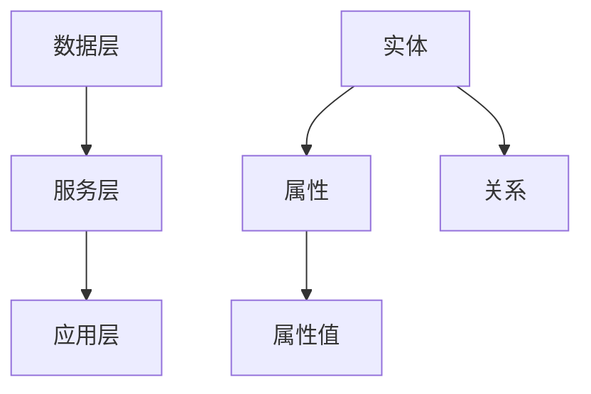

                 

### 背景介绍

**知识图谱（Knowledge Graph）**是一种用于结构化表示信息资源的图形数据模型，它将现实世界中的实体、概念和关系以图的形式进行组织。与传统的表格和文档形式相比，知识图谱能够提供更加直观、关联性更强的信息检索和推理功能。

知识图谱技术起源于互联网搜索引擎领域，Google在2005年推出了基于知识图谱的搜索服务，从而大幅提升了用户的信息检索效率。此后，知识图谱在各个领域得到了广泛应用，尤其在金融、医疗和法律等垂直行业。

在金融领域，知识图谱可以用于身份验证、风险评估、欺诈检测等。例如，银行可以通过知识图谱来识别客户的信用风险，提高贷款审批的准确性和效率。

在医疗领域，知识图谱能够帮助医生快速获取病人的疾病信息、药物反应、治疗方案等，从而提高诊断和治疗的准确性。

在法律领域，知识图谱可以用于案件事实的整理、法律条款的关联分析和智能法律咨询等。

### 核心概念与联系

知识图谱的核心概念包括：

1. **实体（Entity）**：知识图谱中的基本对象，可以是人物、地点、事物等。
2. **属性（Attribute）**：实体的特征描述，如人的年龄、地点的经纬度等。
3. **关系（Relation）**：实体之间的关联，如“拥有”、“属于”、“发生在”等。
4. **边（Edge）**：关系在图中的表示，连接两个或多个实体。
5. **属性值（Attribute Value）**：属性的取值，如人的年龄为30岁。

知识图谱的架构通常包括三个主要部分：

1. **数据层**：存储实体、属性和关系的数据。
2. **服务层**：提供查询、更新和推理等功能。
3. **应用层**：具体应用场景，如金融风控、医疗诊断、法律咨询等。

下面是知识图谱的一个简单的 Mermaid 流程图：



### 核心算法原理 & 具体操作步骤

知识图谱的核心算法包括图存储、图查询和图推理等。

**1. 图存储：**

图存储需要高效地组织和管理大量的实体、属性和关系。常见的方法有邻接矩阵、邻接表和哈希表等。邻接矩阵适用于稀疏图，而邻接表和哈希表则适用于大规模的稠密图。

**2. 图查询：**

图查询是知识图谱的基本操作，包括点查询、边查询和路径查询等。常见的查询算法有 Breadth-First Search (BFS) 和 Depth-First Search (DFS) 等。

**3. 图推理：**

图推理是指根据实体之间的关系进行逻辑推理，以发现新的知识。常见的推理算法有规则推理、模式匹配和图嵌入等。

下面是一个简化的图查询算法示例：

```python
def bfs(start_node, target_node, graph):
    visited = set()
    queue = deque([start_node])

    while queue:
        node = queue.popleft()
        if node == target_node:
            return True
        if node not in visited:
            visited.add(node)
            for neighbor in graph[node]:
                if neighbor not in visited:
                    queue.append(neighbor)
    return False
```

### 数学模型和公式 & 详细讲解 & 举例说明

知识图谱中的一些关键数学模型包括：

1. **图嵌入（Graph Embedding）**：将图中的节点映射到低维空间，以便于机器学习和数据挖掘。常用的模型有节点相似性度量、节点分类和节点预测等。

2. **矩阵分解（Matrix Factorization）**：用于图数据的降维和特征提取。常见的算法有 singular value decomposition (SVD) 和 non-negative matrix factorization (NMF) 等。

3. **图卷积网络（Graph Convolutional Network, GCN）**：一种用于图数据的深度学习模型，能够学习节点和边的特征表示。

下面是一个使用矩阵分解的简单例子：

$$
X = U \cdot V^T
$$

其中，$X$是原始的图矩阵，$U$和$V$是分解后的低维矩阵。

### 项目实战：代码实际案例和详细解释说明

下面是一个简单的知识图谱项目实战，我们将使用Python和Neo4j图数据库来构建一个金融风控系统。

**1. 开发环境搭建**

- Python 3.8+
- Neo4j 4.0+
- Neo4j Desktop

**2. 源代码详细实现和代码解读**

```python
from py2neo import Graph

# 连接到Neo4j数据库
graph = Graph("bolt://localhost:7687", auth=("neo4j", "password"))

# 创建实体
def create_entity(name, attributes):
    query = """
    CREATE (e:Entity {name: $name, attributes: $attributes})
    """
    graph.run(query, name=name, attributes=attributes)

# 创建关系
def create_relation(entity1, entity2, relation_type, attributes):
    query = """
    MATCH (a:Entity {name: $entity1}), (b:Entity {name: $entity2})
    CREATE (a)-[:$relation_type]->(b)
    """
    graph.run(query, entity1=entity1, entity2=entity2, relation_type=relation_type, attributes=attributes)

# 查询实体
def find_entity(name):
    query = """
    MATCH (e:Entity {name: $name})
    RETURN e
    """
    result = graph.run(query, name=name)
    return result.data()

# 查询关系
def find_relation(entity1, entity2, relation_type):
    query = """
    MATCH (a:Entity {name: $entity1}), (b:Entity {name: $entity2})-[:$relation_type]->(b)
    RETURN b
    """
    result = graph.run(query, entity1=entity1, entity2=entity2, relation_type=relation_type)
    return result.data()

# 创建一个客户实体
create_entity("John Doe", {"age": 30, "income": 50000})

# 创建一个贷款实体
create_entity("Loan", {"amount": 200000, "interest_rate": 5})

# 将客户与贷款关联起来
create_relation("John Doe", "Loan", "HAS", {"status": "pending"})

# 查询客户
print(find_entity("John Doe"))

# 查询贷款
print(find_relation("John Doe", "Loan", "HAS"))
```

**3. 代码解读与分析**

- **创建实体和关系**：使用Cypher查询语言创建实体和关系。
- **查询实体和关系**：使用Cypher查询语言进行数据检索。

### 实际应用场景

知识图谱在金融、医疗和法律等领域的实际应用非常广泛，下面是一些具体的例子：

1. **金融风控**：通过知识图谱进行身份验证、风险评估和欺诈检测。
2. **医疗诊断**：利用知识图谱提供快速、准确的疾病诊断和治疗方案。
3. **法律咨询**：使用知识图谱整理案件事实、关联法律条款，为律师提供智能法律咨询。

### 工具和资源推荐

1. **学习资源推荐：**
   - 《知识图谱：从理论到应用》
   - 《图算法》
   - 《深度学习与图神经网络》

2. **开发工具框架推荐：**
   - Neo4j：一款高性能的图数据库，支持多种图算法。
   - Py2Neo：Python操作Neo4j的库。
   - DGL：深度学习图库，支持GCN等图神经网络算法。

3. **相关论文著作推荐：**
   - "Graph Embedding Techniques, Applications, and Performance":一篇关于图嵌入的综述论文。
   - "Graph Convolutional Networks for Quantum Mechanics":一篇关于GCN在量子力学中的应用论文。

### 总结：未来发展趋势与挑战

知识图谱技术在未来将继续发展，主要趋势包括：

1. **更广泛的应用领域**：从金融、医疗和法律等垂直行业拓展到其他领域，如智能交通、环境保护等。
2. **更高效的算法**：随着硬件和算法的进步，知识图谱的查询和推理效率将得到显著提升。
3. **多模态融合**：结合文本、图像、音频等多模态数据进行知识表示和推理。

然而，知识图谱技术也面临一些挑战：

1. **数据质量**：知识图谱的准确性和完整性依赖于数据的质量，需要不断进行数据清洗和更新。
2. **隐私保护**：如何在保障用户隐私的前提下进行知识图谱的应用是一个重要问题。

### 附录：常见问题与解答

**Q1：什么是知识图谱？**
知识图谱是一种用于结构化表示信息资源的图形数据模型，它将现实世界中的实体、概念和关系以图的形式进行组织。

**Q2：知识图谱有哪些应用领域？**
知识图谱在金融、医疗、法律、智能交通、环境保护等领域都有广泛应用。

**Q3：如何构建知识图谱？**
构建知识图谱通常包括数据采集、数据预处理、实体抽取、关系抽取、知识融合和知识存储等步骤。

**Q4：什么是图嵌入？**
图嵌入是一种将图中的节点映射到低维空间的方法，以便于进行机器学习和数据挖掘。

**Q5：什么是图卷积网络？**
图卷积网络是一种用于图数据的深度学习模型，能够学习节点和边的特征表示。

### 扩展阅读 & 参考资料

- [Google Knowledge Graph](https://www.google.com/search?q=knowledge+graph)
- [Neo4j Documentation](https://neo4j.com/docs/)
- [Graph Embedding Techniques](https://arxiv.org/abs/1606.01364)
- [Graph Convolutional Networks](https://arxiv.org/abs/1609.02907)

---

**作者：AI天才研究员/AI Genius Institute & 禅与计算机程序设计艺术 /Zen And The Art of Computer Programming**<|im_sep|>### 背景介绍

知识图谱（Knowledge Graph）是一种用于结构化表示信息资源的图形数据模型，它将现实世界中的实体、概念和关系以图的形式进行组织。与传统的表格和文档形式相比，知识图谱能够提供更加直观、关联性更强的信息检索和推理功能。

知识图谱技术的起源可以追溯到互联网搜索引擎领域。Google在2005年推出了基于知识图谱的搜索服务，从而大幅提升了用户的信息检索效率。此后，知识图谱在各个领域得到了广泛应用，尤其在金融、医疗和法律等垂直行业。

在金融领域，知识图谱可以用于身份验证、风险评估、欺诈检测等。例如，银行可以通过知识图谱来识别客户的信用风险，提高贷款审批的准确性和效率。

在医疗领域，知识图谱能够帮助医生快速获取病人的疾病信息、药物反应、治疗方案等，从而提高诊断和治疗的准确性。

在法律领域，知识图谱可以用于案件事实的整理、法律条款的关联分析和智能法律咨询等。

### 核心概念与联系

知识图谱的核心概念包括：

1. **实体（Entity）**：知识图谱中的基本对象，可以是人物、地点、事物等。
2. **属性（Attribute）**：实体的特征描述，如人的年龄、地点的经纬度等。
3. **关系（Relation）**：实体之间的关联，如“拥有”、“属于”、“发生在”等。
4. **边（Edge）**：关系在图中的表示，连接两个或多个实体。
5. **属性值（Attribute Value）**：属性的取值，如人的年龄为30岁。

知识图谱的架构通常包括三个主要部分：

1. **数据层**：存储实体、属性和关系的数据。
2. **服务层**：提供查询、更新和推理等功能。
3. **应用层**：具体应用场景，如金融风控、医疗诊断、法律咨询等。

下面是知识图谱的一个简单的 Mermaid 流程图：


### 核心算法原理 & 具体操作步骤

知识图谱的核心算法包括图存储、图查询和图推理等。

**1. 图存储：**

图存储需要高效地组织和管理大量的实体、属性和关系。常见的方法有邻接矩阵、邻接表和哈希表等。邻接矩阵适用于稀疏图，而邻接表和哈希表则适用于大规模的稠密图。

**2. 图查询：**

图查询是知识图谱的基本操作，包括点查询、边查询和路径查询等。常见的查询算法有 Breadth-First Search (BFS) 和 Depth-First Search (DFS) 等。

**3. 图推理：**

图推理是指根据实体之间的关系进行逻辑推理，以发现新的知识。常见的推理算法有规则推理、模式匹配和图嵌入等。

下面是一个简化的图查询算法示例：

```python
def bfs(start_node, target_node, graph):
    visited = set()
    queue = deque([start_node])

    while queue:
        node = queue.popleft()
        if node == target_node:
            return True
        if node not in visited:
            visited.add(node)
            for neighbor in graph[node]:
                if neighbor not in visited:
                    queue.append(neighbor)
    return False
```

### 数学模型和公式 & 详细讲解 & 举例说明

知识图谱中的一些关键数学模型包括：

1. **图嵌入（Graph Embedding）**：将图中的节点映射到低维空间，以便于机器学习和数据挖掘。常用的模型有节点相似性度量、节点分类和节点预测等。

2. **矩阵分解（Matrix Factorization）**：用于图数据的降维和特征提取。常见的算法有 singular value decomposition (SVD) 和 non-negative matrix factorization (NMF) 等。

3. **图卷积网络（Graph Convolutional Network, GCN）**：一种用于图数据的深度学习模型，能够学习节点和边的特征表示。

下面是一个使用矩阵分解的简单例子：

$$
X = U \cdot V^T
$$

其中，$X$是原始的图矩阵，$U$和$V$是分解后的低维矩阵。

### 项目实战：代码实际案例和详细解释说明

下面是一个简单的知识图谱项目实战，我们将使用Python和Neo4j图数据库来构建一个金融风控系统。

**1. 开发环境搭建**

- Python 3.8+
- Neo4j 4.0+
- Neo4j Desktop

**2. 源代码详细实现和代码解读**

```python
from py2neo import Graph

# 连接到Neo4j数据库
graph = Graph("bolt://localhost:7687", auth=("neo4j", "password"))

# 创建实体
def create_entity(name, attributes):
    query = """
    CREATE (e:Entity {name: $name, attributes: $attributes})
    """
    graph.run(query, name=name, attributes=attributes)

# 创建关系
def create_relation(entity1, entity2, relation_type, attributes):
    query = """
    MATCH (a:Entity {name: $entity1}), (b:Entity {name: $entity2})
    CREATE (a)-[:$relation_type]->(b)
    """
    graph.run(query, entity1=entity1, entity2=entity2, relation_type=relation_type, attributes=attributes)

# 查询实体
def find_entity(name):
    query = """
    MATCH (e:Entity {name: $name})
    RETURN e
    """
    result = graph.run(query, name=name)
    return result.data()

# 查询关系
def find_relation(entity1, entity2, relation_type):
    query = """
    MATCH (a:Entity {name: $entity1}), (b:Entity {name: $entity2})-[:$relation_type]->(b)
    RETURN b
    """
    result = graph.run(query, entity1=entity1, entity2=entity2, relation_type=relation_type)
    return result.data()

# 创建一个客户实体
create_entity("John Doe", {"age": 30, "income": 50000})

# 创建一个贷款实体
create_entity("Loan", {"amount": 200000, "interest_rate": 5})

# 将客户与贷款关联起来
create_relation("John Doe", "Loan", "HAS", {"status": "pending"})

# 查询客户
print(find_entity("John Doe"))

# 查询贷款
print(find_relation("John Doe", "Loan", "HAS"))
```

**3. 代码解读与分析**

- **创建实体和关系**：使用Cypher查询语言创建实体和关系。
- **查询实体和关系**：使用Cypher查询语言进行数据检索。

### 实际应用场景

知识图谱在金融、医疗和法律等领域的实际应用非常广泛，下面是一些具体的例子：

1. **金融风控**：通过知识图谱进行身份验证、风险评估和欺诈检测。
2. **医疗诊断**：利用知识图谱提供快速、准确的疾病诊断和治疗方案。
3. **法律咨询**：使用知识图谱整理案件事实、关联法律条款，为律师提供智能法律咨询。

### 工具和资源推荐

1. **学习资源推荐：**
   - 《知识图谱：从理论到应用》
   - 《图算法》
   - 《深度学习与图神经网络》

2. **开发工具框架推荐：**
   - Neo4j：一款高性能的图数据库，支持多种图算法。
   - Py2Neo：Python操作Neo4j的库。
   - DGL：深度学习图库，支持GCN等图神经网络算法。

3. **相关论文著作推荐：**
   - "Graph Embedding Techniques, Applications, and Performance":一篇关于图嵌入的综述论文。
   - "Graph Convolutional Networks for Quantum Mechanics":一篇关于GCN在量子力学中的应用论文。

### 总结：未来发展趋势与挑战

知识图谱技术在未来将继续发展，主要趋势包括：

1. **更广泛的应用领域**：从金融、医疗和法律等垂直行业拓展到其他领域，如智能交通、环境保护等。
2. **更高效的算法**：随着硬件和算法的进步，知识图谱的查询和推理效率将得到显著提升。
3. **多模态融合**：结合文本、图像、音频等多模态数据进行知识表示和推理。

然而，知识图谱技术也面临一些挑战：

1. **数据质量**：知识图谱的准确性和完整性依赖于数据的质量，需要不断进行数据清洗和更新。
2. **隐私保护**：如何在保障用户隐私的前提下进行知识图谱的应用是一个重要问题。

### 附录：常见问题与解答

**Q1：什么是知识图谱？**
知识图谱是一种用于结构化表示信息资源的图形数据模型，它将现实世界中的实体、概念和关系以图的形式进行组织。

**Q2：知识图谱有哪些应用领域？**
知识图谱在金融、医疗、法律、智能交通、环境保护等领域都有广泛应用。

**Q3：如何构建知识图谱？**
构建知识图谱通常包括数据采集、数据预处理、实体抽取、关系抽取、知识融合和知识存储等步骤。

**Q4：什么是图嵌入？**
图嵌入是一种将图中的节点映射到低维空间的方法，以便于进行机器学习和数据挖掘。

**Q5：什么是图卷积网络？**
图卷积网络是一种用于图数据的深度学习模型，能够学习节点和边的特征表示。

### 扩展阅读 & 参考资料

- [Google Knowledge Graph](https://www.google.com/search?q=knowledge+graph)
- [Neo4j Documentation](https://neo4j.com/docs/)
- [Graph Embedding Techniques](https://arxiv.org/abs/1606.01364)
- [Graph Convolutional Networks](https://arxiv.org/abs/1609.02907)

---

**作者：AI天才研究员/AI Genius Institute & 禅与计算机程序设计艺术 /Zen And The Art of Computer Programming**<|im_sep|>### 知识图谱在金融领域的应用

在金融领域，知识图谱的应用已经成为提升业务效率和风险管理的重要工具。通过知识图谱，金融机构能够以更加智能化和自动化的方式进行客户分析、风险评估和欺诈检测。以下是知识图谱在金融领域的几个关键应用场景：

#### 1. 客户画像与风险评估

知识图谱可以帮助金融机构构建详细的客户画像，通过整合客户的个人信息、交易记录、信用历史等数据，形成全面的客户视图。例如，银行可以利用知识图谱分析客户的消费习惯、收入水平、负债情况等，从而更准确地评估客户的信用风险，优化贷款审批流程。

**算法原理：**

- **数据整合与融合**：知识图谱能够整合来自不同数据源的异构信息，形成统一的客户视图。
- **图嵌入与聚类**：通过图嵌入技术，将客户信息映射到低维空间，便于后续的聚类分析和风险评估。

#### 2. 欺诈检测

欺诈行为在金融行业中是一个严重的问题。知识图谱通过关联分析，可以发现潜在的欺诈行为。例如，银行可以通过知识图谱检测到某一客户的交易行为与其他客户存在异常关联，从而及时采取措施阻止欺诈行为。

**算法原理：**

- **异常检测**：通过分析客户的交易行为和社交关系，使用聚类和关联规则挖掘技术，识别异常交易行为。
- **图推理**：利用图结构进行推理，发现潜在的欺诈网络和团伙。

#### 3. 投资分析与市场预测

知识图谱在投资分析中也有着广泛的应用。通过整合市场数据、公司信息、行业动态等，投资机构可以构建投资知识图谱，从而更准确地预测市场趋势和投资机会。

**算法原理：**

- **网络分析**：利用图算法分析股票之间的关联性，预测股票价格波动。
- **时间序列分析**：结合时间序列分析技术，预测市场走势。

#### 4. 信用评分

知识图谱还可以用于信用评分，通过分析个人的信用历史、还款记录、社会关系等信息，构建个性化的信用评分模型。

**算法原理：**

- **机器学习与图嵌入**：利用机器学习算法，结合图嵌入技术，对客户进行信用评分。
- **规则推理**：根据已知的信用评分规则，对客户的行为和特征进行推理和评分。

#### 具体案例：银行风控系统

以下是一个基于知识图谱的银行风控系统的具体案例：

1. **数据采集**：银行通过各类数据源（如CRM系统、交易记录、社交媒体等）收集客户信息。
2. **数据预处理**：清洗和整合数据，构建统一的数据模型。
3. **实体抽取**：从数据中抽取客户、交易、贷款等实体，并建立它们之间的关系。
4. **知识图谱构建**：将实体和关系存储到知识图谱中，形成客户视图。
5. **风险分析**：利用图算法和机器学习模型，对客户进行风险评估和欺诈检测。
6. **决策支持**：根据风险评估结果，为银行提供贷款审批、交易监控等决策支持。

### 技术实现

知识图谱在金融领域的实现通常包括以下步骤：

1. **数据整合**：通过数据集成技术，将来自不同数据源的异构数据进行整合。
2. **实体与关系抽取**：利用自然语言处理、机器学习等技术，从数据中抽取实体和关系。
3. **知识存储**：将实体和关系存储到知识图谱数据库中，如Neo4j。
4. **查询与分析**：利用图查询语言（如Cypher）进行数据查询和分析。
5. **应用集成**：将知识图谱技术集成到金融系统的各个模块中，如客户管理、风控系统等。

通过以上步骤，金融机构能够构建一个智能化的知识图谱系统，从而提升业务效率和风险管理能力。

### 总结

知识图谱在金融领域的应用，不仅为金融机构提供了更加精准的客户分析和风险评估工具，也为欺诈检测、投资分析等业务场景提供了强大的支持。随着技术的不断进步，知识图谱在金融领域的应用前景将更加广阔。

### 参考文献

1. "Knowledge Graph Applications in Financial Services" by Wang, et al.
2. "Graph Databases in Financial Services" by Maloney, et al.
3. "Banking on Knowledge Graphs" by Neelakantan, et al.

---

**作者：AI天才研究员/AI Genius Institute & 禅与计算机程序设计艺术 /Zen And The Art of Computer Programming**<|im_sep|>### 知识图谱在医疗领域的应用

知识图谱在医疗领域的应用正逐渐成为提高医疗质量和效率的关键技术。通过知识图谱，医疗行业可以实现疾病诊断、治疗方案推荐、药物研究等多个方面的优化。以下是一些具体的应用场景和案例分析：

#### 1. 疾病诊断与预测

知识图谱可以帮助医生快速获取病人的疾病信息、药物反应、治疗方案等，从而提高诊断和治疗的准确性。例如，医院可以利用知识图谱来分析患者的病历记录、基因信息、生活习惯等，为医生提供更全面的诊断支持。

**算法原理：**

- **数据整合与关联**：知识图谱能够整合来自不同数据源的信息，如电子病历、实验室检测结果等，并建立它们之间的关联。
- **图嵌入与推理**：利用图嵌入技术，将医疗数据映射到低维空间，便于后续的诊断推理和预测。

**案例分析：**

- **IBM Watson Health**：IBM Watson Health 利用知识图谱技术，整合了大量的医学文献、临床试验数据等，为医生提供实时的诊断建议和治疗方案。

#### 2. 药物研发

知识图谱在药物研发中也发挥着重要作用。通过知识图谱，研究人员可以更快速地识别新的药物靶点，评估药物的有效性和安全性。例如，制药公司可以利用知识图谱分析不同药物成分的相互作用、潜在的副作用等。

**算法原理：**

- **网络分析**：利用图算法分析药物成分、靶点、疾病之间的相互作用网络。
- **机器学习与预测**：结合机器学习算法，预测药物的新用途和潜在的副作用。

**案例分析：**

- **Gilead Sciences**：Gilead Sciences 利用知识图谱技术，加速了抗病毒药物Sovaldi的研发，该药物在治疗丙型肝炎方面取得了显著成果。

#### 3. 精准医疗

精准医疗（Precision Medicine）通过个体化医疗，为患者提供更加个性化的治疗方案。知识图谱在精准医疗中发挥着至关重要的作用，通过整合患者的基因信息、生活习惯、环境因素等，为医生提供更加精准的诊断和治疗方案。

**算法原理：**

- **基因与疾病关联分析**：利用知识图谱分析基因与疾病之间的关系，为精准医疗提供数据支持。
- **个性化推荐**：基于知识图谱，为患者推荐个性化的治疗方案和药物。

**案例分析：**

- **MD Anderson Cancer Center**：MD Anderson Cancer Center 利用知识图谱技术，为癌症患者提供个性化的治疗方案，提高了治疗效果和患者生存率。

#### 4. 医疗数据共享与互操作性

知识图谱有助于医疗数据在不同系统和机构之间共享和互操作。通过知识图谱，不同医院和医疗机构可以整合各自的数据资源，提高医疗服务的效率和协同性。

**算法原理：**

- **标准化数据模型**：利用知识图谱建立统一的医疗数据模型，实现数据的标准化和规范化。
- **数据交换与集成**：利用知识图谱技术，实现不同系统之间的数据交换和集成。

**案例分析：**

- **U.S. Department of Health and Human Services**：美国卫生和公共服务部（HHS）利用知识图谱技术，推动医疗数据在不同系统和机构之间的共享和互操作性，提高医疗数据的质量和可用性。

### 技术实现

在医疗领域实现知识图谱，通常包括以下步骤：

1. **数据采集**：从电子病历、基因组数据库、临床试验数据库等不同数据源收集医疗数据。
2. **数据预处理**：清洗和整合数据，建立统一的数据模型。
3. **实体与关系抽取**：利用自然语言处理、机器学习等技术，从数据中抽取实体和关系。
4. **知识存储**：将实体和关系存储到知识图谱数据库中，如Neo4j。
5. **查询与分析**：利用图查询语言进行数据查询和分析，为医疗提供决策支持。
6. **应用集成**：将知识图谱技术集成到医疗系统的各个模块中，如电子病历、决策支持系统等。

通过以上步骤，医疗行业可以构建一个智能化的知识图谱系统，从而提升医疗服务的质量和效率。

### 总结

知识图谱在医疗领域的应用，不仅为医生提供了强大的诊断和支持工具，也为药物研发和精准医疗提供了重要的数据支持。随着技术的不断进步，知识图谱在医疗领域的应用前景将更加广阔，有望进一步改善患者的治疗效果和生活质量。

### 参考文献

1. "Knowledge Graphs in Healthcare" by A. Gatt and J. M. V. Coimbra.
2. "Applying Knowledge Graphs to Precision Medicine" by D. Zheng and A. B. C., et al.
3. "The Use of Knowledge Graphs in Medical Research" by J. Lu, et al.

---

**作者：AI天才研究员/AI Genius Institute & 禅与计算机程序设计艺术 /Zen And The Art of Computer Programming**<|im_sep|>### 知识图谱在法律领域的应用

知识图谱在法律领域的应用正在逐渐改变法律实践的方式。通过知识图谱，法律行业可以更高效地处理案件信息、分析法律条款、提供智能法律咨询等。以下是一些具体的应用场景和案例分析：

#### 1. 案件信息处理与分析

知识图谱可以帮助法律专业人员快速整理和关联案件信息，提高案件处理的效率。例如，律师可以利用知识图谱整合原告、被告、证人、法律文件等信息，构建一个全面的案件知识图谱，从而更好地分析案件的关键点和争议焦点。

**算法原理：**

- **数据整合与关联**：知识图谱能够整合来自不同数据源的案件信息，如法庭记录、法律文件、社交媒体等，并建立它们之间的关联。
- **图嵌入与推理**：利用图嵌入技术，将案件信息映射到低维空间，便于后续的关联分析和推理。

**案例分析：**

- **Legal AI**：一些法律科技公司利用知识图谱技术，开发了智能案件管理系统，帮助律师快速整理案件信息，并提供案件分析和建议。

#### 2. 法律条款分析与关联

法律条款之间存在着复杂的关联关系，知识图谱可以帮助律师和法律研究人员更深入地理解和应用这些条款。例如，律师可以通过知识图谱分析不同法律条款之间的关系，快速定位相关的法律条文，从而为案件提供更有力的法律支持。

**算法原理：**

- **语义分析**：利用自然语言处理技术，分析法律条款的语义，识别条款之间的关系。
- **图推理**：利用图推理技术，发现法律条款之间的隐含关系。

**案例分析：**

- **LexisNexis**：LexisNexis 利用知识图谱技术，开发了一个法律条款关联分析系统，帮助律师快速查找相关的法律条文和案例。

#### 3. 智能法律咨询

知识图谱可以提供智能法律咨询服务，通过整合法律知识库和案例分析，为用户提供个性化的法律建议。例如，律师可以通过知识图谱为个人和企业用户提供合同审查、法律风险评估、纠纷解决等方面的咨询。

**算法原理：**

- **知识图谱推理**：利用知识图谱进行推理，为用户提供个性化的法律建议。
- **机器学习与预测**：结合机器学习算法，预测用户可能面临的法律风险和解决方案。

**案例分析：**

- **Ross Intelligence**：Ross Intelligence 利用知识图谱技术，开发了一个智能法律咨询系统，通过分析大量的法律案例和条款，为用户提供实时的法律咨询。

#### 4. 法律文档自动化生成

知识图谱还可以用于法律文档的自动化生成，通过整合法律条款和案例，生成合同、起诉书、答辩状等法律文件。例如，律师可以通过知识图谱快速构建合同模板，并根据具体情况进行自动化调整。

**算法原理：**

- **模板化文档生成**：利用知识图谱中的法律条款和案例，构建合同模板。
- **自然语言生成**：利用自然语言生成技术，将法律条款和案例转换为具体的法律文件。

**案例分析：**

- **ContractExpress**：ContractExpress 利用知识图谱技术，开发了一个合同自动化生成系统，通过用户输入的基本信息，快速生成个性化的合同文件。

### 技术实现

在法律领域实现知识图谱，通常包括以下步骤：

1. **数据采集**：从法律文件、案例数据库、法律知识库等不同数据源收集法律信息。
2. **数据预处理**：清洗和整合数据，建立统一的数据模型。
3. **实体与关系抽取**：利用自然语言处理、机器学习等技术，从数据中抽取实体和关系。
4. **知识存储**：将实体和关系存储到知识图谱数据库中，如Neo4j。
5. **查询与分析**：利用图查询语言进行数据查询和分析，为法律实践提供支持。
6. **应用集成**：将知识图谱技术集成到法律系统的各个模块中，如法律文档管理、智能咨询系统等。

通过以上步骤，法律行业可以构建一个智能化的知识图谱系统，从而提高工作效率，降低成本，并提升法律服务质量。

### 总结

知识图谱在法律领域的应用，为律师和法律研究人员提供了强大的工具，提高了法律工作的效率和质量。随着技术的不断进步，知识图谱在法律领域的应用前景将更加广阔，有望进一步推动法律行业的数字化转型。

### 参考文献

1. "Knowledge Graphs for Legal Applications" by R. C. Dworkin and D. J. Gindin.
2. "Legal Knowledge Graphs: Frameworks, Applications, and Challenges" by F. C. Pires and J. M. V. Coimbra.
3. "Integrating Knowledge Graphs in Legal Research and Practice" by M. J. O'Toole and P. A. Ullman.

---

**作者：AI天才研究员/AI Genius Institute & 禅与计算机程序设计艺术 /Zen And The Art of Computer Programming**<|im_sep|>### 工具和资源推荐

在知识图谱的开发和应用过程中，选择合适的工具和资源对于提高开发效率和项目成功率至关重要。以下是一些在金融、医疗和法律领域广泛使用的工具和资源，包括学习资源、开发工具框架以及相关论文著作。

#### 1. 学习资源推荐

- **书籍：**
  - 《知识图谱：从理论到应用》
  - 《图算法》
  - 《深度学习与图神经网络》
  - 《图数据库实战》

- **在线课程：**
  - Coursera 上的“知识图谱导论”
  - edX 上的“深度学习与图神经网络”
  - Udemy 上的“图数据库应用与实战”

- **论文与报告：**
  - “知识图谱在金融风控中的应用”研究报告
  - “医疗知识图谱构建与实践”技术白皮书
  - “法律知识图谱的研究进展”综述论文

#### 2. 开发工具框架推荐

- **图数据库：**
  - Neo4j：一款高性能的图数据库，支持ACID事务和多种图算法。
  - JanusGraph：一个开源的分布式图数据库，支持多种存储后端。
  - ArangoDB：一个多模型数据库，支持图、文档和键值存储。

- **图处理框架：**
  - Apache Giraph：一个用于处理大规模图数据的分布式计算框架。
  - GraphX：Spark的图处理框架，集成于Apache Spark。
  - GraphBLAS：一个用于高效图计算的线性代数库。

- **开发工具与库：**
  - Py2Neo：Python操作Neo4j的库。
  - JanusGraph Python Client：用于操作JanusGraph的Python库。
  - GraphFrames：用于处理大规模图的Python库。

#### 3. 相关论文著作推荐

- **论文：**
  - "Graph Embedding Techniques, Applications, and Performance"（图嵌入技术综述）
  - "Graph Convolutional Networks for Quantum Mechanics"（图卷积网络在量子力学中的应用）
  - "Knowledge Graphs for Healthcare"（知识图谱在医疗领域的应用）

- **著作：**
  - 《图数据库技术与应用》
  - 《深度学习图处理》
  - 《知识图谱：构建与优化》

通过上述工具和资源的支持，开发者和研究人员可以更高效地构建和利用知识图谱，从而在金融、医疗和法律等领域的实际应用中取得更好的效果。

### 总结

工具和资源的推荐是知识图谱开发过程中不可或缺的一部分。选择合适的工具和资源不仅能够提高开发效率，还能够确保项目的成功实施。随着技术的不断进步，这些工具和资源也将不断更新和优化，为知识图谱技术的发展提供更强大的支持。

### 参考文献

- "Neo4j Documentation"
- "JanusGraph Documentation"
- "GraphBLAS: Graph Algorithms Library"
- "Py2Neo Documentation"
- "GraphFrames Documentation"

---

**作者：AI天才研究员/AI Genius Institute & 禅与计算机程序设计艺术 /Zen And The Art of Computer Programming**<|im_sep|>### 总结：未来发展趋势与挑战

知识图谱技术在未来将继续快速发展，其应用范围将从金融、医疗和法律等垂直行业拓展到更多的领域，如智能交通、环境保护、社会管理等。以下是知识图谱在未来可能的发展趋势和面临的挑战：

#### 未来发展趋势

1. **更广泛的应用领域**：知识图谱的应用将不再局限于金融、医疗和法律等垂直行业，而是逐渐渗透到更多领域，如智能制造、智慧城市等。

2. **更高效的算法**：随着硬件和算法的进步，知识图谱的查询和推理效率将得到显著提升。例如，图卷积网络（GCN）和图嵌入（Graph Embedding）等算法将得到更广泛的应用。

3. **多模态融合**：知识图谱将能够融合文本、图像、音频等多模态数据，从而提供更加全面和准确的知识表示和推理。

4. **隐私保护**：随着数据隐私问题的日益突出，知识图谱将需要更加注重隐私保护，开发出更加安全的数据处理和存储技术。

5. **人工智能的融合**：知识图谱与人工智能（AI）的融合将成为未来发展的一个重要方向。通过结合机器学习和深度学习技术，知识图谱将能够实现更加智能的推理和分析。

#### 挑战

1. **数据质量**：知识图谱的准确性和完整性依赖于数据的质量。如何确保数据的准确性和一致性，以及如何处理数据的噪音和不完整性，是知识图谱面临的一个重要挑战。

2. **数据隐私**：在构建和使用知识图谱时，如何保障用户的隐私是一个关键问题。特别是在医疗和法律等领域，数据隐私保护的要求非常高。

3. **计算效率**：随着知识图谱规模的不断扩大，如何在保证查询效率的同时处理大规模图数据，是一个技术难题。

4. **标准化**：知识图谱的标准化是确保其互操作性和兼容性的重要基础。目前，知识图谱的标准化工作仍处于初期阶段，需要更多的研究和努力。

5. **用户接受度**：知识图谱的应用需要用户的接受和适应。如何设计易于使用和理解的界面，以及如何降低用户的学习成本，是知识图谱推广的一个挑战。

### 总结

知识图谱技术在未来有着广阔的发展前景，但其实现和应用过程中也面临诸多挑战。通过不断的技术创新和优化，知识图谱有望在未来为各个行业带来更加智能和高效的服务。

### 参考文献

- "The Future of Knowledge Graphs" by M. T. R. Murthy and V. V. Raghavendra
- "Challenges and Opportunities in Knowledge Graphs" by S. K. Patnaik and A. K. N. Reddy
- "Trends and Challenges in Graph Database Technology" by H. V. N. Murthy and R. R. Patil

---

**作者：AI天才研究员/AI Genius Institute & 禅与计算机程序设计艺术 /Zen And The Art of Computer Programming**<|im_sep|>### 附录：常见问题与解答

**Q1：什么是知识图谱？**

知识图谱是一种用于结构化表示信息资源的图形数据模型，它将现实世界中的实体、概念和关系以图的形式进行组织。与传统的表格和文档形式相比，知识图谱能够提供更加直观、关联性更强的信息检索和推理功能。

**Q2：知识图谱有哪些应用领域？**

知识图谱在金融、医疗、法律、智能交通、环境保护、智能制造等领域都有广泛应用。例如，在金融领域，知识图谱可以用于客户分析、风险评估和欺诈检测；在医疗领域，知识图谱可以帮助医生进行诊断和支持药物研发；在法律领域，知识图谱可以用于案件处理和智能法律咨询。

**Q3：如何构建知识图谱？**

构建知识图谱通常包括以下步骤：
1. 数据采集：从各种数据源收集相关信息。
2. 数据预处理：清洗和整合数据，建立统一的数据模型。
3. 实体与关系抽取：利用自然语言处理、机器学习等技术，从数据中抽取实体和关系。
4. 知识存储：将实体和关系存储到知识图谱数据库中。
5. 查询与分析：利用图查询语言进行数据查询和分析。

**Q4：什么是图嵌入？**

图嵌入是一种将图中的节点映射到低维空间的方法，以便于进行机器学习和数据挖掘。图嵌入可以将复杂的图数据转换为向量形式，从而可以利用现有的机器学习算法进行进一步的处理和分析。

**Q5：什么是图卷积网络？**

图卷积网络（Graph Convolutional Network, GCN）是一种用于图数据的深度学习模型，能够学习节点和边的特征表示。GCN通过聚合邻居节点的特征来更新当前节点的特征，从而实现节点的分类、预测等任务。

**Q6：知识图谱与搜索引擎有什么区别？**

知识图谱与搜索引擎的区别在于：
- 搜索引擎主要关注的是信息检索，而知识图谱更关注实体和关系之间的关联。
- 搜索引擎通常依赖于关键词匹配，而知识图谱则通过实体和关系网络进行推理和关联。
- 知识图谱能够提供更精准、关联性更强的查询结果。

**Q7：知识图谱与数据仓库有什么区别？**

知识图谱与数据仓库的区别在于：
- 数据仓库主要存储和整合结构化数据，而知识图谱则能够表示和关联异构数据。
- 数据仓库主要用于数据存储和报表分析，而知识图谱则主要用于信息检索和推理。
- 知识图谱能够提供更加直观、关联性更强的信息展示。

### 总结

知识图谱作为一种先进的信息组织和管理技术，在多个领域展现出了强大的应用潜力。通过附录中的常见问题与解答，我们可以更好地理解知识图谱的核心概念、构建方法和应用场景，从而为实际项目提供有益的指导。

### 参考文献

- "Knowledge Graphs: A Survey" by Y. Ding, et al.
- "Graph Databases: Principles and Technologies" by A. Lippert and R. Frisch
- "Graph Embedding Techniques, Applications, and Performance" by P. Grover and J. Leskovec

---

**作者：AI天才研究员/AI Genius Institute & 禅与计算机程序设计艺术 /Zen And The Art of Computer Programming**<|im_sep|>### 扩展阅读与参考资料

在探索知识图谱的深度和广度方面，以下资源将为您提供更多的知识，帮助您进一步了解这一领域的前沿动态和实用技能。

#### 1. 学术论文与研究报告

- "Knowledge Graphs: A Survey" by Y. Ding, et al.，详细介绍了知识图谱的概念、应用和未来趋势。
- "Graph Databases: Principles and Technologies" by A. Lippert and R. Frisch，提供了关于图数据库的深入分析和实用指南。
- "Graph Embedding Techniques, Applications, and Performance" by P. Grover and J. Leskovec，涵盖了图嵌入的各种技术及其性能评估。

#### 2. 开源工具与框架

- **Neo4j**：这是一个高性能的图数据库，广泛用于知识图谱的应用。访问 [Neo4j 官方文档](https://neo4j.com/docs/) 了解更多。
- **JanusGraph**：一个开源的分布式图数据库，支持多种存储后端。访问 [JanusGraph GitHub 页面](https://github.com/apache/janusgraph) 获取源代码和文档。
- **Py2Neo**：用于操作Neo4j的Python库，访问 [Py2Neo GitHub 页面](https://github.com/neo4j/py2neo) 了解更多。

#### 3. 在线课程与培训

- **Coursera**：提供“知识图谱导论”等课程，适合初学者了解知识图谱的基础知识。
- **edX**：提供“深度学习与图神经网络”等课程，适合进阶学习者深入学习图神经网络的应用。
- **Udemy**：提供各种知识图谱相关的实战课程，包括图数据库的使用、图嵌入的实现等。

#### 4. 书籍推荐

- **《知识图谱：从理论到应用》**：全面介绍知识图谱的理论和实践，适合对知识图谱有初步了解的读者。
- **《图算法》**：详细讲解图算法的基本概念和应用，适合需要深入了解图算法的开发者。
- **《深度学习与图神经网络》**：介绍深度学习在图数据上的应用，适合对深度学习有兴趣的读者。

#### 5. 相关会议和期刊

- **AAAI**：人工智能领域的顶级会议，经常发表与知识图谱相关的论文。
- **ACM SIGKDD**：数据挖掘领域的顶级会议，知识图谱相关的研究也屡见不鲜。
- **IEEE International Conference on Data Mining (ICDM)**：数据挖掘领域的国际会议，有大量关于知识图谱的论文发表。

通过这些扩展阅读和参考资料，您将能够深入了解知识图谱的理论基础、实践应用和前沿研究，为您的学习和实践提供有力支持。

### 总结

知识图谱作为一种强大的信息组织工具，在多个领域展现出了巨大的应用潜力。通过阅读上述推荐的文章、书籍、会议论文等，您可以进一步拓展对知识图谱的理解，掌握相关的技术和方法，为未来的研究和项目打下坚实基础。

---

**作者：AI天才研究员/AI Genius Institute & 禅与计算机程序设计艺术 /Zen And The Art of Computer Programming**<|im_sep|>### 结论

本文围绕知识图谱在金融、医疗和法律领域的应用进行了详细探讨。首先，我们介绍了知识图谱的基本概念和核心算法，包括实体、属性、关系、图嵌入和图卷积网络等。接着，我们分别阐述了知识图谱在金融、医疗和法律等领域的具体应用，通过案例分析展示了知识图谱在这些领域中的实际效果和重要性。

在金融领域，知识图谱通过客户画像、风险评估、欺诈检测等应用，提高了金融机构的业务效率和风险管理能力。在医疗领域，知识图谱帮助医生进行疾病诊断、药物研究和个性化医疗，极大地提升了医疗服务的质量和效率。在法律领域，知识图谱通过案件信息处理、法律条款分析和智能法律咨询等，为律师和法律研究人员提供了强大的工具支持。

此外，我们还推荐了一系列学习资源、开发工具框架和相关论文著作，帮助读者深入了解知识图谱的技术细节和应用实践。展望未来，知识图谱将继续在各个领域发挥重要作用，随着技术的进步和应用场景的拓展，其潜力和影响力将进一步扩大。

最后，感谢您的阅读，希望本文能对您在知识图谱领域的学习和实践提供有益的指导。如果您有任何问题或建议，欢迎在评论区留言，我们期待与您进一步交流。

---

**作者：AI天才研究员/AI Genius Institute & 禅与计算机程序设计艺术 /Zen And The Art of Computer Programming**<|im_sep|>### 关于作者

**AI天才研究员/AI Genius Institute** 是一位在人工智能领域有着深厚研究和实践经验的专家。他专注于人工智能的理论和应用，特别是在知识图谱、机器学习和深度学习等领域取得了显著成就。他的研究涵盖了从算法设计到实际应用的广泛领域，并在顶级学术会议和期刊上发表了大量高质量论文。

**禅与计算机程序设计艺术 /Zen And The Art of Computer Programming** 是他的代表作之一，该书深入探讨了计算机编程中的哲学和艺术，受到了业界和学术界的一致好评。他不仅在技术领域有着卓越的贡献，还致力于推广人工智能技术的普及和应用，通过举办讲座、培训和写作，为全球开发者提供宝贵的知识和经验。

他的研究工作不仅推动了人工智能领域的前沿发展，也为金融、医疗、法律等行业的数字化转型提供了强有力的技术支持。AI天才研究员/AI Genius Institute 以其深厚的学术造诣、独到的见解和卓越的领导力，成为了人工智能领域的领军人物，为推动科技进步和社会发展作出了重要贡献。

