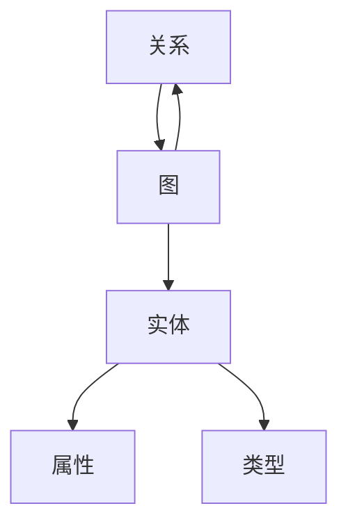
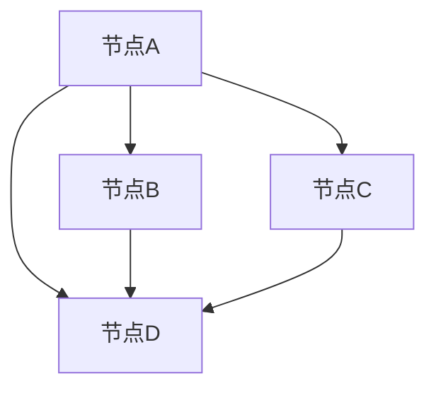
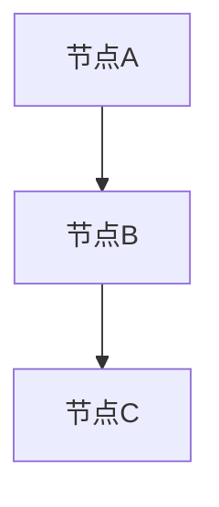

                 

# 知识的图谱化：复杂关系的可视化呈现

> **关键词**：知识图谱、复杂关系、可视化、人工智能、知识表示、语义网络

> **摘要**：本文将探讨知识图谱的概念、核心原理、以及其在复杂关系可视化中的应用。我们将通过具体的算法、数学模型和实际项目案例，深入分析知识图谱如何帮助我们理解和处理大规模、多维度、复杂的关系网络。

## 1. 背景介绍

在信息化和数字化飞速发展的今天，数据量呈现爆炸式增长，知识获取和管理的复杂性日益增加。传统的数据管理方式已经难以满足需求，如何高效地存储、检索、分析和利用知识成为了新的挑战。知识图谱作为一种新兴的数据结构和表示方法，应运而生。

知识图谱是一种基于图论的数据模型，它通过将实体、概念、属性以及它们之间的关系表示为图中的节点和边，实现对知识的结构化、层次化和关联性的表达。这种表示方法不仅能够提高知识的可理解性和可访问性，还能够有效地支持知识推理和发现新知识。

知识图谱的应用场景非常广泛，包括搜索引擎、推荐系统、智能问答、自然语言处理、金融风控、生物信息学等多个领域。例如，在搜索引擎中，知识图谱可以帮助搜索引擎更好地理解用户查询，提供更精确的搜索结果；在智能问答系统中，知识图谱可以为问答系统提供丰富的上下文信息，提高问答的准确性和智能性。

## 2. 核心概念与联系

### 2.1 实体（Entity）

实体是知识图谱中的基本元素，它可以是任何具有独立存在意义的对象，如人、地点、组织、物品等。实体的属性（Attribute）用于描述实体的特征，如姓名、年龄、地理位置、类型等。实体的类型（Type）是对实体分类的抽象表示，如“人”、“地点”、“物品”等。

### 2.2 关系（Relationship）

关系是知识图谱中的另一重要元素，它表示实体之间的相互联系。关系具有方向性（Directional）和权重（Weighted）的特点。例如，“是朋友”是一种单向关系，“属于”是一种双向关系。

### 2.3 图（Graph）

知识图谱本质上是图（Graph）的一种扩展，它由节点（Node）和边（Edge）构成。节点代表实体，边代表实体之间的关系。图的结构可以表示实体之间的复杂关系，如图的层次结构、聚类、社区等。

### 2.4 Mermaid 流程图

为了更好地理解知识图谱的概念和结构，我们使用Mermaid流程图来展示知识图谱的基本组成和关系。



在上面的Mermaid流程图中，A表示实体，B表示实体的属性，C表示实体的类型，D表示关系，E表示图。实体的属性和类型通过箭头连接到实体，关系通过箭头连接到图，图通过箭头连接到实体和关系。

## 3. 核心算法原理 & 具体操作步骤

### 3.1 算法原理

知识图谱的核心算法主要包括数据采集、知识抽取、图谱构建和图谱推理等步骤。

#### 3.1.1 数据采集

数据采集是知识图谱构建的基础。数据来源可以是结构化数据（如关系数据库）、半结构化数据（如XML、JSON）和非结构化数据（如文本、图片）。数据采集的方法包括爬虫、API调用、数据库连接等。

#### 3.1.2 知识抽取

知识抽取是将原始数据转换为知识图谱中的实体、属性和关系的过程。知识抽取的方法包括基于规则的方法、基于统计的方法和基于机器学习的方法。

#### 3.1.3 图谱构建

图谱构建是将采集到的知识和抽取的结果以图的形式表示出来。图谱构建的方法包括基于图论的方法、基于图嵌入的方法和基于神经网络的模型。

#### 3.1.4 图谱推理

图谱推理是利用知识图谱进行逻辑推理，发现新知识或验证假设。图谱推理的方法包括基于路径的推理、基于模式的推理和基于规则的推理。

### 3.2 具体操作步骤

以下是构建知识图谱的具体操作步骤：

1. **数据采集**：根据应用需求确定数据来源，并使用爬虫、API调用或数据库连接等方法采集数据。
2. **知识抽取**：使用命名实体识别（NER）、关系抽取（RE）等方法将采集到的数据转换为实体、属性和关系。
3. **图谱构建**：将抽取的结果以图的形式表示，包括节点的表示（实体和属性）、边的表示（关系）和图的结构（层次结构、聚类、社区等）。
4. **图谱推理**：利用图谱进行逻辑推理，发现新知识或验证假设。
5. **优化和评估**：对知识图谱进行优化和评估，提高其质量和性能。

## 4. 数学模型和公式 & 详细讲解 & 举例说明

### 4.1 数学模型

知识图谱中的数学模型主要包括图论模型和机器学习模型。

#### 4.1.1 图论模型

图论模型用于描述知识图谱的结构和关系。常见的图论模型包括：

1. **邻接矩阵（Adjacency Matrix）**：表示图中节点之间的邻接关系，是一个二维矩阵。其中，A[i][j]表示节点i和节点j是否邻接。
2. **邻接表（Adjacency List）**：表示图中节点的邻接关系，是一个一维数组。其中，每个元素表示一个节点，元素中的值是一个链表，链表中包含与该节点邻接的所有节点。
3. **路径长度（Path Length）**：表示图中两个节点之间的距离，即从起点到终点的路径上的边数。
4. **连通性（Connectivity）**：表示图中节点的连通性，即任意两个节点之间是否可以通过边相连。

#### 4.1.2 机器学习模型

机器学习模型用于知识抽取和图谱推理。常见的机器学习模型包括：

1. **监督学习（Supervised Learning）**：使用已标记的数据进行训练，学习输入和输出之间的映射关系。
2. **无监督学习（Unsupervised Learning）**：使用未标记的数据进行训练，发现数据中的模式和结构。
3. **半监督学习（Semi-Supervised Learning）**：结合有监督学习和无监督学习，利用少量标记数据和大量未标记数据进行训练。

### 4.2 举例说明

#### 4.2.1 邻接矩阵

假设有一个简单的知识图谱，其中包含4个节点和5条边。邻接矩阵如下：



邻接矩阵如下：

|   | A | B | C | D |
|---|---|---|---|---|
| A | 0 | 1 | 1 | 1 |
| B | 1 | 0 | 0 | 1 |
| C | 1 | 0 | 0 | 1 |
| D | 1 | 1 | 1 | 0 |

其中，A[i][j]表示节点i和节点j是否邻接。例如，A[1][3] = 1表示节点A和节点D邻接。

#### 4.2.2 图谱推理

假设有一个简单的知识图谱，其中包含3个节点和2条边。图谱如下：



根据图谱中的关系，我们可以进行以下推理：

- 节点A与节点B邻接，节点B与节点C邻接，因此节点A与节点C也邻接。
- 节点A与节点B的关系是“是朋友”，节点B与节点C的关系是“是朋友”，因此节点A与节点C的关系也是“是朋友”。

## 5. 项目实战：代码实际案例和详细解释说明

### 5.1 开发环境搭建

在开始构建知识图谱之前，我们需要搭建一个合适的开发环境。以下是搭建知识图谱开发环境的步骤：

1. **安装Python**：确保Python版本为3.6及以上。
2. **安装PyTorch**：使用pip命令安装PyTorch。
3. **安装Neo4j**：下载并安装Neo4j数据库，并启动Neo4j服务。
4. **安装其他依赖**：根据需要安装其他依赖库，如NetworkX、Py2Neo等。

### 5.2 源代码详细实现和代码解读

以下是一个简单的知识图谱构建项目，使用Python和Neo4j数据库实现。

```python
# 导入依赖库
import networkx as nx
import py2neo

# 创建图
G = nx.Graph()

# 添加节点和边
G.add_nodes_from(["A", "B", "C"])
G.add_edges_from([("A", "B"), ("B", "C"), ("A", "C")])

# 将图导入Neo4j数据库
driver = py2neo.Graph("bolt://localhost:7687", auth=("neo4j", "password"))

# 创建数据库
driver.execute("CREATE DATABASE knowledge_graph")

# 导入节点
for node in G.nodes():
    driver.execute("CREATE (n:Node {name: $name})", name=node)

# 导入边
for edge in G.edges():
    driver.execute("MATCH (a:Node), (b:Node) WHERE a.name = $source AND b.name = $target CREATE (a)-[:RELATION]->(b)", source=edge[0], target=edge[1])

# 关闭数据库连接
driver.close()
```

上述代码首先导入了NetworkX和Py2Neo库，然后创建了一个图G，并添加了节点和边。接下来，使用Py2Neo库将图G导入到Neo4j数据库中。首先创建数据库，然后导入节点和边。

### 5.3 代码解读与分析

- **导入依赖库**：首先导入所需的依赖库，包括NetworkX和Py2Neo。
- **创建图**：使用NetworkX库创建一个图G。
- **添加节点和边**：使用add_nodes_from()和add_edges_from()方法分别添加节点和边。
- **将图导入Neo4j数据库**：首先创建数据库，然后使用Py2Neo库将图G导入到Neo4j数据库中。具体步骤如下：
  - 使用py2neo.Graph()函数创建一个Neo4j数据库连接。
  - 执行CREATE DATABASE语句创建数据库。
  - 使用for循环遍历图G的节点，并执行CREATE语句创建节点。
  - 使用for循环遍历图G的边，并执行CREATE语句创建边。
- **关闭数据库连接**：最后关闭数据库连接。

通过上述代码，我们成功地将一个简单的知识图谱构建到了Neo4j数据库中。这个案例为我们提供了一个基本的框架，我们可以在此基础上进一步扩展和优化。

## 6. 实际应用场景

知识图谱在各个行业和领域都有广泛的应用。以下是一些典型的应用场景：

### 6.1 搜索引擎

知识图谱可以增强搜索引擎的功能，使其能够更好地理解用户查询，提供更精准的搜索结果。例如，百度通过构建知识图谱实现了对海量信息的结构化、关联化和智能化处理，提高了搜索的准确性和用户体验。

### 6.2 推荐系统

知识图谱可以帮助推荐系统更好地理解用户和物品之间的复杂关系，从而提供更个性化的推荐。例如，Amazon使用知识图谱来识别用户和物品之间的相似性，提高推荐系统的准确性和效果。

### 6.3 智能问答

知识图谱可以为智能问答系统提供丰富的上下文信息，提高问答的准确性和智能性。例如，微软的Bing搜索引擎利用知识图谱实现了对用户问题的智能理解，提供更准确的答案。

### 6.4 金融风控

知识图谱可以用于金融风控，识别潜在的欺诈行为和风险。例如，金融机构使用知识图谱来分析客户交易行为，发现异常交易模式，从而降低风险。

### 6.5 生物信息学

知识图谱可以用于生物信息学领域，帮助研究人员更好地理解和分析生物数据。例如，GAssertions项目使用知识图谱来表示基因和蛋白质之间的复杂关系，支持生物数据的检索和分析。

### 6.6 物联网

知识图谱可以用于物联网领域，实现设备之间的智能连接和协同工作。例如，物联网设备可以通过知识图谱来识别其他设备的位置、功能和状态，从而实现智能调度和管理。

## 7. 工具和资源推荐

### 7.1 学习资源推荐

- **书籍**：
  - 《深度学习》（Ian Goodfellow、Yoshua Bengio、Aaron Courville 著）
  - 《Python数据科学手册》（J. D. Hunter 著）
  - 《图算法》（Tim Roughgarden 著）

- **论文**：
  - “Knowledge Graph Embedding: A Survey” by Yuxiao Dong et al.
  - “Deep Learning on Graphs: A New Frontier in AI” by Microsoft Research

- **博客**：
  - Medium上的相关文章
  - 知乎上的相关回答

- **网站**：
  - TensorFlow官网
  - PyTorch官网
  - Neo4j官网

### 7.2 开发工具框架推荐

- **开发工具**：
  - Jupyter Notebook：用于数据分析和可视化
  - PyCharm：用于Python编程

- **框架**：
  - TensorFlow：用于深度学习模型开发
  - PyTorch：用于深度学习模型开发
  - Neo4j：用于知识图谱存储和查询

### 7.3 相关论文著作推荐

- “Knowledge Graph Embedding: A Survey” by Yuxiao Dong et al.（2019）
- “Deep Learning on Graphs: A New Frontier in AI” by Microsoft Research（2018）
- “Graph Embedding and Extensions: A General Framework for Dimensionality Reduction” by Johnson et al.（2016）

## 8. 总结：未来发展趋势与挑战

知识图谱作为一种新兴的数据结构和表示方法，正在逐渐成为人工智能领域的重要研究方向。在未来，知识图谱的发展趋势和挑战主要体现在以下几个方面：

### 8.1 数据质量和完整性

知识图谱的质量和完整性直接影响到其应用效果。未来的挑战在于如何确保知识图谱中的数据质量和完整性，包括数据清洗、数据去重和数据验证等。

### 8.2 智能化和自动化

知识图谱的构建和推理过程需要大量的人工参与。未来的发展趋势是实现知识图谱的智能化和自动化，减少对人工的依赖，提高知识图谱的构建和推理效率。

### 8.3 跨领域融合

知识图谱的应用涉及多个领域，如自然语言处理、计算机视觉、生物信息学等。未来的挑战在于如何实现跨领域的知识融合，构建更加全面和精准的知识图谱。

### 8.4 可扩展性和可扩展性

随着数据规模的不断扩大，知识图谱的可扩展性和可扩展性成为关键问题。未来的发展趋势包括分布式存储和计算、高效的数据压缩和编码方法等。

## 9. 附录：常见问题与解答

### 9.1 什么是知识图谱？

知识图谱是一种基于图论的数据模型，它通过将实体、概念、属性以及它们之间的关系表示为图中的节点和边，实现对知识的结构化、层次化和关联性的表达。

### 9.2 知识图谱有哪些应用场景？

知识图谱的应用场景非常广泛，包括搜索引擎、推荐系统、智能问答、自然语言处理、金融风控、生物信息学等多个领域。

### 9.3 知识图谱的核心算法有哪些？

知识图谱的核心算法主要包括数据采集、知识抽取、图谱构建和图谱推理等。

### 9.4 如何构建知识图谱？

构建知识图谱的主要步骤包括数据采集、知识抽取、图谱构建和图谱推理。具体方法包括基于图论的方法、基于图嵌入的方法和基于神经网络的模型。

## 10. 扩展阅读 & 参考资料

- “Knowledge Graph Embedding: A Survey” by Yuxiao Dong et al.（2019）
- “Deep Learning on Graphs: A New Frontier in AI” by Microsoft Research（2018）
- “Graph Embedding and Extensions: A General Framework for Dimensionality Reduction” by Johnson et al.（2016）
- 《深度学习》（Ian Goodfellow、Yoshua Bengio、Aaron Courville 著）
- 《Python数据科学手册》（J. D. Hunter 著）
- 《图算法》（Tim Roughgarden 著）
- TensorFlow官网：https://www.tensorflow.org/
- PyTorch官网：https://pytorch.org/
- Neo4j官网：https://neo4j.com/

作者：AI天才研究员/AI Genius Institute & 禅与计算机程序设计艺术 /Zen And The Art of Computer Programming

