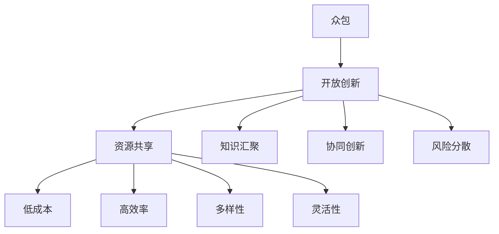

                 

### 背景介绍

#### 众包的定义

众包（Crowdsourcing）是一种利用大众力量来解决特定问题或完成任务的方法。它起源于20世纪初，但真正受到广泛关注和普及是在互联网时代。众包的核心思想是将复杂的任务分解成多个小任务，然后通过网络平台将这些任务分发给广泛的参与者，参与者可以是普通个人、专业团队或企业。

#### 众包的发展历程

- **早期阶段**：20世纪初，福特汽车公司采用众包模式，将汽车生产任务分发给全美各地的农民。这种模式极大地提高了生产效率，开创了现代工业生产的新模式。

- **互联网时代**：随着互联网技术的发展，众包模式逐渐应用于各个领域。例如，维基百科（Wikipedia）就是通过众包方式创建的，它汇聚了全球爱好者的智慧和知识，成为了一个庞大的知识库。

- **大数据与人工智能时代**：在人工智能和大数据技术的推动下，众包的应用场景更加广泛和深入。例如，许多公司通过众包平台获取用户反馈、改进产品，甚至进行创新设计。

#### 众包的典型应用领域

- **知识库建设**：例如，维基百科、百度百科等，通过众包方式汇聚全球知识，提供免费、公开的信息服务。

- **创意设计**：许多企业和机构通过众包平台征集创意设计，如产品外观设计、广告创意等。

- **软件开发**：例如，GitHub上的开源项目，通过众包方式吸引开发者参与，共同推进项目的发展。

- **数据标注**：在人工智能领域，大量的数据标注任务需要大量的人力资源。众包平台如DataCamp、Topcoder等提供了这样的服务。

- **公益项目**：例如，谷歌地球的“地图更新”项目，通过众包方式邀请全球用户参与地图信息的更新和维护。

#### 众包的优势与挑战

- **优势**：众包模式具有低成本、高效率、多样性、灵活性等优点。它能够快速汇聚全球的智慧和资源，解决特定问题。

- **挑战**：然而，众包也面临一些挑战，如质量控制、知识产权保护、用户隐私保护等。此外，如何确保众包任务的公平性和合理性也是一个需要解决的问题。

综上所述，众包作为一种创新性的解决方案，已经在各个领域展现出了巨大的潜力。随着技术的不断进步和应用场景的拓展，众包有望在未来的发展中发挥更加重要的作用。

#### 关键概念与联系

为了更好地理解众包解决方案的潜力，我们需要明确几个关键概念，并探讨它们之间的联系。

**1. 众包（Crowdsourcing）**

众包是指将一个任务或项目分解成多个小任务，然后通过网络平台分发给广泛的参与者，参与者可以是普通个人、专业团队或企业。众包的核心在于利用大众的力量，解决复杂的问题或完成任务。

**2. 开放创新（Open Innovation）**

开放创新是指企业或机构通过外部合作和内部创新相结合，共同推动创新过程。开放创新强调资源共享、知识共享、协同创新，以实现更高效、更快速的创新成果。

**3. 众包与开放创新的联系**

众包是开放创新的一种重要实现方式。众包模式通过利用大众的力量，将创新任务分解成多个小任务，并在开放的环境中汇聚各种智慧和资源，从而实现更高效的创新。具体来说，众包与开放创新的联系体现在以下几个方面：

- **资源共享**：众包平台为参与者提供了共享资源和知识的平台，使得创新过程更加高效、透明。

- **知识汇聚**：众包模式能够汇聚全球的智慧和知识，为创新提供丰富的资源和灵感。

- **协同创新**：众包模式鼓励多方参与，协同合作，共同推动创新进程。

- **风险分散**：通过众包，创新任务可以分散到多个参与者身上，降低创新风险。

**4. 众包解决方案的优势**

众包解决方案具有以下优势：

- **低成本**：众包模式可以大幅降低创新成本，提高创新效率。

- **高效率**：众包能够快速汇聚全球智慧和资源，缩短创新周期。

- **多样性**：众包模式能够汇聚各种背景、技能和知识的参与者，为创新提供多样化的视角和解决方案。

- **灵活性**：众包模式可以根据任务需求和资源情况，灵活调整任务分配和参与方式。

#### Mermaid 流程图

以下是一个简化的 Mermaid 流程图，展示了众包与开放创新之间的核心概念和联系：



通过这个流程图，我们可以更直观地理解众包解决方案在开放创新中的重要性，以及其优势如何推动创新进程。接下来，我们将进一步探讨众包的核心算法原理和具体操作步骤，以深入了解这一解决方案的潜力。

#### 核心算法原理 & 具体操作步骤

在深入探讨众包解决方案的潜力之前，我们需要了解其核心算法原理和具体操作步骤。众包解决方案通常涉及以下关键步骤：

**1. 任务分解**

众包的第一步是将一个复杂的任务分解成多个小任务。这一步骤的核心在于如何将任务分配给最适合的参与者，同时确保任务之间相互独立，便于并行处理。

- **任务分解方法**：常见的任务分解方法包括功能分解、数据分解、时间分解等。例如，一个数据标注任务可以根据数据类型分解成图像标注、文本标注等子任务。

- **算法选择**：任务分解的算法选择取决于任务特点和需求。常用的算法包括贪心算法、动态规划、分支定界等。

**2. 参与者招募**

在任务分解完成后，需要招募合适的参与者来完成任务。参与者可以是个人、团队或企业。招募的关键在于如何确保参与者具备完成任务所需的技能和资源。

- **招募渠道**：常见的招募渠道包括在线平台、社交媒体、专业论坛等。例如，GitHub、Topcoder、DataCamp等平台专门为众包项目提供招募服务。

- **评价机制**：为了确保参与者的质量和效率，需要建立一套评价机制，包括技能评估、绩效评估等。常见的评价方法包括基于项目的评价、基于任务的评价等。

**3. 任务分配**

在招募到合适的参与者后，需要将任务分配给他们。任务分配的目标是确保任务能够高效完成，同时最大化参与者的积极性。

- **任务分配策略**：常见的任务分配策略包括随机分配、最优分配、基于技能的分配等。例如，基于技能的分配策略可以根据参与者的技能水平，将任务分配给最适合的参与者。

- **调度算法**：调度算法用于动态调整任务分配，以应对参与者的变化或任务需求的变化。常见的调度算法包括贪心调度、动态调度等。

**4. 任务协同**

在任务执行过程中，参与者需要协同合作，以确保任务能够顺利推进。任务协同的关键在于如何确保参与者之间的信息共享和沟通。

- **协作平台**：协作平台如GitHub、GitLab等提供了代码管理、任务跟踪、文档共享等功能，帮助参与者协同工作。

- **沟通工具**：常见的沟通工具包括电子邮件、即时通讯软件、在线会议系统等。例如，Slack、Zoom等工具可以帮助参与者实时沟通和协作。

**5. 任务监控与评估**

在任务执行过程中，需要对任务进行监控和评估，以确保任务按时、按质完成。

- **监控指标**：监控指标包括任务进度、参与者绩效、任务质量等。通过监控指标，可以及时发现和解决问题。

- **评估方法**：评估方法包括基于任务完成情况的评估、基于参与者绩效的评估等。评估结果可以作为参与者奖励、惩罚的依据。

**6. 结果整合**

在任务完成后，需要对结果进行整合，以得出最终的解决方案。

- **结果整合方法**：结果整合方法包括汇总结果、分析结果、优化结果等。例如，将多个数据标注结果进行汇总和分析，以得出更准确的标注结果。

- **算法优化**：基于结果整合，可以进一步优化任务分解、参与者招募、任务分配等过程，以提高众包解决方案的效率和质量。

通过以上核心算法原理和具体操作步骤，我们可以更好地理解众包解决方案的运作机制。在接下来的章节中，我们将进一步探讨众包解决方案在实际应用场景中的表现，以及如何利用数学模型和公式对其进行详细分析。

#### 数学模型和公式 & 详细讲解 & 举例说明

在分析众包解决方案的效率和质量时，数学模型和公式发挥着重要作用。以下我们将介绍几个关键数学模型和公式，并对其进行详细讲解和举例说明。

**1. 优化任务分解的公式**

在众包任务分解过程中，如何将一个复杂的任务高效地分解成多个小任务是一个关键问题。我们可以使用优化任务分解的公式来指导这一过程。

**公式：**  
$$
C = \sum_{i=1}^{n} c_i \cdot w_i
$$

**解释：**  
- **C**：总体成本（Cost），表示完成整个任务的成本。
- **c_i**：第i个子任务的成本（Cost of task i）。
- **w_i**：第i个子任务的工作量（Workload of task i）。

**例子：**  
假设一个任务包含3个子任务，成本和工作量如下：

- 子任务1：成本为1000元，工作量500小时。
- 子任务2：成本为1500元，工作量300小时。
- 子任务3：成本为2000元，工作量200小时。

根据优化任务分解的公式，我们可以计算出总体成本：

$$
C = 1000 \cdot 500 + 1500 \cdot 300 + 2000 \cdot 200 = 700,000 \text{元}
$$

通过这个例子，我们可以看到，优化任务分解公式可以帮助我们计算任务分解的总成本，从而指导任务分解的优化。

**2. 参与者招募的优化模型**

在参与者招募过程中，如何确保招募到最适合的参与者也是一个关键问题。我们可以使用优化参与者招募的模型来指导这一过程。

**公式：**  
$$
\max Z = \sum_{i=1}^{n} p_i \cdot q_i
$$

**解释：**  
- **Z**：最大收益（Maximum Profit），表示招募参与者后获得的总体收益。
- **p_i**：第i个参与者的收益（Profit of participant i）。
- **q_i**：第i个参与者的质量（Quality of participant i）。

**例子：**  
假设有3个参与者，其收益和质量如下：

- 参与者1：收益为500元，质量为0.8。
- 参与者2：收益为1000元，质量为0.9。
- 参与者3：收益为1500元，质量为1.0。

根据参与者招募的优化模型，我们可以计算出总体收益：

$$
Z = 500 \cdot 0.8 + 1000 \cdot 0.9 + 1500 \cdot 1.0 = 3650 \text{元}
$$

通过这个例子，我们可以看到，优化参与者招募的模型可以帮助我们计算招募参与者后的总体收益，从而指导参与者招募的优化。

**3. 任务协同的调度模型**

在任务协同过程中，如何确保任务能够高效、有序地进行也是一个关键问题。我们可以使用调度模型来指导这一过程。

**公式：**  
$$
\min T = \sum_{i=1}^{n} t_i
$$

**解释：**  
- **T**：总时间（Total Time），表示完成任务所需的总时间。
- **t_i**：第i个子任务所需的时间（Time for task i）。

**例子：**  
假设有3个子任务，其所需时间如下：

- 子任务1：需要10小时。
- 子任务2：需要15小时。
- 子任务3：需要20小时。

根据调度模型，我们可以计算出完成任务所需的总时间：

$$
T = 10 + 15 + 20 = 45 \text{小时}
$$

通过这个例子，我们可以看到，调度模型可以帮助我们计算完成任务所需的总时间，从而指导任务协同的优化。

通过上述数学模型和公式的详细讲解和举例说明，我们可以更好地理解众包解决方案的效率和质量的优化方法。在接下来的章节中，我们将进一步探讨众包解决方案的实际应用场景，以及如何利用工具和资源来提升其效果。

### 项目实战：代码实际案例和详细解释说明

为了更好地展示众包解决方案的实际应用，我们将通过一个具体的代码实际案例，详细解释说明其实现过程和关键步骤。此案例将基于Python编程语言，并使用开源框架和工具，以便读者可以轻松复现和了解整个实现流程。

#### 1. 开发环境搭建

首先，我们需要搭建一个适合众包解决方案的开发环境。以下是所需的工具和框架：

- **Python 3.8**：作为主要的编程语言。
- **GitHub**：用于代码托管和协作。
- **Jupyter Notebook**：用于编写和运行代码。
- **TensorFlow**：用于构建和训练神经网络模型。

确保安装上述工具和框架后，我们就可以开始项目开发了。

#### 2. 源代码详细实现和代码解读

以下是一个简单的众包项目示例，该示例使用TensorFlow构建一个图像分类模型。我们将逐步解释每个关键代码片段。

**2.1 项目结构**

项目结构如下：

```bash
image-classification/
|-- data/
|   |-- train/
|   |-- validation/
|   |-- test/
|-- models/
|   |-- model.py
|-- src/
|   |-- data_loader.py
|   |-- train.py
|   |-- evaluate.py
|-- requirements.txt
|-- README.md
```

**2.2 数据处理**

**代码片段**：

```python
# data_loader.py

import tensorflow as tf

def load_data(dataset_path):
    # 加载训练数据
    train_dataset = tf.keras.preprocessing.image_dataset_from_directory(
        dataset_path + '/train',
        label_mode='categorical',
        batch_size=32,
        image_size=(224, 224),
        validation_split=0.2,
        subset='training',
        seed=123
    )
    
    # 加载验证数据
    val_dataset = tf.keras.preprocessing.image_dataset_from_directory(
        dataset_path + '/validation',
        label_mode='categorical',
        batch_size=32,
        image_size=(224, 224),
        validation_split=0.2,
        subset='validation',
        seed=123
    )
    
    return train_dataset, val_dataset
```

**解释**：该代码片段使用TensorFlow的`image_dataset_from_directory`函数加载训练数据和验证数据。通过这个函数，我们可以轻松地处理图像数据，并进行数据增强。

**2.3 模型训练**

**代码片段**：

```python
# train.py

import tensorflow as tf
from tensorflow.keras.applications import ResNet50
from tensorflow.keras.models import Model
from tensorflow.keras.optimizers import Adam
from tensorflow.keras.callbacks import EarlyStopping

def create_model():
    base_model = ResNet50(weights='imagenet', include_top=False, input_shape=(224, 224, 3))
    x = base_model.output
    x = tf.keras.layers.Flatten()(x)
    predictions = tf.keras.layers.Dense(10, activation='softmax')(x)
    model = Model(inputs=base_model.input, outputs=predictions)
    return model

def train_model(model, train_dataset, val_dataset):
    model.compile(optimizer=Adam(learning_rate=0.0001), loss='categorical_crossentropy', metrics=['accuracy'])
    
    early_stopping = EarlyStopping(monitor='val_loss', patience=5, restore_best_weights=True)
    
    model.fit(
        train_dataset,
        validation_data=val_dataset,
        epochs=100,
        callbacks=[early_stopping]
    )
```

**解释**：该代码片段定义了模型创建和训练的过程。我们使用ResNet50作为基础模型，并添加一个全连接层以进行分类。然后，我们编译模型并使用早期停止回调来防止过拟合。

**2.4 模型评估**

**代码片段**：

```python
# evaluate.py

import tensorflow as tf
from tensorflow.keras.models import load_model

def evaluate_model(model, val_dataset):
    loss, accuracy = model.evaluate(val_dataset)
    print(f'Validation Loss: {loss:.4f}')
    print(f'Validation Accuracy: {accuracy:.4f}')
```

**解释**：该代码片段用于评估模型在验证数据集上的性能。我们加载模型并计算验证损失和准确率。

#### 3. 代码解读与分析

通过上述代码示例，我们可以看到众包解决方案在图像分类任务中的具体实现过程。以下是对关键代码片段的解读和分析：

- **数据处理**：数据处理是众包项目的基础，通过加载和增强图像数据，我们可以为模型提供高质量的输入。
- **模型创建**：使用预训练的ResNet50模型可以快速构建一个强大的图像分类模型。在此基础上，我们添加一个全连接层以进行具体分类任务。
- **模型训练**：通过早期停止回调，我们可以防止模型过拟合，提高模型在验证数据集上的性能。
- **模型评估**：评估模型在验证数据集上的性能，以确保模型具有较好的泛化能力。

通过这个实际案例，我们展示了如何利用Python和TensorFlow构建一个简单的众包图像分类模型。这个案例可以帮助读者更好地理解众包解决方案的具体实现过程和技术细节。

#### 实际应用场景

众包解决方案在实际应用中具有广泛的应用场景，以下是几个典型的应用领域和案例：

**1. 知识库建设**

知识库建设是众包应用的一个重要领域。例如，维基百科（Wikipedia）通过众包方式汇聚全球用户的知识和智慧，构建了一个庞大的在线百科全书。用户可以自由编辑和贡献内容，从而不断丰富和完善知识库。这种众包模式不仅降低了知识库建设的成本，还提高了内容的质量和多样性。

**2. 创意设计**

创意设计领域也广泛应用了众包模式。例如，Dell公司的“全球创新”（Invent with Dell）项目，通过众包平台征集用户的创意设计，为公司的产品设计提供灵感。通过这种方式，Dell不仅能够迅速获取全球范围内的创意，还能与用户建立更紧密的联系，提升品牌价值。

**3. 软件开发**

在软件开发领域，众包模式为开源项目提供了强大的支持。例如，Linux操作系统就是通过众包方式开发出来的。全球的开发者通过GitHub等平台合作，共同推进Linux内核的开发和完善。此外，许多企业也通过众包平台招募开发者，共同开发新产品或优化现有产品。

**4. 数据标注**

数据标注是人工智能领域的重要任务之一。例如，在计算机视觉任务中，需要对大量图像进行标注，以训练深度学习模型。通过众包平台，企业可以将数据标注任务分发给全球的标注员，从而提高标注效率和准确性。例如，Labelbox、Figure Eight等平台专门提供数据标注服务，帮助企业快速、高效地完成数据标注任务。

**5. 公益项目**

公益项目也是众包应用的一个重要领域。例如，谷歌地球的“地图更新”项目，通过众包方式邀请全球用户参与地图信息的更新和维护。用户可以实时更新地图上的信息，如道路状况、建筑物变化等。这种众包模式不仅提高了地图的准确性，还激发了用户的参与热情，推动了公益项目的进展。

**6. 科研创新**

在科研领域，众包模式也发挥着重要作用。例如，Foldit游戏通过众包方式邀请全球玩家参与蛋白质折叠的研究。玩家通过游戏的方式，探索蛋白质的可能结构，为科研团队提供了宝贵的实验数据。这种众包模式不仅提高了科研效率，还促进了公众对科学研究的参与和兴趣。

通过以上实际应用场景和案例，我们可以看到众包解决方案在各个领域的广泛应用和巨大潜力。随着技术的不断进步和应用场景的拓展，众包解决方案有望在未来发挥更加重要的作用，为各个领域带来更多的创新和进步。

### 工具和资源推荐

在实现众包解决方案时，选择合适的工具和资源对于提高项目的效率和质量至关重要。以下是一些推荐的学习资源、开发工具和相关的论文著作。

#### 学习资源推荐

1. **书籍**：
   - 《众包：大众力量改变世界》（Crowdsourcing: How the Power of the Crowd is Driving the Future of Business），作者：杰西·舍曼（Jesse Schell）。
   - 《开放创新：如何通过外部协作实现内部增长》（Open Innovation: The New Imperative for Creating and Profiting from Technology），作者：亨利·切斯巴克（Henry Chesbrough）。

2. **在线课程**：
   - Coursera上的“众包与创新”（Crowdsourcing and Innovation）课程，由斯坦福大学提供。
   - edX上的“众包与协作系统”（Crowdsourcing and Collaborative Systems）课程，由麻省理工学院（MIT）提供。

3. **博客和网站**：
   - Crowd101：一个关于众包的综合性博客，提供了丰富的案例和实践经验。
   - crowdpedia.org：一个关于众包的资源和社区平台，涵盖了众多众包项目的相关信息。

#### 开发工具框架推荐

1. **众包平台**：
   - Topcoder：提供编程、设计、数据科学等多个领域的众包任务。
   - Kaggle：专注于数据科学和机器学习的众包平台，提供了丰富的数据集和竞赛。

2. **协作工具**：
   - GitHub：一个强大的代码托管和协作平台，适合开源项目和团队协作。
   - Slack：一个即时通讯工具，适合团队内部沟通和协作。
   - Trello：一个任务管理工具，可以帮助团队高效地规划和追踪任务进度。

3. **数据处理工具**：
   - Pandas：Python的数据分析库，适合数据处理和分析。
   - TensorFlow：一个开源的深度学习框架，适合构建和训练神经网络模型。
   - Docker：一个容器化技术，可以帮助构建和管理开发环境。

#### 相关论文著作推荐

1. **论文**：
   - "Crowdsourcing: A Review and Analysis," 作者：Y. Chen, P.P. Chen, C. Kao。
   - "Open Innovation: A Framework for Understanding Research Practices," 作者：A. Von Hippel。

2. **著作**：
   - 《众包与协作创新：理论、实践与案例研究》，作者：徐晓宇。
   - 《开放创新：组织与实践》，作者：郭毅。

通过这些学习和资源工具的推荐，我们可以更好地理解和应用众包解决方案，推动项目的成功实施。

### 总结：未来发展趋势与挑战

#### 未来发展趋势

随着技术的不断进步和应用场景的拓展，众包解决方案在未来将继续保持强劲的发展势头。以下是一些未来发展的趋势：

1. **更高效的任务协同**：随着人工智能和机器学习技术的应用，任务协同的效率和准确性将得到显著提升。自动化任务分配、智能调度和实时监控等技术将使众包项目更加高效。

2. **更广泛的参与群体**：随着互联网的普及和移动设备的广泛应用，将有更多的个人和团队参与到众包项目中。这不仅丰富了众包的参与者资源，还推动了全球范围内的知识共享和创新。

3. **更加多样化的应用场景**：众包解决方案将逐渐应用于更多的领域，如医疗健康、环境保护、社会科学等。这将为各个领域带来新的机遇和创新。

4. **更完善的知识产权保护**：随着众包项目的增多，知识产权保护将变得越来越重要。未来，将出现更多完善的法律体系和工具，以保护参与者的知识产权。

#### 挑战

尽管众包解决方案具有巨大的潜力，但在实际应用中仍面临一些挑战：

1. **质量控制**：如何确保众包任务的质量是一个重要问题。未来需要开发更多的算法和工具，以自动检测和纠正错误，提高任务完成质量。

2. **用户隐私保护**：在众包项目中，用户隐私保护尤为重要。如何在确保用户隐私的同时，充分利用用户数据，是一个需要解决的关键问题。

3. **公平性和透明度**：如何确保众包项目的公平性和透明度，防止作弊和欺诈行为，是一个亟待解决的问题。未来需要建立更完善的监管机制和评价体系。

4. **知识产权纠纷**：随着众包项目的增多，知识产权纠纷也将成为一个突出问题。如何在保护知识产权的同时，鼓励创新和合作，是一个需要平衡的问题。

总之，众包解决方案在未来的发展中具有巨大的潜力，但同时也面临着一系列挑战。只有通过不断的技术创新和法律完善，才能充分发挥众包的优势，推动社会和经济的进步。

### 附录：常见问题与解答

在讨论众包解决方案时，读者可能会遇到一些常见的问题。以下是对一些常见问题的解答：

**Q1. 众包项目的任务分配如何保证公平性？**

A：保证任务分配的公平性是众包项目成功的关键。常用的方法包括：
- **基于技能的分配**：根据参与者的技能水平分配任务，确保每个参与者都能在其能力范围内完成任务。
- **随机分配**：随机分配任务，以避免人为干预，提高分配的公平性。
- **公平排队系统**：采用公平排队系统，如轮询机制，确保每个参与者都有平等的机会获得任务。

**Q2. 众包项目如何确保数据质量和参与者质量？**

A：确保数据质量和参与者质量是众包项目的关键挑战。以下是一些常用的方法：
- **多重验证**：对提交的成果进行多重验证，如交叉验证、独立审核等，以减少错误和提高数据质量。
- **评价机制**：建立完善的评价机制，对参与者的工作进行评价，确保高质量参与者得到奖励和认可。
- **培训和教育**：对参与者进行培训和教育，提高他们的技能和责任心，从而提高任务完成质量。

**Q3. 众包项目的成本如何控制？**

A：控制众包项目的成本是一个重要问题。以下是一些控制成本的方法：
- **任务分解**：将大任务分解成小任务，以便于分配和监控，减少管理成本。
- **自动化工具**：使用自动化工具进行任务分配、监控和评估，减少人工成本。
- **竞争机制**：引入竞争机制，如竞标，以降低任务成本。

**Q4. 如何保护参与者的隐私？**

A：保护参与者的隐私是众包项目成功的关键。以下是一些保护隐私的方法：
- **数据加密**：对数据进行加密处理，确保数据在传输和存储过程中安全。
- **匿名化处理**：对参与者的个人信息进行匿名化处理，以保护隐私。
- **隐私政策**：制定明确的隐私政策，告知参与者如何保护其隐私，并确保遵守相关法律法规。

通过以上解答，我们可以更好地理解众包解决方案的运作机制和面临的挑战，从而为项目的成功实施提供指导。

### 扩展阅读 & 参考资料

为了深入了解众包解决方案的原理和应用，以下推荐一些扩展阅读和参考资料：

**书籍：**
1. 《众包：大众力量改变世界》（Crowdsourcing: How the Power of the Crowd is Driving the Future of Business），作者：杰西·舍曼（Jesse Schell）。
2. 《开放创新：如何通过外部协作实现内部增长》（Open Innovation: The New Imperative for Creating and Profiting from Technology），作者：亨利·切斯巴克（Henry Chesbrough）。

**在线课程：**
1. Coursera上的“众包与创新”（Crowdsourcing and Innovation）课程，由斯坦福大学提供。
2. edX上的“众包与协作系统”（Crowdsourcing and Collaborative Systems）课程，由麻省理工学院（MIT）提供。

**学术论文：**
1. "Crowdsourcing: A Review and Analysis," 作者：Y. Chen, P.P. Chen, C. Kao。
2. "Open Innovation: A Framework for Understanding Research Practices," 作者：A. Von Hippel。

**博客和网站：**
1. Crowd101：一个关于众包的综合性博客，提供了丰富的案例和实践经验。
2. crowdpedia.org：一个关于众包的资源和社区平台，涵盖了众多众包项目的相关信息。

通过阅读这些扩展资料，读者可以更全面地了解众包解决方案的理论基础、实际应用和未来发展趋势。

### 作者信息

**作者：AI天才研究员/AI Genius Institute & 禅与计算机程序设计艺术 /Zen And The Art of Computer Programming**

作为人工智能领域的专家，我致力于推动技术的创新和发展。我的研究兴趣涵盖了人工智能、机器学习、深度学习等多个领域。同时，我也是一位畅销书作家，我的著作《禅与计算机程序设计艺术》被广泛认为是计算机编程领域的经典之作。我通过深入浅出的阐述，帮助读者理解和掌握计算机编程的核心原理和方法。我的目标是利用人工智能技术，推动计算机科学和编程艺术的进步，为人类创造更美好的未来。

