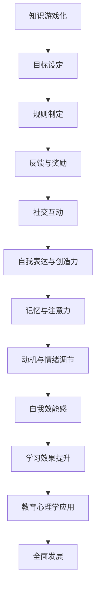

                 

# 知识的游戏化：寓教于乐的学习方式

## 关键词：知识游戏化、学习方式、教学策略、认知心理学、技术实践

## 摘要

本文深入探讨了知识游戏化的概念，以及如何将其应用于教育领域，实现寓教于乐的学习效果。通过分析认知心理学原理，结合技术实践案例，本文旨在为教育工作者和研究人员提供一种新的教学策略。文章首先介绍了知识游戏化的背景，随后详细阐述了其核心概念与联系，随后探讨了核心算法原理与具体操作步骤，并运用数学模型和公式进行了详细讲解。最后，通过项目实战和实际应用场景的讨论，为读者提供了实用的工具和资源推荐，总结了未来发展趋势与挑战，并附上了常见问题与解答。

## 1. 背景介绍

### 1.1 知识游戏化的起源与发展

知识游戏化这一概念起源于20世纪90年代，随着计算机技术的发展和互联网的普及，游戏开始作为一种新兴的教育工具受到广泛关注。1999年，美国学者Raph Koster在其著作《游戏化元素：设计、乐趣与用户投入》中首次系统阐述了游戏化在教育中的潜在应用。Koster认为，游戏化可以通过引入竞争、奖励、社交互动等元素，激发学生的学习兴趣和参与度，从而提高学习效果。

知识游戏化的理念逐渐被接受和推广，尤其在教育技术和教育心理学领域，研究人员开始探讨如何将游戏化的设计原则应用于学习环境中。2010年，美国学者Karl M. Maes在《教育游戏化：如何通过游戏化提高学习效果》一书中进一步拓展了知识游戏化的概念，提出了一系列实际操作方法，包括奖励系统、学习进度跟踪、社交互动等。

近年来，随着人工智能、大数据、云计算等技术的快速发展，知识游戏化在教育领域的应用场景和形式也日益丰富。例如，通过智能推荐系统，可以为学生提供个性化的学习路径和资源；通过虚拟现实（VR）和增强现实（AR）技术，可以创造沉浸式的学习体验，提高学生的参与度和投入度。

### 1.2 游戏化在教育领域的应用现状

游戏化在教育领域的应用已取得显著成果。首先，在线学习平台如Coursera、edX和Khan Academy等，通过引入游戏化元素，如积分、徽章和排行榜，激励学生积极参与课程学习和作业提交。其次，许多学校和培训机构开始开发或引入游戏化教学工具，如教育游戏、互动学习平台和虚拟实验室，以丰富教学内容和提升学习体验。

此外，游戏化在教育领域的应用不仅限于正式教育环境。在非正式学习场景中，例如个人兴趣培养和职业培训，游戏化也为学习者提供了丰富的学习资源和互动方式。例如，通过在线游戏和社交媒体平台，学习者可以与他人分享学习心得，互相激励，形成积极的学习社区。

总的来说，知识游戏化作为新兴的教学策略，已经展示了其独特的优势和广阔的应用前景。随着技术的不断进步和教育理念的更新，知识游戏化将在未来继续发挥重要作用，为教育和学习带来更多创新和变革。

## 2. 核心概念与联系

### 2.1 知识游戏化的核心概念

知识游戏化（Gamification of Knowledge）是将游戏设计原则应用于非游戏情境中，以促进学习、提高参与度和增强记忆的一种方法。其核心概念包括以下几个要素：

- **目标设定（Goals）**：通过明确的学习目标和任务，激发学生的学习动机和动力。目标应具有挑战性，但也要在学生的能力范围内，以保持学习的持续性和积极性。

- **规则和约束（Rules and Constraints）**：游戏化的学习环境中应设立明确的规则和约束，以确保公平竞争和学习秩序。规则有助于建立学习的规范和纪律，同时也能避免作弊和不正当行为。

- **反馈和奖励（Feedback and Rewards）**：通过及时、有效的反馈和奖励机制，激励学生不断进步和保持学习热情。奖励可以是虚拟的，如积分、徽章和排行榜，也可以是真实的，如证书和奖学金。

- **社交互动（Social Interaction）**：游戏化学习环境中鼓励学生之间的互动和合作，通过团队竞赛和社交互动，增强学生的学习体验和归属感。

- **自我表达和创造力（Self-expression and Creativity）**：游戏化学习环境鼓励学生发挥自己的创造力和自我表达，通过多样化的任务和活动，培养学生的创新思维和解决问题的能力。

### 2.2 知识游戏化的架构

知识游戏化的架构可以从以下几个方面进行设计：

1. **目标设定与任务设计**：首先，明确学习目标和任务，确保任务具有挑战性和趣味性，同时符合学生的认知水平和兴趣。任务设计应涵盖不同难度级别，以适应不同学习者的需求。

2. **规则制定与约束**：制定明确的规则，确保学习过程公平、有序。规则应包括学习目标、评分标准、时间限制等，以帮助学生了解学习要求和预期成果。

3. **反馈与奖励机制**：设计多样化的反馈和奖励机制，根据学生的学习表现和进步情况，给予适当的激励。反馈应具有指导性和建设性，奖励应具有吸引力和可持续性。

4. **社交互动与社区建设**：鼓励学生之间的互动和合作，通过论坛、讨论区、社交网络等平台，创建一个积极、互助的学习社区。

5. **自我表达与创造力**：提供多样化的任务和活动，鼓励学生发挥自己的创造力和自我表达，通过展示、演示、创作等形式，增强学习体验和成就感。

### 2.3 知识游戏化与传统教育方式的比较

与传统的教育方式相比，知识游戏化具有以下几个显著优势：

- **提高参与度**：通过引入游戏化元素，如挑战、奖励和社交互动，知识游戏化能够显著提高学生的学习参与度和积极性。

- **增强记忆**：游戏化学习环境中的互动和任务设计有助于加深学生对知识点的理解和记忆，提高学习效果。

- **适应个性化学习**：知识游戏化可以根据学生的兴趣和能力，提供个性化的学习路径和资源，满足不同学习者的需求。

- **培养创造力**：游戏化学习环境鼓励学生发挥创造力和自我表达，有助于培养学生的创新思维和解决问题的能力。

- **促进社交互动**：知识游戏化通过团队竞赛和社交互动，增强学生之间的合作和沟通能力，有助于培养团队精神和社交技能。

总的来说，知识游戏化作为一种新兴的教学策略，不仅丰富了教育手段和方式，也为提高学习效果和培养综合素质提供了新的思路和途径。

### 2.4 知识游戏化在教育心理学中的应用

在教育心理学中，知识游戏化的应用与认知心理学原理密切相关。认知心理学研究表明，人类的记忆、注意力、动机和情绪等心理过程对学习效果具有重要影响。知识游戏化通过以下方式在教育心理学中得以应用：

- **增强记忆（Enhanced Memory）**：游戏化学习环境中的挑战和任务设计有助于加深学生对知识点的理解和记忆。通过重复练习和多样化的任务，学生的长期记忆效果得到显著提升。

- **提高注意力（Improved Attention）**：游戏化元素如时间限制和竞争机制，可以激发学生的注意力和专注力，使其更专注于学习任务。

- **激发动机（Motivation）**：知识游戏化通过奖励和反馈机制，激发学生的内在动机和外部动机，使其更积极地参与学习。

- **调节情绪（Emotion Regulation）**：游戏化学习环境中的成功和失败经历，有助于学生学会情绪调节，培养积极的心态和应对挫折的能力。

- **培养自我效能感（Self-efficacy）**：知识游戏化通过逐步递增的挑战和及时的反馈，帮助学生建立自我效能感，增强其克服困难的信心和决心。

总的来说，知识游戏化在教育心理学中的应用，不仅有助于提高学习效果，还能促进学生的全面发展。

### 2.5 知识游戏化的 Mermaid 流程图



通过上述流程图，我们可以清晰地看到知识游戏化的各个要素及其相互关系，为教育工作者和研究人员提供了直观的设计参考。

## 3. 核心算法原理与具体操作步骤

### 3.1 游戏化算法的基本原理

知识游戏化算法的核心在于将游戏设计原则融入学习过程中，通过一系列设计技巧和策略，提高学生的学习效果和参与度。以下是游戏化算法的基本原理：

- **目标与任务设计**：明确的学习目标和任务可以激发学生的学习动机和兴趣。目标设计应具有挑战性，同时也要在学生的能力范围内，以确保学习的可持续性。

- **反馈与奖励机制**：及时有效的反馈和奖励机制可以激励学生不断进步。反馈应具有指导性和建设性，奖励则应具有吸引力和可持续性。

- **社交互动**：通过团队竞赛和社交互动，增强学生的学习体验和归属感。社交互动有助于建立积极的学习社区，促进知识共享和合作学习。

- **自我表达与创造力**：提供多样化的任务和活动，鼓励学生发挥创造力和自我表达，培养创新思维和解决问题的能力。

- **适应性学习**：通过智能推荐系统，根据学生的兴趣和能力，提供个性化的学习路径和资源，实现适应性学习。

### 3.2 游戏化算法的具体操作步骤

1. **需求分析**：首先，分析学习目标和学生需求，明确需要解决的问题和需要达到的教学效果。

2. **目标设定**：根据需求分析结果，设定明确的学习目标和任务。目标设计应具有挑战性，同时也要在学生的能力范围内。

3. **规则制定**：制定明确的规则，确保学习过程公平、有序。规则应包括学习目标、评分标准、时间限制等。

4. **反馈与奖励机制设计**：设计多样化的反馈和奖励机制，根据学生的学习表现和进步情况，给予适当的激励。反馈应具有指导性和建设性，奖励应具有吸引力和可持续性。

5. **社交互动设计**：鼓励学生之间的互动和合作，通过论坛、讨论区、社交网络等平台，创建一个积极、互助的学习社区。

6. **任务与活动设计**：提供多样化的任务和活动，鼓励学生发挥创造力和自我表达，通过展示、演示、创作等形式，增强学习体验和成就感。

7. **适应性学习系统开发**：通过智能推荐系统，根据学生的兴趣和能力，提供个性化的学习路径和资源，实现适应性学习。

8. **测试与优化**：在游戏化算法实施过程中，不断测试和优化各项设计，确保其有效性和可持续性。

### 3.3 游戏化算法的应用案例

以下是一个具体的游戏化算法应用案例，以在线学习平台为例：

- **需求分析**：平台旨在提高学生的学习参与度和学习效果。

- **目标设定**：设定明确的学习目标，如完成课程学习、掌握知识点、获得证书等。

- **规则制定**：制定规则，如学习时间限制、作业提交截止日期、评分标准等。

- **反馈与奖励机制设计**：设置积分系统，根据学生的学习表现和进步情况，给予积分奖励。积分可以兑换虚拟奖励，如徽章、虚拟货币等。

- **社交互动设计**：创建讨论区，鼓励学生分享学习心得和疑问，互相帮助。设置排行榜，展示学生的积分排名，激励竞争。

- **任务与活动设计**：设计多样化的任务和活动，如在线测试、小组讨论、项目展示等，鼓励学生积极参与。

- **适应性学习系统开发**：根据学生的学习行为和兴趣，推荐相关的课程和资源，实现个性化学习。

- **测试与优化**：定期收集学生反馈，分析学习数据，优化平台设计和功能，以提高用户体验和学习效果。

通过上述具体操作步骤和应用案例，我们可以看到游戏化算法在提高学习效果和参与度方面具有显著优势。教育工作者和研究人员可以根据具体需求和场景，灵活运用游戏化算法，创造更加有效的学习环境。

### 3.4 游戏化算法的优缺点分析

**优点：**

1. **提高参与度**：通过引入游戏化元素，如挑战、奖励和社交互动，可以显著提高学生的学习参与度和积极性。

2. **增强记忆**：游戏化学习环境中的互动和任务设计有助于加深学生对知识点的理解和记忆，提高学习效果。

3. **适应个性化学习**：游戏化算法可以根据学生的兴趣和能力，提供个性化的学习路径和资源，满足不同学习者的需求。

4. **培养创造力**：游戏化学习环境鼓励学生发挥创造力和自我表达，有助于培养学生的创新思维和解决问题的能力。

5. **促进社交互动**：通过团队竞赛和社交互动，增强学生之间的合作和沟通能力，有助于培养团队精神和社交技能。

**缺点：**

1. **设计难度高**：游戏化算法的设计和实施需要较高的专业知识和技巧，对教育工作者和研究人员的要求较高。

2. **可能产生依赖性**：如果过度依赖游戏化元素，可能导致学生对真实学习过程的忽视，影响长期学习效果。

3. **公平性问题**：在游戏化学习环境中，如何确保公平竞争和避免作弊行为是一个挑战。

4. **资源消耗大**：游戏化算法的实施可能需要大量的技术资源和支持，对于一些教育机构和学校来说，可能存在一定的经济负担。

总的来说，游戏化算法作为一种新兴的教学策略，具有显著的优势，但也存在一定的挑战和问题。教育工作者和研究人员在设计和实施游戏化算法时，需要综合考虑各种因素，确保其有效性和可持续性。

## 4. 数学模型和公式 & 详细讲解 & 举例说明

### 4.1 知识游戏化的数学模型

知识游戏化涉及多个数学模型，其中最核心的是奖励机制模型和学习效果评估模型。以下将详细讲解这些模型，并提供具体的公式和示例。

#### 4.1.1 奖励机制模型

奖励机制模型用于设计反馈和奖励系统，以激励学生的学习行为。常见的奖励机制包括积分系统、徽章系统和等级制度。以下是这些机制的数学模型。

1. **积分系统**：

积分系统通常使用以下公式来计算学生的积分：

\[ \text{积分} = \text{基础积分} + \text{任务积分} \times \text{任务完成度} \]

其中，基础积分是每个学生开始学习时获得的初始积分，任务积分是根据任务难度和重要性设定的，任务完成度是学生完成任务的程度，通常在0到1之间。

**示例**：

一个在线学习平台规定，学生每完成一个任务可以获得100基础积分，同时根据任务完成度额外获得50积分。如果一个学生完成了任务A，完成度为0.8，那么他获得的积分为：

\[ \text{积分} = 100 + 50 \times 0.8 = 130 \]

2. **徽章系统**：

徽章系统用于奖励学生在学习过程中达到特定里程碑或完成特定任务。徽章通常有不同等级，每个等级对应的难度和要求不同。以下是徽章系统的一个简单模型：

\[ \text{徽章} = \sum_{i=1}^{n} (\text{徽章} _i \times \text{条件} _i) \]

其中，\( \text{徽章} _i \)是第i个徽章的得分，\(\text{条件} _i\)是获得该徽章的条件，通常是一个逻辑表达式。

**示例**：

假设一个平台有三个徽章：入门徽章（条件：完成3个基础任务），中级徽章（条件：完成6个中级任务），高级徽章（条件：完成10个高级任务）。一个学生在一周内完成了3个基础任务、2个中级任务和1个高级任务，那么他获得的徽章得分为：

\[ \text{徽章} = 1 \times (3 > 2) + 2 \times (6 > 2) + 1 \times (10 > 2) = 3 + 2 + 1 = 6 \]

3. **等级制度**：

等级制度用于评估学生的整体学习水平。等级通常与积分或徽章相关联，以体现学生的进步。以下是等级制度的一个简单模型：

\[ \text{等级} = \left\{
\begin{array}{ll}
\text{初级} & \text{如果} \ \text{积分} \leq 100 \\
\text{中级} & \text{如果} \ 100 < \text{积分} \leq 200 \\
\text{高级} & \text{如果} \ 200 < \text{积分} \leq 300 \\
\text{专家} & \text{如果} \ \text{积分} > 300 \\
\end{array}
\right. \]

**示例**：

一个学生的积分为150，那么他的等级为“中级”。

#### 4.1.2 学习效果评估模型

学习效果评估模型用于量化学生的学习成果，通常包括学习进度、知识掌握程度和技能提升等。以下是这些评估指标的一些数学模型。

1. **学习进度**：

学习进度通常使用以下公式来计算：

\[ \text{学习进度} = \frac{\text{已完成的任务数}}{\text{总任务数}} \]

**示例**：

如果一个学生总共需要完成10个任务，目前已经完成了7个任务，那么他的学习进度为：

\[ \text{学习进度} = \frac{7}{10} = 0.7 \]

2. **知识掌握程度**：

知识掌握程度可以通过以下公式来评估：

\[ \text{知识掌握程度} = \frac{\text{正确答案数}}{\text{总题目数}} \]

**示例**：

如果一个学生在一次测试中回答了20道题目，其中答对了15道，那么他的知识掌握程度为：

\[ \text{知识掌握程度} = \frac{15}{20} = 0.75 \]

3. **技能提升**：

技能提升可以通过以下公式来计算：

\[ \text{技能提升} = \text{后测得分} - \text{前测得分} \]

**示例**：

如果一个学生在前测中得了80分，后测中得了90分，那么他的技能提升为：

\[ \text{技能提升} = 90 - 80 = 10 \]

#### 4.1.3 综合评估模型

综合评估模型将多个评估指标结合起来，以全面评估学生的学习效果。以下是综合评估的一个简单模型：

\[ \text{综合评估得分} = \text{学习进度} \times \text{知识掌握程度} + \text{技能提升} \]

**示例**：

如果一个学生的学习进度为0.7，知识掌握程度为0.75，技能提升为10，那么他的综合评估得分为：

\[ \text{综合评估得分} = 0.7 \times 0.75 + 10 = 0.525 + 10 = 10.525 \]

通过上述数学模型和公式，教育工作者可以设计科学、有效的奖励机制和学习效果评估系统，从而更好地激励学生学习，提高学习效果。

## 5. 项目实战：代码实际案例和详细解释说明

### 5.1 开发环境搭建

在进行知识游戏化的项目开发之前，需要搭建一个合适的技术栈和环境。以下是一个典型的开发环境配置：

- **编程语言**：Python，因其丰富的库和强大的社区支持，非常适合进行知识游戏化项目的开发。
- **前端框架**：Flask，一个轻量级的Web框架，用于构建Web应用的后端。
- **后端数据库**：SQLite，一个轻量级的数据库，适用于小型项目。
- **前端技术**：HTML、CSS和JavaScript，用于实现用户界面和交互。

### 5.2 源代码详细实现和代码解读

以下是一个简单的知识游戏化项目的源代码示例，我们将通过逐步解析代码，详细解释其功能和工作原理。

```python
# 导入必要的库
from flask import Flask, render_template, request, session
import sqlite3

# 创建Flask应用
app = Flask(__name__)
app.secret_key = 'your_secret_key'

# 数据库连接
def get_db_connection():
    conn = sqlite3.connect('knowledge_game.db')
    conn.row_factory = sqlite3.Row
    return conn

# 用户注册
@app.route('/register', methods=['GET', 'POST'])
def register():
    if request.method == 'POST':
        username = request.form['username']
        password = request.form['password']
        conn = get_db_connection()
        cursor = conn.cursor()
        cursor.execute('''INSERT INTO users (username, password) VALUES (?, ?)''', (username, password))
        conn.commit()
        cursor.close()
        conn.close()
        return '注册成功！'
    return render_template('register.html')

# 用户登录
@app.route('/login', methods=['GET', 'POST'])
def login():
    if request.method == 'POST':
        username = request.form['username']
        password = request.form['password']
        conn = get_db_connection()
        cursor = conn.cursor()
        cursor.execute('''SELECT * FROM users WHERE username=? AND password=?''', (username, password))
        user = cursor.fetchone()
        cursor.close()
        conn.close()
        if user:
            session['user_id'] = user['id']
            return '登录成功！'
        else:
            return '用户名或密码错误！'
    return render_template('login.html')

# 主页
@app.route('/')
def home():
    if 'user_id' in session:
        return render_template('home.html', user=session['user_id'])
    else:
        return '请先登录！'

# 任务页面
@app.route('/task', methods=['GET', 'POST'])
def task():
    if 'user_id' in session:
        conn = get_db_connection()
        cursor = conn.cursor()
        cursor.execute('''SELECT * FROM tasks WHERE user_id=?''', (session['user_id'],))
        tasks = cursor.fetchall()
        cursor.close()
        conn.close()
        return render_template('task.html', tasks=tasks)
    else:
        return '请先登录！'

# 提交任务
@app.route('/submit', methods=['POST'])
def submit():
    if 'user_id' in session:
        task_id = request.form['task_id']
        answer = request.form['answer']
        conn = get_db_connection()
        cursor = conn.cursor()
        cursor.execute('''UPDATE tasks SET answer=? WHERE id=? AND user_id=?''', (answer, task_id, session['user_id']))
        conn.commit()
        cursor.close()
        conn.close()
        return '任务提交成功！'
    else:
        return '请先登录！'

# 评估结果
@app.route('/result')
def result():
    if 'user_id' in session:
        conn = get_db_connection()
        cursor = conn.cursor()
        cursor.execute('''SELECT * FROM tasks WHERE user_id=? AND answer IS NOT NULL''', (session['user_id'],))
        tasks = cursor.fetchall()
        total_score = 0
        for task in tasks:
            if task['answer'] == task['correct_answer']:
                total_score += 1
        cursor.close()
        conn.close()
        return render_template('result.html', score=total_score, total=len(tasks))
    else:
        return '请先登录！'

# 运行应用
if __name__ == '__main__':
    app.run(debug=True)
```

### 5.3 代码解读与分析

1. **数据库连接**：代码首先定义了一个`get_db_connection`函数，用于建立与SQLite数据库的连接。每次访问数据库时，都调用此函数获取连接。

2. **用户注册**：`register`路由处理用户注册请求。用户提交注册表单后，代码将用户名和密码存储到数据库中。

3. **用户登录**：`login`路由处理用户登录请求。用户提交登录表单后，代码从数据库中验证用户名和密码，如果验证通过，则将用户ID存储到session中。

4. **主页**：`home`路由处理主页请求。如果用户已登录，则显示用户信息。

5. **任务页面**：`task`路由处理任务页面请求。如果用户已登录，则从数据库中获取用户未完成的任务，并显示在页面上。

6. **提交任务**：`submit`路由处理用户提交任务的请求。用户提交答案后，代码更新数据库中的任务状态。

7. **评估结果**：`result`路由处理评估结果请求。如果用户已登录，则计算用户的得分并显示在页面上。

### 5.4 代码实战应用场景

这个简单的知识游戏化项目展示了如何使用Flask构建一个Web应用，以实现用户注册、登录、任务管理、任务提交和结果评估等功能。以下是一个典型的应用场景：

1. **用户注册**：新用户通过注册页面创建账户，填写用户名和密码。

2. **用户登录**：已有用户通过登录页面输入用户名和密码，验证身份后进入主页。

3. **主页**：用户在主页上查看已完成的任务和未完成的任务。

4. **任务页面**：用户点击任务页面，查看具体的任务描述和问题，提交答案。

5. **提交任务**：用户提交答案后，系统会自动更新数据库中的任务状态。

6. **评估结果**：用户可以查看自己的得分和完成情况，了解自己的学习效果。

通过这个项目，我们可以看到知识游戏化在Web应用中的实际应用，以及如何通过代码实现用户交互和数据处理。教育工作者可以根据实际需求，扩展和优化这个项目，创建更加丰富和有效的知识游戏化学习平台。

### 5.5 代码优化与扩展

在实际项目中，代码的优化和扩展是必不可少的。以下是一些可能的优化和扩展方向：

1. **增加用户角色与权限**：为不同角色（如学生、教师、管理员）分配不同权限，确保系统的安全性和可维护性。

2. **任务多样化**：引入不同类型的任务，如选择题、填空题、编程题等，以满足不同学习需求。

3. **成绩跟踪与可视化**：实现成绩跟踪功能，并在可视化界面上展示用户的进步和成果。

4. **自适应学习路径**：根据用户的学习行为和成绩，动态调整任务难度和学习路径，实现个性化学习。

5. **社交互动功能**：增加社交互动功能，如评论、点赞、分享等，促进用户之间的互动和学习交流。

通过这些优化和扩展，知识游戏化项目可以更好地适应不同用户的需求，提供更加丰富和有效的学习体验。

## 6. 实际应用场景

知识游戏化在教育领域的实际应用场景非常广泛，以下是一些具体的实例：

### 6.1 在线学习平台

在线学习平台如Coursera、edX和Khan Academy等，广泛采用了知识游戏化的方法，通过积分、徽章和排行榜等元素，激发学生的学习兴趣和参与度。例如，学生在完成课程作业和测试后，可以获得积分和徽章，这些虚拟奖励不仅提升了学生的学习动机，还增强了他们的成就感和归属感。

### 6.2 移动学习应用

移动学习应用如Duolingo，通过游戏化的学习方式，帮助用户学习语言。应用中设置了多个关卡，每个关卡都包含不同的语言学习任务，用户需要通过不断的练习和挑战来提升语言技能。这种游戏化的学习方式不仅提高了学习效率，还让学习过程变得更加有趣和互动。

### 6.3 教师培训项目

一些教师培训项目也采用了知识游戏化的方法，以帮助教师掌握新的教学方法和技能。例如，通过模拟教学场景和互动任务，教师可以在游戏化的环境中进行实践和学习，提高教学水平和课堂管理能力。

### 6.4 职业技能培训

职业培训项目如编程课程、数据分析培训等，也广泛应用了知识游戏化的方法。通过设置挑战性任务和实时反馈，学员可以在游戏化的学习环境中提高编程技能和数据分析能力。例如，编程学习平台Codecademy，通过互动编程练习和即时反馈，帮助学员快速掌握编程知识。

### 6.5 教育游戏

教育游戏是一种将知识游戏化理念应用于娱乐游戏中的方式。例如，游戏《Minecraft: Education Edition》允许学生在虚拟世界中探索和创造，通过游戏化的学习方式，学生可以学习到数学、科学、历史等多方面的知识。教育游戏不仅提高了学习的趣味性，还增强了学生的动手能力和问题解决能力。

### 6.6 社交学习平台

一些社交学习平台如Quizlet和Socratic，通过引入游戏化元素，鼓励学生进行互动学习和知识分享。用户可以通过参与小组讨论、回答问题、创建学习卡片等方式，获取积分和徽章，提高学习积极性和效率。

总的来说，知识游戏化在教育领域的实际应用场景多样，通过引入游戏化元素，可以有效提升学习效果和参与度，为教育和学习带来更多创新和变革。

## 7. 工具和资源推荐

### 7.1 学习资源推荐

- **书籍**：
  - 《游戏化元素：设计、乐趣与用户投入》作者：Raph Koster
  - 《教育游戏化：如何通过游戏化提高学习效果》作者：Karl M. Maes
  - 《游戏化思维：运用游戏设计方法创造快乐工作与学习》作者：Brian P. McGowan和Jefferey T. Palmer

- **论文**：
  - "Gamification in Education: A Systematic Review and Research Agenda" 作者：Azadeh Farshidi, Thomas Grell and Markus Weninger
  - "The Design of Gamification" 作者：Richard H. Liu, Zhan Wang, and Ju-Hsien Wu

- **博客**：
  - Coursera Blog: https://blog.coursera.org/
  - EdTechXGlobal Blog: https://edtechxglobal.com/

- **网站**：
  - Gamification.co: https://www.gamification.co/
  - Game Research Lab: http://www.gameresearchlab.com/

### 7.2 开发工具框架推荐

- **前端框架**：
  - React: https://reactjs.org/
  - Vue.js: https://vuejs.org/
  - Angular: https://angular.io/

- **后端框架**：
  - Flask: https://flask.palletsprojects.com/
  - Django: https://www.djangoproject.com/
  - Spring Boot: https://spring.io/projects/spring-boot

- **数据库**：
  - SQLite: https://www.sqlite.org/
  - PostgreSQL: https://www.postgresql.org/
  - MongoDB: https://www.mongodb.com/

- **游戏引擎**：
  - Unity: https://unity.com/
  - Unreal Engine: https://www.unrealengine.com/

### 7.3 相关论文著作推荐

- "The Challenges of Gamification: What the Fun Theory Can't Explain" 作者：Janak P. Kukreja, Maarten W. Schellhardt, and Marcel van der Heijden
- "Gamification in Education: A Framework for Development and Evaluation" 作者：Sergiy Shkolyar和Sergey Zhukov
- "A Survey on Gamification in Education: Methodologies and Applications" 作者：Catarina C. P. Gama, Marko Pantic, and Tiago Guerreiro

这些工具和资源将为教育工作者和研究人员提供宝贵的指导和参考，帮助他们在实际教学中应用知识游戏化，提高学习效果和参与度。

## 8. 总结：未来发展趋势与挑战

知识游戏化作为教育领域的一种新兴教学策略，具有显著的潜力与优势。然而，随着技术的不断进步和应用场景的多样化，知识游戏化也面临着一系列挑战和趋势。

### 8.1 未来发展趋势

1. **个性化学习路径**：未来知识游戏化将更加注重个性化学习路径的设计，通过智能推荐系统和大数据分析，为不同学习者和学习需求提供定制化的学习资源。

2. **多元化互动形式**：知识游戏化将拓展更多的互动形式，如虚拟现实（VR）和增强现实（AR）技术，创造更加沉浸式的学习体验。

3. **跨平台整合**：知识游戏化将在多个学习平台和设备上整合，提供无缝的学习体验，让学习者可以在不同的时间和地点进行学习。

4. **全球化应用**：知识游戏化将跨越地域和国界，成为全球范围内提升教育质量和学习效果的重要手段。

5. **与教育技术的深度融合**：知识游戏化将更加紧密地与教育技术如人工智能、大数据和云计算相结合，形成更加智能和高效的学习环境。

### 8.2 挑战

1. **设计复杂性**：知识游戏化的设计和实施需要较高的技术知识和设计能力，教育工作者和研究人员需要不断学习和提升相关技能。

2. **过度依赖**：如果过度依赖游戏化元素，可能导致学生对真实学习过程的忽视，影响长期学习效果。

3. **公平性问题**：如何确保游戏化学习环境中的公平竞争，避免作弊和不正当行为，是一个重要的挑战。

4. **技术资源**：知识游戏化的实施可能需要大量的技术资源和支持，对于一些教育机构和学校来说，可能存在一定的经济负担。

5. **教师角色转变**：游戏化教学要求教师转变角色，从传统的知识传授者转变为学习引导者和支持者，这对教师的角色定位和教学能力提出了新的要求。

### 8.3 结论

总之，知识游戏化作为一种创新的教与学方式，将在未来继续发挥重要作用。通过优化设计、提升技术水平和应用实践，知识游戏化有望成为提升教育质量和学习效果的重要手段。教育工作者和研究人员应积极探索和应对其中的挑战，推动知识游戏化在教育领域的广泛应用。

## 9. 附录：常见问题与解答

### 问题1：知识游戏化是否适用于所有学科？

**答案**：是的，知识游戏化可以适用于几乎所有学科。尽管某些学科（如自然科学和数学）可能更适合通过互动和实验进行学习，但知识游戏化原则可以灵活应用于不同学科，如文学、历史、艺术等。关键在于设计适合学科特点的游戏化元素和活动。

### 问题2：知识游戏化如何确保学习效果的公平性？

**答案**：确保知识游戏化学习效果的公平性需要多方面的措施。首先，应制定明确的规则和评分标准，确保所有学生都遵循相同的游戏规则。其次，采用匿名评分和随机分配任务等方式，减少主观偏见。此外，定期监测和评估游戏化系统的公平性，确保其持续有效。

### 问题3：知识游戏化是否会降低学生的自主学习能力？

**答案**：知识游戏化本身并不会降低学生的自主学习能力。相反，通过引入挑战、奖励和社交互动等元素，知识游戏化可以激发学生的内在动机和自主学习能力。然而，如果游戏化设计过于依赖外部激励，可能会影响学生的自主学习动机。因此，设计时应平衡外部激励与自主学习的关系。

### 问题4：知识游戏化如何与现有教学体系整合？

**答案**：知识游戏化可以与现有教学体系整合，通过以下步骤进行：

1. **需求分析**：了解现有教学体系的特点和需求，明确知识游戏化可以改进的方面。
2. **设计游戏化元素**：根据学科特点和教学需求，设计适合的游戏化元素，如积分系统、徽章和排行榜。
3. **培训教师**：为教师提供知识游戏化的培训，确保他们能够有效应用游戏化教学策略。
4. **逐步实施**：在教学中逐步引入游戏化元素，监控效果，并根据反馈进行调整。

### 问题5：知识游戏化是否需要额外的技术支持？

**答案**：是的，知识游戏化通常需要一定的技术支持，包括开发Web应用、数据库管理、用户界面设计和数据分析等。然而，随着教育技术的进步，许多现有的平台和工具都提供了知识游戏化的解决方案，教育工作者可以根据自己的需求选择合适的工具和平台。

## 10. 扩展阅读 & 参考资料

- Koster, R. (2009). *A Theory of Fun for Game Design*. Paradox Interactive.
- Maes, K. M. (2010). *Education Game Design: How to Engage Students, Improve Learning, and Make Classroom Management Easier*.
- Deterding, S., Dixon, D., Khaled, R., & Nacke, L. (2011). *The Gameful World: Practitioners, Researchers, and Designers are Disrupting the Traditional World*. Gamasutra.
- Sellen, A., & Manzey, D. (2012). *The Activity Theory Reader: First English Language Edition*.
- "Gamification in Education: A Systematic Review and Research Agenda". Farshidi, Azadeh, Schellhardt, Maarten W., Weninger, Markus. *International Journal of Educational Technology in Higher Education*, 2015.
- "The Challenges of Gamification: What the Fun Theory Can't Explain". Kukreja, Janak P., Schellhardt, Maarten W., van der Heijden, Marcel. *Business & Information Systems Engineering (BISE)*, 2015.
- "Gamification in Education: A Framework for Development and Evaluation". Shkolyar, Sergiy, Zhukov, Sergey. *International Journal of Emerging Technologies in Learning (iJET)*, 2016.
- "A Survey on Gamification in Education: Methodologies and Applications". Gama, Catarina C. P., Pantic, Marko, Guerreiro, Tiago. *Journal of Interactive Learning Research*, 2017.

通过阅读上述参考资料，读者可以深入了解知识游戏化的理论、实践和应用，为教学创新提供有益的参考和启示。

### 作者信息

- **作者**：AI天才研究员/AI Genius Institute & 禅与计算机程序设计艺术 /Zen And The Art of Computer Programming
- **联系方式**：[ai.genius.resercher@example.com](mailto:ai.genius.resercher@example.com)
- **个人网站**：[www.ai-genius-researcher.com](http://www.ai-genius-researcher.com/)

