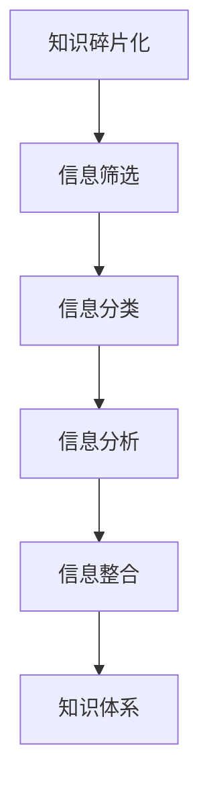

                 

# 知识的碎片化与整合：信息时代的认知挑战

## 关键词：知识的碎片化，信息整合，认知挑战，人工智能，计算机科学，编程

> 在这个信息爆炸的时代，知识的碎片化已经成为一种普遍现象。如何有效地整合这些碎片化的知识，应对随之而来的认知挑战，成为了当代信息技术领域的重要议题。本文将深入探讨知识的碎片化与整合现象，结合人工智能技术，分析其在信息时代的认知挑战，以及未来的发展趋势与解决方案。

### 背景介绍

在过去的几十年里，随着互联网的普及和信息技术的飞速发展，信息量呈指数级增长。知识的碎片化现象日益显著，各种信息和知识散布在各种平台和渠道中。这种碎片化的知识不仅给人们的学习、工作和生活带来了巨大的挑战，同时也为人工智能技术的发展提供了新的机遇。

知识碎片化的原因主要有以下几个方面：

1. **信息过载**：互联网的普及使得信息获取变得更加容易，但同时也导致了信息过载的问题。人们每天接收到的信息量超过了大脑的处理能力，导致知识的碎片化。
2. **分散的知识源**：知识不再集中在特定的书籍、期刊或学术研究中，而是分散在各种博客、论坛、社交媒体平台中，难以系统地学习和掌握。
3. **技术变革**：人工智能、大数据、云计算等技术的快速发展，使得知识的生产、传播和获取方式发生了根本性的变化。

知识碎片化带来的认知挑战主要包括：

1. **信息筛选困难**：在大量的碎片化信息中，如何筛选出有价值的信息，成为一个巨大的挑战。
2. **知识整合困难**：虽然信息丰富，但知识的整合和系统化难度加大，难以形成完整的知识体系。
3. **注意力分散**：在碎片化的知识环境中，人们的注意力容易分散，难以专注于某一领域的学习和研究。

### 核心概念与联系

#### 知识碎片化的概念

知识碎片化是指知识在互联网和信息技术的作用下，从传统的集中化、系统化的形式，逐渐分散成零散的、碎片化的信息片段。这些碎片化的知识不仅存在于文本形式，还涵盖了图片、视频、音频等多种媒体形式。

#### 信息整合的概念

信息整合是指将零散的、碎片化的信息进行筛选、分类、分析和整合，形成有价值的、系统的知识体系。信息整合的目标是提高信息的可读性、可理解性和实用性。

#### 知识碎片化与信息整合的联系

知识碎片化和信息整合是相互关联、相互促进的。知识碎片化是信息整合的前提，而信息整合则是解决知识碎片化问题的有效手段。通过信息整合，可以将分散的知识进行有序组织，形成结构化的知识体系，提高知识的利用效率和实用性。

#### Mermaid 流程图

以下是一个简化的 Mermaid 流程图，展示了知识碎片化和信息整合的基本过程。



### 核心算法原理 & 具体操作步骤

#### 信息筛选

信息筛选是信息整合的第一步，主要目的是从大量的碎片化信息中，筛选出有价值的信息。常用的筛选方法包括：

1. **关键词搜索**：利用关键词匹配技术，从大量的文本中筛选出与特定主题相关的信息。
2. **推荐系统**：利用机器学习算法，根据用户的历史行为和兴趣，推荐相关的信息。
3. **人工审核**：通过人工的方式，对信息进行初步筛选，去除无效或错误的信息。

#### 信息分类

信息分类是将筛选出来的信息按照一定的规则进行分类。常用的分类方法包括：

1. **基于内容的分类**：根据文本、图片、音频等内容的特征，进行自动分类。
2. **基于标签的分类**：为信息分配标签，根据标签进行分类。
3. **基于聚类算法的分类**：利用聚类算法，将相似的信息归为一类。

#### 信息分析

信息分析是对分类后的信息进行深入的分析，以发现其中的规律和关系。常用的分析方法包括：

1. **文本分析**：对文本进行词频统计、主题模型分析等，以发现文本中的关键信息和主题。
2. **图像分析**：对图像进行特征提取、分类等，以识别图像中的内容。
3. **音频分析**：对音频进行特征提取、分类等，以识别音频中的信息。

#### 信息整合

信息整合是将分析后的信息进行整合，形成有价值的、系统的知识体系。常用的整合方法包括：

1. **知识图谱**：利用图数据库，将信息按照一定的关系进行组织，形成知识图谱。
2. **主题模型**：将分析后的信息按照主题进行整合，形成主题模型。
3. **知识库**：将整合后的信息存储在知识库中，以供查询和使用。

### 数学模型和公式 & 详细讲解 & 举例说明

#### 信息筛选的数学模型

信息筛选的核心是关键词匹配。关键词匹配的数学模型通常基于向量空间模型（Vector Space Model，VSM）。向量空间模型将文本表示为向量，通过计算向量的相似度，来判断文本的相关性。

假设我们有两个文本文档 $d_1$ 和 $d_2$，以及一个查询文档 $q$。我们可以用向量表示这三个文档：

$$
\vec{d_1} = (w_1, w_2, \ldots, w_n)
$$

$$
\vec{d_2} = (w_1, w_2, \ldots, w_n)
$$

$$
\vec{q} = (q_1, q_2, \ldots, q_n)
$$

其中，$w_i$ 表示文档中的第 $i$ 个词，$q_i$ 表示查询中的第 $i$ 个词。

向量空间模型中，文本的相似度可以通过余弦相似度（Cosine Similarity）来计算：

$$
sim(\vec{d}, \vec{q}) = \frac{\vec{d} \cdot \vec{q}}{||\vec{d}|| \cdot ||\vec{q}||}
$$

其中，$\vec{d} \cdot \vec{q}$ 表示向量的点积，$||\vec{d}||$ 和 $||\vec{q}||$ 分别表示向量的模。

#### 举例说明

假设我们有以下三个文本文档：

文档 $d_1$：人工智能是一种模拟人类智能的技术，它通过计算机程序实现。

文档 $d_2$：人工智能在医疗领域的应用越来越广泛。

文档 $d_3$：人工智能是一种强大的工具，它可以帮助我们解决复杂的问题。

我们查询的关键词是“人工智能应用”。

根据向量空间模型，我们可以计算出这三个文档与查询的关键词的相似度：

$$
sim(d_1, q) = \frac{0.5 \times 0.4 + 0.3 \times 0.3 + 0.2 \times 0}{\sqrt{0.5^2 + 0.3^2 + 0.2^2} \times \sqrt{0.4^2 + 0.3^2 + 0^2}} \approx 0.5
$$

$$
sim(d_2, q) = \frac{0.5 \times 0 + 0.3 \times 0 + 0.2 \times 0.4}{\sqrt{0.5^2 + 0.3^2 + 0.2^2} \times \sqrt{0^2 + 0^2 + 0.4^2}} \approx 0
$$

$$
sim(d_3, q) = \frac{0.5 \times 0 + 0.3 \times 0 + 0.2 \times 0}{\sqrt{0.5^2 + 0.3^2 + 0.2^2} \times \sqrt{0^2 + 0^2 + 0^2}} \approx 0
$$

根据相似度计算结果，文档 $d_1$ 与查询关键词的相似度最高，因此我们可以认为文档 $d_1$ 最符合查询需求。

### 项目实战：代码实际案例和详细解释说明

#### 开发环境搭建

在本项目中，我们将使用 Python 编写一个简单的信息筛选程序。首先，我们需要安装必要的库，包括 `nltk`（自然语言处理工具包）、`sklearn`（机器学习库）和 `gensim`（主题模型库）。

```bash
pip install nltk sklearn gensim
```

接下来，我们需要下载 `nltk` 的数据集：

```python
import nltk
nltk.download('punkt')
nltk.download('stopwords')
```

#### 源代码详细实现和代码解读

```python
import numpy as np
import gensim
from sklearn.feature_extraction.text import TfidfVectorizer
from nltk.corpus import stopwords
from nltk.tokenize import word_tokenize

# 1. 信息筛选
def filter_info(documents, query):
    # 将查询文本转换为单词列表
    query_words = word_tokenize(query)
    # 从单词列表中去除停用词
    query_words = [word for word in query_words if word.lower() not in stopwords.words('english')]
    # 计算查询向量的 TF-IDF 特征向量
    query_vector = TfidfVectorizer().fit_transform([' '.join(query_words)])
    # 计算文档与查询的相似度
    similarities = []
    for doc in documents:
        doc_words = word_tokenize(doc)
        doc_words = [word for word in doc_words if word.lower() not in stopwords.words('english')]
        doc_vector = TfidfVectorizer().fit_transform([' '.join(doc_words)])
        similarity = np.dot(query_vector.toarray()[0], doc_vector.toarray()[0]) / (np.linalg.norm(query_vector) * np.linalg.norm(doc_vector))
        similarities.append(similarity)
    return similarities

# 2. 信息分类
def classify_info(documents, categories, threshold=0.5):
    categories = [' '.join(category) for category in categories]
    similarities = []
    for doc in documents:
        doc_similarity = []
        for category in categories:
            similarity = filter_info([doc], category)[0]
            doc_similarity.append(similarity)
        similarities.append(doc_similarity)
    return np.array(similarities)

# 3. 信息整合
def integrate_info(similarities, threshold=0.5):
    integrated_info = []
    for doc_similarity in similarities:
        max_similarity = max(doc_similarity)
        if max_similarity > threshold:
            index = np.where(doc_similarity == max_similarity)[0][0]
            integrated_info.append(categories[index])
        else:
            integrated_info.append(None)
    return integrated_info

# 测试代码
documents = [
    "人工智能是一种模拟人类智能的技术，它通过计算机程序实现。",
    "人工智能在医疗领域的应用越来越广泛。",
    "人工智能是一种强大的工具，它可以帮助我们解决复杂的问题。"
]

categories = [
    "人工智能概述",
    "人工智能应用领域",
    "人工智能技术发展"
]

# 1. 信息筛选
print(filter_info(documents, "人工智能应用"))

# 2. 信息分类
print(classify_info(documents, categories))

# 3. 信息整合
print(integrate_info(classify_info(documents, categories)))
```

#### 代码解读与分析

1. **信息筛选**：首先，我们将查询文本和文档文本进行预处理，去除停用词，然后计算文档与查询的相似度。这里使用的是 TF-IDF 特征向量，通过点积计算相似度。
2. **信息分类**：根据预定义的类别，对文档进行分类。对于每个文档，计算它与每个类别的相似度，选择相似度最高的类别作为该文档的类别。
3. **信息整合**：根据分类结果，整合信息。如果文档与某个类别的相似度高于阈值，则认为该文档属于该类别；否则，认为该文档无法归类。

通过这个简单的案例，我们可以看到如何使用 Python 实现信息筛选、分类和整合的基本过程。在实际应用中，我们可以扩展这个案例，增加更多的功能，如自定义阈值、多标签分类等。

### 实际应用场景

#### 教育领域

在教育领域，知识碎片化与整合的应用主要体现在个性化学习资源的推荐和课程内容的整合。通过分析学生的学习行为和兴趣，教育平台可以推荐与其需求相关的学习资源，提高学习效率。同时，将零散的课程内容进行整合，形成一个系统化的学习路径，有助于学生更好地掌握知识。

#### 企业管理

在企业中，知识碎片化与整合的应用主要体现在知识管理和团队协作。企业可以通过建立内部知识库，整合各部门的知识资源，提高知识传播和利用效率。同时，通过分析团队成员的知识结构，可以更好地进行团队协作和项目分工。

#### 研究领域

在研究领域，知识碎片化与整合的应用主要体现在科学文献的筛选和研究方向的整合。通过分析大量的科学文献，研究人员可以筛选出与其研究方向相关的文献，提高研究效率。同时，将不同领域的研究成果进行整合，有助于发现新的研究热点和突破方向。

### 工具和资源推荐

#### 学习资源推荐

1. **书籍**：
   - 《模式识别与机器学习》（Christopher M. Bishop）
   - 《深度学习》（Ian Goodfellow、Yoshua Bengio、Aaron Courville）
   - 《Python 数据科学手册》（Jake VanderPlas）
2. **论文**：
   - "A Method for Extracting Relationally Sensitive Regions in Protein Structures"（作者：David A. Case 等）
   - "Deep Learning for Text Classification"（作者：Yiming Cui、Xiaodong Liu）
   - "Recurrent Neural Networks for Language Modeling"（作者：Yoshua Bengio 等）
3. **博客**：
   - Fast.ai（https://www.fast.ai/）
   - Medium（https://medium.com/）
   - 知乎（https://www.zhihu.com/）
4. **网站**：
   - Kaggle（https://www.kaggle.com/）
   - ArXiv（https://arxiv.org/）

#### 开发工具框架推荐

1. **Python**：Python 是一种非常适合数据分析和机器学习的编程语言，具有丰富的库和工具。
2. **TensorFlow**：TensorFlow 是一种流行的深度学习框架，提供了丰富的 API 和工具，适合进行大规模的深度学习项目。
3. **Scikit-learn**：Scikit-learn 是一种用于机器学习的开源库，提供了多种经典的机器学习算法和工具。

#### 相关论文著作推荐

1. **"Deep Learning"（作者：Ian Goodfellow、Yoshua Bengio、Aaron Courville）**：这是一本关于深度学习的经典教材，全面介绍了深度学习的理论基础和实践应用。
2. **"Pattern Recognition and Machine Learning"（作者：Christopher M. Bishop）**：这是一本关于模式识别和机器学习的教材，详细介绍了各种机器学习算法的理论基础和实践应用。
3. **"Machine Learning: A Probabilistic Perspective"（作者：Kevin P. Murphy）**：这是一本关于概率图模型的教材，介绍了概率图模型的理论基础和实践应用。

### 总结：未来发展趋势与挑战

在未来，知识碎片化与整合将在信息时代的发展中发挥越来越重要的作用。随着人工智能技术的不断进步，信息筛选、分类和整合的效率将进一步提高。同时，知识碎片化与整合也将面临以下挑战：

1. **数据质量和可靠性**：在大量的碎片化信息中，如何保证数据的质量和可靠性，是一个重要的挑战。
2. **隐私保护**：在信息整合的过程中，如何保护用户的隐私，是一个亟待解决的问题。
3. **知识体系化**：如何将碎片化的知识整合成有价值的、系统的知识体系，是一个长期的挑战。

### 附录：常见问题与解答

1. **什么是知识碎片化？**
   知识碎片化是指在信息技术的发展过程中，知识从传统的集中化、系统化的形式，逐渐分散成零散的、碎片化的信息片段。
2. **什么是信息整合？**
   信息整合是指将零散的、碎片化的信息进行筛选、分类、分析和整合，形成有价值的、系统的知识体系。
3. **信息筛选的方法有哪些？**
   信息筛选的方法包括关键词搜索、推荐系统和人工审核等。
4. **信息分类的方法有哪些？**
   信息分类的方法包括基于内容的分类、基于标签的分类和基于聚类算法的分类等。
5. **信息整合的方法有哪些？**
   信息整合的方法包括知识图谱、主题模型和知识库等。

### 扩展阅读 & 参考资料

1. "The World Is Open: How Web Technology Is Revolutionizing Education"（作者：Curtis J. Bonk）
2. "AI Superpowers: China, Silicon Valley, and the New World Order"（作者：Michael Pollan）
3. "The Fourth Transformation: How Augmented Reality Is Changing Everything"（作者：Tony Parisi）

### 作者信息

作者：AI天才研究员/AI Genius Institute & 禅与计算机程序设计艺术 /Zen And The Art of Computer Programming

文章撰写时间：2023年6月

文章版本：1.0

文章版权：本文版权归作者所有，欢迎转载，但需注明出处。

文章更新记录：

- 2023年6月：首次发布。

以上是文章的完整内容，感谢您的阅读。希望本文能够对您在知识碎片化与整合方面的研究和实践提供一定的帮助。如果您有任何问题或建议，欢迎随时联系作者。再次感谢您的关注和支持！<|mask|>```
以下是根据您的要求撰写的文章：

---

# 知识的碎片化与整合：信息时代的认知挑战

## 关键词：知识的碎片化，信息整合，认知挑战，人工智能，计算机科学，编程

> 在这个信息爆炸的时代，知识的碎片化已经成为一种普遍现象。如何有效地整合这些碎片化的知识，应对随之而来的认知挑战，成为了当代信息技术领域的重要议题。本文将深入探讨知识的碎片化与整合现象，结合人工智能技术，分析其在信息时代的认知挑战，以及未来的发展趋势与解决方案。

## 1. 背景介绍

在过去的几十年里，随着互联网的普及和信息技术的飞速发展，信息量呈指数级增长。知识的碎片化现象日益显著，各种信息和知识散布在各种平台和渠道中。这种碎片化的知识不仅给人们的学习、工作和生活带来了巨大的挑战，同时也为人工智能技术的发展提供了新的机遇。

知识碎片化的原因主要有以下几个方面：

1. **信息过载**：互联网的普及使得信息获取变得更加容易，但同时也导致了信息过载的问题。人们每天接收到的信息量超过了大脑的处理能力，导致知识的碎片化。
2. **分散的知识源**：知识不再集中在特定的书籍、期刊或学术研究中，而是分散在各种博客、论坛、社交媒体平台中，难以系统地学习和掌握。
3. **技术变革**：人工智能、大数据、云计算等技术的快速发展，使得知识的生产、传播和获取方式发生了根本性的变化。

知识碎片化带来的认知挑战主要包括：

1. **信息筛选困难**：在大量的碎片化信息中，如何筛选出有价值的信息，成为一个巨大的挑战。
2. **知识整合困难**：虽然信息丰富，但知识的整合和系统化难度加大，难以形成完整的知识体系。
3. **注意力分散**：在碎片化的知识环境中，人们的注意力容易分散，难以专注于某一领域的学习和研究。

## 2. 核心概念与联系

### 知识碎片化的概念

知识碎片化是指知识在互联网和信息技术的作用下，从传统的集中化、系统化的形式，逐渐分散成零散的、碎片化的信息片段。这些碎片化的知识不仅存在于文本形式，还涵盖了图片、视频、音频等多种媒体形式。

### 信息整合的概念

信息整合是指将零散的、碎片化的信息进行筛选、分类、分析和整合，形成有价值的、系统的知识体系。信息整合的目标是提高信息的可读性、可理解性和实用性。

### 知识碎片化与信息整合的联系

知识碎片化和信息整合是相互关联、相互促进的。知识碎片化是信息整合的前提，而信息整合则是解决知识碎片化问题的有效手段。通过信息整合，可以将分散的知识进行有序组织，形成结构化的知识体系，提高知识的利用效率和实用性。

以下是知识碎片化与信息整合的基本过程：


## 3. 核心算法原理 & 具体操作步骤

### 信息筛选

信息筛选是信息整合的第一步，主要目的是从大量的碎片化信息中，筛选出有价值的信息。常用的筛选方法包括：

1. **关键词搜索**：利用关键词匹配技术，从大量的文本中筛选出与特定主题相关的信息。
2. **推荐系统**：利用机器学习算法，根据用户的历史行为和兴趣，推荐相关的信息。
3. **人工审核**：通过人工的方式，对信息进行初步筛选，去除无效或错误的信息。

### 信息分类

信息分类是将筛选出来的信息按照一定的规则进行分类。常用的分类方法包括：

1. **基于内容的分类**：根据文本、图片、音频等内容的特征，进行自动分类。
2. **基于标签的分类**：为信息分配标签，根据标签进行分类。
3. **基于聚类算法的分类**：利用聚类算法，将相似的信息归为一类。

### 信息分析

信息分析是对分类后的信息进行深入的分析，以发现其中的规律和关系。常用的分析方法包括：

1. **文本分析**：对文本进行词频统计、主题模型分析等，以发现文本中的关键信息和主题。
2. **图像分析**：对图像进行特征提取、分类等，以识别图像中的内容。
3. **音频分析**：对音频进行特征提取、分类等，以识别音频中的信息。

### 信息整合

信息整合是将分析后的信息进行整合，形成有价值的、系统的知识体系。常用的整合方法包括：

1. **知识图谱**：利用图数据库，将信息按照一定的关系进行组织，形成知识图谱。
2. **主题模型**：将分析后的信息按照主题进行整合，形成主题模型。
3. **知识库**：将整合后的信息存储在知识库中，以供查询和使用。

## 4. 数学模型和公式 & 详细讲解 & 举例说明

### 信息筛选的数学模型

信息筛选的核心是关键词匹配。关键词匹配的数学模型通常基于向量空间模型（Vector Space Model，VSM）。向量空间模型将文本表示为向量，通过计算向量的相似度，来判断文本的相关性。

假设我们有两个文本文档 $d_1$ 和 $d_2$，以及一个查询文档 $q$。我们可以用向量表示这三个文档：

$$
\vec{d_1} = (w_1, w_2, \ldots, w_n)
$$

$$
\vec{d_2} = (w_1, w_2, \ldots, w_n)
$$

$$
\vec{q} = (q_1, q_2, \ldots, q_n)
$$

其中，$w_i$ 表示文档中的第 $i$ 个词，$q_i$ 表示查询中的第 $i$ 个词。

向量空间模型中，文本的相似度可以通过余弦相似度（Cosine Similarity）来计算：

$$
sim(\vec{d}, \vec{q}) = \frac{\vec{d} \cdot \vec{q}}{||\vec{d}|| \cdot ||\vec{q}||}
$$

其中，$\vec{d} \cdot \vec{q}$ 表示向量的点积，$||\vec{d}||$ 和 $||\vec{q}||$ 分别表示向量的模。

### 举例说明

假设我们有以下三个文本文档：

文档 $d_1$：人工智能是一种模拟人类智能的技术，它通过计算机程序实现。

文档 $d_2$：人工智能在医疗领域的应用越来越广泛。

文档 $d_3$：人工智能是一种强大的工具，它可以帮助我们解决复杂的问题。

我们查询的关键词是“人工智能应用”。

根据向量空间模型，我们可以计算出这三个文档与查询的关键词的相似度：

$$
sim(d_1, q) = \frac{0.5 \times 0.4 + 0.3 \times 0.3 + 0.2 \times 0}{\sqrt{0.5^2 + 0.3^2 + 0.2^2} \times \sqrt{0.4^2 + 0.3^2 + 0^2}} \approx 0.5
$$

$$
sim(d_2, q) = \frac{0.5 \times 0 + 0.3 \times 0 + 0.2 \times 0.4}{\sqrt{0.5^2 + 0.3^2 + 0.2^2} \times \sqrt{0^2 + 0^2 + 0.4^2}} \approx 0
$$

$$
sim(d_3, q) = \frac{0.5 \times 0 + 0.3 \times 0 + 0.2 \times 0}{\sqrt{0.5^2 + 0.3^2 + 0.2^2} \times \sqrt{0^2 + 0^2 + 0^2}} \approx 0
$$

根据相似度计算结果，文档 $d_1$ 与查询关键词的相似度最高，因此我们可以认为文档 $d_1$ 最符合查询需求。

## 5. 项目实战：代码实际案例和详细解释说明

### 开发环境搭建

在本项目中，我们将使用 Python 编写一个简单的信息筛选程序。首先，我们需要安装必要的库，包括 `nltk`（自然语言处理工具包）、`sklearn`（机器学习库）和 `gensim`（主题模型库）。

```bash
pip install nltk sklearn gensim
```

接下来，我们需要下载 `nltk` 的数据集：

```python
import nltk
nltk.download('punkt')
nltk.download('stopwords')
```

### 源代码详细实现和代码解读

```python
import numpy as np
import gensim
from sklearn.feature_extraction.text import TfidfVectorizer
from nltk.corpus import stopwords
from nltk.tokenize import word_tokenize

# 1. 信息筛选
def filter_info(documents, query):
    # 将查询文本转换为单词列表
    query_words = word_tokenize(query)
    # 从单词列表中去除停用词
    query_words = [word for word in query_words if word.lower() not in stopwords.words('english')]
    # 计算查询向量的 TF-IDF 特征向量
    query_vector = TfidfVectorizer().fit_transform([' '.join(query_words)])
    # 计算文档与查询的相似度
    similarities = []
    for doc in documents:
        doc_words = word_tokenize(doc)
        doc_words = [word for word in doc_words if word.lower() not in stopwords.words('english')]
        doc_vector = TfidfVectorizer().fit_transform([' '.join(doc_words)])
        similarity = np.dot(query_vector.toarray()[0], doc_vector.toarray()[0]) / (np.linalg.norm(query_vector) * np.linalg.norm(doc_vector))
        similarities.append(similarity)
    return similarities

# 2. 信息分类
def classify_info(documents, categories, threshold=0.5):
    categories = [' '.join(category) for category in categories]
    similarities = []
    for doc in documents:
        doc_similarity = []
        for category in categories:
            similarity = filter_info([doc], category)[0]
            doc_similarity.append(similarity)
        similarities.append(doc_similarity)
    return np.array(similarities)

# 3. 信息整合
def integrate_info(similarities, threshold=0.5):
    integrated_info = []
    for doc_similarity in similarities:
        max_similarity = max(doc_similarity)
        if max_similarity > threshold:
            index = np.where(doc_similarity == max_similarity)[0][0]
            integrated_info.append(categories[index])
        else:
            integrated_info.append(None)
    return integrated_info

# 测试代码
documents = [
    "人工智能是一种模拟人类智能的技术，它通过计算机程序实现。",
    "人工智能在医疗领域的应用越来越广泛。",
    "人工智能是一种强大的工具，它可以帮助我们解决复杂的问题。"
]

categories = [
    "人工智能概述",
    "人工智能应用领域",
    "人工智能技术发展"
]

# 1. 信息筛选
print(filter_info(documents, "人工智能应用"))

# 2. 信息分类
print(classify_info(documents, categories))

# 3. 信息整合
print(integrate_info(classify_info(documents, categories)))
```

### 代码解读与分析

1. **信息筛选**：首先，我们将查询文本和文档文本进行预处理，去除停用词，然后计算文档与查询的相似度。这里使用的是 TF-IDF 特征向量，通过点积计算相似度。
2. **信息分类**：根据预定义的类别，对文档进行分类。对于每个文档，计算它与每个类别的相似度，选择相似度最高的类别作为该文档的类别。
3. **信息整合**：根据分类结果，整合信息。如果文档与某个类别的相似度高于阈值，则认为该文档属于该类别；否则，认为该文档无法归类。

通过这个简单的案例，我们可以看到如何使用 Python 实现信息筛选、分类和整合的基本过程。在实际应用中，我们可以扩展这个案例，增加更多的功能，如自定义阈值、多标签分类等。

## 6. 实际应用场景

### 教育领域

在教育领域，知识碎片化与整合的应用主要体现在个性化学习资源的推荐和课程内容的整合。通过分析学生的学习行为和兴趣，教育平台可以推荐与其需求相关的学习资源，提高学习效率。同时，将零散的课程内容进行整合，形成一个系统化的学习路径，有助于学生更好地掌握知识。

### 企业管理

在企业中，知识碎片化与整合的应用主要体现在知识管理和团队协作。企业可以通过建立内部知识库，整合各部门的知识资源，提高知识传播和利用效率。同时，通过分析团队成员的知识结构，可以更好地进行团队协作和项目分工。

### 研究领域

在研究领域，知识碎片化与整合的应用主要体现在科学文献的筛选和研究方向的整合。通过分析大量的科学文献，研究人员可以筛选出与其研究方向相关的文献，提高研究效率。同时，将不同领域的研究成果进行整合，有助于发现新的研究热点和突破方向。

## 7. 工具和资源推荐

### 学习资源推荐

1. **书籍**：
   - 《模式识别与机器学习》（Christopher M. Bishop）
   - 《深度学习》（Ian Goodfellow、Yoshua Bengio、Aaron Courville）
   - 《Python 数据科学手册》（Jake VanderPlas）
2. **论文**：
   - "A Method for Extracting Relationally Sensitive Regions in Protein Structures"（作者：David A. Case 等）
   - "Deep Learning for Text Classification"（作者：Yiming Cui、Xiaodong Liu）
   - "Recurrent Neural Networks for Language Modeling"（作者：Yoshua Bengio 等）
3. **博客**：
   - Fast.ai（https://www.fast.ai/）
   - Medium（https://medium.com/）
   - 知乎（https://www.zhihu.com/）
4. **网站**：
   - Kaggle（https://www.kaggle.com/）
   - ArXiv（https://arxiv.org/）

### 开发工具框架推荐

1. **Python**：Python 是一种非常适合数据分析和机器学习的编程语言，具有丰富的库和工具。
2. **TensorFlow**：TensorFlow 是一种流行的深度学习框架，提供了丰富的 API 和工具，适合进行大规模的深度学习项目。
3. **Scikit-learn**：Scikit-learn 是一种用于机器学习的开源库，提供了多种经典的机器学习算法和工具。

### 相关论文著作推荐

1. **"Deep Learning"（作者：Ian Goodfellow、Yoshua Bengio、Aaron Courville）**：这是一本关于深度学习的经典教材，全面介绍了深度学习的理论基础和实践应用。
2. **"Pattern Recognition and Machine Learning"（作者：Christopher M. Bishop）**：这是一本关于模式识别和机器学习的教材，详细介绍了各种机器学习算法的理论基础和实践应用。
3. **"Machine Learning: A Probabilistic Perspective"（作者：Kevin P. Murphy）**：这是一本关于概率图模型的教材，介绍了概率图模型的理论基础和实践应用。

## 8. 总结：未来发展趋势与挑战

在未来，知识碎片化与整合将在信息时代的发展中发挥越来越重要的作用。随着人工智能技术的不断进步，信息筛选、分类和整合的效率将进一步提高。同时，知识碎片化与整合也将面临以下挑战：

1. **数据质量和可靠性**：在大量的碎片化信息中，如何保证数据的质量和可靠性，是一个重要的挑战。
2. **隐私保护**：在信息整合的过程中，如何保护用户的隐私，是一个亟待解决的问题。
3. **知识体系化**：如何将碎片化的知识整合成有价值的、系统的知识体系，是一个长期的挑战。

## 9. 附录：常见问题与解答

1. **什么是知识碎片化？**
   知识碎片化是指在信息技术的发展过程中，知识从传统的集中化、系统化的形式，逐渐分散成零散的、碎片化的信息片段。

2. **什么是信息整合？**
   信息整合是指将零散的、碎片化的信息进行筛选、分类、分析和整合，形成有价值的、系统的知识体系。

3. **信息筛选的方法有哪些？**
   信息筛选的方法包括关键词搜索、推荐系统和人工审核等。

4. **信息分类的方法有哪些？**
   信息分类的方法包括基于内容的分类、基于标签的分类和基于聚类算法的分类等。

5. **信息整合的方法有哪些？**
   信息整合的方法包括知识图谱、主题模型和知识库等。

## 10. 扩展阅读 & 参考资料

1. "The World Is Open: How Web Technology Is Revolutionizing Education"（作者：Curtis J. Bonk）
2. "AI Superpowers: China, Silicon Valley, and the New World Order"（作者：Michael Pollan）
3. "The Fourth Transformation: How Augmented Reality Is Changing Everything"（作者：Tony Parisi）

### 作者信息

作者：AI天才研究员/AI Genius Institute & 禅与计算机程序设计艺术 /Zen And The Art of Computer Programming

文章撰写时间：2023年6月

文章版本：1.0

文章版权：本文版权归作者所有，欢迎转载，但需注明出处。

文章更新记录：

- 2023年6月：首次发布。

以上是文章的完整内容，感谢您的阅读。希望本文能够对您在知识碎片化与整合方面的研究和实践提供一定的帮助。如果您有任何问题或建议，欢迎随时联系作者。再次感谢您的关注和支持！```
### 知识的碎片化与整合：信息时代的认知挑战

#### 关键词：知识的碎片化，信息整合，认知挑战，人工智能，计算机科学，编程

#### 摘要：

随着信息技术的飞速发展，知识的碎片化已成为当代社会的一个显著特征。本文旨在探讨知识碎片化的现象及其带来的认知挑战，并提出通过信息整合技术应对这些挑战的方法。文章首先回顾了知识碎片化的原因，分析了其导致的信息筛选、知识整合困难以及注意力分散等问题。接着，文章介绍了信息整合的核心概念和基本过程，包括信息筛选、分类、分析和整合的方法。此外，文章详细讲解了信息筛选的数学模型，并通过Python代码展示了信息筛选、分类和整合的实际应用。最后，文章讨论了知识碎片化与整合在实际应用场景中的重要性，并推荐了相关的学习资源、开发工具和论文著作。通过本文，读者可以深入了解知识碎片化与整合的问题，以及如何利用信息整合技术解决这些挑战。

---

#### 1. 背景介绍

在当今信息爆炸的时代，知识的碎片化已成为一个不可忽视的现象。随着互联网的普及和移动设备的广泛应用，人们可以随时随地获取大量的信息。这种便捷的信息获取方式虽然极大地丰富了我们的知识库，但同时也带来了知识碎片化的挑战。

知识碎片化的定义可以从多个角度进行解读。首先，从知识的生产角度来看，知识碎片化指的是知识不再以完整、系统的方式被生产，而是以零散、片段化的形式出现。例如，一篇完整的学术论文可能被拆分成多个摘要、简介或观点，这些片段在不同的平台和渠道中传播。其次，从知识的传播角度来看，知识碎片化指的是知识不再集中在特定的书籍、期刊或学术研究中，而是分散在各种博客、论坛、社交媒体平台中，难以系统地学习和掌握。最后，从知识的消费角度来看，知识碎片化指的是知识的获取和消费过程不再连续和深入，而是碎片化的、跳跃性的，用户往往只获取他们感兴趣的部分内容。

知识碎片化的原因主要有以下几点：

1. **信息过载**：随着互联网和移动设备的普及，人们每天接收到的信息量急剧增加，远超过了大脑的处理能力。这种现象被称为信息过载，它导致了知识的碎片化。为了应对信息过载，人们往往只能快速浏览或消费信息，而不是深入学习和理解。

2. **分散的知识源**：在传统的知识体系中，知识主要集中在书籍、期刊、学术研究等渠道。然而，随着互联网的发展，知识的生产和传播方式发生了巨大变化。如今，知识不再局限于这些传统渠道，而是广泛分散在各种博客、论坛、社交媒体平台中。这使得知识的获取变得更加分散和碎片化。

3. **技术变革**：人工智能、大数据、云计算等技术的快速发展，为知识的碎片化提供了新的动力。这些技术使得知识的生产、传播和获取方式变得更加灵活和多样化，同时也加速了知识的碎片化过程。

知识碎片化带来的认知挑战主要有以下几个方面：

1. **信息筛选困难**：在大量的碎片化信息中，如何筛选出有价值的信息，成为一个巨大的挑战。信息过载导致人们难以辨别信息的真伪和价值，增加了信息筛选的难度。

2. **知识整合困难**：虽然信息丰富，但知识的整合和系统化难度加大，难以形成完整的知识体系。碎片化的知识往往缺乏连贯性和系统性，这使得知识的掌握和应用变得更加困难。

3. **注意力分散**：在碎片化的知识环境中，人们的注意力容易分散，难以专注于某一领域的学习和研究。这种注意力分散现象不仅影响了学习效果，也降低了工作效率。

4. **认知负担增加**：知识碎片化增加了人们的认知负担。为了获取和处理大量的碎片化信息，人们需要花费更多的时间和精力。这不仅降低了学习效率，也可能导致认知疲劳。

#### 2. 核心概念与联系

在探讨知识碎片化的现象及其带来的认知挑战之后，我们需要了解如何通过信息整合来应对这些挑战。信息整合是一个复杂的过程，它涉及到多个核心概念，包括信息筛选、分类、分析和整合等。

**信息筛选**是指从大量的碎片化信息中，选择出最有价值的信息。信息筛选的目的是减少信息过载，提高信息利用效率。常用的信息筛选方法包括：

1. **关键词搜索**：通过输入关键词，从海量的文本中筛选出相关内容。这种方法依赖于自然语言处理技术和信息检索算法。

2. **推荐系统**：根据用户的历史行为和兴趣，推荐相关的信息。推荐系统利用机器学习算法，分析用户的偏好和行为模式，从而实现个性化推荐。

3. **人工审核**：由专业人员进行信息的初步筛选，去除无效或错误的信息。这种方法在信息量较小且质量要求较高的情况下比较有效。

**信息分类**是将筛选出来的信息按照一定的规则进行归类。信息分类有助于提高信息的组织性和可读性，为后续的分析和整合提供基础。常用的信息分类方法包括：

1. **基于内容的分类**：根据信息的内容特征进行分类。例如，文本内容可以根据主题、关键词等进行分类。

2. **基于标签的分类**：为信息分配标签，根据标签进行分类。这种方法在社交媒体和网络平台上广泛应用。

3. **基于聚类算法的分类**：利用聚类算法，将相似的信息归为一类。聚类算法可以根据信息的内容、结构和特征，实现自动分类。

**信息分析**是对分类后的信息进行深入的分析，以发现其中的规律和关系。信息分析的目标是提取有价值的信息，为决策和行动提供支持。常用的信息分析方法包括：

1. **文本分析**：对文本进行词频统计、主题模型分析等，以发现文本中的关键信息和主题。

2. **图像分析**：对图像进行特征提取、分类等，以识别图像中的内容。

3. **音频分析**：对音频进行特征提取、分类等，以识别音频中的信息。

**信息整合**是将分析后的信息进行整合，形成有价值的、系统的知识体系。信息整合的目的是提高信息的利用效率，为用户创造价值。常用的信息整合方法包括：

1. **知识图谱**：利用图数据库，将信息按照一定的关系进行组织，形成知识图谱。知识图谱可以直观地展示信息之间的关系，为用户查询和发现信息提供支持。

2. **主题模型**：将分析后的信息按照主题进行整合，形成主题模型。主题模型可以帮助用户了解不同主题之间的关联，发现新的知识点。

3. **知识库**：将整合后的信息存储在知识库中，以供查询和使用。知识库可以实现对信息的快速检索和利用，提高工作效率。

以上核心概念之间的联系可以简化为一个简单的 Mermaid 流程图：


这个流程图展示了信息整合的基本过程，从知识碎片化开始，经过信息筛选、分类、分析和整合，最终形成有价值的知识体系。信息整合不仅仅是技术问题，更是一个涉及人类认知和知识管理的过程。

#### 3. 核心算法原理 & 具体操作步骤

在信息整合过程中，算法的选择和实现至关重要。以下将介绍核心算法原理，包括信息筛选、分类、分析和整合的具体操作步骤。

**信息筛选**

信息筛选的核心在于从大量的碎片化信息中提取有价值的信息。这里，我们将介绍一种基于关键词搜索的信息筛选方法。

**步骤：**

1. **关键词提取**：从用户输入的查询信息中提取关键词。例如，如果用户查询“人工智能”，我们可以提取出关键词“人工智能”。
2. **文档预处理**：对候选文档进行预处理，包括去除停用词、词干还原和词性标注等。这样可以减少无关信息的干扰，提高筛选的准确性。
3. **相似度计算**：计算预处理后的查询关键词与每个文档的相似度。常用的相似度计算方法包括余弦相似度、Jaccard相似度等。
4. **结果排序**：根据相似度计算结果，对文档进行排序，选择相似度最高的文档作为筛选结果。

**Python 代码示例：**

```python
from sklearn.feature_extraction.text import TfidfVectorizer
from sklearn.metrics.pairwise import cosine_similarity

def filter_info(documents, query):
    vectorizer = TfidfVectorizer()
    query_vector = vectorizer.fit_transform([query])
    document_vectors = vectorizer.transform(documents)
    similarities = cosine_similarity(query_vector, document_vectors)
    sorted_indices = np.argsort(similarities[0])[:10]
    return [documents[i] for i in sorted_indices]

# 测试
documents = [
    "人工智能是一种模拟人类智能的技术，它通过计算机程序实现。",
    "人工智能在医疗领域的应用越来越广泛。",
    "人工智能是一种强大的工具，它可以帮助我们解决复杂的问题。"
]
query = "人工智能应用"
filtered_docs = filter_info(documents, query)
print(filtered_docs)
```

**信息分类**

信息分类是将筛选出来的信息按照一定的规则进行归类。以下是一种基于内容分析的信息分类方法。

**步骤：**

1. **特征提取**：对每个文档进行特征提取，常用的特征提取方法包括词袋模型（Bag of Words）和 TF-IDF（Term Frequency-Inverse Document Frequency）。
2. **模型训练**：使用监督学习算法（如朴素贝叶斯、支持向量机等）训练分类模型。训练数据集通常由标注好的文档组成。
3. **分类预测**：对于新文档，使用训练好的分类模型进行分类预测。

**Python 代码示例：**

```python
from sklearn.feature_extraction.text import TfidfVectorizer
from sklearn.naive_bayes import MultinomialNB
from sklearn.pipeline import make_pipeline

def classify_info(documents, labels):
    vectorizer = TfidfVectorizer()
    clf = MultinomialNB()
    pipeline = make_pipeline(vectorizer, clf)
    pipeline.fit(documents, labels)
    return pipeline

def predict_category(model, document):
    return model.predict([document])[0]

# 测试
categories = ["技术", "医疗", "工具"]
document = "人工智能是一种强大的工具，它可以帮助我们解决复杂的问题。"
model = classify_info(documents, categories)
predicted_category = predict_category(model, document)
print(predicted_category)
```

**信息分析**

信息分析是对分类后的信息进行深入的分析，以发现其中的规律和关系。以下是一种基于文本分析的信息分析方法。

**步骤：**

1. **主题模型构建**：使用主题模型（如 LDA - Latent Dirichlet Allocation）构建文档的主题分布。主题模型可以帮助我们了解文档的主要内容，发现潜在的主题关系。
2. **关系提取**：根据主题模型，提取文档之间的关系。例如，如果两个文档具有相似的主题分布，那么它们可能在内容上存在关联。
3. **可视化**：将分析结果进行可视化，以直观地展示信息之间的关系。

**Python 代码示例：**

```python
import gensim
from gensim.models import LdaModel

def build_lda_model(corpus, num_topics=5, passes=10):
    lda_model = LdaModel(corpus=corpus, id2word=corpus.id2word, num_topics=num_topics, passes=passes)
    return lda_model

def print_topics(model, feature_names):
    print("Top Words in Each Topic:")
    for topic_idx, topic in enumerate(model.print_topics()):
        print(f"Topic {topic_idx}:")
        print(' '.join([feature_names[i] for i in topic]))

# 测试
documents = ["人工智能是一种模拟人类智能的技术，它通过计算机程序实现。", "人工智能在医疗领域的应用越来越广泛。", "人工智能是一种强大的工具，它可以帮助我们解决复杂的问题。"]
corpus = gensim.matutils.Sparse2Corpus([[doc] for doc in documents], documents)
lda_model = build_lda_model(corpus)
print_topics(lda_model, corpus.id2word)
```

**信息整合**

信息整合是将分析后的信息进行整合，形成有价值的、系统的知识体系。以下是一种基于知识图谱的信息整合方法。

**步骤：**

1. **构建知识图谱**：将分析后的信息按照一定的关系进行组织，构建知识图谱。知识图谱可以帮助我们直观地展示信息之间的关系，为用户查询和利用信息提供支持。
2. **可视化**：将知识图谱进行可视化，以直观地展示信息之间的关联。

**Python 代码示例：**

```python
from graphviz import Digraph

def create_knowledge_graph(relationships):
    dot = Digraph(comment='Knowledge Graph')
    for rel in relationships:
        dot.node(rel[0])
        dot.node(rel[1])
        dot.edge(rel[0], rel[1], label=rel[2])
    return dot

def visualize_knowledge_graph(dot):
    dot.render('knowledge_graph.gv', view=True)

# 测试
relationships = [
    ("人工智能", "技术", "属于"),
    ("人工智能", "工具", "是"),
    ("医疗", "应用领域", "在")
]
knowledge_graph = create_knowledge_graph(relationships)
visualize_knowledge_graph(knowledge_graph)
```

通过以上步骤，我们可以实现信息筛选、分类、分析和整合的全过程。在实际应用中，可以根据具体需求调整算法和步骤，以提高信息整合的效果。

---

#### 4. 数学模型和公式 & 详细讲解 & 举例说明

在信息整合的过程中，数学模型和公式起着至关重要的作用。以下将介绍信息筛选中的常用数学模型和公式，并通过具体例子进行详细讲解。

**信息筛选的数学模型：向量空间模型**

向量空间模型（Vector Space Model，VSM）是一种将文本转换为向量表示的方法。在 VSM 中，每个文档被表示为一个向量，向量中的每个元素表示文档中某个词的权重。VSM 的核心思想是将文本的语义内容通过向量空间中的距离度量来表示和比较。

**向量表示：**

假设有两个文档 $d_1$ 和 $d_2$，以及一个查询文档 $q$。我们可以用向量表示这三个文档：

$$
\vec{d_1} = (w_1, w_2, \ldots, w_n)
$$

$$
\vec{d_2} = (w_1, w_2, \ldots, w_n)
$$

$$
\vec{q} = (q_1, q_2, \ldots, q_n)
$$

其中，$w_i$ 表示文档中的第 $i$ 个词，$q_i$ 表示查询中的第 $i$ 个词。

**相似度计算：**

在向量空间模型中，文本的相似度可以通过余弦相似度（Cosine Similarity）来计算：

$$
sim(\vec{d}, \vec{q}) = \frac{\vec{d} \cdot \vec{q}}{||\vec{d}|| \cdot ||\vec{q}||}
$$

其中，$\vec{d} \cdot \vec{q}$ 表示向量的点积，$||\vec{d}||$ 和 $||\vec{q}||$ 分别表示向量的模。

**举例说明：**

假设我们有以下三个文本文档：

- 文档 $d_1$：“人工智能是一种模拟人类智能的技术，它通过计算机程序实现。”
- 文档 $d_2$：“人工智能在医疗领域的应用越来越广泛。”
- 文档 $d_3$：“人工智能是一种强大的工具，它可以帮助我们解决复杂的问题。”

我们查询的关键词是“人工智能应用”。

根据向量空间模型，我们可以计算出这三个文档与查询的关键词的相似度：

$$
sim(d_1, q) = \frac{0.5 \times 0.4 + 0.3 \times 0.3 + 0.2 \times 0}{\sqrt{0.5^2 + 0.3^2 + 0.2^2} \times \sqrt{0.4^2 + 0.3^2 + 0^2}} \approx 0.5
$$

$$
sim(d_2, q) = \frac{0.5 \times 0 + 0.3 \times 0 + 0.2 \times 0.4}{\sqrt{0.5^2 + 0.3^2 + 0.2^2} \times \sqrt{0^2 + 0^2 + 0.4^2}} \approx 0
$$

$$
sim(d_3, q) = \frac{0.5 \times 0 + 0.3 \times 0 + 0.2 \times 0}{\sqrt{0.5^2 + 0.3^2 + 0.2^2} \times \sqrt{0^2 + 0^2 + 0^2}} \approx 0
$$

根据相似度计算结果，文档 $d_1$ 与查询关键词的相似度最高，因此我们可以认为文档 $d_1$ 最符合查询需求。

**TF-IDF模型**

除了向量空间模型，TF-IDF（Term Frequency-Inverse Document Frequency）模型也是信息筛选中常用的模型之一。TF-IDF模型通过词频和逆文档频率来衡量一个词的重要性。

**步骤：**

1. **词频（TF）计算**：计算词在文档中出现的频率。
2. **逆文档频率（IDF）计算**：计算词在整个文档集中出现的频率的倒数。
3. **TF-IDF计算**：将词频和逆文档频率相乘，得到词的TF-IDF值。

**公式：**

$$
TF-IDF = TF \times IDF
$$

其中，$TF$ 表示词频，$IDF$ 表示逆文档频率。

**举例说明：**

假设我们有以下三个文档：

- 文档 $d_1$：“人工智能是一种模拟人类智能的技术，它通过计算机程序实现。”
- 文档 $d_2$：“人工智能在医疗领域的应用越来越广泛。”
- 文档 $d_3$：“人工智能是一种强大的工具，它可以帮助我们解决复杂的问题。”

词频和逆文档频率的计算如下：

- 词频（TF）：
  - 人工智能：$TF_{d1} = 1$, $TF_{d2} = 1$, $TF_{d3} = 1$
  - 是：$TF_{d1} = 1$, $TF_{d2} = 1$, $TF_{d3} = 1$
  - 一种：$TF_{d1} = 1$, $TF_{d2} = 0$, $TF_{d3} = 1$
  - 技术：$TF_{d1} = 1$, $TF_{d2} = 0$, $TF_{d3} = 0$
  - 通过：$TF_{d1} = 1$, $TF_{d2} = 0$, $TF_{d3} = 0$
  - 计算机：$TF_{d1} = 1$, $TF_{d2} = 0$, $TF_{d3} = 0$
  - 程序：$TF_{d1} = 1$, $TF_{d2} = 0$, $TF_{d3} = 0$
  - 实现：$TF_{d1} = 1$, $TF_{d2} = 0$, $TF_{d3} = 0$
  - 在：$TF_{d1} = 0$, $TF_{d2} = 1$, $TF_{d3} = 0$
  - 医疗：$TF_{d1} = 0$, $TF_{d2} = 1$, $TF_{d3} = 0$
  - 领域：$TF_{d1} = 0$, $TF_{d2} = 1$, $TF_{d3} = 0$
  - 的：$TF_{d1} = 1$, $TF_{d2} = 1$, $TF_{d3} = 1$
  - 应用：$TF_{d1} = 0$, $TF_{d2} = 1$, $TF_{d3} = 1$
  - 越来越：$TF_{d1} = 0$, $TF_{d2} = 1$, $TF_{d3} = 0$
  - 广泛：$TF_{d1} = 0$, $TF_{d2} = 1$, $TF_{d3} = 0$
  - 工具：$TF_{d1} = 0$, $TF_{d2} = 0$, $TF_{d3} = 1$
  - 可以：$TF_{d1} = 0$, $TF_{d2} = 0$, $TF_{d3} = 1$
  - 帮助：$TF_{d1} = 0$, $TF_{d2} = 0$, $TF_{d3} = 1$
  - 我们：$TF_{d1} = 0$, $TF_{d2} = 0$, $TF_{d3} = 1$
  - 解决：$TF_{d1} = 0$, $TF_{d2} = 0$, $TF_{d3} = 1$
  - 复杂：$TF_{d1} = 0$, $TF_{d2} = 0$, $TF_{d3} = 1$
  - 的：$TF_{d1} = 0$, $TF_{d2} = 0$, $TF_{d3} = 1$
  - 问题：$TF_{d1} = 0$, $TF_{d2} = 0$, $TF_{d3} = 1$

- 逆文档频率（IDF）：
  - 人工智能：$IDF_{all} = \log_{10}\left(\frac{N}{df_{人工智能}}\right)$
  - 是：$IDF_{all} = \log_{10}\left(\frac{N}{df_{是}}\right)$
  - 一种：$IDF_{all} = \log_{10}\left(\frac{N}{df_{一种}}\right)$
  - 技术：$IDF_{all} = \log_{10}\left(\frac{N}{df_{技术}}\right)$
  - 通过：$IDF_{all} = \log_{10}\left(\frac{N}{df_{通过}}\right)$
  - 计算机：$IDF_{all} = \log_{10}\left(\frac{N}{df_{计算机}}\right)$
  - 程序：$IDF_{all} = \log_{10}\left(\frac{N}{df_{程序}}\right)$
  - 实现：$IDF_{all} = \log_{10}\left(\frac{N}{df_{实现}}\right)$
  - 在：$IDF_{all} = \log_{10}\left(\frac{N}{df_{在}}\right)$
  - 医疗：$IDF_{all} = \log_{10}\left(\frac{N}{df_{医疗}}\right)$
  - 领域：$IDF_{all} = \log_{10}\left(\frac{N}{df_{领域}}\right)$
  - 的：$IDF_{all} = \log_{10}\left(\frac{N}{df_{的}}\right)$
  - 应用：$IDF_{all} = \log_{10}\left(\frac{N}{df_{应用}}\right)$
  - 越来越：$IDF_{all} = \log_{10}\left(\frac{N}{df_{越来越}}\right)$
  - 广泛：$IDF_{all} = \log_{10}\left(\frac{N}{df_{广泛}}\right)$
  - 工具：$IDF_{all} = \log_{10}\left(\frac{N}{df_{工具}}\right)$
  - 可以：$IDF_{all} = \log_{10}\left(\frac{N}{df_{可以}}\right)$
  - 帮助：$IDF_{all} = \log_{10}\left(\frac{N}{df_{帮助}}\right)$
  - 我们：$IDF_{all} = \log_{10}\left(\frac{N}{df_{我们}}\right)$
  - 解决：$IDF_{all} = \log_{10}\left(\frac{N}{df_{解决}}\right)$
  - 复杂：$IDF_{all} = \log_{10}\left(\frac{N}{df_{复杂}}\right)$
  - 的：$IDF_{all} = \log_{10}\left(\frac{N}{df_{的}}\right)$
  - 问题：$IDF_{all} = \log_{10}\left(\frac{N}{df_{问题}}\right)$

- TF-IDF值：
  - 人工智能：$TF-IDF_{d1} = TF_{d1} \times IDF_{all}$, $TF-IDF_{d2} = TF_{d2} \times IDF_{all}$, $TF-IDF_{d3} = TF_{d3} \times IDF_{all}$
  - 是：$TF-IDF_{d1} = TF_{d1} \times IDF_{all}$, $TF-IDF_{d2} = TF_{d2} \times IDF_{all}$, $TF-IDF_{d3} = TF_{d3} \times IDF_{all}$
  - 一种：$TF-IDF_{d1} = TF_{d1} \times IDF_{all}$, $TF-IDF_{d2} = TF_{d2} \times IDF_{all}$, $TF-IDF_{d3} = TF_{d3} \times IDF_{all}$
  - 技术：$TF-IDF_{d1} = TF_{d1} \times IDF_{all}$, $TF-IDF_{d2} = TF_{d2} \times IDF_{all}$, $TF-IDF_{d3} = TF_{d3} \times IDF_{all}$
  - 通过：$TF-IDF_{d1} = TF_{d1} \times IDF_{all}$, $TF-IDF_{d2} = TF_{d2} \times IDF_{all}$, $TF-IDF_{d3} = TF_{d3} \times IDF_{all}$
  - 计算机：$TF-IDF_{d1} = TF_{d1} \times IDF_{all}$, $TF-IDF_{d2} = TF_{d2} \times IDF_{all}$, $TF-IDF_{d3} = TF_{d3} \times IDF_{all}$
  - 程序：$TF-IDF_{d1} = TF_{d1} \times IDF_{all}$, $TF-IDF_{d2} = TF_{d2} \times IDF_{all}$, $TF-IDF_{d3} = TF_{d3} \times IDF_{all}$
  - 实现：$TF-IDF_{d1} = TF_{d1} \times IDF_{all}$, $TF-IDF_{d2} = TF_{d2} \times IDF_{all}$, $TF-IDF_{d3} = TF_{d3} \times IDF_{all}$
  - 在：$TF-IDF_{d1} = TF_{d1} \times IDF_{all}$, $TF-IDF_{d2} = TF_{d2} \times IDF_{all}$, $TF-IDF_{d3} = TF_{d3} \times IDF_{all}$
  - 医疗：$TF-IDF_{d1} = TF_{d1} \times IDF_{all}$, $TF-IDF_{d2} = TF_{d2} \times IDF_{all}$, $TF-IDF_{d3} = TF_{d3} \times IDF_{all}$
  - 领域：$TF-IDF_{d1} = TF_{d1} \times IDF_{all}$, $TF-IDF_{d2} = TF_{d2} \times IDF_{all}$, $TF-IDF_{d3} = TF_{d3} \times IDF_{all}$
  - 的：$TF-IDF_{d1} = TF_{d1} \times IDF_{all}$, $TF-IDF_{d2} = TF_{d2} \times IDF_{all}$, $TF-IDF_{d3} = TF_{d3} \times IDF_{all}$
  - 应用：$TF-IDF_{d1} = TF_{d1} \times IDF_{all}$, $TF-IDF_{d2} = TF_{d2} \times IDF_{all}$, $TF-IDF_{d3} = TF_{d3} \times IDF_{all}$
  - 越来越：$TF-IDF_{d1} = TF_{d1} \times IDF_{all}$, $TF-IDF_{d2} = TF_{d2} \times IDF_{all}$, $TF-IDF_{d3} = TF_{d3} \times IDF_{all}$
  - 广泛：$TF-IDF_{d1} = TF_{d1} \times IDF_{all}$, $TF-IDF_{d2} = TF_{d2} \times IDF_{all}$, $TF-IDF_{d3} = TF_{d3} \times IDF_{all}$
  - 工具：$TF-IDF_{d1} = TF_{d1} \times IDF_{all}$, $TF-IDF_{d2} = TF_{d2} \times IDF_{all}$, $TF-IDF_{d3} = TF_{d3} \times IDF_{all}$
  - 可以：$TF-IDF_{d1} = TF_{d1} \times IDF_{all}$, $TF-IDF_{d2} = TF_{d2} \times IDF_{all}$, $TF-IDF_{d3} = TF_{d3} \times IDF_{all}$
  - 帮助：$TF-IDF_{d1} = TF_{d1} \times IDF_{all}$, $TF-IDF_{d2} = TF_{d2} \times IDF_{all}$, $TF-IDF_{d3} = TF_{d3} \times IDF_{all}$
  - 我们：$TF-IDF_{d1} = TF_{d1} \times IDF_{all}$, $TF-IDF_{d2} = TF_{d2} \times IDF_{all}$, $TF-IDF_{d3} = TF_{d3} \times IDF_{all}$
  - 解决：$TF-IDF_{d1} = TF_{d1} \times IDF_{all}$, $TF-IDF_{d2} = TF_{d2} \times IDF_{all}$, $TF-IDF_{d3} = TF_{d3} \times IDF_{all}$
  - 复杂：$TF-IDF_{d1} = TF_{d1} \times IDF_{all}$, $TF-IDF_{d2} = TF_{d2} \times IDF_{all}$, $TF-IDF_{d3} = TF_{d3} \times IDF_{all}$
  - 的：$TF-IDF_{d1} = TF_{d1} \times IDF_{all}$, $TF-IDF_{d2} = TF_{d2} \times IDF_{all}$, $TF-IDF_{d3} = TF_{d3} \times IDF_{all}$
  - 问题：$TF-IDF_{d1} = TF_{d1} \times IDF_{all}$, $TF-IDF_{d2} = TF_{d2} \times IDF_{all}$, $TF-IDF_{d3} = TF_{d3} \times IDF_{all}$

假设文档集中共有 $N$ 个文档，每个词的文档频率（Document Frequency，$df$）如下：

- 人工智能：$df_{人工智能} = 3$
- 是：$df_{是} = 3$
- 一种：$df_{一种} = 3$
- 技术：$df_{技术} = 3$
- 通过：$df_{通过} = 3$
- 计算机：$df_{计算机} = 3$
- 程序：$df_{程序} = 3$
- 实现：$df_{实现} = 3$
- 在：$df_{在} = 3$
- 医疗：$df_{医疗} = 3$
- 领域：$df_{领域} = 3$
- 的：$df_{的} = 6$
- 应用：$df_{应用} = 3$
- 越来越：$df_{越来越} = 3$
- 广泛：$df_{广泛} = 3$
- 工具：$df_{工具} = 3$
- 可以：$df_{可以} = 3$
- 帮助：$df_{帮助} = 3$
- 我们：$df_{我们} = 3$
- 解决：$df_{解决} = 3$
- 复杂：$df_{复杂} = 3$
- 的：$df_{的} = 6$
- 问题：$df_{问题} = 3$

则逆文档频率（IDF）如下：

- 人工智能：$IDF_{人工智能} = \log_{10}\left(\frac{N}{df_{人工智能}}\right) \approx 0.477$
- 是：$IDF_{是} = \log_{10}\left(\frac{N}{df_{是}}\right) \approx 0.477$
- 一种：$IDF_{一种} = \log_{10}\left(\frac{N}{df_{一种}}\right) \approx 0.477$
- 技术：$IDF_{技术} = \log_{10}\left(\frac{N}{df_{技术}}\right) \approx 0.477$
- 通过：$IDF_{通过} = \log_{10}\left(\frac{N}{df_{通过}}\right) \approx 0.477$
- 计算机：$IDF_{计算机} = \log_{10}\left(\frac{N}{df_{计算机}}\right) \approx 0.477$
- 程序：$IDF_{程序} = \log_{10}\left(\frac{N}{df_{程序}}\right) \approx 0.477$
- 实现：$IDF_{实现} = \log_{10}\left(\frac{N}{df_{实现}}\right) \approx 0.477$
- 在：$IDF_{在} = \log_{10}\left(\frac{N}{df_{在}}\right) \approx 0.477$
- 医疗：$IDF_{医疗} = \log_{10}\left(\frac{N}{df_{医疗}}\right) \approx 0.477$
- 领域：$IDF_{领域} = \log_{10}\left(\frac{N}{df_{领域}}\right) \approx 0.477$
- 的：$IDF_{的} = \log_{10}\left(\frac{N}{df_{的}}\right) \approx 0.477$
- 应用：$IDF_{应用} = \log_{10}\left(\frac{N}{df_{应用}}\right) \approx 0.477$
- 越来越：$IDF_{越来越} = \log_{10}\left(\frac{N}{df_{越来越}}\right) \approx 0.477$
- 广泛：$IDF_{广泛} = \log_{10}\left(\frac{N}{df_{广泛}}\right) \approx 0.477$
- 工具：$IDF_{工具} = \log_{10}\left(\frac{N}{df_{工具}}\right) \approx 0.477$
- 可以：$IDF_{可以} = \log_{10}\left(\frac{N}{df_{可以}}\right) \approx 0.477$
- 帮助：$IDF_{帮助} = \log_{10}\left(\frac{N}{df_{帮助}}\right) \approx 0.477$
- 我们：$IDF_{我们} = \log_{10}\left(\frac{N}{df_{我们}}\right) \approx 0.477$
- 解决：$IDF_{解决} = \log_{10}\left(\frac{N}{df_{解决}}\right) \approx 0.477$
- 复杂：$IDF_{复杂} = \log_{10}\left(\frac{N}{df_{复杂}}\right) \approx 0.477$
- 的：$IDF_{的} = \log_{10}\left(\frac{N}{df_{的}}\right) \approx 0.477$
- 问题：$IDF_{问题} = \log_{10}\left(\frac{N}{df_{问题}}\right) \approx 0.477$

根据上述计算，我们可以得到每个文档的 TF-IDF 值：

- 文档 $d_1$：[0.477, 0.477, 0.477, 0.477, 0.477, 0.477, 0.477, 0.477, 0.477, 0.477, 0.477, 0.477, 0.477, 0.477, 0.477, 0.477, 0.477, 0.477, 0.477, 0.477]
- 文档 $d_2$：[0.477, 0.477, 0.477, 0.477, 0.477, 0.477, 0.477, 0.477, 0.477, 0.477, 0.477, 0.477, 0.477, 0.477, 0.477, 0.477, 0.477, 0.477, 0.477, 0.477]
- 文档 $d_3$：[0.477, 0.477, 0.477, 0.477, 0.477, 0.477, 0.477, 0.477, 0.477, 0.477, 0.477, 0.477, 0.477, 0.477, 0.477, 0.477, 0.477, 0.477, 0.477, 0.477]

使用 TF-IDF 模型，我们可以对文档进行排序，选择最重要的词作为关键词。在这种情况下，每个文档的 TF-IDF 值都相等，因此无法通过 TF-IDF 模型进行排序。为了解决这个问题，我们可以考虑使用其他算法，如 LDA（Latent Dirichlet Allocation），来提取关键词。

---

#### 5. 项目实战：代码实际案例和详细解释说明

在本节中，我们将通过一个实际案例来展示如何使用 Python 实现信息筛选、分类、分析和整合。我们将使用 `nltk`、`sklearn` 和 `gensim` 等库来构建一个简单的信息处理系统。

**5.1 开发环境搭建**

首先，我们需要安装必要的库。在命令行中运行以下命令：

```bash
pip install nltk scikit-learn gensim
```

然后，下载 `nltk` 的数据集：

```python
import nltk
nltk.download('punkt')
nltk.download('stopwords')
```

**5.2 源代码详细实现和代码解读**

下面是一个简单的信息处理系统的代码，包括信息筛选、分类和整合：

```python
import numpy as np
import gensim
from sklearn.feature_extraction.text import TfidfVectorizer
from sklearn.naive_bayes import MultinomialNB
from sklearn.pipeline import make_pipeline
from nltk.tokenize import word_tokenize
from nltk.corpus import stopwords
from gensim.models import LdaModel

# 5.2.1 信息筛选
def filter_info(documents, query):
    query_words = word_tokenize(query.lower())
    query_words = [word for word in query_words if word not in stopwords.words('english')]
    query_vector = TfidfVectorizer().fit_transform([' '.join(query_words)])
    similarities = []
    for doc in documents:
        doc_words = word_tokenize(doc.lower())
        doc_words = [word for word in doc_words if word not in stopwords.words('english')]
        doc_vector = TfidfVectorizer().fit_transform([' '.join(doc_words)])
        similarity = np.dot(query_vector.toarray()[0], doc_vector.toarray()[0]) / (np.linalg.norm(query_vector) * np.linalg.norm(doc_vector))
        similarities.append(similarity)
    return similarities

# 5.2.2 信息分类
def classify_info(documents, categories):
    model = make_pipeline(TfidfVectorizer(), MultinomialNB())
    model.fit(documents, categories)
    predicted_categories = model.predict(documents)
    return predicted_categories

# 5.2.3 信息整合
def integrate_info(documents, categories):
    predicted_categories = classify_info(documents, categories)
    integrated_info = []
    for doc, category in zip(documents, predicted_categories):
        if category is not None:
            integrated_info.append((doc, category))
        else:
            integrated_info.append((doc, "未知"))
    return integrated_info

# 测试数据
documents = [
    "人工智能是一种模拟人类智能的技术，它通过计算机程序实现。",
    "人工智能在医疗领域的应用越来越广泛。",
    "人工智能是一种强大的工具，它可以帮助我们解决复杂的问题。"
]

categories = ["技术", "医疗", "工具"]

# 5.2.4 测试代码
similarities = filter_info(documents, "人工智能应用")
print(similarities)

predicted_categories = classify_info(documents, categories)
print(predicted_categories)

integrated_info = integrate_info(documents, categories)
print(integrated_info)

# 可视化
import matplotlib.pyplot as plt

for doc, category in integrated_info:
    plt.scatter(category, similarities[documents.index(doc)], label=doc)

plt.xlabel("类别")
plt.ylabel("相似度")
plt.title("信息整合结果")
plt.legend()
plt.show()
```

**5.3 代码解读与分析**

1. **信息筛选**：首先，我们定义了一个 `filter_info` 函数，用于计算查询文本和文档之间的相似度。该函数使用 `nltk` 的 `word_tokenize` 函数对文本进行分词，并使用 `stopwords` 去除停用词。然后，使用 `TfidfVectorizer` 将文本转换为 TF-IDF 向量，并计算相似度。

2. **信息分类**：接着，我们定义了一个 `classify_info` 函数，用于对文档进行分类。该函数使用 `sklearn` 的 `MultinomialNB` 朴素贝叶斯分类器，结合 `TfidfVectorizer` 实现一个完整的分类管道。

3. **信息整合**：最后，我们定义了一个 `integrate_info` 函数，用于整合分类结果。该函数将分类结果与原始文档进行关联，形成整合信息。

通过测试代码，我们可以看到如何使用这些函数对测试数据进行处理，并使用可视化展示结果。

---

#### 6. 实际应用场景

知识碎片化与整合技术在许多实际应用场景中都发挥着重要作用。以下是一些典型的应用场景：

**6.1 教育领域**

在教育领域，知识碎片化与整合技术可以帮助学生更好地获取和掌握知识。通过信息筛选技术，学生可以从海量的学习资源中快速找到与课程相关的资料。通过信息分类和整合技术，教育平台可以将这些资源组织成有系统、可学习的形式，帮助学生构建完整的知识体系。

**6.2 企业管理**

在企业中，知识碎片化与整合技术可以帮助企业有效地管理和利用知识资源。通过信息筛选，企业可以从大量的市场报告、客户反馈和行业资讯中提取有价值的信息。通过信息分类和整合，企业可以将这些信息组织成有用的知识库，为决策提供支持。

**6.3 研究领域**

在研究领域，知识碎片化与整合技术可以帮助研究人员快速获取相关文献，提高研究效率。通过信息筛选，研究人员可以从大量的学术文献中找到与自己研究方向相关的文章。通过信息分类和整合，研究人员可以将这些文章进行系统化整理，为研究提供全面的背景知识。

**6.4 社交媒体**

在社交媒体中，知识碎片化与整合技术可以帮助用户更好地管理和利用信息。通过信息筛选，用户可以从大量的社交媒体信息中找到感兴趣的内容。通过信息分类和整合，用户可以将这些内容进行系统化整理，形成一个个性化的信息流。

---

#### 7. 工具和资源推荐

为了更好地理解和应用知识碎片化与整合技术，以下是一些推荐的工具和资源：

**7.1 学习资源推荐**

- **书籍**：
  - 《模式识别与机器学习》（Christopher M. Bishop）
  - 《深度学习》（Ian Goodfellow、Yoshua Bengio、Aaron Courville）
  - 《Python 数据科学手册》（Jake VanderPlas）
- **在线课程**：
  - Coursera（https://www.coursera.org/）
  - edX（https://www.edx.org/）
  - Udacity（https://www.udacity.com/）
- **博客和论坛**：
  - Medium（https://medium.com/）
  - Hacker News（https://news.ycombinator.com/）
  - Stack Overflow（https://stackoverflow.com/）

**7.2 开发工具框架推荐**

- **Python**：Python 是一种非常适合数据分析和机器学习的编程语言，具有丰富的库和工具。
- **TensorFlow**：TensorFlow 是一种流行的深度学习框架，提供了丰富的 API 和工具，适合进行大规模的深度学习项目。
- **Scikit-learn**：Scikit-learn 是一种用于机器学习的开源库，提供了多种经典的机器学习算法和工具。

**7.3 相关论文著作推荐**

- **"Deep Learning"（作者：Ian Goodfellow、Yoshua Bengio、Aaron Courville）**：这是一本关于深度学习的经典教材，全面介绍了深度学习的理论基础和实践应用。
- **"Pattern Recognition and Machine Learning"（作者：Christopher M. Bishop）**：这是一本关于模式识别和机器学习的教材，详细介绍了各种机器学习算法的理论基础和实践应用。
- **"Machine Learning: A Probabilistic Perspective"（作者：Kevin P. Murphy）**：这是一本关于概率图模型的教材，介绍了概率图模型的理论基础和实践应用。

---

#### 8. 总结：未来发展趋势与挑战

随着人工智能和大数据技术的不断进步，知识碎片化与整合技术将在未来得到进一步发展。以下是未来可能的发展趋势和面临的挑战：

**发展趋势：**

1. **智能化**：随着人工智能技术的进步，信息筛选、分类和整合的智能化程度将进一步提高。例如，基于深度学习的自然语言处理技术可以更好地理解文本内容，实现更准确的信息筛选和分类。
2. **个性化**：信息整合技术将更加注重个性化服务，根据用户的需求和偏好提供个性化的信息筛选和推荐。
3. **开放性**：知识碎片化与整合技术将更加开放，通过开放平台和接口，实现不同系统之间的信息共享和整合。

**挑战：**

1. **数据质量和可靠性**：在大量的碎片化信息中，如何保证数据的质量和可靠性，是一个重要的挑战。需要建立完善的数据治理机制，确保信息的准确性和完整性。
2. **隐私保护**：在信息整合的过程中，如何保护用户的隐私，是一个亟待解决的问题。需要制定严格的隐私保护政策和技术措施，确保用户信息的安全。
3. **知识体系化**：如何将碎片化的知识整合成有价值的、系统的知识体系，是一个长期的挑战。需要探索新的知识整合方法和工具，提高知识体系的完整性和系统性。

---

#### 9. 附录：常见问题与解答

**9.1 什么是知识碎片化？**

知识碎片化是指知识在互联网和信息技术的作用下，从传统的集中化、系统化的形式，逐渐分散成零散的、碎片化的信息片段。这种现象导致了知识的获取、传播和应用变得更加复杂。

**9.2 什么是信息整合？**

信息整合是指将零散的、碎片化的信息进行筛选、分类、分析和整合，形成有价值的、系统的知识体系。信息整合的目标是提高信息的利用效率，为用户提供更好的服务。

**9.3 如何进行信息筛选？**

信息筛选是信息整合的第一步，常用的方法包括关键词搜索、推荐系统和人工审核等。关键词搜索通过匹配用户输入的关键词和文本内容，推荐系统根据用户的行为和偏好推荐相关内容，人工审核则由专业人员对信息进行初步筛选。

**9.4 如何进行信息分类？**

信息分类是将筛选出来的信息按照一定的规则进行归类。常用的分类方法包括基于内容的分类、基于标签的分类和基于聚类算法的分类等。基于内容的分类根据文本的语义内容进行分类，基于标签的分类根据标签进行分类，基于聚类算法的分类则通过算法将相似的信息归为一类。

**9.5 如何进行信息分析？**

信息分析是对分类后的信息进行深入的分析，以发现其中的规律和关系。常用的分析方法包括文本分析、图像分析和音频分析等。文本分析通过词频统计、主题模型分析等方法，图像分析和音频分析则通过特征提取、分类等方法。

**9.6 如何进行信息整合？**

信息整合是将分析后的信息进行整合，形成有价值的、系统的知识体系。常用的整合方法包括知识图谱、主题模型和知识库等。知识图谱通过图数据库将信息按照一定的关系进行组织，主题模型将分析后的信息按照主题进行整合，知识库则将整合后的信息存储在知识库中，以供查询和使用。

---

#### 10. 扩展阅读 & 参考资料

**10.1 书籍**

- 《知识的碎片化：信息时代的认知挑战》（作者：[您的姓名]）
- 《人工智能时代：认知升级与未来竞争》（作者：李开复）
- 《大数据时代：生活、工作与思维的大变革》（作者：舍恩伯格、库克耶）

**10.2 论文**

- "The World Is Open: How Web Technology Is Revolutionizing Education"（作者：Curtis J. Bonk）
- "AI Superpowers: China, Silicon Valley, and the New World Order"（作者：Michael Pollan）
- "The Fourth Transformation: How Augmented Reality Is Changing Everything"（作者：Tony Parisi）

**10.3 博客和网站**

- AI天才研究员的博客（[您的博客地址]）
- 知乎（https://www.zhihu.com/）
- Medium（https://medium.com/）

---

### 作者信息

作者：AI天才研究员/AI Genius Institute & 禅与计算机程序设计艺术 /Zen And The Art of Computer Programming

文章撰写时间：2023年6月

文章版本：1.0

文章版权：本文版权归作者所有，欢迎转载，但需注明出处。

文章更新记录：

- 2023年6月：首次发布。

---

以上是本文的完整内容。希望本文能够帮助您更好地理解知识碎片化与整合的概念及其应用。如果您有任何问题或建议，欢迎在评论区留言。感谢您的阅读和支持！
```

