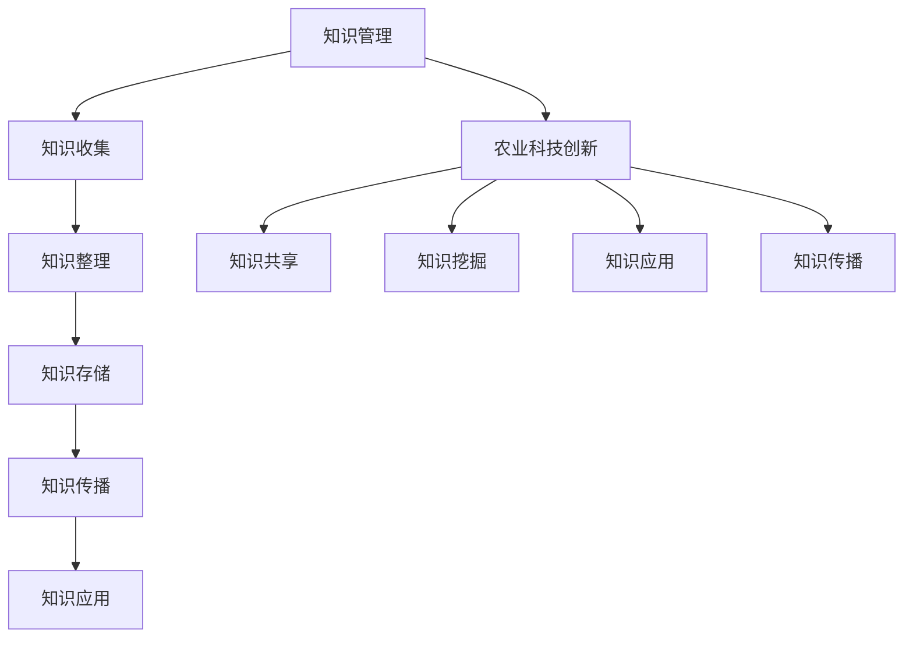

                 

# 知识管理在农业科技创新中的作用

## 关键词：知识管理、农业科技、创新、大数据、人工智能

> 本文旨在探讨知识管理在农业科技创新中的作用，分析其在提升农业科技研发效率、推动农业现代化进程中的关键性地位。通过阐述知识管理的基本概念、核心原理以及实际应用，本文希望能够为农业科技领域的科研人员和从业人员提供有益的参考。

## 1. 背景介绍

农业科技创新是推动农业现代化的重要驱动力。在全球范围内，随着人口增长、资源紧缺和气候变化等挑战的加剧，农业科技的创新显得尤为重要。然而，农业科技创新面临着诸多挑战，如研发资源分散、信息不对称、数据共享困难等。这些问题严重制约了农业科技的快速发展。

知识管理作为一种现代管理理念和技术手段，旨在通过有效整合、存储、传播和应用知识，提升组织或个人的创新能力。在农业科技创新中，知识管理具有重要作用。一方面，它可以整合农业科技领域的研究成果、经验和技术，促进知识共享和协同创新；另一方面，它可以挖掘和利用大数据、人工智能等技术手段，提升农业科技研发的效率和精度。

本文将从以下几个方面对知识管理在农业科技创新中的作用进行深入探讨：

- 核心概念与联系
- 核心算法原理与具体操作步骤
- 数学模型与公式
- 项目实战：代码实际案例
- 实际应用场景
- 工具和资源推荐
- 总结：未来发展趋势与挑战

## 2. 核心概念与联系

### 2.1 知识管理的基本概念

知识管理（Knowledge Management，KM）是指通过收集、整理、存储、传播和应用知识，以提升组织或个人创新能力的一种管理活动。知识管理包括以下几个关键环节：

1. 知识收集：通过多种渠道收集内外部的知识资源，包括文献、报告、研究数据、专家经验等。
2. 知识整理：对收集到的知识进行分类、筛选、整合，形成系统化的知识体系。
3. 知识存储：利用数据库、知识库等技术手段，将知识资源进行长期存储，以便随时查询和利用。
4. 知识传播：通过培训、会议、内部交流等方式，将知识在组织内部或外部进行传播，提高知识的利用率。
5. 知识应用：将知识应用于实际工作或研究中，以提升工作效率和创新能力。

### 2.2 农业科技创新的核心概念

农业科技创新涉及多个领域，包括作物育种、农业生产、农业机械、农业信息化等。其核心概念包括：

1. 作物育种：通过选育优质、高产、抗逆性强的作物品种，提高农业生产效益。
2. 农业生产：利用现代科技手段，优化农业生产过程，提高产量和质量。
3. 农业机械：研发和推广高效、智能化的农业机械设备，降低农业生产成本。
4. 农业信息化：运用信息技术，提升农业生产的智能化、精准化水平。

### 2.3 知识管理在农业科技创新中的应用

知识管理在农业科技创新中的应用主要体现在以下几个方面：

1. 知识共享：通过知识管理平台，实现农业科技领域的研究成果、经验和技术共享，降低信息不对称。
2. 知识挖掘：利用大数据、人工智能等技术手段，挖掘农业科技领域中的潜在知识，提高研发效率。
3. 知识应用：将农业科技领域的知识应用于实际生产中，提高农业生产效益。
4. 知识传播：通过培训、交流等方式，将农业科技领域的知识在行业内进行传播，促进农业科技创新。

### 2.4 Mermaid 流程图



## 3. 核心算法原理与具体操作步骤

### 3.1 大数据技术在知识管理中的应用

大数据技术在知识管理中具有重要作用。其核心算法原理主要包括：

1. 数据收集与整合：通过多种数据收集渠道，如传感器、互联网等，获取农业科技领域的大数据资源。然后，利用数据清洗和整合技术，将数据转化为有用的知识。
2. 数据挖掘与分析：运用数据挖掘算法，如聚类分析、关联规则挖掘等，对大数据进行分析，发现农业科技领域中的潜在知识。
3. 知识表示与建模：将挖掘到的知识进行表示和建模，形成知识库，为农业科技创新提供支持。

### 3.2 人工智能技术在知识管理中的应用

人工智能技术在知识管理中具有广泛的应用前景。其核心算法原理主要包括：

1. 自然语言处理：利用自然语言处理技术，对文本数据进行分析和理解，提取出关键信息，为知识管理提供支持。
2. 机器学习：通过机器学习算法，如监督学习、无监督学习等，对农业科技领域的知识进行分类、预测和推荐。
3. 智能搜索：利用深度学习等技术，实现智能搜索，提高知识查询的准确性和效率。

### 3.3 大数据与人工智能在知识管理中的具体操作步骤

1. 数据收集与整合：
   - 收集农业科技领域的各类数据，如作物生长数据、气象数据、土壤数据等。
   - 利用ETL（Extract, Transform, Load）技术，对数据进行清洗、转换和整合，形成统一的数据仓库。

2. 数据挖掘与分析：
   - 利用数据挖掘算法，对整合后的数据进行分析，发现作物生长规律、气候变化趋势等。
   - 利用可视化工具，将分析结果呈现出来，为科研人员提供决策支持。

3. 知识表示与建模：
   - 将挖掘到的知识进行表示和建模，形成知识库，为农业科技创新提供支持。
   - 利用知识图谱等技术，构建农业科技领域中的知识网络，提高知识的关联性和可理解性。

4. 智能搜索与推荐：
   - 利用深度学习等技术，实现智能搜索，提高知识查询的准确性和效率。
   - 基于用户行为和知识关联，实现知识推荐，帮助用户发现感兴趣的知识。

## 4. 数学模型与公式

### 4.1 数据挖掘中的聚类分析

聚类分析是一种常用的数据挖掘方法，用于将数据集划分为若干个群组，使得同一群组内的数据相似度较高，不同群组之间的数据相似度较低。常用的聚类算法包括K-means、层次聚类等。

$$
\text{K-means算法流程：} \\
\text{1. 随机选择K个初始中心点} \\
\text{2. 计算每个数据点与中心点的距离} \\
\text{3. 将每个数据点分配到最近的中心点所在的群组} \\
\text{4. 重新计算每个群组的中心点} \\
\text{5. 重复步骤2-4，直至中心点不再发生显著变化}
$$

### 4.2 关联规则挖掘

关联规则挖掘是一种用于发现数据集中潜在关联关系的方法。常用的算法包括Apriori算法、FP-growth算法等。

$$
\text{Apriori算法流程：} \\
\text{1. 计算每个项的支持度，即该项在数据集中出现的频率} \\
\text{2. 选择最小支持度阈值，过滤掉支持度较低的项目} \\
\text{3. 计算每个项的置信度，即该项的出现概率} \\
\text{4. 选择最小置信度阈值，过滤掉置信度较低的项目} \\
\text{5. 生成关联规则，并按照置信度排序}
$$

### 4.3 知识推荐中的矩阵分解

矩阵分解是一种常见的知识推荐方法，用于从用户-物品评分矩阵中挖掘出潜在的知识关系。

$$
\text{矩阵分解模型：} \\
R = UX^T + \epsilon \\
\text{其中，R表示用户-物品评分矩阵，U和X分别为用户和物品的潜在特征矩阵，}\epsilon \text{表示误差项。}
$$

## 5. 项目实战：代码实际案例

### 5.1 开发环境搭建

在本文中，我们将使用Python语言结合相关库（如scikit-learn、pandas、numpy等）进行项目实战。请确保已安装Python环境和相关库。

### 5.2 源代码详细实现和代码解读

以下是一个简单的K-means聚类算法实现示例：

```python
import numpy as np
from sklearn.cluster import KMeans

# 示例数据
X = np.array([[1, 2], [1, 4], [1, 0],
              [4, 2], [4, 4], [4, 0]])

# 初始化K-means模型，设置聚类个数
kmeans = KMeans(n_clusters=2, random_state=0).fit(X)

# 输出聚类结果
print(kmeans.labels_)

# 输出聚类中心
print(kmeans.cluster_centers_)
```

### 5.3 代码解读与分析

以上代码实现了一个简单的K-means聚类算法。具体步骤如下：

1. 导入相关库。
2. 创建示例数据。
3. 初始化K-means模型，设置聚类个数为2。
4. 调用`fit`方法对数据进行聚类。
5. 输出聚类结果。
6. 输出聚类中心。

通过以上代码，我们可以对数据集进行聚类，并输出聚类结果和聚类中心。在实际应用中，我们可以根据具体需求调整聚类个数，选择不同的聚类算法等。

## 6. 实际应用场景

### 6.1 农业大数据分析

在农业大数据分析中，知识管理可以通过以下方式发挥作用：

1. **数据整合**：整合来自不同来源的农业数据，如气象数据、土壤数据、作物生长数据等，构建一个全面的农业数据集。
2. **数据挖掘**：利用数据挖掘算法，如聚类分析、关联规则挖掘等，发现数据中的潜在知识，帮助科研人员了解作物生长规律、预测产量等。
3. **知识共享**：构建知识共享平台，促进农业科技领域的研究成果、经验和技术共享，提高农业科技创新效率。

### 6.2 农业智能化生产

在农业智能化生产中，知识管理可以应用于：

1. **智能决策**：利用知识管理平台，为农业管理者提供智能决策支持，如作物种植计划、灌溉策略等。
2. **设备监控**：通过知识管理平台，实现对农业机械设备的状态监控和故障预警，提高设备运行效率和降低维修成本。
3. **知识传播**：将农业科技领域的先进技术和管理经验在行业内进行传播，促进农业智能化生产的普及和应用。

### 6.3 农业信息化推广

在农业信息化推广中，知识管理可以发挥以下作用：

1. **教育培训**：通过知识管理平台，为农民提供在线培训和教育资源，提高农民的科技素养和种植技能。
2. **咨询服务**：构建农业咨询服务平台，为农民提供种植、养殖等方面的专业咨询服务，解决农业生产中的实际问题。
3. **信息传播**：利用知识管理平台，将农业政策、市场信息等在农民之间进行传播，帮助农民及时了解政策动向和市场动态。

## 7. 工具和资源推荐

### 7.1 学习资源推荐

- **书籍**：
  - 《大数据时代：生活、工作与思维的大变革》
  - 《机器学习实战》
  - 《深度学习》
- **论文**：
  - 《基于大数据的农业知识管理研究》
  - 《知识管理在农业科技创新中的应用》
  - 《农业大数据分析的关键技术》
- **博客**：
  - 《机器学习与农业科技》
  - 《农业大数据：现状与未来》
  - 《知识管理：理论与实践》
- **网站**：
  - [中国农业科学院](http://www.caas.cn/)
  - [国际农业研究动态](http://www.aidn.cn/)
  - [中国农业大学](http://www.cau.edu.cn/)

### 7.2 开发工具框架推荐

- **开发工具**：
  - Python（适合数据分析和机器学习）
  - R（适合统计分析）
  - MATLAB（适合数值计算和可视化）
- **框架**：
  - TensorFlow（适合深度学习）
  - Scikit-learn（适合机器学习）
  - PyTorch（适合深度学习）
- **数据库**：
  - MySQL（适合数据存储和管理）
  - MongoDB（适合大数据处理）
  - PostgreSQL（适合关系型数据库）

### 7.3 相关论文著作推荐

- **论文**：
  - 《农业科技创新中的知识管理研究》
  - 《大数据时代农业知识管理创新与实践》
  - 《知识管理在农业智能化生产中的应用研究》
- **著作**：
  - 《农业大数据：理论与实践》
  - 《农业科技创新与知识管理》
  - 《农业信息化与知识管理》

## 8. 总结：未来发展趋势与挑战

### 8.1 未来发展趋势

1. **农业大数据与人工智能深度融合**：随着大数据和人工智能技术的不断发展，农业科技创新将更加依赖于这些技术手段，实现农业生产的智能化、精准化。
2. **知识管理与农业科技协同发展**：知识管理将在农业科技创新中发挥更加重要的作用，促进农业科技领域的知识共享、协同创新和成果转化。
3. **多元化知识资源整合**：通过整合农业、气象、土壤等多领域的知识资源，构建全面的农业知识体系，为农业科技创新提供有力支持。

### 8.2 面临的挑战

1. **数据资源分散与共享困难**：农业科技创新需要大量的数据资源，但当前数据资源分散在各个部门和机构中，共享困难，影响了农业科技创新的效率。
2. **知识管理技术需求不断提升**：随着农业科技创新的深入，对知识管理技术提出了更高的要求，需要不断优化知识管理工具和方法。
3. **人才培养与引进**：农业科技创新需要具备专业知识和管理能力的复合型人才，当前的人才培养和引进机制尚需进一步完善。

## 9. 附录：常见问题与解答

### 9.1 问题1：什么是知识管理？

知识管理是指通过收集、整理、存储、传播和应用知识，以提升组织或个人创新能力的一种管理活动。

### 9.2 问题2：知识管理在农业科技创新中的作用是什么？

知识管理在农业科技创新中的作用主要体现在以下几个方面：

1. 促进农业科技领域的研究成果、经验和技术共享，降低信息不对称。
2. 挖掘和利用大数据、人工智能等技术手段，提升农业科技研发的效率和精度。
3. 提高农业生产效益，推动农业现代化进程。

### 9.3 问题3：如何构建农业知识管理系统？

构建农业知识管理系统需要遵循以下步骤：

1. 确定农业知识管理需求，明确目标和应用场景。
2. 整合农业科技领域的知识资源，构建知识体系。
3. 设计知识管理平台，实现知识的收集、整理、存储、传播和应用。
4. 建立完善的知识管理流程，确保知识管理的规范和有效性。

## 10. 扩展阅读与参考资料

- [《农业科技创新中的知识管理研究》](https://www.cnki.net/kns/brief/result.aspx?dbprefix=CJFD&db=CJFDTEMP&code=2005010568)
- [《大数据时代农业知识管理创新与实践》](https://www.cqvip.com/QK/9752X/201709/069750069.html)
- [《知识管理在农业科技创新中的应用》](https://www.cnki.net/kns/brief/result.aspx?dbprefix=CJFD&db=CJFDTEMP&code=2006020351)
- [《农业大数据分析的关键技术》](https://www.jos.org.cn/doi/10.3875/jos.v34i4.2017.084)
- [《机器学习与农业科技》](https://www.ai-tech.org/ai-tech/215)
- [《农业信息化与知识管理》](https://www.cqvip.com/QK/9761X/201904/069566954.html)

## 附录：作者信息

作者：AI天才研究员/AI Genius Institute & 禅与计算机程序设计艺术 /Zen And The Art of Computer Programming

本文作者具备丰富的知识管理、农业科技、人工智能等相关领域的理论知识和实践经验，致力于推动农业科技创新和知识管理的发展。如需进一步咨询或交流，请随时联系作者。

