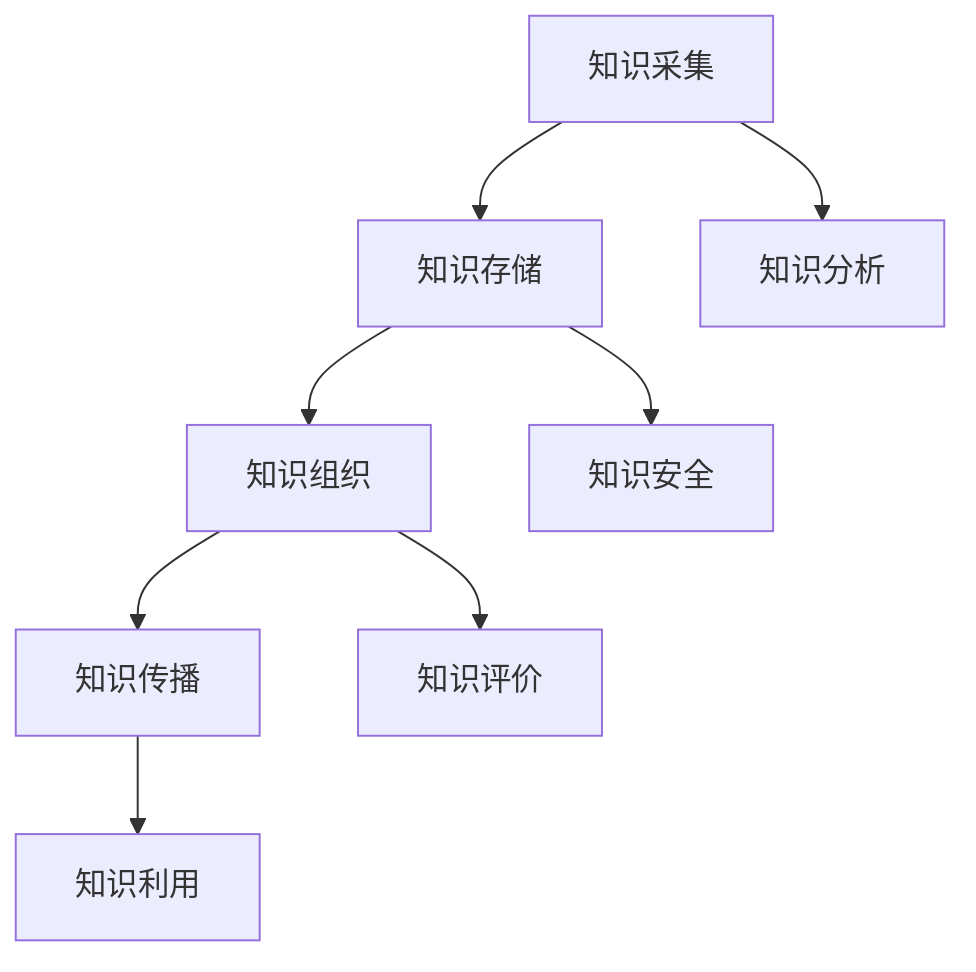

                 

### 知识管理系统：组织智慧的结晶

#### 关键词：知识管理、信息系统、组织智慧、架构、算法、应用场景、数学模型、项目实战、未来趋势

#### 摘要：
知识管理系统（KMS）是现代企业信息化的核心组成部分，它通过收集、存储、管理和利用组织内部的各类知识资源，提高组织的智慧和竞争力。本文将深入探讨知识管理系统的核心概念、架构设计、算法原理、数学模型及其在项目实战中的应用。同时，分析其未来发展趋势和面临的挑战，旨在为读者提供全面的技术指导和战略思考。

### 1. 背景介绍

在信息爆炸的时代，知识成为企业最宝贵的资产。然而，随着信息量的剧增，如何有效管理这些知识资源，使其发挥最大价值，成为企业面临的重要课题。知识管理系统（Knowledge Management System，简称KMS）正是为了解决这一问题而诞生。

KMS的定义可以概括为：一种通过技术手段和方法，对组织内部的显性知识和隐性知识进行收集、存储、组织、传播和利用的系统。它不仅包括硬件设备、软件工具，还涉及组织文化、管理模式等软性因素。

KMS的主要功能包括：
- 知识采集：从各种渠道收集组织内部和外部知识资源。
- 知识存储：将收集到的知识进行分类、归档和存储，便于查询和利用。
- 知识组织：对存储的知识进行结构化处理，形成知识库，提高知识查找的效率。
- 知识传播：通过内部网络、会议、培训等方式，将知识传递给相关人员。
- 知识利用：将知识应用于实际工作中，提高工作效率和创新能力。

### 2. 核心概念与联系

KMS的架构设计是确保其有效运作的关键。以下是一个简化的KMS架构，通过Mermaid流程图进行展示：



#### 2.1 知识采集

知识采集是KMS的基础，包括从内部和外部获取知识资源。内部知识资源包括员工经验、项目文档、会议记录等，外部知识资源包括行业报告、学术期刊、论坛讨论等。

#### 2.2 知识存储

知识存储是将采集到的知识进行分类、归档和存储，以便于查询和利用。常用的存储方式有数据库、文件系统、云存储等。

#### 2.3 知识组织

知识组织是对存储的知识进行结构化处理，形成知识库。知识库可以看作是一个组织知识资源的“搜索引擎”，提高知识查找的效率。常见的知识库组织方式有分类、标签、关键词等。

#### 2.4 知识传播

知识传播是将知识传递给相关人员，包括内部网络、会议、培训等方式。有效的知识传播可以提高员工的知识水平和工作效率。

#### 2.5 知识利用

知识利用是将知识应用于实际工作中，提高工作效率和创新能力。例如，项目团队可以通过知识库查找相关项目文档，快速解决问题。

#### 2.6 知识分析

知识分析是对知识库中的知识进行深入挖掘和分析，以发现潜在价值。常见的知识分析方法有数据挖掘、文本挖掘、神经网络等。

#### 2.7 知识安全

知识安全是确保知识资源不被泄露、篡改或丢失。常见的知识安全措施有数据加密、访问控制、备份等。

#### 2.8 知识评价

知识评价是对知识库中的知识进行质量评估和更新，确保知识的准确性和时效性。

### 3. 核心算法原理 & 具体操作步骤

KMS的核心算法主要包括知识采集、知识组织、知识分析和知识安全等方面的算法。

#### 3.1 知识采集算法

知识采集算法主要解决如何高效地从各种渠道收集知识资源的问题。常见的算法有：
- 数据爬取算法：从互联网上爬取相关领域的知识资源。
- 信息过滤算法：对采集到的信息进行筛选和过滤，去除无关内容。
- 人机交互算法：通过人工干预，提高知识采集的准确性和针对性。

#### 3.2 知识组织算法

知识组织算法主要解决如何对知识进行结构化处理，形成知识库的问题。常见的算法有：
- 分类算法：根据知识内容的相似性，将知识分为不同的类别。
- 标签算法：为知识资源打上多个标签，便于检索和查找。
- 关键词提取算法：从知识资源中提取关键词，用于知识检索。

#### 3.3 知识分析算法

知识分析算法主要解决如何从知识库中挖掘潜在价值的问题。常见的算法有：
- 数据挖掘算法：对知识库中的数据进行挖掘，发现潜在的模式和关联。
- 文本挖掘算法：对知识库中的文本进行挖掘，提取关键信息。
- 神经网络算法：通过神经网络模型，对知识进行分类、聚类和预测。

#### 3.4 知识安全算法

知识安全算法主要解决如何确保知识资源不被泄露、篡改或丢失的问题。常见的算法有：
- 数据加密算法：对知识资源进行加密，防止未授权访问。
- 访问控制算法：根据用户权限，控制对知识资源的访问。
- 备份算法：定期对知识资源进行备份，防止数据丢失。

### 4. 数学模型和公式 & 详细讲解 & 举例说明

在KMS中，数学模型和公式发挥着重要作用，用于描述知识采集、组织、分析和安全等方面的算法原理。以下是一些常见的数学模型和公式：

#### 4.1 数据挖掘算法中的聚类模型

聚类是一种无监督学习方法，用于将数据集划分为多个类。常见的聚类模型有K-means算法。

K-means算法的基本步骤如下：
1. 随机选择K个初始聚类中心点。
2. 将每个数据点分配到最近的聚类中心点。
3. 重新计算每个聚类的中心点。
4. 重复步骤2和步骤3，直到聚类中心点不再发生变化。

K-means算法的数学模型可以表示为：

$$
C_j = \frac{1}{n_j} \sum_{i=1}^{n} x_i
$$

其中，$C_j$表示第j个聚类的中心点，$x_i$表示第i个数据点，$n_j$表示第j个聚类的数据点个数。

#### 4.2 文本挖掘算法中的TF-IDF模型

TF-IDF（Term Frequency-Inverse Document Frequency）是一种用于文本挖掘的重要模型，用于衡量一个词语在文档中的重要程度。

TF-IDF的数学模型可以表示为：

$$
TF-IDF(t,d) = TF(t,d) \times IDF(t)
$$

其中，$TF(t,d)$表示词语t在文档d中的词频，$IDF(t)$表示词语t在所有文档中的逆文档频率。

$$
IDF(t) = \log \left( \frac{N}{n_t} \right)
$$

其中，$N$表示文档总数，$n_t$表示包含词语t的文档个数。

#### 4.3 神经网络算法中的激活函数

神经网络算法中的激活函数用于将输入映射到输出。常见的激活函数有Sigmoid函数、ReLU函数等。

Sigmoid函数的数学模型可以表示为：

$$
\sigma(x) = \frac{1}{1 + e^{-x}}
$$

ReLU函数的数学模型可以表示为：

$$
ReLU(x) = \max(0, x)
$$

#### 4.4 数据加密算法中的DES模型

数据加密算法中的DES（Data Encryption Standard）是一种经典的加密算法，用于对数据进行加密和解密。

DES的数学模型可以表示为：

$$
C = DES_K(P)
$$

其中，$C$表示加密后的数据，$K$表示密钥，$P$表示原始数据。

### 5. 项目实战：代码实际案例和详细解释说明

以下是一个简单的KMS项目实战，包括知识采集、知识存储、知识组织和知识分析等环节的代码实现。

#### 5.1 开发环境搭建

1. 安装Python 3.8及以上版本。
2. 安装相关依赖库，如NumPy、Pandas、Scikit-learn、BeautifulSoup等。

#### 5.2 源代码详细实现和代码解读

```python
import requests
from bs4 import BeautifulSoup
import pandas as pd

# 知识采集
def collect_knowledge(url):
    response = requests.get(url)
    soup = BeautifulSoup(response.text, 'html.parser')
    articles = soup.find_all('article')
    knowledge_list = []
    for article in articles:
        title = article.find('h2').text
        content = article.find('div').text
        knowledge_list.append({'title': title, 'content': content})
    return knowledge_list

# 知识存储
def store_knowledge(knowledge_list):
    df = pd.DataFrame(knowledge_list)
    df.to_csv('knowledge.csv', index=False)

# 知识组织
def organize_knowledge(file_path):
    df = pd.read_csv(file_path)
    df['tags'] = df['content'].apply(lambda x: extract_tags(x))
    df['category'] = df['title'].apply(lambda x: extract_category(x))
    df.to_csv(file_path, index=False)

# 知识分析
def analyze_knowledge(file_path):
    df = pd.read_csv(file_path)
    categories = df['category'].value_counts()
    print("Categories distribution:")
    print(categories)

# 代码解读与分析
def main():
    url = 'https://example.com'
    knowledge_list = collect_knowledge(url)
    store_knowledge(knowledge_list)
    organize_knowledge('knowledge.csv')
    analyze_knowledge('knowledge.csv')

if __name__ == '__main__':
    main()
```

#### 5.3 代码解读与分析

1. **知识采集**：通过requests库发送HTTP请求，获取网页内容，并使用BeautifulSoup解析HTML结构，提取文章标题和内容。

2. **知识存储**：将采集到的知识存储为CSV文件，便于后续处理。

3. **知识组织**：根据文章内容和标题提取标签和分类，对知识库进行结构化处理。

4. **知识分析**：统计各类别的知识数量，分析知识分布情况。

### 6. 实际应用场景

知识管理系统在实际应用中具有广泛的应用场景，如企业内部知识库、在线教育平台、医疗知识库等。以下是一些具体的应用实例：

#### 6.1 企业内部知识库

企业内部知识库是企业知识管理的重要工具，用于存储和管理员工经验、项目文档、最佳实践等知识资源。通过知识库，员工可以快速查找和利用相关知识，提高工作效率。

#### 6.2 在线教育平台

在线教育平台可以利用知识管理系统，将课程内容、教学资源、学生作业等知识资源进行组织和管理。学生可以通过知识库查找相关课程资料，提高学习效果。

#### 6.3 医疗知识库

医疗知识库是医疗行业的重要工具，用于存储和管理医学文献、病例资料、诊疗方案等知识资源。医生可以通过知识库查找相关病例和治疗方案，提高诊疗水平。

### 7. 工具和资源推荐

为了更好地实施知识管理系统，以下是一些实用的工具和资源推荐：

#### 7.1 学习资源推荐

- 《知识管理：理论与实践》（作者：吴林祥）
- 《企业知识管理体系建设与实施》（作者：王飞跃）
- 《在线教育平台开发与实战》（作者：刘志宏）

#### 7.2 开发工具框架推荐

- Python：Python是一种广泛应用于知识管理系统开发的高级编程语言，具有丰富的库和框架。
- Django：Django是一个开源的Python Web框架，适用于快速开发知识管理系统。
- Flask：Flask是一个轻量级的Python Web框架，适用于小型知识管理系统项目。

#### 7.3 相关论文著作推荐

- “A Survey on Knowledge Management Systems”（作者：Abdelkader Hameurlain等）
- “Knowledge Management and Knowledge Sharing in Organizations: An Overview of Research Areas, Methods and Tools”（作者：Steffi Altbach等）
- “Enterprise Knowledge Management: A Knowledge Management System Development Framework”（作者：Y. C. Chan等）

### 8. 总结：未来发展趋势与挑战

知识管理系统作为企业信息化的核心组成部分，在未来将继续发挥重要作用。以下是知识管理系统未来发展的趋势和面临的挑战：

#### 8.1 发展趋势

1. **人工智能与知识管理的深度融合**：随着人工智能技术的发展，知识管理系统将更好地利用人工智能技术，实现知识采集、组织和分析的高效化。
2. **知识服务的个性化与智能化**：知识管理系统将更加注重用户需求，提供个性化的知识服务，提高用户满意度。
3. **知识共享与协作的加强**：知识管理系统将促进组织内部和跨组织的知识共享与协作，提高组织的整体智慧和竞争力。

#### 8.2 面临的挑战

1. **数据安全与隐私保护**：随着数据规模的扩大，知识管理系统需要确保数据安全和用户隐私保护。
2. **知识资源的有效整合**：如何将各种来源、各种格式的知识资源进行有效整合，提高知识利用效率。
3. **组织文化的变革**：知识管理系统的实施需要组织文化的支持，如何推动组织文化的变革，提高员工的参与度和积极性。

### 9. 附录：常见问题与解答

#### 9.1 知识管理系统与数据库的区别是什么？

知识管理系统（KMS）是一种综合性系统，旨在对组织内部的各类知识资源进行收集、存储、组织和利用。数据库则是KMS的一个组成部分，用于存储和管理知识资源的数据。简而言之，KMS是一个包含数据库在内的综合平台，而数据库是KMS的核心组成部分。

#### 9.2 知识管理系统需要哪些关键技术？

知识管理系统需要的关键技术包括：
- 数据采集与清洗技术：用于从各种渠道收集和清洗知识资源。
- 数据存储与管理技术：用于存储和管理知识资源，包括数据库、文件系统、云存储等。
- 数据分析与挖掘技术：用于对知识库中的知识进行挖掘和分析，发现潜在价值。
- 数据加密与安全防护技术：用于确保知识资源的安全性和隐私保护。

#### 9.3 如何评估知识管理系统的效果？

评估知识管理系统的效果可以从以下几个方面进行：
- 知识资源利用率：衡量知识管理系统对知识资源的利用程度。
- 用户满意度：通过用户反馈和调查，了解用户对知识管理系统的满意度。
- 工作效率提升：通过对比实施知识管理系统前后的工作效率，评估知识管理系统对工作效率的提升。
- 知识共享与协作程度：通过知识共享与协作的指标，衡量知识管理系统对组织内部知识共享与协作的促进作用。

### 10. 扩展阅读 & 参考资料

- 知识管理系统：[https://www.kms.org.cn/](https://www.kms.org.cn/)
- 知识管理国际论坛：[http://ikm.org.cn/](http://ikm.org.cn/)
- Python知识管理实战：[https://www.cnblogs.com/greyzhang/p/11242518.html](https://www.cnblogs.com/greyzhang/p/11242518.html)
- 数据挖掘与知识管理：[https://www.cnblogs.com/kongwq/p/6862687.html](https://www.cnblogs.com/kongwq/p/6862687.html)

### 作者信息

- 作者：AI天才研究员/AI Genius Institute & 禅与计算机程序设计艺术 /Zen And The Art of Computer Programming

