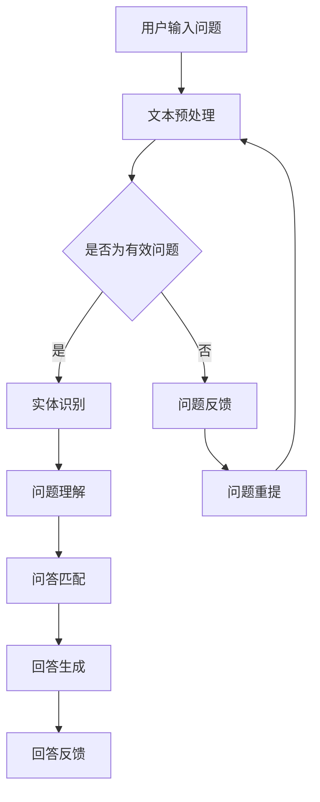

                 

### 背景介绍 Background Introduction

随着互联网技术的迅猛发展，信息爆炸式增长，人们对于知识的获取和传播方式也发生了翻天覆地的变化。知识经济时代，知识的价值被重新定义，付费知识成为了一种新的经济形态。在这个背景下，知识付费平台如雨后春笋般涌现，例如知乎、得到、喜马拉雅等。这些平台通过提供专业课程、电子书、在线问答等服务，满足了用户对专业知识的渴求，同时也为知识创作者带来了丰厚的收益。

人工智能作为当今科技领域的热门话题，其在知识付费领域中的应用也越来越广泛。智能问答系统作为人工智能的一个重要分支，通过自然语言处理技术，能够对用户的问题进行理解、分析和回答。这种技术不仅提高了知识付费服务的质量和效率，也为用户提供了更加便捷的获取知识的方式。

本文旨在探讨知识经济下知识付费的人工智能智能问答系统。首先，我们将介绍智能问答系统的基本概念和发展历程，然后分析其在知识付费领域的应用现状和挑战，接着探讨构建智能问答系统的核心技术和数学模型，最后通过一个实际项目案例展示智能问答系统的实现过程和应用效果。

关键词：知识付费，人工智能，智能问答系统，知识经济，自然语言处理

### 摘要 Summary

本文旨在探讨知识经济下知识付费的人工智能智能问答系统的构建与应用。首先，我们介绍了智能问答系统的基本概念和发展历程，分析了其在知识付费领域的应用现状和挑战。然后，我们详细阐述了构建智能问答系统的核心技术和数学模型，包括自然语言处理、机器学习和深度学习等技术。接着，通过一个实际项目案例，我们展示了智能问答系统的实现过程和应用效果。最后，我们对未来智能问答系统的发展趋势和面临的挑战进行了展望。本文旨在为相关领域的研究者和从业者提供有价值的参考和借鉴。

---

### 1. 背景介绍 Background Introduction

知识付费作为一种新兴的经济模式，其核心在于通过提供有价值的内容和服务，让知识创作者和知识消费者实现双赢。在知识经济时代，信息的重要性日益凸显，知识的获取和传播成为经济增长的新动力。而人工智能作为现代科技的重要推动力，正在深刻地改变着知识付费的形态和模式。

#### 1.1 知识付费的概念和特点

知识付费，顾名思义，是指用户为获取特定知识或服务而支付的费用。与传统免费的知识传播方式不同，知识付费强调的是知识的价值变现，即通过付费来实现知识的传播和共享。知识付费的特点主要体现在以下几个方面：

1. **个性化**：知识付费平台能够根据用户的需求和兴趣，提供个性化的内容和服务，满足用户的个性化学习需求。
2. **高质量**：知识付费平台上的内容通常由专业领域内的专家或权威人士提供，因此具有较高的质量和可信度。
3. **便捷性**：知识付费平台提供了便捷的在线学习方式，用户可以通过移动设备随时随地获取知识。
4. **可持续性**：知识付费为知识创作者提供了稳定的收入来源，有助于激励他们持续创作高质量的内容。

#### 1.2 人工智能在知识付费中的应用

人工智能作为知识付费领域的重要技术支撑，其应用场景广泛，包括智能推荐、智能问答、智能评估等。以下是人工智能在知识付费中的一些具体应用：

1. **智能推荐**：通过用户行为分析和内容标签匹配，智能推荐系统可以为用户提供感兴趣的知识内容，提高用户的满意度和粘性。
2. **智能问答**：智能问答系统通过自然语言处理技术，能够快速理解用户的问题并给出准确回答，提高知识服务的效率和质量。
3. **智能评估**：通过自动化评估工具，知识付费平台可以对用户的学习效果进行实时评估，提供个性化的学习建议和反馈。

#### 1.3 知识付费与人工智能的互动关系

知识付费与人工智能之间的互动关系体现在多个方面：

1. **知识创作**：人工智能技术可以帮助知识创作者更高效地创作高质量的内容，如通过自动化写作工具生成文章、报告等。
2. **知识传播**：人工智能技术可以优化知识传播的渠道和方式，如通过社交媒体、在线课程、智能问答等手段，扩大知识的传播范围和影响力。
3. **知识获取**：人工智能技术可以帮助用户更便捷地获取所需的知识，如通过智能搜索引擎、智能推荐系统等，提高知识获取的效率和质量。

#### 1.4 智能问答系统在知识付费中的重要性

智能问答系统在知识付费中扮演着至关重要的角色，主要体现在以下几个方面：

1. **提升服务质量**：智能问答系统可以快速响应用户的问题，提供准确、详细的回答，提升用户的学习体验和满意度。
2. **降低运营成本**：通过智能问答系统，知识付费平台可以减少人工客服的工作量，降低运营成本，提高运营效率。
3. **增强互动性**：智能问答系统可以与用户进行实时互动，收集用户反馈，优化知识内容和服务。
4. **扩大用户群体**：智能问答系统可以吸引更多用户参与知识付费，扩大平台的用户基础和市场影响力。

总的来说，知识付费和人工智能之间的互动关系，不仅为知识创作者和消费者带来了巨大的价值，也为知识经济时代的发展注入了新的活力。随着人工智能技术的不断进步，智能问答系统在知识付费领域的应用前景将更加广阔。

---

### 2. 核心概念与联系 Core Concepts and Connections

在深入探讨智能问答系统在知识付费领域的应用之前，我们需要理解几个核心概念：自然语言处理（Natural Language Processing, NLP）、机器学习（Machine Learning, ML）和深度学习（Deep Learning, DL）。这些概念不仅构成了智能问答系统的技术基础，也决定了其性能和效果。

#### 2.1 自然语言处理（NLP）

自然语言处理是人工智能的一个重要分支，旨在使计算机能够理解和处理人类语言。NLP包括语音识别、文本分析、语义理解和机器翻译等多种技术。在智能问答系统中，NLP的主要任务是对用户的问题进行解析和语义理解，从而为用户提供准确的答案。

1. **文本预处理**：在NLP中，文本预处理是第一步，包括分词、去除停用词、词性标注等操作。这些操作有助于将原始文本转化为计算机可以理解的结构化数据。
2. **实体识别**：实体识别是指从文本中识别出具有特定意义的实体，如人名、地名、组织名等。这在智能问答系统中有助于定位问题的核心内容。
3. **语义理解**：语义理解是指分析文本中的含义和关系，包括词义消歧、句法分析和语义角色标注等。这是智能问答系统理解用户问题的重要步骤。

#### 2.2 机器学习（ML）

机器学习是使计算机通过数据和经验自动改进性能的一种方法。在智能问答系统中，机器学习技术用于训练模型，使其能够自动理解和回答用户的问题。

1. **监督学习**：监督学习是指通过已标记的数据集来训练模型。在智能问答系统中，监督学习可以用来训练问答匹配模型和回答生成模型。
2. **无监督学习**：无监督学习是指在没有明确标记的数据集上训练模型。在智能问答系统中，无监督学习可以用来进行文本分类和聚类等任务，以提高系统的泛化能力。
3. **强化学习**：强化学习是指通过奖励机制来训练模型。在智能问答系统中，强化学习可以用来优化问答匹配策略和回答生成策略，以提高用户满意度。

#### 2.3 深度学习（DL）

深度学习是机器学习的一个子领域，其核心思想是模拟人脑的神经网络进行数据处理。在智能问答系统中，深度学习技术被广泛应用于模型训练和推理。

1. **卷积神经网络（CNN）**：CNN在处理图像数据方面表现优异，但也可以用于处理序列数据，如文本。在智能问答系统中，CNN可以用于文本分类和情感分析等任务。
2. **循环神经网络（RNN）**：RNN能够处理序列数据，并具有记忆功能，适用于语音识别和机器翻译等任务。在智能问答系统中，RNN可以用于问题理解、回答生成等任务。
3. **长短时记忆网络（LSTM）**：LSTM是RNN的一种改进，能够解决RNN的梯度消失问题。在智能问答系统中，LSTM可以用于复杂问题的理解和回答生成。
4. **生成对抗网络（GAN）**：GAN通过两个神经网络（生成器和判别器）之间的对抗训练，可以生成高质量的文本。在智能问答系统中，GAN可以用于生成高质量的回答。

#### 2.4 关系与交互

自然语言处理、机器学习和深度学习之间存在紧密的关系和交互：

1. **NLP为ML和DL提供了数据输入和处理框架**：通过NLP技术，原始文本数据可以被转化为计算机可以处理的格式，进而用于ML和DL模型训练。
2. **ML和DL为NLP提供了强大的模型训练能力**：ML和DL技术能够自动从数据中学习规律，生成高性能的模型，从而提高NLP任务的准确性和效率。
3. **DL在NLP中的广泛应用**：DL技术在NLP中的成功应用，使得智能问答系统在问题理解、回答生成等方面取得了显著的性能提升。

综上所述，自然语言处理、机器学习和深度学习是构建智能问答系统的核心技术。通过这些技术的结合和优化，智能问答系统能够更准确地理解用户的问题，并生成高质量的回答，为知识付费领域带来更大的价值。

#### 2.5 Mermaid 流程图展示

下面是一个简单的Mermaid流程图，展示智能问答系统的基本工作流程：



在这个流程图中，用户输入问题后，系统首先进行文本预处理，然后判断问题是否有效。如果是有效问题，系统会进行实体识别、问题理解和问答匹配，最后生成回答。如果问题无效，系统会给出反馈，并允许用户重新输入问题。

---

### 3. 核心算法原理 & 具体操作步骤 Core Algorithm Principles and Specific Operational Steps

构建一个高效的智能问答系统需要深入理解自然语言处理（NLP）、机器学习（ML）和深度学习（DL）的核心算法原理，并掌握具体的操作步骤。以下将详细介绍这些核心算法的工作机制和应用。

#### 3.1 自然语言处理（NLP）

自然语言处理是智能问答系统的基石，主要包括文本预处理、实体识别、语义理解等任务。

1. **文本预处理**：

   - **分词**：将文本分割成单词或短语。常用的分词工具包括jieba、NLTK等。
   - **去除停用词**：停用词是指对文本意义没有贡献的常见词，如“的”、“是”、“和”等。去除停用词可以减少噪音，提高模型性能。
   - **词性标注**：为每个词标注其词性（名词、动词、形容词等），有助于理解文本的语法结构。

   示例代码（Python）：

   ```python
   import jieba
   
   text = "我爱北京天安门"
   words = jieba.lcut(text)
   print(words)
   ```

2. **实体识别**：

   - **命名实体识别**：从文本中识别出具有特定意义的实体，如人名、地名、组织名等。常用的工具包括Stanford NER、Spacy等。
   - **关系提取**：识别实体之间的关系，如“张三”是“李四”的同事。关系提取对于问题理解和答案生成至关重要。

   示例代码（Python）：

   ```python
   import spacy
   
   nlp = spacy.load("en_core_web_sm")
   doc = nlp("Elon Musk is the CEO of Tesla.")
   for ent in doc.ents:
       print(ent.text, ent.label_)
   ```

3. **语义理解**：

   - **词义消歧**：解决一词多义问题，例如“bank”可以指银行，也可以指河岸。词义消歧有助于准确理解文本。
   - **句法分析**：分析句子的结构，包括主语、谓语、宾语等成分。句法分析对于理解复杂问题和生成准确答案至关重要。
   - **语义角色标注**：为句子中的每个成分标注其语义角色，如“给”、“买”等。语义角色标注有助于理解文本中的动作和关系。

   示例代码（Python）：

   ```python
   import spacy
   
   nlp = spacy.load("en_core_web_sm")
   doc = nlp("John gave Mary a book.")
   for token in doc:
       print(token.text, token.dep_, token.head.text)
   ```

#### 3.2 机器学习（ML）

机器学习是构建智能问答系统的核心，主要包括监督学习、无监督学习和强化学习。

1. **监督学习**：

   - **模型训练**：使用已标记的数据集训练模型，如SVM、决策树、随机森林等。
   - **模型评估**：使用交叉验证、AUC、准确率、召回率等指标评估模型性能。
   - **模型部署**：将训练好的模型部署到生产环境中，如使用Flask、Django等框架。

   示例代码（Python）：

   ```python
   from sklearn.svm import SVC
   from sklearn.model_selection import train_test_split
   from sklearn.metrics import accuracy_score
   
   X, y = load_data()
   X_train, X_test, y_train, y_test = train_test_split(X, y, test_size=0.2)
   model = SVC()
   model.fit(X_train, y_train)
   y_pred = model.predict(X_test)
   print(accuracy_score(y_test, y_pred))
   ```

2. **无监督学习**：

   - **聚类**：使用聚类算法（如K-means、DBSCAN等）对文本数据进行聚类，以发现潜在的主题和模式。
   - **降维**：使用降维技术（如PCA、t-SNE等）减少文本数据的维度，以便更好地理解和可视化。
   - **生成模型**：使用生成模型（如Gaussian Mixture Model、Deep Belief Network等）生成新的文本数据，以提高模型泛化能力。

   示例代码（Python）：

   ```python
   from sklearn.cluster import KMeans
   from sklearn.decomposition import PCA
   
   X = load_data()
   kmeans = KMeans(n_clusters=5)
   kmeans.fit(X)
   pca = PCA(n_components=2)
   X_pca = pca.fit_transform(X)
   plt.scatter(X_pca[:, 0], X_pca[:, 1], c=kmeans.labels_)
   plt.show()
   ```

3. **强化学习**：

   - **模型训练**：使用强化学习算法（如Q-Learning、SARSA、Deep Q-Network等）训练模型，以最大化长期奖励。
   - **模型评估**：使用奖励函数和评价标准评估模型性能，如平均奖励、成功率等。
   - **模型部署**：将训练好的模型部署到生产环境中，以实现自动化决策和优化。

   示例代码（Python）：

   ```python
   from reinforcement_learning import QLearning
   from environment import Environment
   
   env = Environment()
   q_learning = QLearning(alpha=0.1, gamma=0.9)
   for episode in range(1000):
       state = env.reset()
       while not env.is_done():
           action = q_learning.select_action(state)
           next_state, reward = env.step(action)
           q_learning.update_q_value(state, action, next_state, reward)
           state = next_state
   ```

#### 3.3 深度学习（DL）

深度学习是当前机器学习领域的研究热点，其在智能问答系统中的应用主要体现在神经网络结构和模型训练。

1. **神经网络结构**：

   - **前馈神经网络（FFNN）**：简单的多层感知器（MLP）结构，适用于简单的特征提取和分类任务。
   - **卷积神经网络（CNN）**：适用于图像和序列数据，能够提取局部特征和模式。
   - **循环神经网络（RNN）**：适用于序列数据，具有记忆功能，能够处理长距离依赖问题。
   - **长短时记忆网络（LSTM）**：RNN的一种改进，解决了梯度消失问题，适用于复杂序列数据。
   - **生成对抗网络（GAN）**：用于生成高质量的数据，能够在无监督学习中发挥重要作用。

   示例代码（Python）：

   ```python
   import tensorflow as tf
   from tensorflow.keras.models import Sequential
   from tensorflow.keras.layers import Dense, LSTM, Conv2D, Flatten
   
   model = Sequential()
   model.add(Dense(units=64, activation='relu', input_shape=(input_shape)))
   model.add(LSTM(units=128))
   model.add(Conv2D(filters=32, kernel_size=(3, 3), activation='relu'))
   model.add(Flatten())
   model.add(Dense(units=output_shape, activation='softmax'))
   model.compile(optimizer='adam', loss='categorical_crossentropy', metrics=['accuracy'])
   model.fit(X_train, y_train, epochs=10, batch_size=32)
   ```

2. **模型训练**：

   - **数据预处理**：对原始文本数据进行预处理，包括分词、去停用词、词性标注等。
   - **模型训练**：使用预处理后的数据训练深度学习模型，如使用TensorFlow或PyTorch等框架。
   - **模型评估**：使用验证集和测试集评估模型性能，调整模型参数以优化性能。

   示例代码（Python）：

   ```python
   import tensorflow as tf
   from tensorflow.keras.preprocessing.text import Tokenizer
   from tensorflow.keras.preprocessing.sequence import pad_sequences
   
   tokenizer = Tokenizer(num_words=10000)
   tokenizer.fit_on_texts(texts)
   sequences = tokenizer.texts_to_sequences(texts)
   padded_sequences = pad_sequences(sequences, maxlen=max_length)
   
   model = tf.keras.Sequential([
       tf.keras.layers.Embedding(input_dim=10000, output_dim=16),
       tf.keras.layers.Bidirectional(tf.keras.layers.LSTM(32)),
       tf.keras.layers.Dense(units=1, activation='sigmoid')
   ])
   
   model.compile(optimizer='adam', loss='binary_crossentropy', metrics=['accuracy'])
   model.fit(padded_sequences, labels, epochs=10)
   ```

通过深入理解和应用自然语言处理、机器学习和深度学习的核心算法原理，我们可以构建一个高效、准确的智能问答系统，为知识付费领域带来巨大的价值。

---

### 4. 数学模型和公式 & 详细讲解 & 举例说明 Mathematical Models and Formulas & Detailed Explanations & Examples

构建智能问答系统不仅需要先进的技术，还需要深入理解其背后的数学模型和公式。以下是几个关键的数学模型和公式，以及它们的详细讲解和举例说明。

#### 4.1 自然语言处理中的数学模型

自然语言处理（NLP）中的数学模型主要涉及词嵌入、序列模型和注意力机制。

1. **词嵌入（Word Embedding）**

   词嵌入是一种将单词映射到高维向量空间的方法，使得语义相近的词在向量空间中距离较近。常见的词嵌入模型有Word2Vec、GloVe等。

   - **Word2Vec模型**：

     Word2Vec模型基于神经网络，通过训练生成词的向量表示。模型的核心思想是使得语义相近的词在向量空间中距离较近。

     数学公式：

     $$\text{softmax}(z) = \frac{e^z}{\sum_{i} e^z_i}$$

     其中，$z$是神经网络的输出，$e^z$是输出向量的指数化，$softmax(z)$是输出向量的softmax函数，用于计算每个单词的概率分布。

     示例：

     假设我们有一个简单的神经网络，输出向量为$[2.0, 1.0, -1.0]$，则softmax函数计算结果为：

     $$\text{softmax}([2.0, 1.0, -1.0]) = \frac{e^{2.0}}{e^{2.0} + e^{1.0} + e^{-1.0}} \approx [0.741, 0.184, 0.075]$$

     这个结果表示单词在向量空间中的概率分布，其中概率最大的单词对应于该向量的方向。

   - **GloVe模型**：

     GloVe（Global Vectors for Word Representation）是一种基于词频统计的词嵌入方法，通过训练得到单词的向量表示。GloVe模型的核心思想是考虑词频和共现关系来生成词向量。

     数学公式：

     $$f(w, j) = \frac{f(w) \cdot f(j)}{\sqrt{f(w) \cdot f(j) + \alpha \cdot (1 - f(j))}}$$

     其中，$f(w)$和$f(j)$分别是单词$w$和单词$j$的词频，$\alpha$是超参数，用于调整词频的影响。

     示例：

     假设两个单词“爱”和“喜欢”的词频分别为10和5，$\alpha$取值为0.5，则它们的共现关系为：

     $$f(\text{爱}, \text{喜欢}) = \frac{10 \cdot 5}{\sqrt{10 \cdot 5 + 0.5 \cdot (1 - 5)}} \approx 4.55$$

     这个结果表示“爱”和“喜欢”在词向量空间中的距离较近。

2. **序列模型（Sequence Model）**

   序列模型用于处理文本序列数据，常见的有循环神经网络（RNN）和长短时记忆网络（LSTM）。

   - **RNN模型**：

     RNN是一种基于递归结构的神经网络，能够处理序列数据。RNN的核心思想是利用当前时刻的信息来更新状态，从而处理前后依赖关系。

     数学公式：

     $$h_t = \text{sigmoid}(W_h \cdot [h_{t-1}, x_t] + b_h)$$

     其中，$h_t$是当前时刻的隐藏状态，$x_t$是当前时刻的输入，$W_h$是权重矩阵，$b_h$是偏置项。

     示例：

     假设输入序列为$x_1, x_2, x_3$，隐藏状态为$h_1, h_2, h_3$，则RNN模型的一次更新过程为：

     $$h_2 = \text{sigmoid}(W_h \cdot [h_1, x_2] + b_h)$$
     $$h_3 = \text{sigmoid}(W_h \cdot [h_2, x_3] + b_h)$$

   - **LSTM模型**：

     LSTM是RNN的一种改进，能够解决梯度消失和梯度爆炸问题，从而更好地处理长距离依赖关系。

     数学公式：

     $$i_t = \text{sigmoid}(W_{xi} \cdot [h_{t-1}, x_t] + b_i)$$
     $$f_t = \text{sigmoid}(W_{xf} \cdot [h_{t-1}, x_t] + b_f)$$
     $$g_t = \text{tanh}(W_{xg} \cdot [h_{t-1}, x_t] + b_g)$$
     $$o_t = \text{sigmoid}(W_{x

