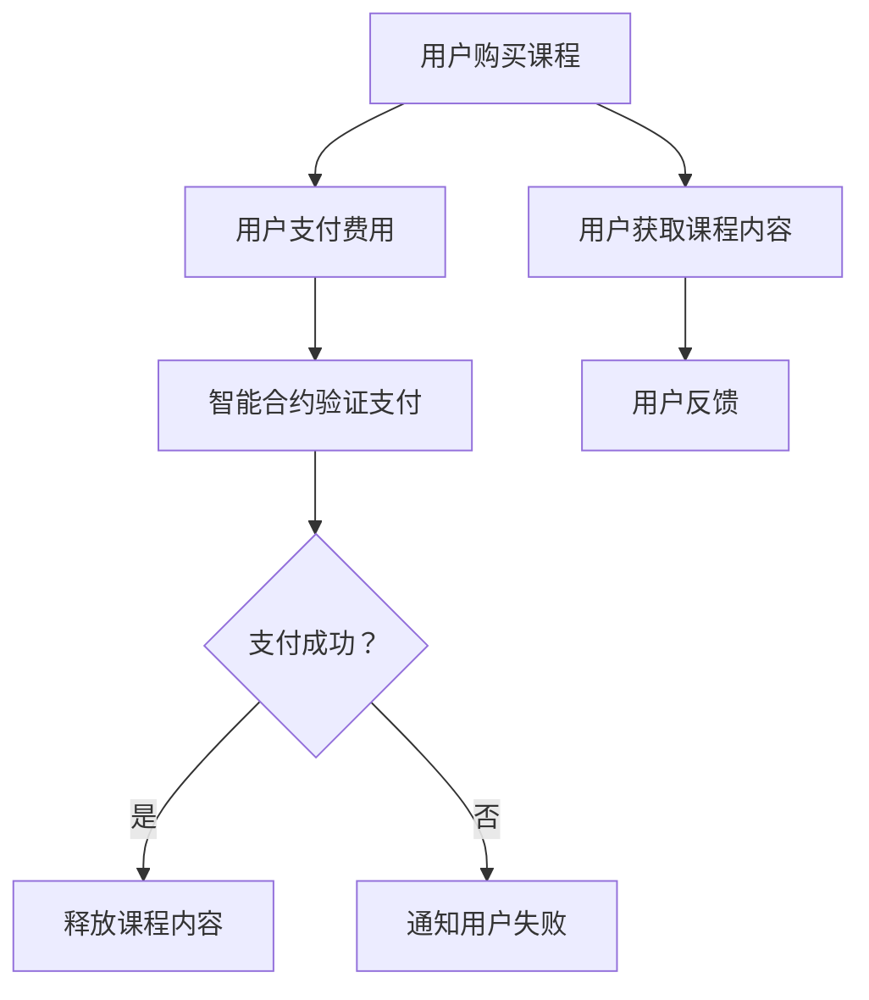

                 

### 背景介绍 Background

随着互联网技术的飞速发展和大数据时代的来临，知识经济已经逐渐成为全球经济发展的新引擎。在这一背景下，知识付费作为一种新型的商业模式，受到了广泛关注和迅速发展。知识付费指的是用户通过付费购买知识服务，从而获得专业指导、技能提升和知识分享的机会。这种模式不仅提高了知识传播的效率，也为知识生产者提供了直接的经济回报。

然而，传统的知识付费模式在交易流程、版权保护、用户隐私等方面存在诸多痛点。首先，交易流程繁琐，用户支付和知识获取之间存在时间差和信任问题。其次，版权保护不足，知识内容容易被非法复制和传播，损害了知识生产者的权益。最后，用户隐私难以得到保障，知识付费平台可能滥用用户数据，导致隐私泄露。

为了解决这些问题，区块链技术提供了一个创新的解决方案。区块链是一种去中心化的分布式数据库，通过密码学和共识算法确保数据的不可篡改性和透明性。智能合约是区块链上的自动化协议，可以自动执行合同条款，无需第三方中介。结合区块链技术和智能合约，可以实现知识付费的信任机制和透明化交易流程，从而解决传统模式中的痛点。

本文将探讨在知识经济下，如何利用区块链智能合约发布知识付费课程。首先，我们将介绍区块链和智能合约的基本概念，然后分析知识付费模式中的核心问题，最后通过具体案例展示如何实现区块链智能合约的知识付费课程发布。

### 核心概念与联系 Core Concepts and Relationships

#### 区块链Blockchain

区块链是一种分布式数据库技术，通过密码学和共识算法确保数据的不可篡改性和透明性。它由一系列按照时间顺序排列的区块组成，每个区块包含一定数量的交易记录，并通过加密算法链接在一起，形成一个链条。区块链的核心特性包括：

1. **去中心化**：区块链不需要中心化的机构或第三方中介进行管理，所有节点都可以参与网络中的交易验证和记账。
2. **不可篡改**：区块链上的数据一旦记录下来，就难以被篡改，因为任何修改都会被其他节点检测并拒绝。
3. **透明性**：区块链上的交易记录是公开透明的，所有参与者都可以查看和验证。

#### 智能合约Smart Contract

智能合约是基于区块链的一种自动化协议，它将合同条款以代码形式嵌入区块链，当满足预设条件时，自动执行合同中的条款。智能合约的关键特性包括：

1. **自动化执行**：智能合约可以自动执行预定义的操作，无需人工干预，从而提高交易效率和降低成本。
2. **不可篡改**：智能合约一旦部署在区块链上，其代码和状态就变得不可篡改，确保了合同条款的执行一致性。
3. **透明性**：智能合约的执行过程是公开透明的，所有参与者都可以查看和验证。

#### 区块链与知识付费的联系

知识付费模式中存在诸多痛点，如交易流程繁琐、版权保护不足、用户隐私难以保障等。区块链和智能合约提供了有效的解决方案：

1. **透明化交易流程**：区块链的去中心化和透明性确保了交易流程的公开透明，用户可以直接在区块链上进行支付和获取知识，无需依赖中心化的中介机构。
2. **版权保护**：区块链的不可篡改性可以确保知识内容的版权得到有效保护，一旦内容被记录在区块链上，就难以被非法复制和传播。
3. **用户隐私保障**：区块链的去中心化特性可以保护用户的隐私，用户数据和交易记录不会集中在某个中心化的机构，从而降低隐私泄露的风险。

#### Mermaid 流程图表示

下面是知识付费模式下使用区块链和智能合约的流程图：



在这个流程图中，用户通过区块链支付费用，智能合约验证支付后，释放课程内容给用户。整个过程透明且不可篡改，有效解决了传统知识付费模式中的痛点。

### 核心算法原理 & 具体操作步骤 Core Algorithm Principle & Detailed Operation Steps

#### 智能合约的编写

智能合约的编写是区块链知识付费课程发布的关键步骤。以下是智能合约编写的具体步骤：

1. **选择区块链平台**：目前市面上有多个区块链平台可供选择，如以太坊（Ethereum）、波卡（Polkadot）等。本文以以太坊为例进行说明。

2. **安装开发环境**：在本地安装Node.js、Truffle等开发工具。Node.js用于运行智能合约，Truffle用于提供智能合约的调试和部署环境。

3. **编写智能合约代码**：智能合约通常使用Solidity语言编写。下面是一个简单的知识付费智能合约示例：

    ```solidity
    // SPDX-License-Identifier: MIT
    pragma solidity ^0.8.0;

    contract KnowledgePayment {
        mapping(address => bool) public courseStatus;

        function purchaseCourse() public payable {
            require(!courseStatus[msg.sender], "Course already purchased");
            require(msg.value > 0, "Invalid payment amount");
            courseStatus[msg.sender] = true;
        }

        function releaseCourseContent() public {
            require(courseStatus[msg.sender], "Not a valid course purchase");
            // 释放课程内容给用户
        }
    }
    ```

    在这个智能合约中，我们使用一个`mapping`结构来记录用户的课程购买状态。`purchaseCourse`函数用于用户支付费用，`releaseCourseContent`函数用于课程内容发布。

4. **部署智能合约**：使用Truffle将智能合约部署到以太坊区块链上。部署过程包括编译智能合约、生成abi和地址等步骤。

5. **前端交互**：开发前端界面，允许用户进行课程购买和内容获取。前端与智能合约的交互通常使用Web3.js库。

#### 智能合约的执行流程

1. **用户购买课程**：用户通过前端界面支付课程费用，调用`purchaseCourse`函数，将资金发送到智能合约地址。

2. **智能合约验证支付**：智能合约收到支付后，调用`courseStatus[msg.sender]`检查用户是否已经购买过课程。如果用户未购买，智能合约会将用户状态标记为已购买。

3. **释放课程内容**：用户可以通过前端界面调用`releaseCourseContent`函数，获取课程内容。这个函数会在满足购买条件时释放课程内容给用户。

#### 代码解读

以下是智能合约的关键代码部分的解读：

```solidity
require(!courseStatus[msg.sender], "Course already purchased");
```

这行代码用于检查用户是否已经购买过课程。如果用户已经购买，智能合约会抛出一个错误，防止重复购买。

```solidity
require(msg.value > 0, "Invalid payment amount");
```

这行代码用于检查用户支付的金额是否大于0。如果支付金额不合法，智能合约会抛出一个错误。

```solidity
courseStatus[msg.sender] = true;
```

这行代码将用户的状态标记为已购买。一旦用户支付成功，智能合约会更新用户的状态，表示其已获得购买课程的权利。

```solidity
require(courseStatus[msg.sender], "Not a valid course purchase");
```

这行代码用于确保用户在调用`releaseCourseContent`函数时已经购买了课程。如果用户未购买，智能合约会抛出一个错误，防止未购买用户获取课程内容。

通过这些代码，我们可以看到智能合约如何自动化地执行知识付费的流程，确保交易的安全和透明性。

### 数学模型和公式 Mathematical Model and Formulas

在区块链智能合约的知识付费课程发布中，数学模型和公式主要用于验证交易的有效性和确保合同条款的执行。以下是几个关键模型和公式的详细讲解：

#### 1. 智能合约状态验证

智能合约的状态验证是确保交易合法性的关键步骤。一个简单的状态验证公式可以表示为：

\[ state_{valid} = (balance_{paid} \geq price_{course}) \land (course_{status} = "unpurchased") \]

其中，\( balance_{paid} \)表示用户支付的金额，\( price_{course} \)表示课程的价格，\( course_{status} \)表示用户是否已购买课程。

#### 2. 数字签名和加密

在智能合约中，数字签名和加密用于确保交易的安全和隐私。一个简单的加密和签名验证公式可以表示为：

\[ signature_{valid} = (message_{hash} = hash_{signed}) \land (public_{key} = signer_{public_{key}}) \]

其中，\( message_{hash} \)表示消息的哈希值，\( hash_{signed} \)表示签名后的哈希值，\( public_{key} \)表示签名者的公钥。

#### 3. 交易费用计算

交易费用计算是智能合约执行过程中的一项重要任务。一个简单的交易费用计算公式可以表示为：

\[ fee_{amount} = (gas_{used} \times gas_{price}) + (storage_{used} \times storage_{price}) \]

其中，\( gas_{used} \)表示智能合约执行过程中消耗的gas数量，\( gas_{price} \)表示每单位gas的价格，\( storage_{used} \)表示智能合约使用的存储空间，\( storage_{price} \)表示每单位存储空间的价格。

#### 举例说明

假设用户A购买了一门价格为1 ETH的课程，智能合约执行过程中消耗了1000 gas，每单位gas的价格为0.001 ETH，智能合约使用了10 KB的存储空间，每单位存储空间的价格为0.1 ETH。那么，交易费用计算如下：

\[ fee_{amount} = (1000 \times 0.001) + (10 \times 1024 \times 0.1) = 1 + 10.24 = 11.24 ETH \]

在这个例子中，用户A需要支付11.24 ETH才能完成课程购买和内容获取。

### 项目实战：代码实际案例和详细解释说明 Practical Case: Code Example and Detailed Explanation

#### 开发环境搭建

为了演示区块链智能合约的知识付费课程发布，我们首先需要搭建开发环境。以下是开发环境的搭建步骤：

1. **安装Node.js**：访问Node.js官网（[https://nodejs.org/），按照说明安装Node.js。](https://nodejs.org/%EF%BC%89%EF%BC%8C%E6%8C%89%E7%85%A7%E8%AF%B4%E6%98%8F%E5%AE%89%E8%A3%85Node.js%E3%80%82)

2. **安装Truffle**：在命令行中运行以下命令安装Truffle：

    ```shell
    npm install -g truffle
    ```

3. **创建项目**：在命令行中运行以下命令创建一个新的Truffle项目：

    ```shell
    truffle init
    ```

4. **安装以太坊客户端**：Truffle默认使用Ganache作为以太坊客户端。如果需要使用实际的以太坊网络，可以安装Geth或Nethermind等以太坊客户端。在Truffle项目中，打开`truffle-config.js`文件，配置以太坊客户端：

    ```javascript
    module.exports = {
      networks: {
        development: {
          host: "127.0.0.1",
          port: 7545,
          network_id: "*",
        },
        // 其他网络配置
      },
    };
    ```

5. **安装Web3.js**：在项目中安装Web3.js库，用于前端与智能合约的交互：

    ```shell
    npm install web3
    ```

#### 源代码详细实现和代码解读

以下是知识付费智能合约的源代码实现和详细解释：

```solidity
// SPDX-License-Identifier: MIT
pragma solidity ^0.8.0;

contract KnowledgePayment {
    mapping(address => bool) public courseStatus;

    function purchaseCourse() public payable {
        require(!courseStatus[msg.sender], "Course already purchased");
        require(msg.value >= 0.1 ether, "Invalid payment amount");
        courseStatus[msg.sender] = true;
    }

    function releaseCourseContent() public {
        require(courseStatus[msg.sender], "Not a valid course purchase");
        // 释放课程内容给用户
    }
}
```

**purchaseCourse函数**

- `require(!courseStatus[msg.sender], "Course already purchased")`：检查用户是否已购买课程。如果已购买，抛出错误。
- `require(msg.value >= 0.1 ether, "Invalid payment amount")`：检查用户支付金额是否大于等于0.1 ETH。如果支付金额不合法，抛出错误。
- `courseStatus[msg.sender] = true`：将用户状态标记为已购买。

**releaseCourseContent函数**

- `require(courseStatus[msg.sender], "Not a valid course purchase")`：检查用户是否已购买课程。如果未购买，抛出错误。

#### 代码解读与分析

在这个智能合约中，我们使用一个`mapping`结构来记录用户的课程购买状态。`purchaseCourse`函数用于用户支付费用，`releaseCourseContent`函数用于课程内容发布。

1. **购买课程**：用户通过调用`purchaseCourse`函数支付课程费用。函数首先检查用户是否已购买课程，如果未购买，则更新用户状态为已购买。

2. **课程内容发布**：用户可以通过前端界面调用`releaseCourseContent`函数获取课程内容。函数会检查用户是否已购买课程，如果已购买，则可以发布课程内容。

通过这个简单的智能合约，我们可以实现知识付费课程的自动化交易和内容发布，确保交易的安全性和透明性。

### 实际应用场景 Real-World Application Scenarios

在知识经济下，区块链智能合约的知识付费课程发布具有广泛的应用场景。以下是一些典型的实际应用场景：

#### 1. 在线教育平台

在线教育平台是区块链智能合约知识付费课程发布的主要应用领域之一。传统在线教育平台通常依赖于中心化的支付系统和版权管理机制，存在交易流程繁琐、版权保护不足、用户隐私难以保障等问题。通过区块链智能合约，在线教育平台可以实现以下优势：

- **透明化交易流程**：用户可以直接在区块链上支付课程费用，无需经过中心化的支付系统，提高交易效率。
- **版权保护**：智能合约的不可篡改性确保知识内容的版权得到有效保护，防止非法复制和传播。
- **隐私保障**：区块链的去中心化特性有助于保护用户的隐私，降低隐私泄露的风险。

#### 2. 专业认证与认证课程

区块链智能合约可以应用于专业认证与认证课程的发布。例如，某些行业（如医学、金融）需要对从业者的资质进行认证，而传统认证过程通常依赖中心化的认证机构，存在效率低、成本高、信任度不足等问题。通过区块链智能合约，可以实现以下优势：

- **去中心化认证**：区块链智能合约可以自动执行认证流程，降低对中心化机构的依赖，提高认证效率。
- **透明性**：区块链上的认证记录是公开透明的，所有参与者都可以查看和验证，提高信任度。
- **可追溯性**：区块链上的数据具有不可篡改性，确保认证记录的真实性和可信度。

#### 3. 在线咨询与专家服务

在线咨询与专家服务是另一个适合区块链智能合约应用场景的领域。传统在线咨询平台通常依赖中心化的支付和合同管理机制，存在交易流程繁琐、信任度不足等问题。通过区块链智能合约，可以实现以下优势：

- **自动化合同执行**：智能合约可以自动执行咨询合同的条款，确保服务提供方和用户之间的权益得到保障。
- **透明化交易流程**：用户可以直接在区块链上进行支付和获取服务，提高交易效率。
- **隐私保护**：区块链的去中心化特性有助于保护用户的隐私，降低隐私泄露的风险。

#### 4. 学术研究与学术论文发布

学术研究与学术论文发布也可以通过区块链智能合约实现。传统学术论文发布过程中，存在版权保护不足、学术诚信问题等问题。通过区块链智能合约，可以实现以下优势：

- **版权保护**：区块链的不可篡改性确保学术论文的版权得到有效保护，防止非法复制和传播。
- **透明性**：区块链上的论文发布记录是公开透明的，所有参与者都可以查看和验证，提高学术诚信度。
- **可追溯性**：区块链上的数据具有不可篡改性，确保学术论文的真实性和可信度。

通过以上实际应用场景，我们可以看到区块链智能合约在知识付费领域具有巨大的潜力和价值。它不仅提高了交易流程的透明性和安全性，还解决了传统模式中存在的痛点，为知识经济带来了新的发展机遇。

### 工具和资源推荐 Tools and Resources Recommendation

在区块链智能合约的知识付费课程发布过程中，选择合适的工具和资源对于提高开发效率、确保项目成功至关重要。以下是一些建议：

#### 1. 学习资源推荐

- **书籍**：
  - 《区块链技术指南》
  - 《智能合约开发指南》
  - 《以太坊开发实战》
- **在线课程**：
  - Coursera上的“区块链与加密货币”课程
  - Udemy上的“智能合约开发：以太坊与Solidity”课程
- **博客和网站**：
  - Ethereum官方文档
  - Truffle官方文档
  - Web3.js官方文档

#### 2. 开发工具框架推荐

- **区块链平台**：
  - Ethereum
  - Binance Smart Chain
  - Polkadot
- **开发环境**：
  - Truffle
  - Hardhat
  - Remix（在线IDE）
- **前端框架**：
  - React
  - Vue
  - Angular
- **链上交互库**：
  - Web3.js
  - ethers.js
  - Moralis

#### 3. 相关论文著作推荐

- **论文**：
  - “The Bitcoin Revolution: A Follow-Up Report”
  - “Ethereum: The World Computer”
  - “On the Economics of Cryptocurrencies”
- **著作**：
  - 《区块链：从数字货币到智能合约》
  - 《智能合约：安全性与可靠性分析》
  - 《区块链与去中心化应用》

通过这些工具和资源的帮助，开发者可以更深入地了解区块链和智能合约的相关知识，提高项目开发效率，确保知识付费课程发布的成功。

### 总结：未来发展趋势与挑战 Summary: Future Development Trends and Challenges

区块链智能合约的知识付费课程发布在知识经济下展现出巨大的潜力和应用前景。随着区块链技术的不断成熟和普及，预计未来知识付费领域将迎来以下发展趋势：

#### 1. 去中心化平台兴起

去中心化平台将成为知识付费的主流模式。区块链技术的去中心化特性使得交易流程更加透明和高效，用户可以直接在区块链上进行支付和获取知识，无需依赖中心化的中介机构。这将有效降低交易成本，提高用户体验。

#### 2. 智能合约应用拓展

智能合约将在知识付费领域得到更广泛的应用。除了课程发布，智能合约还可以应用于版权保护、知识认证、在线咨询等多个场景。智能合约的自动化执行特性将提高交易的效率和安全性，为知识经济带来更多可能性。

#### 3. 跨链互操作性增强

不同区块链之间的互操作性将得到显著提升。随着区块链生态的不断发展，跨链技术将使不同区块链平台之间的知识付费课程可以相互调用和交互，实现更广泛的资源共享和合作。

然而，区块链智能合约的知识付费课程发布也面临一系列挑战：

#### 1. 技术成熟度不足

尽管区块链技术已经取得了一定的发展，但其在实际应用中仍然存在性能、安全性等问题。智能合约的安全性和可扩展性是当前亟待解决的难题。

#### 2. 法规和监管问题

区块链技术和智能合约在全球范围内的法规和监管尚不明确。不同国家和地区的法律法规存在差异，知识付费平台和开发者需要密切关注相关法规变化，确保合规运营。

#### 3. 用户教育和隐私保护

用户对区块链和智能合约的了解和信任程度尚待提高。同时，用户隐私保护也是知识付费平台需要关注的重要问题。平台需要采取有效措施保护用户隐私，增强用户信任。

总之，区块链智能合约的知识付费课程发布具有广阔的发展前景，但也面临诸多挑战。未来，随着技术的不断成熟和法规的不断完善，知识付费领域将迎来新的发展机遇和变革。

### 附录：常见问题与解答 Appendix: Frequently Asked Questions and Answers

#### 1. 区块链智能合约的安全性如何保障？

区块链智能合约的安全性主要依赖于密码学算法和共识机制。智能合约的代码在部署到区块链上后，其执行过程是公开透明的，但代码本身一旦部署后就不能被篡改。此外，智能合约的执行过程是经过共识网络中的多个节点验证的，确保了交易的安全性和可信度。为了提高智能合约的安全性，开发者应遵循以下最佳实践：

- **代码审查**：在部署智能合约前进行代码审查，确保代码中没有逻辑漏洞和潜在风险。
- **使用官方库**：使用经过验证的官方库和框架，避免使用未经验证的第三方库。
- **测试和审计**：对智能合约进行全面的测试和审计，确保其在不同场景下的执行结果符合预期。

#### 2. 智能合约的可扩展性如何实现？

智能合约的可扩展性主要依赖于区块链的底层架构和优化策略。以下是一些提高智能合约可扩展性的方法：

- **状态通道**：通过状态通道技术，将部分交易转移到链下处理，从而减少区块链上的交易负载。
- **分片技术**：将区块链网络划分为多个分片，每个分片独立处理交易，从而提高网络的整体处理能力。
- **优化智能合约设计**：通过优化智能合约的代码结构和执行逻辑，减少不必要的计算和存储操作，提高执行效率。

#### 3. 区块链智能合约与传统的中心化支付系统相比有哪些优势？

区块链智能合约与传统的中心化支付系统相比具有以下优势：

- **去中心化**：区块链智能合约不需要依赖中心化的第三方机构，交易流程更加透明和高效。
- **不可篡改**：智能合约一旦部署到区块链上，其执行过程和状态是公开透明的，无法被篡改。
- **自动化执行**：智能合约可以自动执行预定义的操作，无需人工干预，提高交易效率。
- **透明性**：区块链上的交易记录是公开透明的，所有参与者都可以查看和验证。

#### 4. 如何确保区块链智能合约的版权保护？

区块链智能合约可以通过以下方法确保版权保护：

- **使用非同质化代币（NFT）**：将知识内容作为NFT发行，确保每个NFT都具有唯一性和不可篡改性，从而保护版权。
- **智能合约条款**：在智能合约中明确版权归属和使用条款，确保知识内容的版权得到合法保护。
- **透明性**：区块链上的版权信息是公开透明的，所有参与者都可以查看和验证，确保版权保护的可信度。

通过以上常见问题的解答，我们希望为开发者提供更多关于区块链智能合约的知识付费课程发布的参考和指导。

### 扩展阅读 & 参考资料 Further Reading & References

区块链和智能合约作为新兴技术，在知识经济领域具有广阔的应用前景。以下是一些扩展阅读和参考资料，供读者深入了解区块链智能合约的知识付费课程发布：

- **书籍**：
  - 《区块链技术指南》
  - 《智能合约开发指南》
  - 《以太坊开发实战》
  - 《区块链与去中心化应用》
- **在线课程**：
  - Coursera上的“区块链与加密货币”课程
  - Udemy上的“智能合约开发：以太坊与Solidity”课程
- **博客和网站**：
  - Ethereum官方文档
  - Truffle官方文档
  - Web3.js官方文档
  - Ethers.js官方文档
- **论文**：
  - “The Bitcoin Revolution: A Follow-Up Report”
  - “Ethereum: The World Computer”
  - “On the Economics of Cryptocurrencies”
- **在线资源**：
  - [区块链技术社区](https://www.blockchain.community/)
  - [智能合约开发社区](https://www.smartcontractdeveloper.com/)
  - [以太坊开发者论坛](https://forum.ethereum.org/)

通过这些扩展阅读和参考资料，读者可以深入了解区块链智能合约的知识付费课程发布的技术原理和实践方法，为实际项目开发提供有力支持。

