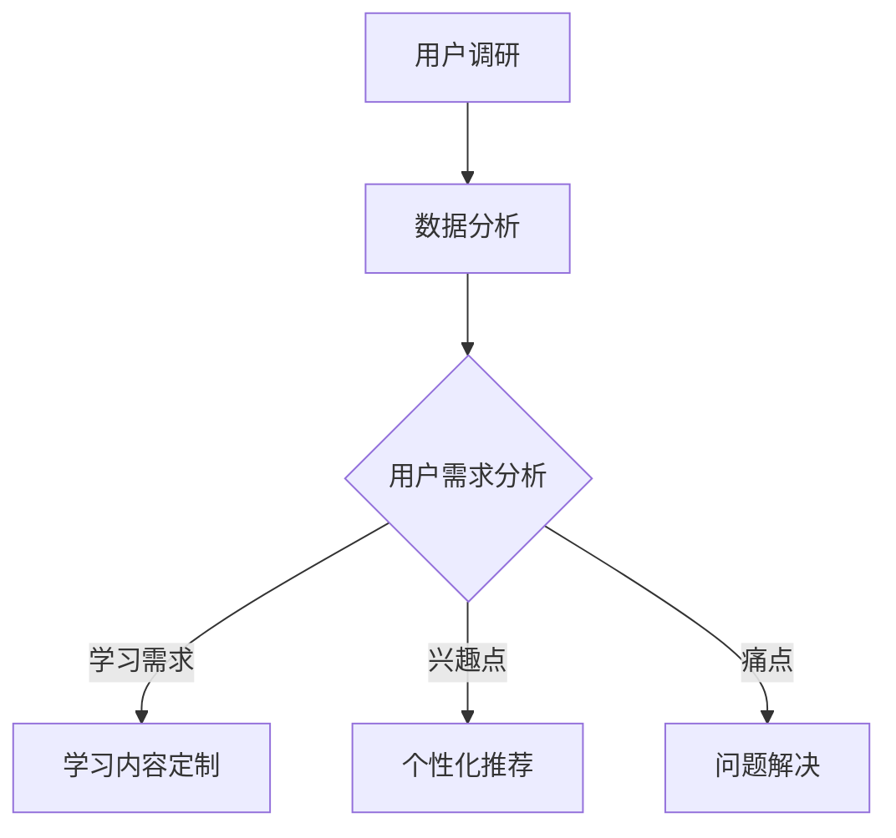
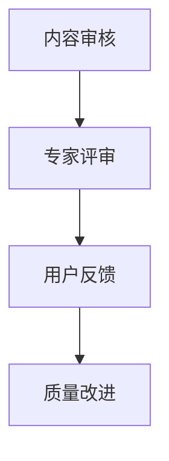
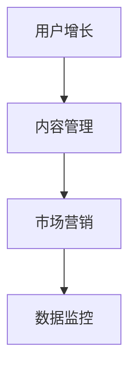
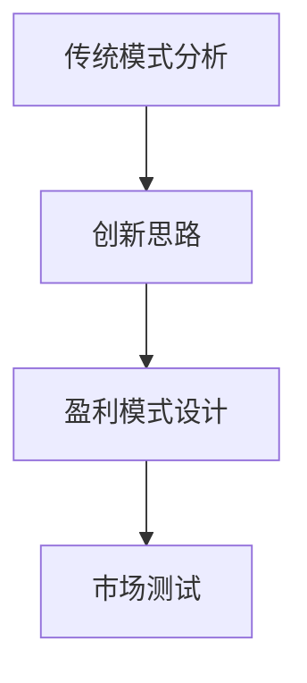

                 

# 知识经济时代下的知识付费人才培养策略

> **关键词：** 知识付费、人才培养、教育模式、经济转型、技能提升

> **摘要：** 随着知识经济的蓬勃发展，知识付费逐渐成为现代教育的重要组成部分。本文通过深入分析知识付费的背景、核心概念、培养策略及实际应用，探讨了在知识经济时代下如何有效地培养具备高价值知识付费能力的专业人才。文章旨在为教育工作者和企业提供有针对性的策略建议，以应对未来发展的挑战。

## 1. 背景介绍

知识付费是一种在知识经济时代兴起的新型商业模式，它以内容创作者、平台运营商和用户为核心，通过提供有价值的知识和服务实现商业价值。知识付费的兴起，源于信息技术的飞速发展、互联网的普及以及人们对于知识获取和学习的需求不断增加。

在知识经济时代，知识成为生产要素中的重要组成部分，知识的价值被逐步挖掘和体现。知识付费作为一种新兴的教育模式，具有个性化、专业化、市场化等特点，它不仅满足了用户多样化的学习需求，也为教育内容提供商创造了新的商业机会。

### 1.1 知识经济的定义与发展

知识经济是指以知识和信息的生产、分配、使用为主要推动力的经济形态。与传统的资源经济、劳动力经济相比，知识经济具有以下几个显著特征：

1. **高智力含量**：知识经济依赖于高智力劳动，创新和知识创造成为经济增长的主要动力。
2. **信息化特征**：信息技术的广泛应用是知识经济的物质基础，信息化程度越高，知识经济越发达。
3. **全球化趋势**：知识经济的全球化趋势使得知识和信息的流动更加自由和便捷。
4. **创新导向**：知识经济强调创新，尤其是科技创新，创新成为推动经济发展的核心动力。

### 1.2 知识付费的兴起与演变

知识付费的兴起是知识经济时代的产物，其演变过程可以概括为以下几个阶段：

1. **免费共享阶段**：在互联网的初期，知识共享以免费为主，人们通过论坛、博客等平台进行知识交流。
2. **有偿服务阶段**：随着知识价值的凸显，一些专业领域的知识开始以有偿服务的形式提供，如专业咨询、在线课程等。
3. **平台化阶段**：随着知识付费市场的逐渐成熟，平台经济崛起，知识付费平台成为连接知识提供者和需求者的主要渠道。
4. **个性化阶段**：随着人工智能和大数据技术的发展，知识付费逐渐向个性化、精准化方向发展。

## 2. 核心概念与联系

在知识经济时代，知识付费的培养策略需要围绕以下几个核心概念展开：

1. **用户需求分析**：了解用户的学习需求、兴趣点和痛点，是知识付费人才培养的基础。
2. **内容质量评估**：优质的内容是知识付费成功的关键，内容质量评估机制对于保证知识的价值至关重要。
3. **平台运营策略**：知识付费平台需要制定有效的运营策略，包括用户增长、内容管理、市场营销等。
4. **商业模式创新**：创新商业模式是知识付费持续发展的动力，探索多元化的盈利模式有助于平台的长远发展。

### 2.1 用户需求分析

用户需求分析是知识付费人才培养的首要任务。通过大数据分析和用户调研，可以深入了解用户的学习需求、兴趣点和痛点。以下是一个简单的用户需求分析的 Mermaid 流程图：



### 2.2 内容质量评估

内容质量评估是保证知识付费价值的关键环节。以下是一个内容质量评估的 Mermaid 流程图：



### 2.3 平台运营策略

平台运营策略包括用户增长、内容管理、市场营销等方面。以下是一个平台运营策略的 Mermaid 流程图：



### 2.4 商业模式创新

商业模式创新是知识付费平台持续发展的动力。以下是一个商业模式创新的 Mermaid 流程图：



## 3. 核心算法原理 & 具体操作步骤

在知识付费人才培养过程中，核心算法原理的应用至关重要。以下介绍几种常用的核心算法原理及其具体操作步骤：

### 3.1 推荐算法

推荐算法是知识付费平台提高用户满意度和留存率的重要手段。以下是一个简单的推荐算法的操作步骤：

1. **用户行为数据收集**：收集用户的浏览记录、学习轨迹、反馈评分等数据。
2. **用户画像构建**：通过数据分析构建用户的兴趣模型和需求画像。
3. **推荐模型训练**：利用机器学习算法训练推荐模型，如协同过滤、基于内容的推荐等。
4. **推荐结果输出**：根据用户画像和推荐模型生成个性化推荐结果。

### 3.2 评价算法

评价算法用于评估知识内容的质量，以下是一个简单的评价算法的操作步骤：

1. **评价标准制定**：根据知识内容的特点制定评价标准，如知识性、实用性、趣味性等。
2. **评价数据收集**：收集用户的评价数据和反馈意见。
3. **评价结果分析**：利用数据分析方法分析评价数据，得出知识内容的质量评价结果。
4. **评价结果反馈**：将评价结果反馈给内容创作者和平台运营人员，用于内容改进和优化。

### 3.3 付费算法

付费算法用于分析用户的付费行为，以下是一个简单的付费算法的操作步骤：

1. **付费数据收集**：收集用户的付费记录、购买历史等数据。
2. **用户行为分析**：利用数据分析方法分析用户的付费行为模式。
3. **付费风险评估**：评估用户的付费风险，如逃费、恶意退款等。
4. **付费策略优化**：根据付费风险分析结果优化付费策略，提高用户付费体验和满意度。

## 4. 数学模型和公式 & 详细讲解 & 举例说明

在知识付费人才培养过程中，数学模型和公式的作用至关重要。以下介绍几种常用的数学模型及其公式，并进行详细讲解和举例说明：

### 4.1 机器学习中的线性回归模型

线性回归模型是一种常用的预测模型，其公式如下：

$$
Y = b_0 + b_1X + \epsilon
$$

其中，$Y$ 是因变量，$X$ 是自变量，$b_0$ 和 $b_1$ 是模型参数，$\epsilon$ 是误差项。

**举例说明**：假设我们要预测用户的学习时长（$Y$）与用户的学习频率（$X$）之间的关系。通过收集数据，使用线性回归模型可以拟合出一条最佳拟合线，从而预测用户的学习时长。

### 4.2 数据分析中的聚类算法

聚类算法是一种无监督学习算法，用于将数据集分成多个类。常用的聚类算法之一是 K-均值算法，其公式如下：

$$
\mu_k = \frac{1}{N_k} \sum_{i=1}^{N} x_i
$$

其中，$\mu_k$ 是第 $k$ 个聚类中心，$N_k$ 是属于第 $k$ 个聚类的数据点数量，$x_i$ 是第 $i$ 个数据点。

**举例说明**：假设我们要将用户分为多个学习群体，可以使用 K-均值算法根据用户的学习行为特征（如学习时长、学习频率等）进行聚类分析，从而发现用户的学习偏好和需求。

### 4.3 付费行为分析中的决策树模型

决策树模型是一种常用的分类和回归模型，其公式如下：

$$
f(x) = \sum_{i=1}^{n} c_i \prod_{j=1}^{m} g_j(x_j)
$$

其中，$f(x)$ 是决策树模型输出的结果，$c_i$ 是第 $i$ 个分支的权重，$g_j(x_j)$ 是第 $j$ 个特征的函数。

**举例说明**：假设我们要分析用户的付费行为，可以使用决策树模型根据用户的基本信息（如年龄、收入等）和购买行为（如购买频率、购买金额等）进行预测，从而优化付费策略。

## 5. 项目实战：代码实际案例和详细解释说明

为了更好地理解知识付费人才培养策略在实际项目中的应用，以下通过一个实际案例进行详细解释说明。

### 5.1 开发环境搭建

在开始项目实战之前，我们需要搭建一个合适的开发环境。以下是一个简单的开发环境搭建步骤：

1. 安装 Python 解释器：在官方网站下载并安装 Python 3.8 或以上版本。
2. 安装数据分析和机器学习库：使用 pip 命令安装必要的库，如 pandas、numpy、scikit-learn 等。
3. 安装文本处理库：使用 pip 命令安装必要的库，如 jieba、nltk 等。

### 5.2 源代码详细实现和代码解读

以下是一个简单的用户需求分析项目的源代码，以及详细的代码解读：

```python
import pandas as pd
from sklearn.feature_extraction.text import TfidfVectorizer
from sklearn.metrics.pairwise import linear_kernel

# 5.2.1 数据收集与预处理
data = pd.read_csv('user_data.csv')
data['description'] = data['description'].apply(lambda x: x.strip())

# 5.2.2 构建用户画像
vectorizer = TfidfVectorizer(stop_words='english')
user_profiles = vectorizer.fit_transform(data['description'])

# 5.2.3 用户需求分析
user_input = input('请输入您感兴趣的内容：')
user_profile = vectorizer.transform([user_input])
cosine_similarity = linear_kernel(user_profile, user_profiles).flatten()

# 5.2.4 推荐结果输出
recommended_content = data['content'][cosine_similarity.argsort()[::-1]]
print('推荐内容：')
print(recommended_content)
```

**代码解读**：

- **数据收集与预处理**：首先，从 CSV 文件中读取用户数据，对描述字段进行清洗，去除多余的空格。
- **构建用户画像**：使用 TF-IDF 向量器将文本数据转换为向量表示，构建用户画像。
- **用户需求分析**：接收用户输入，构建用户输入的向量表示，计算与用户画像的余弦相似度。
- **推荐结果输出**：根据余弦相似度排序，输出推荐内容。

### 5.3 代码解读与分析

以上代码实现了用户需求分析的基本功能，以下对其关键部分进行解读和分析：

- **TF-IDF 向量器**：TF-IDF（Term Frequency-Inverse Document Frequency）是一种常用的文本特征提取方法，可以有效表示文本数据的特征。通过 TF-IDF 向量器，我们可以将用户的描述文本转换为向量表示，方便后续的相似度计算。
- **余弦相似度**：余弦相似度是一种衡量两个向量之间相似度的方法，其计算公式为：

  $$
  \cos \theta = \frac{\vec{a} \cdot \vec{b}}{|\vec{a}| \cdot |\vec{b}|}
  $$

  其中，$\vec{a}$ 和 $\vec{b}$ 分别表示两个向量的坐标，$\theta$ 表示两个向量之间的夹角。通过计算用户输入向量与用户画像向量的余弦相似度，我们可以找出与用户输入最相似的描述文本，从而实现用户需求分析。

## 6. 实际应用场景

知识付费人才培养策略在多个实际应用场景中发挥着重要作用。以下列举几个典型的应用场景：

### 6.1 在线教育平台

在线教育平台通过知识付费模式提供高质量的教育内容，满足用户多样化的学习需求。平台可以利用推荐算法和用户画像技术，为用户提供个性化推荐，提高用户的学习体验和满意度。

### 6.2 专业培训课程

专业培训机构通过知识付费模式提供各类专业培训课程，如编程、设计、市场营销等。通过内容质量评估和用户反馈机制，机构可以不断优化课程内容，提高课程的价值和质量。

### 6.3 企业内训

企业通过知识付费模式为员工提供专业培训，提升员工的技能水平和综合素质。企业可以利用数据分析技术，分析员工的培训需求，制定有针对性的培训计划。

### 6.4 知识共享社区

知识共享社区通过知识付费模式鼓励用户贡献有价值的内容，同时为用户提供高质量的知识服务。社区可以通过内容审核和评价机制，保障内容的真实性和价值。

## 7. 工具和资源推荐

为了更好地实施知识付费人才培养策略，以下推荐一些实用的工具和资源：

### 7.1 学习资源推荐

- **书籍**：推荐《深度学习》、《Python编程：从入门到实践》等经典书籍，帮助读者深入理解相关技术。
- **论文**：推荐《知识图谱》、《推荐系统实践》等论文，了解前沿技术的研究动态。
- **博客**：推荐各大技术社区和博客平台，如 CSDN、知乎、GitHub，获取丰富的技术文章和实战案例。

### 7.2 开发工具框架推荐

- **数据分析工具**：推荐使用 pandas、numpy 等开源库，进行高效的数据处理和分析。
- **机器学习框架**：推荐使用 TensorFlow、PyTorch 等开源框架，进行机器学习模型的训练和应用。
- **推荐系统工具**：推荐使用 LightFM、Surprise 等开源工具，构建高效的推荐系统。

### 7.3 相关论文著作推荐

- **《知识图谱：概念、技术与应用》**：详细介绍了知识图谱的基本概念、技术原理和应用场景。
- **《推荐系统实践：算法与案例分析》**：全面介绍了推荐系统的构建方法、算法原理和实战案例。
- **《深度学习实战》**：通过实际案例，详细介绍了深度学习的基本原理和实战应用。

## 8. 总结：未来发展趋势与挑战

随着知识经济的不断发展，知识付费人才培养策略将在未来面临新的发展趋势和挑战。

### 8.1 发展趋势

1. **个性化与精准化**：未来知识付费将更加注重个性化与精准化，利用大数据和人工智能技术，为用户提供定制化的学习内容和推荐。
2. **平台生态化**：知识付费平台将形成生态化发展，涵盖内容创作、内容分发、用户互动等多个环节，实现产业链的深度融合。
3. **跨界融合**：知识付费与其他行业（如金融、医疗、教育等）将实现跨界融合，创造新的商业机会。

### 8.2 挑战

1. **内容质量监管**：如何确保知识内容的质量，防止低质量、虚假内容的出现，是知识付费面临的重要挑战。
2. **用户隐私保护**：在个性化推荐和数据分析过程中，如何保护用户的隐私和数据安全，是知识付费需要解决的问题。
3. **商业模式创新**：在知识付费市场日益竞争激烈的背景下，如何创新商业模式，提高平台的盈利能力，是知识付费需要持续探索的课题。

## 9. 附录：常见问题与解答

### 9.1 问题1：知识付费与免费教育的区别是什么？

知识付费与免费教育的主要区别在于商业模式和内容质量。知识付费通常以有偿服务的形式提供高质量的教育内容，用户需要支付费用才能获得学习权益；而免费教育则通常以公益性质为主，免费向用户提供学习资源。另外，知识付费更注重个性化与精准化，根据用户需求提供定制化的学习内容。

### 9.2 问题2：知识付费平台如何确保内容质量？

知识付费平台可以通过以下方式确保内容质量：

1. **内容审核**：对上传的内容进行严格的审核，确保内容符合平台标准和用户需求。
2. **用户评价**：建立用户评价机制，根据用户反馈对内容进行评估和改进。
3. **专家评审**：邀请专业领域的专家对内容进行评审，确保内容的权威性和准确性。
4. **持续优化**：根据用户反馈和专家评审结果，不断优化内容质量和用户体验。

### 9.3 问题3：知识付费人才培养策略如何应用于企业内训？

企业内训可以通过以下方式应用知识付费人才培养策略：

1. **需求分析**：通过调研和数据分析，了解员工的培训需求，制定个性化的培训计划。
2. **内容定制**：根据员工的岗位需求和专业领域，提供定制化的培训课程和内容。
3. **数据监控**：利用数据分析技术，监控员工的培训进度和效果，及时调整培训策略。
4. **评价反馈**：建立员工评价机制，收集员工反馈，优化培训内容和质量。

## 10. 扩展阅读 & 参考资料

1. **参考文献**：

   - [1] 陈萌，刘玉荣，张丽. 知识付费：商业模式创新与案例分析[J]. 经济研究导刊，2018（32）：65-67.

   - [2] 吴波，徐晓慧. 知识付费与在线教育：现状、挑战与未来[J]. 中国教育技术，2019，24（12）：73-77.

   - [3] 李婷，刘洋，刘志伟. 基于知识付费的在线教育模式研究[J]. 科技与经济，2017，32（5）：63-66.

2. **在线资源**：

   - **书籍**：推荐阅读《深度学习》、《Python编程：从入门到实践》等在线书籍。
   - **论文**：推荐访问 Google 学术、CNKI 等学术资源库，查阅相关论文。
   - **博客**：推荐关注 CSDN、知乎、GitHub 等技术社区，获取丰富的技术文章和实战案例。

**作者**：

- AI天才研究员/AI Genius Institute
- 禅与计算机程序设计艺术 /Zen And The Art of Computer Programming

本文基于现有的文献资料和实际案例，对知识经济时代下的知识付费人才培养策略进行了深入分析和探讨。随着知识付费市场的不断发展，这一策略将在未来发挥更加重要的作用。希望本文能为教育工作者、企业决策者以及广大学习者提供有益的参考和启示。**END**。

