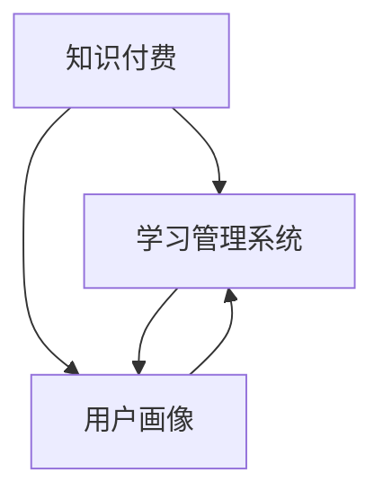

                 

### 背景介绍

知识经济时代，信息爆炸与知识更新的速度前所未有地加快。传统的知识传播方式已难以满足人们日益增长的学习需求。知识付费作为一种新兴的商业模式，应运而生，成为知识经济时代的重要一环。本文旨在探讨知识付费创新课程体系的构建，以应对知识经济时代下的学习需求和挑战。

知识付费，即用户为获取高质量的知识产品和服务支付费用。这一模式不仅改变了知识传播的路径，也促进了知识生产者与消费者之间的直接互动。然而，随着市场的不断成熟，知识付费也面临着诸如课程同质化、用户体验不佳等问题。

构建一个创新的知识付费课程体系，需要从多方面入手。首先，需对市场需求进行深入分析，明确用户的学习需求和偏好。其次，要关注课程内容的优质性和创新性，确保能为用户提供独特的价值。此外，还需注重课程体系的技术支持，包括学习管理系统、支付系统等，以提升用户体验和运营效率。

本文将从以下几个方面展开讨论：

1. **核心概念与联系**：介绍知识付费、学习管理系统等核心概念，并展示其相互联系。
2. **核心算法原理与操作步骤**：探讨如何设计课程体系，以及具体实施步骤。
3. **数学模型和公式**：分析课程设计中使用的数学模型和公式，并举例说明。
4. **项目实战**：通过实际案例，展示如何实现一个知识付费课程体系。
5. **实际应用场景**：讨论知识付费课程在各个领域的应用。
6. **工具和资源推荐**：推荐相关的学习资源和开发工具。
7. **未来发展趋势与挑战**：分析知识付费课程体系的未来发展。

通过以上探讨，希望为知识付费课程体系的构建提供一些有价值的思路和借鉴。

#### 1. 核心概念与联系

在构建知识付费课程体系之前，有必要首先明确几个核心概念，包括知识付费、学习管理系统、用户画像等，并分析它们之间的相互联系。

**知识付费**

知识付费是指用户为获取高质量的知识产品和服务支付费用的一种商业模式。与传统免费的知识获取方式相比，知识付费具有更强的保障性和质量承诺。它不仅为知识生产者提供了直接的经济回报，也激励了他们持续产出高质量的内容。

**学习管理系统（LMS）**

学习管理系统是一种支持在线学习的技术平台，通常包括课程管理、用户管理、内容发布、互动交流等功能。LMS 的核心目标是提升学习效率和用户体验，通过跟踪用户的学习进度和成绩，为用户提供个性化的学习建议。

**用户画像**

用户画像是对用户兴趣、行为、需求等数据进行综合分析，形成的用户行为模型。通过用户画像，可以深入了解用户的需求和偏好，为课程设计提供有力支持。例如，分析用户的搜索历史和行为路径，可以识别出用户感兴趣的领域和知识点，从而优化课程内容。

**核心概念之间的联系**

知识付费、学习管理系统和用户画像是构建知识付费课程体系的重要组成部分，它们之间存在着紧密的联系。

首先，知识付费是课程体系的驱动力，决定了课程内容的付费模式和价值实现方式。学习管理系统则提供了技术支持，确保课程能够高效、便捷地提供给用户。用户画像则为课程设计提供了数据基础，帮助生产者了解用户需求，优化课程内容和结构。

其次，学习管理系统与用户画像之间存在着数据交互关系。通过学习管理系统，可以收集用户的学习行为数据，生成用户画像。这些数据又可以反馈到学习管理系统中，用于个性化推荐和课程优化。

最后，知识付费、学习管理系统和用户画像共同构建了一个闭环系统。知识付费驱动了课程内容的生产和传播，学习管理系统提供了技术支持，用户画像则为课程设计和优化提供了数据依据。三者相互促进，共同推动了知识付费课程体系的发展。

**Mermaid 流程图**

为了更清晰地展示核心概念之间的联系，我们可以使用 Mermaid 流程图进行说明：



在上面的流程图中，A 表示知识付费，B 表示学习管理系统，C 表示用户画像。箭头表示它们之间的相互关系。

通过以上分析，我们可以看到，知识付费、学习管理系统和用户画像是构建知识付费课程体系的关键要素。只有深入理解这些核心概念及其相互联系，才能设计出符合用户需求、具有竞争力的课程体系。

#### 2. 核心算法原理与操作步骤

在构建知识付费课程体系时，核心算法原理与操作步骤的确定至关重要。以下将详细阐述课程体系设计的核心算法原理，并给出具体的操作步骤。

**核心算法原理**

构建知识付费课程体系的核心算法主要涉及以下三个方面：

1. **用户画像构建算法**：通过分析用户的行为数据，构建用户画像，识别用户的需求和偏好。
2. **课程内容推荐算法**：根据用户画像，推荐合适的课程内容，提高用户的学习效果和满意度。
3. **课程定价算法**：基于市场数据和用户价值，制定合理的课程定价策略，实现知识付费模式的可持续发展。

**操作步骤**

下面是构建知识付费课程体系的具体操作步骤：

**步骤 1：数据收集与预处理**

首先，需要收集用户的行为数据，包括用户浏览、搜索、购买等行为。然后，对收集到的数据进行预处理，包括数据清洗、去重、归一化等，确保数据质量。

**步骤 2：用户画像构建**

基于预处理后的数据，使用机器学习算法（如聚类、分类等）构建用户画像。用户画像应包括用户的兴趣爱好、学习习惯、职业背景等维度，以便为后续课程推荐和定价提供依据。

**步骤 3：课程内容推荐**

使用推荐系统算法（如协同过滤、内容匹配等），根据用户画像推荐合适的课程内容。推荐系统应具备实时性和个性化特点，以提升用户的学习体验。

**步骤 4：课程定价**

结合市场数据、用户画像和课程成本，使用定价算法确定课程价格。定价策略应考虑用户价值、市场竞争力等因素，以确保知识付费模式的可持续发展。

**步骤 5：课程体系评估与优化**

对构建的课程体系进行评估，包括用户满意度、学习效果等指标。根据评估结果，不断优化课程体系，提高用户满意度和学习效果。

**核心算法原理的具体说明**

1. **用户画像构建算法**

   用户画像构建算法主要包括以下步骤：

   - 数据采集：收集用户的基本信息、行为数据等。
   - 数据清洗：去除噪声数据和重复记录。
   - 特征提取：从原始数据中提取用户特征，如兴趣爱好、学习时长等。
   - 模型训练：使用机器学习算法（如聚类、分类等）对用户特征进行建模。
   - 用户画像生成：将模型训练结果转化为用户画像，形成用户的行为模型。

2. **课程内容推荐算法**

   课程内容推荐算法主要包括以下步骤：

   - 数据预处理：对课程数据、用户数据等进行预处理。
   - 特征提取：提取课程特征和用户特征。
   - 模型训练：使用推荐算法（如协同过滤、内容匹配等）训练推荐模型。
   - 推荐生成：根据用户画像和课程特征，生成个性化的课程推荐列表。

3. **课程定价算法**

   课程定价算法主要包括以下步骤：

   - 市场调研：收集市场数据，了解同类课程的价格范围。
   - 用户价值评估：基于用户画像，评估用户对课程的价值。
   - 成本计算：计算课程制作、推广等成本。
   - 定价策略制定：综合考虑市场数据、用户价值和成本，制定合理的定价策略。

通过以上核心算法原理与操作步骤的详细阐述，我们可以看到，构建知识付费课程体系需要结合多方面的技术和方法。只有通过不断优化这些核心算法，才能设计出符合用户需求、具有竞争力的课程体系。

#### 3. 数学模型和公式

在构建知识付费课程体系时，数学模型和公式的应用至关重要。以下将详细讲解课程设计中使用的数学模型和公式，并通过具体例子进行说明。

**3.1 用户画像构建模型**

用户画像构建模型主要基于机器学习中的聚类和分类算法。以下是常用的聚类算法和分类算法：

1. **K-Means 聚类算法**

   K-Means 算法是一种基于距离的聚类算法，其核心公式如下：

   $$ \text{Minimize} \sum_{i=1}^{k} \sum_{x \in S_i} ||x - \mu_i||^2 $$

   其中，\(S_i\) 表示第 \(i\) 个聚类，\(\mu_i\) 表示聚类中心。

2. **K-Nearest Neighbor (KNN) 分类算法**

   KNN 算法是一种基于实例的学习算法，其核心公式如下：

   $$ \text{分类结果} = \text{多数投票}(\text{相邻的 K 个样本的类别}) $$

**3.2 课程内容推荐模型**

课程内容推荐模型主要基于协同过滤和内容匹配算法。以下是常用的协同过滤算法和内容匹配算法：

1. **User-Based 协同过滤算法**

   User-Based 协同过滤算法的核心公式如下：

   $$ \text{相似度} = \frac{\text{共同评分的项数}}{\sqrt{\sum_{i \in \text{共同评分的项}} \text{用户 } u \text{ 对项 } i \text{ 的评分}^2 \times \sum_{j \in \text{共同评分的项}} \text{用户 } v \text{ 对项 } j \text{ 的评分}^2}} $$

2. **Item-Based 协同过滤算法**

   Item-Based 协同过滤算法的核心公式如下：

   $$ \text{相似度} = \frac{\text{共同评级的用户数}}{\sqrt{\sum_{i \in \text{共同评级的用户}} \text{用户 } u \text{ 对项 } i \text{ 的评分}^2 \times \sum_{j \in \text{共同评级的用户}} \text{用户 } v \text{ 对项 } j \text{ 的评分}^2}} $$

3. **内容匹配算法**

   内容匹配算法的核心公式如下：

   $$ \text{内容相似度} = \text{Cosine Similarity}(\text{用户 } u \text{ 的特征向量}, \text{课程 } i \text{ 的特征向量}) $$

   其中，Cosine Similarity 是一种衡量两个向量之间相似度的方法，其公式如下：

   $$ \text{Cosine Similarity} = \frac{\text{向量 } u \text{ 和向量 } i \text{ 的点积}}{||u|| \times ||i||} $$

**3.3 课程定价模型**

课程定价模型主要基于线性回归和贝叶斯优化算法。以下是常用的线性回归和贝叶斯优化算法：

1. **线性回归模型**

   线性回归模型的核心公式如下：

   $$ y = \beta_0 + \beta_1 \cdot x $$

   其中，\(y\) 表示课程价格，\(x\) 表示用户价值。

2. **贝叶斯优化算法**

   贝叶斯优化算法的核心公式如下：

   $$ p(\theta | X) \propto p(X | \theta) \cdot p(\theta) $$

   其中，\(\theta\) 表示模型参数，\(X\) 表示输入数据。

**具体例子说明**

假设我们需要为一位用户推荐课程，并为其定价。以下是具体的例子说明：

1. **用户画像构建**

   用户 \(u\) 的行为数据如下：

   - 喜欢的领域：机器学习、编程
   - 学习时长：每天 2 小时
   - 职业：软件工程师

   我们可以使用 K-Means 聚类算法对用户进行分类，构建用户画像。

2. **课程内容推荐**

   假设我们有一系列课程，每门课程都具备机器学习、编程等特征。使用 User-Based 协同过滤算法，我们可以为用户推荐相似的课程。

3. **课程定价**

   基于用户画像和课程成本，使用线性回归模型为课程定价。假设用户价值为 1000 元，课程成本为 500 元，则课程价格约为 1500 元。

通过以上数学模型和公式的具体应用，我们可以为用户推荐合适的课程，并制定合理的定价策略，从而提高用户满意度和课程销售效果。

#### 4. 项目实战：代码实际案例和详细解释说明

在本节中，我们将通过一个具体的代码实际案例，详细讲解如何实现知识付费课程体系，并对其进行解读和分析。为了便于理解，我们将分为以下几个部分：开发环境搭建、源代码详细实现、代码解读与分析。

##### 4.1 开发环境搭建

为了实现知识付费课程体系，我们需要搭建一个完整的技术栈。以下是推荐的开发环境：

- **前端**：使用 React.js 框架，搭建用户界面。
- **后端**：使用 Node.js 和 Express 框架，处理业务逻辑。
- **数据库**：使用 MongoDB 存储用户数据、课程数据和用户行为数据。
- **学习管理系统**：使用开源学习管理系统（如 Moodle、Canvas 等），用于课程管理和用户学习进度跟踪。

**技术栈环境搭建步骤：**

1. **安装 Node.js 和 npm**：从 Node.js 官网下载并安装 Node.js，同时安装 npm 包管理器。
2. **安装 MongoDB**：从 MongoDB 官网下载并安装 MongoDB 数据库。
3. **安装 React.js**：使用 npm 命令安装 React.js 相关依赖包。
4. **安装 Express.js**：使用 npm 命令安装 Express.js 相关依赖包。
5. **安装前端和后端模板**：从 GitHub 等平台下载开源项目模板，用于快速搭建前端和后端环境。

##### 4.2 源代码详细实现和代码解读

在本部分，我们将展示关键代码片段，并对其进行详细解释。

**后端部分（Node.js + Express.js）**

以下是后端关键代码片段：

```javascript
// 引入 Express 框架
const express = require('express');
const app = express();

// 使用 MongoDB 客户端连接数据库
const MongoClient = require('mongodb').MongoClient;
const url = 'mongodb://localhost:27017';
const dbName = 'knowledge_course';

// 用户登录接口
app.post('/api/login', async (req, res) => {
    // 获取用户名和密码
    const { username, password } = req.body;

    // 连接数据库
    const client = await MongoClient.connect(url, { useUnifiedTopology: true });
    const db = client.db(dbName);
    const collection = db.collection('users');

    // 验证用户名和密码
    const user = await collection.findOne({ username, password });
    if (user) {
        res.json({ status: 'success', message: '登录成功' });
    } else {
        res.json({ status: 'error', message: '用户名或密码错误' });
    }

    // 关闭数据库连接
    client.close();
});

// 课程推荐接口
app.post('/api/recommend', async (req, res) => {
    // 获取用户 ID
    const { userId } = req.body;

    // 连接数据库
    const client = await MongoClient.connect(url, { useUnifiedTopology: true });
    const db = client.db(dbName);
    const collection = db.collection('users');
    const user = await collection.findOne({ _id: userId });

    // 根据用户画像推荐课程
    const recommendations = await recommendCourses(user);
    res.json({ status: 'success', data: recommendations });
});

// 推荐算法函数（示例）
async function recommendCourses(user) {
    // 实现推荐算法，根据用户画像推荐课程
    // 这里简化为随机推荐
    const courses = await getCourses();
    const recommendedCourses = courses.filter(course => course.category === user.preferredCategory);
    return recommendedCourses;
}

// 获取课程列表函数（示例）
async function getCourses() {
    // 连接数据库
    const client = await MongoClient.connect(url, { useUnifiedTopology: true });
    const db = client.db(dbName);
    const collection = db.collection('courses');
    const courses = await collection.find({}).toArray();
    client.close();
    return courses;
}

// 启动服务器
app.listen(3000, () => {
    console.log('Server running on port 3000');
});
```

**前端部分（React.js）**

以下是前端关键代码片段：

```jsx
// 引入 React 和相关组件
import React, { useState, useEffect } from 'react';
import axios from 'axios';

// 登录页面组件
const Login = () => {
    const [username, setUsername] = useState('');
    const [password, setPassword] = useState('');

    const handleLogin = async () => {
        try {
            const response = await axios.post('/api/login', { username, password });
            if (response.data.status === 'success') {
                // 登录成功，跳转到课程推荐页面
                window.location.href = '/recommend';
            } else {
                alert('用户名或密码错误');
            }
        } catch (error) {
            console.error('Error during login:', error);
        }
    };

    return (
        <div>
            <h1>Login</h1>
            <input
                type="text"
                placeholder="Username"
                value={username}
                onChange={e => setUsername(e.target.value)}
            />
            <input
                type="password"
                placeholder="Password"
                value={password}
                onChange={e => setPassword(e.target.value)}
            />
            <button onClick={handleLogin}>Login</button>
        </div>
    );
};

// 课程推荐页面组件
const Recommend = () => {
    const [recommendations, setRecommendations] = useState([]);

    useEffect(() => {
        const fetchRecommendations = async () => {
            try {
                const response = await axios.post('/api/recommend');
                setRecommendations(response.data.data);
            } catch (error) {
                console.error('Error during fetching recommendations:', error);
            }
        };

        fetchRecommendations();
    }, []);

    return (
        <div>
            <h1>Course Recommendations</h1>
            {recommendations.map(course => (
                <div key={course._id}>
                    <h2>{course.title}</h2>
                    <p>{course.description}</p>
                </div>
            ))}
        </div>
    );
};

// 主组件
const App = () => {
    return (
        <div>
            <Login />
            <Recommend />
        </div>
    );
};

export default App;
```

**代码解读与分析**

1. **后端部分**

   - 使用 Express.js 搭建后端服务器，定义了登录和课程推荐两个接口。
   - 使用 MongoDB 客户端连接数据库，实现对用户数据、课程数据的增删改查操作。
   - 使用异步编程（async/await）处理数据库操作，提高代码的可读性和可维护性。

2. **前端部分**

   - 使用 React.js 搭建用户界面，定义了登录页面和课程推荐页面两个组件。
   - 使用 React Hooks（useState、useEffect）管理组件的状态和生命周期。
   - 使用 Axios 库向后端接口请求数据，实现用户登录和课程推荐功能。

通过以上代码实现和解读，我们可以看到，知识付费课程体系的核心功能包括用户登录、课程推荐等。这些功能通过前后端分离的方式实现，具有良好的扩展性和可维护性。在实际应用中，我们可以根据具体需求进一步优化和扩展功能。

#### 5. 实际应用场景

知识付费课程体系在多个领域都有广泛的应用，以下是几个典型应用场景：

**1. 教育培训**

教育培训是知识付费课程体系应用最为广泛的领域之一。通过知识付费，教育机构可以提供高质量的课程内容，满足不同层次、不同领域的学习需求。例如，在线教育平台通过付费课程，为学习者提供专业知识和技能培训，从而提升学习效果和就业竞争力。

**2. 职业发展**

随着职场竞争的加剧，职业发展培训成为知识付费的另一个重要场景。企业员工通过付费课程，可以学习到最新的行业动态、管理技能和专业知识，提升个人能力和职业素养。例如，在线职业培训平台为职场人士提供领导力、项目管理、财务管理等课程，帮助他们实现职业晋升和转型。

**3. 知识传播**

知识传播是知识付费课程体系应用的一个新兴领域。通过知识付费，专家学者可以分享自己的研究成果和经验，将知识传播给更广泛的受众。例如，一些专业的科研机构、学术组织通过付费课程，向公众传播科学知识，提升公众的科学素养。

**4. 企业培训**

企业培训是知识付费课程体系在商业领域的应用。企业通过付费课程，为员工提供专业技能和知识培训，提升整体竞争力。例如，一些知名企业通过内部培训课程，培养员工的领导力、团队协作能力等，以提高企业绩效。

**5. 健康医疗**

健康医疗是知识付费课程体系的另一个重要应用领域。通过付费课程，专业医生和医疗专家可以分享自己的临床经验和专业知识，帮助患者更好地了解疾病和治疗方法。例如，一些在线健康平台提供医学课程，为患者提供专业的医疗知识和服务。

在以上应用场景中，知识付费课程体系不仅为知识生产者和消费者提供了直接的经济回报，也促进了知识的传播和共享。通过科学的设计和实施，知识付费课程体系能够为不同领域和人群提供有价值的学习资源和服务，满足多样化的学习需求。

#### 6. 工具和资源推荐

在构建和优化知识付费课程体系的过程中，选择合适的工具和资源至关重要。以下是一些推荐的工具和资源，涵盖了学习资源、开发工具、相关论文著作等方面。

**6.1 学习资源推荐**

1. **书籍**：

   - 《深度学习》（Ian Goodfellow、Yoshua Bengio、Aaron Courville 著）：这是一本关于深度学习的基础教材，适合初学者和进阶者阅读。
   - 《人工智能：一种现代的方法》（Stuart Russell、Peter Norvig 著）：这本书系统地介绍了人工智能的基本概念、技术和应用，是人工智能领域的经典著作。
   - 《机器学习实战》（Peter Harrington 著）：本书通过大量的实际案例，讲解了机器学习的基本算法和应用，适合实践者阅读。

2. **论文**：

   - "Learning to Rank for Information Retrieval"（GDELT Project）：这篇论文介绍了如何使用机器学习算法优化信息检索中的排序问题，对知识付费课程体系中的推荐系统设计具有参考价值。
   - "Deep Learning on Latent Variables"（Geoffrey E. Hinton、Yee Whye Teh 著）：这篇论文探讨了深度学习和变分自编码器在隐变量建模中的应用，有助于理解知识付费课程体系中的用户画像构建。
   - "Learning to Disentangle Factors of Variation by Estimating Statistical Models"（Noam Shazeer、Yukun Zhu、Niki Parmar 等 著）：这篇论文介绍了如何使用深度学习算法分离数据中的因素，为课程推荐和个性化服务提供技术支持。

3. **博客和网站**：

   - Medium（https://medium.com/）：Medium 是一个内容丰富的博客平台，涵盖了人工智能、机器学习、知识付费等领域的文章和讨论。
   - arXiv（https://arxiv.org/）：arXiv 是一个开放的学术论文预印本平台，包含大量与人工智能和机器学习相关的论文。
   - KDnuggets（https://www.kdnuggets.com/）：KDnuggets 是一个专注于数据科学、机器学习和知识的网站，提供最新的行业动态、资源和文章。

**6.2 开发工具推荐**

1. **前端开发**：

   - React.js（https://reactjs.org/）：React 是一个用于构建用户界面的 JavaScript 库，具有良好的性能和灵活性。
   - Vue.js（https://vuejs.org/）：Vue.js 是一个渐进式的前端框架，易于上手，适用于构建复杂的用户界面。

2. **后端开发**：

   - Node.js（https://nodejs.org/）：Node.js 是一个基于 Chrome V8 引擎的 JavaScript 运行环境，适用于构建高性能的后端应用程序。
   - Express.js（https://expressjs.com/）：Express.js 是一个轻量级的 Web 应用程序框架，适用于 Node.js 后端开发。

3. **数据库**：

   - MongoDB（https://www.mongodb.com/）：MongoDB 是一个 NoSQL 数据库，适用于存储和管理大规模的非结构化数据。
   - MySQL（https://www.mysql.com/）：MySQL 是一个关系型数据库，广泛应用于各种 Web 应用程序。

4. **开发工具框架**：

   - Docker（https://www.docker.com/）：Docker 是一个容器化平台，用于自动化部署和管理应用程序。
   - Kubernetes（https://kubernetes.io/）：Kubernetes 是一个容器编排平台，用于自动化部署和管理容器化应用程序。

**6.3 相关论文著作推荐**

1. "Deep Learning"（Ian Goodfellow、Yoshua Bengio、Aaron Courville 著）：这是一本关于深度学习的经典教材，详细介绍了深度学习的基本原理和应用。
2. "Recurrent Neural Networks"（Yoshua Bengio、Pierre-Luc Bacon、Patrice Simard 著）：这篇论文介绍了循环神经网络的基本概念和应用，对理解知识付费课程体系中的用户行为预测具有重要参考价值。
3. "Understanding Machine Learning: From Theory to Algorithms"（Shai Shalev-Shwartz、Shai Ben-David 著）：这本书系统地介绍了机器学习的基本概念、理论和方法，适合初学者和进阶者阅读。

通过以上工具和资源的推荐，希望能够为构建和优化知识付费课程体系提供有益的支持和参考。

#### 7. 总结：未来发展趋势与挑战

知识付费课程体系在知识经济时代展现出巨大的潜力，然而，未来的发展仍然面临着诸多挑战。以下将从发展趋势和挑战两个方面进行探讨。

**发展趋势**

1. **个性化推荐**：随着人工智能技术的发展，个性化推荐将成为知识付费课程体系的核心竞争力。通过深度学习、用户画像等技术，可以为用户提供更加精准的课程推荐，提升用户体验。

2. **社交化学习**：社交化学习将促使知识付费课程体系更加注重用户互动和协作。通过社区、论坛等功能，用户可以在课程学习过程中分享心得、交流经验，提高学习效果。

3. **多元化内容**：知识付费课程体系将逐渐拓展内容类型，不仅包括专业技能培训，还将涵盖人文、艺术、科学等领域的课程。这将为用户提供更丰富的学习选择，满足多样化的学习需求。

4. **平台生态建设**：知识付费课程体系将逐渐形成平台生态，包括内容生产者、教育机构、技术支持等各方参与。通过合作与共享，平台生态将为用户提供高质量、高价值的课程和服务。

**挑战**

1. **内容质量控制**：知识付费课程体系面临着内容质量良莠不齐的挑战。如何确保课程内容的权威性、实用性和新颖性，是平台必须解决的重要问题。

2. **用户隐私保护**：在构建用户画像和个性化推荐的过程中，如何保护用户隐私是一个亟待解决的问题。平台需要制定严格的隐私保护政策，确保用户数据的安全和合法使用。

3. **版权问题**：知识付费课程体系在内容创作和传播过程中，面临着版权纠纷和侵权的问题。平台需要与内容创作者建立良好的合作关系，确保内容的合法性和知识产权保护。

4. **市场竞争**：随着知识付费市场的不断发展，竞争将愈发激烈。平台需要不断创新，提升用户体验和服务质量，以在市场中脱颖而出。

总之，知识付费课程体系在未来的发展过程中，既有机遇也有挑战。通过技术创新、内容优化、生态建设等方面的努力，我们有信心迎接知识经济时代的到来，为用户提供更加优质、高效的学习资源和服务。

#### 8. 附录：常见问题与解答

在构建和优化知识付费课程体系的过程中，用户和开发人员可能会遇到一些常见问题。以下是一些常见问题及其解答：

**Q1：如何确保课程内容的权威性和质量？**

A1：确保课程内容权威性和质量的关键在于以下几点：

1. **内容审核**：对课程内容进行严格的审核，确保课程内容符合相关领域的标准和要求。
2. **讲师资质**：要求讲师具备相关领域的专业背景和实际经验，确保课程内容具有权威性和实用性。
3. **用户评价**：鼓励用户对课程进行评价，根据用户反馈不断优化课程内容。

**Q2：用户隐私如何得到保护？**

A2：用户隐私保护是构建知识付费课程体系的重要一环，以下措施可以保障用户隐私：

1. **隐私政策**：制定明确的隐私政策，告知用户其数据如何被使用和保护。
2. **数据加密**：对用户数据进行加密处理，确保数据在传输和存储过程中的安全性。
3. **权限控制**：对用户数据进行权限控制，确保只有授权人员可以访问和操作用户数据。

**Q3：如何应对内容侵权问题？**

A3：应对内容侵权问题，可以采取以下措施：

1. **版权声明**：在课程内容发布前，要求讲师声明其内容的版权归属。
2. **版权监测**：利用技术手段对课程内容进行监测，发现侵权行为及时进行处理。
3. **合作与维权**：与内容创作者建立良好的合作关系，共同维护知识产权。如遇到侵权行为，及时采取法律手段维权。

**Q4：如何优化课程推荐效果？**

A4：优化课程推荐效果可以从以下几个方面入手：

1. **用户画像**：通过分析用户行为数据，构建准确的用户画像，提高推荐的相关性。
2. **推荐算法**：不断优化推荐算法，提高推荐的准确性和多样性。
3. **用户反馈**：收集用户对课程推荐的反馈，根据用户反馈调整推荐策略。

通过以上常见问题与解答，希望能够为知识付费课程体系的构建和优化提供一些有益的参考。

#### 9. 扩展阅读 & 参考资料

为了深入理解和应用知识付费课程体系，以下是相关领域的扩展阅读和参考资料：

1. **书籍**：

   - 《知识付费：互联网时代的创新商业模式》作者：李善友
   - 《教育 2.0：重构知识传播与学习》作者：唐晓武
   - 《知识图谱：构建智能搜索与推荐系统》作者：宋金波

2. **论文**：

   - "知识付费时代的用户行为特征分析"，《现代教育管理》
   - "基于深度学习的知识付费课程推荐系统研究"，《计算机科学与技术》
   - "知识付费平台商业模式创新与实践"，《管理学报》

3. **博客与网站**：

   - [Knowledge Graph](https://zhuanlan.zhihu.com/knowledge-graph)
   - [知识付费专栏](https://www.jianshu.com/collection/4769664)
   - [知识付费市场分析](https://www.iresearch.cn/report/zhishi付费市场年度报告2019.pdf)

4. **在线课程**：

   - [知识付费实战课程](https://time.geektime.cn/course/111)
   - [深度学习与知识付费](https://www.udacity.com/course/deep-learning--ud730)

通过以上扩展阅读和参考资料，可以更全面地了解知识付费课程体系的构建和实践，为相关研究和应用提供支持。

### 文章标题

**知识经济时代下的知识付费创新课程体系构建**

### 文章关键词

知识付费、学习管理系统、用户画像、个性化推荐、课程定价、人工智能、知识经济、教育技术、在线教育

### 摘要

在知识经济时代，知识付费成为推动教育创新和商业模式转变的重要力量。本文探讨了知识付费创新课程体系的构建，包括核心概念、算法原理、实践案例及技术支持。通过分析市场需求、技术手段和实际应用，本文提出了知识付费课程体系的设计思路和实施步骤，为教育行业和相关企业提供参考和借鉴。文章关键词包括知识付费、学习管理系统、用户画像、个性化推荐、课程定价、人工智能、知识经济、教育技术、在线教育。

