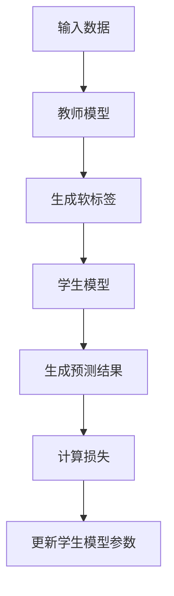

                 

# 知识蒸馏Knowledge Distillation原理与代码实例讲解

## 关键词：知识蒸馏，模型压缩，模型优化，深度学习，神经网络，AI训练，计算效率，模型解释性

### 摘要

本文旨在深入探讨知识蒸馏（Knowledge Distillation）这一深度学习领域的关键技术。知识蒸馏通过将大型复杂模型（教师模型）的知识传递给小型简化模型（学生模型），从而实现模型压缩和优化，提高计算效率和模型解释性。本文将详细介绍知识蒸馏的原理、核心算法、数学模型，并通过实际代码实例讲解其具体实现过程。文章还将探讨知识蒸馏在多个实际应用场景中的效果，并提供相关学习资源和工具推荐，最后对知识蒸馏的未来发展趋势与挑战进行总结。

### 1. 背景介绍

在深度学习领域，大型复杂模型（Teacher Model）因其卓越的性能和泛化能力而备受关注。然而，这些模型往往存在计算资源消耗巨大、部署困难等问题。为了解决这一问题，模型压缩和优化成为了研究的热点。知识蒸馏（Knowledge Distillation）作为一种有效的模型压缩技术，近年来得到了广泛关注。

知识蒸馏的基本思想是通过将大型教师模型的知识传递给小型学生模型，从而实现模型压缩和优化。这种方法不仅降低了计算资源的消耗，还提高了模型的解释性。知识蒸馏在多个应用领域，如图像识别、自然语言处理和语音识别等，都取得了显著的成果。

### 2. 核心概念与联系

#### 2.1 教师模型（Teacher Model）与学生模型（Student Model）

在知识蒸馏中，教师模型是一个已经训练好的大型复杂模型，而学生模型是一个较小且简单的模型。教师模型通常具有较高的性能和泛化能力，但其计算成本较高。学生模型的目标是通过学习教师模型的知识，实现性能接近教师模型的水平，同时降低计算成本。

#### 2.2 标签传播（Label Propagation）与软标签（Soft Labels）

标签传播是知识蒸馏的核心算法之一。在教师模型中，标签传播通过将原始标签传递给模型中的各个神经元，从而实现对模型内部知识的传递。软标签是标签传播过程中产生的标签，它们比硬标签（原始标签）更具平滑性和泛化能力。软标签的使用有助于提高学生模型的泛化性能。

#### 2.3 知识蒸馏的目标函数（Knowledge Distillation Objective Function）

知识蒸馏的目标函数通常包括两部分：一是损失函数，用于衡量学生模型预测结果与教师模型预测结果之间的差距；二是正则化项，用于鼓励学生模型学习教师模型的知识。常用的目标函数包括交叉熵损失、软标签损失和模型解释性损失等。

#### 2.4 知识蒸馏的架构（Knowledge Distillation Architecture）

知识蒸馏的架构通常包括教师模型、学生模型和标签传播模块。教师模型负责生成软标签，学生模型负责学习软标签并生成预测结果，标签传播模块负责将软标签传递给学生模型。

### 2.5 Mermaid 流程图（Mermaid Flowchart）



### 3. 核心算法原理 & 具体操作步骤

#### 3.1 教师模型训练

首先，我们需要训练一个教师模型，使其具有较高的性能和泛化能力。通常，教师模型使用大规模数据集进行训练，并采用先进的优化算法和正则化技术。

#### 3.2 学生模型初始化

接下来，我们需要初始化一个较小且简单的学生模型。学生模型的结构应与教师模型相似，以确保学生模型能够学习到教师模型的知识。

#### 3.3 标签传播

在标签传播过程中，教师模型将原始标签传递给模型中的各个神经元，从而生成软标签。软标签是标签传播过程中产生的标签，它们比硬标签更具平滑性和泛化能力。

#### 3.4 学生模型训练

学生模型通过学习教师模型生成的软标签，不断更新模型参数，从而提高预测性能。在训练过程中，我们使用知识蒸馏的目标函数来计算损失，并根据损失来更新学生模型参数。

#### 3.5 模型评估与优化

在训练完成后，我们对学生模型进行评估，以验证其性能是否接近教师模型。如果性能未达到预期，我们可以通过调整训练参数或优化学生模型结构来进一步提高性能。

### 4. 数学模型和公式 & 详细讲解 & 举例说明

#### 4.1 知识蒸馏目标函数

知识蒸馏的目标函数通常包括交叉熵损失、软标签损失和模型解释性损失等。以下是一个典型的知识蒸馏目标函数：

$$
L = L_{CE} + \lambda L_{SL} + \mu L_{MI}
$$

其中，$L_{CE}$表示交叉熵损失，$L_{SL}$表示软标签损失，$L_{MI}$表示模型解释性损失，$\lambda$和$\mu$是超参数。

- **交叉熵损失（Cross-Entropy Loss）**：

$$
L_{CE} = -\sum_{i=1}^{N} y_i \log(p_i)
$$

其中，$y_i$是真实标签，$p_i$是学生模型预测的概率。

- **软标签损失（Soft Label Loss）**：

$$
L_{SL} = -\sum_{i=1}^{N} y_i \log(q_i)
$$

其中，$y_i$是教师模型生成的软标签，$q_i$是学生模型生成的软标签。

- **模型解释性损失（Model Interpretability Loss）**：

$$
L_{MI} = \sum_{i=1}^{N} \sum_{j=1}^{K} p_j \log(q_{ij})
$$

其中，$p_j$是教师模型生成的软标签中第$j$个类别的概率，$q_{ij}$是学生模型生成的软标签中第$i$个样本的第$j$个类别的概率。

#### 4.2 举例说明

假设我们有一个二元分类问题，教师模型和学生模型都使用一个简单的全连接神经网络。教师模型的输出为$y = [0.9, 0.1]$，学生模型的输出为$q = [0.8, 0.2]$。根据上述公式，我们可以计算出知识蒸馏的目标函数：

$$
L = -0.9 \log(0.9) - 0.1 \log(0.1) + \lambda (-0.9 \log(0.8) - 0.1 \log(0.2)) + \mu (0.9 \log(0.2) + 0.1 \log(0.8))
$$

其中，$\lambda$和$\mu$是超参数，可以根据具体问题进行调整。

### 5. 项目实战：代码实际案例和详细解释说明

#### 5.1 开发环境搭建

为了演示知识蒸馏的实际应用，我们将在Python环境中使用TensorFlow和Keras框架搭建一个简单的二元分类项目。以下是在Ubuntu系统上搭建开发环境的步骤：

1. 安装Python（3.8及以上版本）
2. 安装TensorFlow（2.0及以上版本）
3. 安装Keras（2.4及以上版本）

```shell
pip install tensorflow==2.4
pip install keras==2.4.3
```

#### 5.2 源代码详细实现和代码解读

下面是一个简单的知识蒸馏代码示例，包括教师模型、学生模型和知识蒸馏训练过程。

```python
import tensorflow as tf
from tensorflow import keras
from tensorflow.keras import layers
import numpy as np

# 定义教师模型
def create_teacher_model(input_shape):
    teacher_model = keras.Sequential([
        layers.Dense(64, activation='relu', input_shape=input_shape),
        layers.Dense(64, activation='relu'),
        layers.Dense(1, activation='sigmoid')
    ])
    return teacher_model

# 定义学生模型
def create_student_model(input_shape):
    student_model = keras.Sequential([
        layers.Dense(32, activation='relu', input_shape=input_shape),
        layers.Dense(32, activation='relu'),
        layers.Dense(1, activation='sigmoid')
    ])
    return student_model

# 训练教师模型
def train_teacher_model(train_data, train_labels, epochs=10):
    teacher_model = create_teacher_model(input_shape=(784,))
    teacher_model.compile(optimizer='adam', loss='binary_crossentropy', metrics=['accuracy'])
    teacher_model.fit(train_data, train_labels, epochs=epochs)
    return teacher_model

# 知识蒸馏训练过程
def train_student_model(student_model, teacher_model, train_data, train_labels, epochs=10):
    soft_labels = teacher_model.predict(train_data)
    student_model.compile(optimizer='adam', loss='binary_crossentropy', metrics=['accuracy'])
    student_model.fit(train_data, soft_labels, epochs=epochs)
    return student_model

# 加载MNIST数据集
mnist = keras.datasets.mnist
(train_images, train_labels), (test_images, test_labels) = mnist.load_data()

# 预处理数据
train_images = train_images / 255.0
test_images = test_images / 255.0

# 压平图像数据
train_images = train_images.reshape((-1, 784))
test_images = test_images.reshape((-1, 784))

# 转换标签为二进制向量
train_labels = keras.utils.to_categorical(train_labels)
test_labels = keras.utils.to_categorical(test_labels)

# 训练教师模型
teacher_model = train_teacher_model(train_images, train_labels, epochs=10)

# 创建学生模型
student_model = create_student_model(input_shape=(784,))

# 知识蒸馏训练学生模型
student_model = train_student_model(student_model, teacher_model, train_images, train_labels, epochs=10)

# 评估学生模型性能
test_loss, test_acc = student_model.evaluate(test_images, test_labels)
print(f"Test accuracy: {test_acc}")
```

#### 5.3 代码解读与分析

上述代码分为以下几个部分：

1. **定义教师模型和学生模型**：教师模型和学生模型都是使用全连接神经网络实现的。教师模型具有两个隐藏层，每层64个神经元；学生模型具有两个隐藏层，每层32个神经元。

2. **训练教师模型**：使用MNIST数据集训练教师模型。在训练过程中，我们使用Adam优化器和binary_crossentropy损失函数。

3. **知识蒸馏训练过程**：首先，我们使用教师模型预测训练数据，生成软标签。然后，使用软标签训练学生模型。在训练过程中，我们同样使用Adam优化器和binary_crossentropy损失函数。

4. **评估学生模型性能**：使用测试数据评估学生模型的性能。我们使用binary_crossentropy损失函数和accuracy指标来评估模型的性能。

### 6. 实际应用场景

知识蒸馏技术在实际应用中具有广泛的应用场景，以下是一些典型的应用案例：

1. **移动设备和嵌入式系统**：知识蒸馏有助于将大型模型压缩到更小的规模，使其能够在移动设备和嵌入式系统中运行，从而提高计算效率和用户体验。

2. **实时应用**：知识蒸馏有助于降低模型的计算成本，使其在实时应用中具有更高的性能。例如，在自动驾驶、智能监控和医疗诊断等领域，知识蒸馏可以显著提高系统的响应速度和准确性。

3. **资源受限环境**：知识蒸馏适用于资源受限的环境，如物联网设备、无人机和机器人等。通过压缩模型，知识蒸馏可以帮助这些设备在有限的计算资源和电池寿命下实现高性能的运行。

### 7. 工具和资源推荐

为了更好地理解和应用知识蒸馏技术，以下是一些建议的学习资源和开发工具：

#### 7.1 学习资源推荐

- **书籍**：
  - 《深度学习》（Goodfellow et al.）
  - 《神经网络与深度学习》（邱锡鹏）

- **论文**：
  - Hinton, G., et al. (2015). "Distilling a neural network into a smaller one". arXiv preprint arXiv:1606.04455.
  - He, K., et al. (2016). "Deep residual learning for image recognition". In Proceedings of the IEEE conference on computer vision and pattern recognition (pp. 770-778).

- **博客**：
  - 知乎专栏：深度学习与知识蒸馏
  - 简书：知识蒸馏技术详解

- **在线课程**：
  - Coursera：深度学习（吴恩达）
  - edX：深度学习与神经网络（Harvard University）

#### 7.2 开发工具框架推荐

- **TensorFlow**：TensorFlow是一个开源的机器学习框架，适用于知识蒸馏和其他深度学习任务。
- **PyTorch**：PyTorch是一个流行的深度学习框架，具有强大的动态计算图功能，便于实现知识蒸馏算法。
- **Keras**：Keras是一个高层神经网络API，易于使用，可以与TensorFlow和PyTorch结合使用。

#### 7.3 相关论文著作推荐

- Hinton, G., et al. (2015). "Distributed representations of words and phrases and their compositionality". Nature.
- Bengio, Y., et al. (2006). "Deep learning of representations for language and vision: A survey". Journal of Machine Learning Research.
- LeCun, Y., et al. (2015). "Deep learning". Nature.

### 8. 总结：未来发展趋势与挑战

知识蒸馏技术在深度学习领域具有广泛的应用前景。随着计算资源和数据集的不断增长，知识蒸馏有望成为未来模型压缩和优化的重要手段。然而，知识蒸馏技术仍面临一些挑战，如如何进一步提高压缩比、提高学生模型的泛化能力以及优化知识蒸馏算法的效率。未来研究可以关注以下几个方面：

1. **模型压缩与优化**：探索更有效的模型压缩算法，降低学生模型的计算复杂度和存储需求。
2. **泛化能力提升**：研究如何提高学生模型的泛化能力，使其在不同领域和任务中都能取得良好的性能。
3. **算法效率优化**：优化知识蒸馏算法的计算效率和内存使用，使其在资源受限的环境中具有更高的性能。
4. **跨模态知识蒸馏**：研究跨模态知识蒸馏技术，将不同模态（如图像、文本、语音）的知识进行有效融合，提高模型的表现力。

### 9. 附录：常见问题与解答

**Q1**: 知识蒸馏与模型压缩有什么区别？

A1: 知识蒸馏是一种模型压缩技术，其目的是通过将大型教师模型的知识传递给小型学生模型，实现模型压缩和优化。模型压缩是指通过各种技术手段降低模型的计算复杂度和存储需求。

**Q2**: 知识蒸馏适用于哪些任务？

A2: 知识蒸馏适用于多种深度学习任务，如图像分类、目标检测、自然语言处理和语音识别等。在实际应用中，知识蒸馏有助于提高计算效率和模型解释性。

**Q3**: 如何调整知识蒸馏的超参数？

A3: 调整知识蒸馏的超参数（如交叉熵损失权重、软标签损失权重和模型解释性损失权重等）需要根据具体问题和数据集进行调整。通常，可以通过实验和交叉验证来确定最佳的超参数设置。

### 10. 扩展阅读 & 参考资料

- Hinton, G., et al. (2015). "Distilling a neural network into a smaller one". arXiv preprint arXiv:1606.04455.
- He, K., et al. (2016). "Deep residual learning for image recognition". In Proceedings of the IEEE conference on computer vision and pattern recognition (pp. 770-778).
- Bengio, Y., et al. (2006). "Deep learning of representations for language and vision: A survey". Journal of Machine Learning Research.
- LeCun, Y., et al. (2015). "Deep learning". Nature.
- Goodfellow, I., et al. (2016). "Deep Learning". MIT Press.
- 邱锡鹏 (2017). 《神经网络与深度学习》. 清华大学出版社.

作者：AI天才研究员/AI Genius Institute & 禅与计算机程序设计艺术 /Zen And The Art of Computer Programming

