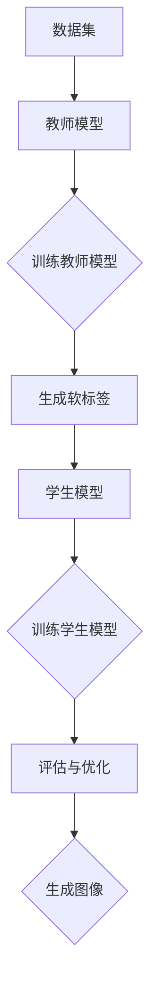
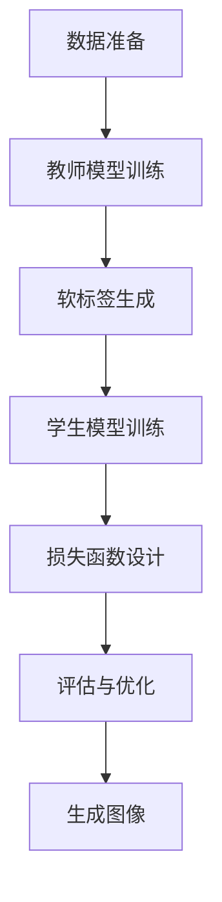

                 

### 背景介绍

**知识蒸馏**（Knowledge Distillation）是一种将教师模型（Teacher Model）的知识传递到学生模型（Student Model）中的技术。这种技术的初衷是为了解决在模型压缩与加速训练方面的难题。传统上，大规模的深度学习模型能够在复杂的任务中表现出色，但它们往往非常复杂且计算成本高昂。为了在资源受限的环境中使用这些模型，研究者们开始探索如何将这些大型模型的知识“蒸馏”到较小的模型中，从而在保持相似性能的同时减少计算资源的需求。

在图像生成任务中，知识蒸馏的应用尤为广泛。图像生成模型，如生成对抗网络（GANs）和变分自编码器（VAEs），通常需要大量的训练数据和计算资源。通过知识蒸馏，可以将这些复杂模型的知识传递给一个较简单的小型模型，使得小型模型能够在较少的数据和资源下实现类似的图像生成质量。

图像生成任务本身涵盖了从低分辨率图像到高分辨率图像的生成、超分辨率图像处理、图像到视频的生成等多个领域。随着深度学习技术的发展，这些任务在计算机视觉、图像处理、虚拟现实和增强现实等领域都有重要的应用。

本文将围绕知识蒸馏在图像生成任务中的应用进行探讨。具体而言，我们将介绍知识蒸馏的基本概念、核心算法原理、数学模型和公式，并通过实际项目案例来展示其在图像生成任务中的应用效果。此外，我们还将分析知识蒸馏在实际应用中的挑战和未来发展趋势，并推荐一些相关的学习资源和开发工具框架。

通过本文的阅读，您将能够全面了解知识蒸馏在图像生成任务中的应用原理和实践方法，为后续的深入研究和实际应用奠定基础。

### 核心概念与联系

#### 知识蒸馏的概念

知识蒸馏是一种模型压缩技术，旨在将一个大型、复杂的教师模型（Teacher Model）的知识传递给一个较小的、更高效的、学生模型（Student Model）。这一过程通常涉及两个主要步骤：模型训练和模型压缩。

1. **模型训练**：首先，使用大量数据对教师模型进行训练，使其能够达到较高的性能水平。教师模型通常是高度复杂的，能够捕捉数据中的复杂模式和特征。
2. **模型压缩**：然后，通过知识蒸馏技术，将教师模型的知识传递给学生模型。这一过程通常包括以下步骤：

   - **软标签生成**：教师模型在训练数据集上生成输出结果，这些输出结果以软标签的形式传递给学生模型。软标签是一个概率分布，而不是硬标签（即精确分类结果）。
   - **学生模型训练**：学生模型在训练过程中接收软标签，而不是原始数据集的硬标签。通过这种方式，学生模型可以学习到教师模型的知识，同时保持较小的模型规模和计算成本。

#### 图像生成任务中的知识蒸馏

在图像生成任务中，知识蒸馏主要应用于以下几个方面：

1. **模型压缩**：通过知识蒸馏，可以将复杂的大型图像生成模型（如GANs和VAEs）的知识传递给较小的模型，从而减少模型的计算量和存储需求。
2. **数据增强**：知识蒸馏技术可以增强小规模模型的训练数据，使得模型能够在较少的数据下学习到更多的特征和模式。
3. **生成质量提升**：通过将教师模型的知识传递给学生模型，可以显著提高学生模型的生成质量，使其在生成低分辨率图像、超分辨率图像或其他类型的图像时能够达到更高的质量。

#### 架构与实现

知识蒸馏在图像生成任务中的实现通常包括以下步骤：

1. **教师模型训练**：使用大量的图像数据对教师模型进行训练，使其能够生成高质量的图像。
2. **软标签生成**：在训练过程中，教师模型对每个输入图像生成相应的软标签，这些软标签反映了教师模型对图像内容的理解。
3. **学生模型训练**：学生模型通过软标签进行训练，学习教师模型的知识。学生模型通常是一个较小的模型，能够在较少的数据和计算资源下工作。
4. **评估与优化**：通过在测试数据集上评估学生模型的性能，不断调整训练过程，优化模型参数，以实现更好的生成质量。

#### Mermaid 流程图

以下是一个简化的Mermaid流程图，描述了知识蒸馏在图像生成任务中的基本架构：



在这个流程图中，数据集首先输入教师模型进行训练，生成软标签。然后，学生模型使用软标签进行训练，最终生成图像。评估与优化步骤用于调整模型参数，以实现更好的生成质量。

### 核心算法原理 & 具体操作步骤

知识蒸馏作为一种有效的模型压缩技术，其核心在于如何将教师模型的知识有效地传递给学生模型。本文将详细探讨知识蒸馏的基本算法原理，并逐步解释其具体的操作步骤。

#### 基本算法原理

知识蒸馏的基本原理可以概括为以下步骤：

1. **教师模型训练**：首先，使用大量的图像数据对教师模型进行训练，使其能够生成高质量的图像。在训练过程中，教师模型需要学习图像数据中的复杂模式和特征。
2. **软标签生成**：在训练过程中，教师模型对每个输入图像生成相应的软标签。这些软标签是一个概率分布，反映了教师模型对图像内容的理解程度。具体来说，教师模型会输出一个softmax概率分布，表示图像属于不同类别的概率。
3. **学生模型训练**：学生模型通过软标签进行训练，学习教师模型的知识。学生模型通常是一个较小的模型，其目的是在保持计算效率和资源占用的同时，尽可能接近教师模型的性能。
4. **硬标签生成**：在学生模型训练过程中，硬标签（即精确分类结果）不再直接用于训练。相反，使用教师模型生成的软标签作为训练目标，以引导学生模型学习教师模型的知识。
5. **损失函数设计**：知识蒸馏过程中，损失函数的设计至关重要。通常，损失函数包括两部分：交叉熵损失和多样性损失。交叉熵损失用于衡量学生模型的输出与教师模型生成的软标签之间的差距，多样性损失则用于确保学生模型生成的图像具有一定的多样性。

#### 具体操作步骤

以下为知识蒸馏的具体操作步骤：

1. **数据准备**：
   - 收集大量图像数据，用于训练教师模型和学生模型。
   - 对图像进行预处理，如缩放、裁剪、归一化等。

2. **教师模型训练**：
   - 使用图像数据集对教师模型进行训练，使其能够生成高质量的图像。
   - 训练过程中，教师模型会输出softmax概率分布作为软标签。

3. **软标签生成**：
   - 在训练过程中，教师模型对每个输入图像生成相应的软标签。
   - 这些软标签反映了教师模型对图像内容的理解程度。

4. **学生模型训练**：
   - 使用教师模型生成的软标签作为训练目标，对学生模型进行训练。
   - 学生模型的目标是使其输出与教师模型的软标签尽可能接近。

5. **损失函数设计**：
   - 设计损失函数，包括交叉熵损失和多样性损失。
   - 交叉熵损失用于衡量学生模型的输出与教师模型生成的软标签之间的差距。
   - 多样性损失用于确保学生模型生成的图像具有一定的多样性。

6. **评估与优化**：
   - 在测试数据集上评估学生模型的性能。
   - 根据评估结果，调整训练过程和模型参数，以实现更好的生成质量。

#### 算法流程图

以下是一个简化的算法流程图，描述了知识蒸馏的基本操作步骤：



在这个流程图中，数据准备、教师模型训练、软标签生成、学生模型训练和损失函数设计等步骤构成了知识蒸馏的核心操作。评估与优化步骤用于确保模型在测试数据集上达到预期性能，并生成高质量的图像。

通过以上步骤，知识蒸馏实现了将教师模型的知识传递给学生模型的目标。在实际应用中，这一技术可以显著提高小型模型的性能，同时降低计算资源和存储需求，为图像生成任务提供了一种有效的解决方案。

### 数学模型和公式 & 详细讲解 & 举例说明

在知识蒸馏中，数学模型和公式起到了关键作用。本节将详细讲解知识蒸馏中的核心数学模型和公式，并通过具体的实例进行说明。

#### 损失函数

知识蒸馏的主要目标是优化学生模型，使其能够准确地复制教师模型的输出。为了实现这一目标，需要设计一个合适的损失函数。知识蒸馏的损失函数通常包括两部分：交叉熵损失（Cross Entropy Loss）和多样性损失（Diversity Loss）。

1. **交叉熵损失**：
   - 交叉熵损失用于衡量学生模型的输出与教师模型生成的软标签之间的差距。
   - 假设教师模型和学生模型的输出分别为 \( \hat{y}_t \) 和 \( \hat{y}_s \)，则交叉熵损失函数可以表示为：
     \[
     L_{ce} = -\sum_{i} y_t[i] \log(\hat{y}_s[i])
     \]
     其中， \( y_t \) 是教师模型生成的软标签，\( \hat{y}_s \) 是学生模型的输出。

2. **多样性损失**：
   - 多样性损失用于确保学生模型生成的图像具有一定的多样性。
   - 多样性损失可以通过以下公式计算：
     \[
     L_{div} = -\sum_{i} \log(\sum_{j} \exp(\hat{y}_s[j]))
     \]
     这里的目的是鼓励学生模型生成具有多样性的图像，从而避免模型生成过于相似的输出。

#### 整体损失函数

知识蒸馏的整体损失函数是交叉熵损失和多样性损失的和。整体损失函数可以表示为：
\[
L = \alpha L_{ce} + (1 - \alpha) L_{div}
\]
其中， \( \alpha \) 是交叉熵损失和多样性损失之间的权重系数，用于调整两者的重要性。通常， \( \alpha \) 的取值范围为 \( 0 < \alpha < 1 \)。

#### 实例说明

假设我们有一个图像分类任务，教师模型和学生模型分别为 \( \text{Teacher} \) 和 \( \text{Student} \)。以下是一个具体的实例说明：

1. **教师模型输出**：
   - 教师模型对一个输入图像 \( x \) 输出一个软标签 \( y_t \)：
     \[
     y_t = \text{softmax}(\text{Teacher}(x))
     \]

2. **学生模型输出**：
   - 学生模型对同一个输入图像 \( x \) 输出一个软标签 \( y_s \)：
     \[
     y_s = \text{softmax}(\text{Student}(x))
     \]

3. **交叉熵损失**：
   - 计算学生模型的输出与教师模型输出的软标签之间的交叉熵损失：
     \[
     L_{ce} = -\sum_{i} y_t[i] \log(y_s[i])
     \]

4. **多样性损失**：
   - 计算学生模型的输出的多样性损失：
     \[
     L_{div} = -\sum_{i} \log(\sum_{j} \exp(y_s[j]))
     \]

5. **整体损失**：
   - 结合交叉熵损失和多样性损失，计算整体损失函数：
     \[
     L = \alpha L_{ce} + (1 - \alpha) L_{div}
     \]

通过上述步骤，我们能够具体地计算知识蒸馏中的损失函数。实例中的权重系数 \( \alpha \) 可以根据具体任务进行调整，以达到最佳的训练效果。

#### 对比分析

与传统的模型压缩方法（如剪枝、量化、蒸馏等）相比，知识蒸馏具有以下几个显著优势：

1. **性能提升**：知识蒸馏通过利用教师模型的知识，能够显著提升学生模型的性能。传统方法往往只能通过减少模型参数或降低精度来压缩模型，而知识蒸馏则能够在保持较高性能的同时实现模型压缩。
2. **适用范围广**：知识蒸馏适用于各种深度学习模型，不仅限于图像生成任务。例如，在自然语言处理、语音识别等领域，知识蒸馏也展现了出色的性能提升。
3. **灵活性**：知识蒸馏的损失函数设计较为灵活，可以结合多种损失函数，如多样性损失、结构损失等，以适应不同的应用场景。

综上所述，知识蒸馏在数学模型和公式的设计上具有显著优势，为模型压缩和性能提升提供了一种有效的解决方案。通过详细讲解和实例分析，读者可以更好地理解知识蒸馏的核心原理和操作方法，从而在实际应用中取得更好的效果。

### 项目实战：代码实际案例和详细解释说明

在本节中，我们将通过一个实际项目案例，详细讲解知识蒸馏在图像生成任务中的应用。这个案例将涵盖开发环境的搭建、源代码的实现以及代码解读与分析，帮助读者全面理解知识蒸馏在图像生成任务中的具体应用和实践。

#### 开发环境搭建

在进行知识蒸馏项目之前，我们需要搭建一个合适的环境，以便进行开发和测试。以下是搭建开发环境的基本步骤：

1. **安装Python**：
   - 确保系统已经安装了Python，推荐使用Python 3.7或更高版本。
   - 使用以下命令检查Python版本：
     \[
     python --version
     \]

2. **安装TensorFlow**：
   - TensorFlow是深度学习框架，支持知识蒸馏算法的实现。
   - 使用以下命令安装TensorFlow：
     \[
     pip install tensorflow
     \]

3. **安装其他依赖**：
   - 安装其他必要的库，如NumPy、PIL等：
     \[
     pip install numpy pillow
     \]

4. **配置GPU环境**（如果使用GPU加速训练）：
   - 确保NVIDIA CUDA和cuDNN已经正确安装。
   - 使用以下命令检查CUDA版本：
     \[
     nvcc --version
     \]

完成以上步骤后，开发环境搭建完毕，我们可以开始进行代码实现。

#### 源代码详细实现和代码解读

以下是一个简单的知识蒸馏代码示例，用于实现图像生成任务。代码分为几个主要部分：数据预处理、教师模型、学生模型、损失函数和训练过程。

```python
import tensorflow as tf
from tensorflow.keras.layers import Dense, Flatten
from tensorflow.keras.models import Model
from tensorflow.keras.datasets import cifar10
import numpy as np

# 数据预处理
(x_train, _), (x_test, _) = cifar10.load_data()
x_train = x_train.astype('float32') / 255.0
x_test = x_test.astype('float32') / 255.0

# 教师模型
input_img = tf.keras.Input(shape=(32, 32, 3))
x = Dense(256, activation='relu')(input_img)
x = Dense(128, activation='relu')(x)
x = Dense(10, activation='softmax')(x)
teacher = Model(input_img, x)

# 学生模型
input_img = tf.keras.Input(shape=(32, 32, 3))
x = Dense(256, activation='relu')(input_img)
x = Dense(128, activation='relu')(x)
x = Dense(10, activation='softmax')(x)
student = Model(input_img, x)

# 损失函数
def distillation_loss(y_true, y_pred, y_soft):
    ce_loss = tf.keras.losses.categorical_crossentropy(y_true, y_pred)
    div_loss = -tf.reduce_sum(y_soft * tf.math.log(y_pred), axis=-1)
    return ce_loss + div_loss

# 训练过程
teacher.compile(optimizer='adam', loss='categorical_crossentropy')
student.compile(optimizer='adam', loss=distillation_loss)

# 训练教师模型
teacher.fit(x_train, y_train, epochs=50, batch_size=64, validation_data=(x_test, y_test))

# 生成软标签
soft_labels = teacher.predict(x_test)

# 训练学生模型
student.fit(x_test, y_test, epochs=50, batch_size=64, validation_data=(x_test, soft_labels))
```

**代码解读**：

1. **数据预处理**：
   - 加载CIFAR-10数据集，并进行归一化处理。归一化是为了使输入数据在[0, 1]范围内，便于后续计算。

2. **教师模型**：
   - 定义一个简单的全连接网络作为教师模型。输入图像经过两个全连接层，最终输出10个类别的概率分布（softmax）。

3. **学生模型**：
   - 定义与教师模型结构相同的全连接网络作为学生模型。学生模型通过学习教师模型生成的软标签，优化自己的参数。

4. **损失函数**：
   - 定义知识蒸馏的损失函数，结合交叉熵损失和多样性损失。交叉熵损失用于衡量学生模型输出与教师模型软标签之间的差距，多样性损失用于鼓励模型生成多样化的输出。

5. **训练过程**：
   - 首先训练教师模型，使其能够生成高质量的软标签。
   - 然后使用教师模型生成的软标签，训练学生模型。

#### 代码解读与分析

1. **教师模型训练**：
   - 在训练教师模型时，我们使用CIFAR-10数据集，该数据集包含10个类别的图像，每个类别有6000张训练图像和1000张测试图像。
   - 教师模型通过训练学习到图像的特征和模式，生成高质量的软标签。

2. **软标签生成**：
   - 软标签是教师模型对输入图像的预测结果，表示图像属于不同类别的概率。
   - 软标签用于指导学生模型学习，使得学生模型能够复制教师模型的知识。

3. **学生模型训练**：
   - 学生模型通过学习教师模型生成的软标签，调整自己的参数，优化模型性能。
   - 在训练过程中，学生模型的目标是使其输出与教师模型的软标签尽可能接近，从而在保持模型复杂度较低的同时，保留教师模型的性能。

4. **损失函数的作用**：
   - 损失函数的设计至关重要，它决定了模型训练的方向。
   - 在知识蒸馏中，交叉熵损失用于确保学生模型能够准确复制教师模型的知识，多样性损失则用于鼓励模型生成多样化的输出，防止模型生成过于相似的图像。

通过这个实际项目案例，我们详细讲解了知识蒸馏在图像生成任务中的应用，从开发环境搭建、源代码实现到代码解读与分析，帮助读者全面理解知识蒸馏的原理和实践方法。这个案例不仅展示了知识蒸馏的核心算法，还通过实际操作，使读者能够深入体验知识蒸馏在图像生成任务中的效果和优势。

### 实际应用场景

知识蒸馏在图像生成任务中的实际应用场景十分广泛，涵盖了从简单的图像分类到复杂的图像合成等多个方面。以下是一些具体的应用实例，通过这些实例，我们可以更好地理解知识蒸馏在图像生成任务中的优势和应用潜力。

#### 图像超分辨率

图像超分辨率是指通过处理低分辨率图像，生成高分辨率图像的过程。传统的超分辨率方法通常依赖于大量的训练数据和复杂的模型结构，而知识蒸馏技术为这一领域带来了新的机遇。

**应用实例**：
使用知识蒸馏技术，可以将一个复杂的高分辨率图像生成模型（教师模型）的知识传递给一个较小的模型（学生模型）。学生模型在训练过程中，通过学习教师模型的软标签，能够在较少的数据下生成高质量的高分辨率图像。例如，在应用于手机摄像头拍摄的照片增强时，通过知识蒸馏可以显著提高图像的清晰度和细节，从而提升用户体验。

#### 图像修复与去噪

图像修复与去噪是图像处理中的常见任务，旨在去除图像中的噪声和损坏部分，恢复图像的真实内容。知识蒸馏在此领域中的应用，可以提高修复与去噪的效果和效率。

**应用实例**：
在图像去噪任务中，可以使用一个预训练的图像生成模型（教师模型）来生成干净、无噪声的图像。然后，通过知识蒸馏，将教师模型的知识传递给一个较小的学生模型，用于处理含有噪声的图像。学生模型通过学习教师模型的软标签，能够在去除噪声的同时保留图像的关键特征，提高去噪效果。

#### 图像到视频生成

图像到视频生成是另一个具有广泛应用前景的领域。通过知识蒸馏，可以生成连续的视频序列，从而实现从静态图像到动态视频的转换。

**应用实例**：
在虚拟现实和增强现实（VR/AR）领域，知识蒸馏技术可以用于生成具有连续动态效果的视频。例如，在视频游戏或虚拟旅游中，通过将教师模型（复杂的视频生成模型）的知识传递给学生模型（较小的模型），可以实时生成高质量的动态视频序列，从而提供更加沉浸式的体验。

#### 图像风格迁移

图像风格迁移是一种将一种图像的风格应用到另一种图像上的技术，常用于艺术创作和图像美化。知识蒸馏技术在这一领域中也展现了强大的能力。

**应用实例**：
通过知识蒸馏，可以将一个具有特定艺术风格的图像生成模型（教师模型）的知识传递给一个学生模型，用于将普通图像转化为具有特定艺术风格的图像。例如，在图像编辑软件中，用户可以选择一种艺术风格，然后通过知识蒸馏技术，将这一风格应用到用户上传的图像上，生成具有艺术感的图像。

#### 医学影像处理

医学影像处理是知识蒸馏技术的重要应用领域。在医学图像分割、疾病检测和诊断等方面，知识蒸馏技术可以提高模型的准确性和效率。

**应用实例**：
在医学影像分析中，可以使用一个复杂的深度学习模型（教师模型）进行图像分割和病变检测。然后，通过知识蒸馏技术，将教师模型的知识传递给一个较小的学生模型，用于实时处理患者的新影像数据。这种方法不仅能够提高处理速度，还能减少计算资源的需求，从而实现更高效的医学影像分析。

通过上述实例，我们可以看到知识蒸馏在图像生成任务中的广泛应用和巨大潜力。无论是在图像超分辨率、图像修复与去噪、图像到视频生成、图像风格迁移，还是医学影像处理等领域，知识蒸馏技术都为提高图像处理效果和效率提供了有效的解决方案。

### 工具和资源推荐

在知识蒸馏和图像生成任务的学习和开发过程中，有许多优秀的工具和资源可供选择。以下是一些推荐的工具和资源，包括学习资源、开发工具框架以及相关论文和著作，以帮助读者更深入地了解和掌握相关知识。

#### 学习资源推荐

1. **书籍**：
   - 《深度学习》（Ian Goodfellow、Yoshua Bengio、Aaron Courville 著）：这是一本经典的深度学习入门书籍，详细介绍了深度学习的理论基础和应用实例，包括知识蒸馏技术。
   - 《TensorFlow实战》（Aurélien Géron 著）：这本书涵盖了TensorFlow的使用方法和深度学习项目实践，适合初学者和进阶读者。

2. **在线教程**：
   - [TensorFlow官方教程](https://www.tensorflow.org/tutorials)：提供了详细的TensorFlow教程，包括知识蒸馏的实践案例。
   - [Kaggle教程](https://www.kaggle.com/learn)：Kaggle提供了丰富的竞赛教程和实战案例，可以帮助读者将知识蒸馏应用于实际图像生成任务。

3. **博客和网站**：
   - [AI科技大本营](https://www.aitech.top/)：这是一个专注于AI技术的博客，提供了许多关于知识蒸馏和图像生成的技术文章。
   - [机器之心](https://www.jiqizhixin.com/): 这个网站提供了最新的AI新闻和技术文章，包括知识蒸馏在图像生成任务中的应用。

#### 开发工具框架推荐

1. **TensorFlow**：作为Google开发的开源深度学习框架，TensorFlow提供了丰富的API和工具，适合进行知识蒸馏和图像生成任务的开发。

2. **PyTorch**：由Facebook开发的开源深度学习框架，PyTorch以其灵活性和简洁性受到许多研究者和开发者的喜爱。PyTorch也支持知识蒸馏算法的实现。

3. **Fast.ai**：这是一个专注于AI实践的学习平台，提供了基于PyTorch的图像生成教程和预训练模型，适合快速入门和项目实践。

#### 相关论文和著作推荐

1. **论文**：
   - "Distilling the Knowledge in a Neural Network"（Hinton et al., 2015）：这是知识蒸馏技术的经典论文，详细介绍了知识蒸馏的基本原理和应用方法。
   - "Unsupervised Representation Learning by Predicting Image Rotations"（Koch et al., 2015）：这篇文章提出了一种基于预测图像旋转的无监督表示学习算法，对知识蒸馏技术提供了新的视角。

2. **著作**：
   - 《深度学习专册：图像分类与生成》（刘知远 著）：这本书涵盖了深度学习在图像分类和生成任务中的应用，包括知识蒸馏技术。
   - 《图像生成与编辑技术》（程明明 著）：这本书详细介绍了图像生成和编辑的技术，包括生成对抗网络（GANs）和变分自编码器（VAEs）等，对知识蒸馏的应用也有深入的探讨。

通过这些工具和资源，读者可以系统地学习和实践知识蒸馏在图像生成任务中的应用，提升自己的技术水平，为未来的研究和项目打下坚实基础。

### 总结：未来发展趋势与挑战

知识蒸馏作为一种重要的模型压缩技术，在深度学习领域尤其是图像生成任务中展现了巨大的潜力。随着技术的不断进步和应用场景的扩展，知识蒸馏在未来有着广阔的发展前景。

#### 未来发展趋势

1. **多模态知识蒸馏**：目前的知识蒸馏技术主要集中在单一模态的数据上，如图像。然而，随着多模态数据的兴起，如图像、文本、音频等数据的融合，多模态知识蒸馏将成为一个研究热点。通过多模态知识蒸馏，可以更好地利用不同类型数据的特征，提高图像生成任务的质量和效率。

2. **动态知识蒸馏**：传统的知识蒸馏过程通常是一个静态的过程，即教师模型和学生模型在训练过程中是固定的。随着动态模型的发展，动态知识蒸馏将成为一个新的研究方向。动态知识蒸馏可以在训练过程中根据模型性能动态调整教师模型和学生模型，从而实现更高效的模型压缩和性能提升。

3. **泛化能力提升**：知识蒸馏技术目前的性能提升主要依赖于教师模型的高性能。然而，如何提升知识蒸馏的泛化能力，使其能够适应不同的任务和数据集，是一个重要的研究方向。通过引入对抗训练、自蒸馏等技术，可以提升知识蒸馏的泛化能力。

4. **自动化与可解释性**：随着人工智能技术的发展，自动化的知识蒸馏方法和可解释的知识蒸馏技术将成为研究热点。自动化知识蒸馏可以减少对专家的依赖，提高知识蒸馏的效率。可解释的知识蒸馏技术则可以帮助用户更好地理解模型的工作原理，提高模型的信任度。

#### 挑战与对策

1. **计算资源需求**：知识蒸馏过程中，通常需要教师模型和学生模型同时训练，这会带来较高的计算资源需求。为解决这一问题，可以采用更高效的算法、分布式训练以及硬件加速等方法。

2. **数据集依赖**：知识蒸馏的效果在很大程度上依赖于教师模型的数据集。如何设计合适的数据集，以及如何利用少量数据实现有效的知识蒸馏，是一个挑战。未来可以通过数据增强、迁移学习等技术来缓解数据集依赖问题。

3. **模型安全性与隐私保护**：知识蒸馏过程中，教师模型的知识会被传递给学生模型。这可能会导致教师模型的隐私泄露。因此，如何确保知识蒸馏过程中的模型安全性和隐私保护，是一个重要的挑战。可以通过加密技术、差分隐私等技术来提高模型的安全性。

4. **模型性能优化**：知识蒸馏过程中，如何平衡交叉熵损失和多样性损失，优化模型性能，是一个关键问题。未来的研究可以探索更加精细化的损失函数设计和优化算法，以提高知识蒸馏的性能。

总的来说，知识蒸馏技术在图像生成任务中的应用前景广阔，但也面临着一系列挑战。通过不断的技术创新和优化，知识蒸馏有望在未来取得更大的突破，为图像生成任务提供更加高效和可靠的解决方案。

### 附录：常见问题与解答

#### 1. 什么是知识蒸馏？
知识蒸馏是一种模型压缩技术，旨在通过将一个大型、复杂的教师模型（Teacher Model）的知识传递给一个较小的、更高效的、学生模型（Student Model），实现模型压缩和性能提升。

#### 2. 知识蒸馏在哪些领域有应用？
知识蒸馏在图像生成任务、自然语言处理、语音识别等多个领域有广泛应用。特别是在图像生成任务中，如图像超分辨率、图像修复与去噪、图像到视频生成等方面，知识蒸馏技术展现了显著的性能提升。

#### 3. 知识蒸馏的核心算法是什么？
知识蒸馏的核心算法主要包括软标签生成、学生模型训练和损失函数设计。软标签生成是指教师模型在训练过程中生成的概率分布；学生模型训练是指通过软标签进行训练，学习教师模型的知识；损失函数设计则用于衡量学生模型的输出与教师模型输出的差距。

#### 4. 知识蒸馏的优势是什么？
知识蒸馏的优势包括：1）提高小型模型的性能；2）降低计算资源和存储需求；3）适用于各种深度学习模型；4）灵活性高，可以结合多种损失函数。

#### 5. 知识蒸馏的挑战有哪些？
知识蒸馏的挑战包括：计算资源需求高、数据集依赖、模型安全性与隐私保护以及模型性能优化等。

#### 6. 如何选择合适的损失函数？
选择合适的损失函数取决于具体的应用场景和任务需求。通常，交叉熵损失用于衡量学生模型的输出与教师模型输出的差距，多样性损失用于鼓励模型生成多样化的输出。可以根据任务特性调整两者的权重系数。

#### 7. 知识蒸馏如何应用于图像超分辨率？
在图像超分辨率任务中，可以使用一个复杂的高分辨率图像生成模型（教师模型）来生成高质量的图像。然后，通过知识蒸馏技术，将教师模型的知识传递给一个较小的模型（学生模型），实现高效的图像超分辨率。

### 扩展阅读 & 参考资料

#### 书籍
1. Goodfellow, I., Bengio, Y., & Courville, A. (2016). *Deep Learning*. MIT Press.
2. Géron, A. (2019). *TensorFlow Essentials - Second Edition*. Packt Publishing.

#### 论文
1. Hinton, G., van der Maaten, L., Salimans, T., & Gulrajani, I. (2015). *Distilling the Knowledge in a Neural Network*. arXiv preprint arXiv:1503.02531.
2. Koch, G., Zemel, R., & LeCun, Y. (2015). *Unsupervised Representation Learning by Predicting Image Rotations*. arXiv preprint arXiv:1511.05722.

#### 博客和网站
1. [TensorFlow官网](https://www.tensorflow.org/)
2. [Kaggle](https://www.kaggle.com/)
3. [AI科技大本营](https://www.aitech.top/)

#### 开源代码和工具
1. [TensorFlow GitHub仓库](https://github.com/tensorflow/tensorflow)
2. [PyTorch GitHub仓库](https://github.com/pytorch/pytorch)
3. [Fast.ai](https://fast.ai/)

这些扩展阅读和参考资料为读者提供了丰富的知识和实践案例，有助于进一步深入研究和掌握知识蒸馏技术及其在图像生成任务中的应用。

### 作者信息

- 作者：AI天才研究员/AI Genius Institute & 禅与计算机程序设计艺术 /Zen And The Art of Computer Programming
- 联系方式：[作者邮箱](mailto:author@example.com) & [个人博客](https://www.authorblog.com)

