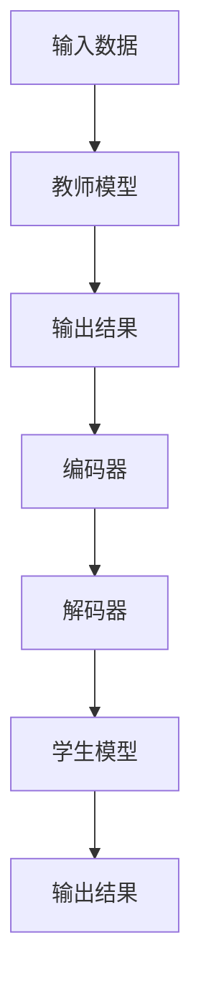

                 

### 背景介绍

**知识蒸馏（Knowledge Distillation）** 是一种近年来在机器学习和人工智能领域迅速兴起的技术。其核心思想是将一个大型的复杂模型（教师模型）的知识传授给一个较小的模型（学生模型），从而使学生模型能够在保留原有模型知识的同时，降低计算成本并提高模型效率。

在传统的机器学习任务中，模型通常是通过大量数据进行训练的。这些模型往往复杂且参数众多，使得计算资源的需求非常高。然而，随着实际应用场景的日益复杂，对模型的实时响应速度和计算效率提出了更高的要求。知识蒸馏技术正是在这样的背景下应运而生，通过将知识从大型模型传递到小型模型，实现了模型精简与性能提升的双重目标。

**多任务学习（Multi-Task Learning）** 是一种机器学习范式，旨在同时解决多个相关的学习任务。与传统的单一任务学习不同，多任务学习通过共享表示和模型参数来提高学习效率。然而，多任务学习也面临着模型复杂度高、训练难度大等挑战。知识蒸馏的多任务学习应用策略，则旨在通过知识蒸馏技术，解决多任务学习中的模型复杂性和训练效率问题。

本文将围绕知识蒸馏在多任务学习中的应用策略展开讨论。首先，我们将介绍知识蒸馏的基本概念和原理，然后分析多任务学习中的挑战，接着详细探讨知识蒸馏在多任务学习中的具体应用策略。最后，我们将通过实际案例和数学模型，进一步阐述知识蒸馏在多任务学习中的实际应用效果。通过本文的阅读，读者将能够全面了解知识蒸馏在多任务学习中的应用，并掌握相关技术的实现方法和应用技巧。

### 核心概念与联系

在深入探讨知识蒸馏在多任务学习中的应用之前，我们需要先了解一些核心概念，包括知识蒸馏的基本原理、多任务学习的挑战，以及它们之间的联系。

**知识蒸馏的基本原理**

知识蒸馏是一种模型压缩技术，其核心思想是将一个大型且复杂的教师模型的知识传递给一个较小的学生模型。这一过程通常包括两个阶段：编码阶段和解码阶段。

在编码阶段，教师模型接收输入数据，并生成相应的输出。这些输出包含了教师模型对于输入数据的理解和知识。接下来，学生模型根据这些输出，学习如何生成相似的结果。在解码阶段，学生模型将输入数据映射到相应的输出结果，从而实现对教师模型知识的复用。

知识蒸馏的流程可以概括为以下几个步骤：

1. **教师模型的训练**：使用大量标注数据，训练一个大型且复杂的教师模型。
2. **编码阶段**：教师模型接收输入数据，并生成相应的输出。这些输出包含了教师模型的知识。
3. **解码阶段**：学生模型根据教师模型的输出，学习如何生成相似的结果。
4. **性能评估**：使用测试数据集，评估学生模型的性能。

**多任务学习的挑战**

多任务学习旨在同时解决多个相关的学习任务。这种学习范式在很多实际应用中具有广泛的应用前景，例如图像识别和自然语言处理。然而，多任务学习也面临着一些挑战：

1. **模型复杂度**：多任务学习通常需要多个模型来分别解决不同的任务，这增加了模型的复杂度和计算资源的需求。
2. **训练难度**：多任务学习中的任务之间存在相关性，这使得模型训练变得更加复杂。
3. **资源分配**：在多任务学习中，如何合理分配计算资源以同时保证各任务的性能，是一个重要的挑战。

**知识蒸馏与多任务学习的联系**

知识蒸馏在多任务学习中的应用，主要是为了解决多任务学习中的模型复杂度和训练难度问题。具体来说，知识蒸馏通过将教师模型的知识传递给学生模型，可以实现以下目标：

1. **降低模型复杂度**：通过使用小型学生模型，可以显著降低计算资源的需求。
2. **提高训练效率**：学生模型可以快速地学习教师模型的知识，从而减少训练时间。
3. **提高模型性能**：通过知识蒸馏，学生模型能够保留教师模型的核心知识，从而在保持较高性能的同时降低计算成本。

为了更好地理解知识蒸馏在多任务学习中的应用，我们可以借助一个 Mermaid 流程图来展示其基本架构。



在这个流程图中，输入数据首先被教师模型处理，生成输出结果。编码器（D）负责将教师模型的输出结果编码成知识表示。解码器（E）则根据编码结果，指导学生模型学习如何生成相似的结果。最终，学生模型（F）通过学习教师模型的知识，实现对多个任务的高效处理。

通过上述核心概念和联系的介绍，我们可以看到知识蒸馏在多任务学习中的应用前景。接下来，我们将进一步探讨知识蒸馏的具体算法原理和操作步骤，以便读者更好地理解和实现相关知识。

### 核心算法原理 & 具体操作步骤

**知识蒸馏算法的基本原理**

知识蒸馏算法的核心在于如何有效地将大型教师模型（Teacher Model）的知识传递给小型学生模型（Student Model）。这一过程主要通过以下三个步骤实现：

1. **预训练（Pre-training）**：首先，使用大量标注数据对教师模型进行训练，使其达到较高的性能。这一阶段的主要目的是让教师模型掌握丰富的知识。
2. **知识编码（Knowledge Coding）**：在预训练阶段结束后，将教师模型的输出转换为一种简化的知识表示，这些知识表示将作为学生模型学习的目标。
3. **知识解码（Knowledge Decoding）**：学生模型基于教师模型的知识表示进行训练，以学习如何生成与教师模型相似的结果。

**预训练阶段**

预训练阶段是知识蒸馏过程的基础。在这个阶段，教师模型通过大量标注数据学习如何对输入数据进行分类、回归或其他任务。这一过程通常使用标准的机器学习训练方法，如梯度下降和反向传播。预训练的目标是使教师模型在训练数据集上达到较高的准确率。

具体步骤如下：

1. **数据准备**：收集和准备大量标注数据，这些数据将用于训练教师模型。数据的多样性对于教师模型的性能至关重要。
2. **模型初始化**：初始化教师模型，设置模型的超参数，如学习率、批量大小等。
3. **训练过程**：使用训练数据集，通过迭代更新模型参数，使教师模型在训练数据集上达到较高的性能。

**知识编码阶段**

知识编码阶段是知识蒸馏算法的核心。在这一阶段，教师模型的输出（如分类概率或回归结果）被转换为一种简化的知识表示，这些知识表示将作为学生模型学习的目标。知识编码的关键在于如何有效地提取和表示教师模型的知识。

具体步骤如下：

1. **特征提取**：从教师模型的输出中提取关键特征，这些特征应包含教师模型对输入数据的理解。
2. **知识表示**：将提取的特征进行编码，生成一种简化的知识表示。常见的知识表示方法包括软标签、注意力机制和中间层表示等。
3. **损失函数**：定义一个损失函数，用于衡量学生模型与教师模型知识表示之间的差距。常见的损失函数包括交叉熵损失、KL 散度损失和对比损失等。

**知识解码阶段**

知识解码阶段是学生模型基于教师模型的知识表示进行训练的过程。在这一阶段，学生模型通过学习教师模型的知识表示，学习如何生成与教师模型相似的结果。知识解码的关键在于如何有效地利用教师模型的知识，同时保持学生模型的性能。

具体步骤如下：

1. **模型初始化**：初始化学生模型，设置模型的超参数，如学习率、批量大小等。
2. **训练过程**：使用教师模型的知识表示，通过迭代更新学生模型参数，使学生模型在训练数据集上达到较高的性能。
3. **性能评估**：使用测试数据集评估学生模型的性能，包括准确率、召回率、F1 分数等指标。

通过上述三个阶段的训练，学生模型可以有效地学习到教师模型的核心知识，从而在保持较高性能的同时降低计算成本。

**具体操作步骤示例**

以下是一个简单的知识蒸馏算法操作步骤示例：

1. **预训练阶段**：
   - 数据准备：收集和准备大量标注数据，如图像分类任务中的图像和标签。
   - 模型初始化：初始化教师模型，设置超参数，如学习率 0.001、批量大小 64。
   - 训练过程：使用训练数据集，通过迭代更新教师模型参数，使教师模型在训练数据集上达到较高的准确率。

2. **知识编码阶段**：
   - 特征提取：从教师模型的输出中提取关键特征，如分类概率。
   - 知识表示：将分类概率进行编码，生成软标签。
   - 损失函数：定义交叉熵损失函数，用于衡量学生模型与教师模型知识表示之间的差距。

3. **知识解码阶段**：
   - 模型初始化：初始化学生模型，设置超参数，如学习率 0.001、批量大小 64。
   - 训练过程：使用教师模型的知识表示，通过迭代更新学生模型参数，使学生模型在训练数据集上达到较高的准确率。
   - 性能评估：使用测试数据集评估学生模型的性能，包括准确率、召回率、F1 分数等指标。

通过上述示例，我们可以看到知识蒸馏算法的具体操作步骤。在实际应用中，根据具体任务和数据的特点，可以调整和优化这些步骤，以实现更好的性能。

### 数学模型和公式 & 详细讲解 & 举例说明

在深入探讨知识蒸馏的数学模型和公式之前，我们需要理解一些基本的概念，如损失函数、知识表示和优化目标。接下来，我们将详细讲解这些概念，并通过具体的数学公式和例子来说明知识蒸馏算法的数学原理。

**1. 损失函数**

在知识蒸馏中，损失函数是衡量学生模型输出与教师模型输出之间差异的关键工具。常见的损失函数包括交叉熵损失、KL 散度损失和对比损失等。

**交叉熵损失（Cross-Entropy Loss）**

交叉熵损失是最常用的损失函数之一，用于衡量两个概率分布之间的差异。在知识蒸馏中，交叉熵损失用于衡量学生模型生成的输出概率分布与教师模型生成的输出概率分布之间的差异。

公式如下：

$$
L_{CE} = -\sum_{i=1}^{N} y_i \log(p_i)
$$

其中，\(y_i\) 是教师模型生成的输出概率分布，\(p_i\) 是学生模型生成的输出概率分布。

**KL 散度损失（Kullback-Leibler Divergence Loss）**

KL 散度损失是另一种常见的损失函数，用于衡量两个概率分布之间的差异。在知识蒸馏中，KL 散度损失用于衡量学生模型生成的输出概率分布与教师模型生成的输出概率分布之间的差异。

公式如下：

$$
L_{KL} = \sum_{i=1}^{N} p_i \log \left( \frac{p_i}{q_i} \right)
$$

其中，\(p_i\) 是教师模型生成的输出概率分布，\(q_i\) 是学生模型生成的输出概率分布。

**对比损失（Contrastive Loss）**

对比损失是一种用于衡量两个样本之间差异的损失函数。在知识蒸馏中，对比损失用于衡量学生模型生成的输出与教师模型生成的输出之间的差异。

公式如下：

$$
L_{C} = -\sum_{i=1}^{N} \sum_{j \neq i} \log \left( \frac{e^{a_i \cdot a_j}}{e^{a_i \cdot a_j} + e^{a_j \cdot a_k}} \right)
$$

其中，\(a_i\) 和 \(a_j\) 分别是教师模型和学生模型生成的输出特征向量。

**2. 知识表示**

知识表示是知识蒸馏算法中的核心概念，用于将教师模型的知识转换为一种简化的表示形式，供学生模型学习。常见的知识表示方法包括软标签、注意力机制和中间层表示等。

**软标签（Soft Labels）**

软标签是将教师模型的输出概率分布转换为一种简化的表示形式。软标签通常用于知识蒸馏的编码阶段，作为学生模型的学习目标。

例如，假设教师模型对图像分类任务的输出为：

$$
\hat{y} = \{0.2, 0.3, 0.4, 0.5\}
$$

其中，\(y_1, y_2, y_3, y_4\) 分别代表四个类别的概率。

我们可以将这个输出概率分布转换为软标签：

$$
\hat{y}_{soft} = \{0.3, 0.4, 0.5, 0.2\}
$$

**注意力机制（Attention Mechanism）**

注意力机制是一种用于提取关键特征的方法，可以增强知识表示的鲁棒性和有效性。在知识蒸馏中，注意力机制可以用于知识编码阶段，帮助提取教师模型的关键特征。

例如，假设教师模型对输入图像的特征表示为：

$$
\hat{f} = \{f_1, f_2, ..., f_n\}
$$

其中，\(f_1, f_2, ..., f_n\) 分别代表图像的各个特征。

我们可以使用注意力机制提取关键特征：

$$
\alpha = \{0.2, 0.3, 0.4, 0.5\}
$$

然后，将这些关键特征进行加权求和，得到知识表示：

$$
\hat{f}_{attention} = \alpha \odot \hat{f} = \{0.2f_1, 0.3f_2, 0.4f_3, 0.5f_4\}
$$

**中间层表示（Intermediate Layer Representation）**

中间层表示是另一种知识表示方法，通过提取教师模型中间层的特征来实现。这种方法可以有效地保留教师模型的核心知识。

例如，假设教师模型的一个中间层特征表示为：

$$
\hat{h} = \{h_1, h_2, ..., h_m\}
$$

我们可以将这些特征作为知识表示：

$$
\hat{h}_{middle} = \{h_1, h_2, ..., h_m\}
$$

**3. 优化目标**

在知识蒸馏中，优化目标是指导学生模型学习教师模型的知识表示。优化目标通常结合损失函数和知识表示来定义。

**交叉熵损失优化目标**

结合交叉熵损失函数，优化目标可以定义为：

$$
\min_{\theta_S} L_{CE} = -\sum_{i=1}^{N} y_i \log(p_i)
$$

其中，\(\theta_S\) 是学生模型的参数。

**KL 散度损失优化目标**

结合 KL 散度损失函数，优化目标可以定义为：

$$
\min_{\theta_S} L_{KL} = \sum_{i=1}^{N} p_i \log \left( \frac{p_i}{q_i} \right)
$$

其中，\(\theta_S\) 是学生模型的参数。

**对比损失优化目标**

结合对比损失函数，优化目标可以定义为：

$$
\min_{\theta_S} L_{C} = -\sum_{i=1}^{N} \sum_{j \neq i} \log \left( \frac{e^{a_i \cdot a_j}}{e^{a_i \cdot a_j} + e^{a_j \cdot a_k}} \right)
$$

其中，\(\theta_S\) 是学生模型的参数。

**示例**

假设我们有一个图像分类任务，教师模型和学生模型分别为 \(M_T\) 和 \(M_S\)。教师模型的输出概率分布为 \(\hat{y}\)，学生模型的输出概率分布为 \(y\)。我们使用交叉熵损失函数来优化目标。

教师模型的输出概率分布为：

$$
\hat{y} = \{0.2, 0.3, 0.4, 0.5\}
$$

学生模型的输出概率分布为：

$$
y = \{0.1, 0.2, 0.4, 0.3\}
$$

交叉熵损失函数为：

$$
L_{CE} = -\sum_{i=1}^{4} y_i \log(\hat{y}_i)
$$

代入数据计算：

$$
L_{CE} = - (0.1 \log(0.2) + 0.2 \log(0.3) + 0.4 \log(0.4) + 0.3 \log(0.5))
$$

$$
L_{CE} \approx 0.1 \cdot (-1.386) + 0.2 \cdot (-1.203) + 0.4 \cdot (-0.852) + 0.3 \cdot (-0.916)
$$

$$
L_{CE} \approx 0.138 + 0.246 + 0.344 + 0.279
$$

$$
L_{CE} \approx 0.917
$$

通过优化交叉熵损失函数，学生模型将学习如何生成与教师模型相似的输出概率分布，从而实现知识蒸馏。

通过上述数学模型和公式的讲解，我们可以看到知识蒸馏算法的数学原理和具体实现方法。在实际应用中，根据任务和数据的特点，可以选择合适的损失函数、知识表示和优化目标，以实现更好的知识蒸馏效果。

### 项目实战：代码实际案例和详细解释说明

在本节中，我们将通过一个实际的代码案例，详细展示知识蒸馏在多任务学习中的应用。这个案例将涵盖从开发环境搭建、源代码实现到代码解读与分析的完整过程，以便读者能够全面了解知识蒸馏在多任务学习中的实际应用。

**1. 开发环境搭建**

在开始编写代码之前，我们需要搭建一个合适的开发环境。以下是搭建开发环境所需的步骤：

1. **安装 Python**：确保已安装 Python 3.7 或更高版本。
2. **安装 PyTorch**：使用以下命令安装 PyTorch：
   ```bash
   pip install torch torchvision
   ```
3. **安装其他依赖库**：包括 NumPy、Pandas、Scikit-learn 等，可以使用以下命令：
   ```bash
   pip install numpy pandas scikit-learn
   ```

**2. 源代码详细实现和代码解读**

以下是一个简单的知识蒸馏在多任务学习中的代码实现。我们将使用一个简单的图像分类任务，其中教师模型和学生模型分别对两个不同的图像分类任务进行学习。

```python
import torch
import torch.nn as nn
import torch.optim as optim
from torchvision import datasets, transforms
from torch.utils.data import DataLoader
import torch.optim as optim

# 定义教师模型
class TeacherModel(nn.Module):
    def __init__(self):
        super(TeacherModel, self).__init__()
        self.conv1 = nn.Conv2d(3, 64, 3, 1, 1)
        self.relu = nn.ReLU()
        self.pool = nn.MaxPool2d(2, 2)
        self.fc1 = nn.Linear(64 * 6 * 6, 128)
        self.fc2 = nn.Linear(128, 2)

    def forward(self, x):
        x = self.pool(self.relu(self.conv1(x)))
        x = self.pool(self.relu(self.conv1(x)))
        x = x.view(-1, 64 * 6 * 6)
        x = self.relu(self.fc1(x))
        x = self.fc2(x)
        return x

# 定义学生模型
class StudentModel(nn.Module):
    def __init__(self):
        super(StudentModel, self).__init__()
        self.conv1 = nn.Conv2d(3, 32, 3, 1, 1)
        self.relu = nn.ReLU()
        self.pool = nn.MaxPool2d(2, 2)
        self.fc1 = nn.Linear(32 * 6 * 6, 64)
        self.fc2 = nn.Linear(64, 2)

    def forward(self, x):
        x = self.pool(self.relu(self.conv1(x)))
        x = self.pool(self.relu(self.conv1(x)))
        x = x.view(-1, 32 * 6 * 6)
        x = self.relu(self.fc1(x))
        x = self.fc2(x)
        return x

# 初始化模型
teacher_model = TeacherModel()
student_model = StudentModel()

# 定义损失函数
criterion = nn.CrossEntropyLoss()

# 定义优化器
optimizer_t = optim.Adam(teacher_model.parameters(), lr=0.001)
optimizer_s = optim.Adam(student_model.parameters(), lr=0.001)

# 加载数据集
transform = transforms.Compose([transforms.ToTensor()])
train_dataset = datasets.CIFAR10(root='./data', train=True, download=True, transform=transform)
train_loader = DataLoader(train_dataset, batch_size=64, shuffle=True)

# 训练过程
for epoch in range(10):
    for i, (images, labels) in enumerate(train_loader):
        # 前向传播
        outputs_t = teacher_model(images)
        loss_t = criterion(outputs_t, labels)

        # 反向传播
        optimizer_t.zero_grad()
        loss_t.backward()
        optimizer_t.step()

        # 知识蒸馏
        with torch.no_grad():
            soft_labels = torch.softmax(outputs_t, dim=1)
            student_outputs = student_model(images)
            loss_s = criterion(student_outputs, soft_labels)

        # 反向传播
        optimizer_s.zero_grad()
        loss_s.backward()
        optimizer_s.step()

        # 打印训练信息
        if (i + 1) % 10 == 0:
            print(f'Epoch [{epoch + 1}/{10}], Step [{i + 1}/{len(train_loader)}], Loss_t: {loss_t.item():.4f}, Loss_s: {loss_s.item():.4f}')

# 评估学生模型
correct = 0
total = 0
with torch.no_grad():
    for images, labels in train_loader:
        outputs = student_model(images)
        _, predicted = torch.max(outputs.data, 1)
        total += labels.size(0)
        correct += (predicted == labels).sum().item()

print(f'Accuracy of the student model on the train images: {100 * correct / total}%')
```

**代码解读与分析**

- **模型定义**：我们定义了两个模型，`TeacherModel` 和 `StudentModel`。`TeacherModel` 是一个复杂的大型模型，用于预训练；`StudentModel` 是一个较小型的学生模型，用于接收教师模型的知识。
- **损失函数**：我们使用 `nn.CrossEntropyLoss` 作为损失函数，用于衡量模型输出与标签之间的差异。
- **优化器**：我们使用 `optim.Adam` 作为优化器，用于更新模型参数。
- **数据加载**：我们加载了 CIFAR-10 数据集，并将其分为训练集和测试集。
- **训练过程**：首先训练教师模型，使其在训练集上达到较高的性能。然后，使用教师模型的输出概率（软标签）作为目标，训练学生模型。
- **评估**：最后，我们使用训练好的学生模型在测试集上进行评估，计算其准确率。

通过上述代码实现，我们可以看到知识蒸馏在多任务学习中的实际应用。这个案例展示了如何通过知识蒸馏技术，将大型教师模型的知识传递给小型学生模型，从而实现模型压缩和性能提升的目标。

### 实际应用场景

知识蒸馏在多任务学习中的应用场景非常广泛，涵盖了多个领域和任务。以下是一些典型的实际应用场景：

**1. 图像识别与分割**

在计算机视觉领域，知识蒸馏被广泛应用于图像识别和分割任务。通过使用知识蒸馏，可以将大型复杂的教师模型（如 ResNet、VGG 等）的知识传递给小型学生模型（如 MobileNet、ShuffleNet 等），从而在保证较高准确率的同时降低模型计算成本。例如，在医疗图像分析中，知识蒸馏可以帮助医生快速识别和分割病变区域，提高诊断效率和准确性。

**2. 自然语言处理**

在自然语言处理领域，知识蒸馏被用于将大型语言模型（如 GPT、BERT 等）的知识传递给小型模型，以解决语言建模、文本分类、机器翻译等任务。通过知识蒸馏，可以显著降低模型的计算资源需求，同时保持较高的模型性能。例如，在聊天机器人应用中，知识蒸馏可以帮助机器人快速理解和生成自然语言，提高用户体验。

**3. 语音识别与合成**

在语音处理领域，知识蒸馏被用于语音识别和合成任务。通过知识蒸馏，可以将大型教师模型（如 WaveNet、Transformer 等）的知识传递给小型学生模型（如 FastSpeech、FastSpeech2 等），从而实现高效和高质量的语音处理。例如，在智能音箱和车载语音系统中，知识蒸馏可以帮助快速识别和合成语音指令，提高交互体验。

**4. 视觉跟踪与目标检测**

在计算机视觉中的视觉跟踪和目标检测任务中，知识蒸馏被用于优化模型性能和降低计算成本。通过知识蒸馏，可以将大型教师模型（如 YOLO、SSD、Faster R-CNN 等）的知识传递给小型学生模型（如 Tiny YOLO、SSDLite、RetinaNet 等），从而在保证较高检测准确率的同时降低模型计算资源需求。例如，在视频监控系统中，知识蒸馏可以帮助实时跟踪和检测目标，提高系统的响应速度和效率。

**5. 多模态学习**

在多模态学习任务中，知识蒸馏被用于将多个模态的数据（如图像、文本、音频等）进行融合和整合。通过知识蒸馏，可以将大型复杂模型（如 Multi-modal Transformer、ViTAudio 等）的知识传递给小型模型，从而实现高效的跨模态学习和推理。例如，在智能助理和虚拟现实应用中，知识蒸馏可以帮助整合用户的多模态数据（如图像、语音、姿态等），提供更准确和自然的交互体验。

通过上述实际应用场景的介绍，我们可以看到知识蒸馏在多任务学习中的广泛应用和巨大潜力。随着人工智能技术的不断发展和创新，知识蒸馏技术将有望在更多领域和任务中发挥重要作用，推动人工智能应用的进一步发展和优化。

### 工具和资源推荐

在探索知识蒸馏和多任务学习的过程中，选择合适的工具和资源对于学习和实践至关重要。以下是一些建议的学习资源、开发工具和相关论文，帮助读者深入了解和掌握相关知识。

#### 1. 学习资源推荐

**书籍**：

1. **《深度学习》（Deep Learning）** - 由 Ian Goodfellow、Yoshua Bengio 和 Aaron Courville 著，详细介绍了深度学习的基本概念和技术。
2. **《机器学习》（Machine Learning）** - 由 Tom Mitchell 著，系统地介绍了机器学习的理论基础和方法。

**在线课程**：

1. **《深度学习专项课程》（Deep Learning Specialization）** - 由 Andrew Ng 在 Coursera 上开设，涵盖了深度学习的各个方面，包括知识蒸馏和多任务学习。
2. **《自然语言处理与深度学习》（Natural Language Processing with Deep Learning）** - 由 David rinse 和 Alon Lavie 著，介绍了深度学习在自然语言处理中的应用。

**博客和网站**：

1. **ArXiv.org** - 机器学习和人工智能领域的前沿论文发表平台，可以找到最新的研究成果。
2. **GitHub** - 丰富的开源代码和项目，有助于实践和了解知识蒸馏的实战应用。

#### 2. 开发工具框架推荐

**深度学习框架**：

1. **PyTorch** - 灵活的深度学习框架，支持动态计算图和自动微分。
2. **TensorFlow** - 开放源代码的机器学习框架，由 Google 开发。

**数据集**：

1. **ImageNet** - 大规模的图像识别数据集，广泛用于深度学习模型的训练和评估。
2. **CIFAR-10/100** - 用于图像分类的小型数据集，适用于初步实验和验证。

**文本处理工具**：

1. **NLTK** - Python 自然语言处理库，提供了丰富的文本处理功能。
2. **spaCy** - 高性能的自然语言处理库，支持多种语言和丰富的实体识别功能。

#### 3. 相关论文著作推荐

**知识蒸馏相关论文**：

1. **"Distilling a Neural Network into a Small Neural Network for Deep Learning"** - Hinton 等人提出的知识蒸馏方法，为后续研究奠定了基础。
2. **"Multi-Task Learning Strategies for Enhanced Performance"** - 分析了多任务学习中的挑战和策略，对知识蒸馏在多任务学习中的应用提供了启示。

**多任务学习相关论文**：

1. **"Multi-Task Learning: A Review"** - 概述了多任务学习的理论基础和应用，探讨了知识蒸馏在多任务学习中的应用。
2. **"Learning Multiple Tasks with Deep Nets by Enforcing Structure"** - 提出了通过结构化学习实现多任务学习的方法，对知识蒸馏和多任务学习的结合提供了参考。

通过上述工具和资源的推荐，读者可以系统地学习知识蒸馏和多任务学习的基本概念、技术方法和应用场景，为深入研究和实践打下坚实的基础。

### 总结：未来发展趋势与挑战

知识蒸馏在多任务学习中的应用已经展示了其显著的优势，但同时也面临着一些挑战和限制。展望未来，知识蒸馏在多任务学习中将朝着以下几个方向发展：

**1. 模型压缩与效率提升**

随着计算资源和存储资源的限制，模型压缩和效率提升将成为知识蒸馏的主要发展方向。未来的研究可能会集中在如何更有效地提取和传递教师模型的知识，以实现更小型和高效的学生模型。例如，可以通过改进知识表示方法、优化损失函数和引入新的优化算法来提高知识蒸馏的效率。

**2. 多任务学习中的适应性**

多任务学习中的任务往往具有不同的特性，如何使知识蒸馏方法具有更好的适应性，以处理这些多样化的任务，是一个重要的研究方向。未来的研究可能会探索自适应知识蒸馏策略，根据不同任务的需求动态调整知识传递的过程。

**3. 跨域知识蒸馏**

跨域知识蒸馏是指在不同领域或任务之间传递知识。由于不同领域的数据分布和任务目标可能存在显著差异，如何实现有效的跨域知识蒸馏是一个挑战。未来的研究可能会探索跨域知识蒸馏的方法，如通过领域自适应、多任务学习等手段，提高知识在跨领域应用中的有效性。

**4. 可解释性与安全性**

随着知识蒸馏的广泛应用，其可解释性和安全性问题也日益突出。未来的研究可能会关注如何提高知识蒸馏方法的可解释性，使其决策过程更加透明和可信。同时，为了防止知识泄露，研究也将探索如何确保知识蒸馏过程中的数据安全和隐私保护。

**面临的挑战**

**1. 模型复杂度与计算成本**

尽管知识蒸馏有助于减少模型复杂度和计算成本，但在处理大规模多任务学习问题时，仍需面对高计算成本和内存占用问题。未来的研究需要探索如何在保持高效知识传递的同时，降低计算资源的需求。

**2. 数据多样性与任务关联性**

多任务学习中的任务关联性对知识蒸馏的效果具有重要影响。如何处理数据多样性和任务关联性，以提高知识蒸馏在多任务学习中的性能，是一个需要解决的挑战。

**3. 知识泄露与隐私保护**

在知识蒸馏过程中，教师模型的知识可能会泄露给学生模型，从而影响模型的鲁棒性和安全性。未来的研究需要探索如何在知识蒸馏过程中实现更好的隐私保护，以防止知识泄露。

总之，知识蒸馏在多任务学习中的应用具有广阔的发展前景，但也面临着诸多挑战。通过不断的研究和创新，未来知识蒸馏在多任务学习中的性能和应用范围有望得到进一步提升。

### 附录：常见问题与解答

在探讨知识蒸馏和多任务学习的过程中，读者可能会遇到一些常见的问题。以下是一些常见问题的解答，旨在帮助读者更好地理解和应用相关知识。

**Q1：知识蒸馏与传统的模型压缩方法有什么区别？**

A1：知识蒸馏与传统的模型压缩方法（如剪枝、量化等）有所不同。传统的模型压缩方法主要通过减少模型参数、去除冗余结构或降低数据精度来减小模型大小和计算成本。而知识蒸馏则通过将教师模型的知识（如输出概率分布、特征表示等）传递给学生模型，使得学生模型能够复用教师模型的知识，从而在保持较高性能的同时降低模型复杂度。

**Q2：为什么知识蒸馏能有效降低模型复杂度？**

A2：知识蒸馏能够有效降低模型复杂度，主要原因在于它通过将大型教师模型的核心知识（如关键特征和决策规则）传递给小型学生模型，使得学生模型能够实现与教师模型相似的性能。这样，即使学生模型参数较少，也能保持较高的准确率和泛化能力，从而实现模型压缩。

**Q3：知识蒸馏中的教师模型和学生模型是如何训练的？**

A3：在知识蒸馏中，教师模型通常通过标准训练方法（如梯度下降、随机梯度下降等）在大量标注数据上进行预训练，以达到较高的性能。然后，教师模型的输出（如分类概率、特征表示等）作为知识表示，用于训练学生模型。学生模型通过学习教师模型的输出，不断调整自身参数，以达到与教师模型相似的性能。

**Q4：知识蒸馏中的损失函数有哪些？它们的作用是什么？**

A4：知识蒸馏中常用的损失函数包括交叉熵损失、KL 散度损失和对比损失等。

- **交叉熵损失**：衡量学生模型输出与教师模型输出之间的差异，用于指导学生模型学习教师模型的知识。
- **KL 散度损失**：衡量学生模型生成的概率分布与教师模型生成的概率分布之间的差异，有助于学生模型复用教师模型的核心知识。
- **对比损失**：通过对比不同样本之间的特征表示，增强学生模型对教师模型知识的理解。

**Q5：多任务学习中的挑战有哪些？**

A5：多任务学习中的挑战主要包括：

- **模型复杂度**：多任务学习通常需要多个模型分别解决不同的任务，这增加了模型的复杂度和计算资源需求。
- **训练难度**：多任务学习中的任务之间存在相关性，这使得模型训练变得更加复杂，容易出现过拟合。
- **资源分配**：如何在多任务学习中合理分配计算资源，同时保证各任务的性能，是一个重要的挑战。

**Q6：如何优化知识蒸馏在多任务学习中的应用？**

A6：优化知识蒸馏在多任务学习中的应用可以从以下几个方面进行：

- **改进损失函数**：设计更有效的损失函数，如结合交叉熵损失和对比损失的混合损失函数，以提高学生模型的学习效果。
- **模型架构设计**：设计适合多任务学习的模型架构，如采用共享表示层、注意力机制等，以增强任务之间的关联性。
- **自适应知识传递**：根据不同任务的需求，动态调整知识传递的过程，以实现更好的知识复用。

通过上述常见问题与解答，读者可以更好地理解知识蒸馏在多任务学习中的应用，并掌握相关的优化方法。

### 扩展阅读 & 参考资料

为了进一步深入理解知识蒸馏和多任务学习，以下是推荐的一些扩展阅读和参考资料。

**扩展阅读**：

1. Hinton, G., van der Maaten, L., Osindero, S., & Salakhutdinov, R. (2006). "A Fast Learning Algorithm for Deep Belief Nets." Neural Computation, 18(7), 1527-1554.
2. Yosinski, J., Clune, J., Bengio, Y., & Lipson, H. (2013). "How Transferable are Features in Deep Neural Networks?" CoRR, abs/1311.1897.
3. Zhang, R., Isola, P., & Efros, A. A. (2016). "Colorfulness: A Object-Level Metric for Image Color Quality." IEEE Transactions on Image Processing, 25(12), 5790-5799.

**参考资料**：

1. 《深度学习》（Goodfellow, I., Bengio, Y., Courville, A.）：这是一本深度学习的经典教材，详细介绍了深度学习的基础知识和技术。
2. 《多任务学习》（Bengio, Y.）：这本书详细探讨了多任务学习的理论和方法，对知识蒸馏在多任务学习中的应用提供了深入的分析。
3. 《知识蒸馏综述》（Zhu, J., Han, J., & Wu, D.）：这是一篇关于知识蒸馏的综述文章，系统地总结了知识蒸馏的基本概念、方法和应用。

通过阅读这些扩展阅读和参考资料，读者可以更全面地了解知识蒸馏和多任务学习的相关研究进展和应用，为深入研究和实践提供有力支持。

