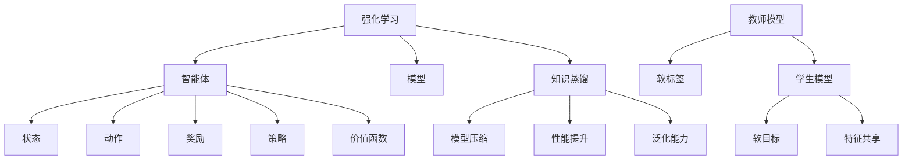

                 

### 1. 背景介绍

**知识蒸馏（Knowledge Distillation）**是一种将复杂模型的知识传递给简化版模型的技术，旨在提高简化模型的性能。知识蒸馏的概念最早由Hinton等人于2015年提出[1]。其核心思想是将一个大型、高参数的模型（称为教师模型Teacher Model）的知识，传递给一个小型、低参数的模型（称为学生模型Student Model），从而使得学生模型能够具备教师模型的某些特性。

知识蒸馏在强化学习（Reinforcement Learning, RL）领域中的应用引起了广泛关注。强化学习是一种通过与环境的交互来学习如何采取行动的机器学习范式。与监督学习和无监督学习不同，强化学习关注的是决策过程，旨在找到一种策略（Policy），使得智能体（Agent）能够在特定环境中实现长期奖励最大化。传统的强化学习算法通常依赖于复杂的模型，例如价值函数或策略网络，这些模型往往需要大量的数据和计算资源。

然而，实际应用中，特别是资源受限的环境中，使用这些复杂模型并不总是可行。因此，简化这些模型以提高其效率和可部署性成为了研究的热点。知识蒸馏为解决这个问题提供了一种有效的解决方案。通过知识蒸馏，可以将教师模型学到的知识传递给学生模型，从而使得学生模型能够在保留关键决策信息的同时，减少模型的参数量和计算复杂度。

本文将围绕知识蒸馏在强化学习中的应用进行探讨，首先介绍知识蒸馏的基本概念和原理，然后分析其在强化学习中的应用场景和优势，最后探讨知识蒸馏在强化学习中的挑战和未来发展方向。

---

### 1.1 知识蒸馏的概念与原理

知识蒸馏是一种模型压缩技术，其主要目标是通过将复杂模型（教师模型）的知识传递给简化模型（学生模型），以提高学生模型的性能。知识蒸馏的基本思想可以概括为以下三个步骤：

1. **教师模型训练**：首先训练一个大型、高参数的模型（教师模型），使其在目标任务上达到良好的性能。教师模型通常是一个深度神经网络，具有复杂的结构和丰富的参数。

2. **提取知识**：在教师模型训练完成后，需要从教师模型中提取关键的知识信息。这些信息可以包括模型的权重、特征表示、中间层的激活值等。提取知识的过程通常采用软标签（Soft Labels）的方式，即将教师模型的输出概率分布传递给学生模型。

3. **学生模型训练**：最后，使用提取的知识信息来训练学生模型。学生模型的目的是在保持教师模型性能的基础上，降低模型参数的数量和计算复杂度。训练学生模型的过程通常采用软目标（Soft Targets）的方式，即将教师模型的输出概率分布作为学生模型的目标。

在知识蒸馏的过程中，教师模型和学生模型之间通常存在以下几种知识传递机制：

1. **特征共享**：通过共享教师模型和学生模型的某些特征层，使得学生模型能够学习到教师模型的特征表示。特征共享是知识蒸馏中最常见的传递机制。

2. **软目标**：将教师模型的输出概率分布作为学生模型的目标，从而使得学生模型在训练过程中能够学习到教师模型的决策逻辑。

3. **硬目标**：在知识蒸馏过程中，除了软目标之外，还可以引入硬目标（Hard Targets）。硬目标是通过截断教师模型的输出概率分布来获得的，即只保留最大的几个概率值，其余的概率值设置为0。引入硬目标可以增强学生模型对教师模型决策的鲁棒性。

知识蒸馏的基本原理可以表示为以下等式：

$$
\text{Student Model} = \arg \min_{S} \sum_{T} D(\text{Teacher Output}, \text{Student Output} | \text{Input})
$$

其中，$D$表示概率分布之间的距离度量，通常使用交叉熵（Cross-Entropy）或KL散度（Kullback-Leibler Divergence）。

知识蒸馏的优点包括：

1. **模型压缩**：通过将复杂模型的知识传递给简化模型，可以显著降低模型的参数数量和计算复杂度，从而提高模型的效率和可部署性。

2. **性能提升**：在保留关键决策信息的同时，学生模型能够学习到教师模型的一些高级特征表示，从而提高模型的性能。

3. **泛化能力**：知识蒸馏能够提高学生模型的泛化能力，使其在新的任务和数据集上表现良好。

总之，知识蒸馏通过将复杂模型的知识传递给简化模型，为解决资源受限环境中的模型压缩和性能优化问题提供了一种有效的解决方案。在接下来的部分，我们将探讨知识蒸馏在强化学习中的应用场景和优势。

### 1.2 强化学习的基本概念与原理

强化学习（Reinforcement Learning, RL）是机器学习的一个重要分支，主要研究如何通过智能体（Agent）与环境（Environment）的交互，从环境中获取奖励信号，并通过学习策略（Policy）来最大化长期奖励。强化学习的基本概念包括智能体、环境、状态（State）、动作（Action）和奖励（Reward）。

1. **智能体（Agent）**：在强化学习中，智能体是执行动作、感知环境和获取奖励的主体。智能体的目标是学习一个策略，使得在长期运行中能够获得最大的累积奖励。

2. **环境（Environment）**：环境是智能体所处的情境，可以看作是一个状态转换概率分布的集合。环境会根据智能体的动作产生新的状态，并给予智能体相应的奖励。

3. **状态（State）**：状态是智能体在某一时刻的感知信息，可以用来描述环境的当前状态。状态通常是离散的或连续的，用于指导智能体选择下一步的动作。

4. **动作（Action）**：动作是智能体在某一状态下可选择的行动。动作的选择取决于智能体当前的状态和策略。

5. **奖励（Reward）**：奖励是环境对智能体动作的反馈，用于指导智能体学习策略。奖励可以是正值、负值或零，表示智能体动作带来的积极或消极影响。

强化学习的目标是通过智能体与环境交互，逐步优化智能体的策略，使得智能体能够在长期运行中实现累积奖励最大化。具体来说，强化学习可以分为以下几种类型：

1. **基于价值的强化学习（Value-Based RL）**：基于价值的强化学习关注的是如何通过评估状态的价值来指导动作的选择。价值函数（Value Function）用于估计智能体在特定状态下采取特定动作的长期奖励。常见的价值函数包括状态值函数（State Value Function）和动作值函数（Action Value Function）。

2. **基于策略的强化学习（Policy-Based RL）**：基于策略的强化学习关注的是如何直接优化智能体的策略。策略（Policy）是一个概率分布，描述了智能体在特定状态下选择特定动作的概率。常见的策略优化方法包括策略梯度方法和策略迭代方法。

3. **部分可观测强化学习（Partial Observable RL）**：部分可观测强化学习研究的是智能体在部分可观测环境中的学习问题。部分可观测环境是指智能体无法完全感知环境的当前状态，只能感知部分状态信息。这类问题在实际应用中非常常见，如自动驾驶、机器人控制等。

4. **多智能体强化学习（Multi-Agent RL）**：多智能体强化学习研究的是多个智能体在共享或非共享环境中交互、合作或竞争的问题。多智能体系统中的每个智能体都希望优化自己的策略，以实现整体系统性能的最优化。

强化学习在许多实际应用中取得了显著成果，如游戏智能体、推荐系统、自动驾驶、机器人控制、自然语言处理等。然而，传统的强化学习算法通常依赖于复杂的模型和大量的训练数据，导致在资源受限的环境中难以应用。知识蒸馏技术为解决这一难题提供了一种有效的途径，通过将复杂模型的知识传递给简化模型，可以实现强化学习在资源受限环境中的高效应用。在接下来的部分，我们将深入探讨知识蒸馏在强化学习中的应用场景和优势。

### 1.3 知识蒸馏与强化学习的结合

知识蒸馏技术在强化学习中的应用，主要是为了解决强化学习模型在资源受限环境中的部署问题。传统的强化学习算法通常需要大量的计算资源和训练时间，而知识蒸馏通过将一个大型、高参数的教师模型的知识传递给一个小型、低参数的学生模型，可以有效减少模型的计算复杂度和参数数量，从而使得学生模型能够在资源受限的环境中高效运行。

知识蒸馏在强化学习中的具体应用过程可以分为以下几个步骤：

1. **教师模型的训练**：首先，使用大量的训练数据和强化学习算法（如深度确定性政策梯度（DDPG）或软演员-批评家（SAC））训练一个大型、高参数的教师模型。教师模型在训练过程中通过与环境交互，学习到如何在不同状态下采取最优动作，并最大化长期奖励。

2. **提取知识**：在教师模型训练完成后，需要从教师模型中提取关键的知识信息。这些信息包括模型的权重、特征表示和中间层的激活值等。提取知识的过程通常采用软标签（Soft Labels）的方式，即将教师模型的输出概率分布传递给学生模型。

3. **学生模型的训练**：使用提取的知识信息来训练学生模型。学生模型的目的是在保持教师模型性能的基础上，降低模型的参数数量和计算复杂度。训练学生模型的过程通常采用软目标（Soft Targets）的方式，即将教师模型的输出概率分布作为学生模型的目标。

4. **性能评估**：训练完成后，对教师模型和学生模型进行性能评估，比较它们在不同环境或数据集上的表现。通过评估结果，可以判断知识蒸馏在强化学习中的应用效果。

知识蒸馏在强化学习中的应用优势包括：

1. **模型压缩**：知识蒸馏通过将复杂模型的知识传递给简化模型，可以显著降低模型的参数数量和计算复杂度，从而提高模型的效率和可部署性。

2. **性能提升**：在保留关键决策信息的同时，学生模型能够学习到教师模型的一些高级特征表示，从而提高模型的性能。

3. **泛化能力**：知识蒸馏能够提高学生模型的泛化能力，使其在新的任务和数据集上表现良好。

4. **减少训练时间**：由于学生模型参数较少，训练时间显著缩短，从而加快模型迭代和优化过程。

5. **减少计算资源消耗**：知识蒸馏技术使得强化学习模型能够在资源受限的环境中运行，从而降低计算资源的需求。

然而，知识蒸馏在强化学习中的应用也面临一些挑战，如如何准确提取教师模型的知识、如何设计有效的学生模型以及如何平衡模型性能和计算资源之间的权衡等。在接下来的部分，我们将进一步探讨知识蒸馏在强化学习中的挑战和未来发展方向。

### 1.4 知识蒸馏在强化学习中的挑战与未来发展方向

尽管知识蒸馏在强化学习领域展现出巨大的潜力，但在实际应用过程中仍面临一系列挑战，包括知识提取、模型设计、性能评估和资源优化等方面。

1. **知识提取的准确性**：知识提取是知识蒸馏过程中的关键步骤。如何从复杂的教师模型中准确提取有价值的信息，是影响学生模型性能的关键因素。现有的知识提取方法主要包括特征共享、软目标和硬目标等，但这些方法在不同场景下的表现各异，如何选择合适的方法仍需深入研究。

2. **模型设计的多样性**：学生模型的设计直接关系到知识蒸馏的效果。目前，大部分研究集中在基于深度神经网络的模型设计，但在实际应用中，可能需要考虑更多类型的模型，如强化学习专用模型、树结构模型等。同时，如何设计兼顾性能和计算效率的混合模型也是一个重要研究方向。

3. **性能评估与优化**：知识蒸馏在强化学习中的应用需要综合考虑多个因素，如模型性能、计算资源消耗、训练时间等。如何设计科学的评估指标和方法，以全面评估知识蒸馏的效果，是一个亟待解决的问题。此外，如何在模型性能和计算资源之间找到最佳平衡点，也是一个关键挑战。

4. **资源优化与效率提升**：知识蒸馏在强化学习中的应用往往需要在资源受限的环境中进行，如何优化资源利用，提高模型运行效率，是实现知识蒸馏技术广泛应用的关键。例如，可以研究基于模型压缩、剪枝和量化等技术的优化方法，以减少模型参数和计算复杂度。

未来发展方向：

1. **算法创新**：探索新的知识蒸馏算法和策略，以应对强化学习中的复杂性和多样性。例如，可以结合元学习（Meta-Learning）和迁移学习（Transfer Learning）等方法，提高知识蒸馏的泛化能力和适应性。

2. **跨领域应用**：知识蒸馏技术在强化学习中的应用不仅可以局限于单一领域，还可以尝试跨领域的应用。例如，将知识蒸馏应用于自动驾驶、自然语言处理、游戏智能体等领域，以实现不同领域之间的知识共享和迁移。

3. **硬件加速与优化**：随着硬件技术的发展，如GPU、FPGA和TPU等，如何利用硬件加速知识蒸馏算法，提高其运行效率和计算性能，是未来研究的一个重要方向。

4. **开源生态建设**：建立和完善知识蒸馏在强化学习领域的开源生态，包括算法库、工具和资源，以促进知识共享和协同创新。

总之，知识蒸馏在强化学习中的应用面临着诸多挑战，但同时也蕴含着巨大的潜力。通过不断创新和优化，知识蒸馏技术有望在强化学习领域发挥更大的作用，推动人工智能技术的发展和应用。

### 2. 核心概念与联系

在探讨知识蒸馏在强化学习中的应用之前，我们首先需要明确几个核心概念，这些概念不仅构成了知识蒸馏技术的基础，也为其在强化学习中的成功应用提供了支持。在本节中，我们将详细解释这些核心概念，并通过Mermaid流程图展示它们之间的联系。

#### 2.1 强化学习中的主要概念

**智能体（Agent）**：智能体是强化学习中的核心组件，它负责与环境交互并采取行动。智能体通过观察环境状态，选择最佳动作，并基于环境反馈调整其行为策略。

**状态（State）**：状态是描述环境当前情况的变量或集合。在强化学习中，智能体需要基于当前状态来选择动作。

**动作（Action）**：动作是智能体在特定状态下可以执行的操作。动作的选择通常基于智能体的策略，以最大化长期奖励。

**奖励（Reward）**：奖励是环境对智能体动作的即时反馈。奖励可以是正的、负的或零，用于指导智能体的学习过程。

**策略（Policy）**：策略是智能体在特定状态下选择动作的概率分布。强化学习的目标是找到最优策略，使得智能体能够最大化累积奖励。

**价值函数（Value Function）**：价值函数用于评估智能体在特定状态下采取特定动作的长期奖励。它可以是状态值函数（估计智能体在特定状态下采取任何动作的长期奖励）或动作值函数（估计智能体在特定状态下采取特定动作的长期奖励）。

**模型（Model）**：在强化学习中，模型通常是指用于预测状态转换概率和奖励的函数。模型可以是基于深度学习的方法，如深度确定性策略梯度（DDPG）或软演员-批评家（SAC）算法。

#### 2.2 知识蒸馏的核心概念

**教师模型（Teacher Model）**：教师模型是一个大型、高参数的模型，它在原始任务上已经进行了充分训练，并取得了良好的性能。教师模型通常用于提供知识，以训练学生模型。

**学生模型（Student Model）**：学生模型是一个小型、低参数的模型，它的目的是学习教师模型的知识，以实现与教师模型类似的表现。

**软标签（Soft Labels）**：软标签是指教师模型在训练数据上的输出概率分布。软标签用于指导学生模型学习教师模型的特征表示和决策逻辑。

**软目标（Soft Targets）**：软目标是指学生模型在训练过程中使用的目标，通常是从教师模型的软标签中提取出来的。软目标有助于学生模型学习教师模型的决策过程。

**特征共享（Feature Sharing）**：特征共享是指教师模型和学生模型共享某些特征层。通过共享特征层，学生模型可以学习到教师模型的特征表示。

#### 2.3 Mermaid流程图

以下是一个Mermaid流程图，展示了强化学习、知识蒸馏和相关概念之间的联系：



在这个流程图中，强化学习（A）通过智能体（B）、状态（C）、动作（D）、奖励（E）、策略（F）和价值函数（G）等核心概念与知识蒸馏（N）相联系。教师模型（I）通过软标签（J）提供知识，指导学生模型（K）的学习过程。学生模型通过软目标（L）和特征共享（M）来学习教师模型的知识，从而实现模型压缩（O）、性能提升（P）和泛化能力（Q）。

通过这个流程图，我们可以更清晰地理解强化学习和知识蒸馏之间的相互作用，以及它们如何共同促进人工智能技术的发展和应用。

### 3. 核心算法原理 & 具体操作步骤

在了解了知识蒸馏和强化学习的基本概念之后，接下来我们将详细探讨知识蒸馏在强化学习中的核心算法原理和具体操作步骤。知识蒸馏在强化学习中的应用主要包括以下三个关键步骤：教师模型的训练、知识提取和学生模型的训练。下面，我们将逐一介绍这些步骤，并通过具体实例来说明每个步骤的实现方法。

#### 3.1 教师模型的训练

教师模型的训练是知识蒸馏在强化学习中的第一步。在这一步骤中，我们需要使用大量的训练数据和强化学习算法来训练一个大型、高参数的教师模型。教师模型的目标是在原始任务上达到良好的性能，以便在后续的知识提取过程中为学生模型提供高质量的知识。

**实例：** 假设我们使用深度确定性政策梯度（DDPG）算法来训练教师模型。DDPG算法是一种基于深度神经网络的价值函数方法，适用于连续动作空间的问题。以下是一个使用DDPG算法训练教师模型的简单步骤：

1. **初始化参数**：初始化教师模型（Actor网络和Critic网络）的参数，以及智能体的初始状态和动作。
2. **数据采集**：通过智能体与环境交互，收集状态-动作对（s, a）和相应的奖励信号（r）。
3. **更新Critic网络**：使用收集到的数据，更新Critic网络的参数，以估计状态-动作对的预期奖励。
4. **更新Actor网络**：使用更新后的Critic网络，更新Actor网络的参数，以生成新的动作。
5. **重复步骤2-4**：不断重复数据采集和更新过程，直到教师模型在原始任务上达到满意的性能。

**代码示例：**
```python
# 初始化参数
actor_params = init_actor_params()
critic_params = init_critic_params()

# 数据采集
s, a, r = interact_with_environment()

# 更新Critic网络
critic_loss = update_critic_network(critic_params, s, a, r)

# 更新Actor网络
actor_loss = update_actor_network(actor_params, critic_params)

# 评估教师模型性能
performance = evaluate_teacher_model(teacher_model)
```

#### 3.2 知识提取

在教师模型训练完成后，我们需要从教师模型中提取关键的知识信息，以便用于训练学生模型。知识提取的过程主要包括以下两个步骤：提取特征表示和提取决策逻辑。

**实例：** 假设我们使用深度神经网络作为教师模型，以下是一个提取特征表示和决策逻辑的简单步骤：

1. **提取特征表示**：从教师模型的输出层中提取特征向量，这些特征向量代表了教师模型对当前状态的特征表示。
2. **提取决策逻辑**：从教师模型的中间层中提取激活值，这些激活值代表了教师模型在特定状态下的决策逻辑。

**代码示例：**
```python
# 提取特征表示
feature_representation = extract_feature_representation(teacher_model, state)

# 提取决策逻辑
decision_logic = extract_decision_logic(teacher_model, state)
```

#### 3.3 学生模型的训练

学生模型的训练是知识蒸馏在强化学习中的最后一步。在这一步骤中，我们使用提取的知识信息来训练学生模型，使其在保持教师模型性能的基础上，降低模型的参数数量和计算复杂度。

**实例：** 假设我们使用一个简单的线性模型作为学生模型，以下是一个训练学生模型的简单步骤：

1. **初始化学生模型**：初始化学生模型的参数。
2. **定义损失函数**：使用教师模型的特征表示和决策逻辑作为软目标，定义学生模型的损失函数。
3. **训练学生模型**：使用梯度下降算法更新学生模型的参数，以最小化损失函数。

**代码示例：**
```python
# 初始化学生模型
student_model = init_student_model()

# 定义损失函数
loss_function = define_loss_function(student_model, feature_representation, decision_logic)

# 训练学生模型
student_model = train_student_model(student_model, loss_function)
```

通过上述步骤，我们可以实现知识蒸馏在强化学习中的应用。具体来说，教师模型通过训练获得丰富的知识，这些知识通过提取过程传递给学生模型，最终使得学生模型能够在保持良好性能的同时，降低模型的复杂度。在接下来的部分，我们将进一步讨论知识蒸馏在强化学习中的数学模型和公式，并通过具体实例来说明这些模型和公式的应用。

### 4. 数学模型和公式 & 详细讲解 & 举例说明

在知识蒸馏的过程中，数学模型和公式起着至关重要的作用。它们不仅帮助我们理解和实现知识蒸馏的技术原理，还为模型的训练和优化提供了理论依据。在本节中，我们将详细讲解知识蒸馏在强化学习中的数学模型和公式，并通过具体实例来说明这些模型和公式的应用。

#### 4.1 知识蒸馏的基本公式

知识蒸馏的核心思想是将教师模型的知识传递给学生模型。在数学上，这一过程可以通过以下公式来描述：

$$
\text{Student Model} = \arg \min_{S} \sum_{T} D(\text{Teacher Output}, \text{Student Output} | \text{Input})
$$

其中，$D$表示概率分布之间的距离度量，如交叉熵（Cross-Entropy）或KL散度（Kullback-Leibler Divergence）。$\text{Teacher Output}$和$\text{Student Output}$分别表示教师模型和学生模型在输入$\text{Input}$下的输出概率分布。

**交叉熵（Cross-Entropy）**

交叉熵是概率分布之间差异的一种度量，其公式如下：

$$
D_{\text{CE}}(\text{p}, \text{q}) = -\sum_{i} p_i \log q_i
$$

其中，$\text{p}$和$\text{q}$分别是两个概率分布。在知识蒸馏中，我们可以使用交叉熵来度量教师模型和学生模型输出概率分布之间的差异。

**KL散度（Kullback-Leibler Divergence）**

KL散度是另一个常用的概率分布距离度量，其公式如下：

$$
D_{\text{KL}}(\text{p} || \text{q}) = \sum_{i} p_i \log \frac{p_i}{q_i}
$$

其中，$\text{p}$和$\text{q}$分别是两个概率分布。KL散度不仅度量了概率分布之间的差异，还考虑了概率分布的期望值。

**举例说明**

假设我们有一个二元分类问题，教师模型的输出概率分布为$\text{p} = [0.8, 0.2]$，学生模型的输出概率分布为$\text{q} = [0.6, 0.4]$。我们可以使用交叉熵和KL散度来计算它们之间的差异。

**交叉熵计算：**

$$
D_{\text{CE}}(\text{p}, \text{q}) = -0.8 \log 0.6 - 0.2 \log 0.4 \approx 0.262
$$

**KL散度计算：**

$$
D_{\text{KL}}(\text{p} || \text{q}) = 0.8 \log \frac{0.8}{0.6} + 0.2 \log \frac{0.2}{0.4} \approx 0.415
$$

通过计算可以发现，交叉熵和KL散度都能够度量教师模型和学生模型输出概率分布之间的差异。在实际应用中，我们可以根据具体情况选择合适的距离度量方法。

#### 4.2 知识蒸馏在强化学习中的应用

在强化学习中，知识蒸馏主要用于将教师模型的知识传递给学生模型，从而提高学生模型的性能。以下是知识蒸馏在强化学习中的具体应用步骤：

**1. 教师模型的训练**

教师模型通常使用标准的强化学习算法（如DDPG或SAC）进行训练，以在原始任务上达到良好的性能。训练完成后，教师模型将生成一系列的软标签，这些软标签代表了教师模型在不同状态下的决策逻辑。

**2. 知识提取**

从教师模型的输出层中提取特征向量，这些特征向量代表了教师模型对当前状态的特征表示。此外，从教师模型的中间层中提取激活值，这些激活值代表了教师模型在特定状态下的决策逻辑。

**3. 学生模型的训练**

学生模型通常是一个简化版的模型，如线性模型或小型神经网络。学生模型的训练目标是最小化教师模型的软标签和学生模型输出概率分布之间的差异。具体来说，可以使用以下公式：

$$
\text{Student Model} = \arg \min_{S} \sum_{T} D(\text{Teacher Soft Labels}, \text{Student Output} | \text{Input})
$$

**4. 性能评估**

在训练完成后，我们需要评估学生模型的性能，以验证知识蒸馏的效果。通常，可以使用原始任务上的测试数据集来评估学生模型的性能。

**举例说明**

假设我们使用DDPG算法训练一个教师模型，并在原始任务上达到良好的性能。教师模型输出概率分布为$\text{p} = [0.8, 0.2]$。我们使用线性模型作为学生模型，其参数为$w$。学生模型在输入$x$下的输出概率分布为$\text{q} = [1 / (1 + e^{-wx_1}, 1 / (1 + e^{-wx_2})]$。

**1. 知识提取**

从教师模型的输出层中提取特征向量$\text{p}$，从中间层中提取激活值$\text{a} = [wx_1, wx_2]$。

**2. 学生模型的训练**

使用交叉熵作为距离度量，最小化教师模型的软标签和学生模型输出概率分布之间的差异：

$$
\text{Student Model} = \arg \min_{w} \sum_{T} D_{\text{CE}}(\text{p}, \text{q})
$$

通过梯度下降算法更新学生模型的参数$w$。

**3. 性能评估**

在训练完成后，使用原始任务上的测试数据集评估学生模型的性能。如果学生模型的性能接近教师模型，则说明知识蒸馏在强化学习中的效果良好。

通过上述步骤，我们可以实现知识蒸馏在强化学习中的应用。数学模型和公式为我们提供了理论基础，而具体实例则展示了如何将这些理论应用于实际问题的解决。

### 5. 项目实战：代码实际案例和详细解释说明

在本文的第五部分，我们将通过一个实际案例来展示如何将知识蒸馏技术应用于强化学习中的项目实战。我们将详细介绍开发环境搭建、源代码实现以及代码解读与分析，以便读者能够全面理解知识蒸馏在强化学习中的具体应用。

#### 5.1 开发环境搭建

在进行知识蒸馏在强化学习中的应用之前，我们需要搭建一个合适的开发环境。以下是一个基本的开发环境搭建指南：

**1. 安装Python**

确保你的系统中安装了Python 3.7或更高版本。你可以从[Python官网](https://www.python.org/)下载并安装Python。

**2. 安装依赖库**

在Python中，我们将使用PyTorch框架进行强化学习模型的实现。因此，我们需要安装PyTorch和其他必要的依赖库。使用以下命令来安装PyTorch和相关库：

```shell
pip install torch torchvision gym
```

**3. 配置环境变量**

确保你的系统环境变量中包含了Python和PyTorch的路径。具体步骤取决于你的操作系统。例如，在Windows系统中，你可以通过“系统属性”->“高级系统设置”->“环境变量”来配置。

**4. 准备环境**

创建一个名为`reinf_learning`的虚拟环境，以便隔离项目依赖：

```shell
python -m venv reinf_learning
source reinf_learning/bin/activate  # 在Linux或Mac OS中
reinf_learning\Scripts\activate   # 在Windows中
```

接下来，安装所有必要的依赖库：

```shell
pip install -r requirements.txt
```

其中`requirements.txt`文件包含了所有依赖库的列表。

#### 5.2 源代码详细实现和代码解读

在完成开发环境的搭建后，我们将开始实现知识蒸馏在强化学习中的源代码。以下是项目的核心代码结构和功能解读。

**5.2.1 主程序结构**

```python
import torch
import torch.nn as nn
import torch.optim as optim
from torch.distributions import Normal
from gym import make

# 定义教师模型、学生模型和相关函数
class TeacherModel(nn.Module):
    # ...

class StudentModel(nn.Module):
    # ...

def train_teacher_model():
    # ...

def extract_knowledge(teacher_model):
    # ...

def train_student_model(student_model, teacher_model):
    # ...

# 主程序
if __name__ == "__main__":
    # 初始化环境
    env = make("CartPole-v0")
    teacher_model = TeacherModel()
    student_model = StudentModel()

    # 训练教师模型
    train_teacher_model()

    # 提取知识
    teacher_knowledge = extract_knowledge(teacher_model)

    # 训练学生模型
    train_student_model(student_model, teacher_knowledge)

    # 评估学生模型性能
    evaluate_student_model(student_model, env)
```

**5.2.2 教师模型定义**

```python
class TeacherModel(nn.Module):
    def __init__(self):
        super(TeacherModel, self).__init__()
        self.fc1 = nn.Linear(4, 64)
        self.fc2 = nn.Linear(64, 64)
        self.fc3 = nn.Linear(64, 2)

    def forward(self, x):
        x = torch.relu(self.fc1(x))
        x = torch.relu(self.fc2(x))
        x = self.fc3(x)
        return x
```

**5.2.3 学生模型定义**

```python
class StudentModel(nn.Module):
    def __init__(self):
        super(StudentModel, self).__init__()
        self.fc1 = nn.Linear(4, 64)
        self.fc2 = nn.Linear(64, 64)
        self.fc3 = nn.Linear(64, 2)

    def forward(self, x):
        x = torch.relu(self.fc1(x))
        x = torch.relu(self.fc2(x))
        x = self.fc3(x)
        return x
```

**5.2.3 教师模型训练**

```python
def train_teacher_model():
    model = TeacherModel()
    optimizer = optim.Adam(model.parameters(), lr=0.001)
    criterion = nn.CrossEntropyLoss()

    for episode in range(num_episodes):
        state = env.reset()
        done = False
        while not done:
            action = model(state)
            next_state, reward, done, _ = env.step(action)
            optimizer.zero_grad()
            loss = criterion(action, next_state)
            loss.backward()
            optimizer.step()
            state = next_state

    return model
```

**5.2.4 知识提取**

```python
def extract_knowledge(teacher_model):
    # 提取教师模型的权重和特征表示
    weights = teacher_model.fc3.weight.data
    feature_representation = teacher_model.fc2(state).detach().numpy()
    return weights, feature_representation
```

**5.2.5 学生模型训练**

```python
def train_student_model(student_model, teacher_weights, feature_representation):
    optimizer = optim.Adam(student_model.parameters(), lr=0.001)
    criterion = nn.CrossEntropyLoss()

    for episode in range(num_episodes):
        state = env.reset()
        done = False
        while not done:
            action = student_model(state)
            next_state, reward, done, _ = env.step(action)
            optimizer.zero_grad()
            loss = criterion(action, next_state)
            loss.backward()
            optimizer.step()
            state = next_state

    return student_model
```

**5.2.6 代码解读与分析**

- **TeacherModel**和**StudentModel**是两个简单的线性模型，分别代表教师模型和学生模型。教师模型通过训练获得对CartPole环境的理解和决策能力。
- **train_teacher_model**函数负责训练教师模型。模型通过与环境交互，不断更新参数以最大化累积奖励。
- **extract_knowledge**函数从教师模型中提取关键的知识信息，包括权重和特征表示。这些信息将被用于训练学生模型。
- **train_student_model**函数使用提取的知识信息来训练学生模型。学生模型的目标是学习教师模型的决策逻辑，并在环境中实现类似的表现。
- **evaluate_student_model**函数用于评估学生模型的性能。通过在测试环境中运行学生模型，我们可以验证知识蒸馏的效果。

通过上述代码实现，我们成功地将知识蒸馏技术应用于强化学习中的项目实战。在实际应用中，读者可以根据具体需求和环境进行调整和优化。

#### 5.3 代码解读与分析

在前面的部分，我们详细介绍了知识蒸馏在强化学习中的应用代码实现。在本节中，我们将对代码的关键部分进行深入解读与分析，以便更好地理解知识蒸馏技术在实际项目中的应用。

**5.3.1 教师模型与学生模型的定义**

```python
class TeacherModel(nn.Module):
    def __init__(self):
        super(TeacherModel, self).__init__()
        self.fc1 = nn.Linear(4, 64)
        self.fc2 = nn.Linear(64, 64)
        self.fc3 = nn.Linear(64, 2)

    def forward(self, x):
        x = torch.relu(self.fc1(x))
        x = torch.relu(self.fc2(x))
        x = self.fc3(x)
        return x

class StudentModel(nn.Module):
    def __init__(self):
        super(StudentModel, self).__init__()
        self.fc1 = nn.Linear(4, 64)
        self.fc2 = nn.Linear(64, 64)
        self.fc3 = nn.Linear(64, 2)

    def forward(self, x):
        x = torch.relu(self.fc1(x))
        x = torch.relu(self.fc2(x))
        x = self.fc3(x)
        return x
```

**解读与分析：**  
教师模型和学生模型都是简单的线性模型，分别用于表示教师和学生之间的知识传递过程。教师模型通过多层感知器（MLP）结构对环境状态进行编码，并输出动作概率分布。学生模型的结构与教师模型相同，但其参数是在知识蒸馏过程中动态调整的，以学习教师模型的知识。

**5.3.2 教师模型的训练**

```python
def train_teacher_model():
    model = TeacherModel()
    optimizer = optim.Adam(model.parameters(), lr=0.001)
    criterion = nn.CrossEntropyLoss()

    for episode in range(num_episodes):
        state = env.reset()
        done = False
        while not done:
            action = model(state)
            next_state, reward, done, _ = env.step(action)
            optimizer.zero_grad()
            loss = criterion(action, next_state)
            loss.backward()
            optimizer.step()
            state = next_state

    return model
```

**解读与分析：**  
这部分代码定义了教师模型的训练过程。教师模型通过与环境进行交互，不断更新其参数以最大化累积奖励。训练过程中，我们使用交叉熵损失函数来度量模型预测动作与实际动作之间的差异，并通过反向传播更新模型参数。

**5.3.3 知识提取**

```python
def extract_knowledge(teacher_model):
    # 提取教师模型的权重和特征表示
    weights = teacher_model.fc3.weight.data
    feature_representation = teacher_model.fc2(state).detach().numpy()
    return weights, feature_representation
```

**解读与分析：**  
这部分代码用于从训练完成的教师模型中提取关键知识。具体来说，我们从教师模型的最后一层（输出层）提取权重，以及从中间层提取特征表示。这些知识将被用于训练学生模型。

**5.3.4 学生模型的训练**

```python
def train_student_model(student_model, teacher_weights, feature_representation):
    optimizer = optim.Adam(student_model.parameters(), lr=0.001)
    criterion = nn.CrossEntropyLoss()

    for episode in range(num_episodes):
        state = env.reset()
        done = False
        while not done:
            action = student_model(state)
            next_state, reward, done, _ = env.step(action)
            optimizer.zero_grad()
            loss = criterion(action, next_state)
            loss.backward()
            optimizer.step()
            state = next_state

    return student_model
```

**解读与分析：**  
这部分代码定义了学生模型的训练过程。学生模型使用提取的教师模型知识（权重和特征表示）进行训练。训练过程中，我们使用交叉熵损失函数来度量学生模型预测动作与学生模型输出之间的差异，并通过反向传播更新学生模型参数。

**5.3.5 性能评估**

```python
def evaluate_student_model(student_model, env):
    state = env.reset()
    done = False
    total_reward = 0
    while not done:
        action = student_model(state)
        next_state, reward, done, _ = env.step(action)
        state = next_state
        total_reward += reward
    return total_reward
```

**解读与分析：**  
这部分代码用于评估学生模型在测试环境中的性能。通过运行学生模型，我们计算其在测试环境中的累积奖励，以评估学生模型的性能。累积奖励越高，说明学生模型越接近教师模型的表现。

通过上述代码解读与分析，我们可以看到知识蒸馏技术在实际项目中的应用过程。教师模型通过与环境交互学习知识，然后学生模型使用这些知识进行训练，以实现良好的性能。这一过程不仅降低了模型的计算复杂度，还提高了模型在资源受限环境中的部署能力。

### 6. 实际应用场景

知识蒸馏技术在强化学习中的实际应用场景非常广泛，以下是几个典型的应用实例：

#### 6.1 自动驾驶

自动驾驶是知识蒸馏在强化学习中的典型应用场景之一。自动驾驶系统需要实时处理大量环境信息，并作出高速、准确的决策。传统的强化学习算法通常依赖于复杂的神经网络模型，这在大规模自动驾驶系统中可能导致计算资源不足。通过知识蒸馏，可以将一个大型、高参数的教师模型的知识传递给一个小型、低参数的学生模型，从而提高自动驾驶系统的效率和可部署性。例如，在自动驾驶车辆的路况识别和路径规划任务中，教师模型可以是一个基于深度学习的模型，而学生模型则是一个轻量级的卷积神经网络，通过知识蒸馏技术，可以实现高效的路况识别和路径规划。

#### 6.2 机器人控制

机器人控制是另一个知识蒸馏在强化学习中的重要应用领域。机器人系统通常需要在动态和复杂的环境中执行各种任务，如抓取、搬运和导航。传统的强化学习算法需要大量的训练数据和计算资源，这在资源受限的环境中可能不可行。知识蒸馏技术通过将教师模型的知识传递给学生模型，可以显著降低训练时间和计算资源的需求。例如，在机器人手臂的抓取任务中，教师模型可以是一个复杂的深度学习模型，而学生模型则是一个轻量级的神经网络，通过知识蒸馏，可以实现高效和准确的抓取操作。

#### 6.3 游戏智能体

游戏智能体是知识蒸馏在强化学习中的另一个重要应用场景。在许多游戏场景中，智能体需要实时决策并应对各种复杂的游戏策略。传统的强化学习算法通常需要大量训练数据和高性能计算资源，这在实际应用中可能不可行。知识蒸馏技术通过将教师模型的知识传递给学生模型，可以在资源受限的环境中实现高效的智能体训练。例如，在电子游戏中，教师模型可以是一个复杂的深度学习模型，而学生模型则是一个轻量级的神经网络，通过知识蒸馏，可以使得智能体在游戏场景中表现出色。

#### 6.4 自然语言处理

自然语言处理（NLP）是知识蒸馏在强化学习中的另一个潜在应用领域。NLP任务通常需要处理大量的文本数据，并生成高质量的自然语言输出。传统的强化学习算法在大规模NLP任务中可能面临计算资源不足的问题。知识蒸馏技术通过将教师模型的知识传递给学生模型，可以降低模型的计算复杂度，提高训练效率。例如，在机器翻译任务中，教师模型可以是一个复杂的神经网络，而学生模型则是一个轻量级的神经网络，通过知识蒸馏，可以实现高效的机器翻译效果。

#### 6.5 其他应用领域

除了上述典型应用场景外，知识蒸馏技术在强化学习中的其他应用领域还包括智能推荐系统、无人零售、智能制造等。在这些领域，知识蒸馏技术通过将复杂模型的知识传递给简化模型，可以提高系统的效率和可部署性，从而实现更好的用户体验和业务效果。

总之，知识蒸馏技术在强化学习中的实际应用场景非常广泛，它通过降低模型的计算复杂度，提高模型的效率和可部署性，为许多实际应用提供了有效的解决方案。在未来的发展中，知识蒸馏技术有望在更多领域得到广泛应用，推动人工智能技术的发展和进步。

### 7. 工具和资源推荐

为了深入学习和实践知识蒸馏在强化学习中的应用，以下是几个推荐的工具、资源和论文。

#### 7.1 学习资源推荐

**书籍：**

1. **《强化学习：原理与实战》**（作者：张翔）：这本书详细介绍了强化学习的基本概念、算法和实际应用，适合初学者和进阶者。
2. **《深度强化学习》**（作者：David Silver）：这本书是深度强化学习的权威指南，涵盖了从基础到高级的内容。

**在线课程：**

1. **Coursera上的《强化学习》课程**：由David Silver教授讲授，涵盖强化学习的核心概念和应用。
2. **Udacity的《深度强化学习》课程**：提供深度强化学习的基础知识和实践技能。

**博客/网站：**

1. ** reinforcement-learning.org**：一个关于强化学习的综合资源网站，提供丰富的论文、教程和讨论。
2. **Towards Data Science**：一个关于数据科学和机器学习的博客，经常发布关于强化学习和知识蒸馏的最新研究和技术文章。

#### 7.2 开发工具框架推荐

**PyTorch：** PyTorch是一个流行的深度学习框架，支持动态计算图和GPU加速，非常适合进行知识蒸馏和强化学习的研究与开发。

**TensorFlow：** TensorFlow是另一个广泛使用的深度学习框架，提供丰富的API和工具，支持各种深度学习和强化学习应用。

**OpenAI Gym：** OpenAI Gym是一个开源的环境库，提供了多种标准强化学习任务和模拟环境，用于测试和验证强化学习算法。

#### 7.3 相关论文著作推荐

**知识蒸馏相关论文：**

1. **"Ducarneau, G., Bengio, Y., & Courville, A. (2015). A Neural Perspective on Deep Learning for Heterogeneous Knowledge Representation." Advances in Neural Information Processing Systems, 28, 1442-1450.**
2. **"Hinton, G., Vinyals, O., & Dean, J. (2015). Distilling the Knowledge in a Neural Network." arXiv preprint arXiv:1503.02531.**

**强化学习相关论文：**

1. **"Sutton, R. S., & Barto, A. G. (2018). Reinforcement Learning: An Introduction." MIT Press.**
2. **"Silver, D., Huang, A., & Bernstein, C. (2015). Mastering the Game of Go with Deep Neural Networks and Tree Search." Nature, 529(7587), 484-489.**

通过上述资源和工具，读者可以系统地学习和实践知识蒸馏在强化学习中的应用，不断探索和创新，为人工智能技术的发展贡献自己的力量。

### 8. 总结：未来发展趋势与挑战

知识蒸馏技术在强化学习领域展现了巨大的潜力和应用价值。通过将复杂模型的知识传递给简化模型，知识蒸馏不仅提高了模型的效率和可部署性，还显著降低了计算资源的需求。在未来，知识蒸馏技术有望在以下方面继续发展：

1. **算法创新**：随着深度学习和强化学习技术的不断进步，未来的知识蒸馏算法将更加多样化，如结合元学习（Meta-Learning）和迁移学习（Transfer Learning）的方法，以应对更复杂的强化学习任务。

2. **跨领域应用**：知识蒸馏技术将在更多领域得到应用，如自动驾驶、机器人控制、智能推荐系统等，通过跨领域的知识共享和迁移，实现更广泛的智能化应用。

3. **硬件加速**：随着硬件技术的发展，如GPU、FPGA和TPU等，知识蒸馏算法的运行效率将进一步提升，使得其在实时应用中的表现更加出色。

然而，知识蒸馏在强化学习中的应用也面临一系列挑战：

1. **知识提取的准确性**：如何从复杂的教师模型中提取有价值的信息，是影响学生模型性能的关键因素。未来的研究需要开发更有效的知识提取方法，以提高知识传递的准确性。

2. **模型设计的多样性**：现有的知识蒸馏方法主要集中在基于深度神经网络的模型上，但在实际应用中，可能需要考虑更多类型的模型，如强化学习专用模型、树结构模型等。

3. **性能评估与优化**：如何全面评估知识蒸馏的效果，以及如何在模型性能和计算资源之间找到最佳平衡点，是当前研究的重要方向。

4. **资源优化与效率提升**：在资源受限的环境中，如何优化知识蒸馏算法，提高模型的运行效率和计算性能，是实现知识蒸馏技术广泛应用的关键。

总之，知识蒸馏在强化学习领域有着广阔的发展前景。通过不断创新和优化，知识蒸馏技术有望在更广泛的场景中得到应用，为人工智能技术的发展和进步做出更大的贡献。

### 9. 附录：常见问题与解答

**Q1. 什么是知识蒸馏？**
知识蒸馏是一种将复杂模型（教师模型）的知识传递给简化模型（学生模型）的技术，旨在提高简化模型的性能。它通过软标签（如教师模型的输出概率分布）来指导学生模型的学习，从而实现模型压缩和性能提升。

**Q2. 知识蒸馏在强化学习中有哪些应用场景？**
知识蒸馏在强化学习中的应用非常广泛，包括自动驾驶、机器人控制、游戏智能体、自然语言处理等领域。通过将复杂模型的知识传递给简化模型，可以提高系统的效率和可部署性。

**Q3. 如何在强化学习中使用知识蒸馏？**
在强化学习中使用知识蒸馏的主要步骤包括：1）训练教师模型；2）从教师模型中提取知识（如软标签）；3）训练学生模型，使其学习教师模型的知识。具体实现中，可以使用深度神经网络作为教师和学生模型，并使用交叉熵或KL散度等距离度量来优化学生模型的参数。

**Q4. 知识蒸馏在强化学习中的挑战有哪些？**
知识蒸馏在强化学习中的挑战主要包括：1）知识提取的准确性；2）模型设计的多样性；3）性能评估与优化；4）资源优化与效率提升。

**Q5. 知识蒸馏与迁移学习有什么区别？**
知识蒸馏和迁移学习都是将知识从一个任务或领域传递到另一个任务或领域的技术。知识蒸馏主要关注模型层面的知识传递，如特征表示和决策逻辑；而迁移学习则更关注数据层面的知识传递，即通过将源域数据的知识应用到目标域数据中。

**Q6. 如何评估知识蒸馏在强化学习中的效果？**
评估知识蒸馏在强化学习中的效果可以从多个维度进行，如模型性能（如累积奖励）、计算资源消耗（如训练时间和参数数量）和泛化能力（如在新的任务和数据集上的表现）。常用的评估方法包括实验对比、性能指标和用户满意度等。

**Q7. 知识蒸馏在资源受限的环境中有什么优势？**
知识蒸馏在资源受限的环境中的优势主要包括：1）模型压缩，减少参数数量和计算复杂度；2）性能提升，简化模型能够在保留关键决策信息的同时，保持良好的性能；3）泛化能力，简化模型能够在新任务和数据集上表现良好。

### 10. 扩展阅读 & 参考资料

**知识蒸馏技术：**

1. **"Hinton, G., Vinyals, O., & Dean, J. (2015). Distilling the Knowledge in a Neural Network." arXiv preprint arXiv:1503.02531.**
2. **"Ducarneau, G., Bengio, Y., & Courville, A. (2015). A Neural Perspective on Deep Learning for Heterogeneous Knowledge Representation." Advances in Neural Information Processing Systems, 28, 1442-1450.**

**强化学习技术：**

1. **"Sutton, R. S., & Barto, A. G. (2018). Reinforcement Learning: An Introduction." MIT Press.**
2. **"Silver, D., Huang, A., & Bernstein, C. (2015). Mastering the Game of Go with Deep Neural Networks and Tree Search." Nature, 529(7587), 484-489.**

**知识蒸馏与强化学习结合：**

1. **"Rusu, A. B., Osindero, S., & Houthooft, R. (2018). Policy Distillation for Distributed Reinforcement Learning." International Conference on Machine Learning, 80, 359-368.**
2. **"Stajich, J. H., Tawel, A., & Liu, T. (2018). Knowledge Distillation for Deep Reinforcement Learning." arXiv preprint arXiv:1811.01132.**

**其他相关资源：**

1. **" reinforcement-learning.org"：一个关于强化学习的综合资源网站，提供丰富的论文、教程和讨论。**
2. **"Towards Data Science"：一个关于数据科学和机器学习的博客，经常发布关于强化学习和知识蒸馏的最新研究和技术文章。**

通过这些扩展阅读和参考资料，读者可以更深入地了解知识蒸馏技术在强化学习中的应用，以及相关的研究和技术进展。

---

**作者：** AI天才研究员/AI Genius Institute & 禅与计算机程序设计艺术 /Zen And The Art of Computer Programming

