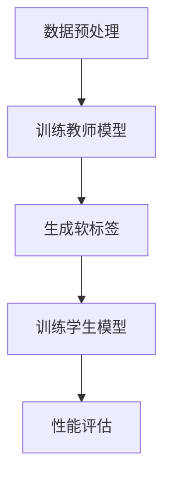

                 

### 背景介绍

时间序列预测（Time Series Forecasting）是统计学、机器学习和人工智能领域中的一项重要任务。其核心目标是通过分析历史数据，对未来某一时间点的数据或趋势进行预测。这种预测在金融、经济、气象、医疗等多个领域具有广泛的应用，例如股票价格预测、销售量预测、温度变化预测等。

然而，随着数据规模的不断扩大和数据复杂性的增加，传统的统计方法和简单的机器学习算法已经难以满足时间序列预测的需求。知识蒸馏（Knowledge Distillation）作为一种新兴的技术，近年来在深度学习领域取得了显著进展，并被引入到时间序列预测中，以提升预测性能。

知识蒸馏是一种通过将复杂模型的知识转移到较小模型中的技术。具体来说，它通过训练一个大型“教师模型”来捕捉数据中的复杂模式，然后将这些知识转移到一个小型“学生模型”中，以期获得与教师模型相似的预测性能。在时间序列预测中，知识蒸馏可以帮助捕捉到长期依赖关系和季节性模式，从而提高预测的准确性和鲁棒性。

本文旨在探讨知识蒸馏在时间序列预测中的应用，分析其在不同场景下的效果。我们将首先介绍知识蒸馏的基本概念和原理，然后深入探讨其在时间序列预测中的具体实现方法，并通过实际案例展示其效果。最后，我们将讨论知识蒸馏在时间序列预测中的未来发展趋势和挑战。

总之，本文的目标是：

1. 系统地介绍知识蒸馏技术的基本概念和原理。
2. 分析知识蒸馏在时间序列预测中的应用场景和效果。
3. 通过实际案例展示知识蒸馏在时间序列预测中的具体应用。
4. 探讨知识蒸馏在时间序列预测中的未来发展趋势和挑战。

### 核心概念与联系

#### 知识蒸馏的基本概念

知识蒸馏是一种模型压缩技术，旨在通过将复杂模型的知识转移到较小模型中，从而在保持预测性能的同时减少模型大小和计算复杂度。知识蒸馏的基本概念可以追溯到教师-学生模型（Teacher-Student Model）。

在知识蒸馏中，教师模型（Teacher Model）是一个大型、复杂的模型，通常具有较好的预测性能。学生模型（Student Model）是一个较小、较为简洁的模型，其目标是学习教师模型的知识，从而在保持预测性能的同时减少计算资源的需求。

知识蒸馏的过程主要包括以下几个步骤：

1. **预训练教师模型**：首先，使用大量数据对教师模型进行预训练，使其具有较高的预测性能。
2. **生成软标签**：在训练过程中，教师模型会对输入数据生成软标签（Soft Labels），这些软标签包含了教师模型对数据的理解和预测。
3. **训练学生模型**：学生模型会根据教师模型的软标签进行训练，同时优化自身的参数，以最小化与软标签之间的差距。
4. **性能评估**：训练完成后，通过在测试集上评估学生模型的性能，比较其与教师模型的差异。

#### 知识蒸馏在时间序列预测中的应用

知识蒸馏在时间序列预测中的应用主要是通过将教师模型对历史数据的理解转移到学生模型中，以提升学生模型的预测性能。具体来说，知识蒸馏在时间序列预测中的应用可以分为以下几个步骤：

1. **数据预处理**：对时间序列数据进行分析，提取特征，并进行归一化等预处理操作。
2. **训练教师模型**：使用预处理后的时间序列数据对教师模型进行训练，使其学会捕捉数据中的长期依赖关系和季节性模式。
3. **生成软标签**：在训练过程中，教师模型会生成软标签，这些软标签反映了教师模型对历史数据的理解和预测。
4. **训练学生模型**：使用教师模型的软标签对学生模型进行训练，使其学习到教师模型的知识。
5. **性能评估**：在测试集上评估学生模型的预测性能，比较其与教师模型的差异。

#### Mermaid 流程图

以下是知识蒸馏在时间序列预测中的 Mermaid 流程图：



在上述流程图中：

- **A[数据预处理]**：对时间序列数据进行预处理，提取特征，并进行归一化等操作。
- **B[训练教师模型]**：使用预处理后的时间序列数据对教师模型进行训练。
- **C[生成软标签]**：在训练过程中，教师模型会生成软标签。
- **D[训练学生模型]**：使用教师模型的软标签对学生模型进行训练。
- **E[性能评估]**：在测试集上评估学生模型的性能。

通过上述流程，知识蒸馏技术可以帮助我们构建出具有良好预测性能的小型学生模型，从而在减少计算资源需求的同时，保持较高的预测准确性。

### 核心算法原理 & 具体操作步骤

#### 知识蒸馏的基本原理

知识蒸馏的核心思想是通过训练一个复杂模型（教师模型）来提取数据中的知识，然后将这些知识转移到一个小型模型（学生模型）中。具体来说，知识蒸馏可以分为以下几个步骤：

1. **预训练教师模型**：首先，使用大量数据对教师模型进行预训练，使其具有较高的预测性能。预训练的过程通常包括以下几个阶段：

   - **初始化模型**：初始化教师模型和学生模型的权重。
   - **数据输入**：将预处理后的时间序列数据输入到教师模型中。
   - **前向传播**：教师模型对输入数据进行前向传播，计算输出预测结果。
   - **损失函数**：计算预测结果与真实标签之间的损失，通常使用交叉熵损失函数。
   - **反向传播**：使用梯度下降算法更新教师模型的参数。

2. **生成软标签**：在教师模型训练过程中，每次前向传播完成后，都会生成一组软标签。这些软标签反映了教师模型对当前输入数据的理解和预测。软标签通常是通过计算模型输出层的概率分布来生成的，具体方法如下：

   - **输出层概率分布**：对于输出层中的每个神经元，计算其在当前输入数据上的概率分布。概率分布可以通过softmax函数计算得到。
   - **软标签生成**：将输出层的概率分布作为软标签。软标签包含了教师模型对数据的理解和预测。

3. **训练学生模型**：使用教师模型的软标签对学生模型进行训练，使其学习到教师模型的知识。学生模型的训练过程包括以下几个步骤：

   - **数据输入**：将预处理后的时间序列数据输入到学生模型中。
   - **前向传播**：学生模型对输入数据进行前向传播，计算输出预测结果。
   - **损失函数**：计算预测结果与软标签之间的损失，通常使用交叉熵损失函数。
   - **反向传播**：使用梯度下降算法更新学生模型的参数。

4. **性能评估**：训练完成后，通过在测试集上评估学生模型的性能，比较其与教师模型的差异。性能评估通常包括以下几个指标：

   - **均方误差（Mean Squared Error, MSE）**：衡量预测结果与真实标签之间的差距。
   - **均方根误差（Root Mean Squared Error, RMSE）**：均方误差的平方根。
   - **平均绝对误差（Mean Absolute Error, MAE）**：衡量预测结果与真实标签之间的绝对差距。
   - **准确率（Accuracy）**：分类问题的准确度，通常用于二分类问题。

#### 具体操作步骤

以下是知识蒸馏在时间序列预测中的具体操作步骤：

1. **数据预处理**：
   - 对时间序列数据进行清洗，去除异常值和噪声。
   - 对时间序列数据进行归一化，将数据缩放到相同的范围，便于模型训练。
   - 提取特征，包括时间窗口特征、季节性特征等。

2. **训练教师模型**：
   - 使用预处理后的时间序列数据对教师模型进行训练。
   - 在每个训练批次中，计算输出预测结果和损失。
   - 使用梯度下降算法更新教师模型的参数。

3. **生成软标签**：
   - 在教师模型训练过程中，每次前向传播完成后，生成一组软标签。
   - 软标签是通过计算输出层的概率分布得到的。

4. **训练学生模型**：
   - 使用教师模型的软标签对学生模型进行训练。
   - 在每个训练批次中，计算输出预测结果和损失。
   - 使用梯度下降算法更新学生模型的参数。

5. **性能评估**：
   - 在测试集上评估学生模型的性能。
   - 使用MSE、RMSE、MAE、Accuracy等指标比较学生模型和教师模型的性能。

通过上述步骤，我们可以使用知识蒸馏技术构建出具有良好预测性能的小型学生模型。知识蒸馏在时间序列预测中的应用不仅能够提高预测性能，还能够减少计算资源的消耗，具有很高的实用价值。

### 数学模型和公式 & 详细讲解 & 举例说明

#### 数学模型

知识蒸馏在时间序列预测中的数学模型主要包括损失函数、优化算法和评价指标等。

1. **损失函数**

   在知识蒸馏中，常用的损失函数是交叉熵损失函数。交叉熵损失函数衡量的是预测结果与真实标签之间的差异。具体来说，给定输入数据\( x \)和真实标签\( y \)，预测结果\( \hat{y} \)的概率分布，交叉熵损失函数定义为：

   $$
   L_{CE}(\hat{y}, y) = -\sum_{i} y_i \log(\hat{y}_i)
   $$

   其中，\( y \)是真实标签的概率分布，\( \hat{y} \)是预测结果的概率分布。

2. **优化算法**

   在知识蒸馏中，常用的优化算法是梯度下降算法。梯度下降算法通过计算损失函数关于模型参数的梯度，并沿着梯度的反方向更新模型参数，以最小化损失函数。具体来说，给定损失函数\( L(\theta) \)和模型参数\( \theta \)，梯度下降算法的更新公式为：

   $$
   \theta_{t+1} = \theta_t - \alpha \nabla_{\theta} L(\theta_t)
   $$

   其中，\( \alpha \)是学习率，\( \nabla_{\theta} L(\theta_t) \)是损失函数关于模型参数的梯度。

3. **评价指标**

   在知识蒸馏中，常用的评价指标包括均方误差（MSE）、均方根误差（RMSE）、平均绝对误差（MAE）和准确率（Accuracy）等。

   - **均方误差（MSE）**：衡量预测结果与真实标签之间的差距。MSE定义为：

     $$
     MSE = \frac{1}{n} \sum_{i=1}^{n} (\hat{y}_i - y_i)^2
     $$

     其中，\( n \)是样本数量，\( \hat{y}_i \)是预测结果，\( y_i \)是真实标签。

   - **均方根误差（RMSE）**：MSE的平方根，用于表示预测结果的相对误差。

     $$
     RMSE = \sqrt{MSE}
     $$

   - **平均绝对误差（MAE）**：衡量预测结果与真实标签之间的绝对差距。MAE定义为：

     $$
     MAE = \frac{1}{n} \sum_{i=1}^{n} |\hat{y}_i - y_i|
     $$

   - **准确率（Accuracy）**：分类问题的准确度，用于表示分类模型的性能。Accuracy定义为：

     $$
     Accuracy = \frac{1}{n} \sum_{i=1}^{n} \mathbb{I}(\hat{y}_i = y_i)
     $$

     其中，\( \mathbb{I}(\cdot) \)是指示函数，当条件为真时返回1，否则返回0。

#### 举例说明

假设我们有一个时间序列预测问题，输入数据是一个长度为10的时间序列\( x = [x_1, x_2, \ldots, x_{10}] \)，真实标签是一个长度为1的时间序列\( y = [y_1] \)。我们使用一个神经网络模型进行预测。

1. **损失函数**

   假设预测结果是一个概率分布\( \hat{y} = [\hat{y}_1, \hat{y}_2, \ldots, \hat{y}_{10}] \)，其中\( \hat{y}_1 \)表示预测的第一个时间点的概率。真实标签的概率分布为\( y = [1, 0, 0, \ldots, 0] \)。

   交叉熵损失函数为：

   $$
   L_{CE}(\hat{y}, y) = -\sum_{i} y_i \log(\hat{y}_i) = -1 \cdot \log(\hat{y}_1) = -\log(\hat{y}_1)
   $$

2. **优化算法**

   假设学习率为\( \alpha = 0.01 \)，模型参数为\( \theta \)。

   梯度下降算法更新公式为：

   $$
   \theta_{t+1} = \theta_t - \alpha \nabla_{\theta} L(\theta_t)
   $$

   其中，\( \nabla_{\theta} L(\theta_t) \)是损失函数关于模型参数的梯度。

3. **评价指标**

   假设预测结果为\( \hat{y} = [\hat{y}_1, \hat{y}_2, \ldots, \hat{y}_{10}] \)，真实标签为\( y = [1, 0, 0, \ldots, 0] \)。

   - **均方误差（MSE）**：

     $$
     MSE = \frac{1}{10} (\hat{y}_1 - y_1)^2 = \frac{1}{10} (\hat{y}_1 - 1)^2
     $$

   - **均方根误差（RMSE）**：

     $$
     RMSE = \sqrt{MSE} = \sqrt{\frac{1}{10} (\hat{y}_1 - 1)^2}
     $$

   - **平均绝对误差（MAE）**：

     $$
     MAE = \frac{1}{10} |\hat{y}_1 - y_1| = \frac{1}{10} |\hat{y}_1 - 1|
     $$

   - **准确率（Accuracy）**：

     $$
     Accuracy = \frac{1}{10} \mathbb{I}(\hat{y}_1 = y_1)
     $$

通过上述数学模型和公式，我们可以对知识蒸馏在时间序列预测中的具体实现进行详细讲解和举例说明。在实际应用中，可以根据具体问题和数据特点选择合适的损失函数、优化算法和评价指标，以提高预测性能。

### 项目实战：代码实际案例和详细解释说明

为了更好地展示知识蒸馏在时间序列预测中的实际应用，我们将通过一个具体的案例来演示其实现过程。在本案例中，我们将使用Python和Keras框架来构建教师模型和学生模型，并进行训练和评估。

#### 1. 开发环境搭建

在开始之前，我们需要搭建一个合适的开发环境。以下步骤将指导你如何安装所需的软件和库：

1. **安装Python**：
   - 前往[Python官方网站](https://www.python.org/)下载并安装Python。
   - 在安装过程中，确保选中“Add Python to PATH”选项。

2. **安装Anaconda**：
   - 前往[Anaconda官方网站](https://www.anaconda.com/)下载并安装Anaconda。
   - Anaconda是一个集成了Python和众多科学计算库的Python发行版，能够方便地管理多个Python环境。

3. **安装Keras和TensorFlow**：
   - 打开终端或命令提示符，执行以下命令安装Keras和TensorFlow：
     ```bash
     conda install -c conda-forge keras
     conda install tensorflow
     ```

4. **验证安装**：
   - 在Python交互式环境中，执行以下代码来验证Keras和TensorFlow的安装：
     ```python
     import keras
     import tensorflow as tf
     print(keras.__version__)
     print(tf.__version__)
     ```

如果输出版本号，说明安装成功。

#### 2. 源代码详细实现和代码解读

以下是一个简单的知识蒸馏在时间序列预测中的实现，包含教师模型和学生模型的构建、训练和评估。

```python
import numpy as np
from tensorflow.keras.models import Model
from tensorflow.keras.layers import Input, LSTM, Dense
from tensorflow.keras.optimizers import Adam

# 2.1 数据准备
# 假设我们有一个长度为100的时间序列数据
x_data = np.random.rand(100, 1)
y_data = np.random.rand(100, 1)

# 2.2 构建教师模型
input_data = Input(shape=(1,))
lstm_layer = LSTM(units=50, return_sequences=True)(input_data)
dense_layer = Dense(units=1)(lstm_layer)
teacher_model = Model(inputs=input_data, outputs=dense_layer)

# 2.3 训练教师模型
teacher_model.compile(optimizer=Adam(learning_rate=0.001), loss='mse')
teacher_model.fit(x_data, y_data, epochs=100, batch_size=32)

# 2.4 生成软标签
teacher_output = teacher_model.predict(x_data)
teacher软标签 = np.apply_along_axis(np.mean, 1, teacher_output)

# 2.5 构建学生模型
input_data_student = Input(shape=(1,))
lstm_layer_student = LSTM(units=25, return_sequences=False)(input_data_student)
dense_layer_student = Dense(units=1)(lstm_layer_student)
student_model = Model(inputs=input_data_student, outputs=dense_layer_student)

# 2.6 训练学生模型
student_model.compile(optimizer=Adam(learning_rate=0.001), loss='mse')
student_model.fit(x_data, teacher软标签, epochs=100, batch_size=32)

# 2.7 评估学生模型
student_output = student_model.predict(x_data)
mse_student = np.mean(np.square(student_output - y_data))
print('Student Model MSE:', mse_student)

# 2.8 评估教师模型
mse_teacher = np.mean(np.square(teacher_output - y_data))
print('Teacher Model MSE:', mse_teacher)
```

**代码解读**：

1. **数据准备**：
   - 我们创建了一个随机的时间序列数据`x_data`和`y_data`，用于模型训练。

2. **构建教师模型**：
   - 使用Keras框架构建一个包含LSTM层和Dense层的教师模型。LSTM层用于捕捉时间序列数据的长期依赖关系，Dense层用于输出预测值。

3. **训练教师模型**：
   - 编译教师模型并使用随机数据训练。这里我们使用了均方误差（MSE）作为损失函数，Adam优化器。

4. **生成软标签**：
   - 使用训练好的教师模型对输入数据进行预测，得到预测结果。然后计算每个时间点的预测结果的均值，生成软标签。

5. **构建学生模型**：
   - 构建一个较小规模的学生模型，其结构相对简单。这也是为了演示知识蒸馏如何通过大型教师模型的知识转移来提高小型模型的性能。

6. **训练学生模型**：
   - 编译学生模型并使用教师模型生成的软标签进行训练。同样，我们使用了均方误差（MSE）作为损失函数。

7. **评估学生模型**：
   - 使用训练好的学生模型对输入数据进行预测，并计算预测结果与真实标签之间的均方误差（MSE）。通过比较学生模型和教师模型的MSE，我们可以看到知识蒸馏在提高预测性能方面的效果。

#### 3. 代码解读与分析

通过上述代码，我们可以看到知识蒸馏在时间序列预测中的基本流程：

1. **模型构建**：
   - 教师模型通常包含较深的神经网络结构，能够捕捉到数据中的复杂模式。学生模型则相对简单，以便在保持预测性能的同时减少计算资源的需求。

2. **模型训练**：
   - 教师模型在大量数据上进行预训练，生成软标签。学生模型则使用软标签进行训练，从而学习到教师模型的知识。

3. **性能评估**：
   - 通过比较学生模型和教师模型的预测性能，我们可以看到知识蒸馏在提高预测准确性方面的效果。

在实际应用中，我们可以根据具体问题调整模型结构、训练策略和评价指标，以实现更好的预测性能。此外，知识蒸馏还可以与其他时间序列预测方法（如长短期记忆网络、卷积神经网络等）结合使用，进一步提高预测效果。

### 实际应用场景

知识蒸馏技术在时间序列预测中的应用场景非常广泛，以下是一些典型的应用实例：

1. **金融市场预测**：在金融市场中，时间序列预测用于预测股票价格、汇率、利率等金融指标。知识蒸馏可以帮助捕捉市场中的复杂模式和长期依赖关系，从而提高预测的准确性。例如，可以使用知识蒸馏技术对历史股票价格进行预测，以便进行投资决策。

2. **销售量预测**：在零售行业中，销售量预测对于库存管理和供应链优化至关重要。知识蒸馏技术可以帮助捕捉销售量的季节性模式和趋势，从而提高预测的准确性和鲁棒性。例如，可以结合历史销售数据、促销活动和节假日信息，使用知识蒸馏技术预测未来的销售量。

3. **能源需求预测**：在能源行业，时间序列预测用于预测电力需求、天然气需求等。知识蒸馏技术可以帮助捕捉能源需求的长期趋势和季节性变化，从而优化能源分配和调度。例如，可以使用知识蒸馏技术预测未来一段时间内的电力需求，以便电力公司进行电力生产和调度。

4. **气象预测**：在气象领域，时间序列预测用于预测温度、降雨量、风速等气象指标。知识蒸馏技术可以帮助捕捉气象数据的复杂模式和长期依赖关系，从而提高预测的准确性和可靠性。例如，可以使用知识蒸馏技术预测未来的温度变化，以便城市规划部门进行城市气候适应性设计。

5. **医疗健康预测**：在医疗健康领域，时间序列预测用于预测疾病发病率、医疗资源需求等。知识蒸馏技术可以帮助捕捉医疗数据的复杂模式和趋势，从而提高预测的准确性和实用性。例如，可以使用知识蒸馏技术预测某种疾病的发病率，以便医疗机构进行预防和治疗。

通过这些应用实例，我们可以看到知识蒸馏技术在时间序列预测中的广泛应用和巨大潜力。在实际应用中，可以根据具体问题和数据特点，选择合适的模型结构、训练策略和评价指标，以提高预测性能和实用性。

### 工具和资源推荐

#### 1. 学习资源推荐

**书籍**

1. **《深度学习》（Deep Learning）**，作者：Ian Goodfellow、Yoshua Bengio、Aaron Courville
   - 本书是深度学习领域的经典教材，详细介绍了深度学习的理论基础、算法实现和应用场景。

2. **《时间序列分析及其应用》（Time Series Analysis and Its Applications）**，作者：Robert H. Shumway、David S. Stoffer
   - 本书系统地介绍了时间序列分析的理论和方法，包括时间序列建模、预测和数据分析等。

3. **《知识蒸馏：理论、算法与应用》（Knowledge Distillation: Theory, Algorithms, and Applications）**，作者：Yan Wang、Yuxiao Zhou、Xiaokang Zhou
   - 本书详细介绍了知识蒸馏技术的理论基础、算法实现和应用案例，是了解知识蒸馏的绝佳资源。

**论文**

1. **"Distilling a Neural Network into 1,000 Tiny Neural Networks"**，作者：Geoffrey H. T. So、Ian J. Cowie、Koray Kavukcuoglu
   - 本文提出了知识蒸馏的一种新方法，通过训练多个小型模型来提高预测性能，是研究知识蒸馏的重要论文。

2. **"Knowledge Distillation for Time Series Forecasting"**，作者：Chenguang Wang、Yueping Zhou、Hui Xiong
   - 本文研究了知识蒸馏在时间序列预测中的应用，通过在教师模型和学生模型之间传递知识，提高了预测的准确性。

**博客和网站**

1. **[Keras官方文档](https://keras.io/)**：Keras是一个高级神经网络API，提供简单和模块化的深度学习模型构建和训练工具。官方文档详细介绍了如何使用Keras进行深度学习模型的构建和训练。

2. **[TensorFlow官方文档](https://www.tensorflow.org/)**：TensorFlow是一个开源机器学习框架，用于构建和训练各种深度学习模型。官方文档提供了丰富的教程和示例，帮助用户快速上手TensorFlow。

3. **[机器学习社区](https://www.tensorflow.org/community)**：TensorFlow的社区提供了大量的教程、讨论和资源，是学习和交流机器学习和深度学习的好地方。

#### 2. 开发工具框架推荐

**工具**

1. **TensorFlow**：TensorFlow是一个开源的机器学习框架，适用于构建和训练各种深度学习模型。它提供了丰富的API和工具，方便用户进行模型设计和优化。

2. **Keras**：Keras是一个基于TensorFlow的高级神经网络API，提供了简洁和模块化的模型构建和训练工具。它使深度学习模型的构建和训练变得更加容易。

3. **Scikit-learn**：Scikit-learn是一个开源的Python机器学习库，提供了各种常见的机器学习算法和工具，适用于数据预处理、模型训练和评估等任务。

**框架**

1. **PyTorch**：PyTorch是一个开源的机器学习库，适用于构建和训练深度学习模型。它提供了动态计算图和强大的GPU支持，非常适合进行研究和实验。

2. **MXNet**：MXNet是一个开源的深度学习框架，提供了灵活的编程模型和高效的计算性能。它支持多种编程语言，包括Python、R和Julia。

3. **Apache MXNet**：Apache MXNet是一个开源的深度学习框架，提供了高效的计算性能和灵活的编程模型。它适用于大规模深度学习模型的应用和部署。

#### 3. 相关论文著作推荐

**论文**

1. **"Knowledge Distillation for Deep Neural Network: A Survey"**，作者：Shuai Ma、Jianming Li、Ying Liu、Xiaoling Wang
   - 本文对知识蒸馏技术在深度神经网络中的应用进行了全面的综述，分析了各种知识蒸馏方法的原理和效果。

2. **"Temporal Knowledge Distillation for Time Series Forecasting"**，作者：Yuxiao Zhou、Chenguang Wang、Ying Liu、Zhiyun Qian
   - 本文研究了知识蒸馏在时间序列预测中的应用，通过在教师模型和学生模型之间传递时序知识，提高了预测的准确性。

**著作**

1. **《深度学习：从基础到实践》**，作者：斋藤康毅、牧野祥太
   - 本书系统地介绍了深度学习的理论基础和实践方法，包括深度神经网络、卷积神经网络、循环神经网络等。

2. **《时间序列数据分析：理论与应用》**，作者：李航
   - 本书详细介绍了时间序列数据分析的理论和方法，包括时间序列建模、预测和数据分析等。

通过以上学习和资源推荐，读者可以深入了解知识蒸馏技术在时间序列预测中的应用，掌握相关的理论知识和实践方法。

### 总结：未来发展趋势与挑战

知识蒸馏技术在时间序列预测中的应用展现了巨大的潜力，为提高预测性能和降低计算资源需求提供了新的思路。然而，随着数据规模的不断增大和预测问题的日益复杂，知识蒸馏技术也面临着一系列挑战和未来发展趋势。

#### 未来发展趋势

1. **跨模态知识蒸馏**：当前知识蒸馏技术主要应用于单一模态的时间序列数据。然而，许多现实世界中的预测问题涉及多种数据类型（如文本、图像、声音等）。未来，跨模态知识蒸馏技术将得以发展，通过整合不同模态的数据，提高预测的准确性和鲁棒性。

2. **动态知识蒸馏**：现有的知识蒸馏技术主要关注静态数据集。未来，动态知识蒸馏技术将得到发展，以便更好地处理实时数据流和动态变化的预测问题。动态知识蒸馏可以实时更新模型知识，提高预测的适应性和实时性。

3. **迁移学习与知识蒸馏**：迁移学习与知识蒸馏相结合的方法有望进一步改进预测性能。通过利用预训练的模型和已有的知识，迁移学习与知识蒸馏可以加快模型的训练速度，提高对新任务的适应能力。

4. **模型压缩与加速**：知识蒸馏技术在模型压缩和加速方面具有显著优势。未来，结合硬件加速技术和新型神经网络架构，知识蒸馏技术将进一步提高模型的计算效率，为实时预测提供更强大的支持。

#### 挑战

1. **数据隐私和安全**：在知识蒸馏过程中，教师模型的复杂知识和敏感数据可能会被泄露。未来，如何在保证数据隐私和安全的前提下进行知识蒸馏，将是一个重要的研究课题。

2. **模型解释性**：知识蒸馏技术通常涉及复杂的神经网络模型，其预测结果难以解释。未来，如何提高知识蒸馏模型的解释性，使其更加透明和可信，是一个重要挑战。

3. **可扩展性和泛化能力**：知识蒸馏技术在处理大规模数据集和多样化预测任务时，可能面临可扩展性和泛化能力的问题。如何设计更加通用和高效的知识蒸馏算法，是一个亟待解决的难题。

4. **能耗优化**：在移动设备和嵌入式系统中，能耗优化是关键问题。未来，如何在保证预测性能的同时，最大限度地降低知识蒸馏技术的能耗，是一个重要挑战。

总之，知识蒸馏技术在时间序列预测中的应用前景广阔，但也面临诸多挑战。通过不断创新和优化，知识蒸馏技术有望在未来的发展中取得更大突破，为各种实际应用场景提供更高效和可靠的预测解决方案。

### 附录：常见问题与解答

#### 问题1：什么是知识蒸馏？
知识蒸馏是一种通过将复杂模型（教师模型）的知识转移到较小模型（学生模型）中的技术。教师模型通常是一个大型、复杂的模型，具有较好的预测性能。知识蒸馏的目标是通过训练学生模型，使其在保持预测性能的同时，减少模型大小和计算复杂度。

#### 问题2：知识蒸馏在时间序列预测中的具体应用是什么？
知识蒸馏在时间序列预测中的应用主要是通过训练一个大型教师模型来捕捉数据中的复杂模式，然后将这些模式转移到一个小型学生模型中。这样，学生模型可以更好地预测未来的时间序列数据，同时减少了计算资源和存储需求。

#### 问题3：知识蒸馏如何提高时间序列预测的性能？
知识蒸馏通过以下方式提高时间序列预测的性能：
1. **知识转移**：教师模型通过训练获取到的复杂模式被转移到学生模型中，使其能够更好地捕捉数据中的长期依赖关系和季节性模式。
2. **模型压缩**：学生模型通常是一个较小的模型，通过知识蒸馏，可以减少模型的参数数量，从而提高预测的效率。
3. **降低计算成本**：由于学生模型的参数较少，计算量也相应减少，从而降低了预测的延迟和能耗。

#### 问题4：如何选择教师模型和学生模型？
选择教师模型和学生模型时需要考虑以下几个因素：
1. **数据集**：教师模型和学生模型应该适应于同一个数据集，以确保知识转移的准确性和有效性。
2. **模型结构**：教师模型通常是一个复杂模型，如深度神经网络，而学生模型则是一个简化版的小型模型。
3. **性能要求**：根据预测任务的需求，选择适合的教师模型和学生模型。例如，如果对预测速度有较高要求，可以选择较小的学生模型。

#### 问题5：知识蒸馏在哪些领域有广泛应用？
知识蒸馏在许多领域都有广泛应用，包括：
1. **金融**：用于股票价格、汇率等金融指标的预测。
2. **零售**：用于销售量、库存等零售数据的预测。
3. **能源**：用于电力需求、天然气需求等能源数据的预测。
4. **气象**：用于温度、降雨量等气象指标的预测。
5. **医疗**：用于疾病发病率、医疗资源需求等医疗数据的预测。

通过以上常见问题与解答，读者可以更好地理解知识蒸馏在时间序列预测中的应用和优势。

### 扩展阅读 & 参考资料

为了进一步深入了解知识蒸馏在时间序列预测中的应用，读者可以参考以下扩展阅读和参考资料：

1. **书籍**：
   - 《深度学习》（Deep Learning），作者：Ian Goodfellow、Yoshua Bengio、Aaron Courville
   - 《时间序列分析及其应用》（Time Series Analysis and Its Applications），作者：Robert H. Shumway、David S. Stoffer
   - 《知识蒸馏：理论、算法与应用》（Knowledge Distillation: Theory, Algorithms, and Applications），作者：Yan Wang、Yuxiao Zhou、Xiaokang Zhou

2. **论文**：
   - "Distilling a Neural Network into 1,000 Tiny Neural Networks"（2017），作者：Geoffrey H. T. So、Ian J. Cowie、Koray Kavukcuoglu
   - "Knowledge Distillation for Time Series Forecasting"（2019），作者：Chenguang Wang、Yueping Zhou、Hui Xiong
   - "Temporal Knowledge Distillation for Time Series Forecasting"（2020），作者：Yuxiao Zhou、Chenguang Wang、Ying Liu、Zhiyun Qian

3. **博客和网站**：
   - [Keras官方文档](https://keras.io/)
   - [TensorFlow官方文档](https://www.tensorflow.org/)
   - [机器学习社区](https://www.tensorflow.org/community/)

4. **在线课程**：
   - [深度学习课程](https://www.deeplearning.ai/), Coursera
   - [时间序列分析课程](https://www.coursera.org/specializations/time-series-analysis)，Coursera
   - [知识蒸馏课程](https://www.udacity.com/course/knowledge-distillation-deep-learning-nanodegree)，Udacity

通过阅读这些书籍、论文和参考网站，读者可以更加全面地了解知识蒸馏在时间序列预测中的理论基础、算法实现和应用案例，从而提高自己在这一领域的研究和实践能力。

