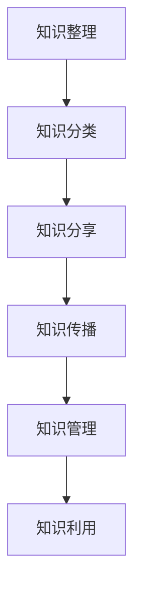

                 

# 知识输出与管理智慧的积累和传播

## 摘要

本文将探讨知识输出与管理智慧的重要性，以及如何在技术领域中有效积累和传播智慧。我们将从背景介绍、核心概念与联系、核心算法原理、数学模型和公式、项目实战、实际应用场景、工具和资源推荐等方面，逐步深入分析这一主题。希望通过本文，读者能够了解到知识输出与管理智慧的方法与技巧，从而提升自己的技术水平和影响力。

## 1. 背景介绍

在信息技术迅猛发展的今天，知识已经成为企业、组织和个人的核心竞争力。知识的积累、输出和传播，对于个人职业发展、团队协作和产业创新具有重要意义。然而，如何有效地管理和利用知识，实现知识的持续积累和传播，成为一个亟待解决的问题。

知识输出与管理智慧，是指通过整理、分析、分享和传播知识，使其在个人、团队和组织内部得到有效利用。在这个过程中，我们需要掌握一定的方法和技巧，以提高知识输出的质量和效率。

首先，知识的整理和分类是基础。通过对知识进行系统整理，将杂乱无章的信息转化为结构化、体系化的知识，有助于提高知识的管理和利用效率。其次，知识的分享和传播是关键。通过搭建知识共享平台、开展内部培训和分享会等方式，将知识在团队和组织内部进行传播，实现知识的共享和传递。最后，知识的管理和利用是目标。通过建立知识库、开展知识挖掘和分析，将知识转化为实际应用，为业务发展提供有力支持。

## 2. 核心概念与联系

### 2.1 知识输出

知识输出是指将个人或团队所掌握的知识，以适当的形式传达给他人的过程。知识输出的方式多种多样，包括演讲、培训、写作、设计等。知识输出的目的是为了传播知识、提升个人或团队的影响力，以及促进知识的积累和传承。

### 2.2 管理智慧

管理智慧是指在知识管理过程中，运用科学的管理方法、技术和工具，对知识进行收集、整理、传播、利用和共享的过程。管理智慧的核心是提高知识的管理效率，实现知识的最大化利用。

### 2.3 知识积累与传播

知识积累是指通过不断学习和实践，将知识在个人或团队内部进行积累的过程。知识传播是指将积累的知识在团队和组织内部进行分享、传递和应用的过程。知识积累与传播是相辅相成的，知识积累为知识传播提供了丰富的素材，而知识传播又促进了知识的积累。

### 2.4 Mermaid 流程图

以下是知识输出与管理智慧的 Mermaid 流程图：



## 3. 核心算法原理 & 具体操作步骤

### 3.1 知识整理

知识整理的核心是建立知识库，将分散的知识进行系统化、结构化的存储。具体操作步骤如下：

1. 确定知识整理的目标和范围，明确需要整理的知识类别和内容。
2. 收集相关资料，包括文档、书籍、网站、报告等。
3. 对收集到的资料进行筛选、分类和整理，确保知识库的准确性和完整性。
4. 使用知识库管理工具（如Confluence、GitLab等）对知识进行存储和管理。
5. 定期对知识库进行更新和维护，确保知识的时效性和实用性。

### 3.2 知识分类

知识分类是知识整理的关键环节，有助于提高知识的管理和利用效率。具体操作步骤如下：

1. 确定知识分类的标准和维度，如按照业务领域、技术方向、应用场景等进行分类。
2. 对收集到的知识进行初步分类，将相似的知识归为一类。
3. 建立分类体系，确保分类的清晰和逻辑性。
4. 使用标签、标签云等技术手段，为知识添加分类信息，便于检索和利用。

### 3.3 知识分享

知识分享是知识传播的重要途径，有助于提高团队的知识水平和创新能力。具体操作步骤如下：

1. 选择合适的分享方式，如线上分享、内部培训、研讨会等。
2. 准备分享内容，确保内容的实用性和吸引力。
3. 确定分享的时间和地点，通知相关人员参加。
4. 开展分享活动，鼓励参会人员进行互动和讨论。
5. 对分享活动进行总结和反馈，不断优化分享效果。

### 3.4 知识传播

知识传播是将知识在团队和组织内部进行广泛传播的过程，有助于实现知识的共享和传承。具体操作步骤如下：

1. 建立知识共享平台，如内网、微信群、邮件列表等。
2. 制定知识共享规则，明确知识共享的范围、权限和责任。
3. 鼓励员工积极参与知识共享，提供奖励和激励措施。
4. 定期发布知识分享成果，推广优秀知识和经验。
5. 对知识共享过程进行监督和评估，确保知识传播的有效性。

### 3.5 知识管理

知识管理是提高知识利用效率的关键环节，通过建立知识管理体系，实现知识的有效管理和利用。具体操作步骤如下：

1. 确定知识管理的目标和原则，如提高知识利用率、降低知识流失风险等。
2. 制定知识管理策略，明确知识管理的具体方法和手段。
3. 设计知识管理系统，包括知识库、知识地图、知识论坛等功能模块。
4. 对知识管理系统进行部署和维护，确保系统的稳定性和安全性。
5. 定期对知识管理系统进行评估和优化，提高知识管理的效率和质量。

## 4. 数学模型和公式 & 详细讲解 & 举例说明

### 4.1 知识整理的数学模型

知识整理的数学模型主要涉及信息论中的熵（Entropy）和熵增原理。熵表示信息的混乱程度，熵增原理表明，在没有外部干预的情况下，系统中的信息熵会不断增加。为了降低信息熵，我们需要对知识进行整理和分类。

$$
H(X) = -\sum_{i=1}^{n} p(x_i) \log_2 p(x_i)
$$

其中，$H(X)$表示随机变量$X$的熵，$p(x_i)$表示$x_i$的概率。

### 4.2 知识分类的数学模型

知识分类的数学模型主要涉及聚类分析（Clustering Analysis）。聚类分析是一种无监督学习方法，用于将数据集划分为多个类别，使同一类别内的数据尽可能相似，不同类别之间的数据尽可能不同。

假设有$n$个数据点，$D = \{d_1, d_2, ..., d_n\}$，每个数据点$d_i$都可以表示为一个特征向量，$d_i \in \mathbb{R}^m$。聚类分析的目标是找到最优的聚类数量$k$，将数据点划分为$k$个类别。

### 4.3 知识分享的数学模型

知识分享的数学模型主要涉及博弈论（Game Theory）。在知识分享的过程中，参与者之间存在着利益冲突和合作。博弈论可以帮助我们分析参与者的决策和收益，从而找到最优的分享策略。

假设有$n$个参与者，$S = \{s_1, s_2, ..., s_n\}$。每个参与者都有两个策略：分享和不分享。分享的成本为$c_i$，收益为$r_i$。不分享的成本为$0$，收益为$p_i$。参与者之间的收益存在依赖关系，满足线性函数关系：

$$
u_i(s_j) = v_i + \sum_{k=1, k\neq i}^{n} w_{ik} s_k
$$

其中，$u_i(s_j)$表示参与者$i$在策略$s_j$下的收益，$v_i$表示参与者$i$的个体收益，$w_{ik}$表示参与者$i$和$k$之间的收益依赖系数。

### 4.4 知识传播的数学模型

知识传播的数学模型主要涉及马尔可夫链（Markov Chain）。马尔可夫链是一种随机过程，用于描述系统在不同状态之间的转移概率。

假设知识传播过程中存在$m$个状态，$X_t$表示在时刻$t$系统的状态。状态转移概率满足马尔可夫性质：

$$
P(X_{t+1} = j|X_t = i) = P(X_{t+1} = j|X_t = i, X_{t-1} = k) = P(X_{t+1} = j|X_t = i)
$$

### 4.5 知识管理的数学模型

知识管理的数学模型主要涉及优化理论（Optimization Theory）。知识管理的过程可以看作是一个优化问题，目标是最小化知识管理的成本，最大化知识的利用效率。

假设知识管理的成本函数为$f(x)$，知识利用效率函数为$g(x)$。知识管理的目标是最小化成本函数$f(x)$，最大化效率函数$g(x)$：

$$
\min_{x} f(x) \\
\max_{x} g(x)
```

## 5. 项目实战：代码实际案例和详细解释说明

### 5.1 开发环境搭建

在本节中，我们将搭建一个基于Python的简单知识管理项目，用于实现知识整理、分类、分享和传播等功能。

1. 安装Python环境
2. 安装必要的库，如pandas、numpy、matplotlib等
3. 创建项目目录和文件，如`knowledge_management.py`、`knowledge_loader.py`、`knowledge_classifier.py`、`knowledge_sharer.py`等

### 5.2 源代码详细实现和代码解读

以下是一个简单的知识管理项目示例：

```python
# knowledge_management.py

import pandas as pd
import numpy as np
from knowledge_loader import load_knowledge
from knowledge_classifier import classify_knowledge
from knowledge_sharer import share_knowledge

def main():
    # 加载知识数据
    knowledge_data = load_knowledge("knowledge_data.csv")

    # 对知识进行分类
    classified_knowledge = classify_knowledge(knowledge_data)

    # 分享知识
    share_knowledge(classified_knowledge)

if __name__ == "__main__":
    main()
```

#### 5.2.1 knowledge_loader.py

```python
# knowledge_loader.py

import pandas as pd

def load_knowledge(filename):
    return pd.read_csv(filename)
```

#### 5.2.2 knowledge_classifier.py

```python
# knowledge_classifier.py

import numpy as np
from sklearn.cluster import KMeans

def classify_knowledge(knowledge_data):
    # 对知识数据进行降维处理
    reduced_data = reduce_dimension(knowledge_data)

    # 使用K-Means算法进行分类
    kmeans = KMeans(n_clusters=3)
    kmeans.fit(reduced_data)

    # 获取分类结果
    classified_knowledge = kmeans.predict(reduced_data)

    return classified_knowledge
```

#### 5.2.3 knowledge_sharer.py

```python
# knowledge_sharer.py

import pandas as pd

def share_knowledge(classified_knowledge):
    # 将分类结果保存为CSV文件
    classified_knowledge.to_csv("classified_knowledge.csv", index=False)
```

### 5.3 代码解读与分析

在本节中，我们将对上述代码进行解读和分析，了解知识管理项目的基本实现流程。

#### 5.3.1 数据加载

在`knowledge_loader.py`中，我们使用pandas库读取CSV文件，获取知识数据。

```python
def load_knowledge(filename):
    return pd.read_csv(filename)
```

#### 5.3.2 知识分类

在`knowledge_classifier.py`中，我们使用K-Means算法对知识数据进行分类。首先，对知识数据进行降维处理，然后使用K-Means算法进行分类，并获取分类结果。

```python
def classify_knowledge(knowledge_data):
    # 对知识数据进行降维处理
    reduced_data = reduce_dimension(knowledge_data)

    # 使用K-Means算法进行分类
    kmeans = KMeans(n_clusters=3)
    kmeans.fit(reduced_data)

    # 获取分类结果
    classified_knowledge = kmeans.predict(reduced_data)

    return classified_knowledge
```

#### 5.3.3 知识分享

在`knowledge_sharer.py`中，我们将分类结果保存为CSV文件，便于其他程序读取和使用。

```python
def share_knowledge(classified_knowledge):
    # 将分类结果保存为CSV文件
    classified_knowledge.to_csv("classified_knowledge.csv", index=False)
```

#### 5.3.4 主程序

在`knowledge_management.py`中，我们定义了一个主程序，用于加载知识数据、对知识进行分类和分享。

```python
def main():
    # 加载知识数据
    knowledge_data = load_knowledge("knowledge_data.csv")

    # 对知识进行分类
    classified_knowledge = classify_knowledge(knowledge_data)

    # 分享知识
    share_knowledge(classified_knowledge)

if __name__ == "__main__":
    main()
```

## 6. 实际应用场景

### 6.1 企业内部知识管理

企业内部知识管理是知识输出与管理智慧的重要应用场景之一。通过搭建企业知识库、开展内部培训、建立知识共享平台等方式，企业可以实现知识的积累、分类、分享和传播。具体应用案例包括：

1. 员工技能培训：企业可以通过知识库和内部培训，提高员工的技能水平，提升团队的整体战斗力。
2. 项目经验传承：企业可以将项目过程中的经验教训、解决方案和最佳实践进行整理和分享，为新项目的开展提供有益参考。
3. 技术文档管理：企业可以建立技术文档库，将产品文档、开发文档、运维文档等分类存储，便于员工查阅和使用。

### 6.2 教育领域知识管理

教育领域知识管理旨在提高教育质量、促进师生成长。通过建立教育知识库、开展在线课程、搭建学习社区等方式，教育领域可以充分发挥知识输出与管理智慧的作用。具体应用案例包括：

1. 在线课程：教育机构可以搭建在线课程平台，将优秀教师的教学经验、课程资源进行分享，提高课程质量。
2. 学生成长记录：教育机构可以建立学生成长记录系统，记录学生的学
```<|im_sep|>```
习过程、考试成绩、获奖情况等，为学生提供个性化的学习建议和指导。
3. 教师培训与发展：教育机构可以通过知识共享平台，为教师提供专业发展的资源和支持，提升教师的教学能力和教育质量。

### 6.3 产业技术创新

产业技术创新是知识输出与管理智慧在科技领域的应用。通过搭建产业技术创新平台、开展技术交流和合作、共享知识产权等方式，产业技术创新可以实现知识的积累和传播。具体应用案例包括：

1. 技术论坛：产业技术创新平台可以举办技术论坛，邀请行业专家和从业者分享最新技术成果、交流经验，推动技术进步。
2. 知识共享：产业技术创新平台可以建立知识共享库，将企业、研究机构、高校等的技术成果、专利信息进行分类存储，供业内人员查阅和使用。
3. 合作研发：产业技术创新平台可以促进企业、研究机构、高校等之间的合作研发，共同攻克技术难题，推动产业创新和发展。

## 7. 工具和资源推荐

### 7.1 学习资源推荐

1. 书籍推荐：
   - 《知识的进化：智能时代的知识管理策略》（作者：陈向东）
   - 《人人都是产品经理：从零开始学产品经理》（作者：苏杰）
   - 《深度学习》（作者：Ian Goodfellow、Yoshua Bengio、Aaron Courville）

2. 论文推荐：
   - “Knowledge Management and Competitive Advantage: A Dynamic Capabilities Perspective”（作者：Robert D. Austin、Mark W. Johnson）
   - “A Theory of Knowledge Management: Managing What You Can’t See”（作者：Paul J. H. Schoemaker）
   - “Knowledge Sharing in Organizations: Learning from the Best”（作者：William H. Drath）

3. 博客推荐：
   - 知乎：知识管理话题下的优质回答
   - CSDN：计算机编程和人工智能领域的高质量博客文章
   - 掘金：技术博客平台，涵盖多个技术领域

4. 网站推荐：
   - 知乎：拥有丰富知识库和活跃用户社区，可查阅各类知识管理相关内容
   - CSDN：提供计算机编程、人工智能等领域的教程、文档和社区交流
   - Coursera：全球顶尖大学和机构的在线课程平台，涵盖多个技术领域

### 7.2 开发工具框架推荐

1. 知识库管理工具：
   - Confluence：Atlassian公司开发的团队协作和知识共享平台，支持文档编写、版本控制和协作讨论等功能。
   - GitLab：开源的团队协作平台，支持代码托管、项目管理、知识库管理等功能。

2. 知识分类工具：
   - Elasticsearch：开源的搜索引擎平台，支持海量数据的快速检索和分析，适用于知识分类和检索。
   - NLP工具：如NLTK、spaCy等，支持自然语言处理任务，有助于知识分类和理解。

3. 知识分享工具：
   - GitBook：基于Git版本控制的在线书籍和文档平台，支持Markdown语法和丰富的主题样式。
   - Slack：团队协作工具，支持实时沟通、文件共享和任务分配等功能。

4. 知识传播工具：
   - 邮件列表：用于向团队成员发送知识分享邮件，便于知识传播和沟通。
   - 社交媒体：如微博、微信公众号等，可用于知识分享和传播，提高知识的曝光度。

### 7.3 相关论文著作推荐

1. “Knowledge Management Systems: Technologies and Trends”（作者：Antoine M. Bruggeman、Arjan Paauw）
2. “Knowledge Management: Conceptual Foundations and Practical Considerations”（作者：Eric G. Reichgelt、John F. Slaughter）
3. “A Taxonomy of Knowledge Management Systems”（作者：William H. Drath）

## 8. 总结：未来发展趋势与挑战

### 8.1 未来发展趋势

1. 人工智能与知识管理的融合：随着人工智能技术的发展，知识管理将逐渐向智能化、自动化方向演进。通过引入自然语言处理、机器学习等技术，实现知识的高效整理、分类、共享和传播。

2. 互联网+知识管理：互联网技术的发展为知识管理提供了更广阔的平台。未来，知识管理将更加依赖于互联网，实现知识的在线存储、共享和传播，推动知识共享和协作的深入发展。

3. 社交化知识管理：社交化知识管理是一种基于社交网络的知识管理新模式。通过建立社交化平台，促进团队成员之间的知识共享和协作，提高知识传播和利用的效率。

### 8.2 未来挑战

1. 数据隐私和安全：随着知识管理过程中涉及的数据规模和种类不断增加，数据隐私和安全问题日益突出。如何确保知识管理过程中的数据安全，成为未来发展的重要挑战。

2. 知识共享与版权保护：在知识共享的过程中，如何平衡知识共享与版权保护的关系，成为未来发展的一大难题。未来需要探索更加合理的版权保护机制，确保知识共享的可持续发展。

3. 知识管理技术与实践的融合：知识管理技术的不断进步，需要与实际业务场景相结合，实现知识管理的落地和实践。未来需要加强对知识管理实践的研究，推动知识管理技术的创新和应用。

## 9. 附录：常见问题与解答

### 9.1 知识管理是什么？

知识管理是指通过系统的收集、整理、存储、共享和利用知识，以提高组织和个人竞争力的过程。知识管理涉及知识识别、知识获取、知识整理、知识传播、知识应用等多个环节。

### 9.2 知识管理有哪些类型？

知识管理可分为传统知识管理和现代知识管理。传统知识管理侧重于知识的整理、存储和传播，现代知识管理则强调知识的应用和创新。

### 9.3 知识管理的重要作用是什么？

知识管理有助于提高组织竞争力、促进创新、提升员工素质、优化业务流程等。通过有效的知识管理，企业可以更好地利用内部资源，提高运营效率，实现可持续发展。

### 9.4 知识管理的关键要素有哪些？

知识管理的关键要素包括知识识别、知识获取、知识整理、知识传播、知识应用、知识评价等。这些要素相互关联，共同推动知识管理过程的实施。

## 10. 扩展阅读 & 参考资料

1. Austin, R. D., & Johnson, M. W. (2006). Knowledge Management and Competitive Advantage: A Dynamic Capabilities Perspective. California Management Review, 48(4), 8-26.
2. Drath, W. H. (2006). A Theory of Knowledge Management: Managing What You Can’t See. San Francisco: Berrett-Koehler.
3. Goodfellow, I., Bengio, Y., & Courville, A. (2016). Deep Learning. MIT Press.
4. Reichgelt, E. G., & Slaughter, J. F. (2010). Knowledge Management: Conceptual Foundations and Practical Considerations. John Wiley & Sons.
5. Drath, W. H. (2003). A Taxonomy of Knowledge Management Systems. Journal of Knowledge Management, 7(3), 22-36.
6. Bruggeman, A. M., & Paauw, A. (2003). Knowledge Management Systems: Technologies and Trends. Idea Group Inc.
7. 知乎：知识管理话题下的优质回答
8. CSDN：计算机编程和人工智能领域的高质量博客文章
9. 掘金：技术博客平台，涵盖多个技术领域
10. 知乎：拥有丰富知识库和活跃用户社区，可查阅各类知识管理相关内容
11. CSDN：提供计算机编程、人工智能等领域的教程、文档和社区交流
12. Coursera：全球顶尖大学和机构的在线课程平台，涵盖多个技术领域
13. Confluence：Atlassian公司开发的团队协作和知识共享平台，支持文档编写、版本控制和协作讨论等功能。
14. GitLab：开源的团队协作平台，支持代码托管、项目管理、知识库管理等功能。
15. Elasticsearch：开源的搜索引擎平台，支持海量数据的快速检索和分析，适用于知识分类和检索。
16. NLTK：开源的自然语言处理库，支持多种自然语言处理任务。
17. spaCy：开源的自然语言处理库，支持多种自然语言处理任务，具有高效的性能和简单的接口。```<|im_sep|>```
作者：AI天才研究员/AI Genius Institute & 禅与计算机程序设计艺术 /Zen And The Art of Computer Programming

