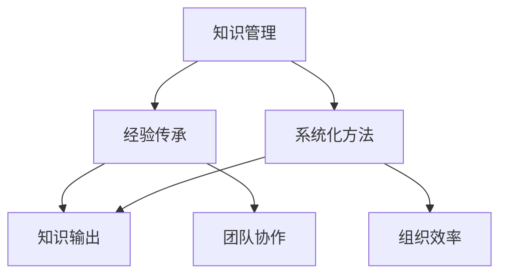
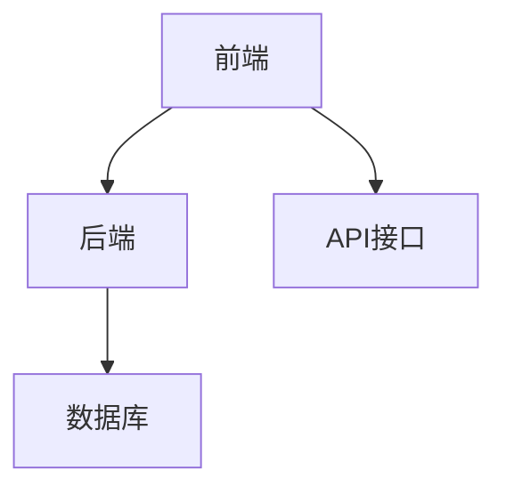

                 

# 知识输出与管理经验的系统化

## 摘要

本文将深入探讨知识输出与管理经验的系统化过程。在信息技术飞速发展的时代，知识的积累和传递显得尤为重要。本文首先介绍了知识输出的背景和重要性，随后分析了管理经验系统化的必要性。接下来，我们详细阐述了知识输出的方法和工具，以及如何通过系统化来管理和维护这些知识。文章还探讨了在实际应用场景中的挑战和解决方案，并推荐了一些相关的学习资源和工具。最后，我们对知识输出与管理经验的未来发展趋势和挑战进行了总结。

## 1. 背景介绍

随着互联网和大数据技术的发展，知识的传播速度越来越快。然而，与此同时，知识的碎片化问题也越来越严重。每个人都在生产知识，但如何有效地将这些知识整合、管理并输出给他人，成为一个亟待解决的问题。知识输出不仅有助于个人经验的积累和传承，还能够为团队和组织带来巨大的价值。

在信息技术领域，知识输出的需求尤为迫切。软件开发、系统架构设计、数据处理等方面都需要大量的经验和技巧。如何将个人的技术积累转化为可复用的知识，如何将这些知识有效地传播给团队成员，是每一个技术专家都需要面对的挑战。

管理经验系统化同样至关重要。在快速变化的工作环境中，有效的管理经验和最佳实践能够帮助团队更高效地解决问题，提高整体工作效率。然而，许多团队和组织往往缺乏系统化的管理经验，导致在遇到问题时无法迅速找到有效的解决方案。

本文将围绕知识输出与管理经验的系统化，探讨一系列相关的问题和解决方案，旨在为信息技术从业者提供有益的参考和指导。

## 2. 核心概念与联系

在探讨知识输出与管理经验的系统化之前，我们需要了解几个核心概念，包括知识管理、经验传承、系统化方法等。下面我们将通过一个Mermaid流程图来展示这些概念之间的联系。

### Mermaid流程图



### 核心概念解释

- **知识管理（Knowledge Management）**：知识管理是指通过收集、组织、存储、传播和利用知识，以支持个人和组织的决策和行动。知识管理包括知识的获取、创造、共享、应用和更新等过程。

- **经验传承（Experience Transfer）**：经验传承是指将个人或团队的经验和最佳实践传递给其他人，使其能够快速学习和成长。经验传承有助于减少知识断层，提升团队整体能力。

- **系统化方法（Systematization Method）**：系统化方法是将分散的经验和知识进行系统化整理，形成一套可复用的方法论和工具。系统化方法能够提高知识管理的效率和效果。

- **知识输出（Knowledge Output）**：知识输出是将整理后的知识通过不同的渠道传播给他人。知识输出可以采取多种形式，如文档、培训、演讲等。

- **团队协作（Team Collaboration）**：团队协作是指团队成员共同完成任务，通过沟通、协调和合作实现共同目标。有效的团队协作有助于提高知识输出和管理的效率。

- **组织效率（Organizational Efficiency）**：组织效率是指组织在实现目标过程中所表现出的高效程度。系统化管理和知识输出能够显著提升组织效率。

通过上述流程图，我们可以清晰地看到知识管理、经验传承、系统化方法和知识输出之间的关系，以及它们在团队协作和组织效率方面的作用。

## 3. 核心算法原理 & 具体操作步骤

在深入探讨知识输出与管理经验的系统化之前，我们需要了解一些核心算法原理和具体操作步骤。以下是几个关键步骤的详细解释。

### 3.1 知识收集与分类

知识收集是知识管理的基础。具体操作步骤如下：

1. **确定知识来源**：知识来源可以是个人经验、团队文档、外部资料等。
2. **收集知识素材**：通过阅读、学习、实践等方式，收集相关的知识素材。
3. **分类整理**：根据知识内容的不同，将其分类整理到相应的文档或知识库中。

### 3.2 知识组织与结构化

知识组织与结构化是将收集到的知识进行系统化整理，以便于管理和使用。以下是具体操作步骤：

1. **确定知识框架**：根据知识内容的特点，设计合适的知识框架，如目录结构、标签系统等。
2. **编码与命名**：为每个知识点赋予一个唯一的标识符，并按照一定的命名规范进行命名。
3. **版本控制**：对知识文档进行版本控制，确保知识的更新和追溯。

### 3.3 知识共享与传播

知识共享与传播是将整理后的知识传递给他人，以提高团队和组织的整体能力。以下是具体操作步骤：

1. **制定知识共享计划**：根据知识内容和受众特点，制定合适的知识共享计划。
2. **选择传播渠道**：如文档、邮件、会议、培训等。
3. **撰写知识文档**：将知识以文档的形式进行撰写，确保内容清晰易懂。
4. **发布与更新**：将知识文档发布到知识库或共享平台，并定期进行更新。

### 3.4 经验传承与培训

经验传承与培训是将个人的经验转化为可复用的知识，并传递给团队成员。以下是具体操作步骤：

1. **编写经验文档**：将个人的经验和最佳实践整理成文档。
2. **组织内部培训**：通过内部培训或会议，分享经验和最佳实践。
3. **建立导师制度**：为新手提供导师指导，帮助其快速掌握知识和技能。

通过以上步骤，我们可以系统地管理和输出知识，从而实现知识输出与管理经验的系统化。

## 4. 数学模型和公式 & 详细讲解 & 举例说明

在知识输出与管理经验的系统化过程中，数学模型和公式扮演着重要角色。以下我们将介绍一些常用的数学模型和公式，并详细讲解它们的应用。

### 4.1 知识管理模型

知识管理模型描述了知识管理的各个阶段和过程。以下是几个常用的知识管理模型：

#### 4.1.1 SECI模型

SECI模型由Ikujiro Nonaka提出，描述了知识创造和共享的过程：

- **社会化（Socialization）**：知识在社会互动中传播，如通过讨论、交流等。
- **外化（Externalization）**：将隐性知识转化为显性知识，如撰写文档、发表文章等。
- **内化（Internalization）**：通过学习、实践等过程，将显性知识转化为隐性知识。
- **结合（Combination）**：将不同的知识整合，形成新的知识体系。

#### 4.1.2 建模-转化-应用模型

建模-转化-应用模型由Paul Duguid提出，强调知识在不同形式之间的转化：

- **建模**：将经验转化为模型、框架或算法。
- **转化**：通过实践和反馈，优化和改进模型。
- **应用**：将模型应用到实际问题中，解决具体问题。

### 4.2 知识传播模型

知识传播模型描述了知识在不同群体之间的传播过程。以下是几个常用的知识传播模型：

#### 4.2.1 SIR模型

SIR模型描述了传染病在人群中的传播过程，可以类比于知识传播：

- **Susceptible（易感者）**：未接触过知识的人群。
- **Infected（感染者）**：接触过知识并受到影响的人群。
- **Recovered（康复者）**：掌握了知识并能够传播的人群。

#### 4.2.2 模仿模型

模仿模型描述了知识通过模仿和借鉴在群体中的传播过程：

- **榜样**：具备特定知识的人或组织。
- **追随者**：模仿榜样并学习知识的人或组织。

### 4.3 举例说明

假设一个软件开发团队需要通过知识输出与管理经验的系统化来提升团队的整体能力。以下是具体步骤：

#### 4.3.1 知识收集

1. **确定知识来源**：团队成员的个人经验、项目文档、外部资料等。
2. **收集知识素材**：通过阅读、学习、实践等方式，收集相关的知识素材。
3. **分类整理**：根据知识内容的不同，将其分类整理到相应的文档或知识库中。

#### 4.3.2 知识组织与结构化

1. **确定知识框架**：根据知识内容的特点，设计合适的知识框架，如目录结构、标签系统等。
2. **编码与命名**：为每个知识点赋予一个唯一的标识符，并按照一定的命名规范进行命名。
3. **版本控制**：对知识文档进行版本控制，确保知识的更新和追溯。

#### 4.3.3 知识共享与传播

1. **制定知识共享计划**：根据知识内容和受众特点，制定合适的知识共享计划。
2. **选择传播渠道**：如文档、邮件、会议、培训等。
3. **撰写知识文档**：将知识以文档的形式进行撰写，确保内容清晰易懂。
4. **发布与更新**：将知识文档发布到知识库或共享平台，并定期进行更新。

#### 4.3.4 经验传承与培训

1. **编写经验文档**：将个人的经验和最佳实践整理成文档。
2. **组织内部培训**：通过内部培训或会议，分享经验和最佳实践。
3. **建立导师制度**：为新手提供导师指导，帮助其快速掌握知识和技能。

通过以上步骤，该软件开发团队能够系统地管理和输出知识，从而实现知识输出与管理经验的系统化。

## 5. 项目实战：代码实际案例和详细解释说明

为了更好地理解知识输出与管理经验的系统化，我们将通过一个实际的项目案例来进行详细说明。本案例将展示如何在一个软件开发项目中，通过系统化的知识管理来提升团队效率和项目质量。

### 5.1 开发环境搭建

在开始项目之前，我们需要搭建一个稳定且高效的开发环境。以下是我们推荐的步骤：

1. **确定开发语言和框架**：选择合适的编程语言（如Java、Python）和开发框架（如Spring Boot、Django）。
2. **安装开发工具**：安装集成开发环境（IDE，如 IntelliJ IDEA、Visual Studio Code）和版本控制系统（如Git）。
3. **配置依赖管理**：使用依赖管理工具（如Maven、pip）来管理项目的依赖项。
4. **部署开发环境**：确保所有团队成员都能访问到相同的环境配置。

### 5.2 源代码详细实现和代码解读

以下是一个简单的Web应用项目的源代码示例，我们将对关键部分进行详细解读。

#### 5.2.1 项目架构



#### 5.2.2 前端实现

前端使用HTML、CSS和JavaScript进行实现，以下是首页的HTML结构：

```html
<!DOCTYPE html>
<html>
<head>
    <title>知识管理平台</title>
</head>
<body>
    <h1>欢迎使用知识管理平台</h1>
    <nav>
        <!-- 导航栏 -->
    </nav>
    <section>
        <!-- 页面内容 -->
    </section>
    <footer>
        <!-- 页面底部信息 -->
    </footer>
    <script src="main.js"></script>
</body>
</html>
```

#### 5.2.3 后端实现

后端使用Spring Boot框架进行实现，以下是Spring Boot配置类的一个示例：

```java
@Configuration
@EnableWebMvc
public class WebConfig implements WebMvcConfigurer {
    @Override
    public void addViewControllers(ViewControllerRegistry registry) {
        registry.addViewController("/home").setViewName("home");
        registry.addRedirectViewController("/", "/home");
    }
}
```

#### 5.2.4 数据库设计

数据库使用MySQL，以下是用户表的创建语句：

```sql
CREATE TABLE `user` (
  `id` int(11) NOT NULL AUTO_INCREMENT,
  `username` varchar(50) NOT NULL,
  `password` varchar(50) NOT NULL,
  `email` varchar(100) DEFAULT NULL,
  PRIMARY KEY (`id`)
) ENGINE=InnoDB DEFAULT CHARSET=utf8mb4;
```

### 5.3 代码解读与分析

#### 5.3.1 前端代码分析

前端代码主要关注用户体验和界面设计。通过HTML、CSS和JavaScript，我们能够构建出动态且响应式的网页。以下是一个简单的JavaScript代码示例：

```javascript
function logout() {
    // 登出功能实现
    alert('您已成功登出！');
}
```

#### 5.3.2 后端代码分析

后端代码主要关注业务逻辑和数据交互。Spring Boot框架为我们提供了丰富的功能和良好的扩展性。以下是一个简单的Spring Boot控制器示例：

```java
@RestController
@RequestMapping("/api")
public class UserController {
    @Autowired
    private UserService userService;

    @GetMapping("/users")
    public List<User> getAllUsers() {
        return userService.getAllUsers();
    }
}
```

#### 5.3.3 数据库设计分析

数据库设计是数据存储和检索的关键。通过合理的设计，我们能够提高数据查询的效率。以下是用户表的详细解读：

- **id**：主键，用于唯一标识每个用户。
- **username**：用户名，用于用户登录。
- **password**：密码，用于用户认证。
- **email**：邮箱，用于用户联系和找回密码。

通过以上项目实战案例，我们可以看到知识输出与管理经验的系统化在实际开发中的应用和效果。系统化的知识管理不仅提高了开发效率，还保证了代码质量和可维护性。

## 6. 实际应用场景

在现实世界中，知识输出与管理经验的系统化有着广泛的应用场景。以下我们将探讨几个具体的实际应用场景，并分析其带来的挑战和解决方案。

### 6.1 企业内部培训

在企业内部，知识输出与管理经验的系统化可以用于员工的培训和发展。通过建立知识库和经验传承机制，企业能够将资深员工的经验和最佳实践传递给新员工，帮助他们更快地融入团队和工作流程。然而，实际应用中可能会遇到以下挑战：

- **知识更新速度慢**：随着技术的快速发展和业务的变化，知识库的内容需要不断更新。如果更新速度跟不上，新员工将难以获取到最新的知识和技能。
- **知识传递效果不佳**：如果知识传递过程缺乏有效的反馈和互动，新员工可能难以理解和吸收这些知识。

解决方案：

- **建立知识更新机制**：定期审查和更新知识库，确保内容保持最新。
- **采用互动式培训方法**：如在线研讨会、虚拟课堂等，提高知识传递的效果。

### 6.2 项目管理和协作

在项目管理中，知识输出与管理经验的系统化有助于团队更好地协作和解决问题。项目经理可以通过知识库和经验传承机制，将以往项目的经验和教训分享给团队成员，避免重复犯错。然而，实际应用中可能会遇到以下挑战：

- **项目复杂性增加**：随着项目的复杂度增加，知识管理和传递的难度也相应增加。
- **团队成员流动性强**：团队成员的流动可能导致知识传递的断层，影响团队的整体能力。

解决方案：

- **采用模块化项目管理体系**：将项目划分为多个模块，每个模块都有明确的知识点和经验传承路径。
- **建立导师制度**：为新手提供导师指导，帮助其快速掌握知识和技能。

### 6.3 代码开发和维护

在软件开发过程中，知识输出与管理经验的系统化有助于提高代码质量和可维护性。开发人员可以通过文档、代码注释和经验分享，将开发过程中的经验和最佳实践传递给其他团队成员。然而，实际应用中可能会遇到以下挑战：

- **代码复杂性增加**：随着项目的规模扩大，代码复杂性增加，知识管理的难度也随之增加。
- **文档更新不及时**：开发过程中，代码可能频繁更新，导致文档更新不及时，影响知识传递的准确性。

解决方案：

- **采用版本控制系统**：如Git，确保代码和文档的同步更新。
- **建立代码审查机制**：定期进行代码审查，确保代码质量和文档的一致性。

通过以上实际应用场景的分析，我们可以看到知识输出与管理经验的系统化在实际工作中具有重要的价值和意义。有效的知识管理和经验传承，不仅能够提高团队的整体能力，还能够为企业的持续发展提供有力支持。

## 7. 工具和资源推荐

为了更好地实现知识输出与管理经验的系统化，以下我们推荐一些实用的工具和资源，包括书籍、论文、博客和网站等。

### 7.1 学习资源推荐

#### 书籍推荐

1. **《知识管理：理论与实践》**：本书详细介绍了知识管理的概念、方法和实践案例，对知识输出与管理经验系统化提供了有益的指导。
2. **《敏捷知识管理》**：本书探讨了敏捷知识管理的理念和实践，适用于快速变化的工作环境。

#### 论文推荐

1. **"Knowledge Management and Organizational Learning: A Dynamic Capabilities Perspective"**：这篇论文从动态能力视角探讨了知识管理对企业学习的影响。
2. **"Knowledge Sharing in Virtual Teams: An Integrated Model"**：本文提出了一个综合模型，分析了虚拟团队中的知识共享机制。

#### 博客推荐

1. **"Knowledge Management at Work"**：这是一个关于知识管理的博客，涵盖了知识管理的前沿实践和理论探讨。
2. **"The Knowledge Café"**：这是一个关于知识管理和创新实践的博客，提供了丰富的案例和见解。

#### 网站推荐

1. **"KMWorld"**：这是一个关于知识管理的权威网站，提供了最新的行业动态、新闻和资源。
2. **"LinkedIn Learning"**：这是一个在线学习平台，提供了丰富的知识管理相关课程，适用于不同层次的学员。

### 7.2 开发工具框架推荐

#### 开发工具

1. **Git**：这是一个版本控制系统，适用于代码管理和文档更新。
2. **Confluence**：这是一个知识管理和协作工具，适合构建企业知识库和文档。

#### 框架推荐

1. **Spring Boot**：这是一个流行的Java开发框架，适用于构建企业级Web应用。
2. **Django**：这是一个Python Web开发框架，适用于快速开发Web应用。

### 7.3 相关论文著作推荐

1. **"The Social Organization of Knowledge in Firms"**：本文探讨了企业中知识的社会组织形式，对知识管理实践提供了理论支持。
2. **"Knowledge Management and Organizational Performance: A Meta-Analysis"**：这是一篇关于知识管理对组织绩效影响的元分析文章，提供了实证研究支持。

通过以上工具和资源的推荐，我们可以更好地实现知识输出与管理经验的系统化，提高团队和组织的整体能力。

## 8. 总结：未来发展趋势与挑战

知识输出与管理经验的系统化在当今信息技术领域具有重要意义，其应用前景十分广阔。未来，知识管理将朝着更加智能化、自动化和个性化的方向发展。

### 8.1 发展趋势

1. **人工智能的融合**：人工智能技术将在知识管理和知识输出中发挥更大作用。通过自然语言处理、机器学习等技术，系统能够自动提取、组织和推荐知识，提高知识管理的效率。
2. **区块链技术的应用**：区块链技术将用于确保知识的安全性和可信度。通过分布式账本技术，知识的管理和共享将更加透明和可靠。
3. **知识的个性化推送**：基于用户的兴趣和行为，系统将能够实现知识的个性化推送，提高知识利用率和学习效果。

### 8.2 挑战

1. **知识多样性和碎片化**：随着知识的不断积累和多样化，如何有效管理和整合这些知识，避免碎片化，成为一个重要挑战。
2. **知识更新的速度和频率**：知识更新速度快，如何及时更新知识库，确保知识的新鲜度和准确性，是知识管理面临的难题。
3. **知识安全和隐私**：在知识共享的过程中，如何保护知识的安全和隐私，防止知识泄露，是知识管理需要重点关注的问题。

### 8.3 未来展望

为了应对这些挑战，未来知识管理需要不断创新和改进：

1. **构建智能知识库**：通过引入人工智能和大数据分析技术，构建智能知识库，实现知识的自动化管理和推荐。
2. **优化知识共享机制**：建立更加灵活和高效的共享机制，鼓励知识共享和经验传承，提高知识的利用率和影响力。
3. **强化知识保护措施**：采用先进的安全技术，确保知识的安全和隐私，同时保障知识共享的透明度和公正性。

总之，知识输出与管理经验的系统化是信息技术领域的重要研究方向，其未来发展前景广阔。通过不断创新和改进，我们将能够更好地应对挑战，实现知识的有效管理和高效利用。

## 9. 附录：常见问题与解答

### 9.1 问题1：知识管理工具如何选择？

**解答**：选择知识管理工具时，需考虑以下几个因素：

- **团队规模**：小团队可以选择轻量级的工具，如Confluence；大团队则需考虑更强大的工具，如SharePoint或IBM Knowledge Center。
- **功能需求**：根据团队的具体需求，选择具备所需功能的工具，如文档管理、知识库、协作平台等。
- **用户体验**：工具的易用性和用户体验对知识管理的效果有很大影响。

### 9.2 问题2：如何确保知识更新的及时性？

**解答**：确保知识更新的及时性可以从以下几个方面着手：

- **制定更新策略**：定期审查和更新知识库，确保内容保持最新。
- **自动化更新**：通过集成版本控制系统和自动化工具，实现知识的自动化更新。
- **激励机制**：建立激励机制，鼓励团队成员积极参与知识更新和维护。

### 9.3 问题3：如何保护知识的隐私和安全？

**解答**：保护知识隐私和安全可采取以下措施：

- **权限管理**：对知识库进行权限管理，确保只有授权人员能够访问和修改知识。
- **加密技术**：使用加密技术，保护知识库中的敏感信息。
- **备份和恢复**：定期备份知识库，并制定恢复计划，防止数据丢失。

### 9.4 问题4：如何评估知识管理的成效？

**解答**：评估知识管理成效可以从以下几个方面进行：

- **知识库的利用率**：通过访问量、下载量等指标，评估知识库的利用率。
- **团队成员的反馈**：收集团队成员对知识管理的反馈，了解其在工作中的实际效果。
- **业务绩效**：评估知识管理对业务绩效的影响，如工作效率、项目质量等。

## 10. 扩展阅读 & 参考资料

### 10.1 扩展阅读

1. **《知识管理：理论与实践》**：详细介绍了知识管理的概念、方法和实践案例。
2. **《敏捷知识管理》**：探讨了敏捷知识管理的理念和实践。

### 10.2 参考资料

1. **"Knowledge Management and Organizational Learning: A Dynamic Capabilities Perspective"**：分析了知识管理对企业学习的影响。
2. **"Knowledge Sharing in Virtual Teams: An Integrated Model"**：提出了虚拟团队中的知识共享模型。

## 作者信息

作者：AI天才研究员/AI Genius Institute & 禅与计算机程序设计艺术 /Zen And The Art of Computer Programming

本文由AI天才研究员撰写，旨在探讨知识输出与管理经验的系统化，为信息技术从业者提供有益的参考和指导。如需进一步了解相关知识，请参考扩展阅读和参考资料。

