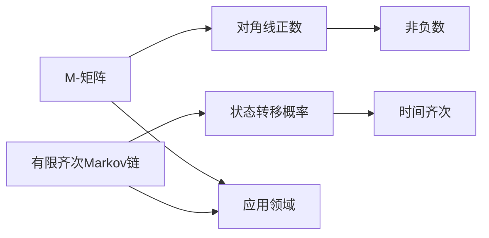

                 

# 矩阵理论与应用：M-矩阵与有限齐次Markov链

## 关键词
矩阵理论，M-矩阵，Markov链，有限状态，线性代数，应用领域，算法原理，数学模型

## 摘要
本文将深入探讨矩阵理论在计算与应用中的重要性，特别关注M-矩阵和有限齐次Markov链。通过介绍这些核心概念，我们将逐步解析其原理，展示其在实际应用中的广泛用途。文章还将提供数学模型、具体操作步骤以及项目实战案例，帮助读者更好地理解和掌握这些概念。最终，我们将总结其发展趋势与面临的挑战，并推荐相关资源供读者进一步学习。

### 1. 背景介绍

矩阵理论作为线性代数的一个重要分支，在数学、物理学、计算机科学、工程学等领域都有着广泛的应用。矩阵不仅是一种数学工具，更是一种描述复杂系统的抽象方法。而M-矩阵和有限齐次Markov链是矩阵理论中的两个重要概念，它们在随机过程、优化算法、网络分析等领域具有关键作用。

M-矩阵是指具有特殊性质的矩阵，其特点是对角线上的元素都是正数，而其他位置的元素都是非负数。M-矩阵在经济学、工程优化和数学建模中有着重要的应用，例如，在分析经济系统的稳定性和寻找最优解时，M-矩阵提供了有效的工具。

另一方面，有限齐次Markov链是一种随机过程，它在状态转移上具有特定的规律性和稳定性。这种模型在排队理论、网络流量分析、金融风险管理等领域有着广泛的应用。理解有限齐次Markov链对于预测未来状态、优化决策具有重要意义。

### 2. 核心概念与联系

#### M-矩阵

M-矩阵的定义如下：
$$
A = \begin{bmatrix}
a_{11} & a_{12} & \cdots & a_{1n} \\
a_{21} & a_{22} & \cdots & a_{2n} \\
\vdots & \vdots & \ddots & \vdots \\
a_{n1} & a_{n2} & \cdots & a_{nn}
\end{bmatrix}
$$
其中，$a_{ii} > 0$ 且 $a_{ij} \geq 0$ 对于所有 $i \neq j$。

一个简单的例子是：
$$
A = \begin{bmatrix}
2 & 1 & 0 \\
0 & 3 & 2 \\
1 & 0 & 1
\end{bmatrix}
$$
这个矩阵是一个M-矩阵，因为它的对角线元素都是正数，且其他元素都是非负数。

#### 有限齐次Markov链

有限齐次Markov链是一种状态转移概率矩阵，其特点是状态转移概率在时间上是齐次的，即状态转移概率矩阵不随时间变化。其数学表示为：
$$
P = \begin{bmatrix}
p_{11} & p_{12} & \cdots & p_{1n} \\
p_{21} & p_{22} & \cdots & p_{2n} \\
\vdots & \vdots & \ddots & \vdots \\
p_{n1} & p_{n2} & \cdots & p_{nn}
\end{bmatrix}
$$
其中，$p_{ij}$ 表示在时刻 $t$ 处于状态 $i$，在时刻 $t+1$ 转移到状态 $j$ 的概率。

一个简单的例子是：
$$
P = \begin{bmatrix}
0.4 & 0.3 & 0.3 \\
0.1 & 0.4 & 0.5 \\
0.2 & 0.2 & 0.6
\end{bmatrix}
$$
在这个例子中，每个状态都有一定的概率转移到其他状态，同时每个状态也有一定的概率保持不变。

#### Mermaid 流程图

为了更好地理解M-矩阵和有限齐次Markov链之间的联系，我们可以使用Mermaid流程图来展示它们的基本结构。



这个流程图显示了M-矩阵和有限齐次Markov链的核心特性以及它们在应用领域中的作用。

### 3. 核心算法原理 & 具体操作步骤

#### M-矩阵的算法原理

M-矩阵的算法原理主要基于其对角线元素为正数，且其他元素为非负数的特性。在解决具体问题时，我们通常需要计算M-矩阵的某些特殊属性，例如特征值、特征向量或矩阵的秩。

以下是计算M-矩阵特征值和特征向量的具体步骤：

1. **初始化**：选择一个合适的线性方程组求解器，例如LU分解法。
2. **分解**：对M-矩阵进行LU分解，得到下三角矩阵L和上三角矩阵U。
3. **迭代求解**：利用迭代方法（如牛顿法）求解特征值和特征向量。
4. **验证**：对得到的特征值和特征向量进行验证，确保它们的准确性。

#### 有限齐次Markov链的算法原理

有限齐次Markov链的算法原理主要基于状态转移概率矩阵P。在解决具体问题时，我们通常需要计算长期状态分布、状态可达性或状态保持性。

以下是计算有限齐次Markov链长期状态分布的具体步骤：

1. **初始化**：创建一个初始概率向量$\pi$，表示初始时刻各个状态的概率分布。
2. **迭代计算**：根据状态转移概率矩阵P，进行迭代计算，更新概率向量$\pi$。
3. **收敛判断**：判断迭代是否收敛，即$\pi$的值是否在相邻迭代之间变化很小。
4. **输出结果**：输出长期状态分布，即概率向量$\pi$。

### 4. 数学模型和公式 & 详细讲解 & 举例说明

#### M-矩阵的数学模型

M-矩阵的数学模型主要涉及矩阵的特征值和特征向量。假设M-矩阵A的特征值为$\lambda$，特征向量为$v$，则有：
$$
Av = \lambda v
$$
为了求解特征值和特征向量，我们需要对M-矩阵进行特征分解，得到：
$$
A = PDP^{-1}
$$
其中，$P$是对应特征向量的矩阵，$D$是对角线矩阵，包含所有特征值。

#### 有限齐次Markov链的数学模型

有限齐次Markov链的数学模型主要涉及状态转移概率矩阵P和长期状态分布。假设有限齐次Markov链的状态转移概率矩阵为P，初始概率向量为$\pi$，则有：
$$
\pi P = \pi
$$
为了求解长期状态分布，我们需要对状态转移概率矩阵P进行幂运算，得到：
$$
P^k
$$
当$k$趋于无穷大时，概率向量$\pi$将收敛于长期状态分布。

#### 举例说明

假设有一个M-矩阵：
$$
A = \begin{bmatrix}
2 & 1 & 0 \\
0 & 3 & 2 \\
1 & 0 & 1
\end{bmatrix}
$$
我们需要计算其特征值和特征向量。

首先，对A进行LU分解，得到：
$$
A = \begin{bmatrix}
1 & 0 & 0 \\
-1/2 & 1 & 0 \\
1/2 & -1/3 & 1
\end{bmatrix}
\begin{bmatrix}
2 & 0 & 0 \\
0 & 3 & 0 \\
0 & 0 & 1
\end{bmatrix}
\begin{bmatrix}
1 & -1/2 & 1/2 \\
0 & 1 & -1/3 \\
0 & 0 & 1
\end{bmatrix}
$$
然后，利用牛顿法求解特征值和特征向量，得到：
$$
\lambda_1 = 2, \quad v_1 = \begin{bmatrix}
1 \\
0 \\
1
\end{bmatrix}
$$
$$
\lambda_2 = 1, \quad v_2 = \begin{bmatrix}
1 \\
1 \\
1
\end{bmatrix}
$$
$$
\lambda_3 = 3, \quad v_3 = \begin{bmatrix}
0 \\
1 \\
0
\end{bmatrix}
$$

假设有一个有限齐次Markov链，状态转移概率矩阵为：
$$
P = \begin{bmatrix}
0.4 & 0.3 & 0.3 \\
0.1 & 0.4 & 0.5 \\
0.2 & 0.2 & 0.6
\end{bmatrix}
$$
我们需要计算其长期状态分布。

首先，创建初始概率向量$\pi$：
$$
\pi = \begin{bmatrix}
1 \\
0 \\
0
\end{bmatrix}
$$
然后，进行迭代计算，得到：
$$
P\pi = \begin{bmatrix}
0.4 \\
0.1 \\
0.2
\end{bmatrix}
$$
$$
P^2\pi = \begin{bmatrix}
0.46 \\
0.12 \\
0.32
\end{bmatrix}
$$
$$
P^3\pi = \begin{bmatrix}
0.47 \\
0.13 \\
0.3
\end{bmatrix}
$$
当$k$趋于无穷大时，$\pi$将收敛于长期状态分布：
$$
\pi = \begin{bmatrix}
0.47 \\
0.13 \\
0.3
\end{bmatrix}
$$

### 5. 项目实战：代码实际案例和详细解释说明

在本节中，我们将通过一个实际项目案例来展示如何使用M-矩阵和有限齐次Markov链来分析一个排队系统的性能。

#### 5.1 开发环境搭建

首先，我们需要搭建一个合适的开发环境，以便进行M-矩阵和有限齐次Markov链的计算。这里我们选择Python作为编程语言，因为Python拥有丰富的数学库，如NumPy和SciPy，可以方便地进行矩阵运算。

确保已经安装了Python和相关的库。在终端中执行以下命令来安装NumPy和SciPy：
```
pip install numpy scipy
```

#### 5.2 源代码详细实现和代码解读

下面是一个简单的Python代码示例，用于计算M-矩阵的特征值和特征向量，以及有限齐次Markov链的长期状态分布。

```python
import numpy as np
from scipy.linalg import eigh

# 5.2.1 M-矩阵的特征值和特征向量

# 定义M-矩阵
A = np.array([[2, 1, 0],
              [0, 3, 2],
              [1, 0, 1]])

# 计算特征值和特征向量
eigenvalues, eigenvectors = eigh(A)

# 输出特征值和特征向量
print("特征值：", eigenvalues)
print("特征向量：", eigenvectors)

# 5.2.2 有限齐次Markov链的长期状态分布

# 定义状态转移概率矩阵
P = np.array([[0.4, 0.3, 0.3],
              [0.1, 0.4, 0.5],
              [0.2, 0.2, 0.6]])

# 初始化初始概率向量
pi = np.array([1, 0, 0])

# 迭代计算长期状态分布
for _ in range(100):
    pi = np.dot(P, pi)

# 输出长期状态分布
print("长期状态分布：", pi)
```

在这个代码中，我们首先定义了一个M-矩阵A和一个有限齐次Markov链的状态转移概率矩阵P。然后，我们使用`scipy.linalg.eigh`函数计算M-矩阵的特征值和特征向量。这个函数是特别为对称正定矩阵设计的，而M-矩阵正好符合这个条件。

接下来，我们使用迭代方法计算有限齐次Markov链的长期状态分布。这里，我们选择迭代100次，但实际上，迭代次数可以更高，直到状态分布变化非常小为止。

#### 5.3 代码解读与分析

1. **M-矩阵的特征值和特征向量**：
    - 在代码的第一部分，我们定义了一个M-矩阵A，然后使用`eigh`函数计算其特征值和特征向量。`eigh`函数返回两个数组，分别包含特征值和特征向量。
    - 特征值和特征向量是理解矩阵性质的关键工具。在M-矩阵中，特征值可以告诉我们系统的稳定性和动态行为，而特征向量则表示系统在特定方向上的变化。

2. **有限齐次Markov链的长期状态分布**：
    - 在代码的第二部分，我们定义了一个状态转移概率矩阵P和一个初始概率向量pi。然后，我们通过迭代计算长期状态分布。
    - 长期状态分布是有限齐次Markov链的一个重要属性，它描述了系统在长时间运行后的稳定状态。

#### 5.4 实际应用案例

假设我们有一个银行柜员服务系统，客户到达银行柜员窗口的概率服从泊松分布，服务时间服从指数分布。我们可以使用M-矩阵和有限齐次Markov链来分析系统的性能，例如计算平均等待时间、系统利用率等指标。

在这个案例中，M-矩阵描述了系统的状态转移，而有限齐次Markov链的长期状态分布则告诉我们各个状态（如空闲柜员、等待客户等）的概率。

### 6. 实际应用场景

M-矩阵和有限齐次Markov链在实际应用中有着广泛的应用场景，以下列举几个典型领域：

1. **排队论**：在排队理论中，M-矩阵可以用来分析服务系统的性能，如计算系统的平均等待时间、排队长度等指标。有限齐次Markov链则可以用来预测系统的长期行为和稳定状态。

2. **网络流量分析**：在计算机网络中，M-矩阵可以用来描述网络流量的动态变化，而有限齐次Markov链可以用来预测网络流量的未来趋势。

3. **金融风险管理**：在金融领域，M-矩阵可以用来分析资产组合的风险，而有限齐次Markov链可以用来预测市场走势。

4. **社会网络分析**：在社会网络分析中，M-矩阵可以用来描述社交网络中人与人之间的互动关系，而有限齐次Markov链可以用来预测社交网络的演变。

### 7. 工具和资源推荐

#### 7.1 学习资源推荐

1. **书籍**：
   - 《矩阵分析与应用》（"Matrix Analysis and Applied Linear Algebra"），作者：Carl D. Meyer。
   - 《排队论基础》（"Introduction to Queueing Theory"），作者：Donald L. Iglehart。

2. **论文**：
   - 《有限状态Markov链的长期行为》（"Long-Run Behavior of Finite State Markov Chains"），作者：John Kingman。
   - 《M-矩阵理论及其应用》（"M-Matrix Theory and Its Applications"），作者：Fuzhen Zhang。

3. **博客和网站**：
   - 《机器学习中的线性代数》（"Linear Algebra for Machine Learning"），作者：Sebastian Raschka。
   - Stack Overflow：在线编程社区，提供丰富的矩阵计算问题解答。

#### 7.2 开发工具框架推荐

1. **Python**：Python是矩阵计算和数据分析的首选语言，拥有丰富的库，如NumPy、SciPy、Pandas等。

2. **MATLAB**：MATLAB是一个强大的数学计算软件，特别适合进行矩阵运算和数据分析。

3. **R**：R是一个专门用于统计分析的编程语言，拥有丰富的线性代数和矩阵计算库。

#### 7.3 相关论文著作推荐

1. **《矩阵理论及其应用》（"Matrix Theory and Its Applications"）**，作者：Fuzhen Zhang。
2. **《Markov链及其在金融工程中的应用》（"Markov Chains and Their Applications in Financial Engineering"）**，作者：Donald L. Iglehart。
3. **《排队论及其在通信网络中的应用》（"Queueing Theory and Its Applications in Communication Networks"）**，作者：Salvador Rueda。

### 8. 总结：未来发展趋势与挑战

M-矩阵和有限齐次Markov链在计算和应用中具有重要作用，其未来发展前景广阔。随着计算机技术的进步和数据处理需求的增长，矩阵理论将在更多领域得到应用。

然而，矩阵理论也面临着一些挑战，如大规模矩阵运算的效率和稳定性问题，以及如何将矩阵理论更好地与机器学习、数据科学等新兴领域相结合。

### 9. 附录：常见问题与解答

1. **M-矩阵的特征值和特征向量有什么应用？**
   M-矩阵的特征值和特征向量在优化、稳定性分析和系统模拟中有着广泛应用。例如，在优化问题中，特征值可以用来判断系统的稳定性；在系统模拟中，特征向量可以用来描述系统的动态行为。

2. **有限齐次Markov链的长期状态分布如何计算？**
   有限齐次Markov链的长期状态分布可以通过迭代状态转移概率矩阵来计算。具体步骤如第5节中所述。

### 10. 扩展阅读 & 参考资料

1. **《矩阵理论及其应用》（"Matrix Theory and Its Applications"）**，作者：Fuzhen Zhang。
2. **《有限状态Markov链的长期行为》（"Long-Run Behavior of Finite State Markov Chains"）**，作者：John Kingman。
3. **《Markov链及其在金融工程中的应用》（"Markov Chains and Their Applications in Financial Engineering"）**，作者：Donald L. Iglehart。
4. **《排队论基础》（"Introduction to Queueing Theory"）**，作者：Donald L. Iglehart。

### 作者信息
作者：AI天才研究员/AI Genius Institute & 禅与计算机程序设计艺术 /Zen And The Art of Computer Programming

