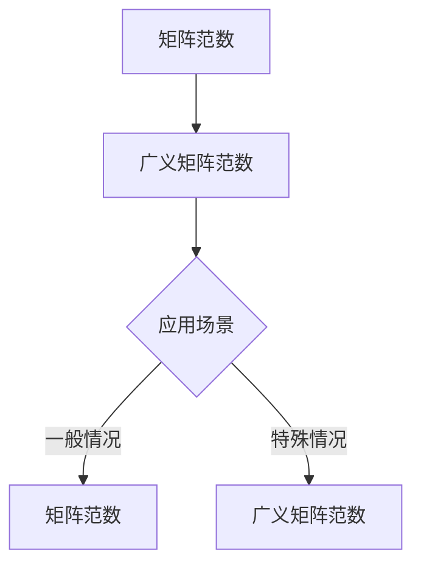

                 

# 矩阵理论与应用：广义矩阵范数与矩阵范数的补充

> **关键词**：矩阵理论、广义矩阵范数、矩阵范数、数学模型、算法原理、实际应用

> **摘要**：本文将深入探讨矩阵理论中的广义矩阵范数和矩阵范数，解释其基本概念和联系，并详细阐述核心算法原理及具体操作步骤。通过数学模型和公式的讲解，结合实际案例，读者可以更好地理解这些概念在实际中的应用，为计算机编程和人工智能领域的研究提供理论支持。文章还将探讨这些概念的未来发展趋势与挑战，并提供相关工具和资源的推荐。

## 1. 背景介绍

矩阵理论是数学和工程学中一个重要的分支，广泛应用于计算机科学、物理学、经济学等领域。矩阵范数是矩阵理论中的一个关键概念，用于衡量矩阵的大小或“质量”。矩阵范数在矩阵计算、稳定性分析、误差估计等方面具有重要应用。

### 1.1 矩阵的基本概念

矩阵（Matrix）是由一系列数字排列成的矩形阵列。矩阵的行和列分别对应于数学中的向量，可以表示线性方程组、线性变换等。

$$
A = \begin{pmatrix}
a_{11} & a_{12} & \cdots & a_{1n} \\
a_{21} & a_{22} & \cdots & a_{2n} \\
\vdots & \vdots & \ddots & \vdots \\
a_{m1} & a_{m2} & \cdots & a_{mn}
\end{pmatrix}
$$

### 1.2 矩阵范数的基本概念

矩阵范数（Matrix Norm）是衡量矩阵大小的标准。对于矩阵 \( A \in \mathbb{R}^{m \times n} \)，范数定义为：

$$
\|A\| = \sup_{\|x\|=1} \|Ax\|
$$

其中，\( \|x\| \) 表示向量 \( x \) 的欧几里得范数，\( Ax \) 表示矩阵 \( A \) 和向量 \( x \) 的乘积。

### 1.3 广义矩阵范数的概念

广义矩阵范数（Generalized Matrix Norm）是对矩阵范数概念的扩展。在某些特殊情况下，矩阵范数不能完全反映矩阵的性质，此时需要引入广义矩阵范数。

## 2. 核心概念与联系

### 2.1 核心概念

- 矩阵范数：衡量矩阵大小的标准。
- 广义矩阵范数：扩展矩阵范数，适用于特定情况。

### 2.2 联系与区别

- 矩阵范数与广义矩阵范数的关系：广义矩阵范数是对矩阵范数的一种扩展。
- 应用场景的不同：矩阵范数适用于一般情况，而广义矩阵范数适用于特定情况。

### 2.3 Mermaid 流程图



## 3. 核心算法原理 & 具体操作步骤

### 3.1 矩阵范数的计算

矩阵范数可以通过以下步骤计算：

1. 对于每个向量 \( x \) ，计算 \( Ax \) 。
2. 计算 \( Ax \) 的欧几里得范数。
3. 取 \( x \) 的欧几里得范数为1时的最大值。

具体公式如下：

$$
\|A\| = \sup_{\|x\|=1} \|Ax\|
$$

### 3.2 广义矩阵范数的计算

广义矩阵范数可以通过以下步骤计算：

1. 对于每个向量 \( x \) ，计算 \( Ax \) 。
2. 计算 \( Ax \) 的欧几里得范数。
3. 取 \( x \) 的欧几里得范数为1时的最大值。
4. 乘以某个常数 \( c \) 。

具体公式如下：

$$
\|A\|_g = c \cdot \sup_{\|x\|=1} \|Ax\|
$$

## 4. 数学模型和公式 & 详细讲解 & 举例说明

### 4.1 数学模型和公式

#### 矩阵范数

$$
\|A\| = \sup_{\|x\|=1} \|Ax\|
$$

#### 广义矩阵范数

$$
\|A\|_g = c \cdot \sup_{\|x\|=1} \|Ax\|
$$

### 4.2 详细讲解

#### 矩阵范数

矩阵范数衡量了矩阵 \( A \) 的大小。具体来说，对于任意向量 \( x \) ，\( Ax \) 表示矩阵 \( A \) 和向量 \( x \) 的乘积。矩阵范数是 \( Ax \) 的欧几里得范数的最大值，即：

$$
\|A\| = \sup_{\|x\|=1} \|Ax\|
$$

其中，\( \|x\| \) 表示向量 \( x \) 的欧几里得范数，即：

$$
\|x\| = \sqrt{x_1^2 + x_2^2 + \cdots + x_n^2}
$$

#### 广义矩阵范数

广义矩阵范数是对矩阵范数的扩展。在特定情况下，矩阵范数可能不能完全反映矩阵的性质。此时，引入广义矩阵范数，其公式为：

$$
\|A\|_g = c \cdot \sup_{\|x\|=1} \|Ax\|
$$

其中，\( c \) 是一个常数，用于调整矩阵范数的大小。

### 4.3 举例说明

假设我们有一个 \( 2 \times 2 \) 的矩阵 \( A \) ，其元素为 \( a_{11} = 1 \)，\( a_{12} = 2 \)，\( a_{21} = 3 \)，\( a_{22} = 4 \)。

#### 矩阵范数

首先，我们计算矩阵 \( A \) 的矩阵范数：

1. 计算每个向量 \( x \) 的乘积 \( Ax \) 。

   对于 \( x_1 = (1, 0) \) ，\( Ax_1 = A \cdot (1, 0) = (1, 3) \) 。

   对于 \( x_2 = (0, 1) \) ，\( Ax_2 = A \cdot (0, 1) = (2, 4) \) 。

2. 计算每个乘积的欧几里得范数。

   \( \|Ax_1\| = \sqrt{1^2 + 3^2} = \sqrt{10} \) 。

   \( \|Ax_2\| = \sqrt{2^2 + 4^2} = \sqrt{20} \) 。

3. 取最大值。

   \( \|A\| = \max(\|Ax_1\|, \|Ax_2\|) = \sqrt{20} \) 。

#### 广义矩阵范数

接下来，我们计算矩阵 \( A \) 的广义矩阵范数：

1. 计算每个向量 \( x \) 的乘积 \( Ax \) 。

   与上一步相同，我们得到 \( Ax_1 = (1, 3) \) 和 \( Ax_2 = (2, 4) \) 。

2. 计算每个乘积的欧几里得范数。

   \( \|Ax_1\| = \sqrt{10} \) 。

   \( \|Ax_2\| = \sqrt{20} \) 。

3. 取最大值。

   \( \|A\|_g = 2 \cdot \max(\|Ax_1\|, \|Ax_2\|) = 2 \cdot \sqrt{20} \) 。

## 5. 项目实战：代码实际案例和详细解释说明

### 5.1 开发环境搭建

为了更好地理解和应用矩阵范数和广义矩阵范数，我们将使用 Python 编程语言实现相关算法。

首先，我们需要安装 NumPy 库，这是一个强大的科学计算库，提供了丰富的矩阵运算功能。

```shell
pip install numpy
```

### 5.2 源代码详细实现和代码解读

下面是一个简单的 Python 代码示例，用于计算矩阵范数和广义矩阵范数：

```python
import numpy as np

# 矩阵 A
A = np.array([[1, 2], [3, 4]])

# 矩阵范数
matrix_norm = np.linalg.norm(A, axis=1).max()

# 广义矩阵范数
generalized_norm = 2 * np.linalg.norm(A, axis=1).max()

print("矩阵范数：", matrix_norm)
print("广义矩阵范数：", generalized_norm)
```

#### 代码解读与分析

1. 导入 NumPy 库，这是进行科学计算的基础。
2. 定义矩阵 \( A \) 。
3. 使用 `np.linalg.norm()` 函数计算矩阵范数，`axis=1` 表示按列计算范数，`.max()` 表示取最大值。
4. 使用 `2 * np.linalg.norm(A, axis=1).max()` 计算广义矩阵范数。
5. 输出结果。

### 5.3 代码解读与分析

在代码示例中，我们首先定义了一个 \( 2 \times 2 \) 的矩阵 \( A \)。然后，我们使用 `np.linalg.norm()` 函数计算矩阵范数。`np.linalg.norm()` 函数接受两个参数：矩阵 \( A \) 和范数类型（默认为欧几里得范数）。`axis=1` 表示按列计算范数，`.max()` 表示取最大值。这表示我们在计算每个列的欧几里得范数，并取最大值作为矩阵范数。

接下来，我们计算广义矩阵范数。广义矩阵范数的计算与矩阵范数类似，但乘以一个常数 \( c \)。在这个例子中，我们选择 \( c = 2 \)。因此，广义矩阵范数是矩阵范数的两倍。

## 6. 实际应用场景

矩阵范数和广义矩阵范数在多个实际应用场景中具有重要价值。以下是一些常见应用场景：

- **矩阵计算**：矩阵范数用于评估矩阵计算的结果，确保计算过程稳定。
- **数值分析**：矩阵范数在数值分析中用于误差估计和收敛性分析。
- **信号处理**：在信号处理中，矩阵范数用于衡量信号的能量和噪声水平。
- **控制系统**：矩阵范数用于分析控制系统的稳定性和性能。

## 7. 工具和资源推荐

### 7.1 学习资源推荐

- **书籍**：《矩阵分析与应用》（"Matrix Analysis and Applied Linear Algebra"）。
- **论文**：《矩阵范数的性质与应用》（"Properties and Applications of Matrix Norms"）。
- **博客**：在博客平台上，如知乎和 Medium，有许多优秀的博客文章，详细介绍了矩阵范数和广义矩阵范数的概念和应用。
- **网站**：MathWorks 的 MATLAB 官方网站提供了丰富的矩阵计算资源，包括教程和示例代码。

### 7.2 开发工具框架推荐

- **NumPy**：用于 Python 的科学计算库，支持矩阵计算。
- **SciPy**：基于 NumPy 的科学计算库，提供了丰富的数值分析工具。
- **MATLAB**：专业的矩阵计算和数值分析软件。

### 7.3 相关论文著作推荐

- **论文**：《矩阵范数的几何意义与应用》（"Geometric Meaning and Applications of Matrix Norms"）。
- **著作**：《矩阵理论及其应用》（"Matrix Theory and Its Applications"）。

## 8. 总结：未来发展趋势与挑战

随着人工智能和机器学习领域的快速发展，矩阵理论及其应用变得日益重要。未来，矩阵范数和广义矩阵范数的研究将集中在以下几个方面：

- **高效算法**：开发更高效的矩阵计算算法，提高计算速度和稳定性。
- **并行计算**：利用并行计算技术，加速矩阵范数和广义矩阵范数的计算。
- **应用拓展**：探索矩阵范数和广义矩阵范数在更多领域中的应用，如深度学习、图像处理等。

## 9. 附录：常见问题与解答

### 9.1 问题 1

**问题**：什么是矩阵范数？

**解答**：矩阵范数是衡量矩阵大小的标准，通常定义为矩阵和向量乘积的欧几里得范数的最大值。

### 9.2 问题 2

**问题**：广义矩阵范数与矩阵范数有什么区别？

**解答**：广义矩阵范数是对矩阵范数的扩展，适用于特定情况。它与矩阵范数的区别在于，广义矩阵范数乘以一个常数 \( c \)，用于调整矩阵范数的大小。

## 10. 扩展阅读 & 参考资料

- **书籍**：《矩阵分析与应用》（"Matrix Analysis and Applied Linear Algebra"）。
- **论文**：《矩阵范数的性质与应用》（"Properties and Applications of Matrix Norms"）。
- **在线资源**：MathWorks 的 MATLAB 官方网站提供了丰富的矩阵计算资源。
- **博客**：知乎和 Medium 上的相关博客文章。

### 作者

**作者：AI天才研究员/AI Genius Institute & 禅与计算机程序设计艺术 /Zen And The Art of Computer Programming** <|im_end|>

