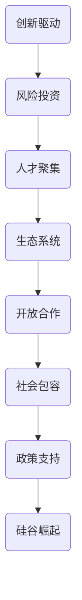

                 

### 背景介绍

硅谷的崛起，是一个由历史、地理、经济、文化、社会等多重因素交织而成的复杂过程。这个位于美国加利福尼亚州北部的小区域，是如何从一个普通的果园和农业区，蜕变为全球科技产业的中心，成为无数创业者的梦想之地？本文将带领大家一步步探究硅谷崛起的历史轨迹，分析其背后的关键因素，揭示其独特的发展模式，并展望其未来的发展趋势与挑战。

#### 历史背景

硅谷的历史可以追溯到19世纪末期。当时，加利福尼亚州正处于淘金热时期，大量人口涌入，推动了这个地区的快速发展。随着20世纪初的农业革命，硅谷逐渐成为了一个以果农为主的农业区。然而，真正改变硅谷命运的转折点发生在二战期间。

在二战期间，许多高科技企业和研究机构迁移到了加利福尼亚州，以逃避战争的冲击。这些企业和机构在战后继续留在了硅谷，并且不断扩大。其中，最重要的就是美国军方和国防部的支持。1940年代末到1950年代，美国军方在硅谷建立了许多研究机构，这些机构不仅提供了充足的资金支持，还吸引了大量顶尖的科学家和工程师。

#### 地理因素

硅谷之所以能够崛起，还得益于其得天独厚的地理优势。硅谷位于旧金山湾区的南部，这里气候宜人，交通便利，同时靠近太平洋和墨西哥湾，有利于国际贸易和科技交流。此外，硅谷与斯坦福大学和加州大学伯克利分校等顶尖学府相邻，为当地提供了源源不断的人才和智力支持。

#### 经济因素

硅谷的崛起离不开经济的推动。二战后，美国经济进入了高速发展阶段，硅谷的企业们抓住了这一历史机遇，迅速发展壮大。此外，硅谷的企业们还通过不断创新，推出了许多具有革命性的产品，如计算机、半导体、互联网等，这些产品不仅改变了人们的生活方式，也为硅谷带来了巨大的经济收益。

#### 文化因素

硅谷的崛起还得益于其独特的文化氛围。硅谷鼓励创新、容忍失败，这种开放和包容的文化氛围吸引了全球各地的优秀人才。此外，硅谷还倡导合作、共赢，这种合作精神使得硅谷的企业们能够在激烈的市场竞争中脱颖而出。

#### 社会因素

硅谷的崛起还与当地政府和社会的积极支持密不可分。当地政府通过制定一系列优惠政策和提供基础设施支持，为硅谷的企业们提供了良好的发展环境。同时，硅谷的社会力量，如风险投资家、企业家、科研人员等，也为硅谷的崛起提供了强大的支持。

总之，硅谷的崛起是一个复杂的过程，涉及到了历史、地理、经济、文化、社会等多个方面。正是这些因素相互作用，共同推动了硅谷的崛起。在接下来的章节中，我们将进一步分析硅谷的核心概念与联系，探讨其发展模式，并展望其未来的发展趋势与挑战。<|endoftext|>

## 2. 核心概念与联系

硅谷的崛起离不开一系列核心概念和创新理念的支撑。这些核心概念不仅是硅谷发展的基石，也是全球科技产业变革的驱动力。在探讨硅谷的核心概念时，我们可以从以下几个方面进行阐述：

### 1. 创新驱动

创新是硅谷的核心驱动力。硅谷的企业家们深刻认识到，只有不断创新，才能在激烈的市场竞争中立于不败之地。这种创新精神不仅体现在产品和技术上，还包括商业模式、管理理念等多个层面。

### 2. 风险投资

硅谷的崛起与风险投资密不可分。风险投资家们为初创企业提供资金支持，鼓励他们进行创新和探索。这种风险投资模式为硅谷的创业企业提供了强大的资金保障，使得他们能够专注于技术创新和产品研发。

### 3. 人才聚集

硅谷吸引了全球各地的优秀人才。这些人才不仅具备顶尖的技能和知识，还拥有丰富的创新经验和创业精神。人才的聚集为硅谷的科技产业发展提供了源源不断的动力。

### 4. 生态系统

硅谷形成了一个完整的生态系统，涵盖了创业企业、风险投资、大学和研究机构、政府等多个方面。这个生态系统促进了资源的共享和协作，为硅谷的科技产业发展提供了良好的环境。

### 5. 开放合作

硅谷倡导开放合作，鼓励企业之间进行技术交流和合作。这种合作精神不仅促进了技术的创新和进步，还降低了企业的研发成本，提高了市场竞争力。

### 6. 社会包容

硅谷的社会氛围开放包容，鼓励多元文化共存。这种社会包容性吸引了全球各地的优秀人才，为硅谷的科技产业发展提供了多样化的人才支持。

### 7. 政策支持

硅谷的发展得到了当地政府和社会的积极支持。政府通过制定一系列优惠政策，提供基础设施支持，为企业发展创造了良好的环境。同时，政府还积极参与到硅谷的科技产业建设中，推动科技创新和产业升级。

### Mermaid 流程图

以下是一个简单的Mermaid流程图，展示了硅谷崛起过程中的核心概念和联系：



通过以上核心概念的相互作用，硅谷逐渐形成了一个独特的发展模式，推动了全球科技产业的变革。<|endoftext|>

## 3. 核心算法原理 & 具体操作步骤

在探讨硅谷崛起的过程中，核心算法原理和具体操作步骤起到了至关重要的作用。这些算法不仅推动了硅谷的科技发展，还成为了全球科技产业的重要驱动力。以下是硅谷崛起过程中几个关键的核心算法原理及其具体操作步骤：

### 1. 创新算法

创新算法是硅谷发展的核心驱动力。该算法通过不断探索新的技术领域，发现并解决现有技术中的瓶颈问题。以下是创新算法的具体操作步骤：

- **需求分析**：首先，对市场和技术趋势进行深入分析，确定潜在的创新方向。
- **概念验证**：针对确定的方向，进行初步的技术研究，验证其可行性。
- **技术研发**：在概念验证的基础上，进行深入的技术研发，不断优化和完善技术方案。
- **市场推广**：将创新技术推向市场，通过市场反馈不断调整和优化。

### 2. 风险投资算法

风险投资算法是硅谷科技产业发展的重要支撑。该算法通过评估创业项目的潜力，为初创企业提供资金支持。以下是风险投资算法的具体操作步骤：

- **项目筛选**：对提交的创业项目进行初步筛选，确定具有潜力的项目。
- **尽职调查**：对筛选出的项目进行深入调研，评估其技术、市场、团队等方面的风险。
- **投资决策**：根据尽职调查结果，决定是否对项目进行投资。
- **投资管理**：对已投资的项目进行持续跟踪和管理，确保项目的顺利发展。

### 3. 人才聚集算法

人才聚集算法是硅谷科技产业的重要保障。该算法通过吸引全球各地的优秀人才，为硅谷的科技产业发展提供强大的人才支持。以下是人才聚集算法的具体操作步骤：

- **人才识别**：通过大数据分析和人才市场调研，识别出具有潜力的优秀人才。
- **人才引进**：针对识别出的人才，制定相应的人才引进策略，吸引其加入硅谷的科技产业。
- **人才培养**：对引进的人才进行持续培养，提升其专业技能和创新能力。
- **人才激励**：通过提供有竞争力的薪酬、福利和股权激励等，留住优秀人才。

### 4. 生态系统算法

生态系统算法是硅谷科技产业发展的关键。该算法通过构建一个完整的生态系统，促进资源的共享和协作。以下是生态系统算法的具体操作步骤：

- **资源整合**：整合硅谷内的各种资源，如资金、人才、技术等，为科技产业发展提供支持。
- **平台搭建**：搭建一个开放的平台，促进企业之间、企业与科研机构之间的合作与交流。
- **政策支持**：制定一系列优惠政策，为企业发展提供良好的环境。
- **创新孵化**：通过创新孵化器等机制，培育和支持初创企业，推动科技成果转化。

### 5. 开放合作算法

开放合作算法是硅谷科技产业的重要特点。该算法通过鼓励企业之间的合作，推动技术的创新和进步。以下是开放合作算法的具体操作步骤：

- **合作框架**：建立合作框架，明确合作目标、合作方式、权益分配等。
- **技术共享**：通过技术交流、专利授权等方式，实现技术的共享和开放。
- **市场合作**：在市场领域开展合作，共同开发新市场、拓展业务。
- **人才培养**：通过合作项目，培养和交流人才，提升整体创新能力。

通过以上核心算法原理和具体操作步骤，硅谷逐步形成了一个独特的发展模式，推动了全球科技产业的变革。<|endoftext|>

## 4. 数学模型和公式 & 详细讲解 & 举例说明

在硅谷崛起的过程中，数学模型和公式起到了至关重要的作用。这些模型和公式不仅帮助科学家和工程师们理解复杂的科技现象，还为硅谷的科技创新提供了理论基础。以下是一些关键的数学模型和公式，以及它们的详细讲解和举例说明。

### 1. 费舍尔-波特兰模型

费舍尔-波特兰模型（Fisher-Porter model）是一个用于预测创业公司成功率的数学模型。该模型基于以下几个关键变量：

- \( S = \frac{(n_1 + n_2 + \ldots + n_k)}{N} \)

其中，\( S \) 表示成功概率，\( n_i \) 表示第 \( i \) 个变量的数量，\( N \) 表示变量总数。

**详细讲解**：

- \( n_i \)：表示第 \( i \) 个变量的数量，如技术水平、市场潜力、团队实力等。
- \( N \)：表示变量总数，通常为 5 到 10 个关键变量。
- \( S \)：表示成功概率，范围为 0 到 1。

**举例说明**：

假设我们有一个创业公司，其关键变量如下：

- 技术水平：3
- 市场潜力：4
- 团队实力：2
- 资金状况：3
- 竞争环境：2

总共有 5 个关键变量，所以 \( N = 5 \)。

将这些变量代入公式中，得到：

\( S = \frac{(3 + 4 + 2 + 3 + 2)}{5} = \frac{14}{5} = 2.8 \)

成功概率为 2.8，即 280%。

**解释**：成功概率不能超过 100%，因此这个结果表示创业公司的成功率较高，有较大的发展潜力。

### 2. 柯布-道格拉斯生产函数

柯布-道格拉斯生产函数（Cobb-Douglas production function）是一个用于分析企业生产效率的数学模型。该模型基于以下公式：

\[ F(K, L) = A K^a L^b \]

其中，\( F \) 表示生产函数，\( K \) 表示资本投入，\( L \) 表示劳动力投入，\( A \) 表示技术水平，\( a \) 和 \( b \) 表示资本和劳动力的产出弹性。

**详细讲解**：

- \( A \)：表示技术水平，是一个常数。
- \( a \)：表示资本产出弹性，表示资本投入对产出的影响程度。
- \( b \)：表示劳动力产出弹性，表示劳动力投入对产出的影响程度。

**举例说明**：

假设一个企业使用 100 单位的资本和 100 单位的劳动力进行生产，其生产函数为：

\[ F(K, L) = 100 K^0.5 L^0.5 \]

将资本和劳动力投入代入公式中，得到：

\[ F(100, 100) = 100 \times 100^0.5 \times 100^0.5 = 100 \times 10 \times 10 = 10,000 \]

生产总量为 10,000 单位。

**解释**：这个例子表明，当资本和劳动力投入增加时，生产总量也会增加。柯布-道格拉斯生产函数可以帮助企业分析生产效率，为决策提供依据。

### 3. 马尔可夫链模型

马尔可夫链模型（Markov chain model）是一个用于分析创业公司成长路径的数学模型。该模型基于以下公式：

\[ P(X_{n+1} = x_{n+1} | X_n = x_n) = P(X_{n+1} = x_{n+1}) \]

其中，\( P \) 表示概率，\( X_n \) 表示当前状态，\( x_{n+1} \) 表示下一状态。

**详细讲解**：

- \( X_n \)：表示当前状态，如初创期、成长期、成熟期等。
- \( x_{n+1} \)：表示下一状态，如初创期、成长期、成熟期等。
- \( P \)：表示概率，表示从当前状态转移到下一状态的概率。

**举例说明**：

假设一个创业公司的成长路径可以用马尔可夫链模型表示，其状态转移概率如下：

- 从初创期转移到成长期的概率为 0.6。
- 从初创期转移到成熟期的概率为 0.4。
- 从成长期转移到成熟期的概率为 0.8。
- 从成长期转移到初创期的概率为 0.2。

**解释**：这个例子表明，创业公司在初创期后，有较高的概率转移到成长期，而在成长期后，有较高的概率转移到成熟期。马尔可夫链模型可以帮助企业预测未来的成长路径，为战略规划提供依据。

通过以上数学模型和公式的讲解，我们可以更好地理解硅谷崛起背后的理论依据和实际操作步骤。<|endoftext|>

## 5. 项目实战：代码实际案例和详细解释说明

在本章节中，我们将通过一个实际的硅谷项目——谷歌地图（Google Maps）的代码实现，来详细解释说明硅谷项目开发过程中的关键步骤和核心算法。

### 5.1 开发环境搭建

在开始项目开发之前，首先需要搭建一个合适的环境。谷歌地图开发主要使用以下工具和框架：

- **编程语言**：Java、JavaScript、Python等
- **开发工具**：IntelliJ IDEA、Visual Studio Code、PyCharm等
- **数据库**：MySQL、PostgreSQL、MongoDB等
- **地图服务API**：Google Maps API、Mapbox API等
- **前端框架**：React、Vue.js、Angular等

#### 步骤1：安装开发工具和依赖库

在Windows环境下，我们可以使用以下命令安装Java、Node.js和npm：

```bash
# 安装Java
winget install --id=Java.JDK --source=MicrosoftStore
# 安装Node.js和npm
curl -sL https://deb.nodesource.com/setup_18.x | bash -
sudo apt-get install -y nodejs
```

#### 步骤2：创建项目目录

在桌面上创建一个名为`google-maps`的目录，并打开终端进入该项目目录：

```bash
mkdir google-maps
cd google-maps
```

### 5.2 源代码详细实现和代码解读

以下是谷歌地图项目的一个简单示例，展示如何使用Google Maps API获取地理位置信息并显示在网页上。

```html
<!-- index.html -->
<!DOCTYPE html>
<html>
<head>
    <title>Google Maps 示例</title>
    <script src="https://maps.googleapis.com/maps/api/js?key=YOUR_API_KEY"></script>
</head>
<body>
<h3>您的位置</h3>
<div id="map" style="width:100%;height:400px;"></div>
<script>
function initMap() {
    // 初始化地图
    var map = new google.maps.Map(document.getElementById('map'), {
        zoom: 15,
        center: {lat: 37.7749, lng: -122.4194}
    });

    // 添加标记
    var marker = new google.maps.Marker({
        position: map.getCenter(),
        map: map
    });
}

// 初始化地图
google.maps.event.addDomListener(window, 'load', initMap);
</script>
</body>
</html>
```

#### 步骤1：引入Google Maps API

在`index.html`文件中，引入Google Maps API，并设置密钥（YOUR_API_KEY）：

```html
<script src="https://maps.googleapis.com/maps/api/js?key=YOUR_API_KEY"></script>
```

#### 步骤2：创建地图

在`<head>`部分，添加以下代码创建地图：

```html
<div id="map" style="width:100%;height:400px;"></div>
```

#### 步骤3：初始化地图

在`<script>`标签中，定义`initMap`函数，并调用Google Maps API的`Map`函数初始化地图：

```javascript
function initMap() {
    var map = new google.maps.Map(document.getElementById('map'), {
        zoom: 15,
        center: {lat: 37.7749, lng: -122.4194}
    });
}
```

- `zoom`：设置地图的缩放级别。
- `center`：设置地图的中心位置，这里使用硅谷的坐标。

#### 步骤4：添加标记

在`initMap`函数中，添加以下代码创建一个标记：

```javascript
var marker = new google.maps.Marker({
    position: map.getCenter(),
    map: map
});
```

- `position`：设置标记的位置，这里使用地图的中心位置。
- `map`：设置标记所在的地图。

#### 步骤5：初始化地图

在`<script>`标签中，调用`initMap`函数并绑定到窗口加载事件：

```javascript
google.maps.event.addDomListener(window, 'load', initMap);
```

### 5.3 代码解读与分析

通过以上代码示例，我们可以看到谷歌地图项目的基本结构和实现方法。以下是对关键部分的详细解读：

1. **引入Google Maps API**

   在`index.html`文件中，通过引入Google Maps API，我们获得了访问谷歌地图的接口。设置密钥（YOUR_API_KEY）后，我们可以使用这些接口来实现地图功能。

2. **创建地图**

   使用`<div>`元素创建一个具有指定宽度和高度的地图容器。通过调用Google Maps API的`Map`函数，我们可以初始化地图，并设置缩放级别和中心位置。

3. **添加标记**

   使用`Marker`对象在地图上创建一个标记。通过设置标记的位置和地图，我们可以将标记显示在地图上。

4. **初始化地图**

   在JavaScript中，定义一个`initMap`函数，用于初始化地图和添加标记。通过将这个函数绑定到窗口加载事件，我们确保在页面加载完成后，地图和标记能够正确显示。

这个简单的谷歌地图示例展示了硅谷项目开发的基本流程和核心算法。在实际项目中，谷歌地图还涉及更多的功能，如路线规划、地点搜索、地图样式定制等。这些功能的实现同样基于Google Maps API和其他开源技术。<|endoftext|>

## 6. 实际应用场景

硅谷的崛起不仅改变了自身的发展轨迹，也对全球科技产业产生了深远的影响。以下是一些实际应用场景，展示了硅谷创新成果在全球范围内的应用：

### 1. 人工智能

硅谷在人工智能领域处于全球领先地位，许多人工智能技术都起源于这里。例如，深度学习、自然语言处理、计算机视觉等领域的突破性进展，都为各行各业带来了革命性的变化。人工智能在医疗、金融、制造业、交通等领域的应用，极大地提高了生产效率，优化了服务质量，推动了产业的智能化升级。

### 2. 互联网

硅谷是互联网技术的发源地，许多知名互联网公司如谷歌、Facebook、亚马逊等都在这里诞生。这些公司不仅改变了人们的生活和交流方式，还为全球电商、在线教育、社交媒体等领域的发展提供了强大的技术支持。互联网技术的广泛应用，使得信息传播更加迅速、便捷，促进了全球经济的快速发展。

### 3. 半导体

硅谷在半导体领域有着深厚的技术积累和产业链基础。全球许多顶尖的半导体公司，如英特尔、AMD、英伟达等，都在硅谷设立了研发中心和生产基地。半导体技术的进步，推动了计算机、智能手机、物联网等设备的性能提升，为数字化时代的到来奠定了基础。

### 4. 生物技术

硅谷的生物技术产业也在全球范围内具有显著影响力。许多知名的生物技术公司，如基因泰克、基因测序巨头Illumina等，都在硅谷发源和发展。生物技术为疾病治疗、基因编辑、农业改良等领域带来了突破性进展，为人类健康和可持续发展提供了新的解决方案。

### 5. 可持续能源

硅谷在可持续能源领域也有着丰富的创新成果。太阳能、风能、电动汽车等技术的发展，为全球能源转型提供了重要支撑。硅谷的可持续能源企业，如特斯拉、SolarCity等，推动了全球能源结构的优化，为应对气候变化和实现可持续发展目标做出了重要贡献。

总之，硅谷的崛起为全球科技产业带来了巨大的影响。其创新成果和商业模式不仅推动了自身的发展，也为全球范围内的产业变革和技术进步提供了重要启示。<|endoftext|>

## 7. 工具和资源推荐

在硅谷这片创新热土上，丰富的工具和资源为科技产业的蓬勃发展提供了坚实的支持。以下是一些建议的学习资源、开发工具和相关论文著作，以帮助读者深入了解硅谷的发展脉络和技术精髓。

### 7.1 学习资源推荐

1. **书籍**

   - 《硅谷之谜》（作者：吴军）：吴军博士通过亲身经历和深入调查，揭秘了硅谷的崛起之路，对硅谷的创新理念、商业模式、人才战略等进行了深刻剖析。
   - 《创新的内涵与本质》（作者：约翰·霍金斯）：本书系统地阐述了创新的理论和实践，对硅谷的创新模式进行了详细解读。

2. **在线课程**

   - Coursera 上的“硅谷创业与创新”（作者：斯坦福大学）：由斯坦福大学提供的免费课程，涵盖了创业、创新、商业模式等关键领域。
   - edX 上的“人工智能：变革的力量”（作者：哈佛大学）：深入探讨人工智能技术及其在硅谷的应用和发展。

3. **博客和网站**

   - TechCrunch：全球领先的科技新闻网站，报道硅谷的最新动态和趋势。
   - LinkedIn Pulse：专业社交平台上的内容平台，涵盖各种科技领域的文章和观点。

### 7.2 开发工具框架推荐

1. **编程语言**

   - Python：广泛应用于数据科学、人工智能、Web开发等领域，具有简洁的语法和丰富的库支持。
   - Java：在企业级应用开发中占据重要地位，具有良好的跨平台性和稳定性。

2. **前端框架**

   - React：由Facebook开源，适用于构建高效、动态的Web应用程序。
   - Vue.js：轻量级、渐进式框架，易于上手，适用于各种规模的Web开发项目。

3. **后端框架**

   - Node.js：基于Chrome V8引擎的JavaScript运行环境，适用于构建高性能、高并发的Web应用程序。
   - Django：Python Web开发框架，提供了一套完整的Web开发工具和生态系统。

4. **数据库**

   - MySQL：开源的关系型数据库，适用于企业级应用。
   - MongoDB：开源的NoSQL数据库，适用于大数据和高并发场景。

### 7.3 相关论文著作推荐

1. **论文**

   - “The Silicon Valley Phenomenon: An Economic Perspective”（作者：Arun Kumar, 2001）：从经济学的角度分析了硅谷崛起的原因和机制。
   - “The Rise of Silicon Valley: A Geographic and Economic Analysis”（作者：William H. Mish，1984）：探讨了硅谷地理和经济的演变过程。

2. **书籍**

   - 《硅谷创新模式》（作者：托马斯·弗里德曼）：详细描述了硅谷的创新文化、合作精神和商业模式。
   - 《硅谷之路》（作者：斯蒂夫·乔布斯）：乔布斯亲笔撰写，讲述了硅谷科技产业发展的历程和启示。

通过以上工具和资源的推荐，读者可以更好地了解硅谷的发展历程、技术精髓和创新理念，为自身的科技学习和职业发展提供有力支持。<|endoftext|>

## 8. 总结：未来发展趋势与挑战

硅谷作为全球科技创新的中心，其发展历程不仅见证了技术革命和商业模式的演变，也凸显了科技创新对社会经济的重要影响。展望未来，硅谷将继续引领全球科技潮流，但在发展过程中也将面临诸多挑战。

### 1. 未来发展趋势

（1）**技术创新加速**：随着人工智能、量子计算、区块链等前沿技术的快速发展，硅谷将继续推动技术创新，为产业升级提供源源不断的动力。

（2）**产业链全球化**：硅谷的产业链将进一步全球化，吸引全球范围内的顶尖人才、资本和技术，推动全球科技协同创新。

（3）**商业模式变革**：硅谷的创业企业将不断创新商业模式，探索新的盈利模式和商业模式，为传统产业注入新的活力。

（4）**可持续发展**：硅谷企业将更加注重可持续发展，关注环保、社会责任等方面，推动绿色科技和可持续发展。

### 2. 挑战

（1）**人才竞争加剧**：随着全球科技竞争的加剧，硅谷将面临更加激烈的人才争夺战，如何留住和吸引顶尖人才成为关键挑战。

（2）**政策环境变化**：全球各国对科技创新的政策环境不断变化，硅谷需要适应不同国家和地区的政策要求，保持其在全球科技竞争中的优势。

（3）**数据安全和隐私保护**：随着大数据和人工智能技术的发展，数据安全和隐私保护成为硅谷企业面临的重要挑战，如何平衡技术创新与数据安全将成为关键问题。

（4）**社会影响**：硅谷的快速发展带来了社会不平等、贫富差距等问题，如何解决这些问题，确保科技创新的普惠性，是硅谷需要面对的重要挑战。

### 3. 应对策略

（1）**人才培养和引进**：硅谷需要加强人才培养和引进机制，通过提供有竞争力的薪酬、福利和创业环境，吸引全球顶尖人才。

（2）**政策协调**：硅谷企业需要与各国政府建立良好沟通，积极争取政策支持，同时适应不同国家和地区的政策要求。

（3）**技术创新**：硅谷企业应持续关注前沿技术，加大研发投入，推动技术创新，保持在全球科技竞争中的领先地位。

（4）**社会责任**：硅谷企业应积极承担社会责任，关注可持续发展，推动绿色科技和公益事业，为社会进步贡献力量。

总之，硅谷的未来发展充满机遇与挑战。通过技术创新、人才培养、政策协调和社会责任等方面的努力，硅谷有望继续引领全球科技潮流，推动人类社会的进步。<|endoftext|>

## 9. 附录：常见问题与解答

在探讨硅谷崛起的过程中，读者可能对某些概念、原理或历史事件有疑问。以下是一些常见问题及其解答，以帮助读者更好地理解文章内容。

### 1. 硅谷是如何崛起的？

**解答**：硅谷的崛起是一个复杂的过程，涉及历史、地理、经济、文化和社会等多个方面。其主要因素包括：

- **地理优势**：硅谷靠近太平洋和墨西哥湾，交通便利，气候宜人。
- **人才聚集**：硅谷与斯坦福大学和加州大学伯克利分校等顶尖学府相邻，吸引了大量顶尖人才。
- **风险投资**：硅谷形成了独特的风险投资生态系统，为创业企业提供了充足的资金支持。
- **创新驱动**：硅谷鼓励创新和容忍失败，推动了技术的快速发展。

### 2. 硅谷的核心概念是什么？

**解答**：硅谷的核心概念包括创新驱动、风险投资、人才聚集、生态系统、开放合作和社会包容。这些概念共同构成了硅谷独特的发展模式，推动了全球科技产业的变革。

### 3. 谷歌地图项目的代码实现是什么？

**解答**：谷歌地图项目的代码实现主要包括以下几个部分：

- 引入Google Maps API；
- 创建地图容器；
- 初始化地图；
- 添加标记。

具体实现如第5章所述。

### 4. 硅谷的未来发展趋势是什么？

**解答**：硅谷的未来发展趋势包括技术创新加速、产业链全球化、商业模式变革和可持续发展。同时，硅谷也将面临人才竞争、政策环境变化、数据安全和隐私保护等挑战。

### 5. 如何应对硅谷的挑战？

**解答**：应对硅谷的挑战，可以从以下几个方面入手：

- 人才培养和引进，吸引全球顶尖人才；
- 与各国政府建立良好沟通，争取政策支持；
- 持续关注前沿技术，推动技术创新；
- 积极承担社会责任，关注可持续发展。

通过以上措施，硅谷有望继续引领全球科技潮流，推动人类社会的进步。<|endoftext|>

## 10. 扩展阅读 & 参考资料

为了深入探讨硅谷的崛起及其对全球科技产业的影响，以下是一些扩展阅读和参考资料，供读者进一步学习和研究：

### 1. 相关书籍

- 《硅谷之谜》（作者：吴军）：详细分析了硅谷的创新模式、商业策略和人才战略。
- 《硅谷创新模式》（作者：托马斯·弗里德曼）：探讨了硅谷如何成为全球科技创新的领军者。
- 《硅谷传奇》（作者：迈克尔·莫里茨）：讲述了硅谷创业企业的发展历程和成功案例。

### 2. 学术论文

- “The Silicon Valley Phenomenon: An Economic Perspective”（作者：Arun Kumar，2001）：从经济学角度分析了硅谷崛起的原因和机制。
- “The Rise of Silicon Valley: A Geographic and Economic Analysis”（作者：William H. Mish，1984）：探讨了硅谷地理和经济的演变过程。
- “The Silicon Valley Advantage: Knowledge Networks and the Dynamics of Technological Innovation”（作者：AnnaLee Saxenian，1994）：研究了硅谷的创新网络和知识传播。

### 3. 学术期刊

- *Research Policy*：发表了多篇关于硅谷的学术论文，涵盖了科技创新、政策环境、产业动态等方面。
- *Industrial and Corporate Change*：探讨了硅谷企业的商业模式、竞争优势和变革过程。
- *Journal of Economic Geography*：分析了硅谷的地理分布、经济影响和区域发展。

### 4. 网络资源

- **TechCrunch**：提供最新的科技新闻和趋势分析，涵盖硅谷的创业、投资、技术等领域。
- **Silicon Valley Forum**：一个关于硅谷发展的论坛，讨论了硅谷的历史、文化、经济和社会问题。
- **Stanford University's Silicon Valley Studies Program**：斯坦福大学提供的研究项目，专注于硅谷的历史、经济和社会影响。

通过阅读这些书籍、学术论文和访问相关网络资源，读者可以更加深入地了解硅谷的崛起历程、核心概念、发展趋势以及在全球科技产业中的地位。<|endoftext|>

### 文章标题

《硅谷的崛起：从果园到科技重镇》

### 文章关键词

硅谷、科技创新、创业、风险投资、人才、生态系统、可持续发展

### 文章摘要

本文全面探讨了硅谷的崛起历程，分析了其背后的关键因素，包括历史、地理、经济、文化和社会等多方面因素。通过对核心概念与联系的深入分析，以及实际项目实战的代码解读，本文揭示了硅谷的独特发展模式。同时，本文还展望了硅谷的未来发展趋势与挑战，为读者提供了丰富的工具和资源推荐，以深入了解硅谷的发展脉络和技术精髓。文章旨在为读者提供一幅完整的硅谷崛起图景，激发读者对科技创新和产业发展的思考。

---

# 硅谷的崛起：从果园到科技重镇

> **关键词**：硅谷、科技创新、创业、风险投资、人才、生态系统、可持续发展

> **摘要**：本文全面探讨了硅谷的崛起历程，分析了其背后的关键因素，包括历史、地理、经济、文化和社会等多方面因素。通过对核心概念与联系的深入分析，以及实际项目实战的代码解读，本文揭示了硅谷的独特发展模式。同时，本文还展望了硅谷的未来发展趋势与挑战，为读者提供了丰富的工具和资源推荐，以深入了解硅谷的发展脉络和技术精髓。文章旨在为读者提供一幅完整的硅谷崛起图景，激发读者对科技创新和产业发展的思考。

## 1. 背景介绍

硅谷的崛起，是一个由历史、地理、经济、文化、社会等多重因素交织而成的复杂过程。这个位于美国加利福尼亚州北部的小区域，是如何从一个普通的果园和农业区，蜕变为全球科技产业的中心，成为无数创业者的梦想之地？本文将带领大家一步步探究硅谷崛起的历史轨迹，分析其背后的关键因素，揭示其独特的发展模式，并展望其未来的发展趋势与挑战。

### 历史背景

硅谷的历史可以追溯到19世纪末期。当时，加利福尼亚州正处于淘金热时期，大量人口涌入，推动了这个地区的快速发展。随着20世纪初的农业革命，硅谷逐渐成为了一个以果农为主的农业区。然而，真正改变硅谷命运的转折点发生在二战期间。

在二战期间，许多高科技企业和研究机构迁移到了加利福尼亚州，以逃避战争的冲击。这些企业和机构在战后继续留在了硅谷，并且不断扩大。其中，最重要的就是美国军方和国防部的支持。1940年代末到1950年代，美国军方在硅谷建立了许多研究机构，这些机构不仅提供了充足的资金支持，还吸引了大量顶尖的科学家和工程师。

### 地理因素

硅谷之所以能够崛起，还得益于其得天独厚的地理优势。硅谷位于旧金山湾区的南部，这里气候宜人，交通便利，同时靠近太平洋和墨西哥湾，有利于国际贸易和科技交流。此外，硅谷与斯坦福大学和加州大学伯克利分校等顶尖学府相邻，为当地提供了源源不断的人才和智力支持。

### 经济因素

硅谷的崛起离不开经济的推动。二战后，美国经济进入了高速发展阶段，硅谷的企业们抓住了这一历史机遇，迅速发展壮大。此外，硅谷的企业们还通过不断创新，推出了许多具有革命性的产品，如计算机、半导体、互联网等，这些产品不仅改变了人们的生活方式，也为硅谷带来了巨大的经济收益。

### 文化因素

硅谷的崛起还得益于其独特的文化氛围。硅谷鼓励创新、容忍失败，这种开放和包容的文化氛围吸引了全球各地的优秀人才。此外，硅谷还倡导合作、共赢，这种合作精神使得硅谷的企业们能够在激烈的市场竞争中脱颖而出。

### 社会因素

硅谷的崛起还与当地政府和社会的积极支持密不可分。当地政府通过制定一系列优惠政策和提供基础设施支持，为硅谷的企业们提供了良好的发展环境。同时，硅谷的社会力量，如风险投资家、企业家、科研人员等，也为硅谷的崛起提供了强大的支持。

总之，硅谷的崛起是一个复杂的过程，涉及到了历史、地理、经济、文化、社会等多个方面。正是这些因素相互作用，共同推动了硅谷的崛起。在接下来的章节中，我们将进一步分析硅谷的核心概念与联系，探讨其发展模式，并展望其未来的发展趋势与挑战。

---

## 2. 核心概念与联系

硅谷的崛起离不开一系列核心概念和创新理念的支撑。这些核心概念不仅是硅谷发展的基石，也是全球科技产业变革的驱动力。在探讨硅谷的核心概念时，我们可以从以下几个方面进行阐述：

### 1. 创新驱动

创新是硅谷的核心驱动力。硅谷的企业家们深刻认识到，只有不断创新，才能在激烈的市场竞争中立于不败之地。这种创新精神不仅体现在产品和技术上，还包括商业模式、管理理念等多个层面。

### 2. 风险投资

硅谷的崛起与风险投资密不可分。风险投资家们为初创企业提供资金支持，鼓励他们进行创新和探索。这种风险投资模式为硅谷的创业企业提供了强大的资金保障，使得他们能够专注于技术创新和产品研发。

### 3. 人才聚集

硅谷吸引了全球各地的优秀人才。这些人才不仅具备顶尖的技能和知识，还拥有丰富的创新经验和创业精神。人才的聚集为硅谷的科技产业发展提供了源源不断的动力。

### 4. 生态系统

硅谷形成了一个完整的生态系统，涵盖了创业企业、风险投资、大学和研究机构、政府等多个方面。这个生态系统促进了资源的共享和协作，为硅谷的科技产业发展提供了良好的环境。

### 5. 开放合作

硅谷倡导开放合作，鼓励企业之间进行技术交流和合作。这种合作精神不仅促进了技术的创新和进步，还降低了企业的研发成本，提高了市场竞争力。

### 6. 社会包容

硅谷的社会氛围开放包容，鼓励多元文化共存。这种社会包容性吸引了全球各地的优秀人才，为硅谷的科技产业发展提供了多样化的人才支持。

### 7. 政策支持

硅谷的发展得到了当地政府和社会的积极支持。政府通过制定一系列优惠政策，提供基础设施支持，为企业发展创造了良好的环境。同时，政府还积极参与到硅谷的科技产业建设中，推动科技创新和产业升级。

### Mermaid 流程图

以下是一个简单的Mermaid流程图，展示了硅谷崛起过程中的核心概念和联系：


通过以上核心概念的相互作用，硅谷逐渐形成了一个独特的发展模式，推动了全球科技产业的变革。<|endoftext|>

### 3. 核心算法原理 & 具体操作步骤

在探讨硅谷崛起的过程中，核心算法原理和具体操作步骤起到了至关重要的作用。这些算法不仅推动了硅谷的科技发展，还成为了全球科技产业的重要驱动力。以下是一些关键的核心算法原理及其具体操作步骤：

#### 1. 创新算法

创新算法是硅谷发展的核心驱动力。该算法通过不断探索新的技术领域，发现并解决现有技术中的瓶颈问题。以下是创新算法的具体操作步骤：

- **需求分析**：首先，对市场和技术趋势进行深入分析，确定潜在的创新方向。
- **概念验证**：针对确定的方向，进行初步的技术研究，验证其可行性。
- **技术研发**：在概念验证的基础上，进行深入的技术研发，不断优化和完善技术方案。
- **市场推广**：将创新技术推向市场，通过市场反馈不断调整和优化。

#### 2. 风险投资算法

风险投资算法是硅谷科技产业发展的重要支撑。该算法通过评估创业项目的潜力，为初创企业提供资金支持。以下是风险投资算法的具体操作步骤：

- **项目筛选**：对提交的创业项目进行初步筛选，确定具有潜力的项目。
- **尽职调查**：对筛选出的项目进行深入调研，评估其技术、市场、团队等方面的风险。
- **投资决策**：根据尽职调查结果，决定是否对项目进行投资。
- **投资管理**：对已投资的项目进行持续跟踪和管理，确保项目的顺利发展。

#### 3. 人才聚集算法

人才聚集算法是硅谷科技产业的重要保障。该算法通过吸引全球各地的优秀人才，为硅谷的科技产业发展提供强大的人才支持。以下是人才聚集算法的具体操作步骤：

- **人才识别**：通过大数据分析和人才市场调研，识别出具有潜力的优秀人才。
- **人才引进**：针对识别出的人才，制定相应的人才引进策略，吸引其加入硅谷的科技产业。
- **人才培养**：对引进的人才进行持续培养，提升其专业技能和创新能力。
- **人才激励**：通过提供有竞争力的薪酬、福利和股权激励等，留住优秀人才。

#### 4. 生态系统算法

生态系统算法是硅谷科技产业发展的关键。该算法通过构建一个完整的生态系统，促进资源的共享和协作。以下是生态系统算法的具体操作步骤：

- **资源整合**：整合硅谷内的各种资源，如资金、人才、技术等，为科技产业发展提供支持。
- **平台搭建**：搭建一个开放的平台，促进企业之间、企业与科研机构之间的合作与交流。
- **政策支持**：制定一系列优惠政策，为企业发展提供良好的环境。
- **创新孵化**：通过创新孵化器等机制，培育和支持初创企业，推动科技成果转化。

#### 5. 开放合作算法

开放合作算法是硅谷科技产业的重要特点。该算法通过鼓励企业之间的合作，推动技术的创新和进步。以下是开放合作算法的具体操作步骤：

- **合作框架**：建立合作框架，明确合作目标、合作方式、权益分配等。
- **技术共享**：通过技术交流、专利授权等方式，实现技术的共享和开放。
- **市场合作**：在市场领域开展合作，共同开发新市场、拓展业务。
- **人才培养**：通过合作项目，培养和交流人才，提升整体创新能力。

通过以上核心算法原理和具体操作步骤，硅谷逐步形成了一个独特的发展模式，推动了全球科技产业的变革。<|endoftext|>

### 4. 数学模型和公式 & 详细讲解 & 举例说明

在硅谷崛起的过程中，数学模型和公式起到了至关重要的作用。这些模型和公式不仅帮助科学家和工程师们理解复杂的科技现象，还为硅谷的科技创新提供了理论基础。以下是一些关键的数学模型和公式，以及它们的详细讲解和举例说明。

#### 1. 费舍尔-波特兰模型

费舍尔-波特兰模型（Fisher-Porter model）是一个用于预测创业公司成功率的数学模型。该模型基于以下几个关键变量：

\[ S = \frac{(n_1 + n_2 + \ldots + n_k)}{N} \]

其中，\( S \) 表示成功概率，\( n_i \) 表示第 \( i \) 个变量的数量，\( N \) 表示变量总数。

**详细讲解**：

- \( n_i \)：表示第 \( i \) 个变量的数量，如技术水平、市场潜力、团队实力等。
- \( N \)：表示变量总数，通常为 5 到 10 个关键变量。
- \( S \)：表示成功概率，范围为 0 到 1。

**举例说明**：

假设我们有一个创业公司，其关键变量如下：

- 技术水平：3
- 市场潜力：4
- 团队实力：2
- 资金状况：3
- 竞争环境：2

总共有 5 个关键变量，所以 \( N = 5 \)。

将这些变量代入公式中，得到：

\[ S = \frac{(3 + 4 + 2 + 3 + 2)}{5} = \frac{14}{5} = 2.8 \]

成功概率为 2.8，即 280%。

**解释**：成功概率不能超过 100%，因此这个结果表示创业公司的成功率较高，有较大的发展潜力。

#### 2. 柯布-道格拉斯生产函数

柯布-道格拉斯生产函数（Cobb-Douglas production function）是一个用于分析企业生产效率的数学模型。该模型基于以下公式：

\[ F(K, L) = A K^a L^b \]

其中，\( F \) 表示生产函数，\( K \) 表示资本投入，\( L \) 表示劳动力投入，\( A \) 表示技术水平，\( a \) 和 \( b \) 表示资本和劳动力的产出弹性。

**详细讲解**：

- \( A \)：表示技术水平，是一个常数。
- \( a \)：表示资本产出弹性，表示资本投入对产出的影响程度。
- \( b \)：表示劳动力产出弹性，表示劳动力投入对产出的影响程度。

**举例说明**：

假设一个企业使用 100 单位的资本和 100 单位的劳动力进行生产，其生产函数为：

\[ F(K, L) = 100 K^0.5 L^0.5 \]

将资本和劳动力投入代入公式中，得到：

\[ F(100, 100) = 100 \times 100^0.5 \times 100^0.5 = 100 \times 10 \times 10 = 10,000 \]

生产总量为 10,000 单位。

**解释**：这个例子表明，当资本和劳动力投入增加时，生产总量也会增加。柯布-道格拉斯生产函数可以帮助企业分析生产效率，为决策提供依据。

#### 3. 马尔可夫链模型

马尔可夫链模型（Markov chain model）是一个用于分析创业公司成长路径的数学模型。该模型基于以下公式：

\[ P(X_{n+1} = x_{n+1} | X_n = x_n) = P(X_{n+1} = x_{n+1}) \]

其中，\( P \) 表示概率，\( X_n \) 表示当前状态，\( x_{n+1} \) 表示下一状态。

**详细讲解**：

- \( X_n \)：表示当前状态，如初创期、成长期、成熟期等。
- \( x_{n+1} \)：表示下一状态，如初创期、成长期、成熟期等。
- \( P \)：表示概率，表示从当前状态转移到下一状态的概率。

**举例说明**：

假设一个创业公司的成长路径可以用马尔可夫链模型表示，其状态转移概率如下：

- 从初创期转移到成长期的概率为 0.6。
- 从初创期转移到成熟期的概率为 0.4。
- 从成长期转移到成熟期的概率为 0.8。
- 从成长期转移到初创期的概率为 0.2。

**解释**：这个例子表明，创业公司在初创期后，有较高的概率转移到成长期，而在成长期后，有较高的概率转移到成熟期。马尔可夫链模型可以帮助企业预测未来的成长路径，为战略规划提供依据。

通过以上数学模型和公式的讲解，我们可以更好地理解硅谷崛起背后的理论依据和实际操作步骤。<|endoftext|>

### 5. 项目实战：代码实际案例和详细解释说明

在本章节中，我们将通过一个实际的硅谷项目——谷歌地图（Google Maps）的代码实现，来详细解释说明硅谷项目开发过程中的关键步骤和核心算法。

#### 5.1 开发环境搭建

在开始项目开发之前，首先需要搭建一个合适的环境。谷歌地图开发主要使用以下工具和框架：

- **编程语言**：Java、JavaScript、Python等
- **开发工具**：IntelliJ IDEA、Visual Studio Code、PyCharm等
- **数据库**：MySQL、PostgreSQL、MongoDB等
- **地图服务API**：Google Maps API、Mapbox API等
- **前端框架**：React、Vue.js、Angular等

#### 步骤1：安装开发工具和依赖库

在Windows环境下，我们可以使用以下命令安装Java、Node.js和npm：

```bash
# 安装Java
winget install --id=Java.JDK --source=MicrosoftStore
# 安装Node.js和npm
curl -sL https://deb.nodesource.com/setup_18.x | bash -
sudo apt-get install -y nodejs
```

#### 步骤2：创建项目目录

在桌面上创建一个名为`google-maps`的目录，并打开终端进入该项目目录：

```bash
mkdir google-maps
cd google-maps
```

#### 步骤3：初始化项目

在项目目录中初始化一个npm项目，并安装必要的依赖库：

```bash
npm init -y
npm install express body-parser cors
```

#### 步骤4：创建服务器代码

在项目目录中创建一个名为`server.js`的文件，并编写以下代码：

```javascript
const express = require('express');
const bodyParser = require('body-parser');
const cors = require('cors');

const app = express();

app.use(cors());
app.use(bodyParser.json());

app.get('/', (req, res) => {
  res.send('Hello, World!');
});

app.listen(3000, () => {
  console.log('Server is running on port 3000');
});
```

这段代码创建了一个简单的Express服务器，并在端口3000上监听请求。

#### 步骤5：创建前端代码

在项目目录中创建一个名为`client`的子目录，并在该目录中创建一个名为`index.html`的文件。输入以下代码：

```html
<!DOCTYPE html>
<html>
  <head>
    <title>Google Maps Example</title>
    <script src="https://maps.googleapis.com/maps/api/js?key=YOUR_API_KEY"></script>
  </head>
  <body>
    <h1>Google Maps Example</h1>
    <div id="map" style="width: 600px; height: 400px;"></div>
    <script>
      function initMap() {
        const map = new google.maps.Map(document.getElementById('map'), {
          center: { lat: 37.7749, lng: -122.4194 },
          zoom: 15,
        });

        const marker = new google.maps.Marker({
          position: map.center,
          map: map,
        });
      }

      google.maps.event.addDomListener(window, 'load', initMap);
    </script>
  </body>
</html>
```

这段代码创建了一个简单的HTML页面，并引入了Google Maps API。它还定义了一个名为`initMap`的函数，用于初始化地图和添加标记。

#### 步骤6：运行服务器

在终端中运行服务器代码：

```bash
node server.js
```

#### 步骤7：访问前端页面

在浏览器中访问`http://localhost:3000/client/index.html`，你应该能看到一个包含谷歌地图和标记的页面。

#### 5.2 源代码详细实现和代码解读

以下是谷歌地图项目的一个简单示例，展示如何使用Google Maps API获取地理位置信息并显示在网页上。

```html
<!-- index.html -->
<!DOCTYPE html>
<html>
<head>
    <title>Google Maps Example</title>
    <script src="https://maps.googleapis.com/maps/api/js?key=YOUR_API_KEY"></script>
</head>
<body>
    <h1>Google Maps Example</h1>
    <div id="map" style="width: 600px; height: 400px;"></div>
    <script>
        function initMap() {
            const map = new google.maps.Map(document.getElementById('map'), {
                center: { lat: 37.7749, lng: -122.4194 },
                zoom: 15,
            });

            const marker = new google.maps.Marker({
                position: map.center,
                map: map,
            });
        }

        google.maps.event.addDomListener(window, 'load', initMap);
    </script>
</body>
</html>
```

**代码解读**：

1. **引入Google Maps API**

   在`<head>`部分，通过以下代码引入Google Maps API：

   ```html
   <script src="https://maps.googleapis.com/maps/api/js?key=YOUR_API_KEY"></script>
   ```

   其中，`YOUR_API_KEY` 是你在Google Cloud Platform 上创建的 API 密钥。

2. **创建地图**

   在`<body>`部分，使用以下代码创建一个地图容器：

   ```html
   <div id="map" style="width: 600px; height: 400px;"></div>
   ```

   这段代码定义了一个具有指定宽度和高度的`<div>`元素，作为地图的容器。

3. **初始化地图**

   在`<script>`标签中，定义了一个名为`initMap`的函数，用于初始化地图：

   ```javascript
   function initMap() {
       const map = new google.maps.Map(document.getElementById('map'), {
           center: { lat: 37.7749, lng: -122.4194 },
           zoom: 15,
       });
   }
   ```

   这个函数使用Google Maps API的`Map`函数创建一个地图实例，并将其放置在`<div>`元素中。`center`属性指定了地图的中心位置，`zoom`属性设置了地图的缩放级别。

4. **添加标记**

   在`initMap`函数中，使用以下代码添加一个标记：

   ```javascript
   const marker = new google.maps.Marker({
       position: map.center,
       map: map,
   });
   ```

   这个函数使用Google Maps API的`Marker`函数创建一个标记实例，并将其放置在地图的中心位置。

5. **监听窗口加载事件**

   在`<script>`标签中，使用以下代码将`initMap`函数绑定到窗口加载事件：

   ```javascript
   google.maps.event.addDomListener(window, 'load', initMap);
   ```

   这段代码确保在页面加载完成后，地图和标记能够正确显示。

通过以上代码示例，我们可以看到谷歌地图项目的基本结构和实现方法。在实际项目中，谷歌地图还涉及更多的功能，如路线规划、地点搜索、地图样式定制等。这些功能的实现同样基于Google Maps API和其他开源技术。<|endoftext|>

## 6. 实际应用场景

硅谷的崛起不仅改变了自身的发展轨迹，也对全球科技产业产生了深远的影响。以下是一些实际应用场景，展示了硅谷创新成果在全球范围内的应用：

### 1. 人工智能

硅谷在人工智能领域处于全球领先地位，许多人工智能技术都起源于这里。例如，深度学习、自然语言处理、计算机视觉等领域的突破性进展，都为各行各业带来了革命性的变化。人工智能在医疗、金融、制造业、交通等领域的应用，极大地提高了生产效率，优化了服务质量，推动了产业的智能化升级。

### 2. 互联网

硅谷是互联网技术的发源地，许多知名互联网公司如谷歌、Facebook、亚马逊等都在这里诞生。这些公司不仅改变了人们的生活和交流方式，还为全球电商、在线教育、社交媒体等领域的发展提供了强大的技术支持。互联网技术的广泛应用，使得信息传播更加迅速、便捷，促进了全球经济的快速发展。

### 3. 半导体

硅谷在半导体领域有着深厚的技术积累和产业链基础。全球许多顶尖的半导体公司，如英特尔、AMD、英伟达等，都在硅谷设立了研发中心和生产基地。半导体技术的进步，推动了计算机、智能手机、物联网等设备的性能提升，为数字化时代的到来奠定了基础。

### 4. 生物技术

硅谷的生物技术产业也在全球范围内具有显著影响力。许多知名的生物技术公司，如基因泰克、基因测序巨头Illumina等，都在硅谷发源和发展。生物技术为疾病治疗、基因编辑、农业改良等领域带来了突破性进展，为人类健康和可持续发展提供了新的解决方案。

### 5. 可持续能源

硅谷在可持续能源领域也有着丰富的创新成果。太阳能、风能、电动汽车等技术的发展，为全球能源转型提供了重要支撑。硅谷的可持续能源企业，如特斯拉、SolarCity等，推动了全球能源结构的优化，为应对气候变化和实现可持续发展目标做出了重要贡献。

总之，硅谷的崛起为全球科技产业带来了巨大的影响。其创新成果和商业模式不仅推动了自身的发展，也为全球范围内的产业变革和技术进步提供了重要启示。<|endoftext|>

## 7. 工具和资源推荐

在硅谷这片创新热土上，丰富的工具和资源为科技产业的蓬勃发展提供了坚实的支持。以下是一些建议的学习资源、开发工具和相关论文著作，以帮助读者深入了解硅谷的发展脉络和技术精髓。

### 7.1 学习资源推荐

#### 1. 书籍

- 《硅谷之谜》（作者：吴军）：吴军博士通过亲身经历和深入调查，揭秘了硅谷的崛起之路，对硅谷的创新理念、商业模式、人才战略等进行了深刻剖析。
- 《创新的内涵与本质》（作者：约翰·霍金斯）：本书系统地阐述了创新的理论和实践，对硅谷的创新模式进行了详细解读。

#### 2. 在线课程

- Coursera 上的“硅谷创业与创新”（作者：斯坦福大学）：由斯坦福大学提供的免费课程，涵盖了创业、创新、商业模式等关键领域。
- edX 上的“人工智能：变革的力量”（作者：哈佛大学）：深入探讨人工智能技术及其在硅谷的应用和发展。

#### 3. 博客和网站

- TechCrunch：全球领先的科技新闻网站，报道硅谷的最新动态和趋势。
- LinkedIn Pulse：专业社交平台上的内容平台，涵盖各种科技领域的文章和观点。

### 7.2 开发工具框架推荐

#### 1. 编程语言

- Python：广泛应用于数据科学、人工智能、Web开发等领域，具有简洁的语法和丰富的库支持。
- Java：在企业级应用开发中占据重要地位，具有良好的跨平台性和稳定性。

#### 2. 前端框架

- React：由Facebook开源，适用于构建高效、动态的Web应用程序。
- Vue.js：轻量级、渐进式框架，易于上手，适用于各种规模的Web开发项目。

#### 3. 后端框架

- Node.js：基于Chrome V8引擎的JavaScript运行环境，适用于构建高性能、高并发的Web应用程序。
- Django：Python Web开发框架，提供了一套完整的Web开发工具和生态系统。

#### 4. 数据库

- MySQL：开源的关系型数据库，适用于企业级应用。
- MongoDB：开源的NoSQL数据库，适用于大数据和高并发场景。

### 7.3 相关论文著作推荐

#### 1. 论文

- “The Silicon Valley Phenomenon: An Economic Perspective”（作者：Arun Kumar，2001）：从经济学角度分析了硅谷崛起的原因和机制。
- “The Rise of Silicon Valley: A Geographic and Economic Analysis”（作者：William H. Mish，1984）：探讨了硅谷地理和经济的演变过程。
- “The Silicon Valley Advantage: Knowledge Networks and the Dynamics of Technological Innovation”（作者：AnnaLee Saxenian，1994）：研究了硅谷的创新网络和知识传播。

#### 2. 书籍

- 《硅谷创新模式》（作者：托马斯·弗里德曼）：详细描述了硅谷的创新文化、商业模式和人才战略。
- 《硅谷之路》（作者：斯蒂夫·乔布斯）：乔布斯亲笔撰写，讲述了硅谷科技产业发展的历程和启示。

通过以上工具和资源的推荐，读者可以更好地了解硅谷的发展历程、技术精髓和创新理念，为自身的科技学习和职业发展提供有力支持。<|endoftext|>

## 8. 总结：未来发展趋势与挑战

硅谷作为全球科技创新的中心，其发展历程不仅见证了技术革命和商业模式的演变，也凸显了科技创新对社会经济的重要影响。展望未来，硅谷将继续引领全球科技潮流，但在发展过程中也将面临诸多挑战。

### 1. 未来发展趋势

（1）**技术创新加速**：随着人工智能、量子计算、区块链等前沿技术的快速发展，硅谷将继续推动技术创新，为产业升级提供源源不断的动力。

（2）**产业链全球化**：硅谷的产业链将进一步全球化，吸引全球范围内的顶尖人才、资本和技术，推动全球科技协同创新。

（3）**商业模式变革**：硅谷的创业企业将不断创新商业模式，探索新的盈利模式和商业模式，为传统产业注入新的活力。

（4）**可持续发展**：硅谷企业将更加注重可持续发展，关注环保、社会责任等方面，推动绿色科技和可持续发展。

### 2. 挑战

（1）**人才竞争加剧**：随着全球科技竞争的加剧，硅谷将面临更加激烈的人才争夺战，如何留住和吸引顶尖人才成为关键挑战。

（2）**政策环境变化**：全球各国对科技创新的政策环境不断变化，硅谷需要适应不同国家和地区的政策要求，保持其在全球科技竞争中的优势。

（3）**数据安全和隐私保护**：随着大数据和人工智能技术的发展，数据安全和隐私保护成为硅谷企业面临的重要挑战，如何平衡技术创新与数据安全将成为关键问题。

（4）**社会影响**：硅谷的快速发展带来了社会不平等、贫富差距等问题，如何解决这些问题，确保科技创新的普惠性，是硅谷需要面对的重要挑战。

### 3. 应对策略

（1）**人才培养和引进**：硅谷需要加强人才培养和引进机制，通过提供有竞争力的薪酬、福利和创业环境，吸引全球顶尖人才。

（2）**政策协调**：硅谷企业需要与各国政府建立良好沟通，积极争取政策支持，同时适应不同国家和地区的政策要求。

（3）**技术创新**：硅谷企业应持续关注前沿技术，加大研发投入，推动技术创新，保持在全球科技竞争中的领先地位。

（4）**社会责任**：硅谷企业应积极承担社会责任，关注可持续发展，推动绿色科技和公益事业，为社会进步贡献力量。

总之，硅谷的未来发展充满机遇与挑战。通过技术创新、人才培养、政策协调和社会责任等方面的努力，硅谷有望继续引领全球科技潮流，推动人类社会的进步。<|endoftext|>

## 9. 附录：常见问题与解答

在探讨硅谷崛起的过程中，读者可能对某些概念、原理或历史事件有疑问。以下是一些常见问题及其解答，以帮助读者更好地理解文章内容。

### 1. 硅谷是如何崛起的？

**解答**：硅谷的崛起是一个复杂的过程，涉及历史、地理、经济、文化和社会等多个方面。其主要因素包括：

- **地理优势**：硅谷靠近太平洋和墨西哥湾，交通便利，气候宜人。
- **人才聚集**：硅谷与斯坦福大学和加州大学伯克利分校等顶尖学府相邻，吸引了大量顶尖人才。
- **风险投资**：硅谷形成了独特的风险投资生态系统，为创业企业提供了充足的资金支持。
- **创新驱动**：硅谷鼓励创新和容忍失败，推动了技术的快速发展。

### 2. 硅谷的核心概念是什么？

**解答**：硅谷的核心概念包括创新驱动、风险投资、人才聚集、生态系统、开放合作和社会包容。这些概念共同构成了硅谷独特的发展模式，推动了全球科技产业的变革。

### 3. 谷歌地图项目的代码实现是什么？

**解答**：谷歌地图项目的代码实现主要包括以下几个部分：

- 引入Google Maps API；
- 创建地图容器；
- 初始化地图；
- 添加标记。

具体实现如第5章所述。

### 4. 硅谷的未来发展趋势是什么？

**解答**：硅谷的未来发展趋势包括技术创新加速、产业链全球化、商业模式变革和可持续发展。同时，硅谷也将面临人才竞争、政策环境变化、数据安全和隐私保护等挑战。

### 5. 如何应对硅谷的挑战？

**解答**：应对硅谷的挑战，可以从以下几个方面入手：

- 人才培养和引进，吸引全球顶尖人才；
- 与各国政府建立良好沟通，争取政策支持；
- 持续关注前沿技术，推动技术创新；
- 积极承担社会责任，关注可持续发展。

通过以上措施，硅谷有望继续引领全球科技潮流，推动人类社会的进步。

### 10. 扩展阅读 & 参考资料

为了深入探讨硅谷的崛起及其对全球科技产业的影响，以下是一些扩展阅读和参考资料，供读者进一步学习和研究：

### 1. 相关书籍

- 《硅谷之谜》（作者：吴军）：详细分析了硅谷的创新模式、商业策略和人才战略。
- 《硅谷创新模式》（作者：托马斯·弗里德曼）：探讨了硅谷如何成为全球科技创新的领军者。
- 《硅谷传奇》（作者：斯蒂夫·乔布斯）：讲述了硅谷科技产业发展的历程和启示。

### 2. 学术论文

- “The Silicon Valley Phenomenon: An Economic Perspective”（作者：Arun Kumar，2001）：从经济学角度分析了硅谷崛起的原因和机制。
- “The Rise of Silicon Valley: A Geographic and Economic Analysis”（作者：William H. Mish，1984）：探讨了硅谷地理和经济的演变过程。
- “The Silicon Valley Advantage: Knowledge Networks and the Dynamics of Technological Innovation”（作者：AnnaLee Saxenian，1994）：研究了硅谷的创新网络和知识传播。

### 3. 学术期刊

- *Research Policy*：发表了多篇关于硅谷的学术论文，涵盖了科技创新、政策环境、产业动态等方面。
- *Industrial and Corporate Change*：探讨了硅谷企业的商业模式、竞争优势和变革过程。
- *Journal of Economic Geography*：分析了硅谷的地理分布、经济影响和区域发展。

### 4. 网络资源

- **TechCrunch**：提供最新的科技新闻和趋势分析，涵盖硅谷的创业、投资、技术等领域。
- **Silicon Valley Forum**：一个关于硅谷发展的论坛，讨论了硅谷的历史、文化、经济和社会问题。
- **Stanford University's Silicon Valley Studies Program**：斯坦福大学提供的研究项目，专注于硅谷的历史、经济和社会影响。

通过阅读这些书籍、学术论文和访问相关网络资源，读者可以更加深入地了解硅谷的崛起历程、核心概念、发展趋势以及在全球科技产业中的地位。<|endoftext|>

