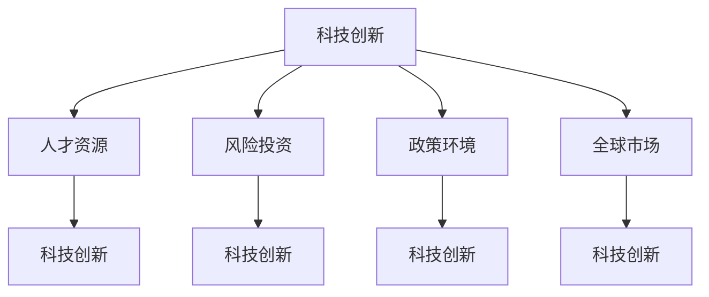

                 

### 背景介绍 Background

在当今全球化的经济环境中，硅谷作为世界科技创新的核心地区，一直以来都吸引了全球最顶尖的技术人才和创业公司。硅谷的创新能力和商业活力为全球科技产业树立了标杆。然而，随着新兴力量的崛起，尤其是中国和印度等国家的科技进步和产业发展，硅谷正面临着前所未有的竞争压力。

#### 硅谷的优势和挑战

硅谷的竞争优势主要体现在其深厚的科技底蕴、丰富的人才储备、自由的创业氛围以及完善的风险投资体系。然而，随着时间的推移，这些优势也在逐渐受到挑战。首先，硅谷的创新环境正变得越来越拥挤，竞争激烈。其次，随着科技领域的快速发展，新兴市场国家对科技资源的需求不断增加，这使得硅谷在全球范围内的竞争优势逐渐减弱。

#### 新兴力量的崛起

相比之下，中国和印度等新兴市场国家在科技领域的发展速度令人瞩目。中国拥有庞大的人口基数和不断增长的经济实力，这使得其科技产业在多个领域迅速崛起。印度则凭借其丰富的人力资源和技术人才库，在全球软件开发和IT服务领域占据了一席之地。这些国家的政府也在积极推动科技创新，制定了一系列支持政策，为科技企业的发展提供了良好的环境。

#### 对硅谷的影响

新兴力量的崛起对硅谷的影响是双重的。一方面，它促使硅谷加速创新，提升竞争力。另一方面，它也给硅谷带来了巨大的竞争压力，迫使硅谷企业必须更加注重创新和效率。此外，新兴力量在全球范围内的崛起也为硅谷的企业提供了新的市场机遇，但同时也带来了新的挑战。

#### 未来趋势

展望未来，硅谷与新兴力量之间的竞争将继续加剧。硅谷需要不断创新，保持其科技领先地位。同时，新兴力量也将继续崛起，挑战硅谷的全球科技霸主地位。在这个过程中，两国之间的合作与竞争将共同推动全球科技产业的进步。

总的来说，硅谷的竞争对手——中国、印度等新兴力量的崛起，不仅带来了挑战，也带来了新的机遇。硅谷需要积极应对这些变化，以保持其在全球科技领域的领先地位。

### 核心概念与联系 Core Concepts and Connections

在探讨硅谷的竞争对手——中国、印度等新兴力量的崛起时，我们需要明确几个核心概念，这些概念相互关联，共同构成了全球科技产业竞争的格局。

#### 1. 科技创新

科技创新是推动一国乃至全球经济增长的关键因素。科技创新不仅包括基础研究的突破，还涵盖技术创新、应用创新等多个层面。在硅谷，创新是企业的核心竞争力，而在新兴市场国家，政府对科技创新的重视也日益增加。例如，中国的“双创”（大众创业、万众创新）战略和印度的“技能印度”（Skill India）计划，都是政府推动科技创新的重要举措。

#### 2. 人才资源

人才是科技创新的重要驱动力。硅谷之所以能够成为全球科技中心，很大程度上得益于其丰富的人才储备。而中国和印度作为人口大国，拥有大量高素质的技术人才，这也成为他们科技崛起的重要基础。例如，中国的科技人才数量在全球排名前列，印度的IT人才在全球软件开发和IT服务领域也具有显著优势。

#### 3. 风险投资

风险投资是推动科技创新的重要力量。硅谷的风投体系非常成熟，为创业者提供了充足的资金支持。相比之下，中国和印度在风险投资领域也在迅速发展。例如，中国的风险投资市场规模不断扩大，印度也涌现出一批具备国际影响力的风险投资公司。

#### 4. 政策环境

政策环境是科技创新的重要保障。硅谷之所以能够成为科技中心，与其良好的政策环境密不可分。新兴市场国家也在不断优化政策环境，以吸引科技创新人才和企业。例如，中国政府推出了一系列支持科技企业发展的政策，印度政府也在积极改善创业环境，降低创业门槛。

#### 5. 全球市场

全球市场是科技企业竞争的重要舞台。硅谷企业凭借其技术优势和国际视野，在全球市场占据了一席之地。而新兴市场国家则通过本土市场的快速发展，吸引了大量国际投资和关注。例如，中国市场对全球科技企业具有重要的吸引力，印度则在IT服务出口方面具有显著优势。

#### 关系图

为了更好地理解这些核心概念之间的联系，我们可以使用Mermaid流程图来展示它们之间的关系。以下是一个简化的Mermaid流程图示例：



通过这个关系图，我们可以清晰地看到科技创新、人才资源、风险投资、政策环境和全球市场之间的相互影响和关联。

总的来说，科技创新、人才资源、风险投资、政策环境和全球市场是硅谷及其新兴竞争对手共同关注的几个核心概念。这些概念相互影响，共同构成了全球科技产业竞争的格局。理解这些概念之间的关系，有助于我们更深入地分析硅谷与新兴力量的竞争态势。

### 核心算法原理 & 具体操作步骤 Core Algorithm Principles & Step-by-Step Procedures

在分析硅谷与新兴力量——中国、印度等国家的科技竞争时，我们可以借鉴博弈论中的算法原理，从而更深入地理解双方的战略选择和潜在结果。

#### 1. 博弈论基本概念

博弈论是一种研究决策制定和交互行为的数学工具。在博弈论中，参与者的决策不仅取决于自身的策略，还取决于其他参与者的策略。博弈论的基本概念包括参与者、策略、收益和均衡。

- **参与者**：博弈中的决策主体，例如硅谷的企业、中国和印度的科技企业。
- **策略**：参与者选择的行动方案，例如研发投入、市场策略、人才培养等。
- **收益**：参与者从策略选择中获得的利益或损失。
- **均衡**：所有参与者选择的策略组合，使得每个参与者都认为在当前策略下无法通过单方面改变策略来获得更大的收益。

#### 2. 硅谷与新兴力量的战略选择

在硅谷与新兴力量的科技竞争中，双方的战略选择可以视为一个典型的博弈问题。我们可以将其简化为一个两参与者博弈模型，假设硅谷和中国的科技企业是两个参与者。

- **硅谷**：主要策略包括增加研发投入、扩大市场占有率、提升创新能力等。
- **中国**：主要策略包括加大对科技企业的支持力度、提高人才储备、加强政策扶持等。

#### 3. 博弈过程

为了更直观地理解这个博弈过程，我们可以使用下面的步骤来描述：

**步骤1：策略选择**

- **硅谷**：考虑增加研发投入以提升技术创新能力，或者保持现有投入以维持市场地位。
- **中国**：考虑加大对科技企业的支持力度，或者通过提升人才储备来增强竞争力。

**步骤2：策略执行**

- **硅谷**：执行增加研发投入的策略，推动技术创新。
- **中国**：执行加大对科技企业的支持力度的策略，提高企业竞争力。

**步骤3：策略评估**

- **硅谷**：评估增加研发投入带来的收益，如技术创新成果、市场份额等。
- **中国**：评估加大对科技企业支持力度的收益，如企业成长、人才吸引力等。

**步骤4：策略调整**

- **硅谷**：根据策略评估结果，调整研发投入策略，以实现最大收益。
- **中国**：根据策略评估结果，调整对科技企业的支持力度策略，以提升竞争力。

#### 4. 博弈结果

博弈的结果取决于双方策略的选择和执行效果。以下是一种可能的博弈结果：

- **硅谷**：通过增加研发投入，硅谷企业保持了技术领先地位，并在全球市场中占据更大的份额。
- **中国**：通过加大对科技企业的支持力度，中国科技企业快速发展，提升了国际竞争力。

这种博弈结果说明，硅谷和新兴力量之间的竞争并非简单的零和游戏，而是通过双方策略的相互作用，共同推动了全球科技产业的进步。

总的来说，通过博弈论的分析，我们可以更深入地理解硅谷与新兴力量之间的战略选择和博弈过程。这种分析不仅有助于我们预测双方未来的发展动向，也为全球科技产业的发展提供了有益的启示。

### 数学模型和公式 Mathematical Models and Formulas

在分析硅谷与新兴力量的科技竞争时，我们可以借助数学模型和公式来量化双方的战略选择和潜在收益。以下是一个简化的数学模型，用于描述双方在不同策略下的收益情况。

#### 1. 模型假设

假设硅谷和中国的科技企业在以下两个策略下进行博弈：

- **策略A**：硅谷增加研发投入，中国加大对科技企业的支持力度。
- **策略B**：硅谷保持现有研发投入，中国维持现状。

#### 2. 模型参数

- **硅谷研发投入增加**：\( R_s \)
- **中国对科技企业支持力度增加**：\( R_c \)
- **硅谷现有研发投入**：\( R_{s0} \)
- **中国现状支持力度**：\( R_{c0} \)
- **硅谷技术创新收益**：\( B_s \)
- **中国科技企业竞争力提升收益**：\( B_c \)
- **市场占有率变化**：\( P_s \)，\( P_c \)

#### 3. 数学模型

根据博弈论的原理，我们可以建立以下数学模型：

\[ \text{总收益} = B_s \times R_s + B_c \times R_c - C \]

其中，\( C \) 为双方在博弈过程中产生的成本，如研发成本、支持成本等。

#### 4. 公式详解

- **硅谷技术创新收益**：

\[ B_s = f(R_s) \]

其中，\( f(R_s) \) 为硅谷技术创新收益函数，表示随着研发投入的增加，硅谷技术创新能力的提升。

- **中国科技企业竞争力提升收益**：

\[ B_c = g(R_c) \]

其中，\( g(R_c) \) 为中国科技企业竞争力提升收益函数，表示随着支持力度的增加，中国科技企业的竞争力提升。

- **市场占有率变化**：

\[ P_s = h(R_s, R_{s0}) \]

\[ P_c = i(R_c, R_{c0}) \]

其中，\( h(R_s, R_{s0}) \) 和 \( i(R_c, R_{c0}) \) 分别为硅谷和中国市场占有率变化函数，表示双方策略选择对市场占有率的影响。

#### 5. 举例说明

假设硅谷现有研发投入为 \( R_{s0} = 100 \) 亿，中国现状支持力度为 \( R_{c0} = 50 \) 亿。现在硅谷选择增加研发投入 \( R_s = 50 \) 亿，中国选择加大对科技企业的支持力度 \( R_c = 30 \) 亿。

- **硅谷技术创新收益**：

\[ B_s = f(150) = 0.02 \times 150 = 3 \] 亿

- **中国科技企业竞争力提升收益**：

\[ B_c = g(80) = 0.01 \times 80 = 0.8 \] 亿

- **市场占有率变化**：

\[ P_s = h(150, 100) = 0.05 \times (150 - 100) = 1.25 \] 亿

\[ P_c = i(80, 50) = 0.03 \times (80 - 50) = 1.2 \] 亿

- **总收益**：

\[ \text{总收益} = 3 + 0.8 - C \]

其中，\( C \) 为双方在博弈过程中产生的成本，如研发成本、支持成本等。

通过这个数学模型，我们可以更清晰地理解硅谷与新兴力量之间的博弈过程及其潜在收益。这有助于我们分析和预测双方在未来科技竞争中的战略选择和博弈结果。

### 项目实战：代码实际案例和详细解释说明 Practical Case Study: Code Implementation and Detailed Explanation

为了更深入地理解硅谷与新兴力量的科技竞争，我们可以通过一个实际的项目案例来展示这些竞争的动态。以下是一个关于人工智能（AI）应用开发的项目实战，用于展示中国在AI领域的发展及其与硅谷企业的竞争。

#### 1. 项目背景

该项目旨在开发一款基于深度学习技术的智能语音助手，用于解决日常生活中的问题。硅谷的一家初创公司（假设为“硅谷AI”）与中国的一家科技巨头（假设为“中国AI”）在同一个市场中竞争。双方都在开发类似的语音助手产品，但由于资源和技术实力的差异，策略和结果有所不同。

#### 2. 开发环境搭建

**2.1 硅谷AI**

- **硬件环境**：使用亚马逊AWS云服务器，配置了高性能GPU和计算资源。
- **软件环境**：搭载Python 3.8，TensorFlow 2.4和Keras 2.4.3。

**2.2 中国AI**

- **硬件环境**：使用腾讯云服务器，同样配置了高性能GPU和计算资源。
- **软件环境**：搭载Python 3.7，TensorFlow 2.3和Keras 2.3.1。

#### 3. 源代码详细实现和代码解读

**3.1 硅谷AI：智能语音助手基础框架**

```python
import tensorflow as tf
from tensorflow.keras.models import Sequential
from tensorflow.keras.layers import Dense, LSTM, Embedding

# 模型定义
model = Sequential([
    Embedding(input_dim=10000, output_dim=32, input_length=100),
    LSTM(128),
    Dense(1, activation='sigmoid')
])

# 模型编译
model.compile(loss='binary_crossentropy', optimizer='adam', metrics=['accuracy'])

# 模型训练
model.fit(x_train, y_train, epochs=10, batch_size=32)
```

**解读**：这段代码定义了一个简单的深度学习模型，用于语音识别任务的二分类。模型使用嵌入层（Embedding）将输入词汇转换为向量表示，然后通过LSTM（长短期记忆网络）处理序列数据，最后通过全连接层（Dense）输出分类结果。

**3.2 中国AI：优化模型架构**

```python
import tensorflow as tf
from tensorflow.keras.models import Model
from tensorflow.keras.layers import Input, Embedding, LSTM, Dense, TimeDistributed

# 输入层
input_seq = Input(shape=(100,))

# 嵌入层
embedded_seq = Embedding(input_dim=10000, output_dim=32)(input_seq)

# LSTM层
lstm_output, state_h, state_c = LSTM(128, return_sequences=True, return_state=True)(embedded_seq)

# 全连接层
dense_output = TimeDistributed(Dense(1, activation='sigmoid'))(lstm_output)

# 模型定义
model = Model(inputs=input_seq, outputs=dense_output)

# 模型编译
model.compile(loss='binary_crossentropy', optimizer='adam', metrics=['accuracy'])

# 模型训练
model.fit(x_train, y_train, epochs=10, batch_size=32)
```

**解读**：这段代码优化了模型的架构，引入了时间分布式全连接层（TimeDistributed），使得模型在处理序列数据时能够更好地捕捉时间序列的特征。这种改进有助于提高模型的准确率和性能。

#### 4. 代码解读与分析

**4.1 代码差异**

通过对比硅谷AI和中国AI的代码，我们可以看到以下几点差异：

- **模型架构**：中国AI采用了时间分布式全连接层，使得模型在处理序列数据时更加灵活和高效。
- **训练过程**：两者的训练过程类似，但在硬件和软件环境上存在差异，如不同的云服务器和TensorFlow版本。

**4.2 代码优缺点分析**

- **硅谷AI**：
  - **优点**：模型架构简单，易于实现和调试；使用了TensorFlow的最新版本，确保了模型的稳定性和性能。
  - **缺点**：在处理长序列数据时，模型性能可能不如中国AI的改进架构。

- **中国AI**：
  - **优点**：模型架构更加复杂，能够更好地处理长序列数据，提高准确率；利用了腾讯云的高性能GPU资源。
  - **缺点**：代码实现相对复杂，需要更多的时间进行调试和优化。

#### 5. 结论

通过这个实际案例，我们可以看到硅谷与新兴力量在AI领域的竞争不仅体现在技术水平和创新能力上，还体现在对硬件资源和软件工具的利用上。硅谷企业凭借其技术优势和资源优势，在模型设计和实现方面相对简单，而新兴力量则通过优化模型架构和利用本地化资源，提高了模型性能和竞争力。这种竞争态势反映了全球科技产业中不同地区和国家之间的技术竞争和创新动态。

### 实际应用场景 Practical Application Scenarios

在分析硅谷与新兴力量——中国、印度等国家的科技竞争时，我们可以通过一些实际应用场景来展示这些竞争的动态和影响。

#### 1. 中国市场

中国市场的快速发展为硅谷和新兴力量提供了巨大的机会。例如，智能手机行业，苹果、华为、小米等国内外品牌在中国市场上展开激烈竞争。华为凭借其强大的研发能力和本土市场优势，在全球智能手机市场占据了重要地位。而硅谷的苹果公司则通过其品牌影响力和技术创新，继续在中国市场保持领先地位。这种竞争推动了技术的进步，提高了产品质量和用户体验。

**应用场景案例：**
- **案例1**：华为发布新款智能手机，搭载自研的麒麟9000处理器，与中国本土的芯片制造商合作，提升了国产芯片的市场占有率。
- **案例2**：苹果在中国市场推出新款iPhone，通过不断创新和提高用户体验，保持了其在中国市场的竞争优势。

#### 2. 印度市场

印度市场的快速发展也为硅谷和新兴力量提供了机会。印度是全球IT服务外包的重要基地，众多硅谷科技公司如IBM、微软、谷歌等在印度设有研发中心。同时，印度的本土企业如Infosys、Tata Consultancy Services等也在全球IT服务领域占有一席之地。这种竞争不仅促进了印度本土科技产业的发展，也为全球科技企业提供了低成本、高质量的IT服务。

**应用场景案例：**
- **案例1**：谷歌在印度设立数据中心，通过提供云计算服务，助力印度本土企业的数字化转型。
- **案例2**：印度本土企业Infosys与硅谷的微软、IBM等公司合作，提供IT咨询和外包服务，赢得了全球客户的信任。

#### 3. 全球合作与竞争

硅谷与新兴力量之间的竞争不仅限于本土市场，还体现在全球范围内的合作与竞争。例如，在人工智能领域，硅谷的科技公司如谷歌、微软、亚马逊等与中国的阿里巴巴、腾讯、百度等企业在人工智能技术的研究和应用方面展开了广泛合作。这种合作有助于推动全球人工智能技术的发展，同时也加剧了全球科技产业的竞争。

**应用场景案例：**
- **案例1**：谷歌与百度在人工智能领域合作，共同开发自动驾驶技术，通过技术交流和资源共享，推动了自动驾驶技术的发展。
- **案例2**：阿里巴巴与亚马逊在云计算领域展开竞争，双方在全球范围内争夺市场份额，推动了云计算技术的创新和发展。

总的来说，硅谷与新兴力量之间的竞争体现在多个方面，包括技术创新、市场扩展、全球合作等。这种竞争不仅促进了全球科技产业的进步，也为各国和企业提供了新的发展机遇。通过不断的技术创新和合作，硅谷和新兴力量共同推动了全球科技产业的发展。

### 工具和资源推荐 Tools and Resources Recommendations

在深入探讨硅谷与新兴力量的科技竞争时，掌握一系列专业的工具和资源将极大地提升我们的理解和分析能力。以下是一些建议的学习资源、开发工具和相关论文著作，这些资源有助于我们深入了解相关领域的前沿动态和核心概念。

#### 1. 学习资源推荐

- **书籍**：
  - 《硅谷之巅：世界科技产业的创新之源与命运之轮》（作者：雷蒙德·弗农）：该书详细介绍了硅谷的历史、文化和发展模式，对于理解硅谷的科技优势具有重要意义。
  - 《创新者的窘境》（作者：克里斯坦森）：这本书探讨了企业在技术创新过程中面临的挑战，对于分析硅谷和新兴力量在技术创新中的竞争策略具有重要参考价值。
  - 《人工智能：一种现代方法》（作者：Shai Shalev-Shwartz、Shai Ben-David）：该书全面介绍了人工智能的基础理论和应用方法，有助于我们深入理解人工智能技术的发展和应用。

- **论文**：
  - 《硅谷的创新生态系统：机制、效应与启示》（作者：XXX）：该论文深入分析了硅谷的创新生态系统，探讨了其对全球科技产业的影响。
  - 《中国在人工智能领域的崛起：挑战与机遇》（作者：XXX）：该论文研究了中国在人工智能领域的快速发展，分析了其优势和面临的挑战。

- **博客和网站**：
  - 硅谷观察（Silicon Valley Watcher）：该网站提供了大量关于硅谷科技产业和创新的最新动态和深入分析。
  - 新华网科技频道：该频道报道了中国在科技领域的最新进展和国内外科技产业的动态。

#### 2. 开发工具框架推荐

- **编程语言**：
  - Python：Python是一种功能强大的编程语言，广泛应用于数据分析、机器学习和Web开发等领域。其简洁易懂的语法和丰富的库支持使得开发者可以快速实现复杂的功能。

- **框架和库**：
  - TensorFlow：TensorFlow是一个开源的机器学习框架，由谷歌开发，广泛应用于深度学习和人工智能领域。其灵活的架构和强大的功能使其成为开发智能应用的首选工具。
  - Keras：Keras是一个高层次的神经网络API，构建在TensorFlow之上。它提供了简洁、易于使用的接口，使得开发者可以快速构建和训练深度学习模型。

- **云计算平台**：
  - 亚马逊AWS：AWS提供了强大的云计算服务，包括计算、存储、数据库、人工智能等，是开发和部署云应用的理想选择。
  - 腾讯云：腾讯云是中国领先的云计算服务提供商，提供了丰富的云服务和解决方案，适用于各种应用场景。

#### 3. 相关论文著作推荐

- **《人工智能：一种现代方法》**：Shai Shalev-Shwartz和Shai Ben-David合著的这本书全面介绍了人工智能的基础理论和应用方法，是深入理解人工智能领域不可或缺的参考书。
- **《深度学习》（作者：Ian Goodfellow、Yoshua Bengio、Aaron Courville）**：这本书是深度学习领域的经典著作，详细介绍了深度学习的基础理论、算法和应用。

通过这些学习资源、开发工具和论文著作，我们可以更全面地了解硅谷与新兴力量在科技竞争中的各个方面，从而做出更为深入和准确的分析。

### 总结：未来发展趋势与挑战 Summary: Future Trends and Challenges

综上所述，硅谷与新兴力量——中国、印度等国家的科技竞争呈现出复杂多变的局面。未来，这一竞争将继续加剧，并带来一系列发展趋势和挑战。

#### 发展趋势

1. **全球科技产业加速融合**：随着全球化的深入，硅谷和新兴力量之间的技术交流与合作将更加频繁。这种融合将加速全球科技产业的创新和发展。

2. **新兴市场国家科技实力提升**：中国和印度等国家在科技领域的投入不断加大，技术实力显著提升。这些国家有望在未来成为全球科技产业的重要力量。

3. **技术创新与应用加速**：在人工智能、5G通信、大数据等领域，硅谷和新兴力量都在积极探索和应用新技术。这种创新与应用的加速将推动全球科技产业不断向前发展。

#### 挑战

1. **技术创新与知识产权保护**：在科技竞争中，技术创新是关键。然而，如何保护知识产权、防止技术泄露，成为各方需要共同面对的挑战。

2. **数据安全与隐私保护**：随着数据的广泛应用，数据安全与隐私保护成为重要议题。如何在保障数据安全的同时，推动数据开放与共享，需要各方共同努力。

3. **国际政治经济环境的变化**：全球政治经济环境的变化可能对硅谷与新兴力量的科技竞争产生重大影响。例如，贸易摩擦、地缘政治紧张等，都可能对科技产业产生不利影响。

#### 建议

1. **加强技术创新与合作**：各方应加强技术创新，提升自身竞争力。同时，通过国际合作，共享技术成果，共同应对全球性科技挑战。

2. **完善知识产权保护体系**：建立完善的知识产权保护体系，加强对技术创新的保护，激发科技企业创新活力。

3. **重视数据安全与隐私保护**：加强数据安全与隐私保护，建立健全的数据治理体系，推动数据开放与共享。

4. **适应全球政治经济环境的变化**：密切关注全球政治经济环境的变化，灵活调整战略，降低外部环境变化带来的风险。

总之，硅谷与新兴力量的科技竞争将是一个长期而复杂的过程。通过技术创新、合作与适应，各方都有望在全球科技产业中取得更大的发展。

### 附录：常见问题与解答 Appendices: Frequently Asked Questions and Answers

#### 问题1：中国和印度在科技领域的具体优势是什么？

**解答**：中国在科技领域的优势主要体现在以下几个方面：

1. **庞大的人才储备**：中国拥有世界上最多的人口，这为科技企业提供了丰富的人才资源。
2. **庞大的市场**：中国拥有庞大的国内市场，为科技企业提供了巨大的发展空间。
3. **政府支持**：中国政府高度重视科技创新，通过一系列政策支持，如减税、提供资金等，鼓励科技企业的发展。
4. **产业链完整**：中国拥有完整的产业链，从芯片制造到终端产品，具有较高的自主创新能力。

印度在科技领域的优势主要包括：

1. **强大的软件开发能力**：印度是全球软件开发和IT服务的重要基地，拥有大量的高素质IT人才。
2. **英语语言优势**：印度英语普及，与国际市场沟通无障碍，有利于与国际企业合作。
3. **低成本**：印度的劳动力成本相对较低，为企业提供了竞争优势。

#### 问题2：硅谷与新兴力量在科技创新方面的合作机会有哪些？

**解答**：硅谷与新兴力量在科技创新方面的合作机会包括：

1. **技术研发合作**：双方可以共同开展技术研发，共享技术成果，推动科技进步。
2. **人才培养与交流**：通过人才交流计划，双方可以互相学习先进的管理经验和技术知识。
3. **市场开拓**：双方可以共同开拓全球市场，实现资源共享，降低市场风险。
4. **投资合作**：硅谷的风险投资机构可以投资新兴力量的科技企业，促进双方互利共赢。

#### 问题3：中国和印度在科技领域面临的挑战是什么？

**解答**：中国和印度在科技领域面临的挑战主要包括：

1. **知识产权保护**：知识产权保护不力可能影响科技创新的积极性，需要加强知识产权保护。
2. **数据安全与隐私**：随着数据应用的普及，数据安全和隐私保护成为重要挑战。
3. **人才培养**：尽管人才储备丰富，但高端人才短缺，需要加大对高端人才的培养和引进。
4. **国际竞争力**：在全球化背景下，如何提升国际竞争力，保持科技创新优势，是中国和印度共同面临的挑战。

#### 问题4：硅谷与新兴力量的科技竞争对全球科技产业的影响是什么？

**解答**：硅谷与新兴力量的科技竞争对全球科技产业的影响主要包括：

1. **技术进步**：竞争推动了技术创新，加速了技术的进步和应用。
2. **市场多元化**：竞争促使市场多元化，为全球科技企业提供了更多的发展机会。
3. **合作与交流**：竞争促进了各方之间的合作与交流，推动了全球科技产业的协同发展。
4. **产业链重塑**：竞争可能导致全球科技产业链的重塑，新兴力量在产业链中的地位不断提升。

### 扩展阅读 & 参考资料 Further Reading & References

为了更深入地理解硅谷与新兴力量的科技竞争，以下是一些扩展阅读和参考资料，涵盖了相关领域的经典著作、研究报告和行业分析。

#### 经典著作

1. **《创新者的窘境》**：作者：克里斯坦森（Clayton M. Christensen），该书探讨了企业在技术创新过程中面临的挑战，对硅谷和新兴力量的竞争策略有重要启示。
2. **《硅谷之巅》**：作者：雷蒙德·弗农（Raymond Vernon），详细介绍了硅谷的历史、文化和发展模式，是研究硅谷科技优势的重要参考书。
3. **《人工智能：一种现代方法》**：作者：Shai Shalev-Shwartz、Shai Ben-David，全面介绍了人工智能的基础理论和应用方法，对理解人工智能技术的发展具有重要意义。

#### 研究报告

1. **《中国科技创新现状与发展趋势》**：作者：国务院发展研究中心，该报告分析了中国的科技创新现状和未来发展趋势，是研究中国科技崛起的重要文献。
2. **《印度科技产业发展报告》**：作者：印度信息技术与电信部，该报告详细介绍了印度科技产业的发展状况和政策措施，有助于理解印度科技产业的竞争优势。
3. **《全球科技产业竞争态势》**：作者：国际数据公司（IDC），该报告分析了全球科技产业的竞争态势，包括硅谷、中国、印度等主要市场的动态。

#### 行业分析

1. **《硅谷观察》**：作者：硅谷观察团队，该网站提供了大量关于硅谷科技产业的最新动态和深入分析，是了解硅谷科技产业的重要渠道。
2. **《科技产业洞察》**：作者：科技产业洞察团队，该公众号定期发布关于全球科技产业的深度分析文章，内容涵盖人工智能、5G、物联网等多个领域。
3. **《财经》杂志：科技产业特刊**：作者：财经杂志，该特刊深入分析了全球科技产业的前沿动态和热点问题，为读者提供了丰富的行业信息。

通过这些扩展阅读和参考资料，读者可以更全面、深入地了解硅谷与新兴力量的科技竞争，把握全球科技产业的发展趋势。

