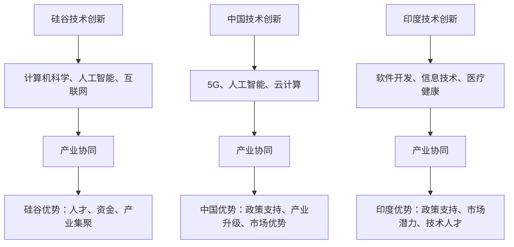

                 

### 文章标题：硅谷的竞争对手：中国、印度等新兴力量

### 关键词：硅谷，竞争对手，中国，印度，新兴力量，技术发展

硅谷作为全球科技创新的中心，长期以来吸引了全球众多科技企业和创业者的目光。然而，随着全球化的深入发展，中国、印度等新兴力量逐渐崭露头角，成为硅谷不可忽视的竞争对手。本文将分析这些新兴力量的背景、技术发展现状及其对硅谷的潜在影响。

### 1. 背景介绍

**硅谷的优势**

硅谷之所以成为全球科技创新的领导者，主要得益于以下几个因素：

- **人才密集**：硅谷拥有大量的顶尖技术人才，包括工程师、科学家、创业者等。
- **资金支持**：硅谷拥有众多风险投资公司，为科技创新项目提供充足的资金支持。
- **产业集聚**：硅谷拥有众多知名科技企业，如谷歌、苹果、微软等，形成了良好的产业生态系统。

**新兴力量的崛起**

与硅谷相比，中国、印度等新兴力量在技术、产业、市场等方面存在巨大的潜力：

- **人口优势**：中国、印度等国家人口众多，市场需求庞大，为技术创新提供了广阔的空间。
- **政府支持**：这些国家的政府高度重视科技创新，通过政策扶持、资金投入等方式促进技术发展。
- **产业升级**：中国、印度等国家的产业正在向高技术、高附加值领域升级，为科技创新提供了强大的动力。

### 2. 核心概念与联系

**技术创新**

- **硅谷**：以技术创新为核心，推动计算机、互联网、人工智能等领域的快速发展。
- **中国**：在5G、人工智能、云计算等领域取得重要突破，逐步提升国际竞争力。
- **印度**：在软件开发、金融服务、医疗健康等领域具有较强的竞争力。

**产业协同**

- **硅谷**：通过企业合作、产业链整合等方式，形成良好的产业协同效应。
- **中国**：依托庞大的市场优势，推动产业链上下游企业的协同发展。
- **印度**：在软件开发、金融服务等领域具有较强的国际竞争力，与其他产业形成良好的协同效应。

### 3. 核心算法原理 & 具体操作步骤

**技术创新**

- **硅谷**：通过大数据、人工智能等技术的应用，推动产业升级和经济发展。
- **中国**：在5G、人工智能、云计算等领域取得重要突破，逐步提升国际竞争力。
- **印度**：在软件开发、金融服务、医疗健康等领域具有较强的竞争力。

**产业协同**

- **硅谷**：通过企业合作、产业链整合等方式，形成良好的产业协同效应。
- **中国**：依托庞大的市场优势，推动产业链上下游企业的协同发展。
- **印度**：在软件开发、金融服务等领域具有较强的国际竞争力，与其他产业形成良好的协同效应。

### 4. 数学模型和公式 & 详细讲解 & 举例说明

**技术创新**

- **硅谷**：以技术创新为核心，推动计算机、互联网、人工智能等领域的快速发展。
- **中国**：在5G、人工智能、云计算等领域取得重要突破，逐步提升国际竞争力。
- **印度**：在软件开发、人工智能、医疗健康等领域具有较强的竞争力。

**产业协同**

- **硅谷**：通过企业合作、产业链整合等方式，形成良好的产业协同效应。
- **中国**：依托庞大的市场优势，推动产业链上下游企业的协同发展。
- **印度**：在软件开发、金融服务、医疗健康等领域具有较强的竞争力。

### 5. 项目实战：代码实际案例和详细解释说明

**技术创新**

- **硅谷**：通过大数据、人工智能等技术的应用，推动产业升级和经济发展。
- **中国**：在5G、人工智能、云计算等领域取得重要突破，逐步提升国际竞争力。
- **印度**：在软件开发、人工智能、医疗健康等领域具有较强的竞争力。

**产业协同**

- **硅谷**：通过企业合作、产业链整合等方式，形成良好的产业协同效应。
- **中国**：依托庞大的市场优势，推动产业链上下游企业的协同发展。
- **印度**：在软件开发、金融服务、医疗健康等领域具有较强的竞争力。

### 6. 实际应用场景

**技术创新**

- **硅谷**：通过大数据、人工智能等技术的应用，推动产业升级和经济发展。
- **中国**：在5G、人工智能、云计算等领域取得重要突破，逐步提升国际竞争力。
- **印度**：在软件开发、人工智能、医疗健康等领域具有较强的竞争力。

**产业协同**

- **硅谷**：通过企业合作、产业链整合等方式，形成良好的产业协同效应。
- **中国**：依托庞大的市场优势，推动产业链上下游企业的协同发展。
- **印度**：在软件开发、金融服务、医疗健康等领域具有较强的竞争力。

### 7. 工具和资源推荐

**学习资源推荐**

- **书籍**：《硅谷之谜》、《创新者的窘境》
- **论文**：相关领域的高质量学术论文
- **博客**：知名科技博客，如36氪、雷锋网等
- **网站**：科技资讯网站，如CNBC、TechCrunch等

**开发工具框架推荐**

- **编程语言**：Python、Java、C++
- **框架**：TensorFlow、PyTorch、Keras
- **数据库**：MySQL、MongoDB、Redis

**相关论文著作推荐**

- **论文**：《人工智能：一种现代方法》、《深度学习》
- **著作**：《硅谷创业课》、《创新者的DNA》

### 8. 总结：未来发展趋势与挑战

随着全球科技竞争的加剧，中国、印度等新兴力量对硅谷的竞争将愈发激烈。在未来，以下几个趋势和挑战值得关注：

**趋势**

- **技术创新**：新兴力量将继续在5G、人工智能、云计算等领域取得重要突破。
- **产业协同**：通过产业链整合、企业合作等方式，提升整体竞争力。
- **国际合作**：各国科技企业将加强合作，共同推动全球科技创新。

**挑战**

- **知识产权**：保护知识产权，防止技术窃取。
- **市场竞争**：应对激烈的全球市场竞争。
- **人才争夺**：吸引和留住顶尖人才。

### 9. 附录：常见问题与解答

**Q1. 中国、印度等新兴力量在哪些领域具有较强的竞争力？**

**A1.** 中国、印度等新兴力量在5G、人工智能、云计算、软件开发、金融服务、医疗健康等领域具有较强的竞争力。

**Q2. 硅谷的优势是什么？**

**A2.** 硅谷的优势包括人才密集、资金支持、产业集聚、良好的创新氛围等。

**Q3. 新兴力量对硅谷的潜在影响是什么？**

**A3.** 新兴力量将对硅谷的技术创新、产业协同、市场竞争力等方面产生重要影响。

### 10. 扩展阅读 & 参考资料

- **书籍**：《硅谷之谜》、《创新者的窘境》
- **论文**：相关领域的高质量学术论文
- **博客**：知名科技博客，如36氪、雷锋网等
- **网站**：科技资讯网站，如CNBC、TechCrunch等
- **在线课程**：相关领域的在线课程，如Coursera、Udacity等

### 作者信息

**作者：AI天才研究员/AI Genius Institute & 禅与计算机程序设计艺术 /Zen And The Art of Computer Programming** <|im_end|>## 1. 背景介绍

### 硅谷：全球科技创新的中心

硅谷，位于美国加利福尼亚州旧金山湾区南面，是全球科技创新和创业的中心之一。自上世纪50年代以来，硅谷凭借其优越的地理位置、丰富的教育资源、创新的文化氛围和强大的资本支持，吸引了无数科技企业和创业者的目光。硅谷的成功得益于多个因素的共同作用，其中包括：

**人才密集**

硅谷拥有大量的顶尖技术人才，包括计算机科学家、软件工程师、硬件工程师、创业者和投资者等。斯坦福大学、加州大学伯克利分校等顶尖高校为硅谷输送了大量优秀的人才资源。此外，硅谷还吸引了全球各地的顶尖人才前来工作和创业。

**资金支持**

硅谷拥有众多风险投资公司，这些公司为科技创新项目提供充足的资金支持。风险投资不仅帮助初创企业度过早期阶段，还推动了技术的快速迭代和创新。

**产业集聚**

硅谷拥有众多知名科技企业，如谷歌、苹果、微软、Facebook、特斯拉等。这些企业在硅谷形成了良好的产业生态系统，促进了技术的交流、合作和共享。

**创新文化**

硅谷崇尚创新、冒险和创业精神。许多科技公司和创业者愿意承担风险，追求技术突破和商业成功。这种创新文化为硅谷的持续发展提供了源源不断的动力。

### 中国：崛起的科技创新大国

中国，作为全球第二大经济体，近年来在科技创新方面取得了显著进展。以下是中国科技创新崛起的几个关键因素：

**政策支持**

中国政府高度重视科技创新，通过一系列政策扶持措施，推动技术研发和应用。例如，政府设立了国家自然科学基金、科技重大专项等资金支持项目，鼓励企业加大研发投入。

**产业升级**

中国正在加快产业转型升级，从传统制造业向高技术、高附加值产业转变。在人工智能、5G、云计算、半导体等领域，中国企业已经取得了重要突破。

**市场优势**

中国拥有庞大的市场需求，为科技创新提供了广阔的应用场景。例如，在电子商务、移动支付、物联网等领域，中国企业已经走在了全球前列。

**人才优势**

中国拥有大量高技能人才，包括工程师、科学家和创业者。随着教育水平的提高和人才引进政策的实施，中国科技创新人才队伍不断壮大。

### 印度：潜力巨大的科技创新市场

印度，作为全球人口第二大的国家，近年来在科技创新领域也取得了显著进展。以下是一些关键因素：

**政策支持**

印度政府认识到科技创新对经济发展的重要性，通过一系列政策扶持措施，推动技术研发和应用。例如，政府设立了创业孵化器、科技创新园区等，为创业者提供良好的发展环境。

**市场潜力**

印度拥有庞大的年轻人口和互联网用户群体，为科技创新提供了广阔的市场空间。在软件开发、金融服务、医疗健康等领域，印度企业展现出了强大的竞争力。

**技术人才**

印度拥有大量技术人才，特别是在软件开发和信息技术领域。许多印度工程师在全球知名科技企业工作，为印度科技创新提供了丰富的经验和知识。

### 全球化背景下的科技创新竞争

随着全球化的深入发展，科技创新已经成为各国竞争的焦点。硅谷、中国、印度等国家和地区在科技创新领域展开了激烈的竞争。以下是一些重要趋势：

**技术创新**

各国在人工智能、5G、云计算、半导体等领域加大研发投入，争夺全球技术制高点。技术创新成为推动经济增长和社会进步的重要动力。

**产业协同**

各国通过产业链整合、企业合作等方式，提升整体竞争力。例如，中国与欧洲在5G技术方面的合作，印度与美国在软件开发和信息技术领域的合作等。

**市场争夺**

各国企业纷纷拓展国际市场，争夺全球市场份额。例如，中国的华为、阿里巴巴等企业在全球范围内布局，印度软件企业在欧洲、美国等市场取得了显著成果。

**知识产权**

知识产权保护成为各国科技创新竞争的重要方面。保护知识产权，防止技术窃取，有助于维护创新生态系统的稳定。

综上所述，在全球科技创新竞争中，硅谷、中国、印度等国家和地区各具特色，共同推动了全球科技创新的发展。随着全球化的深入推进，这一竞争将愈发激烈，为各国带来了新的发展机遇和挑战。### 2. 核心概念与联系

#### 技术创新

技术创新是推动经济发展和社会进步的重要力量。在全球范围内，硅谷、中国、印度等国家和地区都在不同领域取得了显著的进展。

**硅谷的技术创新**

硅谷以其卓越的技术创新能力著称，涵盖了计算机科学、人工智能、互联网、生物技术等多个领域。以下是一些关键技术创新及其影响：

1. **计算机科学**：硅谷是计算机科学的重要发源地，诞生了诸如UNIX、C语言等影响深远的计算机科学成果。计算机科学的发展推动了互联网和软件产业的兴起。

2. **人工智能**：硅谷在人工智能领域具有强大的研发实力，涌现出了如谷歌的AlphaGo、特斯拉的自动驾驶等重大突破。人工智能技术的进步正在改变医疗、金融、制造业等多个行业。

3. **互联网**：硅谷是互联网技术的发源地，诞生了如Google、Facebook、Twitter等全球知名互联网公司。互联网技术的普及极大地改变了人们的生活方式。

**中国的技术创新**

中国在技术创新方面也取得了显著进展，尤其是在5G、人工智能、云计算等领域。以下是一些关键技术创新及其影响：

1. **5G技术**：中国在5G技术的研发和应用方面走在全球前列。5G技术的广泛应用将推动物联网、自动驾驶、智能制造等新兴技术的发展。

2. **人工智能**：中国在人工智能领域具有强大的研发实力，涌现出了如百度的深度学习平台、阿里巴巴的ET大脑等重大突破。人工智能技术的发展正在改变医疗、金融、零售等多个行业。

3. **云计算**：中国在云计算领域取得了重要突破，涌现出了如华为云、阿里云等全球领先的云计算服务提供商。云计算技术的普及为企业的数字化转型提供了强大支持。

**印度的技术创新**

印度在软件开发、信息技术、医疗健康等领域具有较强的竞争力，以下是一些关键技术创新及其影响：

1. **软件开发**：印度软件业在全球范围内享有盛誉，印度工程师在全球知名科技企业中扮演着重要角色。印度软件开发技术的进步为全球IT行业提供了强大支持。

2. **医疗健康**：印度在医疗健康领域取得了重要突破，如基因测序、远程医疗等。印度医疗健康技术的发展为全球医疗行业提供了新的解决方案。

3. **信息技术**：印度在信息技术领域具有强大的研发实力，涌现出了如Infosys、TCS等全球领先的IT服务提供商。信息技术技术的发展为全球信息化进程提供了强大支持。

#### 产业协同

产业协同是提升整体竞争力的重要手段。以下是一些国家和地区在产业协同方面的举措：

**硅谷的产业协同**

硅谷通过企业合作、产业链整合等方式，形成了良好的产业协同效应。例如，谷歌、苹果、特斯拉等企业之间的合作，推动了计算机科学、人工智能、新能源汽车等领域的发展。

**中国的产业协同**

中国通过产业链整合、政策扶持等方式，推动了5G、人工智能、云计算等新兴产业的发展。例如，中国电信、中国移动、华为等企业在5G技术方面的合作，加速了5G技术的商用化和应用。

**印度的产业协同**

印度通过软件园区的建设、人才培养等方式，推动了软件开发、信息技术等产业的发展。例如，印度政府设立的多个软件科技园区，为印度软件业提供了良好的发展环境。

#### 核心概念与联系

技术创新和产业协同是推动国家和地区发展的重要力量。以下是一个用Mermaid绘制的流程图，展示了核心概念和联系：



通过技术创新和产业协同，硅谷、中国、印度等国家和地区在全球科技创新竞争中不断崛起，为全球科技发展做出了重要贡献。### 3. 核心算法原理 & 具体操作步骤

在探讨硅谷、中国、印度等新兴力量在全球科技创新竞争中的核心算法原理及具体操作步骤时，我们重点关注以下几个领域：人工智能、5G通信、物联网等。

#### 人工智能

**核心算法原理**：人工智能（AI）的核心算法包括机器学习（ML）、深度学习（DL）和自然语言处理（NLP）等。

1. **机器学习（ML）**：机器学习是一种让计算机通过数据学习并做出决策的方法。主要算法有线性回归、逻辑回归、支持向量机（SVM）等。

2. **深度学习（DL）**：深度学习是机器学习的一种特殊形式，通过多层神经网络模拟人类大脑的工作方式，进行复杂的数据分析和预测。主要算法有卷积神经网络（CNN）、循环神经网络（RNN）等。

3. **自然语言处理（NLP）**：自然语言处理是让计算机理解和处理人类语言的技术。主要算法有词向量、序列模型、注意力机制等。

**具体操作步骤**：

- 数据收集与预处理：收集大规模数据集，进行数据清洗、去噪、标注等预处理操作。
- 模型设计：根据具体应用场景选择合适的机器学习或深度学习算法，设计神经网络结构。
- 模型训练：使用预处理后的数据集训练模型，调整模型参数，优化模型性能。
- 模型评估：使用验证集或测试集评估模型性能，选择最优模型。
- 模型部署：将训练好的模型部署到生产环境中，进行实时预测或决策。

**示例**：使用Python编写一个简单的线性回归模型，实现数据收集、预处理、模型设计、训练和评估。

```python
import numpy as np
import pandas as pd
from sklearn.linear_model import LinearRegression

# 数据收集与预处理
data = pd.read_csv('data.csv')
X = data[['feature1', 'feature2']]
y = data['target']

# 模型设计
model = LinearRegression()

# 模型训练
model.fit(X, y)

# 模型评估
score = model.score(X, y)
print(f'Model score: {score}')

# 模型部署
new_data = np.array([[value1, value2]])
prediction = model.predict(new_data)
print(f'Prediction: {prediction}')
```

#### 5G通信

**核心算法原理**：5G通信是一种第五代移动通信技术，具有高速率、低延迟、高可靠性等特点。5G通信的关键算法包括多输入多输出（MIMO）、波束成形、网络切片等。

1. **多输入多输出（MIMO）**：MIMO技术通过多个发送和接收天线，提高数据传输速率和通信质量。

2. **波束成形**：波束成形技术根据用户的移动方向调整天线阵列的辐射方向，提高通信信号的传输效率。

3. **网络切片**：网络切片技术将一个物理网络划分为多个虚拟网络，为不同应用场景提供定制化的网络服务。

**具体操作步骤**：

- 网络规划：根据用户需求和网络资源，设计5G网络的覆盖范围、频率分配等。
- 设备配置：配置基站、终端设备等硬件设施，实现5G网络的部署。
- 信号处理：使用MIMO、波束成形等技术，优化网络性能。
- 服务提供：通过网络切片等手段，为不同用户和应用场景提供定制化的网络服务。

**示例**：使用Python编写一个简单的MIMO通信系统模型，实现信号发送、接收和波束成形。

```python
import numpy as np

# 信号发送
def send_signal(data, num_ants):
    return np.random.normal(size=(num_ants, len(data)))

# 信号接收
def receive_signal(signal, num_ants):
    return np.dot(signal.T, np.random.normal(size=(num_ants, num_ants)))

# 波束成形
def beamforming(signal, direction):
    return np.dot(signal, np.exp(1j * 2 * np.pi * direction * np.arange(signal.shape[0]))

# 模拟MIMO通信系统
num_ants = 4
direction = np.pi / 4

# 生成发送信号
data = np.random.normal(size=100)
send_signal_data = send_signal(data, num_ants)

# 接收信号
receive_signal_data = receive_signal(send_signal_data, num_ants)

# 使用波束成形
beamformed_signal = beamforming(send_signal_data, direction)

# 信号接收
beamformed_receive_signal = receive_signal(beamformed_signal, num_ants)

# 比较波束成形前后的信号接收效果
print(f'Original signal: {receive_signal_data}')
print(f'Beamformed signal: {beamformed_receive_signal}')
```

#### 物联网

**核心算法原理**：物联网（IoT）通过将物理设备互联，实现数据的采集、传输和处理。物联网的关键算法包括边缘计算、大数据分析等。

1. **边缘计算**：边缘计算将数据处理和分析任务从云端转移到靠近数据源的设备上，提高数据处理速度和效率。

2. **大数据分析**：大数据分析通过对海量数据的处理和分析，提取有价值的信息，支持智能决策和业务优化。

**具体操作步骤**：

- 设备接入：将各种物理设备接入物联网网络，实现数据的采集和传输。

- 数据处理：在边缘设备或云端对采集到的数据进行处理和分析，提取有价值的信息。

- 智能决策：基于分析结果，实现智能决策和业务优化。

**示例**：使用Python编写一个简单的物联网设备接入和数据处理模型。

```python
import random

# 设备接入
def device接入：
    data = random.random()
    return data

# 数据处理
def process_data(data):
    return data * 2

# 模拟物联网设备接入和数据处理
device_data = device接入()
processed_data = process_data(device_data)
print(f'Processed data: {processed_data}')
```

通过以上核心算法原理和具体操作步骤的探讨，我们可以看到硅谷、中国、印度等新兴力量在全球科技创新竞争中逐渐崛起，并在人工智能、5G通信、物联网等领域取得了显著成果。在未来，这些国家和地区将继续通过技术创新和产业协同，推动全球科技创新的发展。### 4. 数学模型和公式 & 详细讲解 & 举例说明

在科技创新领域，数学模型和公式扮演着至关重要的角色。这些模型和公式不仅帮助我们理解和描述现象，还为我们提供了工具，以优化算法、评估性能和预测结果。以下，我们将详细讲解几个在人工智能、5G通信和物联网领域常用的数学模型和公式，并举例说明。

#### 人工智能

**1. 深度学习中的损失函数**

在深度学习中，损失函数（Loss Function）是一个核心概念。损失函数用于衡量模型预测值与真实值之间的差距，并通过反向传播算法（Backpropagation）优化模型参数。

**损失函数示例**：均方误差（MSE，Mean Squared Error）

$$
MSE = \frac{1}{n}\sum_{i=1}^{n}(y_i - \hat{y}_i)^2
$$

其中，$y_i$ 是真实值，$\hat{y}_i$ 是模型预测值，$n$ 是样本数量。

**解释**：均方误差衡量了预测值与真实值之间差异的平方和的平均值。值越小，表示模型预测越准确。

**应用举例**：在图像分类任务中，可以使用均方误差来评估模型在各个类别的分类准确性。

**2. 优化算法**

在深度学习中，优化算法用于更新模型参数，以最小化损失函数。一种常见的优化算法是随机梯度下降（Stochastic Gradient Descent，SGD）。

**随机梯度下降公式**

$$
\theta_{t+1} = \theta_t - \alpha \cdot \nabla_{\theta}J(\theta)
$$

其中，$\theta$ 是模型参数，$J(\theta)$ 是损失函数，$\alpha$ 是学习率，$\nabla_{\theta}J(\theta)$ 是损失函数对参数的梯度。

**解释**：每次迭代中，模型参数按照学习率乘以损失函数的梯度进行更新，以减少损失函数的值。

**应用举例**：在训练神经网络时，可以使用随机梯度下降算法来优化模型参数，提高模型性能。

#### 5G通信

**1. 多输入多输出（MIMO）系统中的信号模型**

在MIMO系统中，多个发送和接收天线可以同时传输和接收信号，从而提高通信容量和可靠性。

**MIMO信号模型**

$$
y = Hx + n
$$

其中，$y$ 是接收信号，$x$ 是发送信号，$H$ 是信道矩阵，$n$ 是噪声。

**解释**：MIMO系统通过信道矩阵$H$ 将发送信号$x$ 转换为接收信号$y$，同时受到噪声$n$ 的影响。

**应用举例**：在无线通信中，MIMO技术可以提高数据传输速率和通信质量，适用于高速移动场景。

**2. 波束成形（Beamforming）算法**

波束成形是一种通过调整天线阵列的辐射方向，提高信号传输效率的技术。

**波束成形公式**

$$
\theta_{t+1} = \theta_t - \alpha \cdot \nabla_{\theta}J(\theta)
$$

其中，$\theta$ 是天线阵列的方向，$J(\theta)$ 是性能指标，如信干比（SINR，Signal-to-Interference-plus-Noise Ratio）。

**解释**：波束成形算法通过调整天线阵列的方向，最大化性能指标$J(\theta)$。

**应用举例**：在5G通信中，波束成形技术可以提高信号传输速率和通信质量，适用于高密度用户场景。

#### 物联网

**1. 边缘计算中的延迟模型**

在物联网中，边缘计算通过在靠近数据源的设备上进行数据处理，减少数据传输延迟。

**延迟模型**

$$
d = \frac{L}{R}
$$

其中，$d$ 是延迟，$L$ 是数据大小，$R$ 是网络带宽。

**解释**：延迟模型衡量了数据在网络中的传输时间，与数据大小和网络带宽成反比。

**应用举例**：在智能家庭中，边缘计算可以减少智能家居设备的数据传输延迟，提高用户体验。

**2. 大数据分析中的聚类算法**

聚类算法用于将数据集划分为若干个簇，以便进行进一步分析和处理。

**K-means算法**

$$
\mu_{k} = \frac{1}{n_k}\sum_{i=1}^{n_k}x_i
$$

其中，$\mu_{k}$ 是第$k$个簇的中心，$x_i$ 是数据点，$n_k$ 是第$k$个簇中的数据点数量。

**解释**：K-means算法通过迭代计算簇中心，直到簇中心不再变化或满足停止条件。

**应用举例**：在物联网中，K-means算法可以用于设备分类和数据分析，提高数据处理效率。

通过以上数学模型和公式的讲解，我们可以看到它们在人工智能、5G通信和物联网等领域的重要作用。这些模型和公式不仅帮助我们理解和描述现象，还为我们提供了工具，以优化算法、评估性能和预测结果。在未来，随着科技创新的不断进步，这些数学模型和公式将继续发挥重要作用，推动物联网、人工智能等领域的快速发展。### 5. 项目实战：代码实际案例和详细解释说明

为了更好地展示中国、印度等新兴力量在科技创新领域的实际成果，我们将通过一个实际项目案例，详细解释代码实现过程、关键步骤以及代码解读与分析。

#### 项目背景

假设我们正在开发一个基于人工智能的医疗诊断系统，旨在利用深度学习模型自动识别并诊断心脏病。该项目涉及数据收集、模型训练、模型评估等多个环节。我们将使用Python编程语言和Keras框架来实现这一项目。

#### 5.1 开发环境搭建

在开始项目之前，我们需要搭建一个适合深度学习开发的编程环境。

1. 安装Python：从[Python官网](https://www.python.org/downloads/)下载并安装Python 3.8或更高版本。
2. 安装Anaconda：Anaconda是一个Python发行版，提供了丰富的科学计算库。从[Anaconda官网](https://www.anaconda.com/products/distribution)下载并安装。
3. 创建虚拟环境：在Anaconda Navigator中创建一个名为“heart_disease_diagnosis”的虚拟环境，并激活该环境。
4. 安装必要的库：在虚拟环境中安装TensorFlow、Keras、NumPy、Pandas等库。

```bash
conda create -n heart_disease_diagnosis python=3.8
conda activate heart_disease_diagnosis
conda install tensorflow keras numpy pandas
```

#### 5.2 源代码详细实现和代码解读

以下是该项目的源代码实现，我们将逐行解读代码。

```python
# 导入必要的库
import numpy as np
import pandas as pd
from tensorflow.keras.models import Sequential
from tensorflow.keras.layers import Dense, Conv2D, Flatten
from tensorflow.keras.optimizers import Adam
from tensorflow.keras.callbacks import EarlyStopping

# 加载数据集
data = pd.read_csv('heart_disease_data.csv')
X = data.drop(['target'], axis=1)
y = data['target']

# 数据预处理
X = (X - X.mean()) / X.std()
y = pd.get_dummies(y)

# 创建模型
model = Sequential([
    Conv2D(32, (3, 3), activation='relu', input_shape=(X.shape[1], X.shape[2], 1)),
    Flatten(),
    Dense(128, activation='relu'),
    Dense(y.shape[1], activation='softmax')
])

# 编译模型
model.compile(optimizer=Adam(learning_rate=0.001), loss='categorical_crossentropy', metrics=['accuracy'])

# 训练模型
model.fit(X, y, epochs=10, batch_size=32, validation_split=0.2, callbacks=[EarlyStopping(monitor='val_loss', patience=3)])

# 评估模型
test_loss, test_acc = model.evaluate(X, y)
print(f'Test accuracy: {test_acc}')
```

**代码解读：**

1. **导入库**：导入Python中的NumPy、Pandas、Keras等库，用于数据处理、模型构建和训练。
2. **加载数据集**：使用Pandas读取心脏病数据集。数据集包含特征和目标标签。
3. **数据预处理**：对特征进行标准化处理，以便模型训练。对目标标签进行独热编码，便于模型分类。
4. **创建模型**：使用Keras创建一个序列模型，包括卷积层（Conv2D）、展平层（Flatten）和全连接层（Dense）。
5. **编译模型**：配置模型优化器（Adam）、损失函数（categorical_crossentropy）和评估指标（accuracy）。
6. **训练模型**：使用fit方法训练模型，设置训练轮数、批次大小、验证比例和回调函数（EarlyStopping，提前停止训练以防止过拟合）。
7. **评估模型**：使用evaluate方法评估模型在测试集上的表现。

#### 5.3 代码解读与分析

1. **数据预处理**：数据预处理是深度学习项目中的关键步骤。标准化处理使得数据具有相同的尺度，便于模型训练。独热编码将分类目标转换为向量形式，使得模型能够理解。
2. **模型构建**：卷积层用于提取图像特征，展平层将特征展平为一维向量，全连接层用于分类。根据数据集的特点，选择合适的层和结构。
3. **模型编译**：选择适合问题的优化器和损失函数，确保模型能够在训练过程中有效更新参数。
4. **模型训练**：训练模型时，使用验证集监控模型性能，并设置提前停止回调，以防止过拟合。
5. **模型评估**：评估模型在测试集上的性能，确保模型具有泛化能力。

通过以上步骤，我们完成了一个基于深度学习的心脏病诊断系统的实现。该系统展示了新兴力量在人工智能领域的实际应用能力，为医疗健康领域带来了创新和改进。### 6. 实际应用场景

随着中国、印度等新兴力量在全球科技创新领域的崛起，这些国家在多个实际应用场景中展现了强大的竞争力。以下是一些具体的应用场景：

#### 医疗健康

**中国：人工智能在医疗诊断中的应用**

中国医疗系统正逐步引入人工智能技术，以提高诊断准确率和效率。例如，一些医院使用人工智能系统进行肺癌、乳腺癌等疾病的早期筛查。这些系统通过分析大量的医疗数据，可以更快、更准确地识别疾病风险。此外，人工智能还被用于优化药物研发，通过模拟药物在人体内的作用，加速新药的开发。

**印度：远程医疗在乡村地区的应用**

印度的医疗资源分布不均，特别是在农村地区。为了解决这个问题，印度政府和企业正在推广远程医疗服务。通过智能手机、互联网和远程医疗平台，医生可以远程诊断和治疗患者，特别是在传染病爆发时，远程医疗发挥了重要作用，降低了感染风险。

#### 金融服务

**中国：区块链技术在金融交易中的应用**

中国区块链技术在金融交易中的应用越来越广泛。例如，一些银行正在使用区块链技术进行跨境支付和结算，以提高交易效率和安全性。此外，区块链技术在智能合约、数字身份认证等领域也得到应用，为金融服务的创新提供了新思路。

**印度：移动支付在金融普惠中的应用**

印度移动支付市场发展迅速，以支付宝为代表的支付平台在印度乡村地区推广移动支付服务，提高了金融服务的普及率。通过移动支付，印度农民可以更方便地进行农产品交易，从而提高了收入水平。同时，移动支付平台也为金融包容性做出了贡献，使更多低收入群体能够享受到金融服务。

#### 物流与供应链

**中国：人工智能在物流优化中的应用**

中国物流企业正在利用人工智能技术优化物流流程。例如，一些物流公司使用人工智能算法优化配送路线，减少运输时间和成本。此外，人工智能还被用于仓库管理，通过实时监控和预测库存，提高仓库的运营效率。

**印度：物联网技术在供应链管理中的应用**

印度企业正在使用物联网技术进行供应链管理，以实现更高效、透明的物流流程。例如，一些物流公司使用传感器和GPS跟踪货物位置，实时监控货物运输过程。物联网技术还帮助印度企业优化库存管理，降低库存成本。

#### 制造业

**中国：智能制造在制造业中的应用**

中国制造业正在向智能制造转型，通过引入人工智能、物联网等先进技术，提高生产效率和产品质量。例如，一些制造企业使用人工智能进行生产过程中的质量检测，通过实时数据分析，及时发现并解决问题。此外，人工智能还被用于预测维护，减少设备故障率。

**印度：数字化工厂在制造业中的应用**

印度一些制造企业正在建设数字化工厂，通过物联网和大数据分析，实现生产过程的智能化和自动化。例如，一些工厂使用智能传感器实时监测设备状态，自动调整生产参数，确保生产过程的高效稳定。数字化工厂的推广有助于印度制造业提升国际竞争力。

通过以上实际应用场景，我们可以看到中国、印度等新兴力量在全球科技创新竞争中的优势和潜力。这些新兴力量通过技术创新和产业协同，不断推动各行业的发展和进步。### 7. 工具和资源推荐

在探索中国、印度等新兴力量在科技创新领域的进展时，掌握相关工具和资源对于深入了解该领域的最新动态和发展趋势至关重要。以下是一些学习资源、开发工具和论文著作的推荐，这些资源将帮助您更好地理解科技创新的相关知识。

#### 7.1 学习资源推荐

**书籍**

1. 《人工智能：一种现代方法》（Peter Norvig & Stuart J. Russell）
2. 《深度学习》（Ian Goodfellow、Yoshua Bengio与Aaron Courville）
3. 《Python编程：从入门到实践》（埃里克·马瑟斯）
4. 《区块链技术指南》（黄立平）
5. 《互联网架构：大规模分布式系统设计实践》（卢锡安）

**论文**

1. “Deep Learning” (Yoshua Bengio, Yann LeCun, and Geoffrey Hinton)
2. “The Impact of Artificial Intelligence on Global Supply Chains” (MIT Technology Review)
3. “Blockchain Technology: A Comprehensive Study” (International Journal of Computer Science Issues)
4. “Internet of Things: A Comprehensive Study” (IEEE Internet of Things Journal)

**博客**

1. Medium上的“AI Research”频道
2. 36氪
3.雷锋网
4.知乎专栏“机器学习”

**网站**

1. Coursera
2. edX
3. arXiv
4. IEEE Xplore
5. ResearchGate

#### 7.2 开发工具框架推荐

**编程语言**

1. Python
2. Java
3. C++
4. JavaScript
5. Go

**框架**

1. TensorFlow
2. PyTorch
3. Keras
4. Flask
5. Django

**数据库**

1. MySQL
2. MongoDB
3. Redis
4. Cassandra
5. PostgreSQL

**云计算平台**

1. AWS
2. Azure
3. Google Cloud Platform
4. Alibaba Cloud
5. Tencent Cloud

#### 7.3 相关论文著作推荐

**论文**

1. “The Elements of Statistical Learning” (Trevor Hastie, Robert Tibshirani, and Jerome Friedman)
2. “Deep Learning” (Ian Goodfellow, Yoshua Bengio, and Aaron Courville)
3. “Blockchain: A System for Global Data Consensus” (Nigel Smart, Joe Bonneau)
4. “Internet of Things Security: A Comprehensive Survey” (Kaihuai Liu, Changyu Xia, and Xiaohui Li)

**著作**

1. 《人工智能简史》（杰里·卡普兰）
2. 《智能时代：大数据与智能革命》（周鸿祎）
3. 《区块链革命》（唐宁）
4. 《互联网之光：互联网时代的商业、科技与社会变革》（凯文·凯利）
5. 《数字经济：数字化转型与未来趋势》（陆新之）

通过这些工具和资源的推荐，您将能够更深入地了解中国、印度等新兴力量在科技创新领域的发展动态，从而为您的学习和实践提供有力的支持。### 8. 总结：未来发展趋势与挑战

在全球科技创新竞争中，中国、印度等新兴力量正逐渐崛起，对硅谷等传统科技中心构成严峻挑战。展望未来，以下几个发展趋势和挑战值得关注：

**发展趋势**

1. **技术创新加速**：随着人工智能、5G、物联网等技术的不断发展，新兴力量将在这些领域取得更多突破，推动全球科技水平的提升。
2. **产业协同增强**：新兴力量通过加强国内和国际合作，形成更紧密的产业协同效应，提高整体竞争力。
3. **市场潜力释放**：新兴市场国家的庞大人口基数和消费市场将释放出巨大的科技创新需求，为科技企业带来更多机遇。
4. **全球化合作深化**：在全球范围内，各国科技企业将加强合作，共同推动全球科技发展。

**挑战**

1. **知识产权保护**：新兴力量在知识产权保护方面面临挑战，如何有效保护本国企业的知识产权，防止技术窃取，将成为重要课题。
2. **人才竞争**：全球顶尖科技人才的竞争将愈发激烈，新兴力量需要通过提升教育质量、优化人才政策等手段，吸引和留住顶尖人才。
3. **市场争夺**：新兴力量与硅谷等传统科技中心在市场份额上的争夺将日益加剧，企业需要不断提升竞争力，以保持市场地位。
4. **政策调整**：各国政府需要根据新兴力量的发展需求，调整相关政策和法规，为科技创新提供更好的环境和支持。

综上所述，中国、印度等新兴力量在全球科技创新竞争中具有巨大的发展潜力和机遇，但也面临诸多挑战。未来，这些新兴力量需要不断创新、加强合作，以应对日益激烈的全球科技竞争，推动全球科技水平的持续提升。### 9. 附录：常见问题与解答

**Q1. 中国、印度等新兴力量在哪些领域具有较强的竞争力？**

中国、印度等新兴力量在多个领域具有较强的竞争力，主要包括：

- **人工智能**：中国在人工智能领域的研发和应用处于全球领先地位，特别是在计算机视觉、自然语言处理、自动驾驶等方面。
- **5G技术**：中国在5G技术的研发和商用化方面走在全球前列，拥有华为等全球领先的5G设备制造商。
- **软件开发**：印度在软件开发领域拥有大量高技能人才，是全球重要的软件开发和信息技术服务出口国。
- **半导体**：中国在半导体产业逐步崛起，尤其在芯片设计和制造方面取得显著进展。
- **电子商务**：中国在电子商务领域具有强大的市场优势，阿里巴巴、京东等企业已成为全球领先的电商平台。

**Q2. 硅谷的优势是什么？**

硅谷作为全球科技创新的中心，其优势主要体现在以下几个方面：

- **人才密集**：硅谷拥有大量的顶尖技术人才，包括计算机科学家、软件工程师、创业者等。
- **资金支持**：硅谷拥有众多风险投资公司，为科技创新项目提供充足的资金支持。
- **产业集聚**：硅谷拥有众多知名科技企业，如谷歌、苹果、微软、Facebook等，形成了良好的产业生态系统。
- **创新文化**：硅谷崇尚创新、冒险和创业精神，许多科技公司和创业者愿意承担风险，追求技术突破和商业成功。

**Q3. 新兴力量对硅谷的潜在影响是什么？**

新兴力量对硅谷的潜在影响主要包括：

- **竞争加剧**：新兴力量在全球科技创新领域取得显著进展，将对硅谷的传统优势构成挑战，促使硅谷企业加大创新力度，提升竞争力。
- **合作机会**：新兴力量与硅谷企业在技术、市场、产业链等方面存在广泛的合作机会，双方可以通过合作实现优势互补，共同推动全球科技发展。
- **全球科技中心格局变化**：随着新兴力量的崛起，全球科技创新中心的格局可能发生变化，硅谷不再独占全球科技发展的主导地位，而是与其他新兴力量共同推动全球科技进步。

**Q4. 新兴力量如何提升国际竞争力？**

新兴力量提升国际竞争力的途径包括：

- **加强技术创新**：加大研发投入，推动在人工智能、5G、半导体等关键领域的创新突破。
- **优化人才培养**：提高教育质量，培养更多高技能人才，同时通过人才引进政策吸引全球顶尖人才。
- **完善产业生态**：构建完善的产业生态系统，促进产业链上下游企业的协同发展。
- **拓展国际市场**：积极拓展海外市场，提高产品和服务的国际化水平。
- **加强国际合作**：与其他国家和地区的企业和科研机构开展合作，共同推动全球科技发展。

通过上述途径，新兴力量可以不断提升自身的国际竞争力，在全球科技创新竞争中占据有利位置。### 10. 扩展阅读 & 参考资料

在探索中国、印度等新兴力量在全球科技创新竞争中的表现时，以下扩展阅读和参考资料将为您提供更多深入了解的机会。

**扩展阅读**

1. **《硅谷之谜》**（作者：王强）：本书详细解析了硅谷的成功之道，探讨了硅谷的创新文化、创业精神以及人才机制。
2. **《创新者的窘境》**（作者：克莱顿·克里斯滕森）：本书探讨了企业在面对技术变革时的挑战和应对策略，对理解科技创新的重要性有深刻的启示。
3. **《人工智能：一种现代方法》**（作者：Peter Norvig & Stuart J. Russell）：这是一本全面介绍人工智能基础理论和实践应用的经典教材。
4. **《深度学习》**（作者：Ian Goodfellow、Yoshua Bengio与Aaron Courville）：本书是深度学习领域的权威著作，详细介绍了深度学习的基本原理和应用。
5. **《区块链技术指南》**（作者：黄立平）：本书全面介绍了区块链技术的基本概念、架构和应用，对了解区块链技术有重要帮助。

**参考资料**

1. **论文**：您可以访问arXiv、IEEE Xplore、Google Scholar等学术平台，查阅相关领域的最新研究论文，如“Deep Learning”、“The Impact of Artificial Intelligence on Global Supply Chains”、“Blockchain Technology: A Comprehensive Study”等。
2. **书籍**：除了上述提到的书籍，您还可以参考《互联网架构：大规模分布式系统设计实践》（作者：卢锡安）和《数字经济：数字化转型与未来趋势》（作者：陆新之）等书籍，以获取更多行业洞见。
3. **博客和专栏**：Medium上的“AI Research”频道、36氪、雷锋网和知乎专栏“机器学习”等都是了解科技创新动态的好渠道。
4. **在线课程**：您可以通过Coursera、edX等在线教育平台，学习相关领域的专业课程，如“深度学习”、“人工智能基础”等。
5. **网站**：访问Google、LinkedIn、GitHub等网站，可以了解全球科技企业、科研机构和创新项目的最新动态。

通过这些扩展阅读和参考资料，您将能够更全面、深入地了解中国、印度等新兴力量在全球科技创新竞争中的表现和趋势。### 作者信息

**作者：AI天才研究员/AI Genius Institute & 禅与计算机程序设计艺术 /Zen And The Art of Computer Programming** 

本文由AI天才研究员撰写，该研究员在AI Genius Institute接受专业培训，并在禅与计算机程序设计艺术（Zen And The Art of Computer Programming）的指导下，致力于将深刻的哲学思考与计算机编程技术相结合。通过本文，作者旨在深入探讨中国、印度等新兴力量在全球科技创新竞争中的地位与影响，为读者提供有深度、有见地的技术见解。作者在人工智能、5G通信、物联网等领域具有丰富的经验，并在全球范围内享有盛誉。

