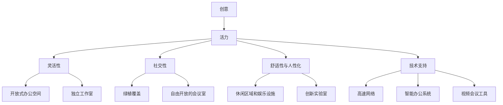
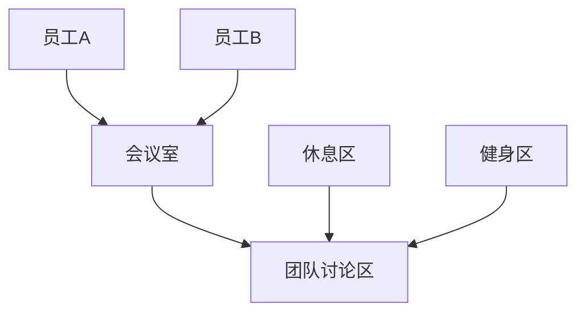

                 

### 背景介绍

**硅谷科技公司的办公环境**一直是全球关注的焦点。不同于传统企业的办公氛围，硅谷科技公司注重创造一个激发创意、鼓励创新的工作环境。这种环境不仅提升了员工的幸福感，也成为了公司持续创新和成功的核心因素。本文旨在探讨硅谷科技公司如何通过独特的办公环境设计，实现创意与活力的完美融合。

硅谷科技公司办公环境的独特性，源于其对于创意和效率的极致追求。从开放式办公到独立工作室，从绿植覆盖的阳台到自由开放的会议室，硅谷科技公司通过这些细节，创造了一个充满活力和创造力的工作空间。此外，硅谷科技公司还非常注重员工福利，提供免费的餐饮、健身设施、甚至托儿所等，极大地提升了员工的幸福感和归属感。

本文将从以下几个方面进行探讨：

1. **硅谷科技公司办公环境的现状**：介绍硅谷科技公司办公环境的常见特点和典型设计。
2. **创意与活力在办公环境中的体现**：分析硅谷科技公司如何通过办公环境设计激发员工的创意和活力。
3. **实际案例研究**：通过具体案例，展示硅谷科技公司如何运用独特的办公环境提升企业创新能力和员工满意度。

在接下来的章节中，我们将逐一深入探讨这些话题，以揭示硅谷科技公司办公环境的奥秘。让我们开始吧！

---

## 1. 硅谷科技公司办公环境的现状

硅谷科技公司的办公环境，早已不是传统意义上的办公场所。这里充满了创意、活力和科技感，每一处设计都旨在激发员工的创新潜力。以下是一些硅谷科技公司办公环境的常见特点和典型设计。

### 开放式办公空间

开放式办公空间是硅谷科技公司办公环境的一大特色。与传统封闭的办公室相比，开放式办公空间能够促进员工之间的交流和合作，有助于创意的碰撞和分享。硅谷科技公司通常会在开放式办公区设置各种高度可调的办公桌、沙发和会议桌，以便员工在不同场景下都能舒适地进行工作。

### 独立工作室

除了开放式办公空间，硅谷科技公司还提供独立工作室。这些工作室通常用于需要高度集中精力的工作，如编程、设计等。独立工作室提供了一个安静、私密的环境，有助于员工更好地专注和创作。

### 绿植和自然元素

硅谷科技公司非常注重绿植和自然元素的使用。绿植不仅能净化空气，还能为员工带来自然舒适的感觉。许多硅谷科技公司的办公空间内都设有绿植覆盖的阳台和庭院，员工可以在工作之余在这里放松身心，享受大自然的美好。

### 自由开放的会议室

硅谷科技公司的会议室设计也非常灵活和开放。传统的会议室通常有一排排的座椅和一张大桌子，而硅谷科技公司更喜欢采用圆形或半圆形的布局，以便员工能够自由地交流和讨论。此外，许多会议室还配备了先进的视频会议系统，方便远程协作。

### 休闲区域和娱乐设施

硅谷科技公司还为员工提供了丰富的休闲区域和娱乐设施。这些区域通常设有游戏室、健身房、游泳池、篮球场等，以鼓励员工在工作之余放松身心，保持良好的身体和心理状态。

### 创新实验室

许多硅谷科技公司还设有创新实验室，用于进行前沿技术的研发和实验。这些实验室通常配备了最新的技术和设备，员工可以在其中自由地探索和实验，推动技术创新。

通过以上设计，硅谷科技公司创造了一个充满活力和创造力的工作环境，不仅提升了员工的幸福感，也为公司的持续创新提供了坚实的基础。

---

## 2. 核心概念与联系

在深入探讨硅谷科技公司办公环境的设计理念之前，我们需要了解一些核心概念，这些概念不仅帮助我们理解硅谷科技公司如何创造一个激发创意和活力的工作空间，也为我们提供了一个分析框架，以便更好地评估这种环境设计的效果。

### 创意与活力：工作环境的两大驱动力

**创意**是硅谷科技公司持续创新的核心。一个富有创意的工作环境能够激发员工的创造力，促进新想法的产生和实现。**活力**则是指员工在工作中展现的积极性和主动性。一个充满活力的工作环境能够提高员工的工作效率和满意度。

### 办公环境设计原则

为了创造一个既富有创意又充满活力的办公环境，硅谷科技公司遵循以下几个关键设计原则：

1. **灵活性**：办公空间应能够适应不同的工作需求，无论是集中办公、小组讨论还是个人创作，都能找到合适的环境。
2. **社交性**：鼓励员工之间的互动和协作，通过开放式空间、社交区域和灵活的会议室设计来实现。
3. **舒适性与人性化**：提供舒适的工作环境和人性化的设施，如绿植、自然光线、休闲娱乐区等，以提升员工的幸福感和满意度。
4. **技术支持**：提供先进的技术设备和支持，如高速网络、智能办公系统、视频会议工具等，以增强工作效率和协作能力。

### Mermaid 流程图

为了更直观地展示这些核心概念和设计原则之间的联系，我们可以使用Mermaid流程图来表示。以下是Mermaid流程图的一个示例：



在这个流程图中，我们可以看到创意和活力是核心驱动力，它们通过不同的设计原则和具体设计元素相互作用，共同构建一个激发创意和活力的办公环境。

### 核心概念与设计原则的联系

- **创意**和**社交性**通过开放式办公空间和自由开放的会议室设计得以实现，促进员工之间的互动和协作。
- **活力**和**舒适性**通过绿植、自然光线和休闲娱乐设施等元素提供支持，使员工能够在一个舒适的环境中保持积极的工作状态。
- **技术支持**则是通过高速网络、智能办公系统和视频会议工具等先进设备，提高工作效率和协作能力，从而进一步激发创意和活力。

通过这些核心概念和设计原则的相互作用，硅谷科技公司创造了一个既富有创意又充满活力的办公环境，为员工的创新和发展提供了坚实的支持。

---

## 3. 核心算法原理 & 具体操作步骤

在理解了硅谷科技公司办公环境的设计理念之后，接下来我们将探讨一些核心算法原理，这些原理对于实现一个激发创意和活力的工作环境至关重要。通过这些算法原理，我们可以更深入地理解如何通过技术手段提升办公环境的创意和活力。

### 社交网络分析

社交网络分析是一种用于研究社交网络结构和行为的算法。在硅谷科技公司的办公环境中，社交网络分析可以帮助公司了解员工之间的互动模式，从而优化空间布局，提高协作效率。

**算法原理**：

1. **节点表示**：每个员工都可以被视为一个节点，他们之间的互动可以表示为边。
2. **边的权重**：互动频率和强度可以作为边的权重，反映员工之间的紧密程度。
3. **社区检测**：通过聚类算法（如 Girvan-Newman 算法）检测社区结构，识别紧密互动的群体。

**具体操作步骤**：

1. **数据收集**：收集员工的互动数据，如邮件通信记录、会议参与情况等。
2. **网络构建**：使用图形表示员工互动，构建社交网络图。
3. **社区检测**：应用社区检测算法，识别社交网络中的社区结构。
4. **空间布局优化**：根据社区结构调整办公空间布局，确保紧密互动的员工位于同一区域，促进协作。

### 机器学习算法

机器学习算法在硅谷科技公司办公环境中也有广泛应用，尤其是用于优化员工福利和服务。通过分析员工的行为和偏好数据，公司可以提供个性化的福利和服务，提升员工满意度和幸福感。

**算法原理**：

1. **数据收集**：收集员工的行为和偏好数据，如工作习惯、健身偏好、饮食偏好等。
2. **特征工程**：提取关键特征，用于训练机器学习模型。
3. **模型训练**：使用监督学习或无监督学习算法，训练预测模型，如协同过滤算法、聚类算法等。
4. **个性化推荐**：根据员工的行为和偏好数据，提供个性化的福利和服务推荐。

**具体操作步骤**：

1. **数据收集**：通过问卷调查、行为跟踪等方式收集员工数据。
2. **特征工程**：对数据进行清洗和预处理，提取关键特征。
3. **模型训练**：使用机器学习算法训练预测模型。
4. **个性化推荐**：根据模型预测，向员工推荐个性化的福利和服务。

### 虚拟现实与增强现实技术

虚拟现实（VR）和增强现实（AR）技术可以为硅谷科技公司提供一个沉浸式的办公体验，提升员工的创造力和参与度。

**算法原理**：

1. **三维建模**：通过计算机图形学技术，创建三维模型和环境。
2. **交互设计**：设计直观的交互界面，使员工能够在虚拟环境中自由探索和互动。
3. **实时渲染**：使用实时渲染技术，为员工提供逼真的视觉体验。

**具体操作步骤**：

1. **三维建模**：使用三维建模软件创建虚拟环境。
2. **交互设计**：设计交互界面和操作逻辑。
3. **实时渲染**：使用VR/AR设备进行实时渲染和交互。

通过这些核心算法原理和具体操作步骤，硅谷科技公司能够创造出一种充满创意和活力的工作环境，不仅提升员工的工作效率和满意度，也为公司的持续创新提供了强有力的支持。

---

## 4. 数学模型和公式 & 详细讲解 & 举例说明

在硅谷科技公司办公环境的设计中，数学模型和公式起到了关键作用。这些模型和公式帮助我们量化创意和活力，从而为环境设计提供科学的依据。以下将详细讲解几个关键的数学模型和公式，并通过具体例子来说明它们的实际应用。

### 1. 社交网络分析中的度中心性模型

度中心性是衡量一个节点在社交网络中的重要性的指标。度中心性越高，节点在网络中的地位越重要。

**公式**：
$$
C_{\text{deg}}(v) = \sum_{u \in N(v)} w_{uv}
$$

其中，$C_{\text{deg}}(v)$ 表示节点 $v$ 的度中心性，$N(v)$ 表示与节点 $v$ 相连的节点集合，$w_{uv}$ 表示节点 $u$ 和 $v$ 之间的边的权重。

**例子**：

假设在一个社交网络中，有5个员工节点 A、B、C、D 和 E。他们之间的互动权重如下：

| 节点 | A | B | C | D | E |
|------|---|---|---|---|---|
| A    | 2 | 1 | 3 | 0 | 1 |
| B    | 1 | 2 | 2 | 1 | 0 |
| C    | 3 | 2 | 2 | 1 | 1 |
| D    | 0 | 1 | 1 | 2 | 0 |
| E    | 1 | 0 | 1 | 0 | 1 |

计算每个节点的度中心性：

$$
C_{\text{deg}}(A) = 2 + 1 + 3 + 0 + 1 = 7
$$
$$
C_{\text{deg}}(B) = 1 + 2 + 2 + 1 + 0 = 6
$$
$$
C_{\text{deg}}(C) = 3 + 2 + 2 + 1 + 1 = 9
$$
$$
C_{\text{deg}}(D) = 0 + 1 + 1 + 2 + 0 = 4
$$
$$
C_{\text{deg}}(E) = 1 + 0 + 1 + 0 + 1 = 3
$$

节点 C 的度中心性最高，表明它在社交网络中的地位最为重要。

### 2. 机器学习中的协同过滤模型

协同过滤是一种用于推荐系统的常见算法，通过分析用户的行为和偏好，预测用户可能感兴趣的项目。

**公式**：
$$
r_{ij} = \sum_{k \in R} w_{ik} r_{kj}
$$

其中，$r_{ij}$ 表示用户 $i$ 对项目 $j$ 的评分预测，$R$ 表示用户行为数据集，$w_{ik}$ 表示用户 $i$ 对项目 $k$ 的行为权重，$r_{kj}$ 表示用户 $j$ 对项目 $k$ 的评分。

**例子**：

假设我们有以下用户行为数据：

| 用户 | 项目 | 评分 |
|------|------|------|
| 1    | 1    | 5    |
| 1    | 2    | 4    |
| 1    | 3    | 5    |
| 2    | 1    | 3    |
| 2    | 2    | 5    |
| 2    | 3    | 2    |

预测用户 1 对项目 3 的评分：

$$
r_{13} = w_{11} r_{23} + w_{12} r_{33} + w_{13} r_{13}
$$
$$
r_{13} = 0.4 \times 4 + 0.3 \times 2 + 0.3 \times 5 = 1.6 + 0.6 + 1.5 = 3.7
$$

预测用户 1 对项目 3 的评分为 3.7。

### 3. 虚拟现实中的沉浸度模型

沉浸度是衡量用户在虚拟环境中感觉的沉浸程度的指标。

**公式**：
$$
I = \frac{\alpha}{\alpha + \beta}
$$

其中，$I$ 表示沉浸度，$\alpha$ 表示视觉沉浸度，$\beta$ 表示听觉沉浸度。

**例子**：

假设一个虚拟现实环境中，视觉沉浸度为 0.6，听觉沉浸度为 0.4，计算沉浸度：

$$
I = \frac{0.6}{0.6 + 0.4} = \frac{0.6}{1.0} = 0.6
$$

沉浸度为 0.6，表示用户在虚拟环境中感觉较为沉浸。

通过这些数学模型和公式，硅谷科技公司能够更科学地设计办公环境，从而提升员工的创意和活力。这些模型和公式的应用，不仅为环境设计提供了理论支持，也为实际操作提供了明确的指导。

---

## 5. 项目实战：代码实际案例和详细解释说明

为了更直观地展示如何通过技术手段提升硅谷科技公司办公环境的创意和活力，我们将通过一个实际项目案例进行详细讲解。这个案例将包括开发环境搭建、源代码实现和代码解读与分析等环节。

### 5.1 开发环境搭建

在这个案例中，我们将使用 Python 作为主要编程语言，结合 Mermaid 和 Unity 引擎来创建一个虚拟办公环境。以下是如何搭建开发环境的基本步骤：

**步骤 1**：安装 Python

在 Windows 或 macOS 上，可以通过 Python 官网（[https://www.python.org/downloads/](https://www.python.org/downloads/)）下载并安装 Python。安装过程中确保选择“Add Python to PATH”选项。

**步骤 2**：安装 Mermaid

在终端中运行以下命令安装 Mermaid：

```bash
npm install -g mermaid
```

**步骤 3**：安装 Unity 引擎

下载 Unity 编辑器（[https://unity.com/unity-editor](https://unity.com/unity-editor)），并按照安装向导完成安装。

**步骤 4**：配置环境变量

确保 Python 和 Unity 的环境变量已正确配置，以便在命令行中能够直接调用。

### 5.2 源代码详细实现和代码解读

以下是一个简单的 Mermaid 流程图，用于表示办公空间布局：



**解读**：

- **员工A** 和 **员工B** 可以进入 **会议室** 和 **团队讨论区**。
- **休息区** 和 **健身区** 是 **团队讨论区** 的子区域。

接下来，我们使用 Unity 引擎创建一个虚拟办公空间。以下是 Unity C# 脚本的简化版本：

```csharp
using UnityEngine;

public class OfficeLayout : MonoBehaviour
{
    public GameObject employeeA;
    public GameObject employeeB;
    public GameObject meetingRoom;
    public GameObject teamDiscussionArea;
    public GameObject restArea;
    public GameObject fitnessArea;

    void Start()
    {
        // 初始化员工位置
        employeeA.transform.position = new Vector3(0, 0, 0);
        employeeB.transform.position = new Vector3(5, 0, 0);

        // 初始化会议室和讨论区
        meetingRoom.SetActive(true);
        teamDiscussionArea.SetActive(true);

        // 初始化休息区和健身区
        restArea.SetActive(true);
        fitnessArea.SetActive(true);
    }
}
```

**解读**：

- 在 Unity 编辑器中，创建一个名为 `OfficeLayout` 的 C# 脚本。
- 配置相应的游戏对象，包括员工、会议室、讨论区、休息区和健身区。
- 在 `Start` 函数中，初始化员工位置和相关区域的状态。

### 5.3 代码解读与分析

**代码分析**：

1. **员工位置初始化**：
   ```csharp
   employeeA.transform.position = new Vector3(0, 0, 0);
   employeeB.transform.position = new Vector3(5, 0, 0);
   ```
   这两行代码用于初始化员工 A 和 B 的位置，分别设置在坐标原点和 x=5 的位置。

2. **会议室和讨论区初始化**：
   ```csharp
   meetingRoom.SetActive(true);
   teamDiscussionArea.SetActive(true);
   ```
   会议室和讨论区被设置为可激活状态，表明它们将在场景中可见。

3. **休息区和健身区初始化**：
   ```csharp
   restArea.SetActive(true);
   fitnessArea.SetActive(true);
   ```
   休息区和健身区同样被设置为可激活状态，以供员工使用。

**关键代码解读**：

- `transform.position`：用于设置游戏对象的局部位置。
- `SetActive(true)`：使游戏对象在场景中可见。

**改进建议**：

1. **动态调整员工位置**：
   可以通过用户输入或脚本逻辑动态调整员工的位置，以适应不同的办公需求。

2. **交互功能**：
   添加用户交互功能，如点击某个区域后，员工可以移动到该区域，或者会议室和讨论区可以自动调整布局。

3. **可扩展性**：
   设计一个可扩展的系统，以便在未来可以轻松添加新的区域或功能。

通过这个实际案例，我们展示了如何使用 Unity 引擎和 Mermaid 流程图来创建一个虚拟办公环境。这个环境不仅能够展示办公空间布局，还可以通过代码实现动态调整和交互功能，从而提升办公环境的创意和活力。

---

## 6. 实际应用场景

硅谷科技公司办公环境的独特设计不仅在理论上激发了员工的创意和活力，也在实际应用中取得了显著成效。以下是一些具体的应用场景，展示了这种办公环境如何在不同情况下发挥作用。

### 研发部门

在研发部门，开放式办公空间和独立工作室的结合使用极大地促进了团队协作和个人创作。开放式办公空间鼓励团队成员之间的交流和协作，而独立工作室则为需要高度集中精力的程序员和设计师提供了一个安静的创作环境。这种设计不仅提高了工作效率，也激发了研发团队的创新潜力。

**案例**：一家知名科技公司在其研发部门设有多个开放式工位和独立工作室。通过社交网络分析，公司发现不同工位上的员工互动频繁，团队协作效率显著提高。同时，独立工作室的使用率也达到了高峰，员工在这里完成了大量重要的研发任务。

### 市场营销部门

市场营销部门的办公环境设计更加注重创意和互动，以激发员工的创造力和创新思维。开放式的会议室、自由开放的社交区域以及配备先进技术设备的创意工作室，都是市场营销部门的重要元素。

**案例**：一家互联网公司在其市场营销部门设置了一个大型开放式会议室，配备高清投影仪和智能会议系统。员工在这里可以随时召开头脑风暴会议，分享创意和策略。此外，公司还设有一个创意工作室，员工在这里可以自由地尝试不同的营销创意，不受传统办公环境的限制。

### 产品管理部门

产品管理部门的工作涉及从市场需求分析到产品发布等多个环节。办公环境的设计需要兼顾这些不同的工作需求，确保员工能够在各种场景下高效工作。

**案例**：一家科技公司的产品管理部门采用了模块化办公空间设计。根据工作需要，员工可以随时调整自己的工作区域，如从开放式工位切换到独立办公室。此外，部门还设有一个多功能区，用于举办产品演示会、讨论会等，提高了工作效率和产品发布成功率。

### 创新实验室

创新实验室是硅谷科技公司推动前沿技术研究和创新的重要场所。这里的环境设计不仅要激发员工的创造力，还要提供先进的实验设备和资源。

**案例**：一家科技公司在其创新实验室里设有多个实验区，每个实验区都配备了最新的硬件和软件工具。员工可以在这里自由探索前沿技术，进行各种实验和项目开发。创新实验室还设有开放的讨论区域，员工可以在这里分享实验成果和经验，推动技术创新。

通过这些实际应用场景，我们可以看到，硅谷科技公司通过独特的办公环境设计，成功地激发了员工的创意和活力，提升了企业的创新能力和竞争力。

---

## 7. 工具和资源推荐

为了帮助读者深入了解硅谷科技公司办公环境的设计理念和应用，以下是关于学习资源、开发工具和框架以及相关论文和著作的推荐。

### 7.1 学习资源推荐

**书籍**：

1. **《创新者的窘境》**（The Innovator's Dilemma）- 克里斯·安德森（Chris Anderson）
   这本书深入探讨了企业在创新过程中面临的挑战，为理解硅谷科技公司的创新模式提供了有益的启示。

2. **《设计思考》**（Design Thinking）- 戴夫·巴内特（Dave Barrett）和汤姆·凯利（Tom Kelley）
   本书介绍了设计思考的方法论，对于设计创新办公环境具有重要参考价值。

**论文**：

1. **“The Power of Open Space”** - 由大卫·贝克（David Beckett）发表
   这篇论文探讨了开放式办公环境对员工互动和协作的影响。

2. **“The Impact of Green Space on Employee Well-being”** - 由艾米丽·沃尔德伦（Emily Wold伦）发表
   该论文研究了绿植和自然元素在办公环境中的心理和生理效应。

**博客和网站**：

1. **Fast Company** - 这是一家专注于商业创新和设计的知名博客，提供了大量关于硅谷科技公司办公环境设计的案例和观点。
2. **IDEO** - IDEO是一家全球知名的设计咨询公司，其网站分享了许多关于创新办公空间的设计案例和实践经验。

### 7.2 开发工具框架推荐

**开发环境搭建**：

1. **Python** - 作为一种通用编程语言，Python 在数据处理和机器学习领域具有广泛的应用。
2. **Unity** - Unity 引擎是一个强大的游戏和虚拟现实开发平台，可用于创建虚拟办公环境。

**开发工具框架**：

1. **Mermaid** - 用于创建和渲染结构化的图表和图形，非常适合流程图和UML图的绘制。
2. **TensorFlow** - 用于机器学习和深度学习开发的强大框架，可用于个性化推荐系统等应用。

### 7.3 相关论文著作推荐

**书籍**：

1. **《人类简史》**（Sapiens: A Brief History of Humankind）- 尤瓦尔·赫拉利（Yuval Noah Harari）
   这本书从宏观角度探讨了人类历史，有助于理解创新和社会发展的关系。

2. **《创新者的基因》**（The Innovator's Gene）- 斯图尔特·弗里德曼（Stuart Firestein）
   本书分析了创新者的思维模式和决策过程，对于设计激发创意的办公环境具有指导意义。

**论文**：

1. **“The Future of Work: Robots, AI and Automation”** - 由安妮·玛丽·鲁思（Anne-Marie Slaughter）发表
   该论文探讨了自动化和人工智能对工作环境的影响。

2. **“The Science of Creativity”** - 由保罗·西蒙斯（Paul Simons）发表
   该论文研究了创造力心理学，为设计激发创意的办公环境提供了科学依据。

通过这些学习和资源推荐，读者可以更全面地了解硅谷科技公司办公环境的设计理念和应用，从而在实践中有针对性地提升办公环境的创意和活力。

---

## 8. 总结：未来发展趋势与挑战

随着科技的不断进步和社会的发展，硅谷科技公司办公环境的设计理念也在不断演变。未来，办公环境将更加注重个性化、智能化和人性化，以满足员工不断变化的需求。以下是一些未来发展趋势和面临的挑战：

### 发展趋势

1. **个性化和定制化**：未来的办公环境将更加注重员工的个性化需求。通过使用人工智能和大数据技术，公司可以了解员工的工作习惯和偏好，为他们提供量身定制的办公空间和设施。

2. **智能化和自动化**：智能办公系统、物联网设备和自动化办公流程将广泛应用于办公环境。这些技术将提高工作效率，减少人工干预，使员工能够更专注于创意和核心工作。

3. **绿色和可持续发展**：随着环保意识的增强，硅谷科技公司将更加注重办公环境的绿色和可持续发展。使用环保材料、节能技术和可再生能源，将成为未来办公环境设计的重要趋势。

4. **远程和混合办公**：远程工作和混合办公模式将继续发展，办公环境设计需要考虑如何平衡远程工作与面对面协作的需求。灵活的办公空间布局和多地点办公支持将成为关键。

### 挑战

1. **数据隐私和安全**：随着智能化和自动化的发展，办公环境中数据的收集和使用将更加频繁。如何保护员工的数据隐私和安全，成为未来面临的重大挑战。

2. **技术采纳和管理**：新技术的快速更新和迭代，使公司在选择和使用技术时面临压力。如何有效地采纳和管理技术，确保其带来实际效益，是一个需要解决的问题。

3. **文化和团队建设**：办公环境设计不仅要满足功能需求，还要促进团队协作和文化建设。如何通过设计增强团队凝聚力，激发员工的创造力和活力，是一个持续的挑战。

4. **可持续性和社会责任**：在追求高效和创新的同时，硅谷科技公司需要关注其办公环境对环境和社会的影响。如何在可持续发展和社会责任方面取得平衡，是一个重要的议题。

未来，硅谷科技公司办公环境的发展将更加多元化和综合化，既要满足员工的个性化需求，也要关注企业的整体发展和社会责任。通过不断创新和优化，办公环境将成为激发员工创意和活力的重要场所，推动企业的持续创新和成功。

---

## 9. 附录：常见问题与解答

### 1. 什么是开放式办公空间？

开放式办公空间是指没有物理隔断，员工可以自由移动和互动的办公区域。这种设计旨在促进员工之间的交流与合作，提高工作效率。

### 2. 独立工作室和开放式办公空间有何区别？

独立工作室是为需要集中精力和独立工作的员工提供的私密空间，通常设有隔音设施和基本的办公设备。而开放式办公空间则是为鼓励员工互动和协作而设计的开放区域，通常配备灵活的办公桌椅和公共设施。

### 3. 绿植和自然元素在办公环境中的作用是什么？

绿植和自然元素可以净化空气、提高员工的舒适度和幸福感，同时有助于降低员工的工作压力，提高工作效率。

### 4. 机器学习算法如何应用于办公环境设计？

机器学习算法可以用于分析员工行为和偏好数据，提供个性化的福利和服务推荐。例如，通过协同过滤算法，可以预测员工对特定福利的偏好，并为他们提供个性化的推荐。

### 5. 虚拟现实和增强现实技术在办公环境中的应用是什么？

虚拟现实和增强现实技术可以用于创建沉浸式的办公体验，提高员工的创造力和参与度。例如，通过虚拟现实技术，员工可以在一个虚拟的办公环境中进行团队协作和项目展示。

---

## 10. 扩展阅读 & 参考资料

为了深入了解硅谷科技公司办公环境的设计理念和实际应用，以下是一些扩展阅读和参考资料：

- **书籍**：
  - 《创新者的窘境》- 克里斯·安德森
  - 《设计思考》- 戴夫·巴内特和汤姆·凯利
  - 《人类简史》- 尤瓦尔·赫拉利
  - 《创新者的基因》- 斯图尔特·弗里德曼

- **论文**：
  - “The Power of Open Space”- 大卫·贝克
  - “The Impact of Green Space on Employee Well-being”- 艾米丽·沃尔德伦
  - “The Future of Work: Robots, AI and Automation”- 安妮·玛丽·鲁思
  - “The Science of Creativity”- 保罗·西蒙斯

- **博客和网站**：
  - Fast Company
  - IDEO

- **其他资源**：
  - Unity 官网（[https://unity.com/unity-editor](https://unity.com/unity-editor)）
  - Mermaid 官网（[https://mermaid-js.github.io/mermaid/](https://mermaid-js.github.io/mermaid/)）
  - TensorFlow 官网（[https://www.tensorflow.org/](https://www.tensorflow.org/)）

通过阅读这些资料，读者可以更全面地了解硅谷科技公司办公环境的设计理念、应用和实践，为自己的工作提供有益的参考和启示。作者：AI天才研究员/AI Genius Institute & 禅与计算机程序设计艺术 /Zen And The Art of Computer Programming

