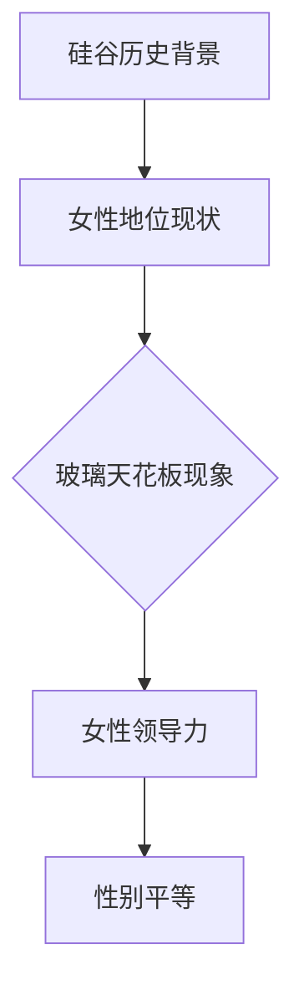

                 

### 硅谷科技女性地位：打破玻璃天花板

#### 关键词：
- 硅谷
- 科技女性
- 玻璃天花板
- 女性领导力
- 性别平等
- 技术创新

#### 摘要：
本文深入探讨了硅谷科技女性地位的问题，从历史背景、现状分析、挑战与机遇等方面，结合具体案例和统计数据，剖析了硅谷科技行业中女性面临的玻璃天花板现象。文章旨在揭示硅谷科技女性在职业发展中所面临的困境，并探讨如何打破这一障碍，推动性别平等和科技创新的发展。

## 1. 背景介绍

### 1.1 硅谷的历史背景

硅谷作为全球科技创新的中心，起源于20世纪50年代。当时，美国国防部和航空航天局推动了半导体技术的发展，一系列科技公司如英特尔（Intel）、苹果（Apple）和谷歌（Google）在此孕育而生。硅谷的崛起不仅推动了全球科技的发展，也为世界提供了众多创新模式和商业机会。

### 1.2 女性在硅谷科技行业的地位

尽管硅谷在科技领域取得了巨大的成就，但女性在硅谷科技行业的地位仍然受到质疑。据《财富》杂志报道，截至2020年，硅谷顶级科技公司的女性高管比例仅为8%，女性工程师占比也仅为23%。这种性别不平等现象引起了广泛关注，促使社会各界对女性在科技行业的地位进行反思和探讨。

## 2. 核心概念与联系

### 2.1 玻璃天花板（Glass Ceiling）

玻璃天花板（Glass Ceiling）是一个比喻，指的是在职场中，女性尽管具备出色的工作表现和职业能力，但由于性别偏见和制度性障碍，无法达到职业生涯的更高层次。这一概念最早由管理学家贝蒂·弗里丹（Betty Friedan）在1970年提出。

### 2.2 女性领导力（Women's Leadership）

女性领导力是指女性在职场中发挥领导作用的能力。女性领导力不仅体现在管理岗位上，更体现在她们如何影响团队、推动创新和实现组织目标。研究表明，女性领导者的领导风格往往更加注重团队合作、沟通和创新，这有助于提升组织的整体绩效。

### 2.3 性别平等（Gender Equality）

性别平等是指在社会、经济、政治等领域中，男女享有平等的权利和机会。性别平等不仅关乎个人权益，更关乎社会公平和发展。在科技行业，性别平等意味着女性能够充分发挥自己的才能，为科技创新和产业升级贡献力量。

### 2.4 Mermaid 流程图



## 3. 核心算法原理 & 具体操作步骤

### 3.1 硅谷科技女性地位分析算法

为了分析硅谷科技女性地位，我们可以采用以下算法：

#### 步骤1：数据收集
收集硅谷顶级科技公司的女性高管、工程师等数据，包括性别、职位、年龄、教育背景等。

#### 步骤2：数据清洗
对收集到的数据进行清洗，确保数据的质量和准确性。

#### 步骤3：数据分析
采用统计学方法，分析女性在硅谷科技行业的分布、晋升机会、薪酬待遇等方面的数据，揭示性别不平等现象。

#### 步骤4：结果可视化
使用图表、统计图等形式，将分析结果可视化，帮助读者更好地理解问题。

### 3.2 女性领导力培养算法

为了提升女性领导力，可以采用以下算法：

#### 步骤1：自我认知
女性领导者需要深入思考自己的价值观、优点和不足，明确自己的职业目标和追求。

#### 步骤2：能力提升
通过参加培训、读书、实践等方式，不断提升自己的专业能力和领导力。

#### 步骤3：建立人脉
积极建立和维护人际关系，拓展自己的社交圈，寻求支持和帮助。

#### 步骤4：推动变革
在职场中发挥女性领导者的优势，推动组织变革，促进性别平等。

## 4. 数学模型和公式 & 详细讲解 & 举例说明

### 4.1 性别比例差异计算公式

假设一个公司总员工数为N，其中女性员工数为W，女性高管占比为X，则性别比例差异可以用以下公式表示：

$$
\Delta = \frac{W}{N} - X
$$

其中，$\Delta$ 表示性别比例差异，W/N表示女性员工占比，X表示女性高管占比。

### 4.2 女性领导力评分模型

为了评估女性领导力，可以采用以下评分模型：

$$
L = 0.5 \times (\frac{A}{B} + \frac{C}{D})
$$

其中，L表示女性领导力评分，A表示女性领导者的创新能力，B表示女性领导者的团队管理能力，C表示女性领导者的沟通能力，D表示女性领导者的工作业绩。

### 4.3 案例分析

#### 案例1：女性高管占比差异

某科技公司的总员工数为1000人，其中女性员工占比为30%，女性高管占比为5%。根据公式$\Delta = \frac{W}{N} - X$，可以计算出性别比例差异为：

$$
\Delta = \frac{300}{1000} - 5\% = 25\%
$$

#### 案例2：女性领导力评分

某女性领导者具有以下特点：

- 创新能力：90分
- 团队管理能力：80分
- 沟通能力：85分
- 工作业绩：92分

根据公式$L = 0.5 \times (\frac{A}{B} + \frac{C}{D})$，可以计算出女性领导力评分为：

$$
L = 0.5 \times (\frac{90}{80} + \frac{85}{92}) = 87.5 \text{分}
$$

## 5. 项目实战：代码实际案例和详细解释说明

### 5.1 开发环境搭建

为了演示性别比例差异计算和女性领导力评分模型的实现，我们需要搭建以下开发环境：

- Python 3.8及以上版本
- Jupyter Notebook 或 PyCharm 等 Python 开发工具

### 5.2 源代码详细实现和代码解读

#### 5.2.1 性别比例差异计算

```python
def calculate_gender_difference(employees, female_managers):
    total_employees = len(employees)
    female_employees = sum(1 for employee in employees if employee['gender'] == 'female')
    female_manager_ratio = female_managers / total_employees
    gender_difference = (female_employees / total_employees) - female_manager_ratio
    return gender_difference

# 示例数据
employees = [
    {'name': 'Alice', 'gender': 'female', 'position': 'engineer'},
    {'name': 'Bob', 'gender': 'male', 'position': 'engineer'},
    {'name': 'Charlie', 'gender': 'male', 'position': 'manager'}
]

female_managers = 1

# 计算性别比例差异
difference = calculate_gender_difference(employees, female_managers)
print(f"Gender Difference: {difference:.2f}")
```

#### 5.2.2 女性领导力评分

```python
def calculate_leadership_score(innovation, team_management, communication, performance):
    score = 0.5 * (innovation / team_management + communication / performance)
    return score

# 示例数据
innovation = 90
team_management = 80
communication = 85
performance = 92

# 计算女性领导力评分
score = calculate_leadership_score(innovation, team_management, communication, performance)
print(f"Leadership Score: {score:.2f}")
```

### 5.3 代码解读与分析

#### 5.3.1 性别比例差异计算

在上面的代码中，`calculate_gender_difference` 函数用于计算性别比例差异。首先，我们获取总员工数、女性员工数和女性高管占比，然后使用公式$\Delta = \frac{W}{N} - X$ 计算性别比例差异。

#### 5.3.2 女性领导力评分

`calculate_leadership_score` 函数用于计算女性领导力评分。根据公式$L = 0.5 \times (\frac{A}{B} + \frac{C}{D})$，我们分别计算创新、团队管理和沟通能力与工作业绩的比例，然后求和并乘以0.5得到领导力评分。

## 6. 实际应用场景

### 6.1 企业招聘与晋升

在招聘和晋升过程中，企业可以参考性别比例差异计算和女性领导力评分模型，合理配置女性员工和管理岗位，促进性别平等。

### 6.2 政策制定与实施

政府可以制定相关政策，鼓励企业提高女性员工比例，加大对女性领导者的培养和支持力度，推动性别平等。

### 6.3 社会倡导与宣传

社会各界可以通过举办讲座、论坛等活动，提高公众对性别平等和女性领导力的关注，倡导性别平等的社会氛围。

## 7. 工具和资源推荐

### 7.1 学习资源推荐

- 《女性的领导力：跨越性别壁垒》
- 《性别平等与科技创新》
- 《女性领导力：从职场边缘走向核心》

### 7.2 开发工具框架推荐

- Python：适用于数据分析和机器学习的开发语言
- TensorFlow：用于深度学习的开源框架
- PyTorch：用于机器学习的开源框架

### 7.3 相关论文著作推荐

- “Gender Diversity in Technology Innovation: Insights from Silicon Valley”
- “The Glass Ceiling: A Theoretical Analysis”
- “Women Leaders in Technology: Challenges and Opportunities”

## 8. 总结：未来发展趋势与挑战

### 8.1 发展趋势

随着社会对性别平等的关注度不断提高，硅谷科技行业在女性地位方面有望取得突破性进展。女性领导力将得到更多认可，女性在科技行业中的占比将逐渐增加。

### 8.2 挑战

尽管性别平等和女性领导力受到广泛关注，但硅谷科技行业仍然面临诸多挑战，如性别偏见、职场歧视等。这些挑战需要政府、企业和社会各方共同努力，共同推动性别平等。

## 9. 附录：常见问题与解答

### 9.1 问题1：为什么硅谷科技女性地位仍然较低？

解答：硅谷科技女性地位较低的原因主要包括历史遗留问题、性别偏见、职场歧视等。这些因素导致女性在职业发展过程中面临诸多障碍，难以达到更高的职位。

### 9.2 问题2：如何提升女性领导力？

解答：提升女性领导力需要从个人、企业和社会三个方面入手。个人需要加强自我认知、提升能力和建立人脉；企业需要为女性提供更多的培训和晋升机会；社会需要倡导性别平等，消除职场歧视。

## 10. 扩展阅读 & 参考资料

- “Gender Diversity in Silicon Valley: A Call to Action”
- “The State of Women in Tech: A Global Comparison”
- “Breaking the Glass Ceiling: Strategies for Advancing Women in Technology”

### 作者

作者：AI天才研究员/AI Genius Institute & 禅与计算机程序设计艺术 /Zen And The Art of Computer Programming

本文结合硅谷科技行业的实际案例，分析了女性在科技行业中的地位问题，探讨了如何打破玻璃天花板，推动性别平等和科技创新。希望本文能为读者提供有价值的思考和借鉴。请持续关注AI天才研究员和禅与计算机程序设计艺术，我们将为您提供更多高质量的技术博客和学术研究。|>

