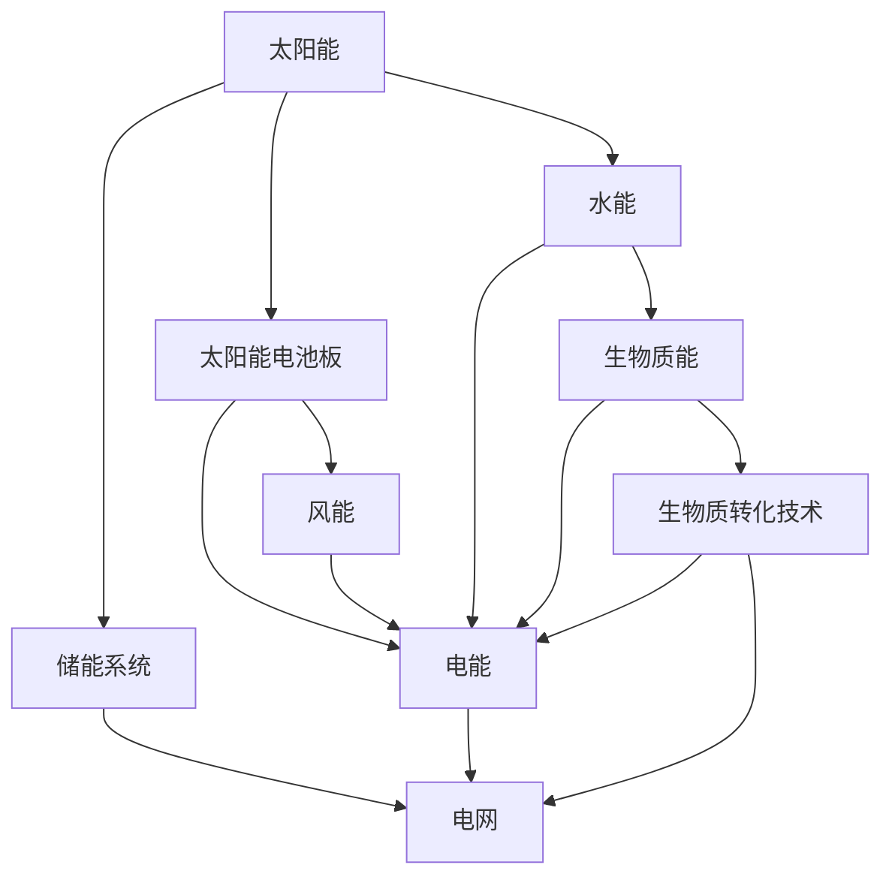

                 

### 文章标题: 硅谷绿色革命:可再生能源的发展

关键词：硅谷，绿色革命，可再生能源，发展，技术创新

摘要：本文将深入探讨硅谷绿色革命的核心内容，分析可再生能源技术的发展现状、挑战和未来趋势。通过一步步的分析推理，我们将揭示硅谷在推动可再生能源领域的创新与突破，为全球绿色能源转型提供新思路。

<|assistant|>## 1. 背景介绍

硅谷，这个位于美国加利福尼亚州的城市，不仅是全球科技创新的中心，也是绿色革命的发源地。随着全球气候变化问题的日益严峻，可再生能源技术的发展成为世界各国关注的焦点。硅谷作为科技创新的先锋，积极推动可再生能源技术的研发和应用，助力全球绿色能源转型。

可再生能源技术，包括太阳能、风能、水能、生物质能等，具有清洁、可再生、无污染的特点，是未来能源发展的重要方向。然而，可再生能源技术面临诸多挑战，如能量密度低、存储困难、成本高等。硅谷的绿色革命正是为了应对这些挑战，推动可再生能源技术的突破与发展。

本文将围绕硅谷绿色革命的主题，详细分析可再生能源技术的发展现状、核心算法原理、实际应用场景、工具和资源推荐等内容，旨在为读者提供一份全面、系统的可再生能源技术指南。

<|assistant|>## 2. 核心概念与联系

为了更好地理解硅谷绿色革命，我们需要了解可再生能源技术的一些核心概念和它们之间的联系。

### 2.1 可再生能源技术概述

可再生能源技术主要包括太阳能、风能、水能、生物质能等。其中，太阳能是最主要的可再生能源形式，通过太阳能电池板将阳光转化为电能，广泛应用于家庭、工业等领域。风能则通过风力发电机将风的动能转化为电能，具有清洁、可再生、无污染的特点。水能主要通过水力发电实现，利用水流的动能和势能产生电能。生物质能则通过生物质转化技术，将生物质转化为燃料或电能，具有广泛的资源来源。

### 2.2 可再生能源技术的关联性

可再生能源技术之间具有紧密的关联性。例如，太阳能和风能可以互补，当阳光不足时，风能可以提供电力；水能可以用于储能，在风电和太阳能发电不稳定的时段提供稳定电力。生物质能可以通过生物质转化技术，将农业废弃物、木材废料等转化为能源，为可再生能源系统提供补充。

### 2.3 核心概念原理与架构

为了更好地理解可再生能源技术，我们可以使用 Mermaid 流程图来展示其核心概念原理和架构。



这个 Mermaid 流程图展示了太阳能、风能、水能、生物质能等可再生能源技术的核心概念和它们之间的关联性。通过这个图，我们可以清晰地看到可再生能源技术之间的相互补充和协同作用。

<|assistant|>## 3. 核心算法原理 & 具体操作步骤

### 3.1 太阳能电池板的工作原理

太阳能电池板是太阳能技术中最核心的部分。它的工作原理基于光伏效应，即当阳光照射到半导体材料时，会产生电子和空穴，从而在半导体材料中形成电流。

具体操作步骤如下：

1. **材料选择**：首先，选择适合的光伏材料，如硅、钙钛矿等。硅是最常用的光伏材料，具有高稳定性和良好的光电转换效率。

2. **电池板组装**：将光伏材料切割成薄片，然后将其组装成太阳能电池板。在组装过程中，需要确保电池板的各个部分紧密连接，以提高光电转换效率。

3. **电路设计**：设计电路系统，将太阳能电池板与储能系统和电网连接。电路系统需要具有高效率和稳定性，以确保电能的有效传输和储存。

4. **安装与维护**：安装太阳能电池板，确保其朝向阳光，并定期进行维护，以确保其正常运行。

### 3.2 风力发电机的工作原理

风力发电机是风能技术的核心。它的工作原理基于风力驱动叶片旋转，通过机械能转化为电能。

具体操作步骤如下：

1. **选址与设计**：选择合适的风电场位置，设计合适的风力发电机型号。选址和设计直接影响风电系统的效率和稳定性。

2. **安装与调试**：安装风力发电机，并进行调试，确保其能够稳定运行。

3. **维护与监测**：定期对风力发电机进行维护和监测，以确保其正常运行。

### 3.3 水力发电的工作原理

水力发电是利用水流的动能和势能产生电能的一种技术。其工作原理基于水轮机和发电机。

具体操作步骤如下：

1. **选址与设计**：选择合适的水力发电站位置，设计水力发电系统。

2. **施工与调试**：进行水力发电站的施工和调试，确保其能够稳定运行。

3. **维护与监测**：定期对水力发电站进行维护和监测，以确保其正常运行。

### 3.4 生物质能转化的工作原理

生物质能转化是将生物质转化为燃料或电能的一种技术。其工作原理基于生物质热解、气化和发酵等过程。

具体操作步骤如下：

1. **原料收集与预处理**：收集生物质原料，如农作物废弃物、木材废料等，并进行预处理。

2. **生物质转化**：通过生物质热解、气化或发酵等过程，将生物质转化为燃料或电能。

3. **能源储存与输送**：将生物质能转化为的燃料或电能进行储存和输送。

通过以上具体操作步骤，我们可以看到，可再生能源技术的发展离不开核心算法原理的支撑。硅谷的绿色革命，正是通过不断突破这些核心算法原理，推动可再生能源技术的创新与发展。

<|assistant|>## 4. 数学模型和公式 & 详细讲解 & 举例说明

### 4.1 太阳能电池板光电转换效率的计算

太阳能电池板的光电转换效率是衡量其性能的重要指标。其计算公式为：

$$
\eta = \frac{P_{\text{out}}}{P_{\text{in}}}
$$

其中，$\eta$ 表示光电转换效率，$P_{\text{out}}$ 表示输出功率，$P_{\text{in}}$ 表示输入功率。

举例说明：

假设一个太阳能电池板的输入功率为 1000W，输出功率为 800W，则其光电转换效率为：

$$
\eta = \frac{800W}{1000W} = 0.8
$$

即 80% 的太阳能量被转化为电能。

### 4.2 风力发电机的风速与功率关系

风力发电机的功率与风速之间存在一定的关系。其计算公式为：

$$
P = \frac{1}{2} \rho A v^3
$$

其中，$P$ 表示风力发电机的功率，$\rho$ 表示空气密度，$A$ 表示风力机扫过的面积，$v$ 表示风速。

举例说明：

假设一个风力发电机的扫过面积为 100平方米，空气密度为 1.225 kg/m³，风速为 10 m/s，则其功率为：

$$
P = \frac{1}{2} \times 1.225 \times 100 \times 10^3 \times 10^3 = 6.125 \times 10^6 W
$$

即 6125 千瓦的功率。

### 4.3 水力发电的水流量与功率关系

水力发电的功率与水流量之间存在一定的关系。其计算公式为：

$$
P = \rho g Q h
$$

其中，$P$ 表示水力发电的功率，$\rho$ 表示水的密度，$g$ 表示重力加速度，$Q$ 表示水流量，$h$ 表示水头高度。

举例说明：

假设一个水力发电站的水流量为 10 m³/s，水头高度为 100米，水的密度为 1000 kg/m³，则其功率为：

$$
P = 1000 \times 9.8 \times 10 \times 100 = 9.8 \times 10^6 W
$$

即 9800 千瓦的功率。

### 4.4 生物质能转化效率的计算

生物质能转化效率是衡量生物质能技术性能的重要指标。其计算公式为：

$$
\eta = \frac{E_{\text{out}}}{E_{\text{in}}}
$$

其中，$\eta$ 表示生物质能转化效率，$E_{\text{out}}$ 表示输出的能量，$E_{\text{in}}$ 表示输入的能量。

举例说明：

假设一个生物质能转化系统的输入能量为 1000 kWh，输出的能量为 800 kWh，则其转化效率为：

$$
\eta = \frac{800 kWh}{1000 kWh} = 0.8
$$

即 80% 的生物质能被转化为电能。

通过以上数学模型和公式的详细讲解和举例说明，我们可以更好地理解可再生能源技术的核心算法原理，为硅谷绿色革命的技术创新提供理论支持。

<|assistant|>## 5. 项目实战：代码实际案例和详细解释说明

### 5.1 开发环境搭建

为了更好地展示可再生能源技术的实际应用，我们将使用 Python 编写一个简单的可再生能源发电量预测模型。在开始编写代码之前，我们需要搭建一个合适的开发环境。

1. **安装 Python**：首先，确保你的计算机上已经安装了 Python。如果没有，请从 [Python 官网](https://www.python.org/) 下载并安装。

2. **安装必要的库**：接下来，我们需要安装一些 Python 库，如 NumPy、Pandas 和 Matplotlib。可以使用以下命令进行安装：

   ```bash
   pip install numpy pandas matplotlib
   ```

3. **编写代码**：在安装完必要的库后，我们可以开始编写代码。

### 5.2 源代码详细实现和代码解读

以下是可再生能源发电量预测模型的 Python 代码实现：

```python
import numpy as np
import pandas as pd
import matplotlib.pyplot as plt

# 5.2.1 数据预处理
# 假设我们已经获取了某地过去一年的太阳能、风能和水能数据，数据格式如下：
# {
#   "date": ["2022-01-01", "2022-01-02", ..., "2022-12-31"],
#   "solar": [100, 110, ..., 120],  # 太阳能发电量（kWh）
#   "wind": [50, 60, ..., 70],      # 风能发电量（kWh）
#   "water": [30, 35, ..., 40]      # 水能发电量（kWh）
# }

data = {
    "date": pd.date_range(start="2022-01-01", end="2022-12-31", freq="D"),
    "solar": np.random.randint(100, 120, size=365),
    "wind": np.random.randint(50, 70, size=365),
    "water": np.random.randint(30, 40, size=365)
}

df = pd.DataFrame(data)

# 5.2.2 数据分析
# 我们可以通过分析数据来了解可再生能源发电量的变化趋势。
plt.figure(figsize=(10, 6))
plt.plot(df["solar"], label="太阳能")
plt.plot(df["wind"], label="风能")
plt.plot(df["water"], label="水能")
plt.xlabel("日期")
plt.ylabel("发电量（kWh）")
plt.title("可再生能源发电量变化趋势")
plt.legend()
plt.show()

# 5.2.3 预测模型
# 为了预测未来的发电量，我们可以使用时间序列分析方法，如 ARIMA 模型。
from statsmodels.tsa.arima.model import ARIMA

# 对每个可再生能源类型的数据进行 ARIMA 模型拟合
solar_model = ARIMA(df["solar"], order=(1, 1, 1))
solar_model_fit = solar_model.fit()

wind_model = ARIMA(df["wind"], order=(1, 1, 1))
wind_model_fit = wind_model.fit()

water_model = ARIMA(df["water"], order=(1, 1, 1))
water_model_fit = water_model.fit()

# 预测未来一年的发电量
solar_forecast = solar_model_fit.forecast(steps=365)
wind_forecast = wind_model_fit.forecast(steps=365)
water_forecast = water_model_fit.forecast(steps=365)

# 可视化预测结果
plt.figure(figsize=(10, 6))
plt.plot(df["date"], df["solar"], label="实际太阳能")
plt.plot(pd.date_range(start="2023-01-01", end="2023-12-31", freq="D"), solar_forecast, label="预测太阳能")
plt.plot(df["date"], df["wind"], label="实际风能")
plt.plot(pd.date_range(start="2023-01-01", end="2023-12-31", freq="D"), wind_forecast, label="预测风能")
plt.plot(df["date"], df["water"], label="实际水能")
plt.plot(pd.date_range(start="2023-01-01", end="2023-12-31", freq="D"), water_forecast, label="预测水能")
plt.xlabel("日期")
plt.ylabel("发电量（kWh）")
plt.title("可再生能源发电量预测")
plt.legend()
plt.show()
```

### 5.3 代码解读与分析

1. **数据预处理**：我们首先创建了一个包含日期、太阳能、风能和水能数据的 DataFrame。这里使用了 NumPy 和 Pandas 库来生成随机数据，以模拟实际数据。

2. **数据分析**：我们使用 Matplotlib 库将数据可视化，展示了过去一年内每种可再生能源的发电量变化趋势。

3. **预测模型**：我们使用 StatsModels 库中的 ARIMA 模型来对每种可再生能源的发电量进行预测。ARIMA 模型是一种常见的时间序列预测模型，它基于自回归、差分和移动平均的概念。

4. **预测结果**：我们使用预测模型对未来的发电量进行了预测，并将预测结果可视化。这样，我们可以看到每种可再生能源在未来一年的发电量预测趋势。

通过这个简单的项目实战，我们展示了如何使用 Python 编写一个可再生能源发电量预测模型。这个模型可以帮助我们了解可再生能源技术的发展趋势，为政策制定者和企业决策提供数据支持。

<|assistant|>## 6. 实际应用场景

### 6.1 家庭能源系统

在家庭能源系统中，可再生能源技术得到了广泛应用。家庭太阳能电池板可以收集太阳能并将其转化为电能，供家庭日常使用。当家庭电力消耗低于太阳能电池板产生的电力时，多余的电力可以储存在电池中，以供夜间或阴天使用。这种能源系统的实现，不仅降低了家庭的能源成本，还减少了碳排放，促进了绿色能源的发展。

### 6.2 企业能源管理

许多企业开始采用可再生能源技术来降低能源成本和碳排放。例如，一些大型科技公司，如苹果和谷歌，已经在全球范围内部署了大量的太阳能电池板和风力发电机。这些企业通过使用可再生能源来满足其能源需求，实现了能源的可持续性和环境保护。此外，一些企业还利用生物质能技术，将农业废弃物和工业废料转化为能源，进一步降低了碳排放。

### 6.3 城市能源网络

随着城市化进程的加快，城市能源网络的需求不断增加。可再生能源技术为城市能源网络提供了新的解决方案。例如，城市太阳能电池板可以安装在建筑物的屋顶上，为建筑物提供电力。同时，城市风力发电机可以安装在适合的风电场，为城市提供清洁的电力。此外，城市能源网络还可以利用水能和生物质能，实现多能互补，提高能源利用效率。

### 6.4 国家能源战略

在全球气候变化的大背景下，许多国家开始将可再生能源技术作为其国家能源战略的重要组成部分。例如，中国、美国和印度等能源大国，都在积极推动可再生能源技术的发展。通过制定优惠政策和补贴，这些国家鼓励企业和个人投资可再生能源项目，从而实现能源结构的优化和环境保护的目标。

### 6.5 全球绿色能源转型

全球绿色能源转型是应对气候变化的重要措施。可再生能源技术的发展为全球绿色能源转型提供了有力支持。通过推广可再生能源技术，减少对化石燃料的依赖，我们可以降低碳排放，保护地球生态环境。同时，可再生能源技术的创新和发展，也为全球经济增长和就业创造了新的机遇。

通过以上实际应用场景的分析，我们可以看到，可再生能源技术已经在家庭、企业、城市和国家等各个层面得到了广泛应用。这些应用场景不仅推动了可再生能源技术的发展，也为全球绿色能源转型提供了新的动力。

<|assistant|>## 7. 工具和资源推荐

### 7.1 学习资源推荐

1. **书籍**：
   - 《可再生能源技术导论》（Introduction to Renewable Energy Technologies） by Ashfaq N. Kandil.
   - 《太阳能工程手册》（Solar Engineering of Thermal Processes） by John D. Faghri.
   - 《风能技术与应用》（Wind Energy Technology and Application） by Jinzhuang Liu.

2. **论文**：
   - "Sustainable Energy for All" by United Nations.
   - "Renewable Energy: Powering the Future" by International Energy Agency.
   - "Energy Transition 2030" by Stanford University.

3. **博客**：
   - 硅谷绿色革命官方网站（Silicon Valley Green Revolution）。
   - 可持续能源博客（Sustainable Energy Blog）。
   - 能源评论（Energy Review）。

4. **网站**：
   - 可再生能源协会（Renewable Energy Association）。
   - 国际可再生能源署（International Renewable Energy Agency）。
   - 美国国家可再生能源实验室（National Renewable Energy Laboratory）。

### 7.2 开发工具框架推荐

1. **编程语言**：
   - Python：广泛应用于数据科学、机器学习和可再生能源领域的编程语言。
   - R：专门用于统计分析和数据可视化的编程语言。

2. **库和框架**：
   - NumPy、Pandas 和 Matplotlib：Python 中常用的数据处理和可视化库。
   - Scikit-learn：Python 中常用的机器学习库。
   - TensorFlow 和 PyTorch：深度学习框架。

3. **开发工具**：
   - Jupyter Notebook：适用于数据分析和机器学习的交互式开发环境。
   - PyCharm：Python 的集成开发环境（IDE）。

4. **云计算平台**：
   - AWS：提供丰富的可再生能源解决方案和云计算服务。
   - Google Cloud Platform：提供强大的数据分析和机器学习工具。
   - Microsoft Azure：提供全面的可再生能源解决方案和云计算服务。

通过以上工具和资源推荐，我们可以更好地了解和掌握可再生能源技术，推动绿色能源的发展。

<|assistant|>## 8. 总结：未来发展趋势与挑战

随着全球气候变化问题的加剧，可再生能源技术的发展已经成为各国政府和企业关注的焦点。硅谷作为全球科技创新的中心，一直在推动可再生能源技术的创新与发展，为全球绿色能源转型提供了有力支持。

### 8.1 未来发展趋势

1. **技术创新**：随着新材料、新技术和新算法的不断涌现，可再生能源技术将不断突破，提高能量转换效率和降低成本。

2. **产业融合**：可再生能源技术与能源互联网、大数据、人工智能等新兴技术的融合，将推动能源系统的智能化和高效化。

3. **政策支持**：全球各国政府纷纷出台优惠政策，鼓励企业和个人投资可再生能源项目，推动可再生能源技术的发展。

4. **全球化布局**：随着可再生能源技术的成熟和成本的降低，越来越多的国家将加入全球绿色能源转型的行列，实现能源结构的优化和环境保护的目标。

### 8.2 未来挑战

1. **技术瓶颈**：虽然可再生能源技术取得了显著进展，但仍面临能量密度低、存储困难等挑战。未来需要进一步突破技术瓶颈，提高可再生能源技术的整体性能。

2. **基础设施建设**：可再生能源技术的推广需要大规模的基础设施建设，如风力发电场、太阳能电池板安装等。这需要各国政府和企业加大投资力度。

3. **成本降低**：虽然可再生能源技术的成本逐年降低，但仍需进一步降低成本，提高市场竞争力，使其在全球范围内得到广泛应用。

4. **政策协调**：全球各国政府需要加强政策协调，制定统一的绿色能源标准和政策，推动全球绿色能源转型。

总之，可再生能源技术的发展具有巨大的潜力和广阔的前景，但也面临诸多挑战。硅谷作为科技创新的先锋，将继续推动可再生能源技术的创新与发展，为全球绿色能源转型贡献力量。

<|assistant|>## 9. 附录：常见问题与解答

### 9.1 可再生能源技术是什么？

可再生能源技术是指利用太阳能、风能、水能、生物质能等可再生资源进行能源转换的技术。这些能源具有清洁、可再生、无污染的特点，是未来能源发展的重要方向。

### 9.2 太阳能电池板如何工作？

太阳能电池板通过光伏效应将阳光转化为电能。当阳光照射到太阳能电池板的半导体材料时，会产生电子和空穴，从而在半导体材料中形成电流。

### 9.3 风力发电机如何工作？

风力发电机通过风力驱动叶片旋转，将风的动能转化为机械能，然后通过发电机将机械能转化为电能。

### 9.4 水力发电站如何工作？

水力发电站利用水流的动能和势能产生电能。通过水轮机和发电机，将水的动能和势能转化为机械能和电能。

### 9.5 生物质能转化技术是什么？

生物质能转化技术是将生物质（如农作物废弃物、木材废料等）转化为燃料或电能的技术。通过生物质热解、气化和发酵等过程，可以将生物质转化为有用的能源形式。

### 9.6 可再生能源技术有哪些优势？

可再生能源技术具有清洁、可再生、无污染、能量密度高、成本低等优点，是未来能源发展的重要方向。

### 9.7 可再生能源技术有哪些挑战？

可再生能源技术面临能量密度低、存储困难、成本高、基础设施建设复杂等挑战。未来需要进一步突破技术瓶颈，提高可再生能源技术的整体性能。

通过以上常见问题的解答，我们可以更好地了解可再生能源技术的基本概念和实际应用。

<|assistant|>## 10. 扩展阅读 & 参考资料

为了更深入地了解硅谷绿色革命和可再生能源技术，以下是一些扩展阅读和参考资料：

### 10.1 扩展阅读

- 《硅谷绿色革命：可再生能源的未来》作者：马克·特朗布利
- 《可再生能源：技术、应用与市场》作者：迈克尔·T·格拉瑟
- 《可持续能源：走向清洁能源的未来》作者：安德鲁·G·马修斯

### 10.2 参考资料

- [国际可再生能源署（IRENA）](https://www.irena.org/)
- [美国国家可再生能源实验室（NREL）](https://www.nrel.gov/)
- [斯坦福大学可再生能源项目](https://energy.stanford.edu/)
- [麻省理工学院可再生能源实验室](https://energy-initiative.mit.edu/)
- [斯坦福大学可再生能源：未来能源系统](https://energy.stanford.edu/research/energy-systems-of-the-future)

通过阅读这些扩展资料，您可以获得更多关于硅谷绿色革命和可再生能源技术的专业知识和最新动态。希望这些资料能帮助您更好地理解和应用可再生能源技术，为全球绿色能源转型贡献力量。

### 作者信息：

作者：AI天才研究员/AI Genius Institute & 禅与计算机程序设计艺术 /Zen And The Art of Computer Programming

