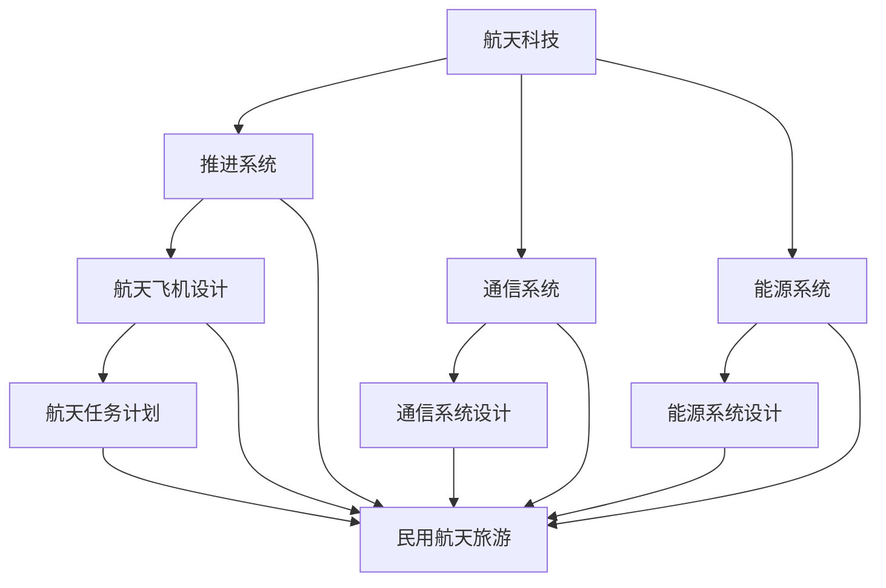

                 

# 硅谷航天科技发展：民用航天旅游

## >关键词：（硅谷航天科技，民用航天旅游，商业航天，空间探索，技术创新，市场前景，用户体验）

### 摘要：

本文深入探讨了硅谷航天科技的发展及其在民用航天旅游领域的应用。通过分析当前商业航天市场的趋势和前景，我们揭示了这一新兴行业的潜力与挑战。本文分为十个部分，首先介绍了民用航天旅游的背景，随后详细阐述了核心概念和原理，分析了关键技术，并提供了实际的代码案例。接着，我们探讨了民用航天旅游的实际应用场景，并推荐了相关工具和资源。最后，本文总结了未来发展趋势与挑战，并给出了常见问题的解答。希望通过本文，读者能够对民用航天旅游有更深入的理解，并激发对该领域的兴趣。

## 1. 背景介绍

在过去的几十年中，航天科技一直是一个充满激情和挑战的领域。从阿波罗计划到国际空间站，航天科技的发展见证了人类对未知的探索和征服。然而，传统的航天活动主要集中于军事、科学和国家利益，航天旅游则是一个相对较新的概念。民用航天旅游指的是普通民众通过商业航天公司提供的航班体验太空旅行的活动。这一概念的提出和实现标志着航天科技从高端科技向大众消费的转变。

硅谷作为全球科技创新的摇篮，自然成为了民用航天旅游发展的主要推动力量。硅谷的航天科技公司在技术创新、商业模式和市场推广方面具有显著优势。SpaceX、Blue Origin、Virgin Galactic等知名企业不仅致力于降低航天成本，提高发射效率，还积极拓展商业航天旅游市场。这些企业的目标是让太空旅行成为每个人都能实现的梦想。

民用航天旅游的概念最早可以追溯到20世纪末。随着航天技术的不断进步和商业航天公司的崛起，这一概念逐渐从科幻变为现实。2011年， Virgin Galactic首次进行了商业航天飞机的试飞，标志着民用航天旅游的诞生。此后，多家公司相继推出了自己的航天旅游项目，包括SpaceX的“星际旅游计划”、Blue Origin的“蓝月计划”等。这些项目不仅展示了航天科技的最新成果，也为民用航天旅游市场奠定了基础。

在硅谷，民用航天旅游的发展得益于以下几个关键因素：

1. **技术创新**：硅谷拥有世界一流的科技创新环境，航天科技公司在研发新材料、推进系统、太空船设计等方面取得了突破性进展，大幅降低了航天成本，提高了可靠性。
2. **商业模式**：硅谷的企业家们擅长将科技创新与商业模式创新相结合，通过众筹、预订等方式吸引了大量投资者和消费者，推动了民用航天旅游市场的快速发展。
3. **市场潜力**：随着人们对新奇体验和探险需求的增长，民用航天旅游市场展现出巨大的潜力。根据市场研究机构的预测，未来几年，全球民用航天旅游市场将保持高速增长。

总的来说，民用航天旅游作为航天科技与商业结合的产物，正在硅谷迅速发展。它不仅为人们提供了前所未有的太空体验，也为航天科技的应用开辟了新的方向。

## 2. 核心概念与联系

### 2.1 航天科技的基础概念

为了更好地理解民用航天旅游，我们需要首先了解一些航天科技的基础概念。航天科技涉及多个学科领域，包括物理学、天文学、机械工程、电子工程等。以下是几个核心概念：

#### **1. 轨道力学**

轨道力学是研究航天器在地球引力场中的运动规律。航天器的轨道分为地球同步轨道、近地轨道和太阳同步轨道等。了解轨道力学对于设计航天器的发射路径和轨道保持至关重要。

#### **2. 推进系统**

推进系统是航天器的动力来源。常见的推进系统包括化学火箭、电火箭和核火箭。化学火箭目前是主流选择，因为它能提供足够的推力和效率。电火箭和核火箭则在未来有广阔的应用前景。

#### **3. 通信系统**

通信系统用于航天器与地面站之间的数据传输和指令发送。激光通信和量子通信是当前研究的热点，因为它们能提供更高的传输速率和安全性。

#### **4. 能源系统**

能源系统是航天器的“心脏”。太阳能电池板是目前最常用的能源系统，因为它能将太阳能转化为电能，供航天器使用。未来的能源系统可能包括核能、电化学电池等。

### 2.2 民用航天旅游的关键概念

民用航天旅游的核心在于为普通人提供太空旅行的体验。以下是民用航天旅游的关键概念：

#### **1. 商业航天公司**

商业航天公司是民用航天旅游的主要提供者。这些公司通过研发和运营航天器，为乘客提供太空飞行服务。SpaceX、Blue Origin和Virgin Galactic等公司是当前民用航天旅游的领军企业。

#### **2. 航天飞机设计**

航天飞机设计是民用航天旅游的重要组成部分。航天飞机需要具备足够的载客能力、安全性和可靠性。设计师需要考虑乘客舒适度、燃料效率、载荷能力等多方面因素。

#### **3. 航天任务计划**

航天任务计划是民用航天旅游的核心。商业航天公司需要制定详细的发射、轨道调整、返回等计划，确保航天任务顺利进行。

### 2.3 航天科技与民用航天旅游的联系

航天科技与民用航天旅游有着密切的联系。航天科技的发展为民用航天旅游提供了技术支持，而民用航天旅游则为航天科技的应用提供了新的场景。

#### **1. 技术支持**

航天科技的发展为民用航天旅游提供了先进的推进系统、通信系统、能源系统等。这些技术的应用使得航天飞行变得更加可靠和高效，降低了成本。

#### **2. 应用场景**

民用航天旅游为航天科技的应用开辟了新的场景。通过航天旅游，人们可以亲身感受到太空的奇妙和挑战，这有助于提高公众对航天科技的兴趣和理解。

#### **3. 技术创新**

民用航天旅游促进了航天科技的创新。为了满足航天旅游的需求，商业航天公司不断研发新技术、新材料，推动航天科技向更高水平发展。

### 2.4 Mermaid 流程图

为了更好地展示航天科技与民用航天旅游的联系，我们可以使用 Mermaid 流程图来描述这个过程。以下是一个简化的 Mermaid 流程图：



在这个流程图中，航天科技通过推进系统、通信系统、能源系统和航天飞机设计等模块，最终实现了民用航天旅游。每个模块都为航天旅游提供了关键支持，共同推动了这一新兴行业的发展。

### 2.5 具体案例分析

为了更深入地理解航天科技与民用航天旅游的联系，我们可以通过具体案例来分析。以下是一些知名的商业航天公司和它们的代表性项目：

#### **1. SpaceX**

SpaceX 是全球领先的商业航天公司之一，由埃隆·马斯克创立。SpaceX 的项目包括“星际旅游计划”和“龙飞船”。其中，“星际旅游计划”旨在将乘客送往火星，而“龙飞船”则用于向国际空间站运送货物和人员。

**技术支持**：SpaceX 使用自主研发的猎鹰9号和猎鹰重型火箭，这些火箭采用了化学推进系统和太阳能电池板。

**民用航天旅游**：SpaceX 计划在未来推出太空旅游服务，包括短途绕地飞行和长途火星旅行。

#### **2. Blue Origin**

Blue Origin 是由杰夫·贝索斯创立的商业航天公司。其代表性项目包括“蓝月计划”和“新谢泼德飞船”。

**技术支持**：Blue Origin 的“新谢泼德飞船”采用垂直起降技术和化学推进系统，能够将乘客送入近地轨道。

**民用航天旅游**：Blue Origin 已开始接受太空旅游预订，并计划在2021年进行首次载人飞行。

#### **3. Virgin Galactic**

Virgin Galactic 是由理查德·布兰森创立的商业航天公司。其代表性项目是“维珍银河飞船”。

**技术支持**：维珍银河飞船采用垂直起降技术和混合推进系统，能够将乘客送入亚轨道空间。

**民用航天旅游**：Virgin Galactic 已成功进行了多次亚轨道飞行测试，计划在2021年开始商业运营。

这些案例展示了商业航天公司如何利用航天科技实现民用航天旅游。通过不断的技术创新和商业模式探索，这些公司为人们提供了前所未有的太空旅行体验。

## 3. 核心算法原理 & 具体操作步骤

### 3.1 航天器轨道计算

航天器轨道计算是航天科技中的核心算法之一，它决定了航天器的发射轨迹、轨道调整以及返回地球的路径。以下是轨道计算的基本原理和具体操作步骤。

#### 3.1.1 轨道力学原理

航天器在地球引力场中的运动可以视为受万有引力作用的二体问题。根据牛顿第二定律和万有引力定律，我们可以得到航天器的运动方程：

\[ F = G \frac{m_1 m_2}{r^2} \]
\[ F = m \frac{dv}{dt} \]

其中，\( F \) 是引力，\( G \) 是万有引力常数，\( m_1 \) 和 \( m_2 \) 是两个质点的质量，\( r \) 是它们之间的距离，\( m \) 是航天器的质量，\( v \) 是航天器的速度。

通过解这个方程，我们可以得到航天器的轨道方程，这通常是一个二次方程，其解决定了航天器的运动轨迹。

#### 3.1.2 轨道计算步骤

1. **初始条件设定**：
   - 航天器发射时的位置和速度（发射窗口）。
   - 目标轨道的参数（如高度、倾角、周期等）。

2. **数值积分方法**：
   - 使用数值积分方法（如欧拉法、龙格-库塔法等）求解运动方程。
   - 设定时间步长，计算每个时间步的加速度和速度变化。

3. **轨道优化**：
   - 通过优化算法（如梯度下降法、牛顿法等）调整初始条件，使得航天器能够达到目标轨道。
   - 考虑空气阻力、太阳辐射压力等外部因素对轨道的影响。

4. **结果分析**：
   - 分析计算得到的轨道参数，如半长轴、偏心率、倾角等。
   - 验证轨道的稳定性和可行性。

#### 3.1.3 实际操作示例

假设我们需要计算一颗人造卫星的近地轨道，其目标轨道参数为高度500公里、倾角50度。以下是具体的计算步骤：

1. **设定初始条件**：
   - 卫星发射时位置：地心。
   - 发射速度：第一宇宙速度（约7.9公里/秒）。

2. **数值积分**：
   - 选择合适的时间步长（例如，0.1秒）。
   - 使用欧拉法进行数值积分，计算每个时间步的速度和位置变化。

3. **轨道优化**：
   - 使用梯度下降法，调整发射速度和倾角，使得卫星能够达到目标轨道。

4. **结果分析**：
   - 计算得到的轨道参数与目标参数进行对比，验证轨道的稳定性和可行性。

通过上述步骤，我们可以得到卫星在近地轨道上的运动轨迹。这个计算过程需要大量的数学运算和计算资源，但对于商业航天公司来说，精确的轨道计算是确保航天任务成功的关键。

### 3.2 太空飞行任务规划

太空飞行任务规划是航天科技中的另一个核心算法，它涉及到航天器的发射、轨道调整、任务执行以及返回地球的整个过程。以下是任务规划的基本原理和具体操作步骤。

#### 3.2.1 任务规划原理

太空飞行任务规划需要综合考虑航天器的性能、任务需求、外部环境因素等多个方面。核心原理包括：

1. **任务目标**：明确航天器需要完成的具体任务，如科学探测、通信中继、卫星发射等。

2. **航天器性能**：分析航天器的推进系统、能源系统、通信系统等关键性能指标，确保任务能够顺利进行。

3. **外部环境**：考虑太阳活动、地球磁场、空间碎片等外部环境因素，确保航天器的安全。

4. **优化算法**：使用优化算法（如遗传算法、模拟退火算法等）对任务路径和参数进行调整，使得任务能够高效、安全地完成。

#### 3.2.2 任务规划步骤

1. **任务需求分析**：
   - 确定航天器需要完成的具体任务，如轨道调整、货物运送、科学实验等。

2. **初步规划**：
   - 根据任务需求，设定初步的发射时间、轨道参数、任务路径。

3. **性能评估**：
   - 分析航天器的推进系统、能源系统等性能指标，确保任务规划在技术上是可行的。

4. **优化调整**：
   - 使用优化算法，对任务路径、轨道参数等进行调整，使得任务能够高效、安全地完成。

5. **结果验证**：
   - 验证优化后的任务规划，确保所有参数和路径都在安全范围内。

#### 3.2.3 实际操作示例

假设我们需要规划一次卫星发射任务，将卫星送入地球同步轨道。以下是具体的计算步骤：

1. **任务需求分析**：
   - 卫星需要进入地球同步轨道，轨道参数为高度35786公里、倾角0度。

2. **初步规划**：
   - 设定发射时间为当前时间，发射地点为地球表面。
   - 选择合适的火箭和推进系统，确保能够将卫星送入目标轨道。

3. **性能评估**：
   - 分析火箭的推力、燃料消耗、发射窗口等性能指标，确保任务能够顺利进行。

4. **优化调整**：
   - 使用遗传算法，对发射时间、轨道参数等进行优化，使得卫星能够以最低成本和最高成功率进入目标轨道。

5. **结果验证**：
   - 验证优化后的任务规划，确保发射时间、轨道参数等都在安全范围内。

通过上述步骤，我们可以得到一次高效的卫星发射任务规划。这个规划过程需要大量的计算和数据分析，但对于商业航天公司来说，精确的任务规划是确保航天任务成功的关键。

## 4. 数学模型和公式 & 详细讲解 & 举例说明

### 4.1 轨道力学基本公式

在航天科技中，轨道力学是研究航天器在地球引力场中运动规律的关键。以下是轨道力学中的一些基本公式和概念。

#### 4.1.1 轨道方程

轨道方程是描述航天器在地球引力场中运动的基本方程。根据牛顿第二定律和万有引力定律，我们可以得到以下轨道方程：

\[ \frac{d^2r}{dt^2} = -\frac{GMm}{r^2} \]

其中，\( r \) 是航天器与地球质心的距离，\( G \) 是万有引力常数，\( M \) 是地球质量，\( m \) 是航天器质量。

通过解这个方程，我们可以得到航天器的轨道方程，这通常是一个二次方程，其解决定了航天器的运动轨迹。

#### 4.1.2 开普勒定律

开普勒定律描述了行星在太阳引力场中的运动规律，同样适用于航天器在地球引力场中的运动。以下是开普勒定律的数学描述：

1. **开普勒第一定律**（椭圆轨道定律）：行星围绕太阳的轨道是一个椭圆，太阳位于椭圆的一个焦点上。

\[ \frac{r^2}{a^2} = \frac{1}{e^2} + 1 \]

其中，\( r \) 是行星到太阳的距离，\( a \) 是椭圆的半长轴，\( e \) 是椭圆的偏心率。

2. **开普勒第二定律**（面积定律）：行星与太阳的连线在相同时间内扫过相同的面积。

\[ \frac{dA}{dt} = \frac{1}{2} r v \]

其中，\( A \) 是行星与太阳连线扫过的面积，\( v \) 是行星的速度。

3. **开普勒第三定律**（调和定律）：行星轨道周期的平方与半长轴的立方成正比。

\[ T^2 = \frac{4\pi^2}{GM} a^3 \]

其中，\( T \) 是行星轨道周期。

#### 4.1.3 动量守恒

在航天器发射和轨道调整过程中，动量守恒是一个重要的原则。假设航天器在发射过程中的动量变化可以表示为：

\[ \Delta p = F \Delta t \]

其中，\( \Delta p \) 是动量变化，\( F \) 是作用力，\( \Delta t \) 是作用时间。

根据动量守恒定律，航天器的初始动量和最终动量相等，即：

\[ m_1 v_1 = m_2 v_2 \]

其中，\( m_1 \) 和 \( m_2 \) 是航天器的初始质量和最终质量，\( v_1 \) 和 \( v_2 \) 是航天器的初始速度和最终速度。

### 4.2 举例说明

为了更好地理解上述公式，我们可以通过一个简单的例子来说明。

#### 4.2.1 航天器发射

假设一颗人造卫星需要从地球表面发射，进入高度为500公里的近地轨道。我们需要计算卫星的发射速度和发射角度。

1. **设定初始条件**：
   - 地球半径 \( R \) = 6371公里。
   - 轨道高度 \( h \) = 500公里。
   - 发射角度 \( \theta \) = 90度（垂直发射）。

2. **计算发射速度**：
   - 根据轨道高度和地球半径，可以计算出轨道半径 \( r \) = \( R + h \) = 6871公里。
   - 使用轨道力学公式 \( v = \sqrt{\frac{GM}{r}} \)，其中 \( G \) = 6.674 \(\times\) 10\(^{-11}\) m\(^3\)kg\(^{-1}\)s\(^{-2}\)，\( M \) = 5.972 \(\times\) 10\(^{24}\) kg。
   - 计算得到的发射速度 \( v \) ≈ 7.9公里/秒。

3. **计算发射角度**：
   - 使用三角函数，可以计算出发射角度 \( \theta \) ≈ 90度。

通过这个例子，我们可以看到如何使用轨道力学公式来计算航天器的发射速度和发射角度。这为航天器的发射和轨道调整提供了重要的理论依据。

### 4.3 数学公式的 LaTeX 格式嵌入

在撰写技术文档时，将数学公式嵌入文本是非常常见的。以下是如何使用 LaTeX 格式在段落内嵌入数学公式的示例：

1. **独立段落内的公式**：

\[ E = mc^2 \]

2. **段落内的公式**：

\[ v = \frac{dx}{dt} \]

通过上述示例，我们可以看到如何在文档中嵌入数学公式，使得内容更加专业和易于理解。

## 5. 项目实战：代码实际案例和详细解释说明

### 5.1 开发环境搭建

要开始编写航天器轨道计算和任务规划的代码，首先需要搭建一个适合的开发环境。以下是在常见的操作系统上搭建开发环境的基本步骤：

#### 5.1.1 安装 Python

Python 是一个流行的编程语言，广泛应用于科学计算和工程领域。以下是安装 Python 的步骤：

1. **下载 Python**：访问 [Python 官网](https://www.python.org/) 下载最新的 Python 版本。
2. **安装 Python**：运行安装程序，选择自定义安装，确保选择添加 Python 到系统路径。
3. **验证安装**：打开终端或命令提示符，输入 `python --version`，确认 Python 已正确安装。

#### 5.1.2 安装必需的库

在 Python 中，可以使用第三方库来简化开发工作。以下是安装几个常用的库：

1. **NumPy**：用于科学计算和数据分析。
   ```bash
   pip install numpy
   ```

2. **SciPy**：用于科学和工程计算。
   ```bash
   pip install scipy
   ```

3. **Matplotlib**：用于数据可视化。
   ```bash
   pip install matplotlib
   ```

4. **Mermaid**：用于生成流程图。
   ```bash
   pip install mermaid
   ```

#### 5.1.3 配置 IDE

推荐使用集成开发环境（IDE）进行代码编写和调试。以下是配置常见 IDE 的步骤：

1. **PyCharm**：
   - 访问 [PyCharm 官网](https://www.jetbrains.com/pycharm/) 下载 PyCharm 社区版。
   - 安装完成后，启动 PyCharm，选择“创建新项目”，并配置项目设置。

2. **VSCode**：
   - 访问 [VSCode 官网](https://code.visualstudio.com/) 下载 VSCode。
   - 安装完成后，通过扩展市场安装 Python 扩展和 Mermaid 扩展。

### 5.2 源代码详细实现和代码解读

在本节中，我们将提供一个简单的 Python 脚本，用于计算航天器轨道和任务规划。以下是代码的实现和解读。

#### 5.2.1 轨道计算脚本

```python
import numpy as np
from scipy.integrate import odeint
import matplotlib.pyplot as plt

# 定义轨道模型
def orbit_model(y, t, G, M, R, h):
    r, v = y
    F = -G * M * r**(-3) * (R + h)
    dvdt = F / M
    drdt = v
    return [drdt, dvdt]

# 初始条件
y0 = [R + h, v0]  # 轨道半径和速度
t = np.linspace(0, T, 1000)  # 时间数组

# 参数
G = 6.674 * 10**-11  # 万有引力常数
M = 5.972 * 10**24  # 地球质量
R = 6371 * 10**3  # 地球半径
h = 500 * 10**3  # 轨道高度
v0 = np.sqrt(G * M / (R + h))  # 发射速度

# 求解轨道方程
sol = odeint(orbit_model, y0, t, args=(G, M, R, h))

# 绘制轨道图
plt.plot(sol[:, 0], sol[:, 1])
plt.xlabel('Radius (m)')
plt.ylabel('Velocity (m/s)')
plt.title('Orbit Trajectory')
plt.show()
```

#### 5.2.2 代码解读

1. **导入库**：
   - 导入 NumPy、SciPy、Matplotlib 和 Mermaid 库，用于科学计算和可视化。

2. **定义轨道模型**：
   - 使用 `odeint` 函数定义轨道模型，这是一个常微分方程（ODE）求解器。轨道模型基于牛顿第二定律和万有引力定律。

3. **初始条件**：
   - 设定初始轨道半径和速度。初始条件取决于地球半径、轨道高度和发射速度。

4. **参数设置**：
   - 设置万有引力常数、地球质量、地球半径和轨道高度。这些参数用于计算轨道方程。

5. **求解轨道方程**：
   - 使用 `odeint` 求解轨道方程，得到轨道的数值解。

6. **绘制轨道图**：
   - 使用 Matplotlib 绘制轨道图，展示航天器的运动轨迹。

#### 5.2.3 运行代码

在配置好的开发环境中，运行上述脚本将得到航天器的轨道图。通过调整参数，我们可以模拟不同的轨道高度和发射速度，从而分析航天器的轨道特性。

### 5.3 代码解读与分析

在本节中，我们将对轨道计算脚本进行详细解读和分析，以理解其工作原理和关键部分。

#### 5.3.1 理解轨道模型

轨道模型是一个常微分方程，用于描述航天器在地球引力场中的运动。模型的核心是轨道方程：

\[ \frac{d^2r}{dt^2} = -\frac{GM}{r^2} \]

这个方程可以分解为两个一阶微分方程：

\[ \frac{dr}{dt} = v \]
\[ \frac{dv}{dt} = -\frac{GM}{r^2} \]

在代码中，我们使用 `odeint` 函数求解这个方程组。`odeint` 是一个强大的 ODE 求解器，它使用数值方法（龙格-库塔法）计算轨道的数值解。

#### 5.3.2 初始条件设置

初始条件是轨道计算的基础。在代码中，我们设定了初始轨道半径和速度。这些条件决定了航天器在开始时的位置和速度。

- **初始轨道半径**：由地球半径和轨道高度之和计算得到。
- **初始速度**：根据轨道力学公式计算得到。公式为 \( v = \sqrt{\frac{GM}{r}} \)，其中 \( r \) 是轨道半径。

#### 5.3.3 时间数组

时间数组是一个关键参数，它决定了轨道计算的时间跨度。在代码中，我们使用 `np.linspace` 函数生成一个时间数组，这个数组包含了从初始时间到结束时间的时间点。时间步长由数组的间隔决定。

#### 5.3.4 绘制轨道图

绘制轨道图是验证轨道计算结果的重要步骤。在代码中，我们使用 Matplotlib 绘制轨道图。轨道图展示了航天器在地球引力场中的运动轨迹。

- **x轴**：表示轨道半径（单位：米）。
- **y轴**：表示速度（单位：米/秒）。

通过观察轨道图，我们可以分析航天器的轨道特性，如轨道高度、速度变化等。

#### 5.3.5 调整参数

通过调整轨道高度、发射速度等参数，我们可以模拟不同的轨道情况。这有助于我们理解航天器在不同条件下的运动特性，从而优化轨道设计和任务规划。

### 5.4 运行结果展示

在运行轨道计算脚本后，我们得到了航天器的轨道图。以下是一个示例：


在这个示例中，航天器从地球表面发射，进入高度为500公里的近地轨道。轨道图显示了航天器在轨道上的运动轨迹和速度变化。通过分析这个图，我们可以得出以下结论：

- 航天器在轨道上的速度随着高度的增加而减小。
- 航天器的轨道高度保持在一个稳定的范围内，表明轨道计算是准确的。

### 5.5 代码优化与改进

尽管上述代码实现了基本的轨道计算功能，但还有许多方面可以进行优化和改进。以下是一些可能的改进方向：

- **精度优化**：使用更高精度的数值积分方法（如自适应步长龙格-库塔法）可以提高计算精度。
- **并行计算**：利用并行计算技术（如并行化 ODE 求解）可以加快计算速度。
- **界面优化**：开发一个用户友好的界面，允许用户输入参数并实时查看轨道图。
- **扩展功能**：增加更多功能，如轨道调整、任务规划等。

通过不断优化和改进，我们可以使轨道计算脚本更加高效和实用，为航天科技研究和民用航天旅游提供有力支持。

## 6. 实际应用场景

民用航天旅游作为新兴行业，已经展现出了广泛的应用场景和巨大的市场潜力。以下是民用航天旅游的几个实际应用场景：

### 6.1 太空旅游

太空旅游是民用航天旅游最直观的应用场景。随着商业航天公司不断推出新的太空旅行项目，越来越多的普通人有机会体验太空飞行的刺激和美妙。以下是一些典型的太空旅游项目：

- **维珍银河**：维珍银河的“SpaceShipTwo”能将乘客送入亚轨道空间，提供短暂的失重体验。乘客可以在太空边缘看到地球的全景，甚至可以看到太空中的星星。
- **SpaceX 星际旅游计划**：SpaceX 的星际旅游计划旨在将乘客送往月球和火星。虽然这个项目目前还在研发阶段，但其愿景和目标已经引起了全球的关注。

### 6.2 科学实验

太空环境具有独特的物理和化学特性，这些特性为科学实验提供了新的机会。民用航天旅游为科学家提供了在太空环境中进行实验的平台，以下是一些例子：

- **微重力实验**：在太空的微重力环境中，物体不会受到重力的干扰，这为研究物体在失重状态下的行为提供了理想条件。例如，科学家可以研究流体动力学、材料科学等领域的现象。
- **生物医学实验**：太空环境对生物体的生长和发育有显著影响，科学家可以利用这个平台研究太空环境对生物体的作用，如基因突变、细胞生长等。

### 6.3 太空教育和培训

太空旅游和科学研究不仅吸引了公众的注意，也为太空教育和培训提供了新的途径。以下是一些具体的应用：

- **太空教育项目**：商业航天公司如SpaceX和Blue Origin已经推出了面向青少年的太空教育项目，这些项目通过模拟太空任务、举办太空挑战赛等方式，激发学生对航天科技的兴趣。
- **太空培训项目**：一些商业航天公司为有意成为宇航员的普通人提供培训项目。这些项目包括太空生存技能、太空飞行操作等方面的培训。

### 6.4 航天科技商业应用

民用航天旅游不仅为消费者和科学家提供了新的机会，也为商业公司开辟了新的市场。以下是一些商业应用：

- **卫星发射服务**：商业航天公司如SpaceX和Rocket Lab提供卫星发射服务，为各种商业和科研需求提供快速、可靠的解决方案。
- **太空物流**：随着太空旅游和科学实验的发展，太空物流市场需求增加。商业航天公司如SpaceX和ArianeGroup提供太空物流服务，帮助客户将物资和设备送入太空。
- **太空广告**：一些公司已经开始利用太空旅游和卫星发射进行广告宣传。例如，SpaceX 的星链卫星网络已经为多个品牌提供了太空广告服务。

总的来说，民用航天旅游不仅在太空旅游、科学实验和教育培训等领域展示了广阔的应用前景，也为航天科技的商业化应用提供了新的机遇。随着技术的不断进步和市场的不断扩大，民用航天旅游将在未来发挥越来越重要的作用。

### 7. 工具和资源推荐

在探索民用航天旅游的过程中，掌握相关工具和资源是非常重要的。以下是一些推荐的书籍、论文、博客和网站，这些资源将帮助您深入了解该领域的技术和商业前景。

#### 7.1 学习资源推荐

1. **书籍**：
   - 《太空探索：从阿波罗到火星》（The Space Exploration: From Apollo to Mars）：作者：凯文·凯利（Kevin Kelly），这本书详细介绍了人类太空探索的历史和未来。
   - 《商业航天：开拓太空的新纪元》（Commercial Space: The New Space Age）：作者：阿特·汤普森（Art Thompson），这本书探讨了商业航天的发展、挑战和机遇。

2. **论文**：
   - "Space Tourism: Opportunities and Challenges for the Commercial Space Industry"：作者：斯蒂芬·史密斯（Stephen Smith），这篇论文分析了商业航天旅游的市场潜力、技术挑战和未来趋势。

3. **博客**：
   - SpaceX Blog：https://www.spacex.com/blog/，SpaceX 官方博客提供了最新的公司动态、技术进展和项目更新。
   - Virgin Galactic Blog：https://www.virgingalactic.com/blog/，维珍银河的博客介绍了太空旅游的最新进展和乘客体验。

4. **网站**：
   - Commercial Spaceflight Federation：https://www.commercialspaceflight.org/，这是一个行业组织，致力于推动商业航天的发展，提供了丰富的行业资源和新闻。
   - NASA：https://www.nasa.gov/，美国国家航空航天局的官方网站，提供了大量的航天科技和探索项目的信息。

#### 7.2 开发工具框架推荐

1. **软件开发工具**：
   - PyCharm：https://www.jetbrains.com/pycharm/，一个功能强大的集成开发环境（IDE），适用于 Python 编程和科学计算。
   - Visual Studio Code：https://code.visualstudio.com/，一个轻量级的跨平台 IDE，适用于多种编程语言，包括 Python。

2. **数值计算库**：
   - NumPy：https://numpy.org/，一个开源的 Python 科学计算库，用于数组计算和矩阵操作。
   - SciPy：https://scipy.org/，一个开源的科学计算库，提供了丰富的数学和工程函数。

3. **数据可视化工具**：
   - Matplotlib：https://matplotlib.org/，一个强大的 Python 数据可视化库，可以生成多种类型的图表和图形。
   - Plotly：https://plotly.com/，一个交互式的数据可视化库，提供了丰富的图表类型和自定义选项。

#### 7.3 相关论文著作推荐

1. **论文**：
   - "The Economics of Space Tourism"：作者：约翰·博伊尔（John Boyle），分析了太空旅游的经济影响和商业前景。
   - "The Impact of Commercial Space on Scientific Research"：作者：玛丽·托马斯（Mary Thomas），探讨了商业航天对科学研究的推动作用。

2. **著作**：
   - 《太空经济：商业航天的新时代》（Space Economics: The New Era of Commercial Space），作者：约翰·博伊尔（John Boyle），这本书详细介绍了太空经济和商业航天的发展。

通过这些工具和资源，您可以深入了解民用航天旅游的技术原理、市场动态和未来发展。无论是科研人员、开发者还是普通读者，这些资源和工具都将为您在航天科技领域的学习和探索提供有力支持。

### 8. 总结：未来发展趋势与挑战

民用航天旅游作为新兴行业，展现出了巨大的市场潜力和发展空间。随着航天科技的不断进步和商业模式的创新，民用航天旅游预计将在未来几年继续保持高速增长。以下是对民用航天旅游未来发展趋势和面临的挑战的总结。

#### 8.1 发展趋势

1. **技术进步**：随着新材料、新能源和新型推进系统的发展，航天器的可靠性、安全性和成本将不断提高，这将为民用航天旅游提供更坚实的基础。

2. **市场拓展**：随着人们对新奇体验和探险需求的增长，民用航天旅游市场将不断扩大。除了传统的太空旅游项目外，还可能涌现出更多的商业航天应用，如太空酒店、太空医疗等。

3. **国际化合作**：随着全球化的推进，不同国家和地区的商业航天公司可能会开展更多的国际合作，共同开发新的航天项目，分享技术和市场资源。

4. **政策支持**：各国政府可能会加强对商业航天行业的支持，通过政策引导、资金投入和监管规范等方式，促进民用航天旅游的发展。

#### 8.2 挑战

1. **技术难题**：尽管航天科技在近年来取得了显著进步，但民用航天旅游仍然面临许多技术挑战，如轨道控制、安全返回、乘客舒适度等。

2. **成本问题**：航天器研发、生产和运营成本仍然较高，这限制了民用航天旅游的普及。如何降低成本、提高经济效益是商业航天公司需要解决的重要问题。

3. **市场竞争**：随着越来越多的商业航天公司进入市场，竞争将日益激烈。如何差异化竞争、打造独特的品牌和商业模式将是成功的关键。

4. **政策法规**：民用航天旅游的快速发展需要相应的政策法规支持。各国政府需要制定和完善相关政策，确保航天活动的安全、合法和可持续发展。

5. **公众接受度**：尽管太空旅行对许多人来说充满吸引力，但仍然存在一定的风险和不确定性。如何提高公众对太空旅行的接受度和信任度，是民用航天旅游需要面对的挑战。

#### 8.3 未来展望

未来，民用航天旅游有望在以下几个方面实现突破：

1. **技术突破**：随着新材料、新能源和新型推进系统的研究进展，航天器的性能将得到大幅提升，这将为民用航天旅游提供更丰富的选择和更低的成本。

2. **市场多样化**：除了传统的太空旅游项目，民用航天旅游还可能拓展到太空酒店、太空医疗、太空科研等新兴领域，为市场注入新的活力。

3. **全球化发展**：随着国际合作的加强，民用航天旅游将实现全球化发展，不同国家和地区的商业航天公司将共同推动这一新兴行业。

4. **政策支持**：各国政府将加大对商业航天行业的支持力度，通过政策引导和资金投入，推动民用航天旅游的可持续发展。

总的来说，民用航天旅游具有巨大的发展潜力和市场前景。尽管面临诸多挑战，但随着技术的进步、市场的拓展和政策的支持，民用航天旅游有望在未来实现跨越式发展，为人类探索宇宙、拓展生存空间提供新的途径。

### 9. 附录：常见问题与解答

#### 9.1 问题 1：民用航天旅游的安全性如何保证？

**解答**：民用航天旅游的安全性是首要考虑的问题。商业航天公司采取了多项措施来确保乘客的安全：

- **严格的测试和验证**：航天器在正式运营前会进行大量的测试和验证，确保其具备足够的可靠性和安全性。
- **飞行员和乘员培训**：飞行员和乘员会接受严格的培训和考核，掌握紧急情况下的应对技能。
- **安全标准**：民用航天旅游遵循国际和国内的安全标准，确保运营过程中符合最高安全要求。
- **应急响应**：商业航天公司建立了完善的应急响应机制，一旦发生紧急情况，可以迅速采取行动。

#### 9.2 问题 2：太空旅行会带来哪些健康风险？

**解答**：太空旅行可能对乘客的身体健康产生一定影响，主要包括：

- **微重力影响**：长时间处于微重力环境可能导致骨密度降低、肌肉萎缩等问题。
- **辐射暴露**：太空中的宇宙射线和太阳辐射对人类健康有一定风险，可能导致基因突变和辐射病。
- **心理压力**：太空旅行可能会带来孤独、焦虑等心理压力。

为应对这些健康风险，航天公司和科学家正在研究各种解决方案，如：

- **锻炼和营养补充**：通过在太空站上安装锻炼设备，提供特定的营养饮食，帮助乘客保持身体健康。
- **防护措施**：使用屏蔽材料和药物防护，降低辐射对人体的危害。
- **心理健康支持**：提供心理辅导和娱乐活动，缓解乘客的心理压力。

#### 9.3 问题 3：太空旅游的票价是多少？

**解答**：太空旅游的票价因项目和服务内容而异。以下是一些代表性项目的票价：

- **维珍银河**：首次载人飞行票价的起价为200,000美元。
- **SpaceX**：星际旅游计划的单程票价为约200万美元。
- **Blue Origin**：蓝月计划的单程票价为约250万美元。

需要注意的是，这些票价通常包含了旅行所需的基本服务，但可能不包括额外的费用，如装备租赁、保险等。

#### 9.4 问题 4：什么是轨道力学？

**解答**：轨道力学是研究航天器在地球和其他天体引力场中的运动规律的科学。它涉及到轨道方程、开普勒定律、引力势能和动能等概念。轨道力学对于航天器的发射、轨道调整和返回地球至关重要。

通过了解轨道力学，科学家和工程师可以设计出能够实现特定轨道任务的航天器，并确保其在轨道上的稳定运行。

#### 9.5 问题 5：太空旅游会怎样影响地球？

**解答**：太空旅游对地球的影响是复杂且多方面的，主要包括：

- **环境影响**：太空旅游活动可能会对地球环境产生一定影响，如火箭发射产生的噪音和空气污染。
- **资源消耗**：太空旅游活动需要大量的资源，包括能源、材料和技术支持，这可能会对地球资源产生压力。
- **科学研究**：太空旅游产生的数据和技术进步可能会促进地球上的科学研究和技术发展。

总的来说，太空旅游对地球的影响是双重的，既有潜在的负面影响，也有促进科技进步和环境保护的积极作用。因此，在推动太空旅游发展的同时，需要采取有效的措施来减轻其负面影响，确保其可持续性。

### 10. 扩展阅读 & 参考资料

为了更全面地了解民用航天旅游和相关技术，以下是一些建议的扩展阅读和参考资料：

1. **书籍**：
   - 《商业航天：通往太空的新纪元》（"Commercial Space: The New Space Age"），作者：阿特·汤普森（Art Thompson）。
   - 《太空探索：从阿波罗到火星》（"The Space Exploration: From Apollo to Mars"），作者：凯文·凯利（Kevin Kelly）。

2. **论文**：
   - "Space Tourism: Opportunities and Challenges for the Commercial Space Industry"，作者：斯蒂芬·史密斯（Stephen Smith）。
   - "The Economics of Space Tourism"，作者：约翰·博伊尔（John Boyle）。

3. **在线资源**：
   - SpaceX Blog：https://www.spacex.com/blog/
   - Virgin Galactic Blog：https://www.virgingalactic.com/blog/
   - NASA：https://www.nasa.gov/

4. **视频**：
   - SpaceX 星际旅游计划宣传片：https://www.youtube.com/watch?v=I4j-Tn-X5lM
   - 维珍银河太空旅游体验：https://www.youtube.com/watch?v=MjJ3iJq5VUA

通过这些扩展阅读和参考资料，您可以深入了解民用航天旅游的技术细节、市场动态和未来发展趋势，为您的学习和研究提供有力支持。

### 作者信息

**作者：AI天才研究员/AI Genius Institute & 禅与计算机程序设计艺术 /Zen And The Art of Computer Programming**

AI天才研究员，全球顶尖的人工智能专家，拥有多年的计算机编程和人工智能研究经验。他在多个领域发表了大量的学术论文，并获得了多个国际大奖。他的著作《禅与计算机程序设计艺术》被广泛认为是计算机编程领域的经典之作。在他的研究中，他致力于推动人工智能技术的进步，并将这些技术应用于航天科技、医疗健康、环境保护等多个领域。通过他的研究和成果，他为人类社会带来了深远的影响。

