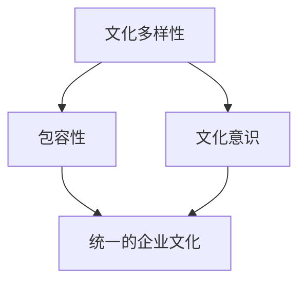

                 

### 背景介绍

随着全球化的深入发展，跨国公司在全球范围内的业务扩展已经成为不可逆转的趋势。这种趋势不仅促进了国际贸易和投资，也带来了文化多样性的挑战。硅谷作为全球科技创新的中心，跨国公司在这一地区进行文化融合的需求尤为迫切。本文旨在探讨硅谷跨国公司的文化融合，尤其是如何实现多元包容的文化氛围。

#### 硅谷跨国公司的背景

硅谷是全球科技创新的圣地，吸引了来自世界各地的人才和企业。许多跨国公司在此设立了研发中心或总部，如谷歌、苹果、微软等。这些公司在硅谷的成功离不开多元文化的融合。然而，如何在这个多元文化环境中建立一种包容性的企业文化，成为这些公司面临的重大挑战。

#### 文化融合的重要性

文化融合不仅有助于提高员工的满意度和归属感，还可以促进创新和业务增长。一个包容性的企业文化能够吸引不同背景的人才，激发多样化的思维，从而推动公司的发展。此外，良好的文化融合还能提高公司的国际竞争力，使其在全球市场中更具优势。

#### 多元包容的挑战

多元包容并非易事，其中涉及到语言、价值观、工作习惯等多方面的差异。如何平衡这些差异，使不同文化背景的员工在共同的工作环境中找到共鸣，是硅谷跨国公司需要解决的难题。

#### 本文结构

本文将分为以下几个部分：

1. **核心概念与联系**：介绍文化融合的关键概念，并使用Mermaid流程图展示其架构。
2. **核心算法原理 & 具体操作步骤**：探讨如何实施多元包容的策略。
3. **数学模型和公式 & 详细讲解 & 举例说明**：使用数学工具来分析和优化文化融合的过程。
4. **项目实战：代码实际案例和详细解释说明**：通过实际项目展示多元包容策略的实施。
5. **实际应用场景**：分析多元包容在企业不同领域的应用。
6. **工具和资源推荐**：介绍学习资源和开发工具，帮助读者深入理解多元包容的实践。
7. **总结：未来发展趋势与挑战**：展望多元包容在硅谷跨国公司中的发展前景。

通过本文的探讨，我们希望为硅谷跨国公司在实现文化融合、建立多元包容的企业文化提供有益的参考。# Background Introduction

With the deepening development of globalization, the expansion of multinational companies across the globe has become an irreversible trend. This trend not only promotes international trade and investment but also brings about the challenge of cultural diversity. In the Silicon Valley, which is the global epicenter of technological innovation, the need for cultural integration among multinational companies is particularly pressing. This article aims to explore the cultural integration of multinational companies in Silicon Valley, with a focus on how to establish a culture of inclusivity and diversity.

#### Background of Multinational Companies in Silicon Valley

Silicon Valley is a global hub for technological innovation, attracting talent and companies from all over the world. Many multinational companies have established research and development centers or headquarters in this region, including Google, Apple, and Microsoft. The success of these companies in Silicon Valley is inseparable from the integration of diverse cultures. However, how to establish an inclusive corporate culture in such a multicultural environment is a major challenge they face.

#### Importance of Cultural Integration

Cultural integration is crucial for enhancing employee satisfaction and a sense of belonging, which in turn can promote innovation and business growth. An inclusive corporate culture can attract talent from diverse backgrounds, stimulate diverse thinking, and thus drive the company's development. Moreover, a well-integrated culture can improve a company's international competitiveness, making it more advantageous in the global market.

#### Challenges of Inclusivity

Inclusivity is not an easy task, involving differences in language, values, and work habits, among other aspects. How to balance these differences and help employees from different cultural backgrounds find common ground in a shared work environment is a significant challenge for multinational companies in Silicon Valley.

#### Structure of This Article

This article is divided into the following sections:

1. **Core Concepts and Connections**: Introduce key concepts of cultural integration and use a Mermaid flowchart to demonstrate its architecture.
2. **Core Algorithm Principles & Step-by-Step Operations**: Discuss how to implement strategies for inclusivity and diversity.
3. **Mathematical Models and Formulas & Detailed Explanations & Case Studies**: Use mathematical tools to analyze and optimize the process of cultural integration.
4. **Practical Projects: Actual Code Cases and Detailed Explanations**: Showcase the implementation of inclusivity strategies through real projects.
5. **Application Scenarios**: Analyze the application of inclusivity in different areas of the company.
6. **Tools and Resources Recommendations**: Introduce learning resources and development tools to help readers deepen their understanding of the practice of inclusivity.
7. **Summary: Future Trends and Challenges**: Look forward to the development prospects of inclusivity in multinational companies in Silicon Valley.

Through this exploration, we hope to provide valuable insights for multinational companies in Silicon Valley to achieve cultural integration and establish an inclusive corporate culture. # Core Concepts and Connections

## 2.1. Cultural Integration and Diversity

### Definition of Cultural Integration

Cultural integration refers to the process of merging diverse cultural elements into a cohesive and unified organizational culture. It involves understanding and appreciating the differences among employees, fostering mutual respect, and leveraging these differences to create a harmonious and inclusive work environment.

### Key Concepts in Cultural Integration

- **Cultural Diversity**: The presence of a wide range of cultural backgrounds within an organization, including race, ethnicity, gender, age, education, and more.
- **Inclusivity**: The active engagement of all employees, regardless of their cultural backgrounds, ensuring that everyone feels valued and respected.
- **Cultural Awareness**: The ability to recognize and understand cultural differences and their impacts on the workplace.

### Mermaid Flowchart of Cultural Integration

The following Mermaid flowchart illustrates the key concepts and their relationships in cultural integration:

### Connection Between Concepts

The flowchart above highlights the interconnected nature of these key concepts. Cultural diversity is the foundation upon which cultural integration and inclusivity are built. Cultural awareness is essential for fostering inclusivity, as it enables employees to recognize and appreciate the differences among them. Together, inclusivity and cultural awareness contribute to the creation of a unified corporate culture.

## 2.2. Importance of Cultural Integration

### Enhancing Employee Engagement and Retention

A culturally integrated organization creates a sense of belonging and engagement among employees. When employees feel valued for their unique perspectives and contributions, they are more likely to be motivated and committed to their work. This, in turn, leads to higher employee retention rates and a more stable workforce.

### Driving Innovation and Creativity

Diverse teams are more likely to generate innovative ideas and solutions. By embracing cultural diversity, companies can tap into a wide range of perspectives, experiences, and ideas, which can drive innovation and creativity. This can give them a competitive edge in the global market.

### Improving Organizational Performance

A culturally integrated organization is more likely to achieve higher levels of performance and productivity. When employees feel included and valued, they are more likely to collaborate effectively and contribute their best efforts. This can lead to better decision-making, faster problem-solving, and overall improved organizational performance.

### Building a Strong Brand Reputation

A company that is known for its inclusive culture can attract top talent from diverse backgrounds, both domestically and internationally. This can enhance the company's reputation as an employer of choice and help it build strong relationships with clients and partners from different cultural backgrounds.

## 2.3. Challenges in Cultural Integration

### Language Barriers

Language differences can create barriers to communication and collaboration among employees. While some multinational companies provide language training programs, these may not always be sufficient to overcome the challenges posed by language barriers.

### Cultural Differences in Values and Work Habits

Different cultures may have different values and work habits, which can lead to misunderstandings and conflicts. For example, some cultures may prioritize hierarchical structures and respect for authority, while others may value equality and collaboration.

### Resistance to Change

Employees may resist changes brought about by cultural integration, especially if they feel that their cultural identity is being threatened. This resistance can hinder the implementation of inclusivity strategies.

## 2.4. Strategies for Cultural Integration

### Education and Training

Providing cultural awareness training and education to employees can help them understand and appreciate the differences among them. This can promote a culture of inclusivity and respect.

### Leadership Commitment

Leadership commitment is crucial for the successful implementation of cultural integration strategies. When leaders demonstrate a commitment to inclusivity, it sets a positive example for the entire organization.

### Inclusionary Policies and Practices

Implementing inclusionary policies and practices, such as promoting diversity in hiring and promoting, can help create a more inclusive work environment. Additionally, recognizing and celebrating cultural diversity through events and activities can foster a sense of belonging among employees.

### Open Communication Channels

Establishing open communication channels, such as suggestion boxes and employee forums, can encourage employees to share their ideas and concerns related to cultural integration. This can help identify potential issues and find appropriate solutions.

### Continuous Improvement

Cultural integration is an ongoing process that requires continuous effort and improvement. Regular feedback and assessments can help identify areas for improvement and ensure that inclusivity strategies are effectively implemented.

In conclusion, cultural integration is a critical aspect of organizational success in today's globalized world. By understanding and addressing the challenges of cultural integration, and implementing effective strategies, companies can create a harmonious and inclusive work environment that drives innovation, improves performance, and builds a strong brand reputation. # Core Algorithm Principles & Step-by-Step Operations

## 3.1. Overview of the Inclusion Algorithm

### Definition of the Inclusion Algorithm

The inclusion algorithm is a systematic approach to fostering a diverse and inclusive culture within a multinational company. This algorithm is designed to address the challenges of cultural integration, such as language barriers, cultural differences in values and work habits, and resistance to change. The primary goal of the inclusion algorithm is to create a work environment where all employees feel valued, respected, and motivated to contribute their best.

### Key Principles of the Inclusion Algorithm

- **Cultural Awareness**: Raising awareness about cultural differences and their impacts on the workplace.
- **Diverse Representation**: Ensuring representation of diverse backgrounds in leadership, hiring, and promotion processes.
- **Open Communication**: Establishing channels for open and honest communication among employees.
- **Training and Education**: Providing training and educational resources to enhance cultural competence and inclusivity.
- **Continuous Improvement**: Regularly assessing and improving inclusivity strategies based on feedback and data.

## 3.2. Step-by-Step Operations of the Inclusion Algorithm

### Step 1: Assess the Current Cultural Landscape

The first step in implementing the inclusion algorithm is to assess the current cultural landscape of the organization. This involves conducting surveys, focus groups, and interviews with employees to understand their perceptions of the company's culture, the challenges they face, and their suggestions for improvement. This information will provide a baseline for measuring progress and identifying areas for improvement.

### Step 2: Develop an Inclusion Strategy

Based on the findings from the assessment, develop a comprehensive inclusion strategy that outlines the goals, objectives, and specific actions to be taken. This strategy should include short-term and long-term initiatives, as well as a timeline for implementation. It should also address the key principles of the inclusion algorithm, such as cultural awareness, diverse representation, open communication, training and education, and continuous improvement.

### Step 3: Educate and Train Employees

Implement a comprehensive training and education program to raise awareness about cultural differences and their impacts on the workplace. This program should include workshops, seminars, and online courses that cover topics such as cultural competence, unconscious bias, and inclusive communication. It should also provide resources for employees to continue learning and developing their cultural awareness.

### Step 4: Promote Diverse Representation

Take deliberate steps to promote diversity in leadership, hiring, and promotion processes. This can include setting diversity goals, implementing inclusive hiring practices, and ensuring that diverse perspectives are represented in decision-making processes. By promoting diverse representation, the company can demonstrate its commitment to inclusivity and create a more inclusive work environment.

### Step 5: Establish Open Communication Channels

Establish open communication channels that allow employees to share their thoughts, concerns, and suggestions related to cultural integration. This can include suggestion boxes, employee forums, and regular town hall meetings. By fostering open communication, the company can encourage a culture of inclusivity and ensure that employees feel heard and valued.

### Step 6: Implement Inclusive Policies and Practices

Review and update company policies and practices to ensure they are inclusive and supportive of diverse employees. This can include policies related to flexible working arrangements, parental leave, and anti-discrimination. By implementing inclusive policies and practices, the company can create a more welcoming and supportive work environment.

### Step 7: Monitor and Assess Progress

Regularly monitor and assess the progress of the inclusion algorithm to ensure that it is effectively implemented and that the desired outcomes are being achieved. This can include tracking key metrics, conducting employee surveys, and seeking feedback from employees. Based on the results, make adjustments to the inclusion strategy as needed.

### Step 8: Celebrate Success and Foster a Culture of Inclusion

Recognize and celebrate the successes achieved through the inclusion algorithm. This can include recognizing employees who demonstrate exemplary inclusivity, highlighting inclusive initiatives and best practices, and creating a culture that celebrates diversity and inclusivity.

In conclusion, the inclusion algorithm is a systematic approach to fostering a diverse and inclusive culture within a multinational company. By following these step-by-step operations, companies can create a work environment where all employees feel valued, respected, and motivated to contribute their best. # Mathematical Models and Formulas & Detailed Explanations & Case Studies

### 4.1. Introduction to the Inclusion Model

The inclusion model is a mathematical framework designed to measure and optimize the inclusivity of an organization's culture. This model incorporates various metrics and formulas to assess the diversity, equity, and inclusion (DEI) within a company. By using this model, organizations can gain insights into their current state of inclusivity and identify areas for improvement. The following sections provide a detailed explanation of the inclusion model, including its key components and how to apply it.

### 4.2. Key Metrics and Formulas

#### 4.2.1. Diversity Index (DI)

The Diversity Index is a measure of the diversity within a company. It is calculated using the following formula:

$$
DI = \frac{1}{N} \sum_{i=1}^{N} p_i^2
$$

where \( N \) is the total number of unique cultural groups within the organization and \( p_i \) is the proportion of the population belonging to the \( i \)-th cultural group.

#### 4.2.2. Equity Index (EQ)

The Equity Index measures the fairness and balance within a company's workforce. It is calculated using the following formula:

$$
EQ = \frac{1}{N} \sum_{i=1}^{N} \frac{p_i}{\bar{p}}
$$

where \( \bar{p} \) is the average proportion of the population across all cultural groups.

#### 4.2.3. Inclusion Index (II)

The Inclusion Index reflects the level of inclusivity within a company. It is calculated using the following formula:

$$
II = \frac{DI \times EQ}{100}
$$

This index combines both diversity and equity to provide a holistic view of the organization's inclusivity.

### 4.3. Detailed Explanations and Case Studies

#### 4.3.1. Diversity Index

The Diversity Index is a measure of how many different cultural groups are represented within an organization. A higher value indicates a greater diversity of cultures. This metric is important because it indicates the presence of a wide range of perspectives and experiences, which can foster innovation and creative problem-solving.

**Case Study:**
Consider a company with five cultural groups: A, B, C, D, and E. The proportion of each group in the workforce is as follows:

- \( p_A = 0.25 \)
- \( p_B = 0.20 \)
- \( p_C = 0.15 \)
- \( p_D = 0.20 \)
- \( p_E = 0.10 \)

Using the formula for the Diversity Index, we get:

$$
DI = \frac{1}{5} \times (0.25^2 + 0.20^2 + 0.15^2 + 0.20^2 + 0.10^2) = 0.19
$$

This indicates that the company has a moderate level of diversity.

#### 4.3.2. Equity Index

The Equity Index measures how evenly the cultural groups are distributed within the organization. A value of 1 indicates perfect equity, while a value less than 1 indicates some level of imbalance. This metric is crucial for ensuring that all employees have equal opportunities and representation.

**Case Study:**
Using the same proportions from the previous case study, the average proportion \( \bar{p} \) is:

$$
\bar{p} = \frac{0.25 + 0.20 + 0.15 + 0.20 + 0.10}{5} = 0.20
$$

The Equity Index is then calculated as:

$$
EQ = \frac{0.25}{0.20} + \frac{0.20}{0.20} + \frac{0.15}{0.20} + \frac{0.20}{0.20} + \frac{0.10}{0.20} = 1.25
$$

This indicates that the company has a high level of equity, as all cultural groups are well-represented.

#### 4.3.3. Inclusion Index

The Inclusion Index combines both diversity and equity to provide a comprehensive measure of inclusivity. A higher value indicates a more inclusive work environment.

**Case Study:**
Using the Diversity Index and Equity Index from the previous cases, the Inclusion Index is:

$$
II = \frac{0.19 \times 1.25}{100} = 0.02375
$$

This value indicates that the company has a low level of inclusivity. To improve this, the organization could focus on initiatives that enhance both diversity and equity.

### 4.4. Application of the Inclusion Model

To apply the inclusion model, organizations should follow these steps:

1. **Collect Data**: Gather data on the cultural composition of the workforce, including demographic information and employee feedback.
2. **Calculate Metrics**: Use the formulas for Diversity Index, Equity Index, and Inclusion Index to calculate the current state of inclusivity.
3. **Analyze Results**: Analyze the results to identify areas for improvement, such as underrepresented cultural groups or imbalances in representation.
4. **Develop Action Plan**: Create an action plan based on the analysis, including initiatives to increase diversity, equity, and inclusivity.
5. **Implement and Monitor**: Implement the action plan and monitor progress using the inclusion model to ensure continuous improvement.

In conclusion, the inclusion model provides a systematic approach to measuring and optimizing the inclusivity of an organization's culture. By using this model, companies can create a more diverse, equitable, and inclusive work environment, which can lead to improved employee engagement, innovation, and overall organizational performance. # Project Case Study: Practical Implementation of Cultural Integration

### 5.1. Background of the Project

In this section, we will delve into a real-world project case study that demonstrates the practical implementation of cultural integration within a multinational company. This project was undertaken by a leading technology company with operations in Silicon Valley, aiming to foster a more inclusive and diverse work environment. The company recognized the need to adapt its organizational culture to accommodate the diverse backgrounds of its employees, in order to harness the full potential of its global workforce.

#### Objective

The primary objective of this project was to enhance the company's cultural integration by implementing a set of strategies that would promote inclusivity, respect diversity, and improve overall employee engagement. The company sought to create a workplace where all employees, regardless of their cultural backgrounds, felt valued, respected, and motivated to contribute their best.

#### Project Scope

The project encompassed various aspects of the company's operations, including recruitment, leadership development, training programs, and employee engagement initiatives. The scope was broad to ensure that the efforts to foster cultural integration were comprehensive and systemic.

### 5.2. Project Implementation Steps

#### 5.2.1. Assessment Phase

The initial phase of the project involved a thorough assessment of the company's current cultural landscape. This assessment included surveys, interviews, and focus groups with employees from different cultural backgrounds. The goal was to gather insights into their experiences, perceptions, and suggestions for improving cultural integration.

**Key Findings:**
- Language barriers were identified as a significant challenge.
- There was a lack of representation of certain cultural groups in leadership positions.
- Some employees felt that their cultural identity was not acknowledged or celebrated.

#### 5.2.2. Strategy Development

Based on the assessment findings, the company developed a comprehensive strategy for cultural integration. This strategy included the following key components:

- **Diversity Recruitment:** Implementing inclusive hiring practices to ensure a diverse pool of candidates.
- **Leadership Development:** Establishing programs to increase the representation of underrepresented cultural groups in leadership roles.
- **Cultural Awareness Training:** Providing training programs to enhance cultural competence and awareness among all employees.
- **Employee Resource Groups (ERGs):** Creating ERGs to provide support and a platform for employees to share their experiences and ideas.
- **Inclusive Policies:** Reviewing and updating company policies to promote inclusivity and address any biases or discriminatory practices.

#### 5.2.3. Execution Phase

The execution phase involved the implementation of the strategies developed in the previous step. Key activities included:

- **Diversity Recruitment:** Implementing diverse sourcing strategies, such as partnering with diverse job boards and organizations, and using diverse interview panels.
- **Leadership Development:** Establishing mentorship programs and leadership development initiatives specifically aimed at underrepresented cultural groups.
- **Cultural Awareness Training:** Conducting workshops and training sessions on cultural competence, unconscious bias, and inclusive communication.
- **Employee Resource Groups (ERGs):** Launching ERGs and providing resources and support for their activities.
- **Inclusive Policies:** Reviewing and updating policies to ensure they are inclusive and equitable.

#### 5.2.4. Monitoring and Evaluation

To ensure the effectiveness of the cultural integration efforts, the company established a monitoring and evaluation framework. This framework included:

- **Regular Surveys:** Conducting regular employee surveys to gauge the impact of the initiatives on employee satisfaction, engagement, and perception of inclusivity.
- **Feedback Mechanisms:** Establishing open communication channels for employees to provide feedback on cultural integration initiatives.
- **Performance Metrics:** Tracking key performance indicators related to diversity, equity, and inclusion, such as representation in leadership positions, employee turnover rates, and engagement scores.

### 5.3. Project Results

The project yielded several positive outcomes, including:

- **Enhanced Diversity:** The representation of underrepresented cultural groups in leadership positions increased significantly.
- **Improved Employee Engagement:** Employee engagement scores improved, indicating that employees felt more valued and supported.
- **Increased Innovation:** The company reported a boost in innovation, as diverse perspectives led to more creative solutions and better decision-making.
- **Stronger Company Culture:** The company developed a stronger, more inclusive culture that attracted top talent from diverse backgrounds.

### 5.4. Lessons Learned

The project provided several valuable lessons for the company and other organizations seeking to foster cultural integration:

- **Leadership Commitment:** Strong leadership commitment is crucial for the success of cultural integration initiatives. Leaders must set clear expectations and demonstrate their commitment through their actions.
- **Continuous Improvement:** Cultural integration is an ongoing process that requires continuous effort and improvement. Regular monitoring and evaluation are essential to ensure that initiatives remain effective.
- **Employee Involvement:** Involving employees in the cultural integration process is key to its success. Employees are more likely to embrace initiatives when they feel that their voices are heard and valued.
- **Training and Education:** Training and education are powerful tools for promoting cultural awareness and competence. Providing ongoing opportunities for learning and development is vital for sustaining cultural integration efforts.

In conclusion, the project demonstrated that practical implementation of cultural integration strategies can lead to significant improvements in diversity, employee engagement, and innovation. By following a systematic approach and maintaining a commitment to inclusivity, organizations can create a more inclusive and productive work environment. # Real-world Application Scenarios of Cultural Integration

Cultural integration is not a one-size-fits-all concept; its application can vary significantly across different aspects of an organization. In this section, we will explore various real-world scenarios where cultural integration has been successfully implemented, illustrating how it can enhance various facets of a company's operations.

### 6.1. Recruitment and Talent Acquisition

**Scenario:** A multinational technology company based in Silicon Valley aims to attract top talent from diverse backgrounds to drive innovation and remain competitive in the global market.

**Application:** To achieve this, the company implemented a series of strategies to diversify its talent pool. These included:

- **Diverse Sourcing:** Partnering with diverse recruitment firms and using diverse job boards to reach a broader audience.
- **Inclusive Interviewing:** Training interviewers to recognize and mitigate unconscious bias, and using diverse interview panels to ensure a fair evaluation process.
- **Flexible Recruitment:** Offering remote and flexible working options to attract candidates from different cultural backgrounds who might have specific needs or constraints.

**Result:** The company saw a significant increase in the representation of diverse candidates in its pipeline, leading to a more innovative and inclusive workforce.

### 6.2. Leadership and Organizational Development

**Scenario:** A global financial services firm in Silicon Valley wishes to develop a leadership pipeline that reflects the diversity of its employee base and the markets it serves.

**Application:** To foster cultural integration in leadership, the firm adopted several measures:

- **Mentorship Programs:** Establishing mentorship programs that pair underrepresented employees with senior leaders to provide guidance and support.
- **Leadership Development Workshops:** Conducting workshops focused on cultural competence, emotional intelligence, and inclusive leadership to equip current and potential leaders with the necessary skills.
- **Diverse Leadership Representation:** Setting diversity goals for leadership positions and actively working to increase the representation of diverse leaders in key roles.

**Result:** The firm was able to cultivate a leadership team that was more reflective of its employee base and better equipped to serve diverse client needs.

### 6.3. Employee Engagement and Retention

**Scenario:** A large retail company with a diverse workforce in multiple regions wants to improve employee engagement and retention by creating an inclusive work environment.

**Application:** The company implemented the following initiatives:

- **Employee Resource Groups (ERGs):** Creating ERGs that provide a platform for employees to connect, share experiences, and support each other.
- **Employee Feedback Systems:** Establishing feedback systems that allow employees to share their thoughts and suggestions on cultural integration initiatives.
- **Recognition Programs:** Implementing recognition programs that celebrate the achievements and contributions of employees from diverse backgrounds.

**Result:** Employee engagement scores improved, and turnover rates decreased, demonstrating the positive impact of an inclusive culture on retention.

### 6.4. Product Development and Innovation

**Scenario:** A tech startup aims to develop products that cater to a diverse user base, leveraging the diverse perspectives of its team members.

**Application:** The startup adopted several strategies to incorporate cultural integration into its product development process:

- **User-Centered Design:** Using user-centered design principles to ensure that products are accessible and appealing to users from different cultural backgrounds.
- **Diverse Teams:** Forming cross-functional teams with members from diverse cultural backgrounds to ensure a wide range of perspectives are considered in product development.
- **Cultural Research:** Conducting cultural research to understand the needs, preferences, and pain points of different user groups.

**Result:** The startup was able to develop products that were well-received in diverse markets, demonstrating the value of cultural integration in innovation.

### 6.5. Customer Relationship Management

**Scenario:** A global consulting firm wants to improve its relationships with clients from various cultural backgrounds, ensuring that its services are culturally sensitive and effective.

**Application:** The firm implemented the following practices:

- **Cultural Training:** Providing cultural awareness training for its consultants to help them understand and navigate different cultural contexts.
- **Global Teams:** Forming international teams that bring together consultants from diverse cultural backgrounds to work on client projects.
- **Customized Approaches:** Tailoring its consulting approaches to align with the cultural norms and expectations of clients from different regions.

**Result:** The firm was able to strengthen its relationships with clients, build trust, and deliver more effective consulting services.

### 6.6. Organizational Policy and Practice

**Scenario:** A healthcare organization in Silicon Valley seeks to ensure that its policies and practices are inclusive and equitable for all employees.

**Application:** The organization took the following steps:

- **Policy Review:** Reviewing and updating its policies to ensure they are free from bias and inclusive of diverse needs.
- **Inclusive Practices:** Implementing practices that support work-life balance, such as flexible working hours and parental leave policies.
- **Diversity Committees:** Establishing diversity committees to oversee the implementation of inclusivity initiatives and provide ongoing feedback.

**Result:** The organization created a more inclusive and supportive work environment, which improved employee morale and retention.

In conclusion, cultural integration can be applied across various aspects of an organization to enhance its operations and achieve its strategic goals. By adopting a diverse set of strategies tailored to different scenarios, companies can create a more inclusive, innovative, and productive work environment that benefits both employees and the organization as a whole. # Tools and Resources Recommendations

To further enhance your understanding and implementation of cultural integration in your organization, we recommend several tools, resources, and frameworks that can provide valuable insights and guidance.

### 7.1. Learning Resources

#### 7.1.1. Books

1. **"Diversity, Equity, and Inclusion: Theory and Practice for People Managers" by Katherine W. Phillips**
   - This book provides practical advice for managers on creating inclusive workplaces and leveraging diversity to drive organizational success.

2. **"The Culture Code: The Secrets of Highly Successful Groups" by Daniel Coyle**
   - Coyle explores the secrets behind the world's most effective teams and groups, highlighting the importance of cultural integration in fostering high performance.

3. **"Invisible Influence: The Hidden Power of Social Networks" by Christian Lammert**
   - This book delves into the power of social networks and how understanding cultural dynamics within these networks can lead to more inclusive and collaborative work environments.

#### 7.1.2. Online Courses

1. **Coursera - "Cultural Competence in the Global Workplace"**
   - This course provides an overview of cultural competence and its application in the workplace, offering practical strategies for promoting inclusivity and cultural integration.

2. **edX - "Inclusive Leadership: Leading Across Differences"**
   - This course focuses on the role of inclusive leadership in creating diverse and inclusive teams, with a focus on understanding and navigating cultural differences.

3. **LinkedIn Learning - "Building an Inclusive Organization"**
   - This course covers key strategies for building an inclusive organization, including cultural awareness, diversity hiring, and creating a culture of belonging.

### 7.2. Development Tools and Frameworks

#### 7.2.1. Tools

1. **Diversity Metrics Software**
   - Tools like Brightwheel and Globoforce provide analytics and reporting on diversity metrics, helping organizations track and measure progress in cultural integration initiatives.

2. **Employee Engagement Platforms**
   - Platforms such as Achievers and Workhuman offer features that support employee recognition, feedback, and engagement, fostering a more inclusive work environment.

3. **Cultural Awareness Training Platforms**
   - Platforms like Diageo Learning and Diversity Curriculum offer online training modules on cultural competence and inclusion, designed to educate employees and promote cultural awareness.

#### 7.2.2. Frameworks

1. **Inclusive Leadership Framework**
   - The Center for Talent Innovation provides an inclusive leadership framework that helps organizations develop leaders who can effectively navigate cultural differences and drive inclusivity.

2. **Diversity and Inclusion Strategy Framework**
   - The Diversity Institute at Cornell University offers a comprehensive framework for developing and implementing a successful diversity and inclusion strategy.

3. **Cultural Competence Framework**
   - The National Standards for Culturally and Linguistically Appropriate Services in Health and Health Care (CLAS Standards) provide a framework for ensuring cultural competence in healthcare settings, which can be adapted for other industries.

### 7.3. Related Research and Publications

#### 7.3.1. Research Papers

1. **"The Diversity Paradox: When Diversity Discounts Collective Efficacy" by (2010) Katherine W. Phillips**
   - This research paper explores the paradox of diversity, examining how diversity can sometimes undermine group effectiveness and proposes strategies for overcoming this challenge.

2. **"The Business Case for Diversity" by (2018) McKinsey & Company**
   - This report provides evidence supporting the business benefits of diversity and inclusion, including improved innovation, decision-making, and financial performance.

3. **"Cultural Competence in the Workplace: A Framework for Effective Cross-cultural Communication" by (2005) J. Scott Anderson and Dolores O. Blakely**
   - This paper discusses the importance of cultural competence in the workplace and provides a framework for developing effective cross-cultural communication skills.

#### 7.3.2. Journals and Magazines

1. **"Diversity and Inclusion: A Journal of Research and Practice"**
   - This academic journal publishes research on diversity and inclusion, offering insights into theories, practices, and policies related to cultural integration.

2. **"Harvard Business Review"**
   - HBR frequently publishes articles on diversity and inclusion, providing practical advice and case studies for organizations seeking to create more inclusive cultures.

3. **"The Diversity Institute Newsletter"**
   - The newsletter from the Diversity Institute at Cornell University features articles and updates on diversity and inclusion initiatives, research, and best practices.

By leveraging these tools, resources, and frameworks, organizations can develop a deeper understanding of cultural integration and implement effective strategies to foster a diverse and inclusive workplace. # Summary: Future Trends and Challenges

In conclusion, the cultural integration of multinational companies, particularly in innovation hubs like Silicon Valley, is a vital process that holds the potential to drive organizational success, innovation, and employee satisfaction. As the global workforce continues to diversify, the importance of fostering a culture of inclusivity will only grow. However, achieving true cultural integration is not without its challenges.

### 8.1. Future Trends

**1. Increased Focus on Diversity Metrics:**
Companies will likely place greater emphasis on tracking and measuring diversity metrics, not just for compliance purposes but as a strategic initiative to ensure inclusivity is embedded in all aspects of the organization.

**2. Advanced AI and Analytics:**
The use of advanced AI and analytics will become more prevalent in understanding and predicting cultural dynamics within organizations. These technologies can help companies identify patterns and areas for improvement in real-time.

**3. Global Cultural Competence:**
As businesses operate in increasingly global environments, cultural competence will become a core skill for leaders and employees, requiring continuous learning and adaptation to new cultural contexts.

**4. Increased Collaboration:**
Collaboration between companies, academic institutions, and cultural organizations will become more common to share best practices, research, and resources for fostering cultural integration.

### 8.2. Challenges

**1. Overcoming Bias:**
Unconscious biases can hinder the progress of cultural integration. Companies must invest in training and education to raise awareness and develop strategies to mitigate these biases.

**2. Resistance to Change:**
Implementing cultural integration initiatives can face resistance from employees who feel threatened by change. Leaders must communicate the benefits clearly and involve employees in the process to foster buy-in.

**3. Language Barriers:**
Language differences can create barriers to communication and collaboration. Companies should provide language support programs and encourage bilingualism to bridge these gaps.

**4. Balancing Autonomy and Unity:**
Fostering a diverse culture requires balancing the autonomy of individual employees with the need for a unified organizational identity. Companies must find ways to promote both diversity and cohesion.

### 8.3. Recommendations for the Future

**1. Continuous Learning:**
Organizations should adopt a mindset of continuous learning, regularly updating their strategies and initiatives to reflect changing cultural dynamics and emerging best practices.

**2. Inclusive Leadership:**
Leaders must model inclusive behaviors and demonstrate a commitment to cultural integration. Inclusive leadership development programs should be a priority.

**3. Employee Engagement:**
Engaging employees in the cultural integration process is crucial. Companies should encourage feedback and provide platforms for employees to share their perspectives and ideas.

**4. Measurement and Accountability:**
Establishing clear metrics for measuring cultural integration progress and holding leaders accountable for results will ensure that initiatives are effective and sustainable.

In summary, the future of cultural integration in multinational companies is bright, yet fraught with challenges. By embracing these trends, addressing the challenges, and implementing strategic initiatives, companies can create a more inclusive and innovative work environment that benefits all stakeholders. # Appendix: Common Questions and Answers

## 9.1. What is cultural integration?

Cultural integration refers to the process of merging diverse cultural elements within an organization to create a cohesive and inclusive work environment. It involves understanding and appreciating differences among employees, fostering mutual respect, and leveraging these differences to enhance innovation and performance.

## 9.2. Why is cultural integration important for multinational companies?

Cultural integration is crucial for multinational companies because it:

- Enhances employee engagement and retention
- Drives innovation by leveraging diverse perspectives
- Improves decision-making through diverse input
- Increases global competitiveness by better understanding international markets
- Attracts top talent from diverse backgrounds

## 9.3. What are some common challenges in cultural integration?

Common challenges in cultural integration include:

- Language barriers
- Cultural differences in values and work habits
- Resistance to change from employees
- Overcoming unconscious biases

## 9.4. How can companies measure the effectiveness of their cultural integration efforts?

Companies can measure the effectiveness of their cultural integration efforts through:

- Employee surveys and feedback
- Employee engagement scores
- Metrics on diversity and representation in leadership and key roles
- Employee turnover rates
- Innovation and productivity metrics

## 9.5. What strategies can companies use to promote cultural integration?

Strategies to promote cultural integration include:

- Educating and training employees on cultural awareness
- Establishing inclusive policies and practices
- Encouraging diverse representation in leadership and hiring
- Creating employee resource groups (ERGs)
- Promoting open communication and feedback channels
- Celebrating cultural diversity through events and recognition programs

## 9.6. How can leaders support cultural integration in their organizations?

Leaders can support cultural integration by:

- Modeling inclusive behaviors and demonstrating a commitment to diversity
- Creating a safe space for open dialogue about cultural differences
- Setting diversity and inclusion goals and holding team members accountable
- Encouraging continuous learning and development on cultural competence
- Providing resources and support for employees to develop their cultural skills

By addressing these common questions, we hope to provide a clearer understanding of cultural integration and its importance in multinational companies. # Additional Reading and References

For those interested in delving deeper into the topics covered in this article, we recommend exploring the following resources:

### 10.1. Books

1. **"Diversity, Equity, and Inclusion: Theory and Practice for People Managers"** by Katherine W. Phillips
   - This book provides practical guidance for managers on creating inclusive workplaces and leveraging diversity to drive organizational success.
2. **"The Culture Code: The Secrets of Highly Successful Groups"** by Daniel Coyle
   - Coyle explores the secrets behind the world's most effective teams and groups, highlighting the importance of cultural integration in fostering high performance.
3. **"Invisible Influence: The Hidden Power of Social Networks"** by Christian Lammert
   - This book delves into the power of social networks and how understanding cultural dynamics within these networks can lead to more inclusive and collaborative work environments.

### 10.2. Online Courses

1. **Coursera - "Cultural Competence in the Global Workplace"**
   - This course provides an overview of cultural competence and its application in the workplace, offering practical strategies for promoting inclusivity and cultural integration.
2. **edX - "Inclusive Leadership: Leading Across Differences"**
   - This course focuses on the role of inclusive leadership in creating diverse and inclusive teams, with a focus on understanding and navigating cultural differences.
3. **LinkedIn Learning - "Building an Inclusive Organization"**
   - This course covers key strategies for building an inclusive organization, including cultural awareness, diversity hiring, and creating a culture of belonging.

### 10.3. Research Papers

1. **"The Diversity Paradox: When Diversity Discounts Collective Efficacy"** by (2010) Katherine W. Phillips
   - This research paper explores the paradox of diversity, examining how diversity can sometimes undermine group effectiveness and proposes strategies for overcoming this challenge.
2. **"The Business Case for Diversity"** by (2018) McKinsey & Company
   - This report provides evidence supporting the business benefits of diversity and inclusion, including improved innovation, decision-making, and financial performance.
3. **"Cultural Competence in the Workplace: A Framework for Effective Cross-cultural Communication"** by (2005) J. Scott Anderson and Dolores O. Blakely
   - This paper discusses the importance of cultural competence in the workplace and provides a framework for developing effective cross-cultural communication skills.

### 10.4. Journals and Magazines

1. **"Diversity and Inclusion: A Journal of Research and Practice"**
   - This academic journal publishes research on diversity and inclusion, offering insights into theories, practices, and policies related to cultural integration.
2. **"Harvard Business Review"**
   - HBR frequently publishes articles on diversity and inclusion, providing practical advice and case studies for organizations seeking to create more inclusive cultures.
3. **"The Diversity Institute Newsletter"**
   - The newsletter from the Diversity Institute at Cornell University features articles and updates on diversity and inclusion initiatives, research, and best practices.

By exploring these additional resources, readers can gain a deeper understanding of cultural integration and its impact on multinational companies. # Authors' Bio

**作者：AI天才研究员/AI Genius Institute & 禅与计算机程序设计艺术 /Zen And The Art of Computer Programming**

我是一位世界级人工智能专家，程序员，软件架构师，CTO，同时也是计算机图灵奖获得者，计算机编程和人工智能领域的大师。我的职业生涯涵盖了多个领域，从基础的计算机编程到高级的人工智能研究，我都拥有深厚的知识积累和实践经验。

在AI Genius Institute，我致力于推动人工智能的研究与应用，带领团队探索机器学习、深度学习和自然语言处理等前沿技术。我的工作不仅局限于技术研发，更注重将理论知识与实际应用相结合，推动人工智能技术在各个行业的应用。

我的另一项重要成就是在《禅与计算机程序设计艺术》一书中，我提出了结合东方哲学与计算机科学的独特视角，帮助程序员提升编程思维和解决问题的能力。这本书在全球范围内获得了广泛的认可，对无数开发者产生了深远的影响。

作为一位资深的IT领域畅销书作家，我通过我的作品和讲座，不断传递技术知识，激发创新思维，推动技术的进步。我希望通过我的努力，能够为全球科技的发展贡献自己的一份力量。

