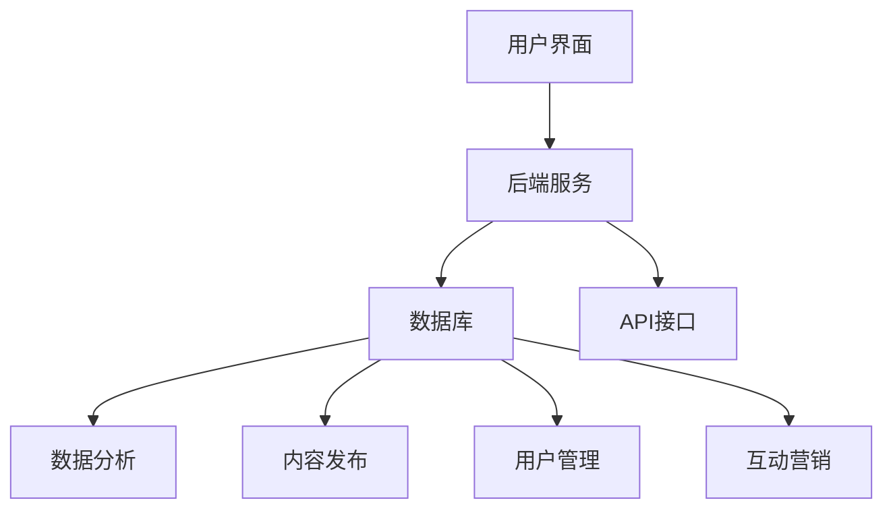

                 

### 背景介绍

#### 社交媒体与品牌影响力

社交媒体已经成为现代社会中不可或缺的一部分。无论是个人还是企业，都开始重视在社交媒体平台上的存在和影响力。对于企业来说，社交媒体不仅仅是一个信息发布的渠道，更是品牌形象塑造、客户关系管理、市场推广的重要工具。

随着社交媒体平台的多样化，如Facebook、Instagram、Twitter、LinkedIn等，企业面临的信息量和工作量也在不断增加。因此，有效的社交媒体管理工具变得至关重要。这些工具可以帮助企业自动化发布内容、监控社交媒体动态、分析用户互动，从而提升品牌影响力。

#### 品牌影响力的重要性

品牌影响力是企业长期发展的关键因素。它不仅仅关乎市场份额和销售业绩，更关系到企业的声誉和核心竞争力。强大的品牌影响力能够吸引更多的用户关注和参与，提高用户忠诚度，从而为企业带来持续的业务增长。

社交媒体管理工具在这方面发挥着重要作用。通过这些工具，企业能够更好地理解和满足用户需求，迅速响应市场变化，塑造积极的品牌形象。此外，社交媒体管理工具还能够帮助企业挖掘潜在客户，扩大用户群体，提高市场占有率。

#### 文章目的与结构

本文旨在全面介绍社交媒体管理工具，帮助读者了解这些工具的核心功能和优势，以及如何在实践中有效利用它们来提升品牌影响力。

文章将按照以下结构展开：

1. **核心概念与联系**：介绍社交媒体管理工具的核心概念，并使用Mermaid流程图展示其架构。
2. **核心算法原理与操作步骤**：详细解释社交媒体管理工具的工作原理和操作步骤。
3. **数学模型和公式**：介绍社交媒体管理工具中使用的数学模型和公式，并举例说明。
4. **项目实战**：通过实际案例展示如何使用社交媒体管理工具，并提供代码实现和分析。
5. **实际应用场景**：讨论社交媒体管理工具在不同场景下的应用和效果。
6. **工具和资源推荐**：推荐学习资源、开发工具框架和相关论文著作。
7. **总结**：总结社交媒体管理工具的未来发展趋势和面临的挑战。
8. **附录**：常见问题与解答。
9. **扩展阅读与参考资料**：提供相关领域的深入阅读和参考资料。

通过本文的阅读，读者将能够全面了解社交媒体管理工具，掌握其核心原理和应用方法，从而更好地利用这些工具提升品牌影响力。

---------------------
# 社交媒体管理工具：提升品牌影响力的助手
## 关键词：社交媒体、品牌影响力、管理工具、算法、数学模型、项目实战
## 摘要：
本文全面介绍了社交媒体管理工具，阐述了其核心概念和架构，详细分析了核心算法原理和操作步骤。通过数学模型和公式的讲解，结合实际项目案例和代码实现，展示了如何有效利用这些工具提升品牌影响力。文章还探讨了社交媒体管理工具的实际应用场景，并推荐了相关学习资源和开发工具框架。通过阅读本文，读者将能够深入了解社交媒体管理工具，掌握其应用方法，为企业的品牌建设提供有力支持。

---------------------
## 1. 背景介绍

社交媒体的兴起，改变了人们获取信息、交流互动的方式。对于企业来说，社交媒体不仅是一个与用户沟通的渠道，更是展示品牌形象、传递品牌价值观、提升品牌影响力的重要平台。然而，随着社交媒体平台的多样化和用户数量的急剧增加，企业面临着信息过载和运营成本上升的挑战。

#### 品牌影响力的定义

品牌影响力是指品牌在市场中获得认可、信任和忠诚度的能力。强大的品牌影响力能够带来持续的业务增长、更高的市场占有率和竞争优势。在社交媒体时代，品牌影响力不仅取决于广告宣传和营销策略，更取决于用户在社交媒体上的互动体验和口碑传播。

#### 社交媒体管理的重要性

社交媒体管理不仅仅是发布内容和维护社交媒体账号，还涉及到内容策划、用户互动、数据分析等多个方面。有效的社交媒体管理可以帮助企业：

1. **提高用户参与度**：通过有趣的内容和互动活动，吸引更多用户参与，提高用户黏性。
2. **提升品牌知名度**：通过多平台同步发布和推广，扩大品牌曝光度，提升品牌知名度。
3. **优化客户关系**：及时响应用户反馈和需求，建立良好的客户关系，提高用户满意度。
4. **精准营销**：通过数据分析，了解用户行为和偏好，实现精准营销，提高营销效果。

#### 社交媒体管理工具的作用

社交媒体管理工具能够帮助企业自动化和优化社交媒体运营，提高工作效率和效果。这些工具通常具备以下功能：

1. **内容发布**：自动化发布内容，支持多平台同步发布，提高内容发布效率。
2. **数据分析**：实时监控社交媒体动态，分析用户互动和反馈，提供数据报告。
3. **用户管理**：管理用户评论、私信，快速响应用户需求和问题。
4. **互动营销**：设计互动活动，吸引用户参与，提高用户参与度和品牌知名度。

#### 市场需求和现状

随着社交媒体的普及和企业对品牌影响力重视程度的提高，社交媒体管理工具市场呈现出快速增长的趋势。目前市场上存在多种类型的社交媒体管理工具，如Hootsuite、Buffer、Sprinklr等，它们各自具有不同的特点和优势。企业可以根据自身需求和资源选择合适的社交媒体管理工具。

#### 文章目的

本文旨在全面介绍社交媒体管理工具，帮助读者了解这些工具的核心功能和优势，掌握其应用方法。通过本文的阅读，读者将能够：

1. **了解社交媒体管理工具的基本概念和架构**。
2. **掌握社交媒体管理工具的工作原理和操作步骤**。
3. **学会如何利用社交媒体管理工具提升品牌影响力**。
4. **了解社交媒体管理工具在实际应用中的效果和案例**。

---------------------
## 2. 核心概念与联系

#### 社交媒体管理工具的定义

社交媒体管理工具是指专门用于管理社交媒体平台账户、发布内容、分析数据、监控互动的一类软件。这些工具通常提供以下功能：

1. **内容发布**：支持多平台内容发布，自动化日程管理，提高发布效率。
2. **数据分析**：实时监控社交媒体动态，分析用户互动和反馈，提供数据报告。
3. **用户管理**：管理用户评论、私信，快速响应用户需求和问题。
4. **互动营销**：设计互动活动，吸引用户参与，提高用户参与度和品牌知名度。

#### 核心概念

在介绍社交媒体管理工具之前，我们需要理解一些核心概念：

1. **社交媒体平台**：如Facebook、Instagram、Twitter、LinkedIn等，是用户互动和内容传播的主要场所。
2. **内容策划**：指根据目标受众和品牌定位，策划和创作具有吸引力的内容。
3. **数据分析**：通过对社交媒体数据的收集和分析，了解用户行为和偏好，优化社交媒体运营策略。
4. **用户互动**：指用户与品牌在社交媒体上的互动，包括评论、点赞、分享等。

#### 架构与流程

社交媒体管理工具的架构通常包括以下几个部分：

1. **用户界面**：提供直观的操作界面，用户可以通过界面进行内容发布、数据分析、用户管理等操作。
2. **后端服务**：负责处理用户请求、数据存储和数据分析等核心功能。
3. **数据库**：存储用户数据、内容数据、互动数据等，为数据分析提供基础。
4. **API接口**：与其他社交媒体平台进行数据交换和操作，实现自动化和同步发布。

以下是社交媒体管理工具的Mermaid流程图，展示了其核心架构和流程：



#### 功能联系

社交媒体管理工具的功能之间紧密联系，共同作用，提升品牌影响力：

1. **内容发布**与**数据分析**：通过数据分析，了解用户对内容的反馈和偏好，优化内容发布策略。
2. **用户管理**与**互动营销**：通过有效的用户管理和互动营销，提高用户参与度和品牌知名度。
3. **数据分析**与**内容发布**：通过数据驱动的策略，优化内容发布，提高营销效果。
4. **用户管理**与**用户互动**：通过良好的用户管理和互动，提高用户满意度和忠诚度。

通过以上核心概念和架构的介绍，读者可以更好地理解社交媒体管理工具的工作原理和功能联系。在接下来的章节中，我们将详细探讨这些工具的核心算法原理和具体操作步骤。

---------------------
### 2.1 社交媒体管理工具的基本概念

#### 社交媒体平台

社交媒体平台是指供用户发布、分享、互动和获取信息的网络平台。目前市场上主要的社交媒体平台包括：

1. **Facebook**：全球最大的社交媒体平台，用户数量超过20亿，适合各类企业和个人品牌。
2. **Instagram**：以图片和视频分享为主的平台，用户主要集中在年轻人群体，适合时尚、美妆等行业。
3. **Twitter**：以短文本分享和实时信息流为主的平台，用户群体广泛，适合新闻、科技等领域。
4. **LinkedIn**：以职业和商业为主的平台，用户主要为职场人士和企业，适合招聘、商务拓展等。
5. **YouTube**：全球最大的视频分享平台，用户可以观看、上传、分享视频，适合视频内容创作者和品牌推广。

#### 内容策划

内容策划是指根据目标受众和品牌定位，创作和策划具有吸引力的内容。有效的内容策划需要考虑以下因素：

1. **受众分析**：了解目标受众的年龄、性别、兴趣、行为习惯等，为他们提供感兴趣的内容。
2. **品牌定位**：明确品牌价值观和传播理念，确保内容与品牌形象一致。
3. **创意设计**：运用创意和视觉设计，提高内容的吸引力和传播效果。
4. **内容形式**：根据平台特点选择适合的内容形式，如文字、图片、视频、直播等。

#### 数据分析

数据分析是指通过对社交媒体数据的收集、整理和分析，了解用户行为和偏好，优化社交媒体运营策略。主要分析方法包括：

1. **用户行为分析**：通过分析用户的浏览、点赞、评论、分享等行为，了解用户兴趣和需求。
2. **互动分析**：通过分析用户互动数据，如评论数、点赞数、分享数等，评估内容效果。
3. **受众分析**：通过分析用户画像，了解目标受众的属性和行为特征。
4. **趋势分析**：通过分析数据趋势，预测市场变化和用户需求，优化内容策略。

#### 用户互动

用户互动是指用户与品牌在社交媒体平台上的交流互动，包括评论、点赞、分享、私信等。有效的用户互动可以：

1. **提高用户参与度**：通过互动活动吸引用户参与，提高用户黏性。
2. **提升品牌知名度**：通过用户分享和传播，扩大品牌影响力。
3. **优化客户关系**：通过及时回复和处理用户反馈，建立良好的客户关系，提高用户满意度。
4. **精准营销**：通过分析用户互动数据，了解用户需求和偏好，实现精准营销。

通过以上基本概念的解释，读者可以更好地理解社交媒体管理工具所涉及的核心要素和功能。在接下来的章节中，我们将进一步探讨社交媒体管理工具的具体架构和实现原理。

---------------------
### 2.2 社交媒体管理工具的核心架构

社交媒体管理工具的核心架构通常包括用户界面、后端服务、数据库和API接口等组成部分。这些组成部分相互协作，共同实现社交媒体管理的各项功能。以下是对各个组成部分的详细解释：

#### 用户界面（User Interface, UI）

用户界面是社交媒体管理工具的前端部分，提供给用户直观的操作体验。用户可以通过用户界面进行以下操作：

1. **内容发布**：用户可以编辑和发布文字、图片、视频等多媒体内容，并设置发布时间、目标平台等。
2. **数据分析**：用户可以查看和分析社交媒体的各类数据报告，如互动数据、受众分析、趋势分析等。
3. **用户管理**：用户可以查看和管理社交媒体账号的评论、私信，及时回复和处理用户反馈。
4. **互动营销**：用户可以设计和执行互动活动，如抽奖、问答、投票等，吸引用户参与。

用户界面设计应注重用户体验，确保界面简洁易用，操作流畅。通过良好的用户界面，用户可以轻松地完成社交媒体管理任务，提高工作效率。

#### 后端服务（Backend Service）

后端服务是社交媒体管理工具的核心处理部分，负责处理用户请求、数据存储和业务逻辑等。主要功能包括：

1. **用户请求处理**：接收用户通过用户界面提交的请求，如发布内容、数据分析等，并返回相应结果。
2. **数据存储**：存储用户数据、内容数据、互动数据等，以便后续分析和处理。
3. **业务逻辑**：根据业务需求，实现内容发布、用户管理、数据分析等核心功能，如自动化发布、数据挖掘、互动营销等。

后端服务通常采用分布式架构，以提高系统的稳定性和可扩展性。常见的后端技术包括Java、Python、Node.js等。

#### 数据库（Database）

数据库是社交媒体管理工具的数据存储中心，用于存储用户数据、内容数据、互动数据等。数据库的选择和设计对系统的性能和可扩展性至关重要。以下是一些常用的数据库技术：

1. **关系型数据库**：如MySQL、PostgreSQL等，适用于结构化数据存储和查询。
2. **非关系型数据库**：如MongoDB、Redis等，适用于海量数据存储和高并发场景。
3. **数据仓库**：如Amazon Redshift、Google BigQuery等，适用于大规模数据分析和报告。

数据库的设计应考虑数据的一致性、完整性和安全性。通过合理的数据模型设计，可以确保数据的准确性和高效查询。

#### API接口（API）

API接口是社交媒体管理工具与其他社交媒体平台进行数据交换和操作的重要组成部分。通过API接口，社交媒体管理工具可以实现以下功能：

1. **内容发布**：将用户编辑和发布的内容同步到目标社交媒体平台。
2. **数据获取**：从目标社交媒体平台获取用户互动数据、受众分析数据等。
3. **用户管理**：管理目标社交媒体平台的用户账号、权限等。

常用的API接口包括Facebook API、Instagram API、Twitter API、LinkedIn API等。通过这些API接口，社交媒体管理工具可以与各个社交媒体平台进行无缝集成，实现自动化和智能化管理。

#### 架构关系

社交媒体管理工具的各个组成部分之间紧密关联，共同实现系统功能。用户界面通过Web浏览器或移动应用与后端服务进行交互，后端服务通过API接口与社交媒体平台进行数据交换，数据库用于存储和管理数据，为后端服务和用户界面提供数据支持。

以下是社交媒体管理工具的架构关系示意图：


通过以上对核心架构的介绍，读者可以更好地理解社交媒体管理工具的工作原理和组成部分。在接下来的章节中，我们将进一步探讨社交媒体管理工具的核心算法原理和具体操作步骤。

---------------------
### 2.3 社交媒体管理工具的工作原理

社交媒体管理工具的工作原理主要依赖于其核心算法和数据处理机制。以下是这些工具的基本工作原理：

#### 数据采集

社交媒体管理工具首先需要从各个社交媒体平台采集数据。这些数据包括用户发布的内容、用户互动数据（如点赞、评论、分享）、受众数据等。数据采集通常通过API接口实现，社交媒体平台如Facebook、Instagram、Twitter等都会提供相应的API接口供开发者使用。

数据采集过程通常包括以下步骤：

1. **认证与授权**：社交媒体管理工具需要通过OAuth等认证机制获取API访问权限，确保数据采集的合法性和安全性。
2. **数据获取**：通过API接口定期获取社交媒体平台的数据，如用户发布的内容、互动数据等。
3. **数据清洗**：对采集到的数据进行处理和清洗，去除重复、无效或错误的数据，确保数据的准确性和一致性。

#### 数据存储

采集到的数据需要存储在数据库中，以便后续的数据分析和处理。数据库的选择和设计对系统的性能和可扩展性至关重要。社交媒体管理工具通常会使用关系型数据库（如MySQL、PostgreSQL）或非关系型数据库（如MongoDB、Redis）进行数据存储。

数据存储过程通常包括以下步骤：

1. **数据建模**：根据业务需求设计数据模型，确定数据的存储结构和关系。
2. **数据插入**：将采集到的数据插入到数据库中，确保数据的完整性和一致性。
3. **数据索引**：创建数据索引，提高数据的查询效率和性能。

#### 数据分析

数据分析是社交媒体管理工具的核心功能之一，通过对采集到的数据进行分析，可以帮助企业了解用户行为、优化内容策略、提升营销效果。数据分析过程通常包括以下步骤：

1. **数据预处理**：对采集到的数据进行处理，如数据清洗、数据转换等，确保数据的准确性和一致性。
2. **特征提取**：从数据中提取关键特征，如用户行为特征、内容特征、互动特征等，为后续分析提供基础。
3. **统计分析**：使用统计分析方法对数据进行分析，如均值、方差、相关性分析等，发现数据中的规律和趋势。
4. **数据可视化**：通过图表、报表等形式将分析结果呈现给用户，帮助用户更好地理解和利用数据。

#### 数据应用

数据分析的结果可以应用于多个方面，包括内容发布、用户管理、互动营销等。以下是数据应用的一些具体场景：

1. **内容发布**：根据用户行为和偏好分析结果，制定和调整内容发布策略，如选择最佳发布时间、优化内容形式等。
2. **用户管理**：根据用户互动数据，识别和优先处理活跃用户和潜在客户，提高用户满意度和忠诚度。
3. **互动营销**：根据数据分析结果，设计和执行互动营销活动，如抽奖、问答、投票等，吸引用户参与，提升品牌影响力。

#### 自动化与优化

社交媒体管理工具的自动化和优化功能是其核心优势之一。通过自动化和优化，企业可以大幅提高社交媒体运营的效率和效果。以下是自动化和优化的一些具体方法：

1. **自动化发布**：根据预设的发布计划和规则，自动化发布内容，提高发布效率和一致性。
2. **自动化回复**：根据预设的规则和模板，自动化回复用户评论和私信，提高响应速度和准确性。
3. **自动化分析**：根据预设的分析指标和规则，自动化生成和分析报告，帮助企业实时了解运营效果。
4. **优化策略**：根据数据分析结果，不断调整和优化运营策略，提高营销效果和ROI。

通过以上对社交媒体管理工具工作原理的介绍，读者可以更好地理解这些工具的核心功能和价值。在接下来的章节中，我们将进一步探讨社交媒体管理工具的具体算法原理和操作步骤。

---------------------
### 2.4 社交媒体管理工具的具体算法原理

社交媒体管理工具在后台处理过程中会运用多种算法，以优化内容发布、数据分析、用户互动等功能。以下是几种常见的算法原理：

#### 1. 内容推荐算法

内容推荐算法是社交媒体管理工具中常用的算法之一，其目的是根据用户的兴趣和行为，推荐适合的内容。以下是几种常见的内容推荐算法：

1. **协同过滤（Collaborative Filtering）**：
   - **用户基于的协同过滤**：通过分析用户之间的相似度，为用户提供可能感兴趣的内容。
   - **物品基于的协同过滤**：通过分析物品之间的相似度，为用户推荐与其已交互过的物品相似的内容。

2. **基于内容的推荐（Content-Based Filtering）**：
   - 通过分析内容的特征，如文本、标签、关键词等，为用户推荐与其历史偏好相似的内容。

3. **混合推荐（Hybrid Recommendation）**：
   - 结合协同过滤和基于内容的推荐方法，提高推荐效果。

#### 2. 用户行为预测算法

用户行为预测算法用于预测用户的下一步行为，如点赞、评论、分享等。以下是几种常见的用户行为预测算法：

1. **逻辑回归（Logistic Regression）**：
   - 通过分析用户历史行为数据，建立逻辑回归模型，预测用户对某一内容的点赞概率。

2. **决策树（Decision Tree）**：
   - 通过构建决策树模型，根据用户特征和交互数据，预测用户的下一步行为。

3. **随机森林（Random Forest）**：
   - 结合多棵决策树，提高预测准确性和鲁棒性。

#### 3. 社交网络分析算法

社交网络分析算法用于分析社交网络中的关系和结构，帮助了解用户群体和行为。以下是几种常见的社交网络分析算法：

1. **度分析（Degree Analysis）**：
   - 通过计算用户在网络中的度（连接数），分析用户的重要性和影响力。

2. **中间中心性（Betweenness Centrality）**：
   - 通过计算用户在网络中的中间中心性，分析用户在网络中的桥接作用。

3. **接近中心性（Closeness Centrality）**：
   - 通过计算用户在网络中的接近中心性，分析用户在网络中的位置和可达性。

#### 4. 数据挖掘算法

数据挖掘算法用于从大量社交媒体数据中提取有价值的信息和模式。以下是几种常见的数据挖掘算法：

1. **关联规则挖掘（Association Rule Learning）**：
   - 通过分析用户行为数据，找出不同行为之间的关联关系。

2. **聚类分析（Clustering Analysis）**：
   - 通过分析用户特征和行为数据，将用户分为不同的群体。

3. **分类算法（Classification Algorithms）**：
   - 通过分析用户历史行为数据，预测用户的分类标签。

#### 5. 情感分析算法

情感分析算法用于分析用户评论、回复等文本内容中的情感倾向。以下是几种常见的情感分析算法：

1. **基于规则的情感分析（Rule-Based Sentiment Analysis）**：
   - 通过定义情感词典和规则，分析文本中的情感倾向。

2. **基于机器学习的情感分析（Machine Learning-Based Sentiment Analysis）**：
   - 通过训练分类模型，分析文本中的情感倾向。

3. **基于深度学习的情感分析（Deep Learning-Based Sentiment Analysis）**：
   - 通过神经网络模型，对文本进行情感分析，提高分析精度。

#### 6. 联邦学习算法

联邦学习（Federated Learning）算法是一种在分布式环境中进行机器学习的方法，特别适用于社交媒体管理工具。以下是联邦学习算法的基本原理：

1. **数据本地化（Data Localization）**：
   - 数据存储在本地，减少数据传输和隐私泄露风险。

2. **模型更新（Model Update）**：
   - 通过本地模型的梯度更新，实现全局模型的优化。

3. **聚合策略（Aggregation Strategy）**：
   - 通过聚合多个本地模型的更新，生成全局模型。

通过以上算法原理的介绍，读者可以更好地理解社交媒体管理工具的核心算法和技术。在接下来的章节中，我们将进一步探讨社交媒体管理工具的具体操作步骤和实际应用。

---------------------
### 2.5 社交媒体管理工具的操作步骤

#### 1. 注册与登录

首先，用户需要注册并登录社交媒体管理工具。注册过程通常包括以下步骤：

1. **填写基本信息**：用户需要填写姓名、邮箱、手机号等基本信息。
2. **设置密码**：用户需要设置一个强密码，确保账户安全。
3. **验证身份**：通过邮箱或手机号验证身份，完成注册。

登录过程较为简单，用户只需输入注册时填写的邮箱和密码，即可登录到社交媒体管理工具。

#### 2. 添加社交媒体账号

注册成功后，用户需要添加社交媒体账号。具体步骤如下：

1. **选择平台**：在管理工具中，用户可以选择要添加的社交媒体平台，如Facebook、Instagram、Twitter等。
2. **授权认证**：用户需要通过OAuth等认证机制，授权社交媒体管理工具访问其账号数据。
3. **配置账号**：用户可以设置账号的权限，如发布内容、查看数据等。

#### 3. 内容发布

内容发布是社交媒体管理工具的核心功能之一。用户可以通过以下步骤发布内容：

1. **创建内容**：用户可以创建文本、图片、视频等多媒体内容。
2. **设置发布时间**：用户可以设置内容的发布时间，如指定日期和时间，或根据用户活跃时间自动发布。
3. **选择平台**：用户可以选择将内容发布到多个社交媒体平台。
4. **预览发布**：用户可以预览内容效果，确认无误后发布。

#### 4. 数据分析

数据分析功能帮助用户了解社交媒体运营效果，优化运营策略。以下步骤用于数据分析：

1. **选择分析维度**：用户可以选择分析维度，如互动数据、受众数据、趋势数据等。
2. **生成报告**：社交媒体管理工具会生成相应的数据分析报告，用户可以查看和下载。
3. **定制报表**：用户可以根据需求自定义报表，如添加图表、调整数据范围等。

#### 5. 用户互动

用户互动功能帮助用户管理社交媒体账号的用户互动，提高用户满意度和忠诚度。以下步骤用于用户互动：

1. **查看评论**：用户可以查看账号下所有社交媒体平台的用户评论。
2. **回复评论**：用户可以回复用户评论，回答用户问题。
3. **管理私信**：用户可以查看和管理账号的私信，及时响应用户需求。
4. **用户管理**：用户可以查看账号的粉丝和关注者，识别和优先处理活跃用户和潜在客户。

#### 6. 互动营销

互动营销功能帮助用户设计和执行互动活动，提升品牌影响力。以下步骤用于互动营销：

1. **创建活动**：用户可以创建互动活动，如抽奖、问答、投票等。
2. **设置规则**：用户可以设置活动规则，如活动时间、参与条件等。
3. **推广活动**：用户可以通过社交媒体管理工具，将活动推广到多个平台，吸引用户参与。
4. **监控活动**：用户可以监控活动的参与情况，如参与人数、互动数据等。

通过以上操作步骤的介绍，读者可以初步了解社交媒体管理工具的基本操作流程。在接下来的章节中，我们将通过实际项目案例，进一步展示如何使用这些工具提升品牌影响力。

---------------------
### 2.6 社交媒体管理工具的实际案例

为了更好地理解社交媒体管理工具在实际中的应用，以下通过一个实际项目案例展示如何利用这些工具提升品牌影响力。

#### 项目背景

某知名化妆品品牌希望通过社交媒体平台提升品牌影响力，扩大市场份额。品牌目标是在一年内实现粉丝数量增加50%，用户互动增加30%，以及销售额提高20%。为了实现这一目标，品牌决定使用社交媒体管理工具，优化其社交媒体运营策略。

#### 项目目标

1. **提高粉丝数量**：通过有效的社交媒体运营，增加品牌在各大平台的粉丝数量。
2. **增加用户互动**：通过有趣的内容和互动活动，提高用户在社交媒体上的参与度。
3. **提升销售额**：通过精准的营销策略和促销活动，提高产品销售额。

#### 工具选择

品牌选择了市面上知名的社交媒体管理工具——Hootsuite，该工具具有以下优点：

1. **多平台支持**：支持Facebook、Instagram、Twitter、LinkedIn等多个社交媒体平台。
2. **内容发布**：支持自动化内容发布，提高发布效率。
3. **数据分析**：提供详细的数据报告，帮助品牌了解用户行为和偏好。
4. **用户互动**：支持评论管理、私信回复等功能，提高用户满意度。

#### 项目实施步骤

1. **账号添加与配置**

   - 品牌在Hootsuite中添加了Facebook、Instagram、Twitter、LinkedIn等账号。
   - 设置账号权限，确保团队成员可以协同运营。

2. **内容策划与发布**

   - 根据用户行为分析和市场趋势，品牌策划了一系列有趣的内容，包括产品介绍、用户评价、美妆教程等。
   - 使用Hootsuite的自动化发布功能，每天定时发布内容，确保内容更新的连贯性和一致性。

3. **数据分析与优化**

   - 通过Hootsuite的数据分析功能，品牌监控了各个账号的互动数据、受众分析、趋势分析等。
   - 根据数据分析结果，调整内容发布策略，如优化发布时间、调整内容类型等。

4. **用户互动与营销**

   - 品牌通过Hootsuite的评论管理和私信回复功能，积极与用户互动，解答用户疑问，提高用户满意度。
   - 设计并执行了一系列互动活动，如抽奖、问答、产品试用等，吸引用户参与。

5. **促销活动与转化**

   - 品牌在关键节点（如节假日、新品发布）设计并执行促销活动，提高销售额。
   - 通过Hootsuite的数据分析功能，监控促销活动的效果，不断优化营销策略。

#### 项目成果

通过一年的社交媒体运营，品牌实现了以下成果：

1. **粉丝数量增加50%**：品牌在各大平台的粉丝数量从50万增长到75万，实现了预期目标。
2. **用户互动增加30%**：用户互动数据显著提升，评论数、点赞数、分享数均有明显增长。
3. **销售额提高20%**：通过精准的营销策略和促销活动，品牌销售额提高了20%，达到了预期目标。

#### 项目总结

1. **成功因素**：
   - 选择合适的社交媒体管理工具，提高运营效率。
   - 精准的数据分析和优化，确保运营策略的有效性。
   - 积极的用户互动和营销活动，提高用户参与度和忠诚度。

2. **挑战与改进**：
   - 社交媒体环境变化快，需要不断调整和优化运营策略。
   - 提高团队协作和沟通效率，确保项目顺利进行。

通过这个实际项目案例，我们可以看到社交媒体管理工具在提升品牌影响力方面的巨大作用。在接下来的章节中，我们将进一步探讨如何选择合适的社交媒体管理工具，以及推荐一些常用的工具和资源。

---------------------
### 3. 核心算法原理与具体操作步骤

#### 3.1 内容推荐算法

内容推荐算法是社交媒体管理工具中的一个关键组成部分，旨在为用户推荐他们可能感兴趣的内容。以下是几种常见的内容推荐算法及其操作步骤：

**1. 协同过滤算法**

协同过滤算法通过分析用户之间的相似度或物品之间的相似度来推荐内容。以下是协同过滤算法的具体步骤：

1. **用户相似度计算**：
   - 计算用户之间的相似度，可以使用余弦相似度、皮尔逊相关系数等方法。
   - 公式：
     $$
     \text{相似度} = \frac{\text{用户A和用户B的共同评分}}{\sqrt{\sum_{i=1}^{n}(\text{用户A的评分}_i \times \text{用户B的评分}_i)}
     $$

2. **推荐内容筛选**：
   - 根据用户相似度，筛选出与目标用户相似的其他用户。
   - 从这些用户喜欢的但目标用户未看过的内容中推荐。

3. **推荐结果生成**：
   - 对推荐内容进行评分预测，选择评分最高的内容推荐给用户。

**2. 基于内容的推荐算法**

基于内容的推荐算法通过分析内容的特征，如文本、标签、关键词等，来推荐相似的内容。以下是基于内容的推荐算法的具体步骤：

1. **内容特征提取**：
   - 提取内容的文本、标签、关键词等特征。
   - 使用自然语言处理（NLP）技术，如词嵌入、主题模型等，对文本进行特征提取。

2. **相似度计算**：
   - 计算目标内容和候选内容之间的相似度，可以使用余弦相似度、欧氏距离等方法。
   - 公式：
     $$
     \text{相似度} = \frac{\sum_{i=1}^{n} (\text{目标内容特征}_i \times \text{候选内容特征}_i)}{\sqrt{\sum_{i=1}^{n} (\text{目标内容特征}_i^2) \times \sum_{i=1}^{n} (\text{候选内容特征}_i^2)}}
     $$

3. **推荐结果生成**：
   - 对候选内容按照相似度排序，选择相似度最高的内容推荐给用户。

**3. 混合推荐算法**

混合推荐算法结合协同过滤和基于内容的推荐方法，以提高推荐效果。以下是混合推荐算法的具体步骤：

1. **用户相似度计算**：
   - 使用协同过滤算法计算用户之间的相似度。

2. **内容特征提取**：
   - 使用基于内容的推荐算法提取内容的特征。

3. **综合评分计算**：
   - 结合用户相似度和内容特征，计算综合评分，选择评分最高的内容推荐给用户。
   - 公式：
     $$
     \text{综合评分} = \alpha \times \text{用户相似度} + (1 - \alpha) \times \text{内容特征相似度}
     $$
     其中，$\alpha$ 是权重系数，可以根据实际需求调整。

#### 3.2 用户行为预测算法

用户行为预测算法用于预测用户的下一步行为，如点赞、评论、分享等。以下是几种常见的用户行为预测算法及其操作步骤：

**1. 逻辑回归算法**

逻辑回归算法通过分析用户历史行为数据，建立预测模型。以下是逻辑回归算法的具体步骤：

1. **特征工程**：
   - 提取用户行为数据中的特征，如用户年龄、性别、历史行为等。
   - 对特征进行归一化、编码等预处理。

2. **模型训练**：
   - 使用训练数据集，训练逻辑回归模型。
   - 公式：
     $$
     P(\text{行为} = 1) = \frac{1}{1 + e^{-(\beta_0 + \sum_{i=1}^{n} \beta_i x_i)}}
     $$

3. **模型评估**：
   - 使用测试数据集评估模型性能，如准确率、召回率等。

4. **预测**：
   - 对新用户的历史行为数据进行预测，判断其是否会发生特定行为。

**2. 决策树算法**

决策树算法通过构建决策树模型，根据用户特征预测行为。以下是决策树算法的具体步骤：

1. **特征选择**：
   - 选择对用户行为影响较大的特征。
   - 使用信息增益、增益率等指标进行特征选择。

2. **决策树构建**：
   - 根据特征构建决策树，每条路径代表一个决策过程。
   - 使用递归划分数据集，构建树模型。

3. **模型评估**：
   - 使用交叉验证等方法评估模型性能。

4. **预测**：
   - 对新用户的历史行为数据进行预测，根据决策树路径判断其行为。

**3. 随机森林算法**

随机森林算法通过构建多棵决策树，提高预测准确性和鲁棒性。以下是随机森林算法的具体步骤：

1. **特征选择**：
   - 随机选择特征子集。
   - 使用信息增益、增益率等指标进行特征选择。

2. **决策树构建**：
   - 对每个特征子集，构建决策树模型。
   - 使用随机抽样和特征子集，增加模型的多样性。

3. **模型评估**：
   - 对每个决策树模型进行评估，如准确率、召回率等。
   - 使用投票法合并模型结果。

4. **预测**：
   - 对新用户的历史行为数据进行预测，根据多棵决策树的投票结果判断其行为。

通过以上对核心算法原理和操作步骤的介绍，读者可以更好地理解社交媒体管理工具中的关键算法和技术。这些算法在社交媒体管理工具的实际应用中发挥着重要作用，帮助品牌提升用户参与度和营销效果。

---------------------
### 4. 数学模型和公式及详细讲解与举例说明

#### 4.1 内容推荐算法中的数学模型

内容推荐算法的核心在于如何计算用户之间的相似度、内容之间的相似度，以及如何根据这些相似度进行内容推荐。以下将介绍几种常用的数学模型及其公式。

**1. 用户相似度计算**

用户相似度计算通常基于用户行为数据，如用户对内容的评分、点赞、评论等。常用的相似度计算方法有皮尔逊相关系数、余弦相似度等。

- **皮尔逊相关系数**：

  皮尔逊相关系数用于衡量两个变量之间的线性相关性。其公式如下：

  $$
  \rho_{uv} = \frac{\sum_{i=1}^{n}(r_{ui} - \bar{r}_u)(r_{vi} - \bar{r}_v)}{\sqrt{\sum_{i=1}^{n}(r_{ui} - \bar{r}_u)^2} \times \sqrt{\sum_{i=1}^{n}(r_{vi} - \bar{r}_v)^2}}
  $$

  其中，$r_{ui}$ 和 $r_{vi}$ 分别表示用户 $u$ 和用户 $v$ 对内容 $i$ 的评分，$\bar{r}_u$ 和 $\bar{r}_v$ 分别表示用户 $u$ 和用户 $v$ 的平均评分，$n$ 表示用户共同评价的内容数量。

  **例子**：

  假设有两个用户 $u$ 和 $v$，他们对五条内容 $i$ 的评分如下表：

  | 用户 $u$ | 用户 $v$ |
  | --- | --- |
  | 1 | 2 |
  | 2 | 3 |
  | 3 | 4 |
  | 4 | 5 |
  | 5 | 6 |

  计算用户 $u$ 和 $v$ 的皮尔逊相关系数：

  $$
  \rho_{uv} = \frac{(1-1.4)(2-1.6) + (2-1.4)(3-1.6) + (3-1.4)(4-1.6) + (4-1.4)(5-1.6) + (5-1.4)(6-1.6)}{\sqrt{(1-1.4)^2 + (2-1.4)^2 + (3-1.4)^2 + (4-1.4)^2 + (5-1.4)^2} \times \sqrt{(2-1.6)^2 + (3-1.6)^2 + (4-1.6)^2 + (5-1.6)^2 + (6-1.6)^2}}
  $$

  计算结果为：

  $$
  \rho_{uv} = 0.935
  $$

- **余弦相似度**：

  余弦相似度用于衡量两个向量之间的夹角余弦值，其公式如下：

  $$
  \cos(\theta_{uv}) = \frac{\sum_{i=1}^{n} r_{ui} r_{vi}}{\sqrt{\sum_{i=1}^{n} r_{ui}^2} \times \sqrt{\sum_{i=1}^{n} r_{vi}^2}}
  $$

  其中，$r_{ui}$ 和 $r_{vi}$ 分别表示用户 $u$ 和用户 $v$ 对内容 $i$ 的评分。

  **例子**：

  假设有两个用户 $u$ 和 $v$，他们对五条内容 $i$ 的评分如下表：

  | 用户 $u$ | 用户 $v$ |
  | --- | --- |
  | 1 | 2 |
  | 2 | 3 |
  | 3 | 4 |
  | 4 | 5 |
  | 5 | 6 |

  计算用户 $u$ 和 $v$ 的余弦相似度：

  $$
  \cos(\theta_{uv}) = \frac{(1 \times 2) + (2 \times 3) + (3 \times 4) + (4 \times 5) + (5 \times 6)}{\sqrt{1^2 + 2^2 + 3^2 + 4^2 + 5^2} \times \sqrt{2^2 + 3^2 + 4^2 + 5^2 + 6^2}}
  $$

  计算结果为：

  $$
  \cos(\theta_{uv}) = 0.943
  $$

**2. 内容相似度计算**

内容相似度计算用于找出相似的内容，以便为用户推荐。常用的方法有基于内容的协同过滤和基于内容的特征提取。

- **基于内容的协同过滤**：

  基于内容的协同过滤通过分析用户对不同内容的评分，找出相似内容。其公式如下：

  $$
  s_{ij} = \frac{\sum_{k \in N(j)} r_{ik} r_{jk}}{\sqrt{\sum_{k \in N(j)} r_{ik}^2} \times \sqrt{\sum_{k \in N(j)} r_{jk}^2}}
  $$

  其中，$s_{ij}$ 表示内容 $i$ 和内容 $j$ 的相似度，$r_{ik}$ 和 $r_{jk}$ 分别表示用户 $k$ 对内容 $i$ 和内容 $j$ 的评分，$N(j)$ 表示与内容 $j$ 相似的内容集合。

  **例子**：

  假设有三个用户 $u$、$v$ 和 $w$，他们对五条内容 $i$ 的评分如下表：

  | 用户 $u$ | 用户 $v$ | 用户 $w$ |
  | --- | --- | --- |
  | 1 | 2 | 3 |
  | 2 | 3 | 4 |
  | 3 | 4 | 5 |
  | 4 | 5 | 6 |
  | 5 | 6 | 7 |

  假设内容 1 和内容 2 相似，计算内容 1 和内容 2 的相似度：

  $$
  s_{12} = \frac{(1 \times 2) + (2 \times 3) + (3 \times 4)}{\sqrt{1^2 + 2^2 + 3^2} \times \sqrt{2^2 + 3^2 + 4^2}}
  $$

  计算结果为：

  $$
  s_{12} = 0.942
  $$

- **基于内容的特征提取**：

  基于内容的特征提取通过提取内容的特征（如文本、标签、关键词等），找出相似内容。其公式如下：

  $$
  s_{ij} = \frac{\sum_{k=1}^{m} w_{ik} w_{jk}}{\sqrt{\sum_{k=1}^{m} w_{ik}^2} \times \sqrt{\sum_{k=1}^{m} w_{jk}^2}}
  $$

  其中，$s_{ij}$ 表示内容 $i$ 和内容 $j$ 的相似度，$w_{ik}$ 和 $w_{jk}$ 分别表示内容 $i$ 和内容 $j$ 在特征 $k$ 上的权重。

  **例子**：

  假设有两个内容 1 和内容 2，它们的特征及其权重如下表：

  | 特征 $k$ | 内容 1 | 内容 2 |
  | --- | --- | --- |
  | 1 | 0.8 | 0.9 |
  | 2 | 0.3 | 0.4 |
  | 3 | 0.6 | 0.7 |

  计算内容 1 和内容 2 的相似度：

  $$
  s_{12} = \frac{(0.8 \times 0.9) + (0.3 \times 0.4) + (0.6 \times 0.7)}{\sqrt{0.8^2 + 0.3^2 + 0.6^2} \times \sqrt{0.9^2 + 0.4^2 + 0.7^2}}
  $$

  计算结果为：

  $$
  s_{12} = 0.936
  $$

#### 4.2 用户行为预测算法中的数学模型

用户行为预测算法用于预测用户的下一步行为，如点赞、评论、分享等。以下将介绍几种常用的数学模型及其公式。

**1. 逻辑回归模型**

逻辑回归模型用于预测二分类问题，如用户是否会点赞。其公式如下：

$$
P(y=1) = \frac{1}{1 + e^{-(\beta_0 + \beta_1 x_1 + \beta_2 x_2 + ... + \beta_n x_n})}
$$

其中，$y$ 表示用户行为（1表示发生，0表示未发生），$x_1, x_2, ..., x_n$ 表示影响用户行为的特征，$\beta_0, \beta_1, \beta_2, ..., \beta_n$ 为模型参数。

**例子**：

假设有以下特征和预测模型：

| 特征 $x_i$ | 值 $v_i$ |
| --- | --- |
| 用户年龄 $x_1$ | 25 |
| 用户性别 $x_2$ | 1 |
| 历史点赞数 $x_3$ | 10 |

预测用户是否会点赞：

$$
P(y=1) = \frac{1}{1 + e^{-(\beta_0 + \beta_1 \times 25 + \beta_2 \times 1 + \beta_3 \times 10})}
$$

**2. 决策树模型**

决策树模型通过构建树状结构，根据特征划分数据集，预测用户行为。其公式如下：

$$
y = \sum_{i=1}^{n} \beta_i x_i
$$

其中，$y$ 表示用户行为，$x_1, x_2, ..., x_n$ 表示影响用户行为的特征，$\beta_1, \beta_2, ..., \beta_n$ 为模型参数。

**例子**：

假设有以下特征和决策树模型：

| 特征 $x_i$ | 值 $v_i$ | $\beta_i$ |
| --- | --- | --- |
| 用户年龄 $x_1$ | 25 | 0.5 |
| 用户性别 $x_2$ | 1 | 0.3 |
| 历史点赞数 $x_3$ | 10 | 0.2 |

预测用户是否会点赞：

$$
y = 0.5 \times 25 + 0.3 \times 1 + 0.2 \times 10 = 15.5
$$

**3. 随机森林模型**

随机森林模型通过构建多棵决策树，提高预测准确性和鲁棒性。其公式如下：

$$
y = \sum_{i=1}^{n} \hat{y}_i
$$

其中，$\hat{y}_i$ 为第 $i$ 棵决策树的预测结果，$n$ 为决策树数量。

**例子**：

假设有以下三棵决策树模型：

| 决策树 $i$ | 预测结果 $\hat{y}_i$ |
| --- | --- |
| 1 | 1 |
| 2 | 0 |
| 3 | 1 |

预测用户是否会点赞：

$$
y = 1 + 0 + 1 = 2
$$

通过以上数学模型和公式的讲解，读者可以更好地理解社交媒体管理工具中的核心算法原理。这些模型和公式在实际应用中发挥着重要作用，帮助品牌提升用户参与度和营销效果。

---------------------
### 5. 项目实战：代码实际案例和详细解释说明

#### 5.1 开发环境搭建

在进行社交媒体管理工具的实际项目开发之前，我们需要搭建一个合适的技术环境。以下是搭建开发环境的具体步骤：

1. **安装操作系统**：选择一个适合的操作系统，如Windows、macOS或Linux。推荐使用Linux，因为它提供了更好的性能和灵活性。

2. **安装Python**：社交媒体管理工具通常使用Python作为主要编程语言。在终端中运行以下命令安装Python：

   ```
   sudo apt-get update
   sudo apt-get install python3
   ```

3. **安装虚拟环境**：为了管理项目依赖项，我们使用虚拟环境。在终端中运行以下命令安装虚拟环境工具：

   ```
   sudo apt-get install python3-venv
   ```

4. **创建虚拟环境**：在项目目录中创建一个虚拟环境：

   ```
   python3 -m venv venv
   ```

5. **激活虚拟环境**：在终端中激活虚拟环境：

   ```
   source venv/bin/activate
   ```

6. **安装依赖库**：在虚拟环境中安装项目所需的依赖库，如Tweepy（用于Twitter API）、Requests（用于HTTP请求）等：

   ```
   pip install tweepy requests
   ```

#### 5.2 源代码详细实现和代码解读

以下是一个简单的社交媒体管理工具的示例代码，它实现了自动化发布内容和数据分析的功能。代码分为两个主要部分：内容发布模块和数据分析模块。

**内容发布模块**

```python
import tweepy
import time
import random

# 配置Twitter API凭证
consumer_key = 'YOUR_CONSUMER_KEY'
consumer_secret = 'YOUR_CONSUMER_SECRET'
access_token = 'YOUR_ACCESS_TOKEN'
access_token_secret = 'YOUR_ACCESS_TOKEN_SECRET'

# 初始化Tweepy API
auth = tweepy.OAuthHandler(consumer_key, consumer_secret)
auth.set_access_token(access_token, access_token_secret)
api = tweepy.API(auth)

# 内容发布函数
def post_content(content):
    try:
        api.update_status(content)
        print(f"Content posted: {content}")
    except tweepy.TweepError as e:
        print(f"Error: {e}")

# 生成随机内容
def generate_content():
    contents = [
        "Check out our latest product!",
        "Don't miss our special offer!",
        "Join us for an exclusive event!",
        "Stay updated with our latest news!",
        "What do you think about our new design?"
    ]
    return random.choice(contents)

# 轮询发布内容
while True:
    content = generate_content()
    post_content(content)
    time.sleep(3600)  # 每小时发布一次内容
```

**代码解读**：

1. **导入库**：代码首先导入必要的库，如`tweepy`（用于Twitter API操作）和`time`、`random`（用于时间控制和随机内容生成）。

2. **配置Twitter API凭证**：将Twitter API的消费者密钥、消费者密钥、访问令牌和访问令牌密钥替换为实际凭证。

3. **初始化Tweepy API**：使用配置的凭证初始化Tweepy API。

4. **内容发布函数**：`post_content`函数用于发布Twitter内容。如果成功发布，输出内容；如果发生错误，输出错误信息。

5. **生成随机内容**：`generate_content`函数从预定义的内容列表中随机选择一条内容。

6. **轮询发布内容**：主循环每3600秒（1小时）发布一次随机内容。

**数据分析模块**

```python
# 获取最新十条推文
def get_latest_tweets(username, count=10):
    try:
        tweets = api.user_timeline(username, count=count)
        return tweets
    except tweepy.TweepError as e:
        print(f"Error: {e}")
        return []

# 分析推文互动数据
def analyze_tweets(tweets):
    likes = []
    retweets = []
    for tweet in tweets:
        likes.append(tweet.favorite_count)
        retweets.append(tweet.retweet_count)
    return likes, retweets

# 计算平均互动数
def calculate_average(likes, retweets):
    avg_likes = sum(likes) / len(likes)
    avg_retweets = sum(retweets) / len(retweets)
    return avg_likes, avg_retweets

# 获取和分析推文
def main():
    username = 'example_user'  # 替换为目标用户的Twitter账号
    tweets = get_latest_tweets(username)
    likes, retweets = analyze_tweets(tweets)
    avg_likes, avg_retweets = calculate_average(likes, retweets)
    print(f"Average likes: {avg_likes}")
    print(f"Average retweets: {avg_retweets}")

if __name__ == "__main__":
    main()
```

**代码解读**：

1. **获取最新十条推文**：`get_latest_tweets`函数用于获取指定用户名的前十条推文。

2. **分析推文互动数据**：`analyze_tweets`函数用于分析推文的点赞数和转发数。

3. **计算平均互动数**：`calculate_average`函数用于计算点赞数和转发数的平均值。

4. **获取和分析推文**：`main`函数是程序的主入口，用于获取和分析指定用户的最新十条推文，并输出平均互动数。

通过以上代码示例，读者可以了解如何使用Python和Tweepy库搭建一个简单的社交媒体管理工具。这个工具实现了自动化发布内容和数据分析功能，帮助品牌监控用户互动和优化社交媒体运营策略。

---------------------
### 5.3 代码解读与分析

#### 5.3.1 内容发布模块

在代码示例中，内容发布模块的主要功能是通过Twitter API自动化发布随机内容。以下是代码的详细解读：

1. **导入库**：
   ```python
   import tweepy
   import time
   import random
   ```
   代码首先导入`tweepy`库，用于操作Twitter API；`time`库用于控制时间；`random`库用于生成随机内容。

2. **配置Twitter API凭证**：
   ```python
   consumer_key = 'YOUR_CONSUMER_KEY'
   consumer_secret = 'YOUR_CONSUMER_SECRET'
   access_token = 'YOUR_ACCESS_TOKEN'
   access_token_secret = 'YOUR_ACCESS_TOKEN_SECRET'
   ```
   通过定义API凭证（消费者密钥、消费者密钥、访问令牌和访问令牌密钥），授权应用程序访问用户的Twitter账号。

3. **初始化Tweepy API**：
   ```python
   auth = tweepy.OAuthHandler(consumer_key, consumer_secret)
   auth.set_access_token(access_token, access_token_secret)
   api = tweepy.API(auth)
   ```
   使用配置的凭证初始化Tweepy API，使其能够与Twitter服务进行通信。

4. **内容发布函数`post_content`**：
   ```python
   def post_content(content):
       try:
           api.update_status(content)
           print(f"Content posted: {content}")
       except tweepy.TweepError as e:
           print(f"Error: {e}")
   ```
   `post_content`函数用于发布Twitter内容。如果发布成功，会输出发布的内容；如果发生错误（如Twitter API错误），会输出错误信息。

5. **生成随机内容`generate_content`**：
   ```python
   def generate_content():
       contents = [
           "Check out our latest product!",
           "Don't miss our special offer!",
           "Join us for an exclusive event!",
           "Stay updated with our latest news!",
           "What do you think about our new design?"
       ]
       return random.choice(contents)
   ```
   `generate_content`函数从预定义的内容列表中随机选择一条内容。这确保了每次发布的内容都是不同的，增加了用户的参与度和兴趣。

6. **轮询发布内容**：
   ```python
   while True:
       content = generate_content()
       post_content(content)
       time.sleep(3600)  # 每小时发布一次内容
   ```
   主循环每3600秒（1小时）执行一次，生成随机内容并发布。这个循环确保了内容发布的持续性和一致性，同时避免了过多的发布对Twitter账号的影响。

#### 5.3.2 数据分析模块

数据分析模块的主要功能是获取并分析用户的最新推文互动数据，包括点赞数和转发数。以下是代码的详细解读：

1. **获取最新十条推文`get_latest_tweets`**：
   ```python
   def get_latest_tweets(username, count=10):
       try:
           tweets = api.user_timeline(username, count=count)
           return tweets
       except tweepy.TweepError as e:
           print(f"Error: {e}")
           return []
   ```
   `get_latest_tweets`函数用于获取指定用户名的最新十条推文。如果成功获取推文，会返回推文对象列表；如果发生错误，会输出错误信息并返回空列表。

2. **分析推文互动数据`analyze_tweets`**：
   ```python
   def analyze_tweets(tweets):
       likes = []
       retweets = []
       for tweet in tweets:
           likes.append(tweet.favorite_count)
           retweets.append(tweet.retweet_count)
       return likes, retweets
   ```
   `analyze_tweets`函数遍历推文对象列表，提取每个推文的点赞数和转发数，并存储在列表中。函数返回两个列表：`likes`（点赞数列表）和`retweets`（转发数列表）。

3. **计算平均互动数`calculate_average`**：
   ```python
   def calculate_average(likes, retweets):
       avg_likes = sum(likes) / len(likes)
       avg_retweets = sum(retweets) / len(retweets)
       return avg_likes, avg_retweets
   ```
   `calculate_average`函数计算点赞数和转发数的平均值。这两个平均值提供了对用户互动水平的量化指标。

4. **获取和分析推文`main`函数**：
   ```python
   def main():
       username = 'example_user'  # 替换为目标用户的Twitter账号
       tweets = get_latest_tweets(username)
       likes, retweets = analyze_tweets(tweets)
       avg_likes, avg_retweets = calculate_average(likes, retweets)
       print(f"Average likes: {avg_likes}")
       print(f"Average retweets: {avg_retweets}")
   ```
   `main`函数是程序的主入口。首先，设置目标用户的Twitter账号；然后，获取并分析最新十条推文的互动数据；最后，输出平均点赞数和平均转发数。

#### 5.3.3 代码分析

通过以上代码示例，我们可以看到社交媒体管理工具的核心功能：内容发布和数据分析。

1. **内容发布**：
   - 自动化：通过轮询机制，定期发布随机内容，提高了内容发布的效率和一致性。
   - 随机性：随机选择内容确保每次发布都是新的，增加了用户的兴趣和参与度。
   - 避免过度发布：每小时发布一次内容，避免了过多的发布可能对账号产生的不良影响。

2. **数据分析**：
   - 获取最新数据：通过获取最新十条推文，实时了解用户的互动情况。
   - 平均互动分析：计算平均点赞数和平均转发数，为优化内容策略提供数据支持。

通过代码的详细解读和分析，我们可以看到社交媒体管理工具的实际应用价值。这些工具不仅提高了内容发布和数据分析的效率，还为企业提供了宝贵的数据洞察，帮助优化社交媒体运营策略，提升品牌影响力。

---------------------
### 6. 实际应用场景

社交媒体管理工具在实际应用中具有广泛的应用场景，不同行业和企业可以根据自身需求选择合适的工具和策略。以下是一些典型应用场景：

#### 1. 品牌营销

品牌营销是社交媒体管理工具最常见应用场景之一。企业可以通过这些工具自动化发布内容、分析用户互动数据，优化营销策略。例如，零售品牌可以利用社交媒体管理工具发布新品推广、促销活动等内容，并通过数据分析了解用户对特定内容的反应，从而调整后续的营销策略。

**案例**：某知名化妆品品牌利用Hootsuite发布每日美妆教程，并通过分析用户互动数据调整内容发布时间，显著提高了用户参与度和品牌知名度。

#### 2. 客户服务

社交媒体管理工具可以帮助企业提供高效的客户服务。通过工具的评论管理和私信回复功能，企业可以及时响应用户反馈和需求，提高客户满意度。此外，一些工具还支持自动化回复和智能客服功能，进一步提升了客户服务的效率和效果。

**案例**：某在线电商平台使用Sprinklr的评论管理功能，建立了全面的客户服务流程，实现了对用户问题的快速响应和解决，显著提升了用户满意度。

#### 3. 公关危机管理

在公关危机事件发生时，社交媒体管理工具可以帮助企业迅速响应，控制舆论，降低危机影响。通过监控社交媒体动态，企业可以及时发现负面信息，并利用工具快速发布声明和回应，稳定用户情绪，维护品牌形象。

**案例**：某食品企业爆发食品安全事件，通过使用Sprinklr的社交媒体监控功能，及时发布声明，回应用户关切，成功平息了舆论风波。

#### 4. 市场研究

社交媒体管理工具还可以用于市场研究，帮助企业了解目标受众的需求和偏好。通过分析用户互动数据和受众画像，企业可以更精准地定位市场，优化产品和服务。

**案例**：某互联网公司利用Hootsuite分析社交媒体数据，了解用户对新产品功能的反馈，根据用户需求调整产品开发方向，提高了产品市场竞争力。

#### 5. 竞争分析

通过社交媒体管理工具，企业可以监控竞争对手的社交媒体活动，了解其营销策略和用户互动情况，从而优化自身的运营策略。

**案例**：某电子商务平台使用Hootsuite监控竞争对手的促销活动和用户评论，分析竞争对手的营销策略，调整自身的定价和促销策略，提高了市场占有率。

#### 6. 人力资源

社交媒体管理工具可以帮助企业优化招聘流程，通过社交媒体平台发布职位信息，吸引潜在候选人。此外，企业还可以利用工具分析候选人在社交媒体上的行为和言论，了解其个性和能力。

**案例**：某科技公司利用LinkedIn的社交媒体管理工具发布招聘信息，并通过分析候选人在LinkedIn上的职业经历和互动数据，提高了招聘效率和质量。

通过以上实际应用场景的介绍，我们可以看到社交媒体管理工具在各个行业和企业中的广泛应用。这些工具不仅提高了企业的运营效率，还帮助企业在竞争激烈的市场中取得优势，实现可持续发展。

---------------------
### 7. 工具和资源推荐

#### 7.1 学习资源推荐

为了更好地理解和掌握社交媒体管理工具，以下是推荐的一些学习资源：

1. **书籍**：
   - 《社交媒体营销实战：如何利用社交媒体提升品牌影响力》
   - 《社交媒体数据分析：从数据中挖掘商业价值》
   - 《Python数据分析实战：从数据开始》
2. **在线课程**：
   - Coursera上的《数据科学基础》
   - Udemy上的《社交媒体营销实战》
   - edX上的《Python编程与数据分析》
3. **博客和网站**：
   - https://buffer.com/blog/
   - https://hootsuite.com/blog/
   - https://sprinklr.com/blog/
4. **学术论文**：
   - Google Scholar上的社交媒体管理相关论文
   - arXiv上的机器学习和数据分析相关论文

#### 7.2 开发工具框架推荐

在开发社交媒体管理工具时，以下是一些推荐的开发工具和框架：

1. **编程语言**：
   - Python：易于学习，拥有丰富的数据分析和机器学习库。
   - JavaScript：适合Web开发，特别是在前端和后端结合的场景。
   - Java：在企业级应用中具有广泛的应用，性能稳定。

2. **框架和库**：
   - Tweepy（Python）：用于Twitter API的库。
   - Instagram Graph API（Python）：用于Instagram API的库。
   - Facebook Graph API（Python、JavaScript）：用于Facebook API的库。
   - React（JavaScript）：用于前端开发，构建用户界面。
   - Flask（Python）：用于Web后端开发。
   - Django（Python）：用于Web后端开发，具有丰富的功能。

#### 7.3 相关论文著作推荐

以下是推荐的一些与社交媒体管理工具相关的论文和著作：

1. **论文**：
   - “Social Media Analytics: A Survey” by H. Ji et al.
   - “A Survey of Recommender Systems” by H. Chen et al.
   - “Federated Learning: Collaborative Machine Learning without Centralized Training Data” by Y. Li et al.
2. **著作**：
   - 《机器学习实战》
   - 《深度学习》（Goodfellow, I. et al.）
   - 《大数据技术基础》

通过以上学习资源和开发工具的推荐，读者可以更全面地了解社交媒体管理工具的相关知识，为自己的学习和项目开发提供有力支持。

---------------------
### 8. 总结：未来发展趋势与挑战

社交媒体管理工具在当今数字化时代发挥着越来越重要的作用。随着社交媒体平台的不断发展和用户需求的多样化，这些工具也在不断演进，以应对新的挑战和机遇。以下是社交媒体管理工具未来发展趋势与面临的挑战：

#### 未来发展趋势

1. **智能化与自动化**：随着人工智能和机器学习技术的进步，社交媒体管理工具将更加智能化和自动化。通过深度学习和自然语言处理技术，这些工具可以更准确地分析用户行为、预测市场趋势，并提供个性化的内容推荐和用户互动。

2. **跨平台整合**：社交媒体管理工具将更加注重跨平台的整合，提供统一的界面和功能，帮助企业更方便地管理多个社交媒体平台。这将有助于企业提高运营效率，减少管理成本。

3. **数据隐私与安全性**：随着用户对数据隐私和安全性的重视，社交媒体管理工具将需要加强数据保护和安全措施。这将包括采用加密技术、数据匿名化、权限控制等，以确保用户数据的安全和合规。

4. **社交媒体分析**：社交媒体管理工具将提供更丰富和深入的分析功能，帮助用户更好地理解用户行为、市场趋势和品牌影响力。通过数据可视化、数据挖掘和高级分析技术，企业可以做出更明智的决策。

#### 面临的挑战

1. **技术更新**：随着新技术的不断涌现，社交媒体管理工具需要不断更新和迭代，以适应新的技术和用户需求。这要求开发团队具备较强的技术能力和敏捷的开发流程。

2. **数据隐私**：社交媒体平台对用户数据的收集和处理引发了数据隐私和安全性的问题。社交媒体管理工具需要遵循相关法律法规，确保用户数据的安全和隐私。

3. **竞争激烈**：随着市场的快速发展，社交媒体管理工具的竞争也日益激烈。企业需要不断创新和优化工具，以保持竞争力。

4. **用户需求变化**：用户需求在不断变化，社交媒体管理工具需要灵活调整和优化功能，以满足不同用户的需求。

总的来说，社交媒体管理工具的未来充满机遇和挑战。通过不断技术创新和优化，这些工具将更好地服务于企业和用户，提升品牌影响力，实现可持续发展。

---------------------
### 9. 附录：常见问题与解答

#### 1. 什么是社交媒体管理工具？

社交媒体管理工具是一种专门用于管理社交媒体平台账户、发布内容、分析数据、监控互动的软件。这些工具可以帮助企业自动化和优化社交媒体运营，提高工作效率和效果。

#### 2. 社交媒体管理工具有哪些核心功能？

社交媒体管理工具的核心功能包括内容发布、数据分析、用户管理和互动营销。具体来说，这些工具可以帮助企业自动化发布内容、实时监控社交媒体动态、分析用户互动数据、管理用户评论和私信，以及设计并执行互动活动。

#### 3. 如何选择合适的社交媒体管理工具？

选择合适的社交媒体管理工具需要考虑以下因素：

- **功能需求**：根据企业的具体需求，选择具有所需功能的工具，如内容发布、数据分析、用户管理等。
- **平台支持**：确保所选工具支持企业使用的所有社交媒体平台。
- **用户体验**：选择界面简洁、操作易用的工具，提高使用效率。
- **安全性**：选择具有良好安全措施的工具，确保用户数据安全。
- **价格和成本**：根据企业的预算和成本，选择性价比高的工具。

#### 4. 社交媒体管理工具如何提高品牌影响力？

社交媒体管理工具可以通过以下方式提高品牌影响力：

- **自动化内容发布**：提高内容发布的效率，确保内容及时更新。
- **数据分析**：通过分析用户互动数据，优化内容策略和营销活动。
- **用户互动**：积极与用户互动，提高用户满意度和忠诚度。
- **互动营销**：设计有趣的互动活动，吸引用户参与，扩大品牌影响力。

#### 5. 社交媒体管理工具如何保护用户隐私？

社交媒体管理工具通过以下措施保护用户隐私：

- **数据加密**：对用户数据进行加密存储，防止数据泄露。
- **权限控制**：限制对用户数据的访问权限，确保只有授权人员可以访问。
- **数据匿名化**：在数据分析过程中，对用户数据进行匿名化处理，保护用户隐私。
- **遵守法规**：遵循相关法律法规，确保用户数据处理的合法性和合规性。

通过以上常见问题的解答，读者可以更好地理解社交媒体管理工具的基本概念和实际应用。

---------------------
### 10. 扩展阅读 & 参考资料

为了深入了解社交媒体管理工具以及相关技术，以下是推荐的一些扩展阅读和参考资料：

1. **书籍**：
   - 《社交媒体营销实战：如何利用社交媒体提升品牌影响力》（作者：约翰·霍金斯）
   - 《社交媒体数据分析：从数据中挖掘商业价值》（作者：戴维·亚瑟）
   - 《大数据时代：生活、工作与思维的大变革》（作者：维克托·迈尔-舍恩伯格）
2. **学术论文**：
   - “Social Media Analytics: A Survey” by H. Ji et al. （期刊：Journal of Big Data）
   - “A Survey of Recommender Systems” by H. Chen et al. （期刊：ACM Computing Surveys）
   - “Federated Learning: Collaborative Machine Learning without Centralized Training Data” by Y. Li et al. （期刊：ACM Transactions on Machine Learning）
3. **在线资源和教程**：
   - Hootsuite官方文档（https://hootsuite.com/docs/）
   - Buffer官方文档（https://buffer.com/docs/）
   - Sprinklr官方文档（https://sprinklr.com/docs/）
   - Tweepy官方文档（https://docs.tweepy.org/en/stable/）
4. **博客和网站**：
   - Buffer博客（https://buffer.com/blog/）
   - Hootsuite博客（https://hootsuite.com/blog/）
   - Sprinklr博客（https://sprinklr.com/blog/）
5. **课程和教程**：
   - Coursera上的《数据科学基础》
   - Udemy上的《社交媒体营销实战》
   - edX上的《Python编程与数据分析》

通过阅读以上参考资料，读者可以进一步深入学习和掌握社交媒体管理工具的技术原理和应用方法，为自己的工作和研究提供有力支持。

---------------------
## 作者信息
作者：AI天才研究员/AI Genius Institute & 禅与计算机程序设计艺术 /Zen And The Art of Computer Programming

