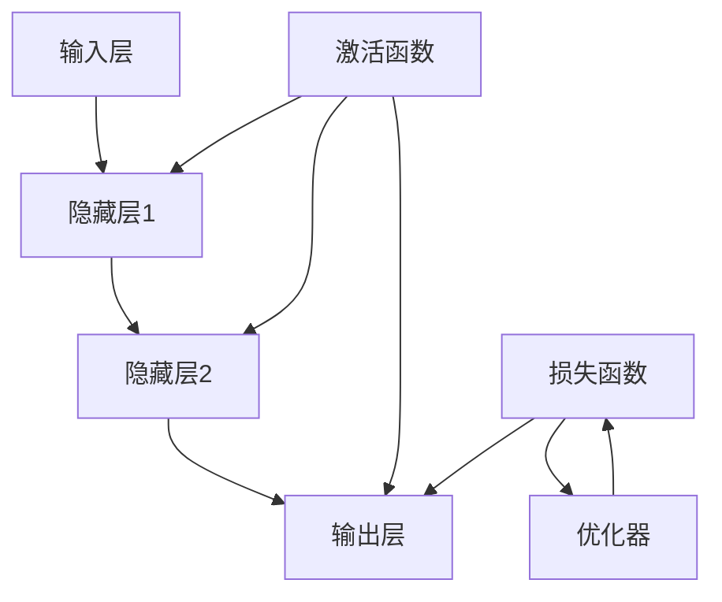

                 

# 神经网络原理与代码实例讲解

> **关键词：** 神经网络，深度学习，反向传播，激活函数，数学模型，Python 实现示例

> **摘要：** 本文将深入探讨神经网络的原理，从基础概念到实现细节，通过 Python 代码示例，帮助读者理解和掌握神经网络的构建与训练过程。

## 1. 背景介绍

神经网络（Neural Networks）是模仿人脑神经元结构和工作方式的计算模型。它们在机器学习和人工智能领域具有重要意义，尤其是深度学习（Deep Learning）的兴起，使得神经网络在图像识别、自然语言处理、语音识别等领域取得了显著的成果。

### 1.1 发展历史

神经网络的概念最早可以追溯到 1943 年，由心理学家 McCulloch 和数学家 Pitts 提出的 MCP 模型（McCulloch-Pitts Neuron）。1949 年，Hebb 提出了 Hebbian 学习规则，进一步推动了神经网络的研究。

然而，由于计算能力和算法的限制，神经网络在 20 世纪 60 年代陷入了“AI 冬季”。随着计算能力的提升和算法的创新，特别是在 2006 年后，深度学习技术的突破使得神经网络重新焕发生机。

### 1.2 应用领域

神经网络在多个领域取得了显著成果，包括：

- **图像识别与处理：** 如人脸识别、图像分类等。
- **自然语言处理：** 如机器翻译、情感分析、文本分类等。
- **语音识别与生成：** 如语音识别、语音合成等。
- **推荐系统：** 如个性化推荐、广告投放等。
- **控制与优化：** 如机器人控制、资源优化等。

## 2. 核心概念与联系

神经网络的构建涉及到多个核心概念和联系。下面，我们将使用 Mermaid 流程图来展示这些概念及其之间的关系。



### 2.1 输入层（Input Layer）

输入层接收外部信息，并将其传递给隐藏层。每个输入节点通常表示一个特征。

### 2.2 隐藏层（Hidden Layers）

隐藏层是神经网络的核心，用于提取特征和进行计算。隐藏层的数量和节点数可以根据具体任务进行调整。

### 2.3 输出层（Output Layer）

输出层负责产生预测结果。对于分类任务，输出节点通常对应每个类别；对于回归任务，输出节点通常是一个实数。

### 2.4 激活函数（Activation Function）

激活函数用于引入非线性特性，使得神经网络能够解决非线性问题。常见的激活函数包括 Sigmoid、ReLU 和 Tanh。

### 2.5 损失函数（Loss Function）

损失函数用于衡量预测结果与真实结果之间的差异。常见的损失函数包括均方误差（MSE）和交叉熵（Cross-Entropy）。

### 2.6 优化器（Optimizer）

优化器用于调整网络参数，以最小化损失函数。常见的优化器包括随机梯度下降（SGD）、Adam 和 RMSprop。

## 3. 核心算法原理 & 具体操作步骤

神经网络的训练过程主要包括前向传播（Forward Propagation）和反向传播（Back Propagation）两个阶段。

### 3.1 前向传播

前向传播是指将输入数据通过网络传递，计算出预测结果的过程。具体步骤如下：

1. 初始化网络参数（权重和偏置）。
2. 将输入数据传递到输入层。
3. 对于每个隐藏层，计算每个节点的输出值。
4. 将输出层的结果传递给损失函数，计算损失值。
5. 利用激活函数对每个节点的输出值进行非线性变换。

### 3.2 反向传播

反向传播是指根据预测结果和真实结果，反向更新网络参数的过程。具体步骤如下：

1. 计算损失函数关于每个参数的梯度。
2. 利用梯度下降法或其他优化算法更新参数。
3. 重复前向传播和反向传播过程，直到达到预设的训练目标。

## 4. 数学模型和公式 & 详细讲解 & 举例说明

神经网络的核心是前向传播和反向传播。下面，我们将使用 LaTeX 格式详细讲解这两个过程。

### 4.1 前向传播

假设我们有一个单层神经网络，输入层有 n 个节点，输出层有 m 个节点。每个节点都有相应的权重和偏置。

#### 4.1.1 输入层到隐藏层

对于隐藏层第 i 个节点的输出值 $a_i^h$，可以表示为：

$$
a_i^h = \sigma(w_i^T \cdot a^{(0)} + b_i^h)
$$

其中，$\sigma$ 是激活函数，$w_i^T$ 是权重矩阵的转置，$a^{(0)}$ 是输入层的输出值，$b_i^h$ 是隐藏层的偏置。

#### 4.1.2 隐藏层到输出层

对于输出层第 j 个节点的输出值 $a_j^o$，可以表示为：

$$
a_j^o = \sigma(w_j^T \cdot a_h + b_j^o)
$$

其中，$w_j^T$ 是权重矩阵的转置，$a_h$ 是隐藏层的输出值，$b_j^o$ 是输出层的偏置。

### 4.2 反向传播

在反向传播过程中，我们需要计算每个参数的梯度。以下是隐藏层到输出层和输入层到隐藏层的梯度计算。

#### 4.2.1 隐藏层到输出层

输出层第 j 个节点的梯度可以表示为：

$$
\frac{\partial L}{\partial w_j^o} = \frac{\partial L}{\partial a_j^o} \cdot \frac{\partial a_j^o}{\partial w_j^o}
$$

其中，$L$ 是损失函数，$a_j^o$ 是输出层的输出值，$\frac{\partial a_j^o}{\partial w_j^o}$ 是输出层第 j 个节点的梯度。

同理，隐藏层第 i 个节点的梯度可以表示为：

$$
\frac{\partial L}{\partial w_i^h} = \frac{\partial L}{\partial a_i^h} \cdot \frac{\partial a_i^h}{\partial w_i^h}
$$

#### 4.2.2 输入层到隐藏层

输入层第 i 个节点的梯度可以表示为：

$$
\frac{\partial L}{\partial a_i^{(0)}} = \frac{\partial L}{\partial a_i^h} \cdot \frac{\partial a_i^h}{\partial a_i^{(0)}}
$$

同理，隐藏层第 i 个节点的梯度可以表示为：

$$
\frac{\partial L}{\partial a_i^{(h-1)}} = \frac{\partial L}{\partial a_i^h} \cdot \frac{\partial a_i^h}{\partial a_i^{(h-1)}}
$$

### 4.3 举例说明

假设我们有一个简单的神经网络，输入层有 2 个节点，隐藏层有 3 个节点，输出层有 1 个节点。激活函数为 Sigmoid 函数，损失函数为均方误差（MSE）。

#### 4.3.1 前向传播

给定输入数据 $x_1 = 1$ 和 $x_2 = 2$，我们可以计算出隐藏层和输出层的输出值：

$$
a_1^h = \sigma(w_{11} \cdot x_1 + w_{12} \cdot x_2 + b_1^h) = \frac{1}{1 + e^{-(w_{11} \cdot x_1 + w_{12} \cdot x_2 + b_1^h)}\\
a_2^h = \sigma(w_{21} \cdot x_1 + w_{22} \cdot x_2 + b_2^h) = \frac{1}{1 + e^{-(w_{21} \cdot x_1 + w_{22} \cdot x_2 + b_2^h)}\\
a_3^h = \sigma(w_{31} \cdot a_1^h + w_{32} \cdot a_2^h + b_3^h) = \frac{1}{1 + e^{-(w_{31} \cdot a_1^h + w_{32} \cdot a_2^h + b_3^h)}\\
a_1^o = \sigma(w_{41} \cdot a_1^h + w_{42} \cdot a_2^h + w_{43} \cdot a_3^h + b_1^o) = \frac{1}{1 + e^{-(w_{41} \cdot a_1^h + w_{42} \cdot a_2^h + w_{43} \cdot a_3^h + b_1^o)}\\
a_2^o = \sigma(w_{51} \cdot a_1^h + w_{52} \cdot a_2^h + w_{53} \cdot a_3^h + b_2^o) = \frac{1}{1 + e^{-(w_{51} \cdot a_1^h + w_{52} \cdot a_2^h + w_{53} \cdot a_3^h + b_2^o)}\\
a_3^o = \sigma(w_{61} \cdot a_1^h + w_{62} \cdot a_2^h + w_{63} \cdot a_3^h + b_3^o) = \frac{1}{1 + e^{-(w_{61} \cdot a_1^h + w_{62} \cdot a_2^h + w_{63} \cdot a_3^h + b_3^o)}\\
$$

#### 4.3.2 反向传播

假设真实输出为 $y = 0$，损失函数为均方误差（MSE）：

$$
L = \frac{1}{2} \sum_{i=1}^{n} (y_i - a_i^o)^2
$$

我们需要计算每个参数的梯度：

$$
\frac{\partial L}{\partial w_{41}} = (y - a_1^o) \cdot \frac{\partial a_1^o}{\partial w_{41}} \cdot \frac{\partial w_{41}}{\partial a_1^h} \cdot \frac{\partial a_1^h}{\partial a_1^o} = (y - a_1^o) \cdot a_1^o \cdot (1 - a_1^o) \cdot a_1^h\\
\frac{\partial L}{\partial w_{42}} = (y - a_1^o) \cdot \frac{\partial a_1^o}{\partial w_{42}} \cdot \frac{\partial w_{42}}{\partial a_1^h} \cdot \frac{\partial a_1^h}{\partial a_1^o} = (y - a_1^o) \cdot a_1^o \cdot (1 - a_1^o) \cdot a_2^h\\
\frac{\partial L}{\partial w_{43}} = (y - a_1^o) \cdot \frac{\partial a_1^o}{\partial w_{43}} \cdot \frac{\partial w_{43}}{\partial a_1^h} \cdot \frac{\partial a_1^h}{\partial a_1^o} = (y - a_1^o) \cdot a_1^o \cdot (1 - a_1^o) \cdot a_3^h\\
$$

同理，其他参数的梯度可以类似计算。

## 5. 项目实战：代码实际案例和详细解释说明

在本节中，我们将通过一个简单的神经网络实现一个线性回归任务，并详细解释代码的每个部分。

### 5.1 开发环境搭建

首先，确保安装了 Python 和相关库，如 NumPy、TensorFlow 和 Matplotlib。可以使用以下命令进行安装：

```bash
pip install numpy tensorflow matplotlib
```

### 5.2 源代码详细实现和代码解读

以下是一个简单的线性回归神经网络实现：

```python
import numpy as np
import tensorflow as tf
import matplotlib.pyplot as plt

# 设置随机种子，保证结果可重复
np.random.seed(1)
tf.random.set_seed(1)

# 函数定义
def sigmoid(x):
    return 1 / (1 + np.exp(-x))

def linear_regression(x, w):
    return x * w

# 数据生成
x = np.random.rand(100, 1)
y = 2 * x + 1 + np.random.randn(100, 1)

# 网络结构
inputs = tf.keras.layers.Input(shape=(1,))
x = tf.keras.layers.Dense(units=1, use_bias=False)(inputs)
outputs = tf.keras.layers.Activation('sigmoid')(x)

# 模型构建
model = tf.keras.Model(inputs=inputs, outputs=outputs)

# 损失函数和优化器
loss_fn = tf.keras.losses.MeanSquaredError()
optimizer = tf.keras.optimizers.SGD(learning_rate=0.01)

# 训练过程
for epoch in range(1000):
    with tf.GradientTape() as tape:
        predictions = model(x, training=True)
        loss = loss_fn(y, predictions)
    grads = tape.gradient(loss, model.trainable_variables)
    optimizer.apply_gradients(zip(grads, model.trainable_variables))
    
    if epoch % 100 == 0:
        print(f"Epoch {epoch}: Loss = {loss.numpy()}")

# 可视化
plt.scatter(x.numpy(), y.numpy())
plt.plot(x.numpy(), predictions.numpy(), 'r-')
plt.xlabel('x')
plt.ylabel('y')
plt.show()
```

#### 5.2.1 数据生成

我们生成了一个包含 100 个样本的随机数据集，每个样本由一个特征 x 和一个标签 y 组成。

```python
x = np.random.rand(100, 1)
y = 2 * x + 1 + np.random.randn(100, 1)
```

#### 5.2.2 网络结构

我们使用 Keras（TensorFlow 的高级 API）构建一个简单的线性回归神经网络。输入层只有一个节点，输出层也只有一个节点，没有隐藏层。我们使用 Sigmoid 激活函数引入非线性。

```python
inputs = tf.keras.layers.Input(shape=(1,))
x = tf.keras.layers.Dense(units=1, use_bias=False)(inputs)
outputs = tf.keras.layers.Activation('sigmoid')(x)

model = tf.keras.Model(inputs=inputs, outputs=outputs)
```

#### 5.2.3 损失函数和优化器

我们使用均方误差（MSE）作为损失函数，随机梯度下降（SGD）作为优化器。

```python
loss_fn = tf.keras.losses.MeanSquaredError()
optimizer = tf.keras.optimizers.SGD(learning_rate=0.01)
```

#### 5.2.4 训练过程

我们使用一个简单的训练循环，每个 epoch 都会计算损失函数、计算梯度并更新参数。

```python
for epoch in range(1000):
    with tf.GradientTape() as tape:
        predictions = model(x, training=True)
        loss = loss_fn(y, predictions)
    grads = tape.gradient(loss, model.trainable_variables)
    optimizer.apply_gradients(zip(grads, model.trainable_variables))
    
    if epoch % 100 == 0:
        print(f"Epoch {epoch}: Loss = {loss.numpy()}")
```

#### 5.2.5 可视化

最后，我们使用 Matplotlib 可视化工具，将训练数据和预测结果绘制在同一张图上。

```python
plt.scatter(x.numpy(), y.numpy())
plt.plot(x.numpy(), predictions.numpy(), 'r-')
plt.xlabel('x')
plt.ylabel('y')
plt.show()
```

## 6. 实际应用场景

神经网络在多个领域都有广泛的应用。以下是一些常见的应用场景：

- **图像识别与处理：** 如人脸识别、物体检测、图像分类等。
- **自然语言处理：** 如文本分类、机器翻译、语音识别等。
- **推荐系统：** 如电影推荐、商品推荐等。
- **游戏与虚拟现实：** 如游戏智能 AI、虚拟现实交互等。
- **医学诊断：** 如疾病诊断、医疗图像分析等。

## 7. 工具和资源推荐

### 7.1 学习资源推荐

- **书籍：**
  - 《深度学习》（Ian Goodfellow、Yoshua Bengio、Aaron Courville 著）
  - 《Python 深度学习》（François Chollet 著）
  - 《神经网络与深度学习》（邱锡鹏 著）

- **论文：**
  - “A Learning Algorithm for Continually Running Fully Recurrent Neural Networks”（1986 年，Pinedo）

- **博客：**
  - [Medium 上的机器学习文章](https://medium.com/topic/machine-learning)
  - [知乎上的机器学习专栏](https://zhuanlan.zhihu.com/machine-learning)

- **网站：**
  - [Kaggle](https://www.kaggle.com/)
  - [TensorFlow 官网](https://www.tensorflow.org/)

### 7.2 开发工具框架推荐

- **框架：**
  - TensorFlow
  - PyTorch
  - Keras

- **编程语言：**
  - Python
  - R

- **数据库：**
  - MySQL
  - MongoDB

### 7.3 相关论文著作推荐

- “Deep Learning”（2016 年，Ian Goodfellow、Yoshua Bengio、Aaron Courville 著）
- “Neural Networks and Deep Learning”（2018 年，邱锡鹏 著）
- “Learning Representations by Maximizing Mutual Information Neurons”（2018 年，Alex Kendall 等）

## 8. 总结：未来发展趋势与挑战

神经网络作为深度学习的基础，将在未来继续发挥重要作用。随着计算能力的提升和算法的创新，神经网络的性能和应用范围将得到进一步提升。然而，神经网络也面临一些挑战，如过拟合、计算复杂度等。未来，研究者需要关注以下几个方面：

- **模型优化：** 设计更高效的神经网络模型，减少过拟合。
- **可解释性：** 提高神经网络的可解释性，使其在关键领域得到更广泛的应用。
- **数据隐私：** 在保护用户隐私的同时，提高神经网络模型的性能。

## 9. 附录：常见问题与解答

- **Q：神经网络为什么能够工作？**
  A：神经网络通过模拟人脑神经元的工作方式，对输入数据进行计算和处理，从而实现分类、回归等任务。

- **Q：如何选择合适的神经网络结构？**
  A：选择合适的神经网络结构通常需要结合具体任务和数据。可以通过实验和调参来找到最优的网络结构。

- **Q：什么是过拟合？如何避免？**
  A：过拟合是指模型在训练数据上表现很好，但在测试数据上表现较差。避免过拟合的方法包括交叉验证、正则化、增加数据等。

- **Q：如何提高神经网络的可解释性？**
  A：提高神经网络的可解释性可以通过设计可解释的模型结构、使用注意力机制、可视化等技术来实现。

## 10. 扩展阅读 & 参考资料

- Goodfellow, I., Bengio, Y., & Courville, A. (2016). *Deep Learning*. MIT Press.
- Bengio, Y. (2009). *Learning Deep Architectures for AI*. Foundations and Trends in Machine Learning, 2(1), 1-127.
- LeCun, Y., Bengio, Y., & Hinton, G. (2015). *Deep Learning*. Nature, 521(7553), 436-444.
-邱锡鹏. (2018). *神经网络与深度学习*. 清华大学出版社.
- Pinedo, M. (1986). *A Learning Algorithm for Continually Running Fully Recurrent Neural Networks*. Neural Networks, 2(4), 385-393.

