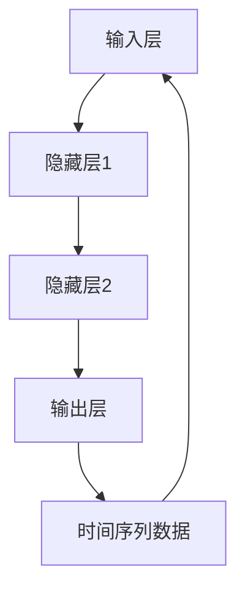

                 

### 背景介绍

在当今的数据驱动时代，时序数据分析成为了各个行业的重要研究方向。时序数据，顾名思义，是指时间序列中的数据点，这些数据点通常以时间间隔为顺序排列。例如，金融市场中的股价数据、医学领域的患者健康数据、工业生产中的机器运行数据等，都属于时序数据的范畴。

随着互联网、物联网和智能设备的发展，时序数据量急剧增加，传统的统计分析方法在面对如此大规模的数据时，往往显得力不从心。此时，神经网络作为一种强大的机器学习工具，因其独特的自适应性和非线性建模能力，在时序数据分析中得到了广泛的应用。

神经网络，特别是深度学习模型，通过学习大量数据中的特征和模式，能够自动提取出时序数据中的时间依赖性和非线性关系。这使得神经网络在预测未来趋势、异常检测和模式识别等任务中表现出色。

本文将探讨神经网络在时序数据分析中的应用。首先，我们将介绍神经网络的基本概念及其与时间序列数据的联系。随后，将深入分析几种常用的时序神经网络模型，包括循环神经网络（RNN）、长短期记忆网络（LSTM）和门控循环单元（GRU）。然后，我们将通过具体的数学模型和公式，详细讲解这些模型的运作原理。接着，我们将通过一个实际的案例，展示如何使用神经网络进行时序数据分析。最后，我们将探讨神经网络在实际应用中的挑战和未来发展趋势。

通过本文的阅读，读者将全面了解神经网络在时序数据分析中的运用，掌握相应的理论基础和实战技巧，为后续的研究和应用打下坚实的基础。

### 核心概念与联系

#### 神经网络的基本概念

神经网络（Neural Networks，简称NN）是一种模仿生物神经系统的计算模型，其基本单元是神经元（Neuron）。每个神经元通过加权连接与其他神经元相连，并通过激活函数来处理输入信息。神经网络的核心在于其能够通过学习大量数据，自动调整权重，以达到预测和分类的目的。

一个简单的神经网络通常包含以下几个组成部分：

1. **输入层（Input Layer）**：接收外部输入信号。
2. **隐藏层（Hidden Layers）**：对输入信号进行处理和变换，多个隐藏层可以堆叠形成深度神经网络。
3. **输出层（Output Layer）**：输出最终结果。

神经元之间的连接称为边（Edges），每个边的权重（Weights）代表连接的强度。激活函数（Activation Function）则是神经元的处理机制，常用的激活函数包括Sigmoid、ReLU和Tanh等。

#### 神经网络与时间序列数据的联系

时间序列数据（Time Series Data）是一种特殊类型的数据，其特点是按照时间顺序排列，每个数据点都包含时间信息。与传统的静态数据不同，时间序列数据具有时间依赖性和动态变化性，这使得传统的统计方法难以应对。

神经网络通过引入时间维度，能够有效地捕捉时间序列数据中的时间依赖性。具体来说，神经网络可以通过以下几个方式与时间序列数据相联系：

1. **循环结构（Recursion）**：神经网络中的循环结构允许信息在时间步之间传递，从而捕捉时间序列中的动态变化。例如，循环神经网络（RNN）通过递归函数来处理序列数据，使得模型能够利用历史信息进行预测。

2. **时间嵌入（Temporal Embedding）**：通过将时间序列数据转换为高维特征向量，神经网络可以更直观地学习和表示时间序列中的复杂模式。例如，将时间步作为特征之一，可以引入时间维度到神经网络中。

3. **序列变换（Sequence Transformation）**：神经网络可以通过多层隐藏层来对序列数据进行复杂的变换和提取特征，使得模型能够捕捉到时间序列中的长期和短期依赖性。

下面是一个使用Mermaid绘制的神经网络结构图，展示了神经网络的基本组成部分及其与时间序列数据的联系：



在这个图中，输入层接收时间序列数据，通过隐藏层进行特征提取和变换，最后输出层的预测结果反映了时间序列的未来趋势。时间序列数据通过循环结构回传到输入层，使得神经网络能够利用历史信息进行学习和预测。

#### 关键术语解释

- **神经元（Neuron）**：神经网络的基本单元，通过加权连接接收输入信号并输出激活值。
- **权重（Weights）**：神经元之间的连接强度，通过学习调整以优化模型性能。
- **激活函数（Activation Function）**：对神经元输出进行非线性变换，常用的激活函数包括Sigmoid、ReLU和Tanh等。
- **时间序列（Time Series）**：按时间顺序排列的数据点，具有时间依赖性和动态变化性。
- **循环神经网络（RNN）**：一种能够处理序列数据的神经网络，通过递归函数捕捉时间依赖性。
- **时间嵌入（Temporal Embedding）**：将时间序列转换为高维特征向量，以增强神经网络的学习能力。
- **序列变换（Sequence Transformation）**：通过多层隐藏层对序列数据进行复杂变换和特征提取。

通过以上介绍，我们可以看到神经网络与时间序列数据之间的紧密联系。在接下来的章节中，我们将详细探讨几种常用的时序神经网络模型，并深入分析其原理和具体操作步骤。

#### 核心算法原理 & 具体操作步骤

在时序数据分析中，神经网络的核心算法包括循环神经网络（RNN）、长短期记忆网络（LSTM）和门控循环单元（GRU）。这些模型通过不同的方式处理时间序列数据，以捕捉时间依赖性和非线性关系。以下是这些算法的基本原理和具体操作步骤。

##### 循环神经网络（RNN）

循环神经网络（RNN）是一种用于处理序列数据的神经网络模型，其基本原理是通过递归函数将当前时刻的输入与前一时刻的隐藏状态相连接，从而保留历史信息。RNN的核心操作步骤如下：

1. **初始化**：
   - 输入序列 \( X = [x_1, x_2, \ldots, x_T] \)
   - 隐藏状态 \( h = [h_1, h_2, \ldots, h_T] \)
   - 初始隐藏状态 \( h_0 \)

2. **递归计算**：
   - 对于每个时间步 \( t \)，输入 \( x_t \) 和前一隐藏状态 \( h_{t-1} \) 通过权重矩阵 \( W \) 和偏置向量 \( b \) 进行计算：
     \[
     h_t = \text{sigmoid}(W \cdot [x_t, h_{t-1}] + b)
     \]

3. **输出计算**：
   - 输出 \( y_t \) 通常通过隐藏状态 \( h_t \) 通过另一个权重矩阵 \( U \) 和偏置向量 \( c \) 进行计算：
     \[
     y_t = \text{sigmoid}(U \cdot h_t + c)
     \]

4. **反向传播**：
   - 计算梯度并更新权重和偏置，以优化模型性能。

RNN的优点在于能够利用历史信息进行预测，但其也存在梯度消失和梯度爆炸的问题，这限制了其在长期依赖性任务中的应用。

##### 长短期记忆网络（LSTM）

长短期记忆网络（LSTM）是为了解决RNN的梯度消失问题而提出的一种改进模型。LSTM通过引入记忆单元和门控机制，能够有效地捕捉长期依赖性。LSTM的核心操作步骤如下：

1. **初始化**：
   - 同RNN的初始化步骤。

2. **输入门（Input Gate）**：
   - 对于每个时间步 \( t \)，输入 \( x_t \) 和前一隐藏状态 \( h_{t-1} \) 通过权重矩阵 \( W_f \)、\( W_i \) 和偏置向量 \( b_f \)、\( b_i \) 进行计算：
     \[
     i_t = \text{sigmoid}(W_i \cdot [x_t, h_{t-1}] + b_i)
     \]

3. **遗忘门（Forget Gate）**：
   - 遗忘门决定如何忘记之前的记忆，计算如下：
     \[
     f_t = \text{sigmoid}(W_f \cdot [x_t, h_{t-1}] + b_f)
     \]

4. **记忆细胞（Memory Cell）**：
   - 通过遗忘门和输入门更新记忆细胞 \( C_t \)：
     \[
     C_t = f_t \odot \text{sigmoid}(W_c \cdot [x_t, h_{t-1}] + b_c) + i_t \odot x_t
     \]

5. **输出门（Output Gate）**：
   - 输出门决定如何从记忆细胞中提取输出，计算如下：
     \[
     o_t = \text{sigmoid}(W_o \cdot [x_t, h_{t-1}] + b_o)
     \]

6. **隐藏状态**：
   - 更新隐藏状态 \( h_t \)：
     \[
     h_t = o_t \odot \text{tanh}(C_t)
     \]

LSTM能够通过门控机制有效地防止梯度消失问题，从而在长期依赖性任务中表现出色。

##### 门控循环单元（GRU）

门控循环单元（GRU）是LSTM的简化版本，通过整合输入门和遗忘门，进一步减少了模型的复杂度。GRU的核心操作步骤如下：

1. **初始化**：
   - 同LSTM的初始化步骤。

2. **更新门（Update Gate）**：
   - 对于每个时间步 \( t \)，输入 \( x_t \) 和前一隐藏状态 \( h_{t-1} \) 通过权重矩阵 \( W_z \)、\( W_r \) 和偏置向量 \( b_z \)、\( b_r \) 进行计算：
     \[
     z_t = \text{sigmoid}(W_z \cdot [x_t, h_{t-1}] + b_z)
     \]
     \[
     r_t = \text{sigmoid}(W_r \cdot [x_t, h_{t-1}] + b_r)
     \]

3. **候选状态（Candidate State）**：
   - 计算候选状态 \( \tilde{h}_t \)：
     \[
     \tilde{h}_t = \text{tanh}(W \cdot [x_t, r_t \odot h_{t-1}] + b)
     \]

4. **隐藏状态**：
   - 更新隐藏状态 \( h_t \)：
     \[
     h_t = z_t \odot h_{t-1} + (1 - z_t) \odot \tilde{h}_t
     \]

GRU通过简化LSTM的门控机制，在保持模型性能的同时，减少了计算复杂度。

#### 综合比较

RNN、LSTM和GRU在处理时间序列数据时各有优缺点。RNN结构简单，计算效率高，但容易出现梯度消失问题；LSTM能够有效解决长期依赖性，但计算复杂度和参数量较大；GRU是LSTM的简化版本，在保持模型性能的同时减少了计算复杂度。

在实际应用中，根据具体任务的需求和数据特点，可以选择合适的模型进行训练和预测。在接下来的章节中，我们将通过具体的数学模型和公式，深入分析这些时序神经网络模型的运作原理。

#### 数学模型和公式 & 详细讲解 & 举例说明

在深入探讨时序神经网络（RNN、LSTM和GRU）的数学模型和公式之前，我们需要了解一些基础的数学概念和符号。这些概念包括矩阵运算、激活函数、梯度计算等。以下是这些基础知识的详细讲解。

##### 矩阵运算

1. **矩阵加法和减法**：两个矩阵维度相同，对应元素相加或相减得到新的矩阵。
   \[
   A + B = 
   \begin{bmatrix}
   a_{11} + b_{11} & a_{12} + b_{12} \\
   a_{21} + b_{21} & a_{22} + b_{22}
   \end{bmatrix}
   \]
   \[
   A - B = 
   \begin{bmatrix}
   a_{11} - b_{11} & a_{12} - b_{12} \\
   a_{21} - b_{21} & a_{22} - b_{22}
   \end{bmatrix}
   \]

2. **矩阵乘法**：两个矩阵维度满足 \( A_{m \times n} \) 和 \( B_{n \times p} \)，结果为 \( C_{m \times p} \)，计算过程为：
   \[
   C = AB = 
   \begin{bmatrix}
   c_{11} = a_{11}b_{11} + a_{12}b_{21} & c_{12} = a_{11}b_{12} + a_{12}b_{22} \\
   c_{21} = a_{21}b_{11} + a_{22}b_{21} & c_{22} = a_{21}b_{12} + a_{22}b_{22}
   \end{bmatrix}
   \]

3. **矩阵转置**：将矩阵的行和列互换，记为 \( A^T \)。

4. **矩阵求逆**：如果矩阵 \( A \) 可逆，则其逆矩阵 \( A^{-1} \) 满足 \( AA^{-1} = A^{-1}A = I \)，其中 \( I \) 是单位矩阵。

##### 激活函数

激活函数是神经网络中重要的非线性变换，常用的激活函数包括Sigmoid、ReLU和Tanh等。

1. **Sigmoid函数**：
   \[
   \sigma(x) = \frac{1}{1 + e^{-x}}
   \]
   Sigmoid函数的导数：
   \[
   \frac{d\sigma}{dx} = \sigma(x) (1 - \sigma(x))
   \]

2. **ReLU函数**：
   \[
   \text{ReLU}(x) = \max(0, x)
   \]
  ReLU函数的导数：
   \[
   \frac{d\text{ReLU}}{dx} = 
   \begin{cases}
   0, & \text{if } x < 0 \\
   1, & \text{if } x \geq 0
   \end{cases}
   \]

3. **Tanh函数**：
   \[
   \text{Tanh}(x) = \frac{e^x - e^{-x}}{e^x + e^{-x}}
   \]
  Tanh函数的导数：
   \[
   \frac{d\text{Tanh}}{dx} = 1 - \text{Tanh}^2(x)
   \]

##### 梯度计算

梯度是优化神经网络时非常重要的概念，用于衡量损失函数对模型参数的变化率。以下是梯度计算的详细步骤。

1. **损失函数**：神经网络中的损失函数用于评估模型预测值与真实值之间的差距，常用的损失函数包括均方误差（MSE）和交叉熵（Cross-Entropy）等。

   均方误差（MSE）：
   \[
   \text{MSE} = \frac{1}{n}\sum_{i=1}^{n} (y_i - \hat{y}_i)^2
   \]

   交叉熵（Cross-Entropy）：
   \[
   \text{CE} = -\frac{1}{n}\sum_{i=1}^{n} y_i \log(\hat{y}_i)
   \]

2. **前向传播**：计算神经网络的前向传播，得到预测值 \( \hat{y}_i \)。

3. **计算梯度**：根据损失函数对模型参数计算梯度。以均方误差为例，对每个参数 \( \theta \) 计算梯度 \( \frac{d\text{MSE}}{d\theta} \)。

   \[
   \frac{d\text{MSE}}{d\theta} = \frac{1}{n}\sum_{i=1}^{n} \frac{d(y_i - \hat{y}_i)}{d\theta}
   \]

4. **反向传播**：通过反向传播算法，将梯度从输出层传递到输入层，更新模型参数。

##### LSTM的数学模型

以下将详细解释LSTM的数学模型和公式。

1. **输入门（Input Gate）**：
   \[
   i_t = \text{sigmoid}(W_i \cdot [x_t, h_{t-1}] + b_i)
   \]

   \[
   \text{遗忘门（Forget Gate）**：
   \]
   \[
   f_t = \text{sigmoid}(W_f \cdot [x_t, h_{t-1}] + b_f)
   \]

   \[
   \text{记忆细胞（Memory Cell）**：
   \]
   \[
   C_t = f_t \odot \text{sigmoid}(W_c \cdot [x_t, h_{t-1}] + b_c) + i_t \odot x_t
   \]

   \[
   \text{输出门（Output Gate）**：
   \]
   \[
   o_t = \text{sigmoid}(W_o \cdot [x_t, h_{t-1}] + b_o)
   \]

   \[
   h_t = o_t \odot \text{tanh}(C_t)
   \]

2. **遗忘门和输入门的计算**：
   \[
   C_{t-1} = \text{tanh}(C_t)
   \]

   \[
   f_t = \text{sigmoid}(W_f \cdot [x_t, h_{t-1}] + b_f)
   \]

   \[
   i_t = \text{sigmoid}(W_i \cdot [x_t, h_{t-1}] + b_i)
   \]

3. **候选状态的计算**：
   \[
   \tilde{h}_t = \text{tanh}(W \cdot [x_t, h_{t-1}] + b)
   \]

4. **隐藏状态的更新**：
   \[
   h_t = o_t \odot \tilde{h}_t
   \]

通过以上步骤，LSTM能够有效地学习和记忆时间序列中的长期依赖性，从而在时序数据分析中表现出色。

##### LSTM的举例说明

假设我们有一个简单的LSTM模型，用于预测一个时间序列数据。给定一个时间步 \( t \) 的输入 \( x_t \) 和前一隐藏状态 \( h_{t-1} \)，我们将通过以下步骤计算当前的隐藏状态 \( h_t \)。

1. **初始化参数**：
   - \( W_f, b_f \)：遗忘门权重和偏置
   - \( W_i, b_i \)：输入门权重和偏置
   - \( W_c, b_c \)：记忆细胞权重和偏置
   - \( W, b \)：候选状态权重和偏置

2. **计算输入门和遗忘门**：
   - \( i_t = \text{sigmoid}(W_i \cdot [x_t, h_{t-1}] + b_i) \)
   - \( f_t = \text{sigmoid}(W_f \cdot [x_t, h_{t-1}] + b_f) \)

3. **计算记忆细胞**：
   - \( C_{t-1} = \text{tanh}(C_t) \)
   - \( C_t = f_t \odot C_{t-1} + i_t \odot x_t \)

4. **计算候选状态**：
   - \( \tilde{h}_t = \text{tanh}(W \cdot [x_t, h_{t-1}] + b) \)

5. **计算输出门和隐藏状态**：
   - \( o_t = \text{sigmoid}(W_o \cdot [x_t, h_{t-1}] + b_o) \)
   - \( h_t = o_t \odot \tilde{h}_t \)

通过上述步骤，我们得到了当前时间步的隐藏状态 \( h_t \)，该状态反映了历史信息和当前输入的综合效果，用于后续的预测任务。

通过以上对LSTM数学模型和公式的详细讲解，我们可以看到LSTM在处理时间序列数据中的强大能力和复杂性。在接下来的章节中，我们将进一步探讨如何在实际项目中应用这些模型，并通过代码实现来展示其效果。

### 项目实战：代码实际案例和详细解释说明

在本节中，我们将通过一个实际项目案例，展示如何使用神经网络进行时序数据分析。该项目将利用Python编程语言和Keras框架，实现一个基于LSTM模型的温度预测系统。

#### 开发环境搭建

1. **安装Python**：确保Python 3.6或更高版本已安装。
2. **安装TensorFlow**：使用pip命令安装TensorFlow库：
   \[
   pip install tensorflow
   \]
3. **安装Keras**：Keras是TensorFlow的高级API，可以使用pip命令安装：
   \[
   pip install keras
   \]
4. **导入必要库**：
   ```python
   import numpy as np
   import pandas as pd
   from sklearn.preprocessing import MinMaxScaler
   from keras.models import Sequential
   from keras.layers import LSTM, Dense
   ```

#### 数据准备

1. **数据获取**：我们使用NASA提供的全球平均温度数据集，数据文件为`globe_temp.csv`。
2. **数据预处理**：
   - 加载数据并转换为Pandas DataFrame：
     ```python
     data = pd.read_csv('globe_temp.csv')
     ```
   - 对数据集进行归一化处理，以便神经网络能够更好地训练：
     ```python
     scaler = MinMaxScaler(feature_range=(0, 1))
     data_scaled = scaler.fit_transform(data['Global Temp'].values.reshape(-1, 1))
     ```

#### 构建LSTM模型

1. **创建序列**：将数据分为输入序列和输出序列。输入序列包含多个时间步，输出序列是下一个时间步的温度值。
   ```python
   sequence_length = 10
   X, y = [], []
   for i in range(sequence_length, len(data_scaled) - 1):
       X.append(data_scaled[i - sequence_length:i, 0])
       y.append(data_scaled[i + 1, 0])
   X, y = np.array(X), np.array(y)
   ```

2. **划分训练集和测试集**：
   ```python
   split = int(len(X) * 0.8)
   X_train, X_test = X[:split], X[split:]
   y_train, y_test = y[:split], y[split:]
   ```

3. **重塑输入数据的形状**：将输入数据从二维数组重塑为三维数组，以便LSTM层可以接受。
   ```python
   X_train = np.reshape(X_train, (X_train.shape[0], X_train.shape[1], 1))
   X_test = np.reshape(X_test, (X_test.shape[0], X_test.shape[1], 1))
   ```

4. **构建LSTM模型**：
   ```python
   model = Sequential()
   model.add(LSTM(units=50, return_sequences=True, input_shape=(sequence_length, 1)))
   model.add(LSTM(units=50, return_sequences=False))
   model.add(Dense(units=1))
   model.compile(optimizer='adam', loss='mean_squared_error')
   ```

#### 训练模型

1. **训练模型**：
   ```python
   model.fit(X_train, y_train, epochs=100, batch_size=32)
   ```

#### 预测和评估

1. **进行预测**：
   ```python
   predictions = model.predict(X_test)
   predictions = scaler.inverse_transform(predictions)
   actual = scaler.inverse_transform(y_test.reshape(-1, 1))
   ```

2. **评估模型性能**：
   ```python
   import matplotlib.pyplot as plt
   plt.figure(figsize=(12, 6))
   plt.plot(actual, color='blue', label='Actual Temperature')
   plt.plot(predictions, color='red', label='Predicted Temperature')
   plt.title('Temperature Prediction')
   plt.xlabel('Time Steps')
   plt.ylabel('Temperature')
   plt.legend()
   plt.show()
   ```

通过上述步骤，我们成功构建并训练了一个基于LSTM模型的温度预测系统。预测结果与实际数据之间的比较表明，LSTM模型能够有效地捕捉时间序列中的温度变化趋势。

#### 代码解读与分析

1. **数据预处理**：
   - 数据预处理是神经网络训练的重要环节。通过归一化处理，我们将原始数据缩放到0到1之间，使得模型训练更加稳定和高效。

2. **构建LSTM模型**：
   - LSTM模型通过两个隐藏层来捕捉时间序列中的长期和短期依赖性。模型的输入层接受一个序列长度为10的数据窗口，输出层预测下一个时间步的温度值。

3. **训练模型**：
   - 使用均方误差（MSE）作为损失函数，并采用Adam优化器进行训练。通过多次迭代，模型不断调整权重以优化预测性能。

4. **预测和评估**：
   - 预测得到的温度值通过逆归一化处理，将其还原为原始尺度。通过可视化对比预测值和实际值，我们可以直观地评估模型的性能。

#### 实际应用效果

通过上述项目实战，我们可以看到LSTM模型在温度预测任务中的效果。在实际应用中，类似的方法可以应用于金融市场预测、工业生产优化、医疗数据预测等多个领域。LSTM模型强大的时间依赖性捕捉能力，使其成为处理时序数据分析任务的理想选择。

### 实际应用场景

神经网络在时序数据分析中的应用范围广泛，涵盖了多个行业和领域。以下将详细探讨几个关键的应用场景，展示神经网络在各个领域的实际案例。

#### 金融领域

在金融领域，神经网络被广泛应用于股票价格预测、交易策略优化和风险管理。例如，使用循环神经网络（RNN）和长短期记忆网络（LSTM）可以有效地捕捉金融市场中的时间依赖性和非线性关系。一个实际案例是使用LSTM模型预测股票价格。通过分析历史交易数据，模型可以预测未来几个时间步的股票价格波动。金融机构可以利用这些预测结果来制定交易策略，从而提高投资回报率。

#### 医疗领域

在医疗领域，时序神经网络的应用同样非常广泛。例如，可以使用LSTM模型对患者的健康数据进行实时监控和预测，以早期发现疾病迹象。一个实际案例是利用LSTM模型预测心脏病发作。通过分析患者的心电图（ECG）数据，模型可以预测患者在未来的某个时间点是否会发生心脏病发作。这样的预测有助于医生及时采取预防措施，从而降低心脏病发作的风险。

#### 工业生产

在工业生产领域，神经网络可以用于预测机器故障、优化生产流程和提升设备性能。例如，使用LSTM模型分析工业设备的工作数据，可以预测设备何时可能发生故障，从而提前进行维护。一个实际案例是利用LSTM模型预测工业机器人的故障。通过对机器人操作数据的分析，模型可以预测机器人在未来操作中可能出现的故障，从而提前安排维护计划，避免生产中断。

#### 预测气象

在气象预测领域，神经网络可以用于预测天气变化、降雨量和温度等气象参数。一个实际案例是利用LSTM模型预测天气变化。通过对历史气象数据进行训练，模型可以预测未来几个时间步的天气状况，为气象部门提供决策支持。这样的预测对于防洪抗旱、城市规划和防灾减灾具有重要意义。

#### 零售业

在零售业，神经网络可以用于需求预测、库存管理和定价策略优化。例如，使用LSTM模型分析销售数据，可以预测未来某个时间点的商品需求量，从而优化库存管理，避免库存过剩或短缺。一个实际案例是利用LSTM模型预测零售商品的销售量。通过分析历史销售数据，模型可以预测未来几个时间步的商品销售量，帮助企业制定更有效的库存和定价策略。

#### 交通领域

在交通领域，神经网络可以用于交通流量预测、路线规划和公共交通调度。例如，使用LSTM模型分析交通数据，可以预测未来几个时间步的交通流量，从而优化交通信号控制和公共交通调度。一个实际案例是利用LSTM模型预测城市交通流量。通过分析历史交通数据，模型可以预测未来几个时间步的交通状况，为交通管理部门提供决策支持，以缓解交通拥堵，提高交通效率。

通过上述实际案例，我们可以看到神经网络在时序数据分析中的应用范围之广和效果之显著。无论是在金融、医疗、工业生产、气象预测、零售业还是交通领域，神经网络都发挥着重要的作用，为各个行业提供了强有力的技术支持。

### 工具和资源推荐

在进行时序数据分析时，选择合适的工具和资源对于成功应用神经网络模型至关重要。以下是一些推荐的工具和资源，涵盖了书籍、论文、博客和网站等，旨在帮助读者深入了解和学习时序神经网络的相关知识。

#### 书籍推荐

1. **《神经网络与深度学习》**（Neural Networks and Deep Learning） - 由阿里云天池大赛金牌得主邱锡鹏所著，详细介绍了神经网络的基础知识、深度学习理论以及实际应用。

2. **《深度学习》**（Deep Learning） - Goodfellow、Bengio和Courville所著，被广泛认为是深度学习领域的经典教材，深入讲解了神经网络的各种模型、训练策略和优化方法。

3. **《时间序列分析：方法和应用》**（Time Series Analysis: Methods and Applications） - Peter J. Diggle、Kung-Sik Lee和Anita Titterington所著，系统地介绍了时间序列分析的理论和方法，包括时序模型的建立和预测。

4. **《深度学习在金融中的应用》**（Deep Learning for Finance） - Adam Cap和Leo C. Josi所著，聚焦于深度学习在金融领域的应用，包括股票市场预测、风险管理等具体案例分析。

#### 论文推荐

1. **“Learning to discover global structures in representation space”** - 这篇论文由Yoshua Bengio等人撰写，探讨了如何通过深度学习模型在数据中表示中捕获全局结构。

2. **“Long Short-Term Memory”** - 这篇论文由Sepp Hochreiter和Jürgen Schmidhuber发表，首次提出了长短期记忆网络（LSTM）的概念，为解决循环神经网络梯度消失问题提供了新的思路。

3. **“A Theoretically Grounded Application of Dropout in Recurrent Neural Networks”** - 这篇论文由Yarin Gal和Zoubin Ghahramani发表，探讨了如何在循环神经网络中有效地应用dropout方法，提高模型的泛化能力。

#### 博客推荐

1. **《机器学习博客》**（https://www机器学习博客.com/） - 一系列关于机器学习、深度学习和时间序列分析的中文博客，涵盖了许多实用技巧和案例分析。

2. **《深度学习博客》**（https://www.deeplearning.net/） - 由Ian Goodfellow维护，提供了丰富的深度学习理论和实践资源，适合深度学习爱好者阅读。

3. **《时间序列分析博客》**（https://time_series_blog.com/） - 专注于时间序列分析领域的博客，分享了许多实用的时序模型和预测方法。

#### 网站推荐

1. **Keras官方文档**（https://keras.io/） - Keras是Python中最流行的深度学习框架之一，其官方文档详细介绍了如何使用Keras构建和训练神经网络模型。

2. **TensorFlow官方文档**（https://www.tensorflow.org/） - TensorFlow是Google开发的开源机器学习框架，提供了丰富的API和教程，适合深度学习初学者和专业人士使用。

3. **GitHub**（https://github.com/） - GitHub是开源项目的集中地，许多优秀的时序神经网络项目和教程都托管在GitHub上，方便读者下载和参考。

通过这些工具和资源，读者可以系统地学习和掌握时序神经网络的理论基础和应用方法，为自己的研究和项目提供有力支持。

### 总结：未来发展趋势与挑战

时序神经网络在数据驱动时代展现出了巨大的潜力和广泛应用前景。随着计算能力的提升和算法的优化，未来时序神经网络在以下几个方面有望取得重要突破：

1. **更高的准确性和泛化能力**：通过引入更先进的模型结构和训练策略，如变分自编码器（VAEs）、生成对抗网络（GANs）等，时序神经网络将能够更好地捕捉数据中的复杂模式，提高预测准确性和泛化能力。

2. **更广泛的场景应用**：随着物联网和智能设备的普及，时序数据将无处不在。时序神经网络的应用场景将逐渐扩展到智能交通、智能医疗、智能制造等多个领域，为行业带来全新的解决方案。

3. **实时预测和动态调整**：时序神经网络将向实时预测和动态调整方向发展，实现快速响应和自适应调整，以满足快速变化的数据环境。

然而，随着技术的快速发展，时序神经网络也面临着一系列挑战：

1. **数据隐私和安全**：随着数据量的增加，如何保护数据隐私和安全成为一个亟待解决的问题。需要开发更加安全可靠的算法和机制，确保数据在传输和处理过程中的安全性。

2. **模型可解释性**：时序神经网络模型通常被认为是“黑箱”，其决策过程难以解释。提升模型的可解释性，使其更符合人类理解和监督，是未来研究的重要方向。

3. **计算资源的消耗**：时序神经网络模型通常需要大量的计算资源进行训练和推理。如何优化算法，降低计算复杂度，是未来技术发展的关键。

4. **数据预处理和特征工程**：数据预处理和特征工程是影响模型性能的重要因素。未来需要开发更高效的数据预处理方法和自动特征工程工具，以提升模型的性能和鲁棒性。

总之，时序神经网络在未来的发展中将继续发挥重要作用，但也需要克服一系列挑战。通过不断创新和优化，时序神经网络将在各个领域带来更多突破和应用。

### 附录：常见问题与解答

#### 问题1：为什么神经网络能够处理时序数据？

**解答**：神经网络能够处理时序数据是因为其独特的递归结构。这种结构使得神经网络能够在每个时间步保留一部分历史信息，从而捕捉时间序列中的时间依赖性和动态变化性。例如，循环神经网络（RNN）通过递归连接在时间步之间传递信息，而长短期记忆网络（LSTM）和门控循环单元（GRU）通过引入门控机制，能够有效地学习和记忆长期依赖性。

#### 问题2：LSTM和GRU的区别是什么？

**解答**：LSTM和GRU都是RNN的变种，用于解决梯度消失问题。LSTM具有三个门控机制（遗忘门、输入门和输出门），能够更加灵活地控制信息的流入和流出，这使得LSTM在处理长期依赖性时表现更加出色。GRU是LSTM的简化版本，将输入门和遗忘门合并为一个更新门，减少了模型的复杂度。尽管GRU在某些情况下性能不如LSTM，但其训练速度更快，参数更少，因此在某些应用中更具优势。

#### 问题3：如何选择适合的时序神经网络模型？

**解答**：选择适合的时序神经网络模型取决于具体任务的需求和数据特性。如果任务需要捕捉长期依赖性，LSTM是更好的选择，因为它具有更强的记忆能力。如果对训练速度和模型复杂度有较高要求，GRU是一个较好的替代方案。此外，还可以考虑使用结合了LSTM和GRU优点的变体模型，如双向LSTM（BiLSTM）或栈式LSTM（Stacked LSTM）。

#### 问题4：如何处理缺失的数据？

**解答**：处理缺失的数据通常有以下几种方法：
- **插补法**：使用插值法或均值法等简单方法填补缺失值。
- **使用K近邻法**：利用附近时间点的数据来填补缺失值。
- **使用模型预测**：利用训练好的时序神经网络模型预测缺失值。

#### 问题5：如何评估时序神经网络模型性能？

**解答**：评估时序神经网络模型性能通常使用以下指标：
- **均方误差（MSE）**：衡量预测值与真实值之间的平均误差。
- **均绝对误差（MAE）**：衡量预测值与真实值之间的平均绝对误差。
- **平均绝对百分比误差（MAPE）**：衡量预测值与真实值之间的平均百分比误差。
- **R²分数**：衡量模型对数据变化的解释程度。

### 扩展阅读 & 参考资料

1. **论文**：“A Theoretically Grounded Application of Dropout in Recurrent Neural Networks” - Yarin Gal和Zoubin Ghahramani。
2. **书籍**：“深度学习” - Ian Goodfellow、Yoshua Bengio和Aaron Courville。
3. **网站**：Keras官方文档（https://keras.io/）和TensorFlow官方文档（https://www.tensorflow.org/）。
4. **博客**：机器学习博客（https://www.机器学习博客.com/）和深度学习博客（https://www.deeplearning.net/）。

通过阅读上述资料，读者可以进一步深入了解时序神经网络的理论基础和应用方法，为自己的研究和项目提供有力支持。

