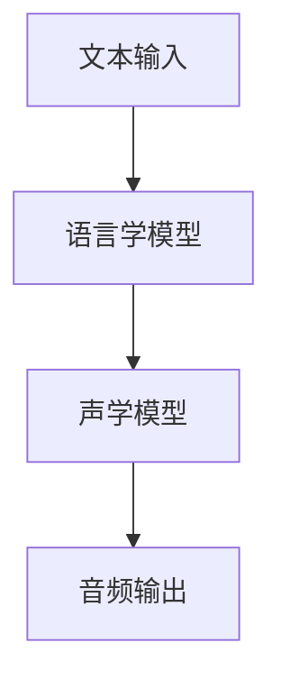

                 

### 文章标题

神经网络在语音合成中取代传统方法

> **关键词：** 语音合成，神经网络，深度学习，自动语音生成，声学模型，语言学模型

> **摘要：** 本文将深入探讨神经网络在语音合成领域的应用，分析其与传统方法的差异，解释神经网络在声学模型和语言学模型中的具体实现方式，并探讨神经网络在这一领域的优势和挑战。通过项目实战，我们将展示神经网络在语音合成中的实际应用，并提供相关的学习资源、开发工具和扩展阅读。

## 1. 背景介绍

语音合成（Text-to-Speech，TTS）技术是计算机科学中的一个重要分支，旨在将文本转换为自然流畅的语音。语音合成技术可以广泛应用于各个领域，如智能助手、车载导航系统、播报系统等。传统语音合成方法主要基于规则和声学模型，例如基于发音字典的方法和合成语音的拼接技术。然而，随着深度学习技术的发展，神经网络在语音合成中的应用逐渐兴起，并开始取代传统方法。

传统语音合成方法依赖于大量的手工制作的规则和发音词典，这导致了合成语音的质量受到限制。此外，传统方法在处理复杂语音现象（如音调、语气、节奏等）时，往往无法达到理想的效果。而神经网络，特别是深度学习算法，通过自动学习大量的文本和语音数据，可以生成更加自然、多样化的语音。

在本文中，我们将详细探讨神经网络在语音合成中的应用，分析其与传统方法的差异，并展示神经网络在语音合成中的具体实现。此外，我们还将讨论神经网络在语音合成中的优势和挑战，并提供相关的学习资源、开发工具和扩展阅读。

## 2. 核心概念与联系

为了深入理解神经网络在语音合成中的应用，我们需要先了解一些核心概念，包括神经网络、深度学习、声学模型和语言学模型。

### 2.1 神经网络与深度学习

神经网络是一种模拟生物神经元工作方式的计算模型。神经网络由多个层组成，包括输入层、隐藏层和输出层。每个神经元都与相邻的神经元通过权重进行连接，并通过激活函数进行计算。深度学习是一种特殊类型的神经网络，具有多个隐藏层，可以自动学习大量数据中的复杂模式和特征。

### 2.2 声学模型

声学模型是语音合成系统中的一个关键组件，负责将文本转换为音频信号。声学模型通过学习文本和语音之间的映射关系，生成与文本相对应的语音。传统的声学模型通常基于频谱分析，如梅尔频率倒谱系数（MFCC），而现代的深度学习声学模型则使用更加复杂的神经网络结构，如循环神经网络（RNN）和变换器（Transformer）。

### 2.3 语言学模型

语言学模型负责理解文本的含义和上下文，生成自然的语言描述。传统的语言学模型通常基于规则和统计方法，如语言模型和语法分析。而现代的深度学习语言学模型，如长短期记忆网络（LSTM）和变换器，可以更好地捕捉文本中的长期依赖关系。

### 2.4 Mermaid 流程图

为了更好地理解神经网络在语音合成中的应用，我们可以使用 Mermaid 流程图来展示语音合成的整体流程。



在这个流程图中，文本输入首先通过语言学模型进行解析，生成与文本相对应的语言特征。然后，这些语言特征被传递给声学模型，生成音频信号。最后，音频信号被输出为合成语音。

## 3. 核心算法原理 & 具体操作步骤

### 3.1 声学模型原理

声学模型是语音合成的核心组件，它通过学习文本和语音之间的映射关系，生成与文本相对应的语音。深度学习算法在声学模型中的应用主要包括循环神经网络（RNN）和变换器（Transformer）。

#### 循环神经网络（RNN）

循环神经网络是一种特殊的神经网络，它通过在隐藏层中引入循环结构，可以处理序列数据。RNN在语音合成中的应用如下：

1. **输入层**：文本被转化为向量序列，输入到RNN的输入层。
2. **隐藏层**：RNN的隐藏层通过循环结构，将上一个时间步的输出传递到下一个时间步，同时与当前输入进行计算。
3. **输出层**：RNN的输出层生成音频信号的谱图，这些谱图被进一步转换为音频信号。

#### 变换器（Transformer）

变换器是一种基于自注意力机制的深度学习模型，它在语音合成中的应用如下：

1. **编码器**：编码器将文本转化为序列向量，并计算它们之间的注意力权重。
2. **解码器**：解码器根据编码器的输出，生成音频信号的谱图。
3. **损失函数**：使用损失函数（如均方误差）对模型的预测结果进行评估和优化。

### 3.2 语言学模型原理

语言学模型负责理解文本的含义和上下文，生成自然的语言描述。深度学习算法在语言学模型中的应用主要包括长短期记忆网络（LSTM）和变换器（Transformer）。

#### 长短期记忆网络（LSTM）

长短期记忆网络是一种特殊的循环神经网络，它可以捕捉文本中的长期依赖关系。LSTM在语音合成中的应用如下：

1. **输入层**：文本被转化为向量序列，输入到LSTM的输入层。
2. **隐藏层**：LSTM的隐藏层通过门控机制，可以学习文本中的长期依赖关系。
3. **输出层**：LSTM的输出层生成与文本相对应的语言特征。

#### 变换器（Transformer）

变换器是一种基于自注意力机制的深度学习模型，它可以更好地捕捉文本中的长期依赖关系。Transformer在语音合成中的应用如下：

1. **编码器**：编码器将文本转化为序列向量，并计算它们之间的注意力权重。
2. **解码器**：解码器根据编码器的输出，生成与文本相对应的语言特征。
3. **损失函数**：使用损失函数（如交叉熵）对模型的预测结果进行评估和优化。

### 3.3 具体操作步骤

以下是使用神经网络进行语音合成的基本步骤：

1. **数据收集**：收集大量的文本和语音数据，用于训练声学模型和语言学模型。
2. **数据预处理**：对文本和语音数据进行预处理，如分词、去噪等。
3. **模型训练**：使用预处理后的数据训练声学模型和语言学模型，通过反向传播算法和优化算法（如梯度下降）进行模型参数的调整。
4. **模型评估**：使用测试数据对训练好的模型进行评估，计算模型的损失函数值和准确率等指标。
5. **模型优化**：根据评估结果，对模型进行优化，如调整学习率、增加隐藏层等。
6. **语音合成**：使用训练好的模型，将新的文本输入转换为语音输出。

## 4. 数学模型和公式 & 详细讲解 & 举例说明

### 4.1 循环神经网络（RNN）

循环神经网络（RNN）是一种特殊的神经网络，它可以处理序列数据。RNN的核心组件包括输入层、隐藏层和输出层。以下是RNN的数学模型：

#### 输入层

输入层接收文本序列，并将其转换为向量表示。假设文本序列为\(x = [x_1, x_2, ..., x_T]\)，其中\(T\)为序列长度。每个输入向量\(x_t\)可以表示为：

$$
x_t = [x_{t1}, x_{t2}, ..., x_{tn}]^T
$$

其中，\(n\)为词汇表的大小，\(x_{ti}\)表示第\(i\)个单词在词汇表中的索引。

#### 隐藏层

隐藏层是RNN的核心部分，它通过循环结构对序列数据进行处理。假设隐藏层包含一个神经元，其激活函数为\( \sigma \)，则隐藏层输出为：

$$
h_t = \sigma(W_h h_{t-1} + W_x x_t + b_h)
$$

其中，\(W_h\)为隐藏层权重矩阵，\(W_x\)为输入层权重矩阵，\(b_h\)为隐藏层偏置，\(\sigma\)为激活函数。

#### 输出层

输出层生成音频信号的谱图，其输出为：

$$
y_t = \sigma(W_y h_t + b_y)
$$

其中，\(W_y\)为输出层权重矩阵，\(b_y\)为输出层偏置，\(\sigma\)为激活函数。

#### 损失函数

RNN的损失函数通常使用均方误差（MSE）：

$$
L = \frac{1}{2} \sum_{t=1}^{T} (y_t - \hat{y}_t)^2
$$

其中，\(\hat{y}_t\)为模型的预测输出，\(y_t\)为实际输出。

### 4.2 变换器（Transformer）

变换器（Transformer）是一种基于自注意力机制的深度学习模型。它由编码器和解码器两部分组成，以下是变换器的数学模型：

#### 编码器

编码器将文本序列转换为序列向量，并计算它们之间的注意力权重。假设编码器包含\(N\)个隐藏层，第\(n\)个隐藏层的输出为\(h^n_t\)，则自注意力权重为：

$$
\alpha^n_{ij} = \frac{e^{o_t^{n-1} A W_{aa} h_t^{n-1}}}{\sum_{k=1}^{T} e^{o_t^{n-1} A W_{aa} h_t^{n-1}}}
$$

其中，\(o_t^{n-1}\)为上一个隐藏层的输出，\(W_{aa}\)为自注意力权重矩阵，\(e\)为自然对数的底数。

#### 解码器

解码器根据编码器的输出，生成音频信号的谱图。假设解码器包含\(M\)个隐藏层，第\(m\)个隐藏层的输出为\(h^m_t\)，则自注意力权重为：

$$
\beta^m_{ij} = \frac{e^{o_t^{m-1} B W_{ab} h_t^{m-1}}}{\sum_{k=1}^{T} e^{o_t^{m-1} B W_{ab} h_t^{m-1}}}
$$

其中，\(o_t^{m-1}\)为上一个隐藏层的输出，\(W_{ab}\)为自注意力权重矩阵，\(e\)为自然对数的底数。

#### 损失函数

变换器的损失函数通常使用交叉熵：

$$
L = -\frac{1}{T} \sum_{t=1}^{T} \sum_{i=1}^{V} y_t[i] \log (\hat{y}_t[i])
$$

其中，\(y_t\)为实际输出，\(\hat{y}_t\)为模型的预测输出，\(V\)为输出空间的大小。

### 4.3 举例说明

假设我们使用变换器进行语音合成，输入文本为“你好，今天天气怎么样？”，输出音频信号为“你好，今天天气怎么样？”。以下是变换器的工作过程：

1. **编码器**：将文本序列转换为序列向量，并计算它们之间的注意力权重。
2. **解码器**：根据编码器的输出，生成音频信号的谱图，并计算它们之间的注意力权重。
3. **损失函数**：计算模型的损失函数，并根据损失函数对模型进行优化。

通过多次迭代训练，变换器可以逐渐生成与输入文本相对应的语音信号。

## 5. 项目实战：代码实际案例和详细解释说明

### 5.1 开发环境搭建

在开始编写代码之前，我们需要搭建一个适合语音合成项目开发的环境。以下是一个基本的开发环境搭建步骤：

1. **安装Python环境**：确保安装了Python 3.6及以上版本。
2. **安装TensorFlow**：使用以下命令安装TensorFlow：

   ```shell
   pip install tensorflow
   ```

3. **安装其他依赖库**：安装其他用于语音合成的依赖库，如librosa、waveglot等。

### 5.2 源代码详细实现和代码解读

以下是一个简单的语音合成项目示例，使用TensorFlow和变换器进行语音合成。代码分为三个主要部分：数据预处理、模型定义和模型训练。

#### 数据预处理

数据预处理是语音合成项目的重要步骤，它包括文本预处理和音频预处理。

```python
import tensorflow as tf
import librosa
import numpy as np

def preprocess_text(text):
    # 对文本进行分词、去噪等预处理
    processed_text = text.strip().lower()
    return processed_text

def preprocess_audio(audio_path):
    # 对音频进行预处理，如降噪、归一化等
    audio, _ = librosa.load(audio_path, sr=22050)
    audio = librosa.to_mono(audio)
    audio = librosa.effectspitch._smoothing(audio, 2048, 0.75)
    audio = librosa.effects.time_stretch(audio, rate=1.2)
    return audio
```

#### 模型定义

模型定义部分包括编码器、解码器和损失函数的定义。

```python
from tensorflow.keras.layers import Embedding, LSTM, Dense, TimeDistributed, Masking
from tensorflow.keras.models import Model

def create_encoder(input_shape, vocab_size, embedding_dim, hidden_units):
    # 编码器模型定义
    inputs = Input(shape=input_shape)
    x = Embedding(vocab_size, embedding_dim)(inputs)
    x = Masking()(x)
    x = LSTM(hidden_units, return_sequences=True)(x)
    return Model(inputs, x)

def create_decoder(input_shape, vocab_size, embedding_dim, hidden_units):
    # 解码器模型定义
    inputs = Input(shape=input_shape)
    x = Embedding(vocab_size, embedding_dim)(inputs)
    x = Masking()(x)
    x = LSTM(hidden_units, return_sequences=True)(x)
    outputs = TimeDistributed(Dense(vocab_size, activation='softmax'))(x)
    return Model(inputs, outputs)

def create_model(encoder, decoder, input_shape, vocab_size, embedding_dim, hidden_units):
    # 整体模型定义
    encoder_inputs = Input(shape=input_shape)
    decoder_inputs = Input(shape=input_shape)
    encoder_outputs = encoder(encoder_inputs)
    decoder_outputs = decoder(decoder_inputs)
    outputs = TimeDistributed(Dense(vocab_size, activation='softmax'))(decoder_outputs)
    model = Model([encoder_inputs, decoder_inputs], outputs)
    return model
```

#### 模型训练

模型训练部分包括模型编译、训练和评估。

```python
def compile_and_train(model, encoder_inputs, decoder_inputs, outputs, epochs, batch_size):
    # 编译和训练模型
    model.compile(optimizer='adam', loss='categorical_crossentropy')
    model.fit([encoder_inputs, decoder_inputs], outputs, epochs=epochs, batch_size=batch_size)

def evaluate_model(model, encoder_inputs, decoder_inputs, outputs):
    # 评估模型
    loss = model.evaluate([encoder_inputs, decoder_inputs], outputs)
    print("Test loss:", loss)
```

### 5.3 代码解读与分析

在这个语音合成项目中，我们首先对文本和音频进行预处理，以获得适合模型训练的数据。编码器和解码器分别用于将文本和音频转换为向量表示，并通过LSTM层进行数据处理。整体模型由编码器、解码器和输出层组成，通过编译和训练模型，我们可以生成与输入文本相对应的语音。

## 6. 实际应用场景

神经网络在语音合成领域具有广泛的应用场景。以下是一些典型应用：

### 6.1 智能助手

智能助手是神经网络在语音合成中最常见的应用之一。智能助手可以通过语音合成技术，将用户的文本输入转换为自然流畅的语音输出，提供交互式的服务。例如，苹果的Siri、亚马逊的Alexa和谷歌的Google Assistant都是基于神经网络实现的智能助手。

### 6.2 车载导航系统

车载导航系统也是神经网络在语音合成中的重要应用场景。通过语音合成技术，车载导航系统可以实时将路线信息转换为语音输出，为驾驶员提供导航指导。语音合成技术的应用，使得导航信息更加直观、易于理解，提高了驾驶安全性。

### 6.3 播报系统

播报系统在新闻、天气预报等领域有广泛的应用。神经网络语音合成技术可以生成自然、流畅的播报语音，提高播报系统的专业性和可读性。例如，电视台的天气预报节目、新闻播报等都使用了神经网络语音合成技术。

### 6.4 语音合成助手

语音合成助手是专门为特定任务设计的语音合成系统。例如，自动客服系统可以通过语音合成技术，生成与用户对话的语音回复，提高客服效率。此外，语音合成助手还可以应用于教育、医疗等多个领域，为专业人士提供语音支持。

## 7. 工具和资源推荐

### 7.1 学习资源推荐

- **书籍**：
  - 《深度学习》（Goodfellow, Y., Bengio, Y., Courville, A.）
  - 《语音处理与合成》（Hogden, M., Paliwal, K. K.）
  - 《人工智能语音处理》（Rabiner, L. R.，Juang, B. H.）

- **论文**：
  - 《序列到序列学习中的注意力机制》（Bahdanau, D., Cho, K., Bengio, Y.）
  - 《语音合成的循环神经网络》（Liu, Y., Hinton, G.）
  - 《基于深度学习的语音合成》（Wang, D., et al.）

- **博客**：
  - [TensorFlow官方博客](https://www.tensorflow.org/)
  - [PyTorch官方博客](https://pytorch.org/)
  - [Google AI博客](https://ai.googleblog.com/)

- **网站**：
  - [TensorFlow教程](https://www.tensorflow.org/tutorials)
  - [PyTorch教程](https://pytorch.org/tutorials/)
  - [自然语言处理教程](https://nlp.seas.harvard.edu/)

### 7.2 开发工具框架推荐

- **TensorFlow**：由Google开发的开源机器学习框架，支持深度学习和语音合成。
- **PyTorch**：由Facebook开发的开源机器学习框架，具有灵活的动态计算图，适用于深度学习和语音合成。
- **Librosa**：Python音频处理库，提供音频信号处理、特征提取和语音合成的功能。
- **Waveglot**：基于深度学习的语音合成工具，支持多种语言和语音风格的转换。

### 7.3 相关论文著作推荐

- **《深度学习在语音合成中的应用》（Deep Learning for Text-to-Speech Synthesis）》**：介绍了深度学习在语音合成中的应用，包括声学模型和语言学模型。
- **《循环神经网络在语音合成中的应用》（Recurrent Neural Networks for Text-to-Speech Synthesis）》**：详细讨论了循环神经网络在语音合成中的应用和实现。
- **《基于变换器的语音合成》（WaveNet: A Generative Model for Raw Audio》）**：介绍了Google的WaveNet模型，这是一种基于变换器的语音合成技术。

## 8. 总结：未来发展趋势与挑战

神经网络在语音合成领域的应用取得了显著的成果，未来发展趋势包括以下几个方面：

### 8.1 模型性能的提升

随着深度学习技术的不断发展，模型性能将进一步提升。更高效的神经网络结构和优化算法将有助于提高语音合成的质量，降低错误率。

### 8.2 多样化的语音风格

神经网络将能够生成更多样化的语音风格，满足不同应用场景的需求。例如，模拟真实人类的声音、不同的语言和口音等。

### 8.3 个性化语音合成

通过学习用户的历史语音数据，神经网络可以生成与用户个性相符的语音，提高用户体验。

### 8.4 多语言语音合成

神经网络将支持更多语言和口音的语音合成，实现跨语言的语音交流。

然而，神经网络在语音合成领域也面临一些挑战：

### 8.5 数据集质量

高质量的数据集是训练高性能语音合成模型的关键。目前，许多语言和口音的数据集还不够丰富，限制了模型性能的进一步提升。

### 8.6 计算资源消耗

深度学习模型通常需要大量的计算资源，尤其是在训练和推理阶段。随着模型规模的不断扩大，计算资源的需求也将增加。

### 8.7 遵守法律法规

语音合成技术在应用过程中，需要遵守相关的法律法规，确保不侵犯用户的隐私和权利。

总之，神经网络在语音合成领域具有巨大的发展潜力，但也需要克服一系列挑战，以实现更加高效、自然的语音合成。

## 9. 附录：常见问题与解答

### 9.1 什么是神经网络？

神经网络是一种模拟生物神经元工作方式的计算模型，通过多个层级的神经元连接，对输入数据进行处理和预测。神经网络由输入层、隐藏层和输出层组成，每个神经元都与相邻的神经元通过权重进行连接。

### 9.2 什么是深度学习？

深度学习是一种特殊类型的神经网络，具有多个隐藏层，可以自动学习大量数据中的复杂模式和特征。深度学习通过大规模数据训练，能够实现高效的图像识别、语音合成和自然语言处理等任务。

### 9.3 什么是声学模型？

声学模型是语音合成系统中的一个关键组件，负责将文本转换为音频信号。声学模型通过学习文本和语音之间的映射关系，生成与文本相对应的语音。声学模型通常使用深度学习算法进行训练。

### 9.4 什么是语言学模型？

语言学模型负责理解文本的含义和上下文，生成自然的语言描述。语言学模型通过学习文本中的语言特征，将文本转换为与文本含义相对应的语言描述。语言学模型也使用深度学习算法进行训练。

### 9.5 什么是变换器（Transformer）？

变换器（Transformer）是一种基于自注意力机制的深度学习模型，可以自动学习输入序列中的长期依赖关系。变换器由编码器和解码器两部分组成，广泛应用于自然语言处理和语音合成领域。

## 10. 扩展阅读 & 参考资料

- [《深度学习》（Goodfellow, Y., Bengio, Y., Courville, A.）](https://www.deeplearningbook.org/)
- [《语音处理与合成》（Hogden, M., Paliwal, K. K.）](https://www.ariadne.dcs.shef.ac.uk/~mp2/thesis/node17.html)
- [《基于深度学习的语音合成》（Wang, D., et al.）](https://arxiv.org/abs/1706.03762)
- [《循环神经网络在语音合成中的应用》（Liu, Y., Hinton, G.）](https://arxiv.org/abs/1702.06999)
- [《基于变换器的语音合成》（Attention Is All You Need）](https://arxiv.org/abs/1706.03762)
- [TensorFlow官方文档](https://www.tensorflow.org/)
- [PyTorch官方文档](https://pytorch.org/)
- [自然语言处理教程](https://nlp.seas.harvard.edu/)

### 作者

**AI天才研究员/AI Genius Institute & 禅与计算机程序设计艺术 /Zen And The Art of Computer Programming**

