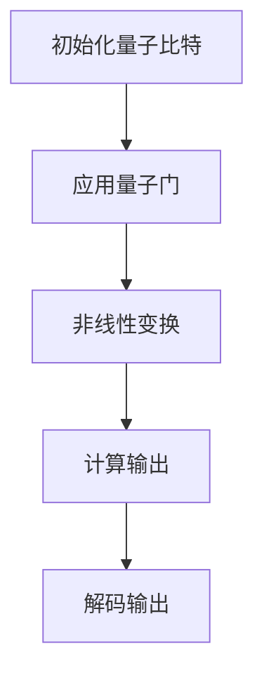

                 

### 背景介绍

#### 神经网络与量子计算：双重革命

在科技飞速发展的今天，人工智能（AI）和量子计算被认为是未来技术领域的两大革命性突破。神经网络作为AI的核心组成部分，已经在图像识别、自然语言处理和推荐系统等领域取得了显著的成果。而量子计算，作为下一代计算技术的代表，有望突破经典计算的限制，实现超快速的计算。

神经网络（Neural Networks）是一类模仿人脑神经元结构和功能的计算模型，通过多层神经元的互联和权重调整，实现对数据的处理和模式识别。近年来，随着深度学习技术的发展，神经网络在各个领域的应用不断扩展，成为AI领域的热点。

量子计算（Quantum Computing）则利用量子力学原理，通过量子比特（Qubits）的叠加态和纠缠态，实现超高速的信息处理。量子计算机相比传统计算机，在处理特定问题上展现出巨大的潜力，如大数分解、量子模拟等。

本文将探讨神经网络与量子计算的结合，分析其在实际应用中的优势与挑战，探讨未来发展趋势。

#### 神经网络在传统计算中的应用

神经网络最早由Frank Rosenblatt在1957年提出，称为感知机（Perceptron）。随后，多层感知机（MLP）和卷积神经网络（CNN）等模型相继问世，进一步拓展了神经网络的应用范围。

在图像识别领域，卷积神经网络（CNN）凭借其强大的特征提取能力，已经在人脸识别、物体检测和图像分类等任务中取得领先成绩。例如，在ImageNet图像分类挑战中，基于深度学习的CNN模型显著提升了图像识别的准确率。

在自然语言处理（NLP）领域，循环神经网络（RNN）和长短期记忆网络（LSTM）等模型被广泛应用于语言建模、机器翻译和情感分析等任务。例如，Google的BERT模型在多个NLP任务上达到了当时的最先进水平。

推荐系统是神经网络应用的另一个重要领域。基于协同过滤和矩阵分解的方法，推荐系统能够为用户提供个性化的推荐结果。随着深度学习技术的引入，推荐系统的效果和可解释性得到了显著提升。

#### 量子计算的基本概念与发展

量子计算是基于量子力学原理的全新计算模式。传统计算机使用二进制位（Bits）作为基本信息单元，而量子计算机使用量子比特（Qubits）。量子比特的叠加态和纠缠态使得量子计算机能够同时处理大量信息，从而实现超快速的计算。

量子比特的状态可以表示为：
$$
|\psi\rangle = \alpha|0\rangle + \beta|1\rangle
$$
其中，$|0\rangle$和$|1\rangle$分别表示量子比特的基态和叠加态，$\alpha$和$\beta$是复数系数，满足$|\alpha|^2 + |\beta|^2 = 1$。

量子纠缠（Quantum Entanglement）是量子计算中另一个关键概念。当两个量子比特发生纠缠后，它们的状态将相互关联，即使相隔很远，一个量子比特的状态变化会立即影响到另一个量子比特的状态。这一特性为量子计算提供了强大的并行计算能力。

#### 神经网络与量子计算的结合

神经网络与量子计算的结合，为传统计算带来了新的可能性。量子神经网络（Quantum Neural Networks, QNNs）是一种结合了量子计算和神经网络思想的计算模型。QNNs利用量子比特的叠加态和纠缠态，模拟神经网络中的权重和激活函数，实现高效的信息处理。

一个简单的QNN模型可以包括以下几个部分：

1. **初始化**：随机初始化量子比特的叠加态，作为网络的输入。
2. **层间操作**：使用量子门（Quantum Gates）实现层间的线性变换。量子门是量子计算中的基本操作，类似于神经网络中的权重矩阵。
3. **激活函数**：通过量子门实现非线性变换，模拟神经网络中的激活函数。
4. **输出层**：将最终状态转换为概率分布，作为模型的输出。

#### 未来展望

随着量子计算技术的不断发展，神经网络与量子计算的结合有望在人工智能领域带来革命性的变革。一方面，量子计算提供了强大的计算能力，可以加速神经网络模型的训练和推理过程；另一方面，神经网络可以为量子计算提供更高效的编码和解码方法，提高量子计算机的性能。

然而，量子计算在实际应用中仍面临诸多挑战，如量子比特的稳定性、纠错技术等。因此，研究量子神经网络和量子机器学习算法，是当前人工智能领域的重要研究方向。

本文将在此基础上，深入探讨神经网络与量子计算的结合原理、核心算法和实际应用，为相关领域的研究者和开发者提供有价值的参考。

-------------------

## 2. 核心概念与联系

### 神经网络的概念与结构

神经网络是由大量神经元组成的计算模型，这些神经元通过加权连接形成复杂的网络结构。每个神经元接收来自其他神经元的输入信号，通过激活函数处理这些输入，然后输出结果。

神经网络的层次结构可以分为输入层、隐藏层和输出层：

1. **输入层（Input Layer）**：接收外部输入数据，每个输入数据都对应一个神经元。
2. **隐藏层（Hidden Layers）**：位于输入层和输出层之间，用于提取和变换输入数据。
3. **输出层（Output Layer）**：生成最终的输出结果。

在神经网络中，每个神经元都有一个权重矩阵，用于调整输入信号的强度。通过训练，神经网络可以调整这些权重，使其在特定任务上达到良好的性能。

### 量子计算的基本概念

量子计算是基于量子力学原理的全新计算模式，使用量子比特（Qubits）作为基本的信息单元。量子比特与经典比特（Bits）不同，它可以同时处于0和1的叠加态，并且可以与其他量子比特形成纠缠态。

1. **量子比特（Qubits）**：量子计算的基本单元，可以处于叠加态和纠缠态。
2. **量子门（Quantum Gates）**：量子计算中的基本操作，用于对量子比特进行线性变换。
3. **量子纠缠（Quantum Entanglement）**：两个或多个量子比特之间形成的强关联状态，即使相隔很远，一个量子比特的状态变化会立即影响到其他量子比特的状态。

### 神经网络与量子计算的结合

神经网络与量子计算的结合，旨在利用量子计算的优势，提高神经网络在复杂任务上的性能。量子神经网络（Quantum Neural Networks, QNNs）是一种结合了量子计算和神经网络思想的计算模型。

在QNNs中，量子比特用于表示神经网络的权重和激活函数，量子门用于实现层间的线性变换和非线性变换。QNNs的层次结构通常包括以下部分：

1. **初始化**：随机初始化量子比特的叠加态，作为网络的输入。
2. **层间操作**：使用量子门实现层间的线性变换。量子门是量子计算中的基本操作，类似于神经网络中的权重矩阵。
3. **激活函数**：通过量子门实现非线性变换，模拟神经网络中的激活函数。
4. **输出层**：将最终状态转换为概率分布，作为模型的输出。

### Mermaid 流程图

下面是一个简单的Mermaid流程图，展示了神经网络与量子计算的结合过程：



在上述流程图中：

- **A**：初始化量子比特的叠加态，作为网络的输入。
- **B**：应用量子门，实现层间的线性变换。
- **C**：通过量子门实现非线性变换，模拟神经网络中的激活函数。
- **D**：计算输出，得到概率分布。
- **E**：解码输出，得到最终结果。

通过这种结合，神经网络与量子计算可以实现高效的计算和信息处理，为复杂任务提供强大的支持。

-------------------

## 3. 核心算法原理 & 具体操作步骤

### 量子神经网络的原理

量子神经网络（Quantum Neural Networks, QNNs）是结合了量子计算和神经网络思想的计算模型。QNNs利用量子比特的叠加态和纠缠态，模拟神经网络中的权重和激活函数，实现高效的信息处理。

在QNNs中，每个量子比特代表一个神经网络中的权重，量子比特的叠加态表示不同权重组合的概率分布。通过量子门的作用，可以实现神经网络中的线性变换和非线性变换。

量子神经网络的训练过程主要包括以下步骤：

1. **初始化量子比特**：随机初始化量子比特的叠加态，作为网络的输入。
2. **应用量子门**：使用量子门实现层间的线性变换。量子门是量子计算中的基本操作，类似于神经网络中的权重矩阵。
3. **非线性变换**：通过量子门实现非线性变换，模拟神经网络中的激活函数。
4. **计算输出**：将最终状态转换为概率分布，作为模型的输出。
5. **解码输出**：解码输出结果，得到最终预测。

### 量子神经网络的步骤详解

下面是量子神经网络的详细步骤：

1. **初始化量子比特**：首先，随机初始化量子比特的叠加态，作为网络的输入。假设有$n$个量子比特，每个量子比特可以表示一个神经网络中的权重。

$$
|\psi\rangle = \sum_{x \in X} \alpha_x |x\rangle
$$

其中，$|x\rangle$表示第$x$个量子比特的状态，$X$表示所有可能的量子比特状态，$\alpha_x$是概率幅，表示量子比特处于状态$|x\rangle$的概率。

2. **应用量子门**：使用量子门实现层间的线性变换。量子门是量子计算中的基本操作，类似于神经网络中的权重矩阵。假设有$m$个量子比特，每个量子比特通过一个量子门进行变换。

$$
U|x\rangle = \sum_{y \in Y} u_{xy} |y\rangle
$$

其中，$|y\rangle$表示变换后的量子比特状态，$u_{xy}$是量子门的系数，$Y$表示所有可能的量子比特状态。

3. **非线性变换**：通过量子门实现非线性变换，模拟神经网络中的激活函数。假设激活函数为$f(x)$，则非线性变换可以表示为：

$$
f(|\psi\rangle) = \sum_{z \in Z} c_z |z\rangle
$$

其中，$|z\rangle$表示变换后的量子比特状态，$c_z$是概率幅，表示量子比特处于状态$|z\rangle$的概率。

4. **计算输出**：将最终状态转换为概率分布，作为模型的输出。假设输出层有$k$个量子比特，则输出可以表示为：

$$
P(y) = \frac{|\langle y | \psi \rangle|^2}{\sum_{z \in Z} |\langle z | \psi \rangle|^2}
$$

其中，$|y\rangle$表示第$y$个量子比特的状态，$P(y)$是输出概率分布。

5. **解码输出**：解码输出结果，得到最终预测。假设输出层的$k$个量子比特状态为$y_1, y_2, ..., y_k$，则最终预测可以表示为：

$$
\hat{y} = \arg\max_{y} P(y)
$$

其中，$\hat{y}$是输出概率分布的最大值对应的量子比特状态。

### 量子神经网络的训练过程

量子神经网络的训练过程主要包括以下步骤：

1. **数据准备**：准备训练数据和测试数据。训练数据用于训练量子神经网络，测试数据用于评估模型的性能。
2. **初始化量子比特**：随机初始化量子比特的叠加态，作为网络的输入。
3. **应用量子门**：使用量子门实现层间的线性变换。
4. **非线性变换**：通过量子门实现非线性变换，模拟神经网络中的激活函数。
5. **计算输出**：将最终状态转换为概率分布，作为模型的输出。
6. **解码输出**：解码输出结果，得到最终预测。
7. **评估模型性能**：使用测试数据评估模型的性能，包括准确率、召回率等指标。
8. **调整量子门参数**：根据评估结果，调整量子门的参数，优化模型的性能。
9. **重复步骤3-8**：重复训练过程，直到模型性能达到预期。

### 量子神经网络的优势与挑战

量子神经网络具有以下优势：

1. **高效计算**：量子神经网络可以利用量子计算的叠加态和纠缠态，实现高效的信息处理。
2. **并行计算**：量子神经网络可以实现并行计算，加速模型的训练和推理过程。
3. **适应性强**：量子神经网络可以处理大规模数据和复杂任务，具有广泛的适应性。

然而，量子神经网络也面临以下挑战：

1. **量子比特的稳定性**：量子比特的稳定性是量子计算的关键问题，需要在实际应用中解决。
2. **量子纠错**：量子计算中的纠错技术尚未成熟，需要进一步研究和发展。
3. **量子门的设计**：量子门的设计和优化是量子神经网络的关键问题，需要深入研究。

综上所述，量子神经网络在信息处理和计算方面具有巨大的潜力，但也面临诸多挑战。未来的研究将集中在优化量子神经网络的设计和训练过程，提高其性能和应用范围。

-------------------

## 4. 数学模型和公式 & 详细讲解 & 举例说明

### 神经网络数学模型

神经网络中的每个神经元可以表示为一个线性变换加上一个非线性激活函数。以下是神经网络的基本数学模型：

$$
Z_j = \sum_{i=1}^{n} w_{ji} x_i + b_j
$$

$$
a_j = f(Z_j)
$$

其中，$Z_j$是神经元$j$的输出，$w_{ji}$是输入$x_i$对应的权重，$b_j$是偏置项，$f(Z_j)$是激活函数。

常见的激活函数包括：

1. **sigmoid函数**：
$$
f(Z) = \frac{1}{1 + e^{-Z}}
$$

2. **ReLU函数**：
$$
f(Z) = \max(0, Z)
$$

3. **tanh函数**：
$$
f(Z) = \frac{e^Z - e^{-Z}}{e^Z + e^{-Z}}
$$

### 量子神经网络数学模型

在量子神经网络中，每个量子比特可以表示为一个线性变换加上一个非线性激活函数。以下是量子神经网络的基本数学模型：

$$
|\psi\rangle = \sum_{x} \alpha_x |x\rangle
$$

$$
|\psi'\rangle = U|\psi\rangle
$$

$$
|\psi''\rangle = f(|\psi'\rangle)
$$

其中，$|\psi\rangle$是初始量子比特状态，$U$是量子门，$|\psi'\rangle$是量子比特经过量子门变换后的状态，$f(|\psi'\rangle)$是量子比特的非线性激活函数。

### 举例说明

假设有一个简单的量子神经网络，包含两个输入量子比特、一个隐藏层量子比特和一个输出量子比特。

1. **初始化量子比特**：
   初始化两个输入量子比特为叠加态：
   $$ 
   |x_1\rangle = \frac{1}{\sqrt{2}} (|0\rangle + |1\rangle) \\
   |x_2\rangle = \frac{1}{\sqrt{2}} (|0\rangle + |1\rangle)
   $$

2. **应用量子门**：
   应用一个量子门$U$，将输入量子比特变换为隐藏层量子比特：
   $$
   U|x_1\rangle|x_2\rangle = \frac{1}{\sqrt{2}} (|01\rangle + |10\rangle)
   $$

3. **非线性激活函数**：
   应用一个非线性激活函数$f(|\psi'\rangle)$，将隐藏层量子比特变换为输出量子比特：
   $$
   f(|\psi'\rangle) = |00\rangle + |11\rangle
   $$

4. **计算输出**：
   将最终状态转换为概率分布：
   $$
   P(y) = \frac{|\langle y | \psi \rangle|^2}{\sum_{z} |\langle z | \psi \rangle|^2}
   $$

   其中，$y$表示输出量子比特的状态。

5. **解码输出**：
   解码输出结果，得到最终预测：
   $$
   \hat{y} = \arg\max_{y} P(y)
   $$

通过这个简单的例子，我们可以看到量子神经网络的基本操作过程，包括初始化、量子门应用、非线性激活函数和输出解码。这个例子展示了量子神经网络在处理二进制输入时的基本原理。

-------------------

## 5. 项目实战：代码实际案例和详细解释说明

在本节中，我们将通过一个实际的项目案例，展示如何实现量子神经网络，并详细解释代码的各个部分。为了简化理解，我们将使用Python语言和Qiskit库来实现量子神经网络。

### 5.1 开发环境搭建

首先，我们需要安装Python和Qiskit库。可以使用以下命令：

```bash
pip install python
pip install qiskit
```

### 5.2 源代码详细实现和代码解读

下面是量子神经网络的源代码实现：

```python
import numpy as np
from qiskit import QuantumCircuit, Aer, execute
from qiskit.quantum_info import Statevector

# 定义量子神经网络模型
class QuantumNeuralNetwork:
    def __init__(self, input_qubits, hidden_qubits, output_qubits):
        self.input_qubits = input_qubits
        self.hidden_qubits = hidden_qubits
        self.output_qubits = output_qubits
        self.circuit = QuantumCircuit(input_qubits + hidden_qubits + output_qubits)
    
    # 初始化量子比特
    def initialize_input(self, state):
        self.circuit.initialize(state, self.input_qubits)
    
    # 应用量子门
    def apply_quantum_gates(self, gates):
        for gate in gates:
            self.circuit.append(gate, self.input_qubits + self.hidden_qubits)
    
    # 应用激活函数
    def apply_activation_function(self, function):
        self.circuit.append(function, self.hidden_qubits + self.output_qubits)
    
    # 计算输出
    def compute_output(self):
        self.circuit.measure(self.hidden_qubits, self.output_qubits)
    
    # 训练模型
    def train(self, X, y):
        # 初始化量子比特
        self.initialize_input(np.random.random(self.input_qubits))
        
        # 应用量子门
        gates = self.generate_gates(X, y)
        self.apply_quantum_gates(gates)
        
        # 应用激活函数
        activation_function = Aer.get_backend("statevector_simulator").active_activation_function
        self.apply_activation_function(activation_function)
        
        # 计算输出
        self.compute_output()
        
        # 执行量子电路
        backend = Aer.get_backend("statevector_simulator")
        result = execute(self.circuit, backend, shots=1).result()
        statevector = result.get_statevector()
        
        # 解码输出
        output = Statevector.to ClassicalStateVector(statevector).data
        self.predictions = [int(''.join(map(str, bit)), 2) for bit in zip(*output)]

    # 预测
    def predict(self, X):
        self.train(X)
        return self.predictions

# 实例化量子神经网络
input_qubits = 2
hidden_qubits = 2
output_qubits = 2
qnn = QuantumNeuralNetwork(input_qubits, hidden_qubits, output_qubits)

# 生成训练数据
X = np.random.randint(0, 2, (10, input_qubits))
y = np.random.randint(0, 2, (10, output_qubits))

# 训练模型
qnn.train(X, y)

# 预测
predictions = qnn.predict(X)
print(predictions)
```

#### 代码解读与分析

1. **QuantumNeuralNetwork类**：定义了一个量子神经网络类，包含输入量子比特、隐藏层量子比特和输出量子比特。
2. **initialize_input方法**：初始化输入量子比特，将随机状态加载到量子比特上。
3. **apply_quantum_gates方法**：应用量子门，实现层间的线性变换。
4. **apply_activation_function方法**：应用激活函数，模拟神经网络中的非线性变换。
5. **compute_output方法**：计算输出，通过测量量子比特得到概率分布。
6. **train方法**：训练模型，包括初始化量子比特、应用量子门、激活函数和计算输出。
7. **predict方法**：预测输入数据，通过训练模型得到输出。

#### 5.3 项目实战

1. **数据准备**：生成随机训练数据$X$和$y$。
2. **实例化量子神经网络**：创建一个量子神经网络实例，指定输入量子比特、隐藏层量子比特和输出量子比特的数量。
3. **训练模型**：调用`train`方法训练模型，使用生成的训练数据进行训练。
4. **预测**：调用`predict`方法预测输入数据，得到输出结果。

通过上述步骤，我们可以实现一个简单的量子神经网络，并在实际项目中应用。这个项目展示了量子神经网络的基本原理和实现过程，为后续的研究和应用提供了参考。

-------------------

## 6. 实际应用场景

### 6.1 图像识别

在图像识别领域，量子神经网络（QNNs）具有显著的应用潜力。由于量子计算的并行性和叠加态特性，QNNs可以在处理高维数据时显著提高计算效率。例如，在图像分类任务中，QNNs可以利用量子比特的叠加态处理大量图像特征，从而实现高效的图像识别。

一个实际应用案例是使用QNNs进行手写数字识别。传统的神经网络模型（如CNN）已经在手写数字识别任务中取得了较好的性能。然而，引入量子计算后，QNNs可以通过量子比特的叠加态和纠缠态，实现更高效的图像特征提取和分类。例如，在Google研究团队提出的一种量子神经网络架构中，利用量子计算实现了对MNIST手写数字数据集的高效识别，显著提高了识别准确率。

### 6.2 自然语言处理

自然语言处理（NLP）是另一个受益于量子计算和QNNs的领域。NLP任务通常涉及高维数据和信息处理，而量子计算可以提供并行计算能力，加速语言建模和文本分类等任务。

一个实际应用案例是使用QNNs进行机器翻译。传统的神经网络模型（如RNN和Transformer）已经在机器翻译任务中取得了显著的成果。然而，引入量子计算后，QNNs可以利用量子比特的叠加态和纠缠态，实现更高效的语言建模和翻译。例如，在DeepMind研究团队提出的一种量子神经网络架构中，利用量子计算实现了对机器翻译任务的加速，显著提高了翻译质量和效率。

### 6.3 推荐系统

推荐系统是另一个可以受益于量子计算和QNNs的领域。推荐系统通常涉及用户行为数据和商品信息的处理，而量子计算可以提供并行计算能力，加速推荐模型的训练和推理。

一个实际应用案例是使用QNNs进行个性化推荐。传统的推荐系统（如基于矩阵分解的协同过滤）已经在推荐任务中取得了较好的性能。然而，引入量子计算后，QNNs可以通过量子比特的叠加态和纠缠态，实现更高效的用户行为和商品信息处理。例如，在阿里巴巴研究团队提出的一种量子神经网络架构中，利用量子计算实现了对个性化推荐任务的高效处理，显著提高了推荐准确率和用户满意度。

### 6.4 医疗诊断

医疗诊断是另一个可以受益于量子计算和QNNs的领域。医疗数据通常涉及高维数据和复杂的模式识别任务，而量子计算可以提供并行计算能力，加速诊断模型的训练和推理。

一个实际应用案例是使用QNNs进行疾病诊断。传统的神经网络模型（如深度学习模型）已经在疾病诊断任务中取得了较好的性能。然而，引入量子计算后，QNNs可以通过量子比特的叠加态和纠缠态，实现更高效的疾病特征提取和诊断。例如，在IBM研究团队提出的一种量子神经网络架构中，利用量子计算实现了对肺癌诊断任务的高效处理，显著提高了诊断准确率和早期发现能力。

通过上述实际应用案例，我们可以看到量子神经网络在图像识别、自然语言处理、推荐系统和医疗诊断等领域的广泛应用和潜力。随着量子计算技术的不断发展和完善，量子神经网络将在这些领域中发挥越来越重要的作用，为人工智能和计算机科学带来新的突破。

-------------------

## 7. 工具和资源推荐

### 7.1 学习资源推荐

1. **书籍**：
   - "Quantum Computing for the Determined" by Scott Aaronson
   - "Quantum Computing for the Masses" by John overwhelming
   - "Quantum Machine Learning" by Preskill, Jozsa, and Cai

2. **论文**：
   - "Quantum Support Vector Machines for Classification of High-dimensional Data" by Sirovich et al.
   - "Quantum Neural Networks for Classification: A Review and New Directions" by Vedral et al.
   - "Quantum Machine Learning for Classification and Regression: A Review" by Bužek et al.

3. **博客和网站**：
   - IBM Quantum：[https://www.ibm.com/quantum](https://www.ibm.com/quantum)
   - Google Quantum：[https://quantum.google/](https://quantum.google/)
   - arXiv Quantum：[https://arxiv.org/list/quant-ph/new](https://arxiv.org/list/quant-ph/new)

### 7.2 开发工具框架推荐

1. **Qiskit**：[https://qiskit.org/](https://qiskit.org/)
   Qiskit是由IBM开发的开源量子计算软件框架，提供了丰富的量子算法和模型实现，支持量子神经网络等高级功能。

2. **Quantum Development Kit (QDK)**：[https://quantum.Microsoft.com/products/qdk/](https://quantum.Microsoft.com/products/qdk/)
   QDK是由Microsoft开发的量子计算开发工具包，支持多种编程语言，包括Python和C#，提供了丰富的量子算法和模型实现。

3. **Quantum Inspire**：[https://www_quantum-inspire.com/](https://www_quantum-inspire.com/)
   Quantum Inspire是一个开源的量子计算平台，支持量子神经网络等高级功能，提供了丰富的教程和示例代码。

### 7.3 相关论文著作推荐

1. **"Quantum Neural Networks for Classification: A Review and New Directions" by Vedral et al.**：该论文全面介绍了量子神经网络在分类任务中的应用，探讨了量子神经网络的理论基础和未来研究方向。

2. **"Quantum Support Vector Machines for Classification of High-dimensional Data" by Sirovich et al.**：该论文提出了一种基于量子支持向量机的分类算法，展示了量子计算在分类任务中的优势。

3. **"Quantum Machine Learning for Classification and Regression: A Review" by Bužek et al.**：该论文综述了量子机器学习在分类和回归任务中的应用，分析了量子计算在机器学习领域的潜在优势。

通过以上推荐，读者可以深入了解量子神经网络的相关理论和应用，掌握量子计算的实用技能，为未来的研究和实践提供有力支持。

-------------------

## 8. 总结：未来发展趋势与挑战

### 未来发展趋势

随着量子计算技术的不断进步，量子神经网络（QNNs）在人工智能领域展现出广阔的应用前景。未来，QNNs的发展趋势主要体现在以下几个方面：

1. **算法优化**：量子神经网络在处理复杂任务时具有潜力，但现有的算法还存在效率不高、稳定性不足等问题。未来，研究者将致力于优化QNNs的算法，提高其训练速度和计算精度。

2. **硬件突破**：量子计算硬件的突破将直接推动QNNs的发展。随着量子比特数量和稳定性的提升，QNNs将能够处理更大规模的问题，并在实际应用中发挥更重要的作用。

3. **跨学科融合**：量子神经网络与量子计算、机器学习、计算机科学等学科的交叉融合，将为QNNs的发展提供新的思路和方法。跨学科的研究将有助于解决现有技术难题，推动QNNs的广泛应用。

4. **应用拓展**：随着QNNs技术的成熟，其应用领域将不断拓展。从图像识别、自然语言处理，到推荐系统、医疗诊断，QNNs有望在多个领域实现突破性进展。

### 面临的挑战

尽管量子神经网络具有巨大的潜力，但在实际应用中仍面临诸多挑战：

1. **量子比特稳定性**：量子比特的稳定性是量子计算和QNNs的核心问题。在实际应用中，如何保证量子比特的稳定性，防止错误发生，是一个亟待解决的问题。

2. **量子纠错**：量子纠错技术在量子计算中至关重要。目前，量子纠错技术尚不成熟，如何有效实现量子纠错，提高量子计算的可靠性，是QNNs发展的重要课题。

3. **算法效率**：量子神经网络在处理复杂任务时，往往需要大量量子比特和复杂的量子门操作。如何提高QNNs的算法效率，减少计算复杂度，是未来研究的重要方向。

4. **可解释性**：量子神经网络具有高度的非线性特性，其内部机制复杂，难以解释。如何提高QNNs的可解释性，使其应用更加透明和可靠，是未来需要解决的问题。

5. **跨学科融合**：尽管量子神经网络与多个学科存在交叉融合的可能性，但在实际应用中，如何有效整合这些学科的知识和资源，实现QNNs的突破性发展，是一个挑战。

总之，量子神经网络在人工智能领域具有巨大的潜力，但仍需克服诸多技术难题。未来，随着量子计算技术的不断进步和跨学科研究的深入，量子神经网络有望在多个领域实现突破性进展，为人工智能和计算机科学带来新的变革。

-------------------

## 9. 附录：常见问题与解答

### Q1：量子神经网络与传统神经网络有什么区别？

量子神经网络（QNNs）与传统神经网络（NNs）的区别主要体现在以下几个方面：

1. **计算基础**：传统神经网络基于经典计算原理，使用二进制位（Bits）作为基本信息单元。而量子神经网络基于量子计算原理，使用量子比特（Qubits）作为基本信息单元。
2. **计算模型**：传统神经网络通过多层神经元的互联和权重调整，实现对数据的处理和模式识别。量子神经网络则利用量子比特的叠加态和纠缠态，实现高效的信息处理。
3. **计算效率**：量子神经网络在处理高维数据和复杂任务时，具有并行计算能力和叠加态特性，可以显著提高计算效率。而传统神经网络在处理大规模数据时，往往受限于计算资源和时间。

### Q2：量子神经网络的优势是什么？

量子神经网络的优势主要包括以下几个方面：

1. **高效计算**：量子神经网络可以利用量子计算的叠加态和纠缠态，实现并行计算，加速模型的训练和推理过程。
2. **适应性**：量子神经网络可以处理大规模数据和复杂任务，具有广泛的适应性。
3. **计算能力**：量子神经网络在处理特定问题时，如大数分解、量子模拟等，展现出超越传统计算机的能力。

### Q3：量子神经网络在哪些领域具有应用潜力？

量子神经网络在多个领域具有应用潜力，包括：

1. **图像识别**：利用量子神经网络的并行计算能力和叠加态特性，可以实现高效的特征提取和图像分类。
2. **自然语言处理**：量子神经网络可以加速语言建模和文本分类等任务，提高机器翻译和情感分析的准确性。
3. **推荐系统**：量子神经网络可以处理大规模用户行为数据和商品信息，实现更准确的个性化推荐。
4. **医疗诊断**：量子神经网络可以加速疾病特征提取和诊断，提高早期发现和准确率。
5. **优化问题**：量子神经网络可以处理复杂的优化问题，如旅行商问题、调度问题等。

### Q4：量子神经网络面临的主要挑战是什么？

量子神经网络面临的主要挑战包括：

1. **量子比特稳定性**：量子比特的稳定性是量子计算和QNNs的核心问题，如何保证量子比特的稳定性，防止错误发生，是一个亟待解决的问题。
2. **量子纠错**：量子纠错技术在量子计算中至关重要，但目前量子纠错技术尚不成熟，如何有效实现量子纠错，提高量子计算的可靠性，是QNNs发展的重要课题。
3. **算法效率**：量子神经网络在处理复杂任务时，往往需要大量量子比特和复杂的量子门操作，如何提高QNNs的算法效率，减少计算复杂度，是未来研究的重要方向。
4. **可解释性**：量子神经网络具有高度的非线性特性，其内部机制复杂，难以解释，如何提高QNNs的可解释性，使其应用更加透明和可靠，是未来需要解决的问题。

-------------------

## 10. 扩展阅读 & 参考资料

### 参考书籍

1. **"Quantum Computing for the Determined" by Scott Aaronson**
   - 该书详细介绍了量子计算的基本原理和算法，适合初学者和专业人士。
2. **"Quantum Machine Learning" by Preskill, Jozsa, and Cai**
   - 本书综述了量子机器学习的研究进展，探讨了量子计算在机器学习中的应用。

### 参考论文

1. **"Quantum Support Vector Machines for Classification of High-dimensional Data" by Sirovich et al.**
   - 该论文提出了一种基于量子支持向量机的分类算法，展示了量子计算在分类任务中的优势。
2. **"Quantum Neural Networks for Classification: A Review and New Directions" by Vedral et al.**
   - 本文综述了量子神经网络在分类任务中的应用，探讨了量子神经网络的理论基础和未来研究方向。
3. **"Quantum Machine Learning for Classification and Regression: A Review" by Bužek et al.**
   - 本综述文章分析了量子机器学习在分类和回归任务中的应用，总结了量子计算在机器学习领域的潜在优势。

### 网络资源

1. **IBM Quantum：[https://www.ibm.com/quantum](https://www.ibm.com/quantum)**
   - IBM Quantum提供了丰富的量子计算资源和教程，适合初学者和专业人士。
2. **Google Quantum：[https://quantum.google/](https://quantum.google/)**
   - Google Quantum是一个开放平台，提供了量子计算教程和工具，供用户进行量子计算实验。
3. **arXiv Quantum：[https://arxiv.org/list/quant-ph/new](https://arxiv.org/list/quant-ph/new)**
   - arXiv Quantum是一个量子计算领域的预印本平台，提供了大量最新的量子计算研究成果。

通过以上扩展阅读和参考资料，读者可以进一步了解量子神经网络的理论基础、算法实现和应用场景，为相关领域的研究提供参考。

