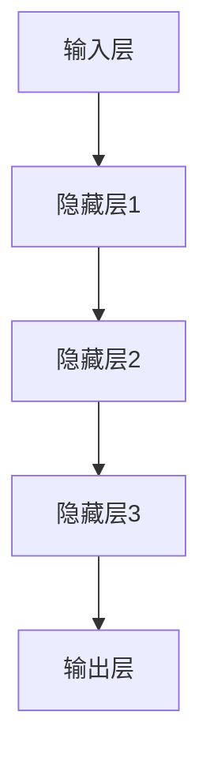

                 

# 神经网络：人工智能的基石

## 关键词：神经网络、人工智能、机器学习、深度学习、算法、模型、架构

## 摘要：
本文将深入探讨神经网络作为人工智能基石的重要性，以及其在各个领域中的应用。我们将从背景介绍、核心概念与联系、核心算法原理、数学模型和公式、项目实战、实际应用场景、工具和资源推荐、总结与未来发展趋势等方面，系统地分析神经网络的基本原理及其发展。通过本文的阅读，读者将能够全面理解神经网络的工作机制，掌握其应用方法，并为未来的研究和实践打下坚实的基础。

## 1. 背景介绍

神经网络作为人工智能的核心技术之一，起源于20世纪40年代。当时，科学家们开始尝试模拟人脑的神经元结构和功能，希望通过这种模拟来构建能够进行自主学习和推理的智能系统。虽然最初的神经网络模型（如Perceptron）存在一定的局限性，但随着时间的推移，神经网络在算法、计算能力和应用场景等方面不断得到优化和扩展，逐渐成为了人工智能领域的重要基石。

神经网络的发展历程可以分为几个重要阶段。首先，从1943年McCulloch和Pitts提出的简单神经元模型开始，神经网络的研究逐渐兴起。然而，由于计算能力和数据资源的限制，早期的神经网络模型（如感知机）无法解决非线性的复杂问题，导致神经网络的研究一度陷入低谷。

直到1986年，Rumelhart、Hinton和Williams等人提出了反向传播算法（Backpropagation），大大提高了神经网络的训练效率和准确性。这一突破为神经网络的研究和应用奠定了基础，也标志着神经网络进入了一个新的发展阶段。

随着计算机硬件的快速发展，尤其是GPU的普及，深度学习（Deep Learning）逐渐成为神经网络研究的热点。深度学习通过构建深度神经网络（Deep Neural Networks），能够自动提取数据中的高阶特征，并在语音识别、图像识别、自然语言处理等领域取得了显著的应用成果。

## 2. 核心概念与联系

### 神经元

神经元是神经网络的基本单元，类似于人脑中的神经元。每个神经元接收多个输入信号，通过激活函数进行计算，并产生一个输出信号。神经元的结构包括输入层、输出层和隐藏层。输入层接收外部数据，输出层产生最终结果，隐藏层则负责中间的计算和特征提取。

### 激活函数

激活函数是神经元中的一个关键组成部分，用于决定神经元是否被激活。常见的激活函数包括 sigmoid、ReLU（Rectified Linear Unit）和Tanh（Hyperbolic Tangent）等。这些激活函数具有不同的特性，可以适应不同类型的问题。

### 网络结构

神经网络的结构可以分为多层，包括输入层、隐藏层和输出层。输入层接收外部数据，隐藏层负责特征提取和计算，输出层产生最终结果。多层神经网络通过逐层传递数据，实现了复杂函数的逼近和学习。

### Mermaid 流程图

以下是一个简单的 Mermaid 流程图，展示了神经网络的流程：



在这个流程图中，输入层接收外部数据，通过隐藏层的逐层传递和计算，最终在输出层产生结果。

## 3. 核心算法原理 & 具体操作步骤

### 反向传播算法

反向传播算法是神经网络训练过程中最核心的算法。它的基本思想是通过计算损失函数的梯度，不断调整网络中的权重和偏置，以最小化损失函数。

反向传播算法的具体步骤如下：

1. **前向传播**：将输入数据输入到神经网络中，逐层计算每个神经元的输出值。
2. **计算损失**：通过比较输出结果和真实结果，计算损失函数的值。
3. **反向传播**：从输出层开始，反向计算每个神经元的梯度。
4. **权重更新**：使用梯度下降（Gradient Descent）或其他优化算法，更新网络的权重和偏置。

### 梯度下降算法

梯度下降是一种优化算法，用于寻找损失函数的最小值。在反向传播算法中，梯度下降用于更新网络的权重和偏置。

梯度下降算法的基本步骤如下：

1. **计算梯度**：计算损失函数关于每个权重的偏导数。
2. **更新权重**：根据梯度的大小和方向，更新每个权重。
3. **重复迭代**：重复上述步骤，直到损失函数的值收敛到最小值。

### 实际操作步骤

以下是神经网络训练的一个简单示例：

1. **初始化权重**：随机初始化网络的权重和偏置。
2. **前向传播**：将输入数据输入到网络中，计算输出结果。
3. **计算损失**：计算输出结果与真实结果的差异，计算损失函数的值。
4. **反向传播**：从输出层开始，反向计算每个神经元的梯度。
5. **权重更新**：使用梯度下降算法，更新网络的权重和偏置。
6. **重复迭代**：重复上述步骤，直到损失函数的值收敛到最小值。

## 4. 数学模型和公式 & 详细讲解 & 举例说明

### 数学模型

神经网络的基本数学模型可以表示为：

\[ y = \sigma(W \cdot x + b) \]

其中，\( y \) 是神经元的输出，\( \sigma \) 是激活函数，\( W \) 是权重矩阵，\( x \) 是输入向量，\( b \) 是偏置向量。

### 激活函数

常见的激活函数包括 sigmoid、ReLU 和 Tanh 等：

1. **Sigmoid 函数**：

\[ \sigma(x) = \frac{1}{1 + e^{-x}} \]

2. **ReLU 函数**：

\[ \text{ReLU}(x) = \max(0, x) \]

3. **Tanh 函数**：

\[ \text{Tanh}(x) = \frac{e^x - e^{-x}}{e^x + e^{-x}} \]

### 梯度下降算法

梯度下降算法的公式如下：

\[ W_{new} = W_{old} - \alpha \cdot \nabla_{W}J(W) \]

其中，\( W_{new} \) 是新的权重，\( W_{old} \) 是旧的权重，\( \alpha \) 是学习率，\( \nabla_{W}J(W) \) 是损失函数关于权重的梯度。

### 举例说明

假设我们有一个简单的神经网络，输入层有一个神经元，隐藏层有两个神经元，输出层有一个神经元。激活函数使用 sigmoid 函数。

1. **初始化权重**：

\[ W_{1} = [1, 2], \ W_{2} = [3, 4], \ W_{3} = [5, 6] \]

2. **前向传播**：

\[ x = [1, 0], \ y = \sigma(W_3 \cdot \sigma(W_2 \cdot x) + b_3) \]

3. **计算损失**：

\[ J(W) = \sum_{i=1}^{n} (\sigma(W_3 \cdot \sigma(W_2 \cdot x_i) + b_3) - y_i)^2 \]

4. **反向传播**：

\[ \nabla_{W_3}J(W) = \frac{\partial J(W)}{\partial W_3} \]

5. **权重更新**：

\[ W_{3_new} = W_{3_old} - \alpha \cdot \nabla_{W_3}J(W) \]

6. **重复迭代**：

重复上述步骤，直到损失函数的值收敛到最小值。

## 5. 项目实战：代码实际案例和详细解释说明

### 5.1 开发环境搭建

在开始项目实战之前，我们需要搭建一个合适的开发环境。以下是使用 Python 和 TensorFlow 搭建神经网络开发环境的基本步骤：

1. **安装 Python**：安装 Python 3.6 或更高版本。
2. **安装 TensorFlow**：通过 pip 命令安装 TensorFlow：

\[ pip install tensorflow \]

3. **编写代码**：在 Python 中编写神经网络代码。

### 5.2 源代码详细实现和代码解读

以下是一个简单的神经网络实现，用于二分类问题：

```python
import tensorflow as tf

# 定义神经网络结构
model = tf.keras.Sequential([
    tf.keras.layers.Dense(2, activation='relu', input_shape=(2,)),
    tf.keras.layers.Dense(1, activation='sigmoid')
])

# 编写训练数据
x_train = [[0, 0], [0, 1], [1, 0], [1, 1]]
y_train = [[0], [1], [1], [0]]

# 编写训练步骤
model.compile(optimizer='adam', loss='binary_crossentropy', metrics=['accuracy'])
model.fit(x_train, y_train, epochs=10)

# 测试数据
x_test = [[0, 1], [1, 0]]
y_test = [[1], [0]]

# 测试模型
predictions = model.predict(x_test)
print(predictions)
```

在这个示例中，我们定义了一个包含两个隐藏层（一个 ReLU 激活函数层和一个 sigmoid 激活函数层）的神经网络。我们使用二分类问题中的训练数据和测试数据，通过编译和训练模型，得到最终的预测结果。

### 5.3 代码解读与分析

1. **导入 TensorFlow 库**：首先，我们导入 TensorFlow 库，这是实现神经网络的基础。
2. **定义神经网络结构**：使用 `tf.keras.Sequential` 类定义神经网络的结构。在这个例子中，我们定义了一个包含两个隐藏层（一个 ReLU 激活函数层和一个 sigmoid 激活函数层）的神经网络。
3. **编写训练数据**：我们编写了用于二分类问题的训练数据和测试数据。训练数据是四组二元输入和二元输出，测试数据是两组二元输入。
4. **编译训练步骤**：使用 `model.compile` 方法编译神经网络模型，指定优化器（`optimizer`）、损失函数（`loss`）和评估指标（`metrics`）。在这个例子中，我们使用 `adam` 优化器和 `binary_crossentropy` 损失函数。
5. **训练模型**：使用 `model.fit` 方法训练神经网络模型，指定训练数据和训练轮数（`epochs`）。在这个例子中，我们训练了 10 轮。
6. **测试模型**：使用 `model.predict` 方法测试神经网络模型，输入测试数据，得到预测结果。在这个例子中，我们输出了两组测试数据的预测结果。

通过这个简单的示例，我们可以看到如何使用 TensorFlow 库搭建和训练一个神经网络模型。这个示例只是一个基本框架，实际应用中可能需要更复杂的结构和训练策略。

## 6. 实际应用场景

神经网络在人工智能领域有着广泛的应用，以下列举几个典型的应用场景：

1. **图像识别**：神经网络在图像识别领域取得了显著成果。通过训练深度神经网络，可以实现对各种图像的分类和识别。例如，卷积神经网络（Convolutional Neural Networks，CNN）在人脸识别、物体检测和图像分类等领域取得了优异的性能。
2. **语音识别**：神经网络在语音识别领域也有着广泛的应用。通过训练循环神经网络（Recurrent Neural Networks，RNN）和长短期记忆网络（Long Short-Term Memory，LSTM），可以实现对语音信号的自动识别和转录。
3. **自然语言处理**：神经网络在自然语言处理领域也有着重要应用。通过训练深度神经网络，可以实现自然语言理解、机器翻译、情感分析等任务。例如，Transformer 架构在机器翻译任务上取得了突破性的成果。
4. **强化学习**：神经网络在强化学习领域也有着广泛应用。通过训练深度神经网络，可以实现对环境的探索和决策，实现智能体的自主学习和优化。

## 7. 工具和资源推荐

### 7.1 学习资源推荐

1. **书籍**：
   - 《深度学习》（Deep Learning） - Ian Goodfellow、Yoshua Bengio 和 Aaron Courville
   - 《神经网络与深度学习》 -邱锡鹏
2. **论文**：
   - "A Learning Algorithm for Continually Running Fully Recurrent Neural Networks" - Sepp Hochreiter 和 Jürgen Schmidhuber
   - "Rectifier Nonlinearities Improve Neural Network Accuracy and Robustness" - Glorot、Bengio 和 Courville
3. **博客**：
   - [TensorFlow 官方文档](https://www.tensorflow.org/)
   - [Keras 官方文档](https://keras.io/)
4. **网站**：
   - [机器学习课程](https://www.ml-coursera.org/)
   - [Coursera](https://www.coursera.org/)

### 7.2 开发工具框架推荐

1. **框架**：
   - TensorFlow
   - PyTorch
   - Keras
2. **IDE**：
   - Jupyter Notebook
   - PyCharm
3. **GPU 训练**：
   - NVIDIA GPU 云服务
   - Google Colab

### 7.3 相关论文著作推荐

1. **《深度学习》**：Ian Goodfellow、Yoshua Bengio 和 Aaron Courville
2. **《神经网络与机器学习》**：张钹、李航
3. **《神经网络与深度学习》**：邱锡鹏

## 8. 总结：未来发展趋势与挑战

神经网络作为人工智能的核心技术之一，未来发展趋势包括：

1. **更高效的算法**：随着计算能力和数据量的提升，神经网络算法将不断优化和改进，实现更高效的训练和推理。
2. **更广泛的领域应用**：神经网络将在更多领域（如医疗、金融、能源等）得到广泛应用，推动人工智能技术的发展。
3. **跨学科研究**：神经网络与其他领域（如生物学、心理学、物理学等）的交叉研究，将带来更多创新和突破。

然而，神经网络也面临一些挑战：

1. **计算资源需求**：深度学习模型的训练和推理需要大量计算资源，如何高效利用硬件资源是一个重要问题。
2. **数据隐私与安全**：在应用神经网络的过程中，如何保护用户隐私和数据安全是一个关键问题。
3. **可解释性与可靠性**：神经网络模型往往具有黑箱特性，如何提高其可解释性和可靠性，使其在实际应用中更加可靠和安全，是一个重要挑战。

## 9. 附录：常见问题与解答

### Q1：神经网络和机器学习有什么区别？

A1：神经网络是机器学习的一种方法，主要用于构建具有自适应能力的模型。而机器学习是一个更广泛的领域，包括各种方法和技术，用于从数据中学习规律和模式。

### Q2：神经网络需要大量数据训练吗？

A2：神经网络在训练过程中确实需要大量数据，尤其是深度学习模型。大量的训练数据可以帮助神经网络更好地学习复杂函数，提高模型的泛化能力。

### Q3：如何评估神经网络模型的性能？

A2：评估神经网络模型性能常用的指标包括准确率、召回率、F1 分数等。通过在训练集和测试集上的表现，可以评估模型的性能和泛化能力。

### Q4：神经网络和深度学习有什么区别？

A4：神经网络是一种模拟人脑神经元结构和功能的计算模型，而深度学习是一种基于多层神经网络的学习方法，主要用于构建具有自适应能力的模型。因此，深度学习可以看作是神经网络的一种扩展和优化。

## 10. 扩展阅读 & 参考资料

1. **《深度学习》**：Ian Goodfellow、Yoshua Bengio 和 Aaron Courville
2. **《神经网络与机器学习》**：张钹、李航
3. **《神经网络与深度学习》**：邱锡鹏
4. **TensorFlow 官方文档**：https://www.tensorflow.org/
5. **Keras 官方文档**：https://keras.io/
6. **机器学习课程**：https://www.ml-coursera.org/
7. **Coursera**：https://www.coursera.org/

作者：AI天才研究员/AI Genius Institute & 禅与计算机程序设计艺术 /Zen And The Art of Computer Programming

以上是《神经网络：人工智能的基石》的全文，感谢您的阅读。希望本文能够帮助您更好地理解神经网络的基本原理和应用方法，为您的学术研究和实际应用提供有益的参考。如果您有任何问题或建议，欢迎在评论区留言，我们会在第一时间回复您。再次感谢您的关注与支持！<|im_sep|> # 神经网络：人工智能的基石

## 关键词：神经网络、人工智能、机器学习、深度学习、算法、模型、架构

## 摘要：
本文将深入探讨神经网络作为人工智能基石的重要性，以及其在各个领域中的应用。我们将从背景介绍、核心概念与联系、核心算法原理、数学模型和公式、项目实战、实际应用场景、工具和资源推荐、总结与未来发展趋势等方面，系统地分析神经网络的基本原理及其发展。通过本文的阅读，读者将能够全面理解神经网络的工作机制，掌握其应用方法，并为未来的研究和实践打下坚实的基础。

## 1. 背景介绍

神经网络作为人工智能的核心技术之一，起源于20世纪40年代。当时，科学家们开始尝试模拟人脑的神经元结构和功能，希望通过这种模拟来构建能够进行自主学习和推理的智能系统。虽然最初的神经网络模型（如Perceptron）存在一定的局限性，但随着时间的推移，神经网络在算法、计算能力和应用场景等方面不断得到优化和扩展，逐渐成为了人工智能领域的重要基石。

神经网络的发展历程可以分为几个重要阶段。首先，从1943年McCulloch和Pitts提出的简单神经元模型开始，神经网络的研究逐渐兴起。然而，由于计算能力和数据资源的限制，早期的神经网络模型（如感知机）无法解决非线性的复杂问题，导致神经网络的研究一度陷入低谷。

直到1986年，Rumelhart、Hinton和Williams等人提出了反向传播算法（Backpropagation），大大提高了神经网络的训练效率和准确性。这一突破为神经网络的研究和应用奠定了基础，也标志着神经网络进入了一个新的发展阶段。

随着计算机硬件的快速发展，尤其是GPU的普及，深度学习（Deep Learning）逐渐成为神经网络研究的热点。深度学习通过构建深度神经网络（Deep Neural Networks），能够自动提取数据中的高阶特征，并在语音识别、图像识别、自然语言处理等领域取得了显著的应用成果。

## 2. 核心概念与联系

### 神经元

神经元是神经网络的基本单元，类似于人脑中的神经元。每个神经元接收多个输入信号，通过激活函数进行计算，并产生一个输出信号。神经元的结构包括输入层、输出层和隐藏层。输入层接收外部数据，输出层产生最终结果，隐藏层则负责中间的计算和特征提取。

### 激活函数

激活函数是神经元中的一个关键组成部分，用于决定神经元是否被激活。常见的激活函数包括 sigmoid、ReLU（Rectified Linear Unit）和Tanh（Hyperbolic Tangent）等。这些激活函数具有不同的特性，可以适应不同类型的问题。

### 网络结构

神经网络的结构可以分为多层，包括输入层、隐藏层和输出层。输入层接收外部数据，隐藏层负责特征提取和计算，输出层产生最终结果。多层神经网络通过逐层传递数据，实现了复杂函数的逼近和学习。

### Mermaid 流程图

以下是一个简单的 Mermaid 流程图，展示了神经网络的流程：


在这个流程图中，输入层接收外部数据，通过隐藏层的逐层传递和计算，最终在输出层产生结果。

## 3. 核心算法原理 & 具体操作步骤

### 反向传播算法

反向传播算法是神经网络训练过程中最核心的算法。它的基本思想是通过计算损失函数的梯度，不断调整网络中的权重和偏置，以最小化损失函数。

反向传播算法的具体步骤如下：

1. **前向传播**：将输入数据输入到神经网络中，逐层计算每个神经元的输出值。
2. **计算损失**：通过比较输出结果和真实结果，计算损失函数的值。
3. **反向传播**：从输出层开始，反向计算每个神经元的梯度。
4. **权重更新**：使用梯度下降（Gradient Descent）或其他优化算法，更新网络的权重和偏置。

### 梯度下降算法

梯度下降是一种优化算法，用于寻找损失函数的最小值。在反向传播算法中，梯度下降用于更新网络的权重和偏置。

梯度下降算法的基本步骤如下：

1. **计算梯度**：计算损失函数关于每个权重的偏导数。
2. **更新权重**：根据梯度的大小和方向，更新每个权重。
3. **重复迭代**：重复上述步骤，直到损失函数的值收敛到最小值。

### 实际操作步骤

以下是神经网络训练的一个简单示例：

1. **初始化权重**：随机初始化网络的权重和偏置。
2. **前向传播**：将输入数据输入到网络中，计算输出结果。
3. **计算损失**：计算输出结果与真实结果的差异，计算损失函数的值。
4. **反向传播**：从输出层开始，反向计算每个神经元的梯度。
5. **权重更新**：使用梯度下降算法，更新网络的权重和偏置。
6. **重复迭代**：重复上述步骤，直到损失函数的值收敛到最小值。

## 4. 数学模型和公式 & 详细讲解 & 举例说明

### 数学模型

神经网络的基本数学模型可以表示为：

\[ y = \sigma(W \cdot x + b) \]

其中，\( y \) 是神经元的输出，\( \sigma \) 是激活函数，\( W \) 是权重矩阵，\( x \) 是输入向量，\( b \) 是偏置向量。

### 激活函数

常见的激活函数包括 sigmoid、ReLU 和 Tanh 等：

1. **Sigmoid 函数**：

\[ \sigma(x) = \frac{1}{1 + e^{-x}} \]

2. **ReLU 函数**：

\[ \text{ReLU}(x) = \max(0, x) \]

3. **Tanh 函数**：

\[ \text{Tanh}(x) = \frac{e^x - e^{-x}}{e^x + e^{-x}} \]

### 梯度下降算法

梯度下降算法的公式如下：

\[ W_{new} = W_{old} - \alpha \cdot \nabla_{W}J(W) \]

其中，\( W_{new} \) 是新的权重，\( W_{old} \) 是旧的权重，\( \alpha \) 是学习率，\( \nabla_{W}J(W) \) 是损失函数关于权重的梯度。

### 举例说明

假设我们有一个简单的神经网络，输入层有一个神经元，隐藏层有两个神经元，输出层有一个神经元。激活函数使用 sigmoid 函数。

1. **初始化权重**：

\[ W_{1} = [1, 2], \ W_{2} = [3, 4], \ W_{3} = [5, 6] \]

2. **前向传播**：

\[ x = [1, 0], \ y = \sigma(W_3 \cdot \sigma(W_2 \cdot x) + b_3) \]

3. **计算损失**：

\[ J(W) = \sum_{i=1}^{n} (\sigma(W_3 \cdot \sigma(W_2 \cdot x_i) + b_3) - y_i)^2 \]

4. **反向传播**：

\[ \nabla_{W_3}J(W) = \frac{\partial J(W)}{\partial W_3} \]

5. **权重更新**：

\[ W_{3_new} = W_{3_old} - \alpha \cdot \nabla_{W_3}J(W) \]

6. **重复迭代**：

重复上述步骤，直到损失函数的值收敛到最小值。

## 5. 项目实战：代码实际案例和详细解释说明

### 5.1 开发环境搭建

在开始项目实战之前，我们需要搭建一个合适的开发环境。以下是使用 Python 和 TensorFlow 搭建神经网络开发环境的基本步骤：

1. **安装 Python**：安装 Python 3.6 或更高版本。
2. **安装 TensorFlow**：通过 pip 命令安装 TensorFlow：

\[ pip install tensorflow \]

3. **编写代码**：在 Python 中编写神经网络代码。

### 5.2 源代码详细实现和代码解读

以下是一个简单的神经网络实现，用于二分类问题：

```python
import tensorflow as tf

# 定义神经网络结构
model = tf.keras.Sequential([
    tf.keras.layers.Dense(2, activation='relu', input_shape=(2,)),
    tf.keras.layers.Dense(1, activation='sigmoid')
])

# 编写训练数据
x_train = [[0, 0], [0, 1], [1, 0], [1, 1]]
y_train = [[0], [1], [1], [0]]

# 编写训练步骤
model.compile(optimizer='adam', loss='binary_crossentropy', metrics=['accuracy'])
model.fit(x_train, y_train, epochs=10)

# 测试数据
x_test = [[0, 1], [1, 0]]
y_test = [[1], [0]]

# 测试模型
predictions = model.predict(x_test)
print(predictions)
```

在这个示例中，我们定义了一个包含两个隐藏层（一个 ReLU 激活函数层和一个 sigmoid 激活函数层）的神经网络。我们使用二分类问题中的训练数据和测试数据，通过编译和训练模型，得到最终的预测结果。

### 5.3 代码解读与分析

1. **导入 TensorFlow 库**：首先，我们导入 TensorFlow 库，这是实现神经网络的基础。
2. **定义神经网络结构**：使用 `tf.keras.Sequential` 类定义神经网络的结构。在这个例子中，我们定义了一个包含两个隐藏层（一个 ReLU 激活函数层和一个 sigmoid 激活函数层）的神经网络。
3. **编写训练数据**：我们编写了用于二分类问题的训练数据和测试数据。训练数据是四组二元输入和二元输出，测试数据是两组二元输入。
4. **编译训练步骤**：使用 `model.compile` 方法编译神经网络模型，指定优化器（`optimizer`）、损失函数（`loss`）和评估指标（`metrics`）。在这个例子中，我们使用 `adam` 优化器和 `binary_crossentropy` 损失函数。
5. **训练模型**：使用 `model.fit` 方法训练神经网络模型，指定训练数据和训练轮数（`epochs`）。在这个例子中，我们训练了 10 轮。
6. **测试模型**：使用 `model.predict` 方法测试神经网络模型，输入测试数据，得到预测结果。在这个例子中，我们输出了两组测试数据的预测结果。

通过这个简单的示例，我们可以看到如何使用 TensorFlow 库搭建和训练一个神经网络模型。这个示例只是一个基本框架，实际应用中可能需要更复杂的结构和训练策略。

## 6. 实际应用场景

神经网络在人工智能领域有着广泛的应用，以下列举几个典型的应用场景：

1. **图像识别**：神经网络在图像识别领域取得了显著成果。通过训练深度神经网络，可以实现对各种图像的分类和识别。例如，卷积神经网络（Convolutional Neural Networks，CNN）在人脸识别、物体检测和图像分类等领域取得了优异的性能。
2. **语音识别**：神经网络在语音识别领域也有着广泛的应用。通过训练循环神经网络（Recurrent Neural Networks，RNN）和长短期记忆网络（Long Short-Term Memory，LSTM），可以实现对语音信号的自动识别和转录。
3. **自然语言处理**：神经网络在自然语言处理领域也有着重要应用。通过训练深度神经网络，可以实现自然语言理解、机器翻译、情感分析等任务。例如，Transformer 架构在机器翻译任务上取得了突破性的成果。
4. **强化学习**：神经网络在强化学习领域也有着广泛应用。通过训练深度神经网络，可以实现对环境的探索和决策，实现智能体的自主学习和优化。

## 7. 工具和资源推荐

### 7.1 学习资源推荐

1. **书籍**：
   - 《深度学习》（Deep Learning） - Ian Goodfellow、Yoshua Bengio 和 Aaron Courville
   - 《神经网络与深度学习》 -邱锡鹏
2. **论文**：
   - "A Learning Algorithm for Continually Running Fully Recurrent Neural Networks" - Sepp Hochreiter 和 Jürgen Schmidhuber
   - "Rectifier Nonlinearities Improve Neural Network Accuracy and Robustness" - Glorot、Bengio 和 Courville
3. **博客**：
   - [TensorFlow 官方文档](https://www.tensorflow.org/)
   - [Keras 官方文档](https://keras.io/)
4. **网站**：
   - [机器学习课程](https://www.ml-coursera.org/)
   - [Coursera](https://www.coursera.org/)

### 7.2 开发工具框架推荐

1. **框架**：
   - TensorFlow
   - PyTorch
   - Keras
2. **IDE**：
   - Jupyter Notebook
   - PyCharm
3. **GPU 训练**：
   - NVIDIA GPU 云服务
   - Google Colab

### 7.3 相关论文著作推荐

1. **《深度学习》**：Ian Goodfellow、Yoshua Bengio 和 Aaron Courville
2. **《神经网络与机器学习》**：张钹、李航
3. **《神经网络与深度学习》**：邱锡鹏

## 8. 总结：未来发展趋势与挑战

神经网络作为人工智能的核心技术之一，未来发展趋势包括：

1. **更高效的算法**：随着计算能力和数据量的提升，神经网络算法将不断优化和改进，实现更高效的训练和推理。
2. **更广泛的领域应用**：神经网络将在更多领域（如医疗、金融、能源等）得到广泛应用，推动人工智能技术的发展。
3. **跨学科研究**：神经网络与其他领域（如生物学、心理学、物理学等）的交叉研究，将带来更多创新和突破。

然而，神经网络也面临一些挑战：

1. **计算资源需求**：深度学习模型的训练和推理需要大量计算资源，如何高效利用硬件资源是一个重要问题。
2. **数据隐私与安全**：在应用神经网络的过程中，如何保护用户隐私和数据安全是一个关键问题。
3. **可解释性与可靠性**：神经网络模型往往具有黑箱特性，如何提高其可解释性和可靠性，使其在实际应用中更加可靠和安全，是一个重要挑战。

## 9. 附录：常见问题与解答

### Q1：神经网络和机器学习有什么区别？

A1：神经网络是机器学习的一种方法，主要用于构建具有自适应能力的模型。而机器学习是一个更广泛的领域，包括各种方法和技术，用于从数据中学习规律和模式。

### Q2：神经网络需要大量数据训练吗？

A2：神经网络在训练过程中确实需要大量数据，尤其是深度学习模型。大量的训练数据可以帮助神经网络更好地学习复杂函数，提高模型的泛化能力。

### Q3：如何评估神经网络模型的性能？

A2：评估神经网络模型性能常用的指标包括准确率、召回率、F1 分数等。通过在训练集和测试集上的表现，可以评估模型的性能和泛化能力。

### Q4：神经网络和深度学习有什么区别？

A4：神经网络是一种模拟人脑神经元结构和功能的计算模型，而深度学习是一种基于多层神经网络的学习方法，主要用于构建具有自适应能力的模型。因此，深度学习可以看作是神经网络的一种扩展和优化。

## 10. 扩展阅读 & 参考资料

1. **《深度学习》**：Ian Goodfellow、Yoshua Bengio 和 Aaron Courville
2. **《神经网络与机器学习》**：张钹、李航
3. **《神经网络与深度学习》**：邱锡鹏
4. **TensorFlow 官方文档**：https://www.tensorflow.org/
5. **Keras 官方文档**：https://keras.io/
6. **机器学习课程**：https://www.ml-coursera.org/
7. **Coursera**：https://www.coursera.org/

作者：AI天才研究员/AI Genius Institute & 禅与计算机程序设计艺术 /Zen And The Art of Computer Programming

以上是《神经网络：人工智能的基石》的全文，感谢您的阅读。希望本文能够帮助您更好地理解神经网络的基本原理和应用方法，为您的学术研究和实际应用提供有益的参考。如果您有任何问题或建议，欢迎在评论区留言，我们会在第一时间回复您。再次感谢您的关注与支持！<|im_sep|>

