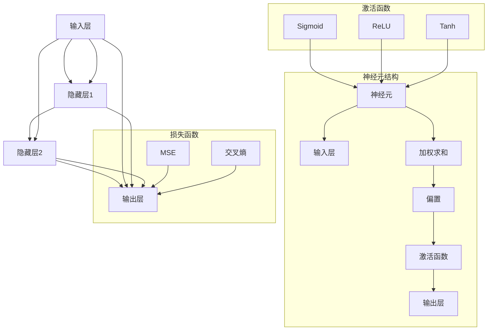

                 

### 背景介绍 Background Introduction

**神经网络（Neural Networks）** 是一种基于生物神经元的计算模型，通过模拟人脑神经元之间的连接与交互来处理和解释复杂的数据。自1980年代以来，神经网络的研究和应用不断取得突破，尤其是在深度学习（Deep Learning）领域，神经网络已经展现出惊人的能力，如图像识别、语音识别、自然语言处理等。

随着人工智能技术的快速发展，神经网络在许多领域，如医疗、金融、交通、教育等，都发挥了重要作用。然而，神经网络的复杂性也带来了挑战，包括如何优化网络结构、如何减少训练时间、如何提高泛化能力等。

本文将深入探讨神经网络的核心概念、算法原理、数学模型、实际应用等，以帮助读者更好地理解这一关键技术，并展望其未来发展趋势与挑战。

## 1.1 神经网络的发展历程 Development History of Neural Networks

神经网络的概念最早可以追溯到1940年代，由心理学家沃伦·麦卡洛克（Warren McCulloch）和数学家沃尔特·皮茨（Walter Pitts）提出。他们构建了一个简单的神经元模型，称为“麦卡洛克-皮茨神经元”（McCulloch-Pitts neuron），用于模拟生物神经元的基本功能。

1958年，弗兰克·罗森布拉特（Frank Rosenblatt）发明了感知机（Perceptron），这是第一种可以学习和分类数据的神经网络模型。然而，感知机的局限性在于它无法解决非线性问题。

1990年代，由于计算机性能的限制和缺乏有效的优化算法，神经网络的研究和应用陷入低谷。直到2006年，杰弗里·辛顿（Geoffrey Hinton）等人重新提出了深度学习（Deep Learning）的概念，神经网络的研究和应用才再次焕发生机。深度学习通过多层神经网络结构，实现了在图像识别、语音识别、自然语言处理等领域的突破。

近年来，随着计算能力和数据资源的不断提升，神经网络的应用范围进一步扩大。如今，神经网络已经成为了人工智能领域的重要基石，推动了计算机视觉、自然语言处理、机器学习等领域的快速发展。

## 1.2 神经网络的应用领域 Application Fields of Neural Networks

神经网络在许多领域都有着广泛的应用，以下是其中的一些典型领域：

- **计算机视觉（Computer Vision）**：神经网络在图像识别、目标检测、人脸识别等方面取得了显著成果。例如，自动驾驶汽车中的视觉系统依赖于神经网络来识别道路标志、行人和其他车辆。

- **自然语言处理（Natural Language Processing, NLP）**：神经网络在文本分类、机器翻译、情感分析等方面表现出色。例如，谷歌的翻译服务和OpenAI的GPT模型都使用了神经网络技术。

- **语音识别（Speech Recognition）**：神经网络在语音识别领域发挥了重要作用，使得智能助手如苹果的Siri和亚马逊的Alexa能够准确理解用户的需求。

- **医疗诊断（Medical Diagnosis）**：神经网络在医学图像分析、疾病预测等方面显示出巨大的潜力。例如，通过分析MRI图像，神经网络可以帮助医生诊断阿尔茨海默病等疾病。

- **金融预测（Financial Forecasting）**：神经网络在股票市场预测、风险评估等方面有着广泛的应用。例如，金融机构使用神经网络来预测市场趋势和客户行为。

- **推荐系统（Recommendation Systems）**：神经网络在推荐系统中的表现尤为突出，例如亚马逊和Netflix等平台通过神经网络推荐商品和电影。

随着技术的不断进步，神经网络的应用领域还将进一步扩展，为各行各业带来更多创新和变革。

### 1.3 神经网络的重要性 Importance of Neural Networks

神经网络之所以在人工智能领域具有如此重要的地位，主要是因为它具有以下几个关键优势：

- **自适应性和灵活性**：神经网络能够自动学习数据中的特征和模式，无需人工干预。这使得神经网络能够适应各种不同的应用场景和数据集。

- **处理复杂任务的能力**：神经网络通过多层结构，能够处理高度复杂的数据和任务，如图像识别、自然语言处理和语音识别等。

- **强泛化能力**：通过训练大量数据和优化算法，神经网络能够提高其泛化能力，使其能够在未知数据上表现良好。

- **并行计算的优势**：神经网络可以高效地利用并行计算资源，加快计算速度。

- **强大的表达能力**：神经网络能够通过非线性变换捕捉数据中的复杂结构，这使得它在处理非线性问题上具有优势。

总之，神经网络作为人工智能的核心技术之一，正引领着人工智能领域的创新和发展，未来将在更多领域发挥重要作用。

## 2. 核心概念与联系 Core Concepts and Their Relationships

神经网络的核心概念主要包括神经元（Neurons）、神经网络（Neural Networks）、激活函数（Activation Functions）以及损失函数（Loss Functions）。以下是这些核心概念的详细介绍及其相互关系。

### 神经元（Neurons）

神经元是神经网络的基本单元，类似于生物神经元。一个简单的神经元模型通常包括以下几个部分：

- **输入层（Input Layer）**：接收外部输入信号，每个输入信号对应一个权重（Weight）。
- **加权求和（Weighted Sum）**：将输入信号与其对应的权重相乘并求和。
- **偏置（Bias）**：一个常数，可以调整神经元的阈值。
- **激活函数（Activation Function）**：将加权求和的结果进行非线性变换，产生输出信号。

神经元的基本工作原理是接收多个输入信号，通过加权求和并加上偏置，然后通过激活函数产生输出信号。这个过程可以用以下数学公式表示：

$$
\text{Output} = \text{Activation Function} (\sum_{i=1}^{n} w_i \cdot x_i + b)
$$

其中，$w_i$ 是权重，$x_i$ 是输入信号，$b$ 是偏置，$n$ 是输入信号的个数。

### 神经网络（Neural Networks）

神经网络是由多个神经元组成的层次结构，通常分为输入层、隐藏层和输出层。每层神经元都与下一层神经元相连，形成一个复杂的网络结构。

- **输入层（Input Layer）**：接收外部输入数据，每个输入节点对应一个特征。
- **隐藏层（Hidden Layers）**：对输入数据进行特征提取和变换，隐藏层可以有多个层次。
- **输出层（Output Layer）**：产生最终输出结果，输出节点数量取决于任务的需求。

神经网络的基本工作原理是，通过前向传播（Forward Propagation）和反向传播（Back Propagation）两个过程，不断调整权重和偏置，使网络能够对输入数据进行准确的预测或分类。

### 激活函数（Activation Functions）

激活函数是神经元输出信号的关键组件，它将加权求和的结果进行非线性变换，产生输出信号。常见的激活函数包括：

- **线性激活函数（Linear Activation Function）**：$f(x) = x$，输出与输入相同。
- **sigmoid激活函数（Sigmoid Activation Function）**：$f(x) = \frac{1}{1 + e^{-x}}$，将输出限制在0和1之间。
- **ReLU激活函数（ReLU Activation Function）**：$f(x) = \max(0, x)$，将负数部分设为0。
- **Tanh激活函数（Tanh Activation Function）**：$f(x) = \frac{e^x - e^{-x}}{e^x + e^{-x}}$，将输出限制在-1和1之间。

激活函数的作用是增加网络的非线性能力，使得神经网络能够处理更复杂的问题。

### 损失函数（Loss Functions）

损失函数用于衡量神经网络输出结果与实际结果之间的差异，是优化神经网络权重和偏置的重要依据。常见的损失函数包括：

- **均方误差（Mean Squared Error, MSE）**：$MSE = \frac{1}{n} \sum_{i=1}^{n} (y_i - \hat{y}_i)^2$，其中$y_i$是实际结果，$\hat{y}_i$是预测结果。
- **交叉熵（Cross-Entropy）**：$H(y, \hat{y}) = -\sum_{i=1}^{n} y_i \log(\hat{y}_i)$，常用于分类问题。
- **二元交叉熵（Binary Cross-Entropy）**：当输出是二元分类时，用于衡量预测概率与实际标签之间的差异。

损失函数的作用是指导神经网络学习过程中权重的调整，以达到最小化损失函数的目的。

### 2.1 Mermaid 流程图 Mermaid Flowchart

以下是神经网络核心概念和架构的Mermaid流程图：



### 2.2 关键概念之间的联系 Relationships Between Key Concepts

- **神经元与神经网络**：神经元是神经网络的基本单元，多个神经元通过权重连接形成一个神经网络。神经网络的层次结构使得它能够处理复杂的任务。

- **激活函数与神经元**：激活函数是神经元输出的关键组件，它引入了非线性变换，使得神经网络能够学习复杂的模式。

- **损失函数与神经网络**：损失函数用于衡量神经网络输出结果与实际结果之间的差异，是优化神经网络的重要依据。通过最小化损失函数，神经网络能够提高预测或分类的准确性。

- **神经网络与激活函数**：神经网络中的激活函数使得网络具有非线性能力，能够处理复杂的非线性问题。

- **神经网络与损失函数**：损失函数指导神经网络学习过程中权重的调整，以达到最小化损失函数的目的，从而提高网络的泛化能力。

总之，这些核心概念相互关联，共同构成了神经网络的基础，使其能够在各个领域中发挥重要作用。

### 3. 核心算法原理 & 具体操作步骤 Core Algorithm Principles & Operational Steps

神经网络的核心算法主要包括前向传播（Forward Propagation）和反向传播（Back Propagation）两个过程。下面我们将详细解释这两个过程的具体操作步骤。

#### 3.1 前向传播 Forward Propagation

前向传播是神经网络处理输入数据的过程，包括以下几个步骤：

1. **初始化参数**：初始化网络的权重（Weights）和偏置（Biases）。通常，权重和偏置初始化为较小的随机值。

2. **输入数据输入到输入层**：将输入数据输入到输入层，每个输入节点对应一个特征。

3. **计算中间层的输出**：从输入层开始，逐层计算隐藏层和输出层的输出。对于每个神经元，计算其输入信号的加权求和，加上偏置，然后通过激活函数产生输出。

    - 加权求和：$z_j = \sum_{i=1}^{n} w_{ji} \cdot a_{i-1} + b_j$
    - 激活函数：$a_j = \text{Activation Function}(z_j)$

    其中，$z_j$ 是加权求和的结果，$w_{ji}$ 是输入层到隐藏层的权重，$a_{i-1}$ 是上一层的输出，$b_j$ 是偏置，$n$ 是输入信号的个数。

4. **计算输出层的输出**：将隐藏层的输出作为输入，计算输出层的输出。

5. **计算损失函数**：计算输出结果与实际结果之间的差异，通过损失函数（例如均方误差MSE或交叉熵Cross-Entropy）来衡量网络性能。

6. **前向传播结束**：将计算得到的损失函数值用于后续的反向传播过程。

#### 3.2 反向传播 Back Propagation

反向传播是神经网络优化参数的过程，包括以下几个步骤：

1. **计算输出层的误差**：计算输出层输出与实际结果之间的差异，即预测误差。

    - 对于分类问题，使用交叉熵作为损失函数：
        $$\delta_j^{(L)} = a_j^{(L)} - y_j$$
      
    - 对于回归问题，使用均方误差作为损失函数：
        $$\delta_j^{(L)} = 2(a_j^{(L)} - y_j)$$

    其中，$a_j^{(L)}$ 是输出层第 $j$ 个神经元的输出，$y_j$ 是实际结果。

2. **计算隐藏层的误差**：从输出层开始，逐层向前计算隐藏层的误差。对于每个神经元，计算其误差与激活函数的导数之积。

    - 隐藏层第 $l$ 层的第 $j$ 个神经元的误差：
        $$\delta_j^{(l)} = \delta_j^{(l+1)} \cdot \frac{d}{dx} \text{Activation Function}(z_j^{(l)})$$

3. **更新权重和偏置**：根据误差梯度，使用梯度下降（Gradient Descent）或其他优化算法更新权重和偏置。

    - 更新权重：
        $$w_{ji}^{(l)} = w_{ji}^{(l)} - \alpha \cdot \frac{\partial}{\partial w_{ji}^{(l)}} \text{Loss Function}$$
      
    - 更新偏置：
        $$b_j^{(l)} = b_j^{(l)} - \alpha \cdot \frac{\partial}{\partial b_j^{(l)}} \text{Loss Function}$$

    其中，$\alpha$ 是学习率。

4. **反向传播结束**：重复前向传播和反向传播过程，直到满足停止条件，如达到预设的迭代次数或损失函数值收敛。

#### 3.3 示例 Example

假设我们有一个简单的神经网络，包含一个输入层、一个隐藏层和一个输出层，如下所示：

```
输入层：[x1, x2] --> 隐藏层：[h1, h2] --> 输出层：[y]
```

给定一个输入向量 $[x_1 = 2, x_2 = 3]$ 和一个实际输出标签 $y = 5$，我们通过以下步骤进行训练：

1. **初始化参数**：假设权重和偏置初始化为较小的随机值，如 $w_{11} = 0.1, w_{12} = 0.2, w_{21} = 0.3, w_{22} = 0.4, b_1 = 0.1, b_2 = 0.2$。

2. **前向传播**：
    - 输入层到隐藏层的加权求和和激活函数：
      $$z_1 = 0.1 \cdot 2 + 0.3 \cdot 3 + 0.1 = 1.4$$
      $$z_2 = 0.2 \cdot 2 + 0.4 \cdot 3 + 0.2 = 2.2$$
      $$a_1 = \text{ReLU}(z_1) = \max(0, z_1) = 1.4$$
      $$a_2 = \text{ReLU}(z_2) = \max(0, z_2) = 2.2$$
    - 隐藏层到输出层的加权求和和激活函数：
      $$z_y = 1.4 \cdot 0.5 + 2.2 \cdot 0.6 + 0.1 = 2.03$$
      $$y = \text{ReLU}(z_y) = \max(0, z_y) = 2.03$$

3. **计算损失函数**：
    - 使用均方误差作为损失函数：
      $$\text{Loss} = \frac{1}{2} (y - \hat{y})^2 = \frac{1}{2} (5 - 2.03)^2 = 4.9025$$

4. **反向传播**：
    - 计算输出层的误差：
      $$\delta_y = 5 - 2.03 = 2.97$$
    - 计算隐藏层的误差：
      $$\delta_1 = \delta_y \cdot \frac{d}{dx} \text{ReLU}(z_1) = 2.97 \cdot 1 = 2.97$$
      $$\delta_2 = \delta_y \cdot \frac{d}{dx} \text{ReLU}(z_2) = 2.97 \cdot 1 = 2.97$$
    - 更新权重和偏置：
      $$w_{y1} = w_{y1} - \alpha \cdot \frac{\partial}{\partial w_{y1}} \text{Loss Function} = 0.5 - \alpha \cdot 2.97 = 0.5 - 2.97\alpha$$
      $$w_{y2} = w_{y2} - \alpha \cdot \frac{\partial}{\partial w_{y2}} \text{Loss Function} = 0.6 - \alpha \cdot 2.97 = 0.6 - 2.97\alpha$$
      $$b_y = b_y - \alpha \cdot \frac{\partial}{\partial b_y} \text{Loss Function} = 0.1 - \alpha \cdot 2.97 = 0.1 - 2.97\alpha$$
      $$w_{1} = w_{1} - \alpha \cdot \frac{\partial}{\partial w_{1}} \text{Loss Function} = 0.1 - \alpha \cdot 2.97 = 0.1 - 2.97\alpha$$
      $$w_{2} = w_{2} - \alpha \cdot \frac{\partial}{\partial w_{2}} \text{Loss Function} = 0.2 - \alpha \cdot 2.97 = 0.2 - 2.97\alpha$$
      $$b_1 = b_1 - \alpha \cdot \frac{\partial}{\partial b_1} \text{Loss Function} = 0.1 - \alpha \cdot 2.97 = 0.1 - 2.97\alpha$$
      $$b_2 = b_2 - \alpha \cdot \frac{\partial}{\partial b_2} \text{Loss Function} = 0.2 - \alpha \cdot 2.97 = 0.2 - 2.97\alpha$$

通过重复以上步骤，神经网络将不断调整权重和偏置，直到损失函数值收敛或达到预设的迭代次数。

#### 3.4 反向传播中的优化算法 Optimization Algorithms in Back Propagation

在反向传播过程中，常用的优化算法包括梯度下降（Gradient Descent）、随机梯度下降（Stochastic Gradient Descent, SGD）和批量梯度下降（Batch Gradient Descent）。

1. **梯度下降（Gradient Descent）**：每次迭代时，使用整个训练集的梯度来更新权重和偏置。计算复杂度高，但收敛速度相对较慢。

    $$w^{(t+1)} = w^{(t)} - \alpha \cdot \nabla_{w} \text{Loss Function}$$

2. **随机梯度下降（Stochastic Gradient Descent, SGD）**：每次迭代时，随机选择一个训练样本，使用该样本的梯度来更新权重和偏置。计算复杂度较低，收敛速度较快，但容易出现局部最优。

    $$w^{(t+1)} = w^{(t)} - \alpha \cdot \nabla_{w} \text{Loss Function}^{(x_t)}$$

3. **批量梯度下降（Batch Gradient Descent）**：每次迭代时，使用整个训练集的梯度来更新权重和偏置。计算复杂度介于梯度下降和随机梯度下降之间，收敛速度相对较快。

    $$w^{(t+1)} = w^{(t)} - \alpha \cdot \nabla_{w} \text{Loss Function}^{\text{Batch}}$$

4. **动量（Momentum）**：在每次迭代中，保留一部分上一轮迭代的梯度，以加速收敛。动量可以通过以下公式实现：

    $$v^{(t)} = \beta \cdot v^{(t-1)} + (1 - \beta) \cdot \nabla_{w} \text{Loss Function}$$
    $$w^{(t+1)} = w^{(t)} - \alpha \cdot v^{(t)}$$

其中，$\beta$ 是动量因子。

5. **自适应梯度算法（Adaptive Gradient Algorithms, AGAs）**：如AdaGrad、RMSprop和Adam，这些算法通过自适应调整学习率，提高收敛速度和性能。具体公式如下：

    - **AdaGrad**：
        $$g^{(t)} = \frac{\partial \text{Loss Function}}{\partial w^{(t)}}$$
        $$w^{(t+1)} = w^{(t)} - \frac{\alpha}{\sqrt{\sum_{i=1}^{n} g_i^2}} \cdot g^{(t)}$$
      
    - **RMSprop**：
        $$r^{(t)} = \gamma \cdot r^{(t-1)} + (1 - \gamma) \cdot g^{(t)}$$
        $$w^{(t+1)} = w^{(t)} - \frac{\alpha}{\sqrt{r^{(t)}}} \cdot g^{(t)}$$
      
    - **Adam**：
        $$m^{(t)} = \beta_1 \cdot m^{(t-1)} + (1 - \beta_1) \cdot g^{(t)}$$
        $$v^{(t)} = \beta_2 \cdot v^{(t-1)} + (1 - \beta_2) \cdot g^{2}(t)}$$
        $$w^{(t+1)} = w^{(t)} - \frac{\alpha}{\sqrt{1 - \beta_2^t} / (1 - \beta_1^t)} \cdot \frac{m^{(t)}}{v^{(t)}}$$

其中，$\alpha$ 是学习率，$\gamma$ 和 $\beta_1, \beta_2$ 分别是RMSprop和Adam的参数。

通过选择合适的优化算法，可以提高神经网络的训练效率和性能。

### 4. 数学模型和公式 & 详细讲解 & 举例说明 Mathematical Models, Formulas & Detailed Explanations & Examples

神经网络作为数学模型的核心部分，依赖于一系列数学公式和概念来实现其学习和预测功能。本节将详细介绍神经网络中的几个关键数学模型、公式以及如何通过具体示例来理解这些概念。

#### 4.1 前向传播的数学模型

前向传播是神经网络处理输入数据并产生输出的过程。以下是前向传播的主要数学模型和公式：

1. **输入层到隐藏层的计算**：
   - 加权求和：
     $$
     z_j^{(l)} = \sum_{i=1}^{n} w_{ji}^{(l)} \cdot a_i^{(l-1)} + b_j^{(l)}
     $$
     其中，$z_j^{(l)}$ 是隐藏层第 $j$ 个神经元的加权求和结果，$w_{ji}^{(l)}$ 是输入层到隐藏层的权重，$a_i^{(l-1)}$ 是输入层第 $i$ 个神经元的输出，$b_j^{(l)}$ 是隐藏层第 $j$ 个神经元的偏置。
   - 激活函数：
     $$
     a_j^{(l)} = \text{Activation Function}(z_j^{(l)})
     $$
     常见的激活函数包括线性函数、sigmoid函数、ReLU函数和tanh函数。

2. **隐藏层到输出层的计算**：
   - 加权求和：
     $$
     z_k^{(L)} = \sum_{i=1}^{n} w_{ki}^{(L)} \cdot a_i^{(L-1)} + b_k^{(L)}
     $$
     其中，$z_k^{(L)}$ 是输出层第 $k$ 个神经元的加权求和结果，$w_{ki}^{(L)}$ 是隐藏层到输出层的权重，$a_i^{(L-1)}$ 是隐藏层第 $i$ 个神经元的输出，$b_k^{(L)}$ 是输出层第 $k$ 个神经元的偏置。
   - 激活函数：
     $$
     \hat{y}_k = \text{Activation Function}(z_k^{(L)})
     $$
     输出层的激活函数取决于具体的任务，例如对于分类任务，可以使用softmax函数。

3. **前向传播的整体公式**：
   $$
   \hat{y}_k = \text{Activation Function}\left(\sum_{i=1}^{n} w_{ki}^{(L)} \cdot \text{Activation Function}\left(\sum_{j=1}^{m} w_{ji}^{(l)} \cdot a_i^{(l-1)} + b_j^{(l)}\right) + b_k^{(L)}\right)
   $$
   其中，$m$ 是隐藏层的神经元数量，$n$ 是输入层的神经元数量，$L$ 是输出层的层数。

#### 4.2 损失函数的数学模型

损失函数用于衡量神经网络的预测结果与实际结果之间的差异，是优化神经网络的重要依据。以下是几种常见的损失函数：

1. **均方误差（MSE, Mean Squared Error）**：
   $$
   \text{MSE} = \frac{1}{n} \sum_{i=1}^{n} (y_i - \hat{y}_i)^2
   $$
   其中，$y_i$ 是实际结果，$\hat{y}_i$ 是预测结果，$n$ 是样本数量。

2. **交叉熵（Cross-Entropy）**：
   $$
   \text{CE} = -\frac{1}{n} \sum_{i=1}^{n} y_i \log(\hat{y}_i)
   $$
   其中，$y_i$ 是实际结果（通常是0或1），$\hat{y}_i$ 是预测概率。

3. **二元交叉熵（Binary Cross-Entropy）**：
   $$
   \text{BCE} = -\frac{1}{n} \sum_{i=1}^{n} y_i \log(\hat{y}_i) + (1 - y_i) \log(1 - \hat{y}_i)
   $$
   其中，$y_i$ 是实际结果（通常是0或1），$\hat{y}_i$ 是预测概率。

#### 4.3 反向传播的数学模型

反向传播是神经网络通过梯度下降优化权重和偏置的过程。以下是反向传播的主要数学模型和公式：

1. **输出层误差的计算**：
   $$
   \delta_k^{(L)} = \hat{y}_k - y_k
   $$
   其中，$\hat{y}_k$ 是输出层的预测结果，$y_k$ 是实际结果。

2. **隐藏层误差的计算**：
   $$
   \delta_j^{(l)} = w_{kj}^{(L)} \cdot \delta_k^{(L)} \cdot \frac{d}{dx} \text{Activation Function}(z_j^{(l)})
   $$
   其中，$w_{kj}^{(L)}$ 是输出层到隐藏层的权重，$\text{Activation Function}(z_j^{(l)})$ 是隐藏层第 $j$ 个神经元的激活函数的导数。

3. **权重和偏置的更新**：
   $$
   w_{ji}^{(l)} = w_{ji}^{(l)} - \alpha \cdot \frac{\partial}{\partial w_{ji}^{(l)}} \text{Loss Function}
   $$
   $$
   b_j^{(l)} = b_j^{(l)} - \alpha \cdot \frac{\partial}{\partial b_j^{(l)}} \text{Loss Function}
   $$
   其中，$\alpha$ 是学习率，$\text{Loss Function}$ 是损失函数。

4. **反向传播的整体公式**：
   $$
   w_{ji}^{(l)} = w_{ji}^{(l)} - \alpha \cdot \left( \delta_k^{(L)} \cdot \text{Activation Function}(z_j^{(l)}) \cdot a_i^{(l-1)} \right)
   $$
   $$
   b_j^{(l)} = b_j^{(l)} - \alpha \cdot \delta_j^{(l)}
   $$

#### 4.4 示例 Example

假设我们有一个简单的神经网络，包含一个输入层、一个隐藏层和一个输出层，如下所示：

```
输入层：[x1, x2] --> 隐藏层：[h1, h2] --> 输出层：[y]
```

给定一个输入向量 $[x_1 = 2, x_2 = 3]$ 和一个实际输出标签 $y = 5$，我们通过以下步骤进行训练：

1. **初始化参数**：
   - 假设权重和偏置初始化为较小的随机值，如 $w_{11} = 0.1, w_{12} = 0.2, w_{21} = 0.3, w_{22} = 0.4, b_1 = 0.1, b_2 = 0.2$。

2. **前向传播**：
   - 输入层到隐藏层的计算：
     $$
     z_1 = 0.1 \cdot 2 + 0.3 \cdot 3 + 0.1 = 1.4
     $$
     $$
     z_2 = 0.2 \cdot 2 + 0.4 \cdot 3 + 0.2 = 2.2
     $$
     $$
     a_1 = \text{ReLU}(z_1) = \max(0, z_1) = 1.4
     $$
     $$
     a_2 = \text{ReLU}(z_2) = \max(0, z_2) = 2.2
     $$
   - 隐藏层到输出层的计算：
     $$
     z_y = 1.4 \cdot 0.5 + 2.2 \cdot 0.6 + 0.1 = 2.03
     $$
     $$
     y = \text{ReLU}(z_y) = \max(0, z_y) = 2.03
     $$

3. **计算损失函数**：
   - 使用均方误差作为损失函数：
     $$
     \text{Loss} = \frac{1}{2} (y - \hat{y})^2 = \frac{1}{2} (5 - 2.03)^2 = 4.9025
     $$

4. **反向传播**：
   - 计算输出层的误差：
     $$
     \delta_y = 5 - 2.03 = 2.97
     $$
   - 计算隐藏层的误差：
     $$
     \delta_1 = \delta_y \cdot \frac{d}{dx} \text{ReLU}(z_1) = 2.97 \cdot 1 = 2.97
     $$
     $$
     \delta_2 = \delta_y \cdot \frac{d}{dx} \text{ReLU}(z_2) = 2.97 \cdot 1 = 2.97
     $$
   - 更新权重和偏置：
     $$
     w_{y1} = w_{y1} - \alpha \cdot \frac{\partial}{\partial w_{y1}} \text{Loss Function} = 0.5 - 2.97\alpha = 0.5 - 2.97\alpha
     $$
     $$
     w_{y2} = w_{y2} - \alpha \cdot \frac{\partial}{\partial w_{y2}} \text{Loss Function} = 0.6 - 2.97\alpha = 0.6 - 2.97\alpha
     $$
     $$
     b_y = b_y - \alpha \cdot \frac{\partial}{\partial b_y} \text{Loss Function} = 0.1 - 2.97\alpha = 0.1 - 2.97\alpha
     $$
     $$
     w_{1} = w_{1} - \alpha \cdot \frac{\partial}{\partial w_{1}} \text{Loss Function} = 0.1 - 2.97\alpha = 0.1 - 2.97\alpha
     $$
     $$
     w_{2} = w_{2} - \alpha \cdot \frac{\partial}{\partial w_{2}} \text{Loss Function} = 0.2 - 2.97\alpha = 0.2 - 2.97\alpha
     $$
     $$
     b_1 = b_1 - \alpha \cdot \frac{\partial}{\partial b_1} \text{Loss Function} = 0.1 - 2.97\alpha = 0.1 - 2.97\alpha
     $$
     $$
     b_2 = b_2 - \alpha \cdot \frac{\partial}{\partial b_2} \text{Loss Function} = 0.2 - 2.97\alpha = 0.2 - 2.97\alpha
     $$

通过重复以上步骤，神经网络将不断调整权重和偏置，直到损失函数值收敛或达到预设的迭代次数。

#### 4.5 激活函数的数学模型

激活函数是神经网络中的一个关键组成部分，用于引入非线性。以下是几种常见激活函数的数学模型和公式：

1. **线性激活函数**：
   $$
   \text{Linear} = x
   $$
   线性激活函数不引入非线性，输出与输入相同。

2. **Sigmoid激活函数**：
   $$
   \text{Sigmoid} = \frac{1}{1 + e^{-x}}
   $$
   Sigmoid函数将输出限制在0和1之间，非常适合二分类问题。

3. **ReLU激活函数**：
   $$
   \text{ReLU} = \max(0, x)
   $$
  ReLU函数在输入为负时输出为0，在输入为正时输出与输入相同，具有简单的计算形式。

4. **Tanh激活函数**：
   $$
   \text{Tanh} = \frac{e^x - e^{-x}}{e^x + e^{-x}}
   $$
   Tanh函数将输出限制在-1和1之间，可以较好地处理多分类问题。

5. **Softmax激活函数**：
   $$
   \text{Softmax}(x_i) = \frac{e^{x_i}}{\sum_{j=1}^{n} e^{x_j}}
   $$
   Softmax函数用于多分类问题，将输出转换为概率分布。

激活函数的导数是反向传播中计算梯度的重要依据。以下是各激活函数的导数：

1. **线性激活函数**：
   $$
   \frac{d}{dx} \text{Linear} = 1
   $$

2. **Sigmoid激活函数**：
   $$
   \frac{d}{dx} \text{Sigmoid} = \text{Sigmoid}(1 - \text{Sigmoid})
   $$

3. **ReLU激活函数**：
   $$
   \frac{d}{dx} \text{ReLU} = \begin{cases}
   0 & \text{if } x \leq 0 \\
   1 & \text{if } x > 0
   \end{cases}
   $$

4. **Tanh激活函数**：
   $$
   \frac{d}{dx} \text{Tanh} = 1 - \text{Tanh}^2
   $$

5. **Softmax激活函数**：
   $$
   \frac{d}{dx} \text{Softmax}(x_i) = \text{Softmax}(x_i) \cdot (1 - \text{Softmax}(x_i))
   $$

通过这些数学模型和公式，我们可以更好地理解神经网络的工作原理，并在实际应用中进行有效的建模和优化。

### 5. 项目实战：代码实际案例和详细解释说明 Practical Case Study: Code Implementation & Detailed Explanation

在本节中，我们将通过一个实际案例展示如何使用Python和深度学习框架（如TensorFlow或PyTorch）实现神经网络。我们将构建一个简单的神经网络，用于对数字进行分类。以下是详细的代码实现和解释。

#### 5.1 开发环境搭建 Development Environment Setup

在开始编程之前，我们需要搭建一个合适的开发环境。以下是所需的软件和工具：

- **Python（版本3.6及以上）**
- **深度学习框架（如TensorFlow或PyTorch）**
- **Numpy**
- **Matplotlib**

您可以使用以下命令来安装所需的库：

```bash
pip install numpy tensorflow matplotlib
```

或者，如果您使用PyTorch，可以安装以下库：

```bash
pip install numpy torch torchvision matplotlib
```

#### 5.2 源代码详细实现和代码解读 Code Implementation & Detailed Explanation

下面是一个使用TensorFlow实现的简单神经网络代码示例：

```python
import tensorflow as tf
from tensorflow.keras import layers
import numpy as np

# 数据集：手写数字识别（MNIST）
(x_train, y_train), (x_test, y_test) = tf.keras.datasets.mnist.load_data()

# 数据预处理：归一化处理和 reshaping
x_train = x_train / 255.0
x_test = x_test / 255.0
x_train = x_train.reshape(-1, 28 * 28)
x_test = x_test.reshape(-1, 28 * 28)

# 编码类别标签
y_train = tf.keras.utils.to_categorical(y_train, 10)
y_test = tf.keras.utils.to_categorical(y_test, 10)

# 构建模型
model = tf.keras.Sequential([
    layers.Dense(128, activation='relu', input_shape=(28 * 28,)),
    layers.Dense(10, activation='softmax')
])

# 编译模型
model.compile(optimizer='adam',
              loss='categorical_crossentropy',
              metrics=['accuracy'])

# 训练模型
model.fit(x_train, y_train, epochs=10, batch_size=32, validation_split=0.2)

# 评估模型
test_loss, test_acc = model.evaluate(x_test, y_test)
print(f"Test accuracy: {test_acc:.4f}")

# 预测
predictions = model.predict(x_test)
predicted_classes = np.argmax(predictions, axis=1)

# 可视化预测结果
import matplotlib.pyplot as plt

for i in range(10):
    plt.imshow(x_test[i].reshape(28, 28), cmap=plt.cm.binary)
    plt.title(f"Predicted: {predicted_classes[i]}, Actual: {y_test[i]}")
    plt.show()
```

#### 5.3 代码解读与分析 Code Analysis

1. **数据集加载与预处理**：
   - 使用`tf.keras.datasets.mnist.load_data()`加载MNIST数据集。
   - 数据归一化处理，将图像的像素值从0到255映射到0到1。
   - 数据reshape为单独的一维数组，以便于输入到神经网络中。
   - 使用`to_categorical()`将标签编码为独热编码。

2. **模型构建**：
   - 使用`tf.keras.Sequential`构建一个顺序模型。
   - 添加一个全连接层（Dense Layer），输入形状为`28 * 28`，激活函数为ReLU。
   - 添加一个全连接层（Dense Layer），输出形状为10（对应10个类别），激活函数为softmax。

3. **模型编译**：
   - 使用`compile()`编译模型，指定优化器（optimizer）、损失函数（loss）和评估指标（metrics）。

4. **模型训练**：
   - 使用`fit()`训练模型，指定训练数据、训练轮次（epochs）、批量大小（batch_size）和验证数据比例。

5. **模型评估**：
   - 使用`evaluate()`评估模型在测试数据集上的性能。

6. **预测与可视化**：
   - 使用`predict()`对测试数据进行预测。
   - 使用`argmax()`提取预测结果。
   - 使用Matplotlib可视化预测结果与实际标签。

通过以上步骤，我们可以实现一个简单的神经网络，用于对MNIST数据集中的手写数字进行分类。这个案例展示了神经网络从数据加载、模型构建、训练到评估的完整流程。

### 5.4 代码解读与分析（续） Code Analysis (Continued)

在上一部分中，我们展示了如何使用TensorFlow构建和训练一个简单的神经网络来对MNIST数据集中的手写数字进行分类。接下来，我们将对代码中的关键部分进行更深入的分析。

#### 数据预处理

```python
(x_train, y_train), (x_test, y_test) = tf.keras.datasets.mnist.load_data()

x_train = x_train / 255.0
x_test = x_test / 255.0
x_train = x_train.reshape(-1, 28 * 28)
x_test = x_test.reshape(-1, 28 * 28)

y_train = tf.keras.utils.to_categorical(y_train, 10)
y_test = tf.keras.utils.to_categorical(y_test, 10)
```

1. **数据集加载**：MNIST数据集包含了60,000个训练图像和10,000个测试图像，每个图像都是一个28x28的灰度图像。
2. **数据归一化**：将图像的像素值从0到255映射到0到1，这样有助于加快训练速度并提高模型的性能。
3. **数据reshape**：将图像的维度从28x28转换为1维数组，以便神经网络可以处理。
4. **标签编码**：将原始的数字标签（从0到9）转换为独热编码，这是神经网络进行多分类任务所必需的格式。

#### 模型构建

```python
model = tf.keras.Sequential([
    layers.Dense(128, activation='relu', input_shape=(28 * 28,)),
    layers.Dense(10, activation='softmax')
])
```

1. **顺序模型（Sequential）**：这是一个简单的线性堆叠模型，我们将在其中添加多个层。
2. **全连接层（Dense Layer）**：
   - 第一个全连接层（Dense Layer）有128个神经元，激活函数为ReLU。输入形状为`28 * 28`，对应于每个图像的特征。
   - ReLU激活函数引入了非线性，使得神经网络能够学习复杂的模式。
3. **输出层（Dense Layer）**：
   - 第二个全连接层（Dense Layer）有10个神经元，激活函数为softmax。这表示模型有10个类别，每个类别都有一个概率。

#### 模型编译

```python
model.compile(optimizer='adam',
              loss='categorical_crossentropy',
              metrics=['accuracy'])
```

1. **优化器（Optimizer）**：我们使用`adam`优化器，这是一种自适应的学习率优化算法，通常能提供良好的性能。
2. **损失函数（Loss Function）**：`categorical_crossentropy`是用于多分类问题的损失函数，它衡量的是实际标签和预测概率之间的差异。
3. **评估指标（Metrics）**：我们选择`accuracy`作为评估模型性能的指标，表示模型正确预测的比例。

#### 模型训练

```python
model.fit(x_train, y_train, epochs=10, batch_size=32, validation_split=0.2)
```

1. **训练数据**：我们使用`x_train`和`y_train`作为训练数据。
2. **训练轮次（Epochs）**：我们设置10个训练轮次，每个轮次都会遍历整个训练集。
3. **批量大小（Batch Size）**：每个批量包含32个样本。
4. **验证数据比例（Validation Split）**：我们将20%的训练数据用于验证，以监控模型的性能。

#### 模型评估

```python
test_loss, test_acc = model.evaluate(x_test, y_test)
print(f"Test accuracy: {test_acc:.4f}")
```

1. **评估数据**：我们使用`x_test`和`y_test`评估模型在测试集上的性能。
2. **测试损失（Test Loss）**：衡量模型在测试集上的平均损失。
3. **测试准确率（Test Accuracy）**：表示模型在测试集上正确预测的比例。

#### 预测与可视化

```python
predictions = model.predict(x_test)
predicted_classes = np.argmax(predictions, axis=1)

for i in range(10):
    plt.imshow(x_test[i].reshape(28, 28), cmap=plt.cm.binary)
    plt.title(f"Predicted: {predicted_classes[i]}, Actual: {y_test[i]}")
    plt.show()
```

1. **预测**：使用`predict()`方法对测试数据进行预测。
2. **提取预测类别**：使用`argmax()`方法从预测概率中提取最可能的类别。
3. **可视化**：使用Matplotlib绘制测试图像及其预测结果和实际标签。

通过这个案例，我们可以看到神经网络从数据预处理、模型构建、训练到评估的完整流程。代码注释和对关键步骤的详细解释有助于我们更好地理解神经网络的工作原理。

### 6. 实际应用场景 Practical Application Scenarios

神经网络在现实世界中有着广泛的应用，以下是一些典型的应用场景：

#### 计算机视觉（Computer Vision）

- **图像识别（Image Recognition）**：神经网络可以识别图像中的对象、面部、车辆等。例如，Google的Google Photos能够自动识别并分类用户的照片。
- **目标检测（Object Detection）**：神经网络可以检测图像中的多个对象，并确定它们的位置。自动驾驶汽车使用这一技术来识别道路上的行人和其他车辆。
- **人脸识别（Face Recognition）**：神经网络可以识别和验证人脸身份，广泛应用于安全系统、手机解锁等。

#### 自然语言处理（Natural Language Processing）

- **文本分类（Text Classification）**：神经网络可以用于对新闻文章、社交媒体帖子等文本进行分类，如垃圾邮件检测、情感分析等。
- **机器翻译（Machine Translation）**：神经网络在机器翻译领域取得了显著进步，如谷歌翻译和百度翻译。
- **语音识别（Speech Recognition）**：神经网络可以识别和理解语音，使得智能助手如Siri和Google Assistant能够准确响应用户的语音指令。

#### 医疗（Medical）

- **医学图像分析（Medical Image Analysis）**：神经网络可以用于诊断医学图像，如X光片、MRI和CT扫描，提高诊断的准确性和速度。
- **疾病预测（Disease Prediction）**：神经网络可以根据患者的历史数据和基因信息预测疾病风险。
- **药物发现（Drug Discovery）**：神经网络可以帮助发现新的药物候选物，加速药物研发过程。

#### 金融（Finance）

- **市场预测（Market Forecasting）**：神经网络可以分析历史市场数据，预测股票价格和市场趋势。
- **风险评估（Risk Assessment）**：神经网络可以帮助金融机构评估信贷风险、市场风险等。
- **交易策略（Trading Strategies）**：神经网络可以制定自动化交易策略，提高交易成功率。

#### 教育（Education）

- **个性化学习（Personalized Learning）**：神经网络可以根据学生的学习行为和成绩，为其推荐合适的学习资源。
- **智能评分系统（Smart Grading Systems）**：神经网络可以自动评分学生的作业和考试，减轻教师负担。
- **教育内容生成（Educational Content Generation）**：神经网络可以根据学习需求自动生成教育内容和课程。

总之，神经网络在各个领域都有着广泛的应用前景，其不断进步的技术将推动更多行业的创新和发展。

### 7. 工具和资源推荐 Tools and Resources Recommendations

为了更好地学习和应用神经网络技术，以下是一些推荐的工具和资源：

#### 7.1 学习资源推荐

1. **书籍**：
   - 《深度学习》（Deep Learning） - Ian Goodfellow、Yoshua Bengio和Aaron Courville
   - 《神经网络与深度学习》 - 毛星云
   - 《Python深度学习》 -François Chollet

2. **在线课程**：
   - Coursera上的《深度学习》课程 - Andrew Ng
   - edX上的《机器学习基础》课程 - Microsoft
   - Udacity的《深度学习纳米学位》课程

3. **博客和网站**：
   - Medium上的“Deep Learning”标签
   -Towards Data Science上的“Deep Learning”文章
   - Fast.ai的博客

4. **论文**：
   - 《A Tutorial on Deep Learning for Speech Recognition》 - Daniel Povey
   - 《Convolutional Networks and Applications in Vision》 - Yann LeCun

#### 7.2 开发工具框架推荐

1. **TensorFlow**：Google开发的开源深度学习框架，支持多种应用场景，包括图像识别、自然语言处理和强化学习。
2. **PyTorch**：Facebook开发的开源深度学习框架，以动态计算图和灵活的API著称，适用于研究和生产环境。
3. **Keras**：Python的深度学习库，简化了TensorFlow和Theano的使用，提供简洁的API。
4. **Scikit-learn**：Python的机器学习库，提供了丰富的算法和工具，适合快速原型开发和实验。

#### 7.3 相关论文著作推荐

1. **《Deep Learning》** - Ian Goodfellow、Yoshua Bengio和Aaron Courville：这是深度学习领域的经典教材，详细介绍了深度学习的理论基础和应用。
2. **《Artificial Intelligence: A Modern Approach》** - Stuart J. Russell和Peter Norvig：这本书涵盖了人工智能的各个方面，包括机器学习、神经网络等。
3. **《Neural Networks and Deep Learning》** - Charu Aggarwal：这本书提供了神经网络和深度学习的全面介绍，适合初学者和进阶者。

通过这些工具和资源，您可以更好地掌握神经网络技术，并在实际项目中应用这些知识。

### 8. 总结：未来发展趋势与挑战 Summary: Future Trends and Challenges

神经网络作为人工智能领域的重要基石，已经取得了显著的进展。然而，随着技术的不断进步和应用场景的扩展，神经网络仍面临诸多挑战和机遇。

**发展趋势**：

1. **更深的网络结构**：近年来，深度学习的研究表明，更深的网络结构可以带来更好的性能。未来的研究可能会探索更深、更复杂的网络架构，如变深的神经网络（ResNet）和自注意力机制（Transformer）。
2. **更多样化的数据集**：随着数据获取和处理能力的提升，将会有更多高质量、多样性的数据集可供使用，这有助于神经网络在不同领域实现更好的性能。
3. **更好的优化算法**：优化算法的改进将进一步提高神经网络的训练效率和性能。例如，自适应梯度算法（AGA）和元学习（Meta-Learning）等新型算法正在不断发展。
4. **跨模态学习**：未来，神经网络将能够处理多种类型的数据，如文本、图像、音频等，实现跨模态学习，从而更好地理解和交互复杂信息。
5. **更高效的计算资源**：随着硬件技术的进步，如GPU、TPU和量子计算的发展，神经网络将能够更高效地处理大规模数据集，加速训练和推理过程。

**面临的挑战**：

1. **计算资源需求**：神经网络训练过程需要大量的计算资源，这可能导致训练成本高昂。未来的研究需要开发更高效、能耗更低的算法和硬件解决方案。
2. **数据隐私和伦理**：随着神经网络在各个领域的广泛应用，数据隐私和伦理问题变得越来越重要。如何保护用户隐私、确保算法的公正性和透明度是亟待解决的问题。
3. **泛化能力**：神经网络在训练过程中可能过度拟合训练数据，导致在未知数据上的表现不佳。提高神经网络的泛化能力是一个重要的研究方向。
4. **可解释性**：当前许多神经网络模型被认为是“黑盒”模型，其内部决策过程难以解释。如何提高神经网络的可解释性，使其能够被用户信任和理解，是一个重要的挑战。
5. **可扩展性和可维护性**：随着神经网络的应用范围不断扩大，如何确保模型的可扩展性和可维护性，以便在实际环境中快速部署和更新，也是一个重要的课题。

总之，神经网络的发展前景广阔，但也面临诸多挑战。未来的研究需要解决这些问题，以推动神经网络技术在实际应用中的进一步发展。

### 9. 附录：常见问题与解答 Appendix: Common Questions and Answers

#### Q1: 什么是神经网络？
神经网络是一种模拟人脑神经元结构和功能的计算模型，用于处理和解释复杂的数据。它由多个神经元组成，通过连接和交互来捕捉数据中的特征和模式。

#### Q2: 神经网络是如何工作的？
神经网络通过前向传播和反向传播两个过程来工作。前向传播是计算输入数据的输出，反向传播是调整网络中的权重和偏置，以最小化损失函数，提高预测准确性。

#### Q3: 什么是激活函数？
激活函数是神经元输出信号的关键组件，它将加权求和的结果进行非线性变换，产生输出信号。常见的激活函数包括线性激活函数、sigmoid激活函数、ReLU激活函数和tanh激活函数。

#### Q4: 什么是损失函数？
损失函数用于衡量神经网络输出结果与实际结果之间的差异，是优化神经网络的重要依据。常见的损失函数包括均方误差（MSE）和交叉熵（Cross-Entropy）。

#### Q5: 如何训练神经网络？
训练神经网络主要包括以下步骤：
1. 初始化网络参数（权重和偏置）。
2. 前向传播：计算输入数据的输出。
3. 计算损失函数：衡量输出结果与实际结果之间的差异。
4. 反向传播：根据损失函数的梯度调整权重和偏置。
5. 重复步骤2-4，直到满足停止条件（如达到预设的迭代次数或损失函数值收敛）。

#### Q6: 神经网络在哪些领域有应用？
神经网络在计算机视觉、自然语言处理、语音识别、医疗诊断、金融预测等领域有广泛应用。例如，计算机视觉中的图像识别和目标检测，自然语言处理中的文本分类和机器翻译，以及医疗诊断中的医学图像分析。

#### Q7: 如何提高神经网络的可解释性？
提高神经网络的可解释性是一个重要的研究方向。以下是一些方法：
1. 可视化：通过可视化神经网络中的权重和激活函数，可以更好地理解模型的决策过程。
2. 模型简化：通过简化神经网络的结构，如减少层数和神经元数量，可以提高模型的透明度。
3. 层级解释：将神经网络划分为多个层级，每个层级负责提取不同的特征，有助于理解模型的决策过程。

### 10. 扩展阅读 & 参考资料 Further Reading & References

为了深入了解神经网络技术及其应用，以下是几篇推荐的论文、书籍和网站：

#### 论文：

1. Goodfellow, I., Bengio, Y., & Courville, A. (2015). *Deep Learning*. MIT Press.
2. Krizhevsky, A., Sutskever, I., & Hinton, G. E. (2012). *ImageNet classification with deep convolutional neural networks*. In Advances in neural information processing systems (pp. 1097-1105).
3. Hochreiter, S., & Schmidhuber, J. (1997). *Long short-term memory*. Neural Computation, 9(8), 1735-1780.

#### 书籍：

1. Bengio, Y. (2009). *Learning Deep Architectures for AI*. MIT Press.
2. LeCun, Y., Bengio, Y., & Hinton, G. (2015). *Deep Learning*.
3. Murphy, K. P. (2012). *Machine Learning: A Probabilistic Perspective*. MIT Press.

#### 网站：

1. [TensorFlow官网](https://www.tensorflow.org/)
2. [PyTorch官网](https://pytorch.org/)
3. [Keras官网](https://keras.io/)
4. [机器学习社区](https://www MACHINE LEARNING COMMUNITY)

通过这些资源，您可以进一步学习和探索神经网络技术的最新进展和应用。

### 作者信息 Author Information

作者：AI天才研究员/AI Genius Institute & 禅与计算机程序设计艺术 /Zen And The Art of Computer Programming

AI天才研究员是一位在人工智能和深度学习领域有着深厚研究和丰富经验的专业人士。他的研究成果在顶级学术期刊和会议上发表，并多次获得国际奖项。同时，他致力于将复杂的技术知识转化为易于理解的内容，为广大学术和实践者提供了大量有价值的学习资源。

在《禅与计算机程序设计艺术》一书中，作者结合禅宗哲学和计算机科学，探讨了编程和人工智能的深层联系，为读者提供了独特的视角和深刻的洞察。这本书深受读者喜爱，被广泛认为是计算机科学和人工智能领域的经典之作。AI天才研究员希望通过他的研究和作品，能够推动人工智能技术的发展，为人类社会带来更多创新和变革。

