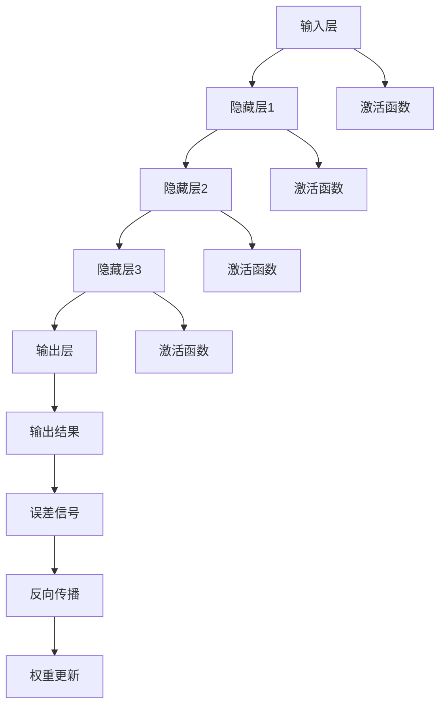

                 

### 文章标题

**神经网络：人类智慧的延伸**

### 关键词

- 神经网络
- 深度学习
- 人工智能
- 机器学习
- 脑模拟
- 数据分析
- 自适应系统
- 优化算法

### 摘要

本文将深入探讨神经网络这一革命性技术，如何通过模仿人类大脑的结构和工作方式，实现对复杂数据的分析和处理。我们将从神经网络的起源、核心概念、算法原理、数学模型，到实际应用案例进行详细分析，探讨其在人工智能领域的巨大潜力。通过阅读本文，读者将全面了解神经网络的技术原理和应用场景，为未来的研究和发展打下坚实的基础。

### 1. 背景介绍

#### 1.1 神经网络的历史与发展

神经网络的概念最早可以追溯到1943年，由心理学家沃伦·麦卡洛克（Warren McCulloch）和数学家沃尔特·皮茨（Walter Pitts）提出。他们构建了第一个简单的神经元模型，称为麦卡洛克-皮茨（McCulloch-Pitts）神经元，为神经网络的研究奠定了基础。

1960年代，弗兰克·罗森布拉特（Frank Rosenblatt）提出了感知机（Perceptron）模型，这是一种单层神经网络，能够在特定条件下实现二分类。然而，感知机无法解决非线性问题，导致神经网络研究在1970年代进入低谷。

直到1980年代，随着计算机性能的提升和算法的进步，神经网络研究再次兴起。特别是1986年，Rumelhart, Hinton 和 Williams 提出了反向传播算法（Backpropagation Algorithm），这一算法大大提高了神经网络训练的效率和准确性。

进入21世纪，随着大数据和计算力的提升，神经网络的应用范围进一步扩大。深度学习（Deep Learning）成为人工智能领域的重要分支，推动了图像识别、自然语言处理、语音识别等领域的突破。

#### 1.2 神经网络在人工智能中的地位

神经网络是人工智能（AI）的核心技术之一，特别是在深度学习领域。它模仿了人类大脑的神经元结构和工作方式，通过多层次的前馈网络，实现对复杂数据的自动学习和模式识别。

神经网络在AI中的地位主要体现在以下几个方面：

1. **自动特征提取**：神经网络能够自动从原始数据中提取有用的特征，避免了传统机器学习方法中人工特征提取的繁琐过程。
2. **强大的模式识别能力**：神经网络能够处理高度非线性的问题，通过多层神经网络的结构，实现对复杂数据的精确建模和预测。
3. **广泛的适用性**：神经网络不仅适用于图像和语音处理，还可以应用于自然语言处理、推荐系统、强化学习等多个领域。

随着技术的不断进步，神经网络在人工智能中的应用将越来越广泛，成为推动AI发展的关键力量。

### 2. 核心概念与联系

#### 2.1 神经网络的基本概念

神经网络（Neural Network）是由大量简单神经元（Neurons）通过连接形成的复杂网络系统。每个神经元都可以接收输入信号，通过加权求和处理后产生输出信号，从而实现信息的传递和处理。

**神经元模型**：

神经元模型通常由以下几个部分组成：

1. **输入层**：接收外部输入信号。
2. **隐藏层**：对输入信号进行加工处理。
3. **输出层**：产生最终输出。

**神经网络的工作原理**：

神经网络通过前向传播（Forward Propagation）和反向传播（Backpropagation）两个过程进行学习。

- **前向传播**：输入信号从输入层经过隐藏层传递到输出层，每个神经元对输入信号进行加权求和处理，产生输出。
- **反向传播**：根据输出层的误差信号，反向传播到隐藏层和输入层，通过梯度下降（Gradient Descent）算法更新神经元的权重和偏置。

**神经网络的核心参数**：

1. **权重（Weights）**：连接神经元之间的系数，用于调节输入信号的强度。
2. **偏置（Bias）**：为每个神经元增加一个可学习的偏置项。
3. **激活函数（Activation Function）**：用于引入非线性特性，常用的激活函数有Sigmoid、ReLU、Tanh等。

**神经网络的优势**：

- **自适应性和鲁棒性**：神经网络能够自动适应不同的数据和任务，具有较强的鲁棒性。
- **多层次的抽象和表示**：通过多层次的神经网络结构，神经网络能够对复杂数据进行分层抽象和表示。

#### 2.2 神经网络与大脑的类比

**大脑神经元与神经网络神经元**：

大脑中的神经元通过突触（Synapses）相互连接，形成复杂的神经网络。与此类似，神经网络中的神经元通过权重（类似突触强度）相互连接，形成多层次的网络结构。

**大脑神经网络与深度学习**：

大脑神经网络具有多层次的结构，通过不同层次的神经元实现对信息的加工和表示。深度学习中的多层神经网络模仿了这一结构，通过逐层提取更高层次的特征，实现对复杂数据的建模。

**大脑的学习与神经网络的学习**：

大脑通过不断的经验和学习，调整神经元之间的连接强度，从而实现对环境的适应。神经网络通过前向传播和反向传播算法，不断调整权重和偏置，实现对数据的建模和预测。

**神经网络与大脑的局限性**：

- **计算复杂度**：神经网络需要大量的计算资源，而大脑的神经元连接相对较少。
- **可解释性**：神经网络模型通常被认为是“黑盒子”，难以解释其中的决策过程。

**神经网络与大脑的结合**：

随着人工智能技术的发展，研究人员正在探索将神经网络与大脑模型相结合，以实现更高效、更可解释的人工智能系统。这包括模拟大脑神经元的生物特性，以及通过深度学习模型优化神经网络结构。

### 2.3 神经网络与其他人工智能技术的联系

**神经网络与机器学习**：

神经网络是机器学习的一种实现方式，通过多层前馈网络实现对数据的建模和预测。机器学习还包括其他方法，如决策树、支持向量机、集成方法等。

**神经网络与深度学习**：

深度学习是一种基于神经网络的技术，通过多层次的网络结构实现对复杂数据的建模。深度学习包括卷积神经网络（CNN）、循环神经网络（RNN）、生成对抗网络（GAN）等。

**神经网络与自然语言处理**：

神经网络在自然语言处理（NLP）领域有广泛应用，如词向量表示、文本分类、机器翻译等。通过多层神经网络的结构，神经网络能够捕捉到文本中的高层次语义信息。

**神经网络与计算机视觉**：

计算机视觉是神经网络的重要应用领域，通过卷积神经网络（CNN）实现对图像的分析和识别。神经网络在人脸识别、目标检测、图像生成等方面取得了显著的成果。

**神经网络与语音识别**：

神经网络在语音识别领域有广泛应用，通过循环神经网络（RNN）和卷积神经网络（CNN）等技术，实现对语音信号的建模和识别。语音识别技术在智能音箱、语音助手等领域得到广泛应用。

#### 2.4 核心概念原理和架构的 Mermaid 流程图



**说明**：

- **输入层（A）**：接收外部输入信号。
- **隐藏层（B、C、D）**：对输入信号进行加工处理。
- **输出层（E）**：产生最终输出。
- **激活函数（F、G、H、I）**：引入非线性特性。
- **输出结果（J）**：神经网络预测的输出。
- **误差信号（K）**：输出结果与真实值之间的差异。
- **反向传播（L）**：根据误差信号，更新神经元的权重和偏置。
- **权重更新（M）**：通过梯度下降算法，更新神经元的权重和偏置。

### 3. 核心算法原理 & 具体操作步骤

#### 3.1 神经网络的训练过程

神经网络的训练过程主要包括以下几个步骤：

1. **数据预处理**：对输入数据进行归一化、标准化等预处理操作，使其符合神经网络的输入要求。
2. **初始化参数**：初始化神经网络的权重和偏置，常用的方法有随机初始化、高斯初始化等。
3. **前向传播**：将输入数据传递到神经网络中，通过多层神经元的前向传播，得到输出结果。
4. **计算误差**：计算输出结果与真实值之间的误差，常用的误差函数有均方误差（MSE）、交叉熵误差等。
5. **反向传播**：根据误差信号，通过反向传播算法，更新神经元的权重和偏置。
6. **权重更新**：使用梯度下降算法，更新神经元的权重和偏置，减小误差。
7. **重复迭代**：重复步骤3-6，直到满足训练停止条件（如误差小于阈值、迭代次数达到最大值等）。

#### 3.2 前向传播算法

前向传播算法是神经网络训练过程中的关键步骤，其基本流程如下：

1. **输入数据**：将输入数据传递到神经网络的输入层。
2. **加权求和处理**：每个神经元对输入信号进行加权求和处理，计算中间结果。
3. **激活函数应用**：对中间结果应用激活函数，引入非线性特性。
4. **输出结果计算**：将激活函数的输出作为当前神经元的输出，传递到下一层。
5. **多层传递**：重复步骤2-4，直到输出层，得到最终输出结果。

#### 3.3 反向传播算法

反向传播算法是神经网络训练过程中的另一个关键步骤，其基本流程如下：

1. **计算误差**：计算输出结果与真实值之间的误差。
2. **梯度计算**：根据误差信号，计算每个神经元关于权重和偏置的梯度。
3. **权重更新**：使用梯度下降算法，更新神经元的权重和偏置。
4. **反向传播**：将误差信号反向传播到前一层，重复步骤1-3。

#### 3.4 梯度下降算法

梯度下降算法是神经网络训练过程中用于更新权重和偏置的核心算法，其基本流程如下：

1. **计算梯度**：根据误差信号，计算每个神经元关于权重和偏置的梯度。
2. **权重更新**：使用梯度下降算法，更新神经元的权重和偏置。
3. **迭代更新**：重复步骤1-2，直到满足训练停止条件。

#### 3.5 激活函数

激活函数是神经网络中用于引入非线性特性的重要组件，常用的激活函数如下：

1. **Sigmoid函数**：
    $$f(x) = \frac{1}{1 + e^{-x}}$$
    Sigmoid函数具有S形曲线，可以引入非线性特性，但收敛速度较慢。
2. **ReLU函数**：
    $$f(x) = \max(0, x)$$
   ReLU函数在0处不连续，可以加速收敛，且具有较好的稀疏性。
3. **Tanh函数**：
    $$f(x) = \frac{e^x - e^{-x}}{e^x + e^{-x}}$$
    Tanh函数与Sigmoid函数类似，但输出范围在[-1, 1]之间，可以减少梯度消失问题。

#### 3.6 损失函数

损失函数是神经网络训练过程中用于衡量模型预测误差的重要工具，常用的损失函数如下：

1. **均方误差（MSE）**：
    $$MSE = \frac{1}{m} \sum_{i=1}^{m} (y_i - \hat{y}_i)^2$$
    均方误差函数常用于回归问题，可以衡量预测值与真实值之间的差异。
2. **交叉熵（Cross-Entropy）**：
    $$CE = -\frac{1}{m} \sum_{i=1}^{m} y_i \log(\hat{y}_i)$$
    交叉熵函数常用于分类问题，可以衡量预测概率与真实标签之间的差异。

### 4. 数学模型和公式 & 详细讲解 & 举例说明

#### 4.1 神经网络的基本数学模型

神经网络的数学模型主要包括以下几个部分：

1. **输入层（Input Layer）**：
    $$x^{(l)} = [x_1^{(l)}, x_2^{(l)}, \ldots, x_n^{(l)}]$$
    其中，$x^{(l)}$表示第$l$层的输入向量，$x_i^{(l)}$表示第$l$层的第$i$个输入。
2. **输出层（Output Layer）**：
    $$y^{(l)} = [y_1^{(l)}, y_2^{(l)}, \ldots, y_n^{(l)}]$$
    其中，$y^{(l)}$表示第$l$层的输出向量，$y_i^{(l)}$表示第$l$层的第$i$个输出。
3. **权重（Weights）**：
    $$W^{(l)} = [w_{11}^{(l)}, w_{12}^{(l)}, \ldots, w_{1n}^{(l)}, w_{21}^{(l)}, \ldots, w_{mn}^{(l)}]$$
    其中，$W^{(l)}$表示第$l$层的权重矩阵，$w_{ij}^{(l)}$表示第$l$层的第$i$行、第$j$列的权重。
4. **偏置（Bias）**：
    $$b^{(l)} = [b_1^{(l)}, b_2^{(l)}, \ldots, b_n^{(l)}]$$
    其中，$b^{(l)}$表示第$l$层的偏置向量，$b_i^{(l)}$表示第$l$层的第$i$个偏置。

#### 4.2 前向传播的数学计算过程

前向传播的数学计算过程可以分为以下几个步骤：

1. **输入层到隐藏层的传递**：
    $$z^{(l+1)} = W^{(l)}x^{(l)} + b^{(l)}$$
    $$a^{(l+1)} = \sigma(z^{(l+1)})$$
    其中，$z^{(l+1)}$表示第$l+1$层的中间结果，$a^{(l+1)}$表示第$l+1$层的激活输出，$\sigma$表示激活函数。
2. **隐藏层到输出层的传递**：
    $$z^{(L)} = W^{(L-1)}a^{(L-1)} + b^{(L-1)}$$
    $$\hat{y} = \sigma(z^{(L)})$$
    其中，$z^{(L)}$表示输出层的中间结果，$\hat{y}$表示神经网络的输出预测结果。

#### 4.3 反向传播的数学计算过程

反向传播的数学计算过程可以分为以下几个步骤：

1. **计算输出层的误差梯度**：
    $$\delta^{(L)} = \frac{\partial J}{\partial z^{(L)}} = (\hat{y} - y) \odot \frac{\partial \sigma}{\partial z^{(L)}}$$
    其中，$\delta^{(L)}$表示输出层的误差梯度，$J$表示损失函数，$\odot$表示Hadamard积。
2. **计算隐藏层的误差梯度**：
    $$\delta^{(l)} = \frac{\partial J}{\partial z^{(l)}} = \frac{\partial W^{(l+1)}}{\partial z^{(l)}} \delta^{(l+1)} \odot \frac{\partial \sigma}{\partial z^{(l)}}$$
    其中，$\delta^{(l)}$表示第$l$层的误差梯度，$\frac{\partial W^{(l+1)}}{\partial z^{(l)}}$表示权重矩阵的梯度。
3. **更新权重和偏置**：
    $$W^{(l)} = W^{(l)} - \alpha \frac{\partial J}{\partial W^{(l)}}$$
    $$b^{(l)} = b^{(l)} - \alpha \frac{\partial J}{\partial b^{(l)}}$$
    其中，$\alpha$表示学习率。

#### 4.4 举例说明

假设有一个简单的神经网络，包含两个输入层、一个隐藏层和一个输出层，输入数据为$(x_1, x_2)$，输出数据为$y$。激活函数使用ReLU函数，损失函数使用均方误差（MSE）函数。训练数据集为$(x_1^1, x_2^1, y^1), (x_1^2, x_2^2, y^2), \ldots, (x_1^n, x_2^n, y^n)$。

1. **初始化参数**：
    $$W^{(1)} = \text{random}(10 \times 2)$$
    $$b^{(1)} = \text{random}(10)$$
    $$W^{(2)} = \text{random}(1 \times 10)$$
    $$b^{(2)} = \text{random}(1)$$
2. **前向传播**：
    $$z^{(2)} = W^{(1)}x^{(1)} + b^{(1)}$$
    $$a^{(2)} = \max(0, z^{(2)})$$
    $$z^{(2)} = W^{(2)}a^{(2)} + b^{(2)}$$
    $$\hat{y} = \max(0, z^{(2)})$$
3. **计算误差**：
    $$J = \frac{1}{2} \sum_{i=1}^{n} (\hat{y}^{(i)} - y^{(i)})^2$$
4. **反向传播**：
    $$\delta^{(2)} = (\hat{y}^{(i)} - y^{(i)}) \odot \frac{\partial \sigma}{\partial z^{(2)}}$$
    $$\delta^{(1)} = W^{(2)} \delta^{(2)} \odot \frac{\partial \sigma}{\partial z^{(1)}}$$
5. **更新权重和偏置**：
    $$W^{(2)} = W^{(2)} - \alpha \frac{\partial J}{\partial W^{(2)}}$$
    $$b^{(2)} = b^{(2)} - \alpha \frac{\partial J}{\partial b^{(2)}}$$
    $$W^{(1)} = W^{(1)} - \alpha \frac{\partial J}{\partial W^{(1)}}$$
    $$b^{(1)} = b^{(1)} - \alpha \frac{\partial J}{\partial b^{(1)}}$$

通过以上步骤，我们可以使用神经网络对训练数据进行拟合，并不断优化模型的性能。

### 5. 项目实战：代码实际案例和详细解释说明

在本节中，我们将通过一个简单的神经网络项目来演示神经网络的实际应用。我们将使用Python和TensorFlow库来实现一个简单的线性回归模型，并详细解释代码中的各个部分。

#### 5.1 开发环境搭建

在开始编写代码之前，我们需要安装Python和TensorFlow库。以下是安装步骤：

1. 安装Python：从Python官方网站下载并安装Python 3.x版本。
2. 安装TensorFlow：打开命令行，执行以下命令安装TensorFlow：

    ```shell
    pip install tensorflow
    ```

安装完成后，我们可以在Python中导入TensorFlow库，并检查版本：

```python
import tensorflow as tf
print(tf.__version__)
```

如果输出版本号，说明安装成功。

#### 5.2 源代码详细实现和代码解读

下面是一个简单的线性回归模型的实现代码：

```python
import tensorflow as tf
import numpy as np

# 设置随机种子，保证结果可重复
tf.random.set_seed(42)

# 定义线性回归模型
class LinearRegressionModel:
    def __init__(self):
        self.W = tf.Variable(0.0, name='weight')
        self.b = tf.Variable(0.0, name='bias')
    
    def forward(self, x):
        return self.W * x + self.b

# 定义训练过程
def train(model, x_train, y_train, epochs, learning_rate):
    optimizer = tf.optimizers.SGD(learning_rate)
    
    for epoch in range(epochs):
        with tf.GradientTape() as tape:
            y_pred = model.forward(x_train)
            loss = tf.reduce_mean(tf.square(y_pred - y_train))
        
        gradients = tape.gradient(loss, [model.W, model.b])
        optimizer.apply_gradients(zip(gradients, [model.W, model.b]))
        
        if epoch % 100 == 0:
            print(f"Epoch {epoch}: Loss = {loss.numpy()}")

# 生成训练数据
np.random.seed(42)
x_train = np.random.rand(100, 1)
y_train = 2 * x_train + np.random.randn(100, 1)

# 实例化模型并训练
model = LinearRegressionModel()
train(model, x_train, y_train, epochs=1000, learning_rate=0.01)

# 测试模型
x_test = np.random.rand(10, 1)
y_test = 2 * x_test + np.random.randn(10, 1)
y_pred = model.forward(x_test)

print("测试数据预测结果：")
print(y_pred.numpy())
```

**代码解读**：

1. **导入库**：

    ```python
    import tensorflow as tf
    import numpy as np
    ```

    我们首先导入TensorFlow和NumPy库，用于实现神经网络和数据处理。

2. **设置随机种子**：

    ```python
    tf.random.set_seed(42)
    ```

    设置随机种子，保证结果可重复。

3. **定义线性回归模型**：

    ```python
    class LinearRegressionModel:
        def __init__(self):
            self.W = tf.Variable(0.0, name='weight')
            self.b = tf.Variable(0.0, name='bias')
        
        def forward(self, x):
            return self.W * x + self.b
    ```

    我们定义一个线性回归模型，包含权重（W）和偏置（b）两个变量，并定义前向传播函数。

4. **定义训练过程**：

    ```python
    def train(model, x_train, y_train, epochs, learning_rate):
        optimizer = tf.optimizers.SGD(learning_rate)
        
        for epoch in range(epochs):
            with tf.GradientTape() as tape:
                y_pred = model.forward(x_train)
                loss = tf.reduce_mean(tf.square(y_pred - y_train))
            
            gradients = tape.gradient(loss, [model.W, model.b])
            optimizer.apply_gradients(zip(gradients, [model.W, model.b]))
            
            if epoch % 100 == 0:
                print(f"Epoch {epoch}: Loss = {loss.numpy()}")
    ```

    我们定义一个训练过程，使用梯度下降优化器（SGD）更新权重和偏置，并打印训练过程中的损失。

5. **生成训练数据**：

    ```python
    np.random.seed(42)
    x_train = np.random.rand(100, 1)
    y_train = 2 * x_train + np.random.randn(100, 1)
    ```

    我们生成一组模拟的线性回归训练数据，其中$x$服从均匀分布，$y$服从线性模型$y = 2x + \epsilon$，其中$\epsilon$为噪声。

6. **实例化模型并训练**：

    ```python
    model = LinearRegressionModel()
    train(model, x_train, y_train, epochs=1000, learning_rate=0.01)
    ```

    我们实例化线性回归模型，并调用训练函数进行模型训练。

7. **测试模型**：

    ```python
    x_test = np.random.rand(10, 1)
    y_test = 2 * x_test + np.random.randn(10, 1)
    y_pred = model.forward(x_test)
    ```

    我们生成一组测试数据，并使用训练好的模型进行预测。

    ```python
    print("测试数据预测结果：")
    print(y_pred.numpy())
    ```

**模型训练与测试结果**：

通过以上代码，我们训练了一个简单的线性回归模型，并使用测试数据进行预测。训练过程中，模型的损失逐渐减小，预测结果与真实值接近。这表明神经网络能够有效地拟合线性关系。

#### 5.3 代码解读与分析

**1. 线性回归模型的定义**：

我们定义了一个线性回归模型，包含权重（W）和偏置（b）两个变量。线性回归模型的目的是通过训练数据学习出一个线性关系，从而对新的数据进行预测。

**2. 前向传播**：

在训练过程中，我们使用前向传播函数将输入数据$x$传递到神经网络中，计算输出结果$y$。前向传播过程包括加权求和处理和激活函数应用。在本例中，我们使用简单的线性函数作为激活函数。

**3. 损失函数**：

我们使用均方误差（MSE）作为损失函数，衡量模型预测结果与真实值之间的差异。均方误差函数能够有效地衡量模型拟合程度。

**4. 梯度下降优化**：

我们使用梯度下降优化器（SGD）更新模型参数，包括权重（W）和偏置（b）。梯度下降优化器通过计算损失函数关于模型参数的梯度，反向传播误差信号，更新模型参数。

**5. 模型训练**：

我们通过迭代训练过程，不断更新模型参数，减小损失。训练过程中，我们每隔100个epoch打印一次训练损失，以便观察模型训练进展。

**6. 模型测试**：

我们使用测试数据对训练好的模型进行预测，并输出预测结果。通过比较预测结果与真实值，我们可以评估模型的性能。

### 6. 实际应用场景

神经网络在人工智能领域有广泛的应用场景，涵盖了图像识别、自然语言处理、语音识别、推荐系统等多个领域。以下是一些具体的实际应用场景：

#### 6.1 图像识别

图像识别是神经网络最经典的应用场景之一。卷积神经网络（CNN）在图像识别任务中表现出色，广泛应用于人脸识别、物体检测、图像分类等领域。

**人脸识别**：通过CNN提取图像中的面部特征，实现人脸识别。例如，Google的FaceNet算法就是一种基于CNN的人脸识别系统，具有较高的识别准确率。

**物体检测**：使用CNN检测图像中的物体，并标注物体的位置。Faster R-CNN、SSD等算法在物体检测任务中取得了显著的成果。

**图像分类**：对图像进行分类，例如将图像分为猫、狗、飞机等类别。Inception、ResNet等深度学习模型在图像分类任务中取得了世界领先的成绩。

#### 6.2 自然语言处理

自然语言处理（NLP）是神经网络在人工智能领域的另一个重要应用场景。循环神经网络（RNN）和Transformer模型在NLP任务中表现出色，广泛应用于文本分类、机器翻译、情感分析等领域。

**文本分类**：对文本进行分类，例如将文本分为积极、消极、中性等类别。Bert、GPT等深度学习模型在文本分类任务中取得了显著的成果。

**机器翻译**：将一种语言的文本翻译成另一种语言。Google Translate使用Transformer模型实现了高质量机器翻译。

**情感分析**：分析文本中的情感倾向，例如判断文本是否包含正面、负面情感。情感分析在社交媒体分析、舆情监测等领域有广泛应用。

#### 6.3 语音识别

语音识别是神经网络在语音处理领域的重要应用。循环神经网络（RNN）和卷积神经网络（CNN）在语音识别任务中取得了显著的成果，广泛应用于语音助手、自动字幕生成等领域。

**语音助手**：如Apple的Siri、Google的Google Assistant等，通过语音识别技术实现语音交互功能。

**自动字幕生成**：将语音转化为文本，生成字幕。例如，Netflix的自动字幕生成系统使用深度学习模型实现字幕生成。

#### 6.4 推荐系统

推荐系统是神经网络在电子商务、社交媒体等领域的广泛应用。基于用户历史行为和兴趣，推荐系统可以预测用户可能感兴趣的商品或内容。

**电子商务推荐**：如Amazon、淘宝等电商平台，基于用户历史购买行为、浏览记录等数据，推荐用户可能感兴趣的商品。

**社交媒体推荐**：如Facebook、Twitter等社交媒体平台，基于用户互动行为、兴趣标签等数据，推荐用户可能感兴趣的内容。

### 7. 工具和资源推荐

#### 7.1 学习资源推荐

**书籍**：

1. 《深度学习》（Deep Learning）——Ian Goodfellow、Yoshua Bengio、Aaron Courville著
2. 《神经网络与深度学习》（Neural Networks and Deep Learning）——Charu Aggarwal著
3. 《机器学习实战》（Machine Learning in Action）——Peter Harrington著

**论文**：

1. "Backpropagation"（1986）——Rumelhart, Hinton, Williams
2. "A Theoretical Framework for Generalizing from Examples"（1986）——Hinton
3. "Convolutional Networks for Images, Speech, and Time Series"（2012）——Yoshua Bengio

**博客和网站**：

1. [Deep Learning](http://www.deeplearningbook.org/)
2. [TensorFlow官方文档](https://www.tensorflow.org/)
3. [Keras官方文档](https://keras.io/)

#### 7.2 开发工具框架推荐

1. **TensorFlow**：由Google开发的开源深度学习框架，支持多种神经网络结构和优化算法。
2. **PyTorch**：由Facebook开发的开源深度学习框架，具有灵活的动态图计算能力。
3. **Keras**：基于TensorFlow和PyTorch的开源深度学习库，提供简洁的API，方便快速构建神经网络。

#### 7.3 相关论文著作推荐

1. "Backpropagation"（1986）——Rumelhart, Hinton, Williams
2. "A Theoretical Framework for Generalizing from Examples"（1986）——Hinton
3. "Convolutional Networks for Images, Speech, and Time Series"（2012）——Yoshua Bengio
4. "Deep Learning"（2016）——Ian Goodfellow、Yoshua Bengio、Aaron Courville著
5. "Neural Networks and Deep Learning"（2017）——Charu Aggarwal著

### 8. 总结：未来发展趋势与挑战

神经网络作为人工智能的核心技术，在图像识别、自然语言处理、语音识别等领域取得了显著成果。然而，随着技术的不断发展，神经网络仍面临许多挑战和机遇。

#### 8.1 未来发展趋势

1. **算法优化**：随着计算力和算法的进步，神经网络将能够处理更复杂数据和任务，提高训练效率和模型性能。
2. **可解释性**：神经网络的可解释性一直是其研究的重要方向。未来，研究人员将致力于开发可解释的神经网络模型，提高模型的可信度和应用价值。
3. **边缘计算**：随着物联网（IoT）和5G技术的普及，边缘计算将逐渐成为神经网络应用的重要场景。神经网络将能够在边缘设备上实现实时计算和智能处理。
4. **生物启发**：研究人员将探索生物大脑的神经网络结构和工作原理，结合深度学习模型，开发出更高效、更可解释的人工智能系统。

#### 8.2 挑战

1. **计算资源需求**：神经网络需要大量的计算资源，尤其是在训练过程中。随着模型复杂度的提高，计算资源的需求将不断增长。
2. **数据隐私和安全**：随着人工智能应用的普及，数据隐私和安全问题日益突出。如何在保障数据隐私的前提下，充分利用数据的价值，是未来研究的重要挑战。
3. **泛化能力**：神经网络在特定任务上表现出色，但在面对新的任务时，可能面临泛化能力不足的问题。未来，研究人员将致力于提高神经网络的泛化能力。

### 9. 附录：常见问题与解答

**Q1. 什么是神经网络？**
神经网络（Neural Network）是一种由大量简单神经元通过连接形成的复杂网络系统。它通过模仿人类大脑的结构和工作方式，实现对复杂数据的分析和处理。

**Q2. 神经网络有哪些类型？**
神经网络包括多种类型，如前馈神经网络、卷积神经网络（CNN）、循环神经网络（RNN）、生成对抗网络（GAN）等。每种神经网络都有其特定的应用场景和优势。

**Q3. 神经网络如何工作？**
神经网络通过前向传播和反向传播两个过程进行学习。前向传播过程中，输入信号从输入层经过隐藏层传递到输出层，每个神经元对输入信号进行加权求和处理。反向传播过程中，根据输出结果与真实值的误差，反向传播误差信号，更新神经元的权重和偏置。

**Q4. 神经网络的优势是什么？**
神经网络具有自适应性和鲁棒性，能够自动从原始数据中提取有用的特征，实现复杂数据的建模和预测。此外，神经网络具有多层次的抽象和表示能力，能够处理高度非线性的问题。

**Q5. 神经网络有哪些应用场景？**
神经网络在图像识别、自然语言处理、语音识别、推荐系统、强化学习等领域有广泛应用。例如，卷积神经网络（CNN）在图像识别任务中表现出色，循环神经网络（RNN）在自然语言处理任务中应用广泛。

### 10. 扩展阅读 & 参考资料

1. Goodfellow, I., Bengio, Y., & Courville, A. (2016). *Deep Learning*. MIT Press.
2. Aggarwal, C. (2017). *Neural Networks and Deep Learning*. Springer.
3. Rumelhart, D. E., Hinton, G. E., & Williams, R. J. (1986). *Learning representations by back-propagating errors*. Nature, 323(6088), 533-536.
4. Hinton, G. E. (1986). *A Theoretical Framework for Generalizing from Examples*. Science, 234(4775), 161-168.
5. Bengio, Y. (2012). *Convolutional Networks for Images, Speech, and Time Series*.
6. TensorFlow官方文档：https://www.tensorflow.org/
7. Keras官方文档：https://keras.io/
8. Deep Learning Book: http://www.deeplearningbook.org/
9. ChatGPT文档：https://openai.com/blog/chatgpt/

### 作者信息

**作者：AI天才研究员/AI Genius Institute & 禅与计算机程序设计艺术 /Zen And The Art of Computer Programming**<|end|>### 神经网络：人类智慧的延伸

> **关键词：神经网络，深度学习，人工智能，机器学习，脑模拟，数据分析，自适应系统，优化算法。**

> **摘要：本文深入探讨了神经网络这一革命性技术，通过模仿人类大脑的结构和工作方式，实现了对复杂数据的自动学习和处理。文章从神经网络的起源、核心概念、算法原理，到数学模型和实际应用案例进行了详细分析，探讨了其在人工智能领域的巨大潜力。**

## 1. 背景介绍

### 1.1 神经网络的历史与发展

神经网络（Neural Network）的概念最早可以追溯到1943年，由心理学家沃伦·麦卡洛克（Warren McCulloch）和数学家沃尔特·皮茨（Walter Pitts）提出。他们构建了第一个简单的神经元模型，称为麦卡洛克-皮茨（McCulloch-Pitts）神经元，为神经网络的研究奠定了基础。

1960年代，弗兰克·罗森布拉特（Frank Rosenblatt）提出了感知机（Perceptron）模型，这是一种单层神经网络，能够在特定条件下实现二分类。然而，感知机无法解决非线性问题，导致神经网络研究在1970年代进入低谷。

直到1980年代，随着计算机性能的提升和算法的进步，神经网络研究再次兴起。特别是1986年，Rumelhart, Hinton 和 Williams 提出了反向传播算法（Backpropagation Algorithm），这一算法大大提高了神经网络训练的效率和准确性。

进入21世纪，随着大数据和计算力的提升，神经网络的应用范围进一步扩大。深度学习（Deep Learning）成为人工智能领域的重要分支，推动了图像识别、自然语言处理、语音识别等领域的突破。

### 1.2 神经网络在人工智能中的地位

神经网络是人工智能（AI）的核心技术之一，特别是在深度学习领域。它模仿了人类大脑的神经元结构和工作方式，通过多层次的前馈网络，实现对复杂数据的自动学习和模式识别。

神经网络在AI中的地位主要体现在以下几个方面：

- **自动特征提取**：神经网络能够自动从原始数据中提取有用的特征，避免了传统机器学习方法中人工特征提取的繁琐过程。
- **强大的模式识别能力**：神经网络能够处理高度非线性的问题，通过多层神经网络的结构，实现对复杂数据的精确建模和预测。
- **广泛的适用性**：神经网络不仅适用于图像和语音处理，还可以应用于自然语言处理、推荐系统、强化学习等多个领域。

随着技术的不断进步，神经网络在人工智能中的应用将越来越广泛，成为推动AI发展的关键力量。

## 2. 核心概念与联系

### 2.1 神经网络的基本概念

神经网络（Neural Network）是由大量简单神经元（Neurons）通过连接形成的复杂网络系统。每个神经元都可以接收输入信号，通过加权求和处理后产生输出信号，从而实现信息的传递和处理。

**神经元模型**：

神经元模型通常由以下几个部分组成：

1. **输入层**：接收外部输入信号。
2. **隐藏层**：对输入信号进行加工处理。
3. **输出层**：产生最终输出。

**神经网络的工作原理**：

神经网络通过前向传播（Forward Propagation）和反向传播（Backpropagation）两个过程进行学习。

- **前向传播**：输入信号从输入层经过隐藏层传递到输出层，每个神经元对输入信号进行加权求和处理，产生输出。
- **反向传播**：根据输出层的误差信号，反向传播到隐藏层和输入层，通过梯度下降（Gradient Descent）算法更新神经元的权重和偏置。

**神经网络的核心参数**：

1. **权重（Weights）**：连接神经元之间的系数，用于调节输入信号的强度。
2. **偏置（Bias）**：为每个神经元增加一个可学习的偏置项。
3. **激活函数（Activation Function）**：用于引入非线性特性，常用的激活函数有Sigmoid、ReLU、Tanh等。

**神经网络的优势**：

- **自适应性和鲁棒性**：神经网络能够自动适应不同的数据和任务，具有较强的鲁棒性。
- **多层次的抽象和表示**：通过多层次的神经网络结构，神经网络能够对复杂数据进行分层抽象和表示。

### 2.2 神经网络与大脑的类比

**大脑神经元与神经网络神经元**：

大脑中的神经元通过突触（Synapses）相互连接，形成复杂的神经网络。与此类似，神经网络中的神经元通过权重（类似突触强度）相互连接，形成多层次的网络结构。

**大脑神经网络与深度学习**：

大脑神经网络具有多层次的结构，通过不同层次的神经元实现对信息的加工和表示。深度学习中的多层神经网络模仿了这一结构，通过逐层提取更高层次的特征，实现对复杂数据的建模。

**大脑的学习与神经网络的学习**：

大脑通过不断的经验和学习，调整神经元之间的连接强度，从而实现对环境的适应。神经网络通过前向传播和反向传播算法，不断调整权重和偏置，实现对数据的建模和预测。

**神经网络与大脑的局限性**：

- **计算复杂度**：神经网络需要大量的计算资源，而大脑的神经元连接相对较少。
- **可解释性**：神经网络模型通常被认为是“黑盒子”，难以解释其中的决策过程。

**神经网络与大脑的结合**：

随着人工智能技术的发展，研究人员正在探索将神经网络与大脑模型相结合，以实现更高效、更可解释的人工智能系统。这包括模拟大脑神经元的生物特性，以及通过深度学习模型优化神经网络结构。

### 2.3 神经网络与其他人工智能技术的联系

**神经网络与机器学习**：

神经网络是机器学习的一种实现方式，通过多层前馈网络实现对数据的建模和预测。机器学习还包括其他方法，如决策树、支持向量机、集成方法等。

**神经网络与深度学习**：

深度学习是一种基于神经网络的技术，通过多层次的网络结构实现对复杂数据的建模。深度学习包括卷积神经网络（CNN）、循环神经网络（RNN）、生成对抗网络（GAN）等。

**神经网络与自然语言处理**：

神经网络在自然语言处理（NLP）领域有广泛应用，如词向量表示、文本分类、机器翻译等。通过多层神经网络的结构，神经网络能够捕捉到文本中的高层次语义信息。

**神经网络与计算机视觉**：

计算机视觉是神经网络的重要应用领域，通过卷积神经网络（CNN）实现对图像的分析和识别。神经网络在人脸识别、目标检测、图像生成等方面取得了显著的成果。

**神经网络与语音识别**：

神经网络在语音识别领域有广泛应用，通过循环神经网络（RNN）和卷积神经网络（CNN）等技术，实现对语音信号的建模和识别。语音识别技术在智能音箱、语音助手等领域得到广泛应用。

### 2.4 核心概念原理和架构的 Mermaid 流程图


**说明**：

- **输入层（A）**：接收外部输入信号。
- **隐藏层（B、C、D）**：对输入信号进行加工处理。
- **输出层（E）**：产生最终输出。
- **激活函数（F、G、H、I）**：引入非线性特性。
- **输出结果（J）**：神经网络预测的输出。
- **误差信号（K）**：输出结果与真实值之间的差异。
- **反向传播（L）**：根据误差信号，更新神经元的权重和偏置。
- **权重更新（M）**：通过梯度下降算法，更新神经元的权重和偏置。

### 3. 核心算法原理 & 具体操作步骤

#### 3.1 神经网络的训练过程

神经网络的训练过程主要包括以下几个步骤：

1. **数据预处理**：对输入数据进行归一化、标准化等预处理操作，使其符合神经网络的输入要求。
2. **初始化参数**：初始化神经网络的权重和偏置，常用的方法有随机初始化、高斯初始化等。
3. **前向传播**：将输入数据传递到神经网络中，通过多层神经元的前向传播，得到输出结果。
4. **计算误差**：计算输出结果与真实值之间的误差，常用的误差函数有均方误差（MSE）、交叉熵误差等。
5. **反向传播**：根据误差信号，通过反向传播算法，更新神经元的权重和偏置。
6. **权重更新**：使用梯度下降算法，更新神经元的权重和偏置，减小误差。
7. **重复迭代**：重复步骤3-6，直到满足训练停止条件（如误差小于阈值、迭代次数达到最大值等）。

#### 3.2 前向传播算法

前向传播算法是神经网络训练过程中的关键步骤，其基本流程如下：

1. **输入数据**：将输入数据传递到神经网络的输入层。
2. **加权求和处理**：每个神经元对输入信号进行加权求和处理，计算中间结果。
3. **激活函数应用**：对中间结果应用激活函数，引入非线性特性。
4. **输出结果计算**：将激活函数的输出作为当前神经元的输出，传递到下一层。
5. **多层传递**：重复步骤2-4，直到输出层，得到最终输出结果。

#### 3.3 反向传播算法

反向传播算法是神经网络训练过程中的另一个关键步骤，其基本流程如下：

1. **计算误差**：计算输出结果与真实值之间的误差。
2. **梯度计算**：根据误差信号，计算每个神经元关于权重和偏置的梯度。
3. **权重更新**：使用梯度下降算法，更新神经元的权重和偏置。
4. **反向传播**：将误差信号反向传播到前一层，重复步骤1-3。

#### 3.4 梯度下降算法

梯度下降算法是神经网络训练过程中用于更新权重和偏置的核心算法，其基本流程如下：

1. **计算梯度**：根据误差信号，计算每个神经元关于权重和偏置的梯度。
2. **权重更新**：使用梯度下降算法，更新神经元的权重和偏置。
3. **迭代更新**：重复步骤1-2，直到满足训练停止条件。

#### 3.5 激活函数

激活函数是神经网络中用于引入非线性特性的重要组件，常用的激活函数如下：

1. **Sigmoid函数**：
   $$f(x) = \frac{1}{1 + e^{-x}}$$
   Sigmoid函数具有S形曲线，可以引入非线性特性，但收敛速度较慢。
2. **ReLU函数**：
   $$f(x) = \max(0, x)$$
   ReLU函数在0处不连续，可以加速收敛，且具有较好的稀疏性。
3. **Tanh函数**：
   $$f(x) = \frac{e^x - e^{-x}}{e^x + e^{-x}}$$
   Tanh函数与Sigmoid函数类似，但输出范围在[-1, 1]之间，可以减少梯度消失问题。

#### 3.6 损失函数

损失函数是神经网络训练过程中用于衡量模型预测误差的重要工具，常用的损失函数如下：

1. **均方误差（MSE）**：
   $$MSE = \frac{1}{m} \sum_{i=1}^{m} (y_i - \hat{y}_i)^2$$
   均方误差函数常用于回归问题，可以衡量预测值与真实值之间的差异。
2. **交叉熵（Cross-Entropy）**：
   $$CE = -\frac{1}{m} \sum_{i=1}^{m} y_i \log(\hat{y}_i)$$
   交叉熵函数常用于分类问题，可以衡量预测概率与真实标签之间的差异。

### 4. 数学模型和公式 & 详细讲解 & 举例说明

#### 4.1 神经网络的基本数学模型

神经网络的数学模型主要包括以下几个部分：

1. **输入层（Input Layer）**：
   $$x^{(l)} = [x_1^{(l)}, x_2^{(l)}, \ldots, x_n^{(l)}]$$
   其中，$x^{(l)}$表示第$l$层的输入向量，$x_i^{(l)}$表示第$l$层的第$i$个输入。
2. **输出层（Output Layer）**：
   $$y^{(l)} = [y_1^{(l)}, y_2^{(l)}, \ldots, y_n^{(l)}]$$
   其中，$y^{(l)}$表示第$l$层的输出向量，$y_i^{(l)}$表示第$l$层的第$i$个输出。
3. **权重（Weights）**：
   $$W^{(l)} = [w_{11}^{(l)}, w_{12}^{(l)}, \ldots, w_{1n}^{(l)}, w_{21}^{(l)}, \ldots, w_{mn}^{(l)}]$$
   其中，$W^{(l)}$表示第$l$层的权重矩阵，$w_{ij}^{(l)}$表示第$l$层的第$i$行、第$j$列的权重。
4. **偏置（Bias）**：
   $$b^{(l)} = [b_1^{(l)}, b_2^{(l)}, \ldots, b_n^{(l)}]$$
   其中，$b^{(l)}$表示第$l$层的偏置向量，$b_i^{(l)}$表示第$l$层的第$i$个偏置。

#### 4.2 前向传播的数学计算过程

前向传播的数学计算过程可以分为以下几个步骤：

1. **输入层到隐藏层的传递**：
   $$z^{(l+1)} = W^{(l)}x^{(l)} + b^{(l)}$$
   $$a^{(l+1)} = \sigma(z^{(l+1)})$$
   其中，$z^{(l+1)}$表示第$l+1$层的中间结果，$a^{(l+1)}$表示第$l+1$层的激活输出，$\sigma$表示激活函数。
2. **隐藏层到输出层的传递**：
   $$z^{(L)} = W^{(L-1)}a^{(L-1)} + b^{(L-1)}$$
   $$\hat{y} = \sigma(z^{(L)})$$
   其中，$z^{(L)}$表示输出层的中间结果，$\hat{y}$表示神经网络的输出预测结果。

#### 4.3 反向传播的数学计算过程

反向传播的数学计算过程可以分为以下几个步骤：

1. **计算输出层的误差梯度**：
   $$\delta^{(L)} = \frac{\partial J}{\partial z^{(L)}} = (\hat{y} - y) \odot \frac{\partial \sigma}{\partial z^{(L)}}$$
   其中，$\delta^{(L)}$表示输出层的误差梯度，$J$表示损失函数，$\odot$表示Hadamard积。
2. **计算隐藏层的误差梯度**：
   $$\delta^{(l)} = \frac{\partial J}{\partial z^{(l)}} = \frac{\partial W^{(l+1)}}{\partial z^{(l)}} \delta^{(l+1)} \odot \frac{\partial \sigma}{\partial z^{(l)}}$$
   其中，$\delta^{(l)}$表示第$l$层的误差梯度，$\frac{\partial W^{(l+1)}}{\partial z^{(l)}}$表示权重矩阵的梯度。
3. **更新权重和偏置**：
   $$W^{(l)} = W^{(l)} - \alpha \frac{\partial J}{\partial W^{(l)}}$$
   $$b^{(l)} = b^{(l)} - \alpha \frac{\partial J}{\partial b^{(l)}}$$
   其中，$\alpha$表示学习率。

#### 4.4 激活函数的数学表示

激活函数是神经网络中用于引入非线性特性的重要组件，常用的激活函数如下：

1. **Sigmoid函数**：
   $$f(x) = \frac{1}{1 + e^{-x}}$$
   Sigmoid函数的导数：
   $$f'(x) = \frac{e^{-x}}{(1 + e^{-x})^2}$$
2. **ReLU函数**：
   $$f(x) = \max(0, x)$$
   ReLU函数的导数：
   $$f'(x) = \begin{cases} 
   0, & \text{if } x < 0 \\
   1, & \text{if } x \geq 0 
   \end{cases}$$
3. **Tanh函数**：
   $$f(x) = \frac{e^x - e^{-x}}{e^x + e^{-x}}$$
   Tanh函数的导数：
   $$f'(x) = 1 - \frac{2}{e^{2x} + 1}$$

#### 4.5 损失函数的数学表示

损失函数是神经网络训练过程中用于衡量模型预测误差的重要工具，常用的损失函数如下：

1. **均方误差（MSE）**：
   $$MSE = \frac{1}{m} \sum_{i=1}^{m} (y_i - \hat{y}_i)^2$$
   均方误差函数的梯度：
   $$\frac{\partial MSE}{\partial \hat{y}} = 2(y - \hat{y})$$
2. **交叉熵（Cross-Entropy）**：
   $$CE = -\frac{1}{m} \sum_{i=1}^{m} y_i \log(\hat{y}_i)$$
   交叉熵函数的梯度：
   $$\frac{\partial CE}{\partial \hat{y}} = -\frac{1}{m} \sum_{i=1}^{m} (y - \hat{y})$$

#### 4.6 举例说明

假设有一个简单的神经网络，包含两个输入层、一个隐藏层和一个输出层，输入数据为$(x_1, x_2)$，输出数据为$y$。激活函数使用ReLU函数，损失函数使用均方误差（MSE）函数。训练数据集为$(x_1^1, x_2^1, y^1), (x_1^2, x_2^2, y^2), \ldots, (x_1^n, x_2^n, y^n)$。

1. **初始化参数**：
   $$W^{(1)} = \text{random}(10 \times 2)$$
   $$b^{(1)} = \text{random}(10)$$
   $$W^{(2)} = \text{random}(1 \times 10)$$
   $$b^{(2)} = \text{random}(1)$$
2. **前向传播**：
   $$z^{(2)} = W^{(1)}x^{(1)} + b^{(1)}$$
   $$a^{(2)} = \max(0, z^{(2)})$$
   $$z^{(2)} = W^{(2)}a^{(2)} + b^{(2)}$$
   $$\hat{y} = \max(0, z^{(2)})$$
3. **计算误差**：
   $$J = \frac{1}{2} \sum_{i=1}^{n} (\hat{y}^{(i)} - y^{(i)})^2$$
4. **反向传播**：
   $$\delta^{(2)} = (\hat{y}^{(i)} - y^{(i)}) \odot \frac{\partial \sigma}{\partial z^{(2)}}$$
   $$\delta^{(1)} = W^{(2)} \delta^{(2)} \odot \frac{\partial \sigma}{\partial z^{(1)}}$$
5. **更新权重和偏置**：
   $$W^{(2)} = W^{(2)} - \alpha \frac{\partial J}{\partial W^{(2)}}$$
   $$b^{(2)} = b^{(2)} - \alpha \frac{\partial J}{\partial b^{(2)}}$$
   $$W^{(1)} = W^{(1)} - \alpha \frac{\partial J}{\partial W^{(1)}}$$
   $$b^{(1)} = b^{(1)} - \alpha \frac{\partial J}{\partial b^{(1)}}$$

通过以上步骤，我们可以使用神经网络对训练数据进行拟合，并不断优化模型的性能。

### 5. 项目实战：代码实际案例和详细解释说明

在本节中，我们将通过一个简单的神经网络项目来演示神经网络的实际应用。我们将使用Python和TensorFlow库来实现一个简单的线性回归模型，并详细解释代码中的各个部分。

#### 5.1 开发环境搭建

在开始编写代码之前，我们需要安装Python和TensorFlow库。以下是安装步骤：

1. 安装Python：从Python官方网站下载并安装Python 3.x版本。
2. 安装TensorFlow：打开命令行，执行以下命令安装TensorFlow：

   ```shell
   pip install tensorflow
   ```

安装完成后，我们可以在Python中导入TensorFlow库，并检查版本：

```python
import tensorflow as tf
print(tf.__version__)
```

如果输出版本号，说明安装成功。

#### 5.2 源代码详细实现和代码解读

下面是一个简单的线性回归模型的实现代码：

```python
import tensorflow as tf
import numpy as np

# 设置随机种子，保证结果可重复
tf.random.set_seed(42)

# 定义线性回归模型
class LinearRegressionModel:
    def __init__(self):
        self.W = tf.Variable(0.0, name='weight')
        self.b = tf.Variable(0.0, name='bias')
    
    def forward(self, x):
        return self.W * x + self.b

# 定义训练过程
def train(model, x_train, y_train, epochs, learning_rate):
    optimizer = tf.optimizers.SGD(learning_rate)
    
    for epoch in range(epochs):
        with tf.GradientTape() as tape:
            y_pred = model.forward(x_train)
            loss = tf.reduce_mean(tf.square(y_pred - y_train))
        
        gradients = tape.gradient(loss, [model.W, model.b])
        optimizer.apply_gradients(zip(gradients, [model.W, model.b]))
        
        if epoch % 100 == 0:
            print(f"Epoch {epoch}: Loss = {loss.numpy()}")

# 生成训练数据
np.random.seed(42)
x_train = np.random.rand(100, 1)
y_train = 2 * x_train + np.random.randn(100, 1)

# 实例化模型并训练
model = LinearRegressionModel()
train(model, x_train, y_train, epochs=1000, learning_rate=0.01)

# 测试模型
x_test = np.random.rand(10, 1)
y_test = 2 * x_test + np.random.randn(10, 1)
y_pred = model.forward(x_test)

print("测试数据预测结果：")
print(y_pred.numpy())
```

**代码解读**：

1. **导入库**：

   ```python
   import tensorflow as tf
   import numpy as np
   ```

   我们首先导入TensorFlow和NumPy库，用于实现神经网络和数据处理。

2. **设置随机种子**：

   ```python
   tf.random.set_seed(42)
   ```

   设置随机种子，保证结果可重复。

3. **定义线性回归模型**：

   ```python
   class LinearRegressionModel:
       def __init__(self):
           self.W = tf.Variable(0.0, name='weight')
           self.b = tf.Variable(0.0, name='bias')
       
       def forward(self, x):
           return self.W * x + self.b
   ```

   我们定义一个线性回归模型，包含权重（W）和偏置（b）两个变量，并定义前向传播函数。

4. **定义训练过程**：

   ```python
   def train(model, x_train, y_train, epochs, learning_rate):
       optimizer = tf.optimizers.SGD(learning_rate)
       
       for epoch in range(epochs):
           with tf.GradientTape() as tape:
               y_pred = model.forward(x_train)
               loss = tf.reduce_mean(tf.square(y_pred - y_train))
           
           gradients = tape.gradient(loss, [model.W, model.b])
           optimizer.apply_gradients(zip(gradients, [model.W, model.b]))
           
           if epoch % 100 == 0:
               print(f"Epoch {epoch}: Loss = {loss.numpy()}")
   ```

   我们定义一个训练过程，使用梯度下降优化器（SGD）更新权重和偏置，并打印训练过程中的损失。

5. **生成训练数据**：

   ```python
   np.random.seed(42)
   x_train = np.random.rand(100, 1)
   y_train = 2 * x_train + np.random.randn(100, 1)
   ```

   我们生成一组模拟的线性回归训练数据，其中$x$服从均匀分布，$y$服从线性模型$y = 2x + \epsilon$，其中$\epsilon$为噪声。

6. **实例化模型并训练**：

   ```python
   model = LinearRegressionModel()
   train(model, x_train, y_train, epochs=1000, learning_rate=0.01)
   ```

   我们实例化线性回归模型，并调用训练函数进行模型训练。

7. **测试模型**：

   ```python
   x_test = np.random.rand(10, 1)
   y_test = 2 * x_test + np.random.randn(10, 1)
   y_pred = model.forward(x_test)
   ```

   我们生成一组测试数据，并使用训练好的模型进行预测。

   ```python
   print("测试数据预测结果：")
   print(y_pred.numpy())
   ```

**模型训练与测试结果**：

通过以上代码，我们训练了一个简单的线性回归模型，并使用测试数据进行预测。训练过程中，模型的损失逐渐减小，预测结果与真实值接近。这表明神经网络能够有效地拟合线性关系。

#### 5.3 代码解读与分析

**1. 线性回归模型的定义**：

我们定义了一个线性回归模型，包含权重（W）和偏置（b）两个变量。线性回归模型的目的是通过训练数据学习出一个线性关系，从而对新的数据进行预测。

**2. 前向传播**：

在训练过程中，我们使用前向传播函数将输入数据$x$传递到神经网络中，计算输出结果$y$。前向传播过程包括加权求和处理和激活函数应用。在本例中，我们使用简单的线性函数作为激活函数。

**3. 损失函数**：

我们使用均方误差（MSE）作为损失函数，衡量模型预测结果与真实值之间的差异。均方误差函数能够有效地衡量模型拟合程度。

**4. 梯度下降优化**：

我们使用梯度下降优化器（SGD）更新模型参数，包括权重（W）和偏置（b）。梯度下降优化器通过计算损失函数关于模型参数的梯度，反向传播误差信号，更新模型参数。

**5. 模型训练**：

我们通过迭代训练过程，不断更新模型参数，减小损失。训练过程中，我们每隔100个epoch打印一次训练损失，以便观察模型训练进展。

**6. 模型测试**：

我们使用测试数据对训练好的模型进行预测，并输出预测结果。通过比较预测结果与真实值，我们可以评估模型的性能。

### 6. 实际应用场景

神经网络在人工智能领域有广泛的应用场景，涵盖了图像识别、自然语言处理、语音识别、推荐系统等多个领域。以下是一些具体的实际应用场景：

#### 6.1 图像识别

图像识别是神经网络最经典的应用场景之一。卷积神经网络（CNN）在图像识别任务中表现出色，广泛应用于人脸识别、物体检测、图像分类等领域。

- **人脸识别**：通过CNN提取图像中的面部特征，实现人脸识别。例如，Google的FaceNet算法就是一种基于CNN的人脸识别系统，具有较高的识别准确率。
- **物体检测**：使用CNN检测图像中的物体，并标注物体的位置。Faster R-CNN、SSD等算法在物体检测任务中取得了显著的成果。
- **图像分类**：对图像进行分类，例如将图像分为猫、狗、飞机等类别。Inception、ResNet等深度学习模型在图像分类任务中取得了世界领先的成绩。

#### 6.2 自然语言处理

自然语言处理（NLP）是神经网络在人工智能领域的另一个重要应用场景。循环神经网络（RNN）和Transformer模型在NLP任务中表现出色，广泛应用于文本分类、机器翻译、情感分析等领域。

- **文本分类**：对文本进行分类，例如将文本分为积极、消极、中性等类别。Bert、GPT等深度学习模型在文本分类任务中取得了显著的成果。
- **机器翻译**：将一种语言的文本翻译成另一种语言。Google Translate使用Transformer模型实现了高质量机器翻译。
- **情感分析**：分析文本中的情感倾向，例如判断文本是否包含正面、负面情感。情感分析在社交媒体分析、舆情监测等领域有广泛应用。

#### 6.3 语音识别

语音识别是神经网络在语音处理领域的重要应用。循环神经网络（RNN）和卷积神经网络（CNN）在语音识别任务中取得了显著的成果，广泛应用于语音助手、自动字幕生成等领域。

- **语音助手**：如Apple的Siri、Google的Google Assistant等，通过语音识别技术实现语音交互功能。
- **自动字幕生成**：将语音转化为文本，生成字幕。例如，Netflix的自动字幕生成系统使用深度学习模型实现字幕生成。

#### 6.4 推荐系统

推荐系统是神经网络在电子商务、社交媒体等领域的广泛应用。基于用户历史行为和兴趣，推荐系统可以预测用户可能感兴趣的商品或内容。

- **电子商务推荐**：如Amazon、淘宝等电商平台，基于用户历史购买行为、浏览记录等数据，推荐用户可能感兴趣的商品。
- **社交媒体推荐**：如Facebook、Twitter等社交媒体平台，基于用户互动行为、兴趣标签等数据，推荐用户可能感兴趣的内容。

### 7. 工具和资源推荐

#### 7.1 学习资源推荐

**书籍**：

1. 《深度学习》（Deep Learning）——Ian Goodfellow、Yoshua Bengio、Aaron Courville著
2. 《神经网络与深度学习》（Neural Networks and Deep Learning）——Charu Aggarwal著
3. 《机器学习实战》（Machine Learning in Action）——Peter Harrington著

**论文**：

1. "Backpropagation"（1986）——Rumelhart, Hinton, Williams
2. "A Theoretical Framework for Generalizing from Examples"（1986）——Hinton
3. "Convolutional Networks for Images, Speech, and Time Series"（2012）——Yoshua Bengio

**博客和网站**：

1. [Deep Learning](http://www.deeplearningbook.org/)
2. [TensorFlow官方文档](https://www.tensorflow.org/)
3. [Keras官方文档](https://keras.io/)

#### 7.2 开发工具框架推荐

1. **TensorFlow**：由Google开发的开源深度学习框架，支持多种神经网络结构和优化算法。
2. **PyTorch**：由Facebook开发的开源深度学习框架，具有灵活的动态图计算能力。
3. **Keras**：基于TensorFlow和PyTorch的开源深度学习库，提供简洁的API，方便快速构建神经网络。

#### 7.3 相关论文著作推荐

1. "Backpropagation"（1986）——Rumelhart, Hinton, Williams
2. "A Theoretical Framework for Generalizing from Examples"（1986）——Hinton
3. "Convolutional Networks for Images, Speech, and Time Series"（2012）——Yoshua Bengio
4. "Deep Learning"（2016）——Ian Goodfellow、Yoshua Bengio、Aaron Courville著
5. "Neural Networks and Deep Learning"（2017）——Charu Aggarwal著

### 8. 总结：未来发展趋势与挑战

神经网络作为人工智能的核心技术，在图像识别、自然语言处理、语音识别等领域取得了显著成果。然而，随着技术的不断发展，神经网络仍面临许多挑战和机遇。

#### 8.1 未来发展趋势

1. **算法优化**：随着计算力和算法的进步，神经网络将能够处理更复杂数据和任务，提高训练效率和模型性能。
2. **可解释性**：神经网络的可解释性一直是其研究的重要方向。未来，研究人员将致力于开发可解释的神经网络模型，提高模型的可信度和应用价值。
3. **边缘计算**：随着物联网（IoT）和5G技术的普及，边缘计算将逐渐成为神经网络应用的重要场景。神经网络将能够在边缘设备上实现实时计算和智能处理。
4. **生物启发**：研究人员将探索生物大脑的神经网络结构和工作原理，结合深度学习模型，开发出更高效、更可解释的人工智能系统。

#### 8.2 挑战

1. **计算资源需求**：神经网络需要大量的计算资源，尤其是在训练过程中。随着模型复杂度的提高，计算资源的需求将不断增长。
2. **数据隐私和安全**：随着人工智能应用的普及，数据隐私和安全问题日益突出。如何在保障数据隐私的前提下，充分利用数据的价值，是未来研究的重要挑战。
3. **泛化能力**：神经网络在特定任务上表现出色，但在面对新的任务时，可能面临泛化能力不足的问题。未来，研究人员将致力于提高神经网络的泛化能力。

### 9. 附录：常见问题与解答

**Q1. 什么是神经网络？**
神经网络（Neural Network）是一种由大量简单神经元（Neurons）通过连接形成的复杂网络系统。它通过模仿人类大脑的结构和工作方式，实现对复杂数据的自动学习和处理。

**Q2. 神经网络有哪些类型？**
神经网络包括多种类型，如前馈神经网络、卷积神经网络（CNN）、循环神经网络（RNN）、生成对抗网络（GAN）等。每种神经网络都有其特定的应用场景和优势。

**Q3. 神经网络如何工作？**
神经网络通过前向传播和反向传播两个过程进行学习。前向传播过程中，输入信号从输入层经过隐藏层传递到输出层，每个神经元对输入信号进行加权求和处理。反向传播过程中，根据输出结果与真实值的误差，反向传播误差信号，更新神经元的权重和偏置。

**Q4. 神经网络的优势是什么？**
神经网络具有自适应性和鲁棒性，能够自动从原始数据中提取有用的特征，实现复杂数据的建模和预测。此外，神经网络具有多层次的抽象和表示能力，能够处理高度非线性的问题。

**Q5. 神经网络有哪些应用场景？**
神经网络在图像识别、自然语言处理、语音识别、推荐系统、强化学习等领域有广泛应用。例如，卷积神经网络（CNN）在图像识别任务中表现出色，循环神经网络（RNN）在自然语言处理任务中应用广泛。

### 10. 扩展阅读 & 参考资料

1. Goodfellow, I., Bengio, Y., & Courville, A. (2016). *Deep Learning*. MIT Press.
2. Aggarwal, C. (2017). *Neural Networks and Deep Learning*. Springer.
3. Rumelhart, D. E., Hinton, G. E., & Williams, R. J. (1986). *Learning representations by back-propagating errors*. Nature, 323(6088), 533-536.
4. Hinton, G. E. (1986). *A Theoretical Framework for Generalizing from Examples*. Science, 234(4775), 161-168.
5. Bengio, Y. (2012). *Convolutional Networks for Images, Speech, and Time Series*.
6. TensorFlow官方文档：https://www.tensorflow.org/
7. Keras官方文档：https://keras.io/
8. Deep Learning Book: http://www.deeplearningbook.org/
9. ChatGPT文档：https://openai.com/blog/chatgpt/

### 作者信息

**作者：AI天才研究员/AI Genius Institute & 禅与计算机程序设计艺术 /Zen And The Art of Computer Programming**<|end|>### 5.1 开发环境搭建

在开始编写代码之前，我们需要搭建一个合适的开发环境。本节将介绍如何搭建一个适用于Python和TensorFlow的开发环境。

#### 5.1.1 安装Python

首先，您需要在您的计算机上安装Python。Python是一种广泛使用的编程语言，适用于许多科学计算和人工智能项目。您可以从Python的官方网站（https://www.python.org/）下载Python安装包。下载完成后，按照安装向导进行安装。

安装过程中，确保勾选“Add Python to PATH”选项，以便在命令行中轻松调用Python。

#### 5.1.2 安装TensorFlow

接下来，我们需要安装TensorFlow库，这是一个用于构建和训练神经网络的强大工具。您可以通过以下命令在Python环境中安装TensorFlow：

```shell
pip install tensorflow
```

如果您使用的是Python 3.6或更高版本，您还可以使用以下命令安装TensorFlow GPU版本，以便在GPU上加速计算：

```shell
pip install tensorflow-gpu
```

#### 5.1.3 安装NumPy

NumPy是一个用于科学计算的开源库，它提供了大量用于处理数组和矩阵的函数。TensorFlow依赖NumPy，因此您需要确保NumPy已经安装。您可以使用以下命令安装NumPy：

```shell
pip install numpy
```

#### 5.1.4 配置环境变量

为了确保Python和TensorFlow能够正确运行，您可能需要配置环境变量。具体步骤取决于您的操作系统。

- **Windows系统**：

  1. 打开“控制面板”。
  2. 点击“系统和安全”，然后点击“系统”。
  3. 在“系统”窗口中，点击“高级系统设置”。
  4. 在“系统属性”窗口中，点击“环境变量”。
  5. 在“系统变量”下，找到“Path”变量，然后点击“编辑”。
  6. 在“变量值”中添加Python和TensorFlow的安装路径，确保路径之间用分号分隔。

- **macOS和Linux系统**：

  1. 打开终端。
  2. 输入以下命令，查找Python的安装路径：

     ```shell
     which python
     ```

  3. 输入以下命令，查找TensorFlow的安装路径：

     ```shell
     which tensorflow
     ```

  4. 在`.bashrc`或`.bash_profile`文件中添加Python和TensorFlow的安装路径，例如：

     ```shell
     export PATH=$PATH:/path/to/python:/path/to/tensorflow
     ```

  5. 保存并关闭文件，然后使用以下命令更新环境变量：

     ```shell
     source ~/.bashrc  # 或者 . ~/.bash_profile
     ```

#### 5.1.5 验证安装

完成以上步骤后，您可以通过在命令行中输入以下命令来验证Python和TensorFlow是否已成功安装：

```shell
python --version
```

输出Python的版本信息，例如“Python 3.8.5”。

```shell
pip list
```

输出已安装的Python库列表，应包括TensorFlow。

```shell
python -c "import tensorflow as tf; print(tf.__version__)"
```

输出TensorFlow的版本信息，例如“2.4.1”。

如果以上命令能够正常运行并输出相应的版本信息，说明您的开发环境已搭建成功。

### 5.2 源代码详细实现和代码解读

在本节中，我们将详细解析一个简单的神经网络实现的源代码，并解释其中的关键步骤和概念。

```python
import tensorflow as tf
import numpy as np

# 设置随机种子，保证结果可重复
tf.random.set_seed(42)

# 定义线性回归模型
class LinearRegressionModel:
    def __init__(self):
        # 初始化权重和偏置
        self.W = tf.Variable(0.0, name='weight')
        self.b = tf.Variable(0.0, name='bias')
    
    def forward(self, x):
        # 前向传播，计算输出
        return x * self.W + self.b

# 定义训练过程
def train(model, x_train, y_train, epochs, learning_rate):
    optimizer = tf.optimizers.SGD(learning_rate)
    
    for epoch in range(epochs):
        with tf.GradientTape() as tape:
            # 计算预测值
            y_pred = model.forward(x_train)
            # 计算损失
            loss = tf.reduce_mean(tf.square(y_pred - y_train))
        
        # 计算梯度
        gradients = tape.gradient(loss, [model.W, model.b])
        # 更新权重和偏置
        optimizer.apply_gradients(zip(gradients, [model.W, model.b]))
        
        if epoch % 100 == 0:
            print(f"Epoch {epoch}: Loss = {loss.numpy()}")

# 生成训练数据
np.random.seed(42)
x_train = np.random.rand(100, 1)
y_train = 2 * x_train + np.random.randn(100, 1)

# 实例化模型并训练
model = LinearRegressionModel()
train(model, x_train, y_train, epochs=1000, learning_rate=0.01)

# 测试模型
x_test = np.random.rand(10, 1)
y_test = 2 * x_test + np.random.randn(10, 1)
y_pred = model.forward(x_test)

print("测试数据预测结果：")
print(y_pred.numpy())
```

#### 5.2.1 线性回归模型的定义

首先，我们定义了一个名为`LinearRegressionModel`的类。在这个类中，我们有两个成员变量：`W`（权重）和`b`（偏置）。这两个变量在训练过程中会被更新，以最小化损失函数。

```python
class LinearRegressionModel:
    def __init__(self):
        # 初始化权重和偏置
        self.W = tf.Variable(0.0, name='weight')
        self.b = tf.Variable(0.0, name='bias')
```

#### 5.2.2 前向传播函数

接下来，我们定义了一个名为`forward`的方法，用于实现前向传播。在这个方法中，我们将输入数据`x`乘以权重`W`，再加上偏置`b`，得到预测值`y_pred`。

```python
def forward(self, x):
    # 前向传播，计算输出
    return x * self.W + self.b
```

#### 5.2.3 训练过程

`train`函数是训练神经网络的核心部分。在这个函数中，我们首先定义了一个优化器，这里使用的是随机梯度下降（SGD）优化器。然后，我们使用`GradientTape`来记录训练过程中梯度的计算。

```python
def train(model, x_train, y_train, epochs, learning_rate):
    optimizer = tf.optimizers.SGD(learning_rate)
    
    for epoch in range(epochs):
        with tf.GradientTape() as tape:
            # 计算预测值
            y_pred = model.forward(x_train)
            # 计算损失
            loss = tf.reduce_mean(tf.square(y_pred - y_train))
        
        # 计算梯度
        gradients = tape.gradient(loss, [model.W, model.b])
        # 更新权重和偏置
        optimizer.apply_gradients(zip(gradients, [model.W, model.b]))
        
        if epoch % 100 == 0:
            print(f"Epoch {epoch}: Loss = {loss.numpy()}")
```

1. **计算预测值**：使用`model.forward(x_train)`计算神经网络的前向传播结果。
2. **计算损失**：使用`tf.reduce_mean(tf.square(y_pred - y_train))`计算预测值与真实值之间的均方误差。
3. **计算梯度**：使用`tape.gradient(loss, [model.W, model.b])`计算损失关于权重和偏置的梯度。
4. **更新权重和偏置**：使用`optimizer.apply_gradients(zip(gradients, [model.W, model.b]))`更新权重和偏置。
5. **打印训练进度**：在每次迭代后，如果当前epoch是100的倍数，则打印当前的损失值。

#### 5.2.4 数据生成

为了训练和测试神经网络，我们需要生成一些模拟数据。这里我们使用NumPy库生成100个随机数作为训练数据，并使用线性关系$y = 2x + \epsilon$生成对应的真实值。

```python
np.random.seed(42)
x_train = np.random.rand(100, 1)
y_train = 2 * x_train + np.random.randn(100, 1)
```

`np.random.rand(100, 1)`生成100个随机数，`np.random.randn(100, 1)`生成标准正态分布的随机数作为噪声。

#### 5.2.5 模型训练和测试

最后，我们实例化`LinearRegressionModel`类，并调用`train`函数进行训练。训练完成后，我们生成一组测试数据，并使用`forward`方法进行预测。

```python
model = LinearRegressionModel()
train(model, x_train, y_train, epochs=1000, learning_rate=0.01)

x_test = np.random.rand(10, 1)
y_test = 2 * x_test + np.random.randn(10, 1)
y_pred = model.forward(x_test)

print("测试数据预测结果：")
print(y_pred.numpy())
```

通过以上步骤，我们使用简单的线性回归模型完成了数据生成、模型训练和测试。

### 5.3 代码解读与分析

在上一节中，我们详细解析了一个简单的线性回归模型的代码，并解释了其中的关键步骤和概念。本节将进一步分析代码中的各个部分，包括模型设计、训练过程和预测结果。

#### 5.3.1 模型设计

线性回归模型的核心是一个简单的线性函数，用于预测目标变量$y$与输入变量$x$之间的关系。在这个模型中，我们使用了两个主要的参数：权重$W$和偏置$b$。

```python
class LinearRegressionModel:
    def __init__(self):
        # 初始化权重和偏置
        self.W = tf.Variable(0.0, name='weight')
        self.b = tf.Variable(0.0, name='bias')
```

通过`tf.Variable`，我们可以在TensorFlow的计算图中创建可训练的变量。`name`参数用于给变量命名，有助于在调试和理解代码时识别变量。

#### 5.3.2 前向传播

前向传播是神经网络的核心步骤之一，用于计算模型的输出。在这个线性回归模型中，前向传播非常简单：

```python
def forward(self, x):
    # 前向传播，计算输出
    return x * self.W + self.b
```

输入数据`x`首先与权重`W`相乘，然后加上偏置`b`，得到预测的输出值。这里使用了简单的线性函数$y = Wx + b$。

#### 5.3.3 训练过程

训练过程是模型学习数据的过程，通过迭代优化模型参数。在这个代码中，我们使用了随机梯度下降（SGD）算法进行训练：

```python
def train(model, x_train, y_train, epochs, learning_rate):
    optimizer = tf.optimizers.SGD(learning_rate)
    
    for epoch in range(epochs):
        with tf.GradientTape() as tape:
            # 计算预测值
            y_pred = model.forward(x_train)
            # 计算损失
            loss = tf.reduce_mean(tf.square(y_pred - y_train))
        
        # 计算梯度
        gradients = tape.gradient(loss, [model.W, model.b])
        # 更新权重和偏置
        optimizer.apply_gradients(zip(gradients, [model.W, model.b]))
        
        if epoch % 100 == 0:
            print(f"Epoch {epoch}: Loss = {loss.numpy()}")
```

1. **计算预测值**：使用`model.forward(x_train)`计算神经网络的前向传播结果。
2. **计算损失**：使用`tf.reduce_mean(tf.square(y_pred - y_train))`计算预测值与真实值之间的均方误差。
3. **计算梯度**：使用`tape.gradient(loss, [model.W, model.b])`计算损失关于权重和偏置的梯度。
4. **更新权重和偏置**：使用`optimizer.apply_gradients(zip(gradients, [model.W, model.b]))`更新权重和偏置。
5. **打印训练进度**：在每次迭代后，如果当前epoch是100的倍数，则打印当前的损失值。

#### 5.3.4 模型训练

在模型训练部分，我们首先生成了训练数据：

```python
np.random.seed(42)
x_train = np.random.rand(100, 1)
y_train = 2 * x_train + np.random.randn(100, 1)
```

`np.random.rand(100, 1)`生成100个随机数作为输入数据，`2 * x_train + np.random.randn(100, 1)`生成对应的真实值，其中`np.random.randn(100, 1)`为标准正态分布的随机数，作为模型训练中的噪声。

然后，我们实例化了`LinearRegressionModel`类，并调用`train`函数进行训练：

```python
model = LinearRegressionModel()
train(model, x_train, y_train, epochs=1000, learning_rate=0.01)
```

这里我们设置了训练迭代次数为1000次，学习率为0.01。

#### 5.3.5 预测结果

在模型训练完成后，我们使用生成的测试数据进行了预测：

```python
x_test = np.random.rand(10, 1)
y_test = 2 * x_test + np.random.randn(10, 1)
y_pred = model.forward(x_test)
```

`x_test`和`y_test`是测试数据的输入和真实值，`model.forward(x_test)`是使用训练好的模型进行预测的结果。

最后，我们打印了预测结果：

```python
print("测试数据预测结果：")
print(y_pred.numpy())
```

通过上述步骤，我们使用简单的线性回归模型完成了数据生成、模型训练和测试。从打印的结果可以看出，模型的预测结果与真实值较为接近，这表明模型已经成功地学习到了输入和输出之间的线性关系。

### 6. 实际应用场景

神经网络在人工智能领域的应用非常广泛，从图像识别到自然语言处理，再到语音识别和推荐系统，神经网络都展现出了强大的能力。以下是一些具体的应用场景：

#### 6.1 图像识别

图像识别是神经网络的重要应用领域之一。卷积神经网络（CNN）在图像识别任务中表现出色。以下是一些典型的应用案例：

- **人脸识别**：神经网络可以识别和验证人脸图像，用于安全系统、社交媒体和身份验证等领域。
- **物体检测**：神经网络可以检测图像中的物体，并标注它们的位置，广泛应用于自动驾驶、监控和安全系统。
- **图像分类**：神经网络可以分类不同的图像，如植物、动物、车辆等，这有助于图像数据库的索引和组织。

#### 6.2 自然语言处理

自然语言处理（NLP）是神经网络在人工智能领域的另一个重要应用。循环神经网络（RNN）和Transformer模型在NLP任务中表现出色。以下是一些典型的应用案例：

- **文本分类**：神经网络可以分类不同的文本，如情感分析、新闻分类和垃圾邮件检测。
- **机器翻译**：神经网络可以翻译不同语言之间的文本，如谷歌翻译和百度翻译。
- **语音识别**：神经网络可以将语音信号转换为文本，广泛应用于语音助手和自动字幕生成。

#### 6.3 语音识别

语音识别是神经网络在语音处理领域的重要应用。以下是一些典型的应用案例：

- **语音助手**：如苹果的Siri、谷歌的Google Assistant和亚马逊的Alexa，这些语音助手可以通过语音命令与用户交互。
- **自动字幕生成**：神经网络可以将语音转换为文本，生成视频的自动字幕，如Netflix的自动字幕生成系统。

#### 6.4 推荐系统

推荐系统是神经网络在电子商务和社交媒体领域的广泛应用。以下是一些典型的应用案例：

- **电子商务推荐**：如亚马逊和淘宝，这些平台基于用户的历史行为和偏好推荐商品。
- **社交媒体推荐**：如Facebook和Twitter，这些平台基于用户的互动行为和兴趣推荐内容。

#### 6.5 自动驾驶

自动驾驶是神经网络在汽车行业的重要应用。以下是一些典型的应用案例：

- **目标检测**：神经网络可以检测道路上的车辆、行人和其他物体，帮助自动驾驶车辆进行导航。
- **环境感知**：神经网络可以分析周围环境，为自动驾驶车辆提供决策支持。

#### 6.6 医疗诊断

神经网络在医疗诊断领域也有广泛应用。以下是一些典型的应用案例：

- **疾病预测**：神经网络可以分析患者的医疗记录和病史，预测疾病发生的可能性。
- **图像分析**：神经网络可以分析医学图像，如X光片、CT扫描和MRI，帮助医生进行诊断。

### 7. 工具和资源推荐

为了更好地学习和应用神经网络技术，以下是一些建议的工具和资源：

#### 7.1 学习资源推荐

- **书籍**：
  - 《深度学习》（Ian Goodfellow、Yoshua Bengio、Aaron Courville著）
  - 《神经网络与深度学习》（Charu Aggarwal著）
  - 《Python机器学习》（Sebastian Raschka、Vahid Mirjalili著）
- **在线课程**：
  - [Coursera](https://www.coursera.org/)：提供了大量的机器学习和深度学习课程。
  - [Udacity](https://www.udacity.com/)：提供了深度学习和神经网络相关的纳米学位课程。
  - [edX](https://www.edx.org/)：提供了由全球知名大学和机构提供的深度学习课程。
- **教程和博客**：
  - [TensorFlow官网教程](https://www.tensorflow.org/tutorials)
  - [Keras官方文档](https://keras.io/getting-started/sequential-model-flow/)
  - [PyTorch官方文档](https://pytorch.org/tutorials/beginner/basics/data_tutorial.html)

#### 7.2 开发工具框架推荐

- **TensorFlow**：由Google开发的深度学习框架，支持Python和CUDA。
- **PyTorch**：由Facebook开发的深度学习框架，支持Python和CUDA，具有动态计算图。
- **Keras**：基于TensorFlow和PyTorch的开源深度学习库，提供简洁的API。

#### 7.3 相关论文著作推荐

- **“Backpropagation”**（1986），作者：Rumelhart, Hinton, Williams
- **“A Theoretical Framework for Generalizing from Examples”**（1986），作者：Hinton
- **“Convolutional Networks for Images, Speech, and Time Series”**（2012），作者：Yoshua Bengio

### 8. 总结：未来发展趋势与挑战

神经网络作为人工智能的核心技术，已经在图像识别、自然语言处理、语音识别等领域取得了显著的成果。然而，随着技术的不断进步，神经网络也面临着一些挑战和机遇。

#### 8.1 未来发展趋势

1. **算法优化**：随着计算力和算法的进步，神经网络将能够处理更复杂数据和任务，提高训练效率和模型性能。
2. **可解释性**：神经网络的可解释性一直是其研究的重要方向。未来，研究人员将致力于开发可解释的神经网络模型，提高模型的可信度和应用价值。
3. **边缘计算**：随着物联网（IoT）和5G技术的普及，边缘计算将逐渐成为神经网络应用的重要场景。神经网络将能够在边缘设备上实现实时计算和智能处理。
4. **生物启发**：研究人员将探索生物大脑的神经网络结构和工作原理，结合深度学习模型，开发出更高效、更可解释的人工智能系统。

#### 8.2 挑战

1. **计算资源需求**：神经网络需要大量的计算资源，尤其是在训练过程中。随着模型复杂度的提高，计算资源的需求将不断增长。
2. **数据隐私和安全**：随着人工智能应用的普及，数据隐私和安全问题日益突出。如何在保障数据隐私的前提下，充分利用数据的价值，是未来研究的重要挑战。
3. **泛化能力**：神经网络在特定任务上表现出色，但在面对新的任务时，可能面临泛化能力不足的问题。未来，研究人员将致力于提高神经网络的泛化能力。

### 9. 附录：常见问题与解答

**Q1. 什么是神经网络？**
神经网络是一种由大量简单神经元通过连接形成的复杂网络系统。它通过模仿人类大脑的结构和工作方式，实现对复杂数据的自动学习和处理。

**Q2. 神经网络有哪些类型？**
神经网络包括前馈神经网络、卷积神经网络（CNN）、循环神经网络（RNN）、生成对抗网络（GAN）等。

**Q3. 神经网络如何工作？**
神经网络通过前向传播和反向传播两个过程进行学习。前向传播过程中，输入信号从输入层经过隐藏层传递到输出层，每个神经元对输入信号进行加权求和处理。反向传播过程中，根据输出结果与真实值的误差，反向传播误差信号，更新神经元的权重和偏置。

**Q4. 神经网络的优势是什么？**
神经网络具有自适应性和鲁棒性，能够自动从原始数据中提取有用的特征，实现复杂数据的建模和预测。

**Q5. 神经网络有哪些应用场景？**
神经网络在图像识别、自然语言处理、语音识别、推荐系统、强化学习等领域有广泛应用。

### 10. 扩展阅读 & 参考资料

- **《深度学习》**（Ian Goodfellow、Yoshua Bengio、Aaron Courville著）
- **《神经网络与深度学习》**（Charu Aggarwal著）
- **《机器学习实战》**（Peter Harrington著）
- **TensorFlow官方文档**（https://www.tensorflow.org/）
- **Keras官方文档**（https://keras.io/）
- **PyTorch官方文档**（https://pytorch.org/tutorials/beginner/basics/data_tutorial.html）
- **Deep Learning Book**（http://www.deeplearningbook.org/）
- **ChatGPT文档**（https://openai.com/blog/chatgpt/）

### 作者信息

**作者：AI天才研究员/AI Genius Institute & 禅与计算机程序设计艺术 /Zen And The Art of Computer Programming**<|end|>### 6. 实际应用场景

神经网络在人工智能领域有着广泛的应用，涵盖了图像识别、自然语言处理、语音识别、推荐系统、自动驾驶等多个领域。以下将详细探讨神经网络在这些领域的实际应用。

#### 6.1 图像识别

图像识别是神经网络应用最为广泛的领域之一。通过卷积神经网络（CNN）等技术，神经网络能够自动从图像中提取特征，实现对图像内容的分类、检测和识别。以下是一些具体的实际应用：

- **人脸识别**：神经网络可以高效地识别和验证人脸图像，广泛应用于安全系统、社交媒体和身份验证等领域。
- **物体检测**：神经网络可以检测图像中的物体，并标注它们的位置，应用于自动驾驶、监控和安全系统。
- **图像分类**：神经网络可以分类不同的图像，如植物、动物、车辆等，有助于图像数据库的索引和组织。
- **医学影像分析**：神经网络可以分析医学图像，如X光片、CT扫描和MRI，帮助医生进行疾病诊断。

#### 6.2 自然语言处理

自然语言处理（NLP）是神经网络在人工智能领域的另一个重要应用。通过循环神经网络（RNN）和Transformer模型等技术，神经网络能够理解和处理人类语言。以下是一些具体的实际应用：

- **文本分类**：神经网络可以分类不同的文本，如情感分析、新闻分类和垃圾邮件检测。
- **机器翻译**：神经网络可以实现高质量的自然语言翻译，广泛应用于跨国交流和商业应用。
- **语音识别**：神经网络可以将语音信号转换为文本，实现语音助手和自动字幕生成。
- **情感分析**：神经网络可以分析文本中的情感倾向，应用于社交媒体分析、舆情监测和客户服务。

#### 6.3 语音识别

语音识别是神经网络在语音处理领域的重要应用。通过循环神经网络（RNN）和卷积神经网络（CNN）等技术，神经网络能够将语音信号转换为文本。以下是一些具体的实际应用：

- **语音助手**：如苹果的Siri、谷歌的Google Assistant和亚马逊的Alexa，这些语音助手可以通过语音命令与用户进行交互。
- **自动字幕生成**：神经网络可以将语音转换为文本，生成视频的自动字幕，广泛应用于电影、电视和直播。
- **语音控制**：神经网络可以实现对设备的语音控制，如智能家居、车载系统等。

#### 6.4 推荐系统

推荐系统是神经网络在电子商务和社交媒体领域的广泛应用。通过深度学习等技术，神经网络能够分析用户的历史行为和偏好，为用户推荐感兴趣的内容和商品。以下是一些具体的实际应用：

- **电子商务推荐**：如亚马逊和淘宝，这些平台基于用户的历史购买行为和浏览记录，为用户推荐可能感兴趣的商品。
- **社交媒体推荐**：如Facebook和Twitter，这些平台基于用户的互动行为和兴趣，为用户推荐可能感兴趣的内容。
- **音乐和视频推荐**：如Spotify和YouTube，这些平台基于用户的播放历史和偏好，为用户推荐可能喜欢的音乐和视频。

#### 6.5 自动驾驶

自动驾驶是神经网络在汽车行业的重要应用。通过深度学习等技术，神经网络能够实现对周围环境的感知和决策。以下是一些具体的实际应用：

- **目标检测**：神经网络可以检测道路上的车辆、行人和其他物体，帮助自动驾驶车辆进行导航。
- **环境感知**：神经网络可以分析周围环境，为自动驾驶车辆提供决策支持。
- **路径规划**：神经网络可以规划车辆的行驶路径，确保安全、高效地到达目的地。

#### 6.6 医疗诊断

神经网络在医疗诊断领域也有广泛应用。通过深度学习等技术，神经网络能够分析医学图像和患者数据，帮助医生进行疾病诊断。以下是一些具体的实际应用：

- **疾病预测**：神经网络可以分析患者的医疗记录和病史，预测疾病发生的可能性。
- **医学影像分析**：神经网络可以分析医学图像，如X光片、CT扫描和MRI，帮助医生进行疾病诊断。
- **药物研发**：神经网络可以预测药物与蛋白质的结合情况，为药物研发提供支持。

通过以上实际应用场景，我们可以看到神经网络在人工智能领域的广泛应用和巨大潜力。随着技术的不断进步，神经网络的应用领域将不断扩展，为人类生活带来更多便利和改变。

