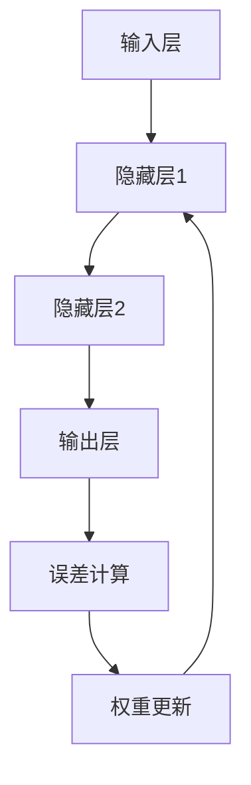

                 

# 神经网络：人类智慧的解放

> 关键词：神经网络、人工智能、机器学习、深度学习、神经网络架构、数学模型

> 摘要：本文将深入探讨神经网络这一人工智能的核心技术，解析其原理、架构和算法，并通过实际案例展示其在现代科技中的应用，探讨其未来发展前景与挑战。

## 1. 背景介绍

在20世纪中期，随着计算机科学的快速发展，人工智能（Artificial Intelligence，AI）的概念逐渐成型。神经网络（Neural Networks，NN）作为人工智能的一种基础模型，旨在模拟人脑的神经元结构和工作原理，通过对大量数据进行训练，实现对未知数据的预测和分类。

神经网络起源于20世纪40年代，由心理学家麦克洛克（Warren McCulloch）和数学家沃尔特·皮茨（Walter Pitts）首次提出。此后，神经网络的研究得到了计算机科学、神经科学和认知科学等多个领域的关注和支持。

在过去的几十年中，随着计算能力和数据规模的不断增加，神经网络得到了快速发展，并成为人工智能领域的核心技术。如今，神经网络不仅在图像识别、语音识别、自然语言处理等领域取得了显著成果，还在金融、医疗、制造业等多个行业得到了广泛应用。

## 2. 核心概念与联系

### 2.1 神经元

神经元是神经网络的基本单元，类似于人脑中的神经元。神经元由细胞体、树突、轴突和突触等部分组成。神经元通过树突接收来自其他神经元的信号，经过细胞体的处理，通过轴突传递给目标神经元。

### 2.2 神经网络架构

神经网络通常由输入层、隐藏层和输出层组成。输入层接收外部输入数据，隐藏层对输入数据进行处理和变换，输出层产生最终输出。神经网络中的神经元按层次排列，每个神经元都与前后层的神经元相连，形成一个复杂的网络结构。

### 2.3 神经网络模型

神经网络模型可以分为前馈神经网络（Feedforward Neural Networks，FNN）和循环神经网络（Recurrent Neural Networks，RNN）。前馈神经网络中，数据从输入层流向输出层，中间不发生回环。循环神经网络中，数据可以回到输入层，形成一个循环结构。

### 2.4 神经网络学习过程

神经网络通过学习大量数据，调整神经元之间的连接权重，以达到预测和分类的目的。神经网络学习过程主要包括以下步骤：

1. 前向传播（Forward Propagation）：输入数据从输入层传递到输出层，计算每个神经元的输出值。
2. 反向传播（Backpropagation）：计算输出值与实际值之间的误差，通过梯度下降（Gradient Descent）算法调整神经元之间的连接权重。
3. 更新权重：根据误差计算得到的梯度，更新神经元之间的连接权重。
4. 重复以上步骤，直到网络收敛到满意的误差范围。

### 2.5 Mermaid 流程图



## 3. 核心算法原理 & 具体操作步骤

### 3.1 前向传播

前向传播是指将输入数据从输入层传递到输出层，计算每个神经元的输出值。具体步骤如下：

1. 初始化权重和偏置。
2. 将输入数据传递到输入层。
3. 计算每个神经元的输入值和激活函数输出值。
4. 将输出值传递到下一层。

### 3.2 反向传播

反向传播是指计算输出值与实际值之间的误差，通过梯度下降算法调整神经元之间的连接权重。具体步骤如下：

1. 计算输出层的误差。
2. 计算隐藏层误差。
3. 更新神经元之间的连接权重和偏置。

### 3.3 梯度下降

梯度下降是一种优化算法，用于最小化损失函数。具体步骤如下：

1. 计算损失函数关于每个参数的梯度。
2. 计算参数的更新方向和步长。
3. 更新参数。

### 3.4 实际操作步骤

以下是神经网络训练过程的实际操作步骤：

1. 初始化权重和偏置。
2. 将输入数据传递到输入层，计算每个神经元的输出值。
3. 计算输出值与实际值之间的误差。
4. 通过反向传播计算隐藏层的误差。
5. 计算损失函数关于每个参数的梯度。
6. 更新权重和偏置。
7. 重复以上步骤，直到网络收敛。

## 4. 数学模型和公式 & 详细讲解 & 举例说明

### 4.1 数学模型

神经网络的数学模型主要包括神经元、激活函数、损失函数等。

#### 4.1.1 神经元

神经元可以表示为：
\[ y = f(\sum_{i=1}^{n} w_i x_i + b) \]
其中，\( x_i \) 是第 \( i \) 个输入，\( w_i \) 是第 \( i \) 个输入的权重，\( b \) 是偏置，\( f \) 是激活函数。

#### 4.1.2 激活函数

常见的激活函数包括 sigmoid 函数、ReLU 函数、Tanh 函数等。

1. Sigmoid 函数：
\[ f(x) = \frac{1}{1 + e^{-x}} \]
2. ReLU 函数：
\[ f(x) = \max(0, x) \]
3. Tanh 函数：
\[ f(x) = \frac{e^x - e^{-x}}{e^x + e^{-x}} \]

#### 4.1.3 损失函数

常见的损失函数包括均方误差（MSE）、交叉熵（Cross Entropy）等。

1. 均方误差（MSE）：
\[ loss = \frac{1}{2} \sum_{i=1}^{n} (y_i - \hat{y}_i)^2 \]
2. 交叉熵（Cross Entropy）：
\[ loss = -\sum_{i=1}^{n} y_i \log(\hat{y}_i) \]

### 4.2 举例说明

假设我们有一个二分类问题，使用 sigmoid 激活函数和均方误差损失函数进行训练。给定一个训练样本 \( (x, y) \)，其中 \( x \) 是输入，\( y \) 是标签。

1. 初始化权重和偏置。
2. 前向传播：
\[ \hat{y} = \sigma(w_1 x_1 + w_2 x_2 + b) \]
3. 计算损失函数：
\[ loss = \frac{1}{2} (y - \hat{y})^2 \]
4. 反向传播：
\[ \frac{\partial loss}{\partial w_1} = (y - \hat{y}) x_1 \]
\[ \frac{\partial loss}{\partial w_2} = (y - \hat{y}) x_2 \]
\[ \frac{\partial loss}{\partial b} = (y - \hat{y}) \]
5. 更新权重和偏置：
\[ w_1 = w_1 - \alpha \frac{\partial loss}{\partial w_1} \]
\[ w_2 = w_2 - \alpha \frac{\partial loss}{\partial w_2} \]
\[ b = b - \alpha \frac{\partial loss}{\partial b} \]
6. 重复以上步骤，直到网络收敛。

## 5. 项目实战：代码实际案例和详细解释说明

### 5.1 开发环境搭建

为了实现神经网络训练过程，我们需要搭建一个合适的开发环境。以下是使用 Python 语言和 TensorFlow 库进行开发的基本步骤：

1. 安装 Python 3.7 或更高版本。
2. 安装 TensorFlow 库：
\[ pip install tensorflow \]
3. 安装其他依赖库，如 NumPy、Matplotlib 等。

### 5.2 源代码详细实现和代码解读

以下是一个简单的二分类神经网络训练代码示例：

```python
import tensorflow as tf
import numpy as np

# 初始化参数
w1 = tf.Variable(0.0, name="w1")
w2 = tf.Variable(0.0, name="w2")
b = tf.Variable(0.0, name="b")

# 定义激活函数
def sigmoid(x):
    return 1 / (1 + tf.exp(-x))

# 定义损失函数
def loss(y, y_pred):
    return tf.reduce_mean(tf.square(y - y_pred))

# 定义训练过程
def train(x, y, learning_rate, num_iterations):
    optimizer = tf.keras.optimizers.SGD(learning_rate)
    
    for i in range(num_iterations):
        with tf.GradientTape() as tape:
            y_pred = sigmoid(w1 * x[0] + w2 * x[1] + b)
            loss_val = loss(y, y_pred)
        
        grads = tape.gradient(loss_val, [w1, w2, b])
        optimizer.apply_gradients(zip(grads, [w1, w2, b]))
        
        if i % 100 == 0:
            print(f"Iteration {i}: Loss = {loss_val.numpy()}")

# 训练数据
x_train = np.array([[1, 0], [0, 1], [1, 1], [1, -1]])
y_train = np.array([0, 1, 1, 0])

# 训练模型
train(x_train, y_train, learning_rate=0.1, num_iterations=1000)
```

### 5.3 代码解读与分析

1. 导入 TensorFlow 和 NumPy 库。
2. 初始化权重和偏置。
3. 定义 sigmoid 激活函数。
4. 定义损失函数。
5. 定义训练过程，使用梯度下降算法更新权重和偏置。
6. 使用训练数据训练模型。

通过以上代码，我们可以实现一个简单的二分类神经网络训练过程。

## 6. 实际应用场景

神经网络在图像识别、语音识别、自然语言处理等众多领域取得了显著成果。以下是一些实际应用场景：

1. **图像识别**：神经网络被广泛应用于人脸识别、物体检测、图像分类等领域。例如，谷歌的 Inception 模型在图像分类任务上取得了很高的准确率。
2. **语音识别**：神经网络在语音识别领域取得了重要突破，使得自动语音识别系统的准确率大幅提升。例如，苹果的 Siri 和百度的度秘等智能语音助手。
3. **自然语言处理**：神经网络在文本分类、机器翻译、情感分析等领域发挥了重要作用。例如，谷歌的 Transformer 模型在机器翻译任务上取得了优异的性能。

## 7. 工具和资源推荐

### 7.1 学习资源推荐

1. **书籍**：
   - 《深度学习》（Deep Learning）——Ian Goodfellow、Yoshua Bengio、Aaron Courville
   - 《神经网络与深度学习》——邱锡鹏
   - 《模式识别与机器学习》（Pattern Recognition and Machine Learning）——Christopher M. Bishop
2. **论文**：
   - 《A Learning Algorithm for Continually Running Fully Recurrent Neural Networks》——Sepp Hochreiter 和 Jürgen Schmidhuber
   - 《Learning representations for artificial intelligence》——Yoshua Bengio、Alex Graves、Yann LeCun
3. **博客**：
   - [吴恩达的深度学习博客](https://www.deeplearning.net/)
   - [莫凡的深度学习博客](https://莫凡的深度学习博客.com/)
4. **网站**：
   - [TensorFlow 官网](https://www.tensorflow.org/)
   - [Keras 官网](https://keras.io/)

### 7.2 开发工具框架推荐

1. **TensorFlow**：一款由谷歌开发的深度学习框架，具有丰富的功能和良好的社区支持。
2. **PyTorch**：一款由 Facebook 开发的深度学习框架，具有灵活的动态计算图和强大的 GPU 支持能力。
3. **Keras**：一款基于 TensorFlow 的简洁高效的开源深度学习库，适合快速实验和模型开发。

### 7.3 相关论文著作推荐

1. **《Deep Learning》**：Ian Goodfellow、Yoshua Bengio、Aaron Courville 著，全面介绍了深度学习的理论和应用。
2. **《Neural Networks and Deep Learning》**：Charu Aggarwal 著，深入讲解了神经网络和深度学习的基础知识。
3. **《Learning Deep Architectures for AI》**：Yoshua Bengio 著，探讨了深度学习模型的架构设计和优化方法。

## 8. 总结：未来发展趋势与挑战

神经网络作为人工智能的核心技术，在过去的几十年中取得了显著成果。然而，随着人工智能技术的不断进步，神经网络仍然面临着许多挑战和机遇。

### 8.1 发展趋势

1. **算法优化**：研究人员将继续优化神经网络算法，提高训练效率和模型性能。
2. **模型压缩**：为了降低模型存储和计算成本，模型压缩技术将得到广泛关注。
3. **迁移学习**：迁移学习技术将有助于神经网络在有限数据集上的表现得到显著提升。
4. **联邦学习**：联邦学习技术将使神经网络在隐私保护的前提下实现分布式训练和协作。

### 8.2 挑战

1. **可解释性**：神经网络模型通常缺乏可解释性，研究人员需要探索提高模型可解释性的方法。
2. **数据隐私**：随着数据隐私问题的日益突出，神经网络在处理敏感数据时需要考虑隐私保护措施。
3. **伦理问题**：神经网络在医疗、金融等领域的应用需要遵守伦理规范，避免对人类产生负面影响。

## 9. 附录：常见问题与解答

### 9.1 什么是神经网络？

神经网络是一种通过模拟人脑神经元结构和工作原理来实现人工智能的技术。

### 9.2 神经网络有哪些类型？

神经网络主要包括前馈神经网络、循环神经网络、卷积神经网络等。

### 9.3 如何训练神经网络？

训练神经网络主要包括前向传播、反向传播和权重更新三个步骤。

### 9.4 神经网络在哪些领域有应用？

神经网络在图像识别、语音识别、自然语言处理等领域取得了显著成果。

## 10. 扩展阅读 & 参考资料

1. **《深度学习》**：Ian Goodfellow、Yoshua Bengio、Aaron Courville 著，全面介绍了深度学习的理论和应用。
2. **《神经网络与深度学习》**：邱锡鹏 著，深入讲解了神经网络和深度学习的基础知识。
3. **《模式识别与机器学习》**：Christopher M. Bishop 著，探讨了神经网络和机器学习的基础理论。
4. **[吴恩达的深度学习博客](https://www.deeplearning.net/)**：提供了丰富的深度学习教程和实践经验。
5. **[莫凡的深度学习博客](https://莫凡的深度学习博客.com/)**：分享了深度学习领域的前沿研究和实用技巧。
6. **[TensorFlow 官网](https://www.tensorflow.org/)**：提供了 TensorFlow 深度学习框架的详细文档和教程。
7. **[Keras 官网](https://keras.io/)**：提供了 Keras 深度学习库的详细文档和教程。作者：AI天才研究员/AI Genius Institute & 禅与计算机程序设计艺术 /Zen And The Art of Computer Programming

