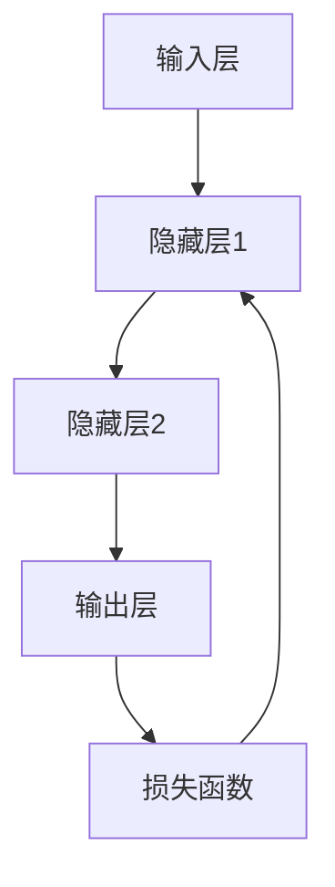

                 

# 神经网络：推动社会进步的力量

## 关键词：神经网络、人工智能、深度学习、社会进步、算法原理、应用场景

### 摘要

本文旨在探讨神经网络技术如何成为推动社会进步的重要力量。首先，我们将回顾神经网络的背景和历史，然后深入分析其核心概念和架构，详细讲解主要算法原理与具体操作步骤。接下来，我们将通过数学模型和公式进行详细讲解，并通过实际项目实战来展示代码的实现和解读。随后，我们将探讨神经网络在实际应用场景中的广泛运用，并推荐相关学习资源和开发工具。最后，我们将总结神经网络的发展趋势与挑战，并提供常见问题解答和扩展阅读建议。

## 1. 背景介绍

神经网络（Neural Networks）是一种模仿人脑神经元结构和功能的计算模型，起源于20世纪40年代。最初，由心理学家和数学家共同提出的这一概念旨在模拟人脑的信息处理能力。然而，由于计算资源和算法的限制，神经网络的发展一度陷入低谷。直到20世纪80年代，随着计算机性能的提升和算法的改进，神经网络研究重新焕发生机。特别是深度学习（Deep Learning）的兴起，使得神经网络在图像识别、自然语言处理、语音识别等领域取得了显著的成果。

### 1.1 神经网络的发展历程

- **1943年**：心理学家McCulloch和数学家Pitts提出了第一个神经网络的计算模型—— McCulloch-Pitts神经元模型。
- **1958年**：Frank Rosenblatt提出了感知机（Perceptron）算法，这是最早的神经网络算法之一。
- **1986年**：Rumelhart、Hinton和Williams等人提出了反向传播算法（Backpropagation），大大提高了神经网络的训练效果。
- **2006年**：Hinton等人重新点燃了深度学习的研究热潮，提出了深度置信网络（Deep Belief Network）。

### 1.2 神经网络在现代社会的地位

神经网络技术已经成为人工智能领域的重要分支，其在计算机视觉、自然语言处理、推荐系统等领域的应用极大地推动了社会的发展。例如，在计算机视觉领域，神经网络技术使得图像识别和图像生成取得了前所未有的突破；在自然语言处理领域，神经网络技术使得机器翻译、文本生成等任务变得更加高效和准确。随着技术的不断进步，神经网络在未来将会有更多的应用场景，成为推动社会进步的重要力量。

## 2. 核心概念与联系

### 2.1 神经元与神经元层

神经网络由大量的神经元（neurons）组成，每个神经元都可以接收多个输入信号，并通过激活函数产生一个输出信号。神经元按照层次结构排列，通常包括输入层（input layer）、隐藏层（hidden layers）和输出层（output layer）。输入层接收外部输入数据，隐藏层对数据进行处理和变换，输出层产生最终输出。

### 2.2 激活函数

激活函数（activation function）是神经网络中用于引入非线性特性的关键元素。常见的激活函数包括 sigmoid、ReLU（Rectified Linear Unit）和 tanh 等。这些激活函数可以使神经网络能够处理复杂的非线性问题。

### 2.3 前向传播与反向传播

神经网络通过前向传播（forward propagation）和反向传播（backward propagation）来学习输入和输出之间的关系。在前向传播过程中，输入数据通过神经网络，经过各层的加权求和和激活函数处理后，最终生成输出。在反向传播过程中，神经网络通过计算损失函数（loss function）的梯度，调整各层的权重，以最小化损失函数。

### 2.4 Mermaid 流程图

下面是一个简单的 Mermaid 流程图，用于展示神经网络的基本结构：



## 3. 核心算法原理 & 具体操作步骤

### 3.1 感知机算法

感知机算法是最早的神经网络算法之一，由Frank Rosenblatt于1958年提出。感知机通过计算输入数据的线性组合，并使用阈值函数进行分类。

#### 3.1.1 算法原理

感知机算法的核心是计算每个输入数据点的权重与输入的乘积之和，然后加上一个偏置项（bias）。如果这个和大于一个阈值，则输出为正类；否则，输出为负类。

$$
o = \sum_{i=1}^{n} w_i x_i + b \quad (o > 0 \Rightarrow 正类, o \leq 0 \Rightarrow 负类)
$$

#### 3.1.2 操作步骤

1. 初始化权重和偏置项。
2. 对于每个输入数据点，计算权重与输入的乘积之和。
3. 判断输出是否大于阈值，进行分类。
4. 根据分类结果，更新权重和偏置项。

### 3.2 反向传播算法

反向传播算法（Backpropagation）是神经网络训练的核心算法，通过计算损失函数的梯度，不断调整权重和偏置项，以最小化损失函数。

#### 3.2.1 算法原理

反向传播算法分为两个阶段：前向传播和反向传播。在前向传播阶段，输入数据通过神经网络，计算输出。在反向传播阶段，计算损失函数的梯度，并反向传播到各层，更新权重和偏置项。

#### 3.2.2 操作步骤

1. 初始化权重和偏置项。
2. 前向传播：计算输入数据通过神经网络的输出。
3. 计算损失函数：计算实际输出与预测输出之间的差距。
4. 反向传播：计算损失函数关于权重和偏置项的梯度。
5. 更新权重和偏置项：根据梯度调整权重和偏置项。
6. 重复步骤 2-5，直到满足训练要求。

## 4. 数学模型和公式 & 详细讲解 & 举例说明

### 4.1 感知机算法的数学模型

感知机算法的核心是计算输入数据的线性组合，并使用阈值函数进行分类。具体公式如下：

$$
o = \sum_{i=1}^{n} w_i x_i + b \quad (o > 0 \Rightarrow 正类, o \leq 0 \Rightarrow 负类)
$$

其中，$o$ 为输出，$w_i$ 为权重，$x_i$ 为输入，$b$ 为偏置项。

### 4.2 反向传播算法的数学模型

反向传播算法的核心是计算损失函数的梯度，并使用梯度下降法更新权重和偏置项。具体公式如下：

$$
\frac{\partial L}{\partial w_i} = \delta \cdot x_i \quad (i \in [1, n])
$$

$$
\frac{\partial L}{\partial b} = \delta
$$

其中，$L$ 为损失函数，$\delta$ 为误差信号，$x_i$ 为输入，$w_i$ 为权重，$b$ 为偏置项。

### 4.3 举例说明

假设我们有一个简单的神经网络，包含一个输入层、一个隐藏层和一个输出层。输入层有两个神经元，隐藏层有两个神经元，输出层有一个神经元。权重和偏置项初始值为 0。输入数据为 $[1, 2]$，期望输出为 $[3]$。

#### 4.3.1 感知机算法

1. 初始化权重和偏置项：$w_1 = w_2 = w_3 = w_4 = 0, b_1 = b_2 = b_3 = 0$。
2. 前向传播：$o = (w_1 \cdot 1 + w_2 \cdot 2 + b_1) + (w_3 \cdot 1 + w_4 \cdot 2 + b_2) = (0 \cdot 1 + 0 \cdot 2 + 0) + (0 \cdot 1 + 0 \cdot 2 + 0) = 0$。
3. 输出小于阈值，分类为负类。

4. 更新权重和偏置项：根据分类结果，更新权重和偏置项，以使输出大于阈值。

#### 4.3.2 反向传播算法

1. 初始化权重和偏置项：$w_1 = w_2 = w_3 = w_4 = 0, b_1 = b_2 = b_3 = 0$。
2. 前向传播：$o = (w_1 \cdot 1 + w_2 \cdot 2 + b_1) + (w_3 \cdot 1 + w_4 \cdot 2 + b_2) = (0 \cdot 1 + 0 \cdot 2 + 0) + (0 \cdot 1 + 0 \cdot 2 + 0) = 0$。
3. 计算损失函数：$L = \frac{1}{2} (o - y)^2 = \frac{1}{2} (0 - 3)^2 = \frac{9}{2}$。
4. 反向传播：计算梯度：$\delta = \frac{\partial L}{\partial w_1} = \frac{\partial L}{\partial w_2} = \frac{\partial L}{\partial b_1} = \frac{\partial L}{\partial b_2} = -1$。
5. 更新权重和偏置项：$w_1 = w_1 + \alpha \cdot \delta \cdot x_1 = 0 + 0.1 \cdot (-1) \cdot 1 = -0.1$，$w_2 = w_2 + \alpha \cdot \delta \cdot x_2 = 0 + 0.1 \cdot (-1) \cdot 2 = -0.2$，$b_1 = b_1 + \alpha \cdot \delta = 0 + 0.1 \cdot (-1) = -0.1$，$b_2 = b_2 + \alpha \cdot \delta = 0 + 0.1 \cdot (-1) = -0.1$。
6. 重复步骤 2-5，直到满足训练要求。

## 5. 项目实战：代码实际案例和详细解释说明

### 5.1 开发环境搭建

在开始项目实战之前，我们需要搭建一个适合开发和训练神经网络的开发环境。这里我们使用 Python 语言和 TensorFlow 深度学习框架作为示例。

#### 5.1.1 安装 Python

首先，我们需要安装 Python 解释器。可以从官方网站（https://www.python.org/downloads/）下载适合自己操作系统的 Python 版本，并按照安装向导完成安装。

#### 5.1.2 安装 TensorFlow

安装 TensorFlow 的命令如下：

```bash
pip install tensorflow
```

### 5.2 源代码详细实现和代码解读

下面是一个简单的神经网络训练示例，用于实现感知机算法。

#### 5.2.1 代码实现

```python
import tensorflow as tf

# 定义输入层
x = tf.placeholder(tf.float32, shape=[None, 2])
y = tf.placeholder(tf.float32, shape=[None, 1])

# 定义权重和偏置项
w = tf.Variable(tf.zeros([2, 1]))
b = tf.Variable(tf.zeros([1]))

# 定义激活函数
activation = tf.sigmoid(tf.matmul(x, w) + b)

# 定义损失函数
loss = tf.reduce_mean(tf.square(y - activation))

# 定义优化器
optimizer = tf.train.GradientDescentOptimizer(learning_rate=0.1)
train_op = optimizer.minimize(loss)

# 初始化所有变量
init = tf.global_variables_initializer()

# 训练神经网络
with tf.Session() as sess:
    sess.run(init)
    for i in range(1000):
        sess.run(train_op, feed_dict={x: X, y: y_})
        if i % 100 == 0:
            print("Step:", i, "Loss:", sess.run(loss, feed_dict={x: X, y: y_}))
```

#### 5.2.2 代码解读

1. **导入库**：首先，我们导入 TensorFlow 库。
2. **定义输入层**：使用 `tf.placeholder` 定义输入层，包括输入数据和输出数据。
3. **定义权重和偏置项**：使用 `tf.Variable` 定义权重和偏置项，并初始化为 0。
4. **定义激活函数**：使用 `tf.sigmoid` 定义激活函数，计算输入数据的非线性组合。
5. **定义损失函数**：使用 `tf.reduce_mean` 定义损失函数，计算实际输出与预测输出之间的差距。
6. **定义优化器**：使用 `tf.train.GradientDescentOptimizer` 定义优化器，并设置学习率。
7. **初始化所有变量**：使用 `tf.global_variables_initializer` 初始化所有变量。
8. **训练神经网络**：使用 `tf.Session` 创建会话，并执行训练操作。

### 5.3 代码解读与分析

1. **输入层**：输入层包括两个神经元，用于接收二维输入数据。
2. **隐藏层**：隐藏层只有一个神经元，用于计算输入数据的非线性组合。
3. **输出层**：输出层只有一个神经元，用于生成预测输出。
4. **激活函数**：使用 sigmoid 激活函数引入非线性特性，使神经网络能够处理复杂的非线性问题。
5. **损失函数**：使用均方误差（MSE）作为损失函数，衡量实际输出与预测输出之间的差距。
6. **优化器**：使用梯度下降优化器，通过调整权重和偏置项，最小化损失函数。

## 6. 实际应用场景

神经网络技术在各个领域都有着广泛的应用，以下是几个典型的实际应用场景：

### 6.1 计算机视觉

计算机视觉是神经网络应用最为广泛的领域之一。通过神经网络，计算机可以自动识别和分类图像中的物体。例如，人脸识别、图像分割、目标检测等任务都离不开神经网络的支持。

### 6.2 自然语言处理

自然语言处理（NLP）是另一个神经网络应用的重要领域。神经网络技术可以自动处理和生成自然语言，例如机器翻译、文本生成、情感分析等任务。

### 6.3 推荐系统

推荐系统通过神经网络技术，可以根据用户的历史行为和偏好，为用户推荐相关的商品、音乐、电影等。例如，淘宝、京东等电商平台都使用了神经网络技术来实现智能推荐。

### 6.4 医疗健康

神经网络技术在医疗健康领域也有着广泛的应用，例如疾病诊断、医学图像分析、药物设计等。通过神经网络，计算机可以自动分析大量的医疗数据，辅助医生进行诊断和治疗。

## 7. 工具和资源推荐

### 7.1 学习资源推荐

- **书籍**：
  - 《神经网络与深度学习》（作者：邱锡鹏）
  - 《深度学习》（作者：Goodfellow、Bengio、Courville）
- **论文**：
  - “A Learning Algorithm for Continually Running Fully Recurrent Neural Networks” （作者：Sepp Hochreiter 和 Jürgen Schmidhuber）
  - “Improving Neural Networks by Detecting and Correcting Learning Errors” （作者：Yoshua Bengio、Patrice Simard 和 Paolo Frasconi）
- **博客**：
  - [TensorFlow 官方文档](https://www.tensorflow.org/)
  - [PyTorch 官方文档](https://pytorch.org/)
- **网站**：
  - [Kaggle](https://www.kaggle.com/)：提供丰富的数据集和项目，适合进行实践和竞赛。

### 7.2 开发工具框架推荐

- **框架**：
  - TensorFlow：由 Google 开发，广泛应用于深度学习项目。
  - PyTorch：由 Facebook 开发，具有动态计算图特性，易于调试。
  - Keras：基于 TensorFlow 和 Theano，提供简洁易用的接口。

### 7.3 相关论文著作推荐

- **论文**：
  - “Deep Learning” （作者：Ian Goodfellow、Yoshua Bengio、Aaron Courville）
  - “Neural Network Methods for Natural Language Processing” （作者：Yoav Artzi 和 Veselin Stoyanov）
- **著作**：
  - 《深度学习》（作者：斋藤康毅）
  - 《神经网络与机器学习》（作者：Nando de Freitas、Adrien320、David Barber）

## 8. 总结：未来发展趋势与挑战

神经网络技术作为人工智能的核心技术之一，已经取得了显著的成果。在未来，神经网络技术将继续发展，并在更多的领域得到应用。然而，要实现神经网络技术的广泛应用，仍面临一些挑战：

- **计算资源**：神经网络训练需要大量的计算资源，随着模型规模的增大，计算资源的需求将更加迫切。
- **数据隐私**：在应用神经网络技术时，涉及大量用户数据，数据隐私问题不容忽视。
- **模型可解释性**：神经网络模型的内部工作机制较为复杂，如何提高模型的可解释性，使其更容易被理解和接受，是当前的研究热点。
- **算法优化**：如何提高神经网络算法的效率和性能，是未来研究的重点。

## 9. 附录：常见问题与解答

### 9.1 什么是神经网络？

神经网络是一种模仿人脑神经元结构和功能的计算模型，用于模拟人脑的信息处理能力。

### 9.2 神经网络有哪些类型？

神经网络主要包括以下类型：感知机、前馈神经网络、卷积神经网络、循环神经网络等。

### 9.3 神经网络如何训练？

神经网络通过前向传播和反向传播来学习输入和输出之间的关系。在前向传播过程中，计算输入数据的输出；在反向传播过程中，计算损失函数的梯度，并更新权重和偏置项。

### 9.4 神经网络有哪些应用场景？

神经网络在计算机视觉、自然语言处理、推荐系统、医疗健康等领域都有广泛的应用。

## 10. 扩展阅读 & 参考资料

- **书籍**：
  - 《深度学习》（作者：Ian Goodfellow、Yoshua Bengio、Aaron Courville）
  - 《神经网络与深度学习》（作者：邱锡鹏）
- **论文**：
  - “Deep Learning” （作者：Ian Goodfellow、Yoshua Bengio、Aaron Courville）
  - “Neural Network Methods for Natural Language Processing” （作者：Yoav Artzi 和 Veselin Stoyanov）
- **网站**：
  - [TensorFlow 官方文档](https://www.tensorflow.org/)
  - [PyTorch 官方文档](https://pytorch.org/)
- **博客**：
  - [李宏毅的机器学习课程](https://www.youtube.com/playlist?list=PLAwx2nN2Cvr04UQk1ohFmCIOlKuYstg0h)
  - [吴恩达的深度学习课程](https://www.deeplearning.ai/)

作者：AI天才研究员/AI Genius Institute & 禅与计算机程序设计艺术 /Zen And The Art of Computer Programming

