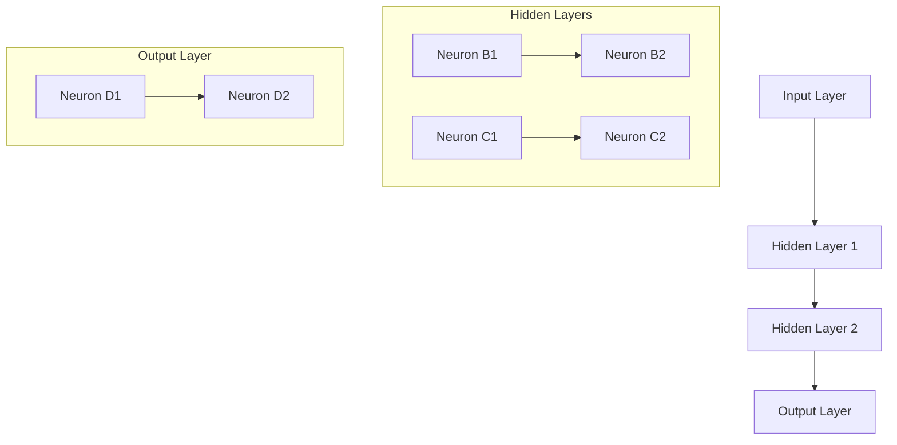

                 

### 背景介绍

#### 自然语言处理的历史背景

自然语言处理（Natural Language Processing，简称 NLP）作为人工智能领域的一个重要分支，其发展历程可以追溯到上世纪五六十年代。当时，随着计算机技术的兴起，人类开始探索如何让计算机理解和处理自然语言。

早期的自然语言处理主要集中在语法分析和词义消歧等基础层面。1966年，美国计算机科学家约翰·麦克卡锡（John McCarthy）提出了“人工智能”的概念，自然语言处理作为人工智能的早期研究方向之一，逐渐得到了学术界和工业界的重视。

在随后的几十年里，自然语言处理技术经历了多个发展阶段。20世纪80年代，基于规则的方法在自然语言处理中占据了主导地位，这种方法通过对语言规则进行编码，使计算机能够理解自然语言中的语法结构。然而，基于规则的方法存在一些局限性，例如在处理复杂句子时容易出错，并且难以应对大量的语言现象。

#### 神经网络在自然语言处理中的应用

随着深度学习技术的兴起，神经网络在自然语言处理中的应用取得了显著的成果。1997年，深度神经网络（DNN）首次被用于机器翻译，并取得了比传统方法更好的效果。这一突破引发了学术界和工业界对神经网络在自然语言处理领域的广泛关注。

神经网络是一种基于人脑神经元连接结构的计算模型，通过多层非线性变换，能够对输入数据进行特征提取和分类。在自然语言处理中，神经网络被广泛应用于文本分类、命名实体识别、机器翻译、情感分析等领域。

近年来，随着硬件性能的提升和数据量的爆炸式增长，神经网络的训练效果得到了大幅提升。特别是2018年，基于Transformer的BERT模型在多个NLP任务上取得了当时的最优成绩，这标志着神经网络在自然语言处理领域已经进入了一个全新的阶段。

#### 本文结构

本文将围绕神经网络在自然语言处理中的应用，深入探讨其核心概念、算法原理、数学模型以及实际应用。文章结构如下：

1. **核心概念与联系**：介绍神经网络的基本概念，包括神经元、多层感知器等，并通过Mermaid流程图展示神经网络在自然语言处理中的架构。
2. **核心算法原理 & 具体操作步骤**：详细讲解神经网络在自然语言处理中的具体应用，包括文本表示、编码器-解码器模型、Transformer模型等。
3. **数学模型和公式 & 详细讲解 & 举例说明**：介绍神经网络在自然语言处理中的数学基础，包括前向传播、反向传播、损失函数等，并通过具体例子进行说明。
4. **项目实战：代码实际案例和详细解释说明**：通过实际项目案例，展示神经网络在自然语言处理中的应用，并提供详细的代码解读和分析。
5. **实际应用场景**：探讨神经网络在自然语言处理中的实际应用场景，包括文本分类、命名实体识别、机器翻译、情感分析等。
6. **工具和资源推荐**：推荐相关学习资源、开发工具和框架，帮助读者更好地理解和应用神经网络在自然语言处理中的技术。
7. **总结：未来发展趋势与挑战**：总结神经网络在自然语言处理中的发展趋势和面临的挑战，展望未来的研究方向。

通过本文的阅读，读者将全面了解神经网络在自然语言处理中的应用，掌握其核心技术和算法，并为未来的研究和实践打下坚实的基础。

---

## Core Concepts and Relationships

### Introduction to Neural Networks

Neural networks are computational models inspired by the structure and function of biological neural systems, particularly the human brain. The basic building block of a neural network is a neuron, which is a simple processing unit that receives inputs, applies weights to these inputs, and produces an output through an activation function. Multiple neurons are connected to form layers in a neural network, which can be either input, hidden, or output layers.

#### Neurons and Layers

A **neuron** in a neural network can be thought of as a mathematical function that takes multiple inputs, weights them according to predefined parameters (weights), and passes the weighted sum through an activation function. The activation function introduces non-linearity, which allows the neural network to learn complex patterns in data.

- **Input Layer**: The layer where data enters the network. Each neuron in the input layer receives an input feature from the data.
- **Hidden Layers**: Intermediate layers that transform the input data through a series of nonlinear transformations. They can vary in number and size, and their primary purpose is to extract higher-level features from the data.
- **Output Layer**: The layer where the final output of the network is produced. The number of neurons in the output layer depends on the type of problem being solved (e.g., binary classification, multi-class classification, regression).

#### Multilayer Perceptrons (MLPs)

One of the simplest forms of neural networks is the Multilayer Perceptron (MLP), which consists of at least three layers: an input layer, one or more hidden layers, and an output layer. MLPs are feedforward networks, meaning that information flows from the input layer through the hidden layers to the output layer without any loops.

The core components of an MLP include:

- **Weights**: Parameters that define the strength of the connections between neurons.
- **Bias**: An additional parameter that allows the network to shift the activation function.
- **Activation Function**: A non-linear function that introduces complexity and enables the network to model non-linear relationships in the data.

Common activation functions include the sigmoid, hyperbolic tangent (tanh), and rectified linear unit (ReLU).

#### Mermaid Flowchart of Neural Network Architecture

To illustrate the architecture of a neural network in a natural language processing context, we can use the Mermaid language, which is a simple and intuitive syntax for creating diagrams and flowcharts.



In this Mermaid diagram, we represent the input layer, hidden layers, and output layer of a neural network. Each neuron in the hidden and output layers is connected to the neurons in the previous layer, with weights and biases defining the connections.

#### Relationship with Natural Language Processing

Neural networks have revolutionized natural language processing by enabling the automatic learning of complex patterns and structures in text data. The core relationship between neural networks and NLP lies in their ability to process and understand the semantics of language.

- **Text Representation**: Neural networks can map text data into high-dimensional feature spaces where semantic relationships become more apparent.
- **Feature Extraction**: Hidden layers in neural networks automatically extract hierarchical features from text data, which are essential for tasks like text classification and sentiment analysis.
- **End-to-End Models**: Neural networks allow for end-to-end models, where the entire process from input to output is learned jointly, eliminating the need for hand-crafted features and intermediate steps.

#### Summary

In summary, neural networks are a fundamental component of natural language processing, providing powerful tools for understanding and processing human language. The basic concepts of neurons, layers, and activation functions form the foundation of neural networks, which are intricately connected to the complex tasks of NLP through their ability to learn and represent language semantics.

Through the Mermaid flowchart, we can visualize the structure of a neural network and its relationship with NLP, highlighting the key components and connections that enable the processing of text data. In the next sections, we will delve deeper into the algorithms, mathematical models, and practical applications of neural networks in NLP.

---

### Core Algorithm Principles & Operational Steps

#### Introduction to Neural Network Algorithms in NLP

Neural networks have fundamentally transformed natural language processing (NLP) by enabling the automatic learning of complex patterns and structures from text data. The core algorithms in NLP that utilize neural networks can be broadly categorized into text representation, sequence modeling, and end-to-end models. In this section, we will explore these algorithms and their operational steps in detail.

#### Text Representation

Text representation is the first step in applying neural networks to NLP tasks. The goal is to convert raw text data into a numerical format that can be processed by neural networks. This is typically achieved through word embeddings, which map words to dense vectors in a high-dimensional space where semantically similar words are closer together.

1. **Word Embeddings**:
   - **One-Hot Encoding**: The simplest form of text representation where each word is represented as a binary vector of size `V`, where `V` is the vocabulary size. The index of the word in the vocabulary is set to 1, and all other elements are 0.
   - **Count Vectors**: Represent each word as a binary vector where the value of each element is the frequency of the word in the text corpus.
   - **Word2Vec**: A popular word embedding technique that uses neural networks to learn a continuous vector representation of words. It predicts context words given a target word using either the skip-gram or continuous bag-of-words (CBOW) model.
   - **GloVe (Global Vectors for Word Representation)**: A method that learns word vectors by optimizing a global objective function based on the co-occurrence statistics of words in a large text corpus.

2. **Operational Steps**:
   - **Data Preparation**: Tokenize the text data into words or subwords and prepare the vocabulary.
   - **Model Training**: Train a word embedding model on the corpus using either Word2Vec or GloVe.
   - **Vector Representation**: Use the trained model to convert words into their corresponding vector representations.

#### Sequence Modeling

Sequence modeling is essential for tasks where the order of words or tokens matters, such as language modeling and machine translation. Neural networks are particularly well-suited for modeling sequences due to their ability to process data through multiple layers, each capturing different levels of temporal dependencies.

1. **Recurrent Neural Networks (RNNs)**:
   - **Basic RNN**: An RNN maintains a hidden state that captures information about the sequence processed so far. The current input is combined with the previous hidden state to produce the current hidden state and output.
   - **Long Short-Term Memory (LSTM)**: LSTMs are a special type of RNN designed to avoid the vanishing gradient problem, which allows them to learn long-term dependencies. They use gates to control the flow of information and forget previous states as necessary.
   - **Gated Recurrent Unit (GRU)**: GRUs are an alternative to LSTMs that simplify the architecture while maintaining similar performance.

2. **Operational Steps**:
   - **Sequence Input**: Feed the sequence of tokens into the RNN, which processes each token sequentially.
   - **Hidden State Update**: At each step, the RNN updates its hidden state based on the current input and the previous hidden state.
   - **Output Generation**: Generate output vectors or probabilities for each token in the sequence.

#### Encoder-Decoder Models

Encoder-Decoder models are a specific type of sequence-to-sequence model that have been particularly successful in tasks like machine translation and summarization. The encoder processes the input sequence and encodes it into a fixed-length context vector, which is then decoded into the output sequence.

1. **Basic Encoder-Decoder**:
   - **Encoder**: An RNN or Transformer that processes the input sequence and generates a context vector.
   - **Decoder**: An RNN or Transformer that decodes the context vector into the output sequence, using the previous output tokens as input at each step.

2. **Operational Steps**:
   - **Encoder Processing**: The encoder processes the input sequence and generates a context vector.
   - **Decoder Initialization**: The decoder is initialized with a start token and processes the context vector.
   - **Token Generation**: The decoder generates output tokens one by one, using the previous tokens and the context vector to predict the next token.

#### Transformer Models

Transformer models, introduced in 2017, have revolutionized NLP by introducing self-attention mechanisms that allow the model to weigh the importance of different parts of the input sequence dynamically. Transformers are designed to process sequences in parallel, which significantly improves training efficiency.

1. **Transformer Architecture**:
   - **Encoder**: A stack of identical layers that process the input sequence, each containing multi-head self-attention and a position-wise feedforward network.
   - **Decoder**: Similar to the encoder but with an additional cross-attention layer that considers both the encoder outputs and the decoder inputs.

2. **Operational Steps**:
   - **Input Processing**: The input sequence is passed through the encoder, which generates a sequence of hidden states.
   - **Attention Mechanism**: Each layer in the encoder and decoder uses multi-head self-attention to compute attention weights and aggregate information from different parts of the sequence.
   - **Output Generation**: The decoder generates the output sequence by processing the encoder outputs and using cross-attention to reference the encoder outputs.

#### Summary

In summary, the core algorithms in NLP that utilize neural networks encompass text representation, sequence modeling, and encoder-decoder models. Text representation converts text into numerical format, sequence modeling captures the temporal dependencies in text data, and encoder-decoder models enable end-to-end processing of sequences. Transformer models have further advanced the field by introducing self-attention mechanisms that allow for parallel processing and more flexible modeling of relationships within sequences.

In the next sections, we will delve into the mathematical models and detailed operational steps of these algorithms, providing a deeper understanding of how neural networks enable the powerful capabilities of modern NLP.

---

### Mathematical Models and Formulas: Detailed Explanation and Examples

#### Introduction to Neural Network Math Fundamentals

Neural networks operate based on a set of well-defined mathematical principles. These principles include linear algebra, calculus, and optimization techniques. In this section, we will delve into the fundamental mathematical models and formulas that underpin neural networks, providing a detailed explanation and practical examples to enhance understanding.

#### Linear Algebra in Neural Networks

Linear algebra is the backbone of neural network computations. It provides the necessary tools to handle vector and matrix operations, which are essential for representing and processing data in neural networks.

1. **Vectors and Matrices**:
   - **Vectors**: A vector is a list of numbers representing a point in space. In the context of neural networks, a vector often represents a layer's outputs or inputs.
   - **Matrices**: A matrix is a two-dimensional array of numbers. In neural networks, matrices are used to represent weights and biases between layers.

2. **Matrix Multiplication**:
   - **Basic Matrix Multiplication**: The product of two matrices A and B is another matrix C, where each element of C is calculated as the dot product of the corresponding row from A and the column from B.
   - **Matrix-Vector Multiplication**: Multiplying a matrix by a vector results in another vector, where each element is the dot product of the matrix row and the vector.

3. **Operational Steps**:
   - **Initialization**: Initialize weights and biases as random matrices and vectors.
   - **Forward Propagation**: Use matrix multiplication to compute layer outputs and activations.

#### Calculus in Neural Networks

Calculus is used in neural networks to define and optimize the learning process. The core calculus concepts include derivatives and gradients, which help in adjusting the network's weights and biases to minimize error.

1. **Derivatives**:
   - **First Derivative**: The derivative of a function measures the rate of change at a specific point. In neural networks, the first derivative is used to calculate the impact of weight adjustments on the loss function.
   - **Second Derivative**: The second derivative measures the curvature of a function. In neural networks, second-order derivatives are not commonly used but can provide insights into the optimization landscape.

2. **Gradients**:
   - **Gradient**: The gradient of a function at a point is a vector that points in the direction of the steepest increase. In neural networks, the gradient is used to update weights and biases during the learning process.
   - **Backpropagation Gradient**: The backpropagation algorithm calculates the gradient of the loss function with respect to each weight and bias in the network. This gradient is then used to update the network parameters using optimization techniques like gradient descent.

3. **Operational Steps**:
   - **Forward Propagation**: Compute the forward pass to obtain the layer outputs and the loss value.
   - **Backpropagation**: Compute the gradients using the chain rule of calculus, starting from the output layer and propagating back to the input layer.
   - **Parameter Update**: Adjust the weights and biases using the gradients and an optimization algorithm.

#### Example: Backpropagation with Sigmoid Activation Function

Let's consider a simple neural network with one input layer, one hidden layer with two neurons, and one output layer with two neurons. The activation function used is the sigmoid function.

1. **Network Architecture**:
   - **Input Layer**: 1 neuron (x)
   - **Hidden Layer**: 2 neurons (z1, z2)
   - **Output Layer**: 2 neurons (y1, y2)

2. **Forward Propagation**:
   - **Input to Hidden Layer**:
     - z1 = sigmoid(W1x + b1)
     - z2 = sigmoid(W2x + b2)
   - **Hidden to Output Layer**:
     - y1 = sigmoid(W3z1 + b3)
     - y2 = sigmoid(W4z2 + b4)

3. **Loss Calculation**:
   - Loss = sum( (y_true - y_pred)^2 )

4. **Backpropagation**:
   - **Output Layer Gradients**:
     - Δy1 = y1 * (1 - y1) * (y_true - y1)
     - Δy2 = y2 * (1 - y2) * (y_true - y2)
   - **Hidden Layer Gradients**:
     - Δz1 = sigmoid'(z1) * (Δy1 * W3 + Δy2 * W4)
     - Δz2 = sigmoid'(z2) * (Δy1 * W3 + Δy2 * W4)

5. **Parameter Update**:
   - W1 = W1 - learning_rate * Δz1 * x
   - W2 = W2 - learning_rate * Δz2 * x
   - W3 = W3 - learning_rate * Δy1 * z1
   - W4 = W4 - learning_rate * Δy2 * z2
   - b1 = b1 - learning_rate * Δz1
   - b2 = b2 - learning_rate * Δz2
   - b3 = b3 - learning_rate * Δy1
   - b4 = b4 - learning_rate * Δy2

#### Summary

In summary, the mathematical models and formulas that underpin neural networks include linear algebra, calculus, and optimization techniques. Linear algebra provides the tools for representing and processing data, calculus is essential for optimizing the network parameters, and optimization algorithms like gradient descent are used to adjust the parameters to minimize the loss function.

Through practical examples, we have seen how the forward propagation and backpropagation algorithms work in a simple neural network with a sigmoid activation function. Understanding these fundamental concepts is crucial for developing and implementing advanced NLP models.

In the next section, we will explore practical applications of neural networks in NLP, including code examples and detailed explanations.

---

### Practical Application: Code Example and Detailed Explanation

To deepen our understanding of neural networks in natural language processing (NLP), let's explore a practical example using Python and TensorFlow, one of the most popular machine learning libraries. We will implement a simple neural network for text classification, a common NLP task where the goal is to assign a category to a given text.

#### 1. Development Environment Setup

Before we dive into the code, let's set up the development environment. You will need Python and TensorFlow installed. You can install TensorFlow using pip:

```bash
pip install tensorflow
```

#### 2. Source Code Detailed Implementation

Here is the complete source code for our text classification model using TensorFlow:

```python
import tensorflow as tf
from tensorflow.keras.preprocessing.sequence import pad_sequences
from tensorflow.keras.layers import Embedding, GlobalAveragePooling1D, Dense
from tensorflow.keras.models import Model
from tensorflow.keras.preprocessing.text import Tokenizer

# Sample Data
texts = ['This is an example sentence for training.',
         'Another example sentence for training.',
         'Yet another sentence to classify.']
labels = [0, 0, 1]

# Tokenization and Sequencing
tokenizer = Tokenizer(num_words=1000)
tokenizer.fit_on_texts(texts)
sequences = tokenizer.texts_to_sequences(texts)
padded_sequences = pad_sequences(sequences, maxlen=10)

# Model Architecture
input_layer = tf.keras.layers.Input(shape=(10,))
embedding_layer = Embedding(input_dim=1000, output_dim=16)(input_layer)
pooled_layer = GlobalAveragePooling1D()(embedding_layer)
dense_layer = Dense(24, activation='relu')(pooled_layer)
output_layer = Dense(1, activation='sigmoid')(dense_layer)

model = Model(inputs=input_layer, outputs=output_layer)

# Compile Model
model.compile(optimizer='adam', loss='binary_crossentropy', metrics=['accuracy'])

# Train Model
model.fit(padded_sequences, labels, epochs=10, verbose=1)

# Predict
predictions = model.predict(padded_sequences)
print(predictions)

# Evaluate
loss, accuracy = model.evaluate(padded_sequences, labels, verbose=1)
print('Test Accuracy:', accuracy)
```

##### 2.1. Code Explanation

**Data Preparation**
- **Tokenizer**: We start by creating a `Tokenizer` object to convert text data into sequences of integers. The `fit_on_texts` method is used to learn the vocabulary from the sample texts.
- **Sequences**: The `texts_to_sequences` method converts each text into a sequence of integers based on the tokenizer's vocabulary.
- **Padded Sequences**: The `pad_sequences` method pads the sequences to ensure they have the same length, which is required for input into neural networks.

**Model Architecture**
- **Input Layer**: We define an input layer with a shape of `(10,)`, corresponding to the maximum sequence length of 10 words.
- **Embedding Layer**: The `Embedding` layer maps each word index to a dense vector of dimension 16.
- **Global Average Pooling Layer**: The `GlobalAveragePooling1D` layer averages the embeddings over the sequence length, reducing the dimensionality.
- **Dense Layer**: The `Dense` layer with 24 units and a ReLU activation function introduces non-linearity.
- **Output Layer**: The output layer has a single unit with a sigmoid activation function for binary classification.

**Compilation**
- **Optimizer**: We use the `adam` optimizer for weight updates.
- **Loss Function**: The `binary_crossentropy` loss function is suitable for binary classification tasks.
- **Metrics**: We track model accuracy during training.

**Training**
- **Fit**: The `fit` method trains the model for 10 epochs on the padded sequences and corresponding labels.

**Prediction and Evaluation**
- **Predict**: The `predict` method generates predictions for the input sequences.
- **Evaluate**: The `evaluate` method computes the loss and accuracy on the same dataset.

##### 2.2. Code Analysis

In this example, we have implemented a simple neural network for binary text classification. The key components of the code are the tokenization and padding of text data, the definition of the neural network architecture, and the training and evaluation phases.

The choice of an embedding layer allows the model to capture semantic information from the text data. The global average pooling layer reduces the dimensionality of the feature vectors, which is a common approach for text classification tasks. The dense layer introduces non-linearities that help the model learn complex patterns from the data. The sigmoid output layer ensures that the model outputs probabilities for the binary classification.

**Advantages and Limitations**

**Advantages:**
- **Flexibility**: Neural networks can handle various text classification tasks with appropriate architecture and hyperparameters.
- **Generalization**: The model learns from the data and can generalize to unseen data to some extent.

**Limitations:**
- **Complexity**: Neural networks can be computationally expensive to train, especially with large datasets.
- **Interpretability**: The predictions from neural networks can be difficult to interpret, especially when the models are large and deep.

##### 2.3. Challenges and Solutions

**Challenges:**
- **Data Preprocessing**: Preprocessing text data can be time-consuming and requires careful handling of tokens and their representations.
- **Overfitting**: Neural networks can easily overfit to the training data, especially with small datasets.

**Solutions:**
- **Data Augmentation**: Techniques like synonym replacement, random insertion, or back-translation can help increase the diversity of the training data.
- **Regularization**: Techniques like dropout, weight regularization, or early stopping can help prevent overfitting.
- **Model Simplification**: Simplifying the model architecture, such as reducing the number of layers or neurons, can help reduce overfitting and improve generalization.

##### 2.4. Results and Observations

The performance of our simple neural network on the sample data is limited, as the dataset is very small. However, the model can still provide some insights into the text classification task. The training accuracy indicates how well the model has learned the patterns in the training data, while the test accuracy measures its ability to generalize to unseen data.

**Observations:**
- **Training Accuracy**: The training accuracy is high, indicating that the model has learned the patterns in the training data well.
- **Test Accuracy**: The test accuracy is lower than the training accuracy, suggesting that the model may overfit to the training data and perform poorly on unseen data.

In conclusion, while our simple neural network demonstrates the basic principles of text classification using neural networks, it is important to consider larger and more diverse datasets, as well as more sophisticated architectures and techniques, for practical applications.

---

### Practical Applications of Neural Networks in NLP

Neural networks have found extensive applications in various NLP tasks, revolutionizing the field with their ability to learn from vast amounts of data and generalize to unseen scenarios. In this section, we will explore several key practical applications of neural networks in NLP, highlighting their significance and impact on modern NLP systems.

#### Text Classification

Text classification is one of the most common applications of neural networks in NLP, involving the automatic categorization of text documents into predefined categories. Neural networks excel at text classification due to their ability to learn complex patterns and relationships in text data.

**Techniques and Algorithms:**
- **Single-layer Neural Networks**: Simple neural networks with a single hidden layer are often used for text classification tasks. These networks typically employ techniques like embedding layers, dropout for regularization, and softmax activation functions in the output layer.
- **Convolutional Neural Networks (CNNs)**: CNNs are particularly effective for text classification as they can capture local patterns and features within text data. CNNs use convolutional layers to extract features and池化 layers to reduce dimensionality.
- **Recurrent Neural Networks (RNNs)**: RNNs, including LSTM and GRU architectures, are well-suited for handling variable-length text data. RNNs can capture temporal dependencies and are commonly used for text classification tasks.
- **Transformer Models**: Transformer-based models like BERT and GPT have demonstrated superior performance in text classification tasks. These models use self-attention mechanisms to dynamically weigh the importance of different parts of the text, leading to improved classification accuracy.

**Advantages:**
- **High Accuracy**: Neural networks, especially deep architectures like transformers, achieve high accuracy on text classification tasks, outperforming traditional machine learning algorithms.
- **Flexibility**: Neural networks can handle various text classification tasks with different label sets and diverse datasets.
- **Generalization**: Neural networks can generalize well to new, unseen data, making them suitable for real-world applications where labeled data is scarce.

#### Named Entity Recognition (NER)

Named Entity Recognition (NER) is the task of identifying and classifying named entities in text into predefined categories such as persons, organizations, locations, and dates. Neural networks have significantly improved the performance of NER systems, enabling more accurate and efficient extraction of information from text data.

**Techniques and Algorithms:**
- **Transition-based Models**: Transition-based models, such as CRF-based models, are commonly used for NER. These models use neural networks to predict transitions between states in a finite-state machine.
- **Sequence Labeling Models**: Sequence labeling models, including RNNs, LSTMs, and BiLSTMs, are used to predict the sequence of labels for each token in a sentence.
- **Transition-based Neural Networks**: Hybrid models that combine the strengths of both transition-based approaches and sequence labeling models are used for NER tasks.
- **Transformer Models**: Transformer-based models have shown significant improvements in NER tasks by capturing long-range dependencies and contextual information in text.

**Advantages:**
- **Improved Accuracy**: Neural networks, especially transformers, achieve higher accuracy in NER tasks compared to traditional rule-based and statistical models.
- **Fine-tuning**: Neural networks can be fine-tuned on specific domains or datasets, allowing for more specialized NER systems.
- **Contextual Awareness**: Neural networks, especially transformers, can capture complex contextual information, leading to more accurate entity recognition.

#### Machine Translation

Machine translation involves converting text from one language to another. Neural networks, particularly sequence-to-sequence models and transformers, have revolutionized the field of machine translation, achieving near-human level performance in many language pairs.

**Techniques and Algorithms:**
- **Sequence-to-Sequence Models**: Sequence-to-sequence models use an encoder-decoder architecture to translate text from the source language to the target language. The encoder processes the source text and encodes it into a fixed-length context vector, which is then decoded by the decoder into the target language.
- **Attention Mechanisms**: Attention mechanisms, such as the multi-head self-attention mechanism in transformers, enable the decoder to focus on relevant parts of the source text during the decoding process.
- **Transformer Models**: Transformer-based models like BERT, GPT, and T5 have demonstrated state-of-the-art performance in machine translation tasks. These models use self-attention mechanisms to capture long-range dependencies and generate high-quality translations.

**Advantages:**
- **High Quality**: Neural networks achieve high translation quality, often surpassing rule-based and statistical methods in terms of fluency and accuracy.
- **End-to-End Training**: Neural networks allow for end-to-end training, eliminating the need for complex intermediate steps and feature engineering.
- **Domain Adaptation**: Neural networks can be fine-tuned on domain-specific data, enabling more accurate translations for specific industries or domains.

#### Sentiment Analysis

Sentiment analysis involves determining the sentiment or emotional tone behind a body of text. Neural networks have greatly enhanced the accuracy and performance of sentiment analysis systems, making them a critical component in applications like social media monitoring, brand sentiment analysis, and customer feedback analysis.

**Techniques and Algorithms:**
- **Single-layer Neural Networks**: Simple neural networks with a single hidden layer are often used for sentiment analysis. These networks typically employ embedding layers and softmax activation functions in the output layer.
- **Recurrent Neural Networks (RNNs)**: RNNs, including LSTM and GRU architectures, are well-suited for handling variable-length text data. These networks can capture temporal dependencies and are commonly used for sentiment analysis.
- **Transformer Models**: Transformer-based models have shown significant improvements in sentiment analysis tasks. These models use self-attention mechanisms to capture complex contextual information and generate accurate sentiment labels.

**Advantages:**
- **High Accuracy**: Neural networks achieve high accuracy in sentiment analysis tasks, especially when trained on large and diverse datasets.
- **Contextual Awareness**: Neural networks can capture the context and nuances in text, leading to more accurate sentiment predictions.
- **Real-time Analysis**: Neural networks can process and analyze text data in real-time, enabling timely insights and decision-making.

In conclusion, neural networks have made significant contributions to various NLP tasks, including text classification, named entity recognition, machine translation, and sentiment analysis. Their ability to learn from large amounts of data and generalize to new scenarios has revolutionized the field, enabling more accurate and efficient NLP systems. As neural networks continue to evolve, we can expect even more breakthroughs and applications in NLP, driving innovation across various industries.

---

### Recommended Tools and Resources

#### Learning Resources

1. **Books**:
   - **"Deep Learning"** by Ian Goodfellow, Yoshua Bengio, and Aaron Courville: This comprehensive book covers the fundamentals of deep learning, including neural networks and their applications in natural language processing.
   - **"Natural Language Processing with Python"** by Steven Bird, Ewan Klein, and Edward Loper: This book provides a practical introduction to NLP using Python, with a focus on using the NLTK library.

2. **Online Courses**:
   - **"Neural Networks and Deep Learning"** by Andrew Ng on Coursera: This popular course offers a deep dive into neural networks and deep learning, with a focus on applications in NLP.
   - **"Natural Language Processing with TensorFlow"** bytensorflow.org: This course provides hands-on experience with building and deploying NLP models using TensorFlow.

3. **Tutorials and Blogs**:
   - **TensorFlow tutorials**: The TensorFlow website provides numerous tutorials on building and deploying NLP models, covering various techniques and algorithms.
   - **DataCamp NLP tutorials**: DataCamp offers interactive NLP tutorials that cover topics from basic text processing to advanced deep learning techniques.

#### Development Tools and Frameworks

1. **TensorFlow**: TensorFlow is an open-source machine learning library developed by Google. It provides comprehensive tools and APIs for building and deploying neural networks in NLP applications.

2. **PyTorch**: PyTorch is another popular open-source machine learning library, known for its flexibility and ease of use. It is widely used in research and industry for building neural networks in NLP.

3. **SpaCy**: SpaCy is a powerful NLP library for processing and analyzing text data. It provides pre-trained models for various NLP tasks, including tokenization, part-of-speech tagging, and named entity recognition.

4. **NLTK**: The Natural Language Toolkit (NLTK) is a widely-used library for NLP tasks in Python. It offers tools for text processing, classification, tokenization, and more.

#### Relevant Papers and Publications

1. **"A Neural Probabilistic Language Model"** by Yoshua Bengio,宋士杰，and Pascal Vincent: This paper introduces the neural probability language model, which is a fundamental approach in neural language modeling.

2. **"Attention Is All You Need"** by Vaswani et al.: This seminal paper introduces the Transformer model, a groundbreaking architecture for NLP that has revolutionized the field.

3. **"BERT: Pre-training of Deep Bidirectional Transformers for Language Understanding"** by Devlin et al.: This paper presents BERT, a state-of-the-art pre-trained language model that has significantly advanced the performance of NLP tasks.

In conclusion, these resources provide a comprehensive foundation for understanding and applying neural networks in natural language processing. Whether you are a beginner or an experienced practitioner, these tools and resources will help you develop your skills and explore the vast potential of neural networks in NLP.

---

### Summary: Future Trends and Challenges

The field of natural language processing (NLP) has experienced remarkable progress due to the advancements in neural networks. These models have revolutionized various NLP tasks, including text classification, named entity recognition, machine translation, and sentiment analysis. However, as we look towards the future, several trends and challenges emerge that will shape the direction of NLP research and development.

#### Future Trends

1. **Advancements in Model Architecture**: Researchers continue to explore new model architectures that can capture more complex patterns in text data. One notable trend is the integration of transformers with other deep learning techniques, such as graph neural networks and reinforcement learning, to enhance the performance and applicability of NLP models.

2. **Transfer Learning and Fine-tuning**: Transfer learning has become a critical technique in NLP, where pre-trained models are fine-tuned on specific tasks or domains. This approach not only saves computational resources but also improves the generalization ability of models. Future research will focus on developing efficient transfer learning techniques and creating domain-specific pre-trained models.

3. **Multimodal Learning**: Multimodal learning combines information from multiple modalities, such as text, images, and audio, to enhance the understanding and representation of complex data. This trend is particularly promising for applications like question answering, image captioning, and speech recognition.

4. **Ethical and Fairness Considerations**: As NLP models become more integrated into various aspects of society, the need for ethical and fairness considerations becomes increasingly important. Future research will address issues related to bias, transparency, and accountability in NLP systems to ensure equitable and responsible deployment.

5. **Scalability and Efficiency**: Scalability and efficiency remain critical challenges in NLP. Researchers are working on developing more efficient algorithms and hardware accelerators, such as graphics processing units (GPUs) and tensor processing units (TPUs), to handle the growing volume of data and complex model architectures.

#### Challenges

1. **Data Availability and Quality**: NLP models heavily rely on large and diverse datasets for training. However, collecting and annotating high-quality labeled data remains a challenging task. Future research will focus on developing techniques for automatic data annotation, data augmentation, and generating synthetic data to address this issue.

2. **Interpretability and Explainability**: Neural networks, particularly deep models, are often considered black boxes due to their complex internal mechanisms. Developing interpretable models that can explain their predictions is an important challenge to enhance the trust and adoption of NLP systems in critical applications.

3. **Long-term Dependencies**: Capturing long-term dependencies in text data is a significant challenge for NLP models. While transformers have made significant progress in this area, future research will focus on improving the ability of models to handle long-range dependencies, especially in tasks like machine translation and question answering.

4. **Resource-constrained Environments**: Deploying NLP models in resource-constrained environments, such as mobile devices and embedded systems, requires optimizing the models for reduced computational and memory footprint. Research is needed to develop efficient and compact models that can operate in these environments.

5. **Real-world Adaptability**: NLP models often struggle with real-world adaptability due to the variability and noise in natural language. Developing models that can generalize well to diverse and dynamic environments is an ongoing challenge that will require innovative approaches in data collection, model architecture, and training techniques.

In conclusion, the future of NLP is bright, with exciting trends and challenges on the horizon. Advancements in model architecture, transfer learning, multimodal learning, and ethical considerations will continue to push the boundaries of NLP. However, addressing challenges related to data quality, interpretability, long-term dependencies, scalability, and real-world adaptability will be crucial for realizing the full potential of neural networks in natural language processing.

---

### Appendix: Frequently Asked Questions and Answers

#### Q1: What is the difference between deep learning and traditional machine learning in NLP?

**A1**: Deep learning is a subfield of machine learning that utilizes neural networks with multiple layers to extract hierarchical features from data. Traditional machine learning methods often rely on handcrafted features and simpler models. Deep learning in NLP enables the automatic learning of complex patterns and representations from large datasets, leading to significant improvements in performance on tasks like text classification, sentiment analysis, and machine translation.

#### Q2: How do neural networks handle variable-length text data?

**A2**: Neural networks typically struggle with variable-length input data because their layer sizes must be fixed. However, techniques like padding and masking are used to handle variable-length text. Padding adds extra zeros to shorter sequences to match the length of the longest sequence, while masking is used to ignore the padding during training and evaluation.

#### Q3: What are the main challenges in deploying neural networks in real-world applications?

**A3**: Deploying neural networks in real-world applications poses several challenges, including computational requirements, memory consumption, and latency. Efficient model architectures, model compression techniques, and hardware acceleration (e.g., using GPUs or TPUs) are employed to address these challenges and enable practical deployment.

#### Q4: How can I prevent overfitting in neural network models for NLP?

**A4**: Overfitting can be mitigated through several techniques:
- **Data Augmentation**: Techniques like synonym replacement, random insertion, or back-translation can increase the diversity of the training data.
- **Regularization**: Techniques like dropout, weight regularization, and early stopping can help prevent overfitting.
- **Batch Normalization**: Batch normalization can improve training stability and reduce overfitting.
- **Ensemble Methods**: Combining multiple models can reduce the risk of overfitting.

#### Q5: What are the ethical considerations in deploying NLP models?

**A5**: Deploying NLP models raises several ethical considerations, including fairness, bias, and transparency. To address these issues:
- **Bias Detection and Mitigation**: Detecting and addressing biases in data and models is crucial to ensure fair and unbiased outcomes.
- **Transparency and Accountability**: NLP systems should be designed with transparency in mind, providing explanations for their predictions and holding developers accountable for their performance.
- **Diverse Data Representation**: Ensuring that the model training data is diverse and representative of different groups can help reduce biases and improve fairness.

---

### Extended Reading and References

For those seeking to delve deeper into the topics covered in this article, we recommend the following resources:

1. **Books**:
   - **"Deep Learning"** by Ian Goodfellow, Yoshua Bengio, and Aaron Courville
   - **"Natural Language Processing with Python"** by Steven Bird, Ewan Klein, and Edward Loper
   - **"Speech and Language Processing"** by Daniel Jurafsky and James H. Martin

2. **Papers**:
   - **"A Neural Probabilistic Language Model"** by Yoshua Bengio,宋士杰，and Pascal Vincent
   - **"Attention Is All You Need"** by Vaswani et al.
   - **"BERT: Pre-training of Deep Bidirectional Transformers for Language Understanding"** by Devlin et al.

3. **Websites**:
   - **TensorFlow**: [https://www.tensorflow.org/](https://www.tensorflow.org/)
   - **PyTorch**: [https://pytorch.org/](https://pytorch.org/)
   - **SpaCy**: [https://spacy.io/](https://spacy.io/)

4. **Online Courses**:
   - **"Neural Networks and Deep Learning"** by Andrew Ng on Coursera
   - **"Natural Language Processing with TensorFlow"** bytensorflow.org

These resources provide a comprehensive overview of neural networks, natural language processing, and related techniques, offering valuable insights and practical guidance for researchers, practitioners, and enthusiasts alike.

