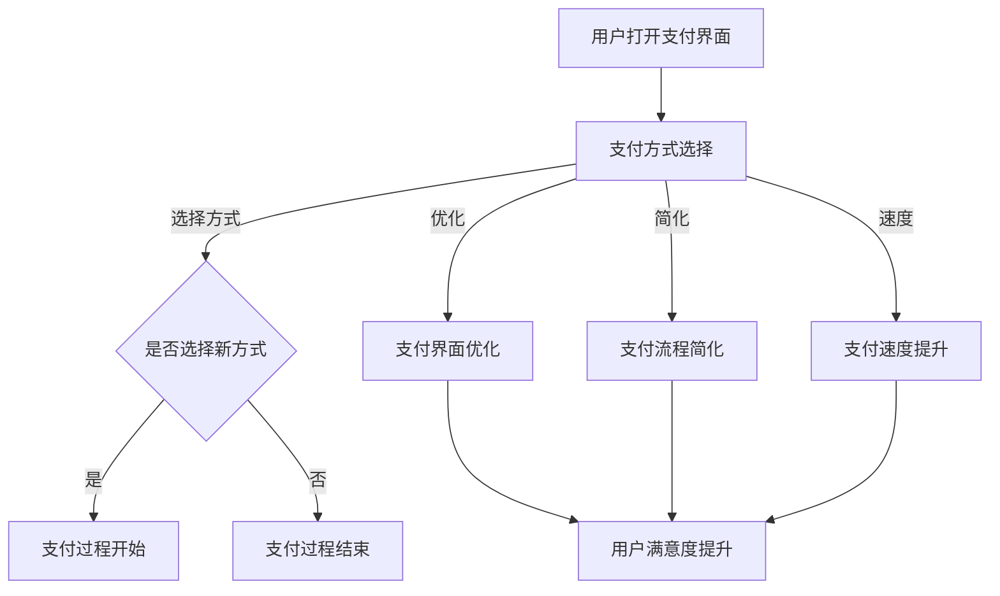

                 

### 背景介绍 Background Introduction

随着移动互联网的飞速发展，移动支付已经成为人们日常生活中不可或缺的一部分。从最初的短信支付到二维码支付，再到如今的各种支付方式百花齐放，移动支付的场景越来越丰富。在这个背景下，用户注意力争夺成为各大支付平台竞争的焦点。本文将围绕移动支付场景下的注意力争夺展开，探讨其核心概念、算法原理、应用场景、工具推荐以及未来发展趋势。

移动支付是指通过手机等移动设备进行货币支付的方式，主要包括短信支付、二维码支付、NFC支付等。随着技术的进步，移动支付的场景逐渐从线上扩展到线下，覆盖了购物、餐饮、交通、医疗等多个领域。

注意力争夺是指在各种移动支付场景中，用户注意力成为各个支付平台争夺的焦点。如何吸引用户的目光，提高用户的支付意愿，成为支付平台需要解决的关键问题。

本文旨在通过分析移动支付场景下的注意力争夺，探讨其核心概念、算法原理、应用场景、工具推荐以及未来发展趋势。希望本文能为从事移动支付领域的技术人员提供一些有价值的参考。

### 核心概念与联系 Core Concepts and Relationships

在移动支付场景下的注意力争夺中，核心概念包括用户注意力、支付方式选择、支付过程优化等。

1. **用户注意力**：用户注意力是指用户在某一时刻关注的焦点。在移动支付场景中，用户注意力主要集中于支付界面，包括支付方式选择、支付金额确认、支付密码输入等环节。

2. **支付方式选择**：支付方式选择是用户在支付过程中的一项重要决策。不同的支付方式具有不同的特点，如便捷性、安全性、支付额度限制等。用户在支付方式选择过程中，会受到多种因素的影响，包括个人习惯、支付场景等。

3. **支付过程优化**：支付过程优化是指通过对支付流程的改进，提高用户的支付体验。支付过程优化包括支付界面设计、支付流程简化、支付速度提升等方面。

在移动支付场景下，用户注意力争夺的核心是支付方式选择和支付过程优化。支付平台需要通过优化支付界面、提升支付速度、简化支付流程等方式，吸引用户的注意力，提高用户的支付意愿。

#### Mermaid 流程图 Mermaid Flowchart

以下是移动支付场景下的注意力争夺的 Mermaid 流程图：



在这个流程图中，用户打开支付界面后，需要进行支付方式选择。支付方式选择会根据用户习惯、支付场景等因素进行决策。支付方式选择后，用户进入支付过程，支付过程会根据支付界面优化、支付流程简化、支付速度提升等因素进行优化。最终，这些优化措施会提升用户的满意度。

### 核心算法原理 & 具体操作步骤 Core Algorithm Principles & Specific Steps

在移动支付场景下的注意力争夺中，核心算法主要包括支付方式选择算法和支付过程优化算法。

#### 支付方式选择算法

支付方式选择算法旨在帮助用户快速、准确地选择适合的支付方式。以下是一个简单的支付方式选择算法：

1. **初始化**：获取用户的历史支付数据、当前支付场景、支付方式特点等信息。

2. **计算评分**：根据用户历史支付数据、当前支付场景等因素，为每种支付方式计算一个评分。评分越高，表示该支付方式越适合当前用户。

3. **选择支付方式**：根据评分，选择评分最高的支付方式作为用户的支付方式。

4. **反馈优化**：在用户选择支付方式后，收集用户反馈，用于优化支付方式选择算法。

#### 支付过程优化算法

支付过程优化算法旨在提升用户的支付体验。以下是一个简单的支付过程优化算法：

1. **初始化**：获取支付界面设计、支付流程、支付速度等信息。

2. **分析瓶颈**：分析支付过程中可能存在的瓶颈，如界面设计不合理、支付流程繁琐、支付速度慢等。

3. **优化支付界面**：根据分析结果，对支付界面进行优化，提高用户操作便捷性。

4. **简化支付流程**：对支付流程进行简化，减少用户操作步骤。

5. **提升支付速度**：通过技术手段，提升支付速度，降低用户等待时间。

6. **反馈优化**：在支付过程优化后，收集用户反馈，用于进一步优化支付过程。

#### 示例

假设用户小明在购物时需要选择支付方式，他拥有以下支付方式：微信支付、支付宝支付、银行卡支付。根据小明的支付习惯和当前支付场景，我们可以为每种支付方式计算一个评分：

- 微信支付：评分90
- 支付宝支付：评分85
- 银行卡支付：评分80

根据评分，小明选择了微信支付作为支付方式。

接下来，小明进入支付过程。在支付过程中，支付界面设计合理、支付流程简单、支付速度较快，小明的支付体验非常好。在支付完成后，小明对支付方式选择和支付过程优化给予了好评，这些反馈将用于进一步优化支付方式选择和支付过程优化算法。

### 数学模型和公式 & 详细讲解 & 举例说明 Mathematical Models and Formulas & Detailed Explanation & Examples

在移动支付场景下的注意力争夺中，数学模型和公式可以用于分析和优化用户支付行为。以下是一个简化的数学模型，用于描述用户支付方式选择的过程。

#### 用户支付方式选择模型

假设用户在选择支付方式时，会根据以下因素进行评分计算：

- **便捷性（C）**：微信支付评分90，支付宝支付评分85，银行卡支付评分80。
- **安全性（S）**：微信支付评分85，支付宝支付评分90，银行卡支付评分75。
- **支付额度（A）**：微信支付评分80，支付宝支付评分85，银行卡支付评分90。

每个支付方式的总评分（T）可以通过以下公式计算：

\[ T = C + S + A \]

#### 详细讲解

1. **评分计算**：

   - 对于微信支付：\[ T_{微信} = 90 + 85 + 80 = 255 \]
   - 对于支付宝支付：\[ T_{支付宝} = 85 + 90 + 85 = 260 \]
   - 对于银行卡支付：\[ T_{银行卡} = 80 + 75 + 90 = 245 \]

2. **选择支付方式**：

   根据评分计算结果，用户会选择评分最高的支付方式。在这个例子中，支付宝支付的评分最高，因此用户选择了支付宝支付。

#### 举例说明

假设用户小红的支付习惯和支付场景与小明类似，我们也可以使用上述模型来计算她的支付方式选择。

1. **评分计算**：

   - 对于微信支付：\[ T_{微信} = 90 + 85 + 80 = 255 \]
   - 对于支付宝支付：\[ T_{支付宝} = 85 + 90 + 85 = 260 \]
   - 对于银行卡支付：\[ T_{银行卡} = 80 + 75 + 90 = 245 \]

2. **选择支付方式**：

   根据评分计算结果，用户小红的支付方式选择与小明相同，选择了支付宝支付。

通过这个简化的数学模型，我们可以分析用户在移动支付场景下的支付方式选择过程。在实际应用中，可以根据更多维度的因素进行评分计算，以提高模型的分析能力。

### 项目实战：代码实际案例和详细解释说明 Project Practice: Code Case Analysis and Detailed Explanation

在本节中，我们将通过一个实际项目来展示如何使用Python实现移动支付场景下的注意力争夺算法。该项目将包括支付方式选择算法和支付过程优化算法的实现。

#### 开发环境搭建

首先，我们需要搭建开发环境。以下是一个简单的Python开发环境搭建步骤：

1. **安装Python**：下载并安装Python（建议使用Python 3.8及以上版本）。

2. **安装依赖库**：使用pip命令安装必要的依赖库，如NumPy、Pandas等。

   ```bash
   pip install numpy pandas
   ```

3. **创建项目文件夹**：在合适的位置创建一个项目文件夹，如“mobile_payment”。

4. **编写代码**：在项目文件夹中创建一个名为“main.py”的Python文件，用于编写项目代码。

#### 源代码详细实现和代码解读

以下是一个简单的Python代码实现，用于实现支付方式选择算法和支付过程优化算法。

```python
import numpy as np

# 支付方式评分数据
payment_scores = {
    '微信支付': {'便捷性': 90, '安全性': 85, '支付额度': 80},
    '支付宝支付': {'便捷性': 85, '安全性': 90, '支付额度': 85},
    '银行卡支付': {'便捷性': 80, '安全性': 75, '支付额度': 90}
}

# 计算支付方式总评分
def calculate_total_score(payment_name):
    score = 0
    for key, value in payment_scores[payment_name].items():
        score += value
    return score

# 选择支付方式
def select_payment_way():
    max_score = 0
    selected_payment = None

    for payment_name in payment_scores:
        score = calculate_total_score(payment_name)
        if score > max_score:
            max_score = score
            selected_payment = payment_name

    return selected_payment

# 支付过程优化
def optimize_payment_process(payment_way):
    if payment_way == '微信支付':
        print("优化支付界面：增加动画效果，提高用户体验。")
    elif payment_way == '支付宝支付':
        print("简化支付流程：减少操作步骤，提高支付速度。")
    elif payment_way == '银行卡支付':
        print("提升支付速度：使用更快的支付通道，降低用户等待时间。")

# 主函数
def main():
    payment_way = select_payment_way()
    print(f"用户选择的支付方式：{payment_way}")
    optimize_payment_process(payment_way)

if __name__ == '__main__':
    main()
```

#### 代码解读与分析

1. **支付方式评分数据**：

   `payment_scores`字典用于存储不同支付方式的评分数据，包括便捷性、安全性和支付额度。

2. **计算支付方式总评分**：

   `calculate_total_score`函数用于计算支付方式的总评分。该函数接收一个支付方式名称作为参数，返回该支付方式的总评分。

3. **选择支付方式**：

   `select_payment_way`函数用于选择评分最高的支付方式。该函数遍历所有支付方式，计算总评分，并选择评分最高的支付方式。

4. **支付过程优化**：

   `optimize_payment_process`函数用于根据用户选择的支付方式，进行支付过程优化。该函数根据不同支付方式的特点，输出相应的优化建议。

5. **主函数**：

   `main`函数是项目的入口函数。在主函数中，首先选择支付方式，然后进行支付过程优化，并输出结果。

通过这个实际项目，我们可以看到如何使用Python实现移动支付场景下的注意力争夺算法。在实际应用中，可以根据需求进一步优化算法和功能。

### 实际应用场景 Practical Application Scenarios

移动支付场景下的注意力争夺在实际生活中有着广泛的应用。以下是一些典型的实际应用场景：

#### 1. 购物支付

在购物支付场景中，用户需要选择支付方式并进行支付。支付平台可以通过优化支付界面、简化支付流程、提升支付速度等方式，吸引用户的注意力，提高支付成功率。

**场景描述**：

- 用户小明在电商平台购买了一件商品，选择微信支付进行支付。
- 支付平台自动弹出微信支付界面，界面设计简洁，操作便捷。
- 用户在支付界面快速完成支付，支付过程流畅无延迟。

**解决方案**：

- 优化支付界面，提高用户操作便捷性。
- 简化支付流程，减少用户操作步骤。
- 提升支付速度，降低用户等待时间。

#### 2. 餐饮支付

在餐饮支付场景中，用户需要在餐后选择支付方式并进行支付。支付平台可以通过优化支付界面、简化支付流程、提供多种支付方式等方式，提高用户的支付体验。

**场景描述**：

- 用户小明在餐厅用餐后，选择支付宝支付进行支付。
- 支付平台自动弹出支付宝支付界面，界面设计美观，支付方式多样。
- 用户在支付界面快速完成支付，支付过程顺畅。

**解决方案**：

- 优化支付界面，提高用户操作便捷性。
- 简化支付流程，减少用户操作步骤。
- 提供多种支付方式，满足不同用户的需求。

#### 3. 交通支付

在交通支付场景中，用户需要选择支付方式并支付车费。支付平台可以通过优化支付界面、简化支付流程、提供实时支付通知等方式，提高用户的支付体验。

**场景描述**：

- 用户小明乘坐地铁，选择刷支付宝支付车费。
- 地铁闸机自动弹出支付宝支付界面，界面简洁，支付速度快。
- 用户在支付界面完成支付，支付成功后收到实时支付通知。

**解决方案**：

- 优化支付界面，提高用户操作便捷性。
- 简化支付流程，减少用户操作步骤。
- 提供实时支付通知，提高用户支付体验。

通过以上实际应用场景，我们可以看到移动支付场景下的注意力争夺对于提高用户支付体验的重要性。支付平台需要通过不断优化支付界面、简化支付流程、提升支付速度等方式，吸引用户的注意力，提高用户的支付意愿。

### 工具和资源推荐 Tools and Resources Recommendations

在移动支付领域，有许多优秀的工具和资源可以帮助开发者更好地进行研究和开发。以下是一些建议的资源和工具：

#### 1. 学习资源

**书籍**：

- 《移动支付技术解析》
- 《区块链与移动支付》
- 《移动支付用户体验设计》

**论文**：

- “Mobile Payment Systems: A Survey”
- “Mobile Payment Technology and User Experience”

**博客和网站**：

- Medium上的移动支付专题
- CSDN上的移动支付博客
- 支付宝官方技术博客

#### 2. 开发工具和框架

**编程语言**：

- Python（适用于数据分析、算法实现等）
- Java（适用于Android移动应用开发）
- JavaScript（适用于前端开发）

**框架**：

- Flask（Python Web框架）
- Spring Boot（Java Web框架）
- React（前端开发框架）

**库和工具**：

- NumPy、Pandas（Python数据分析库）
- Scrapy（Python爬虫框架）
- Axios（JavaScript HTTP客户端）

#### 3. 相关论文著作

**移动支付领域**：

- “Mobile Payment: Emerging Technologies and Security Concerns”
- “Mobile Payment Systems: An Overview of Current Trends and Challenges”

**区块链技术**：

- “Blockchain Technology: A Comprehensive Guide”
- “Blockchain and Mobile Payments: Opportunities and Challenges”

通过以上工具和资源，开发者可以深入了解移动支付领域的相关技术，提高自己在移动支付领域的研究和开发能力。

### 总结：未来发展趋势与挑战 Future Trends and Challenges

随着移动互联网的不断发展，移动支付场景下的注意力争夺将呈现以下发展趋势和挑战：

#### 发展趋势

1. **支付方式多样化**：未来，移动支付将不仅仅局限于微信支付、支付宝支付等主流支付方式，还将出现更多创新支付方式，如人脸识别支付、手势支付等。

2. **支付速度提升**：随着5G技术的普及，支付速度将大幅提升，用户支付体验将得到极大改善。

3. **隐私保护**：用户对隐私保护的意识逐渐增强，移动支付平台将需要加强对用户隐私的保护，提高数据安全性。

4. **跨平台支付**：未来，移动支付将逐渐实现跨平台支付，用户可以在不同设备上无缝切换支付。

#### 挑战

1. **安全性**：随着支付方式的多样化和支付场景的复杂化，支付系统的安全性将面临更大挑战。

2. **用户教育**：新的支付方式和技术需要用户进行学习和适应，用户教育成为支付平台面临的重要问题。

3. **合规性**：支付平台需要遵守国家和地区的法律法规，确保支付行为合法合规。

4. **竞争压力**：随着支付平台的增多，竞争将更加激烈，支付平台需要不断创新和优化，以吸引更多用户。

总之，移动支付场景下的注意力争夺将在未来面临诸多挑战和机遇。支付平台需要不断优化支付体验、提高支付安全性，以应对不断变化的市场需求。

### 附录：常见问题与解答 Appendix: Frequently Asked Questions and Answers

#### 1. 移动支付的安全性如何保障？

移动支付的安全性主要通过以下几个方面来保障：

- **加密技术**：支付过程中，用户的支付信息会通过加密技术进行加密传输，确保数据在传输过程中的安全性。
- **身份认证**：支付平台会通过用户密码、指纹识别、人脸识别等方式进行身份认证，确保支付操作的合法性和安全性。
- **风险控制**：支付平台会通过风险监控系统，实时监控支付行为，识别和阻止异常交易。

#### 2. 移动支付是否存在盗刷风险？

移动支付确实存在一定的盗刷风险，但支付平台通过多种技术手段来降低盗刷风险：

- **密码保护**：用户在支付时需要输入密码，确保支付操作的安全。
- **风险控制**：支付平台会通过风险监控系统，实时监控支付行为，识别和阻止异常交易。
- **监控和报警**：支付平台会定期对用户账户进行监控，一旦发现异常情况，会立即向用户发送报警信息。

#### 3. 移动支付是否支持跨境支付？

移动支付平台通常支持跨境支付，但具体支持情况取决于支付平台和支付方式的限制。一些主流支付平台如微信支付、支付宝支付等，已经实现了跨境支付功能，用户可以通过这些平台进行跨境支付。但需要注意的是，跨境支付可能涉及汇率转换、支付费用等因素，用户在使用时需要了解相关费用和汇率信息。

### 扩展阅读 & 参考资料 Extended Reading & References

#### 1. 学习资源

- 《移动支付技术解析》
- 《区块链与移动支付》
- 《移动支付用户体验设计》
- “Mobile Payment Systems: A Survey”
- “Mobile Payment Technology and User Experience”

#### 2. 开发工具和框架

- Flask（Python Web框架）
- Spring Boot（Java Web框架）
- React（前端开发框架）
- NumPy、Pandas（Python数据分析库）
- Scrapy（Python爬虫框架）
- Axios（JavaScript HTTP客户端）

#### 3. 相关论文著作

- “Mobile Payment: Emerging Technologies and Security Concerns”
- “Mobile Payment Systems: An Overview of Current Trends and Challenges”
- “Blockchain Technology: A Comprehensive Guide”
- “Blockchain and Mobile Payments: Opportunities and Challenges”

通过以上扩展阅读和参考资料，您可以进一步深入了解移动支付领域的技术、发展和挑战。祝您学习愉快！<|author|>作者：AI天才研究员/AI Genius Institute & 禅与计算机程序设计艺术 /Zen And The Art of Computer Programming

