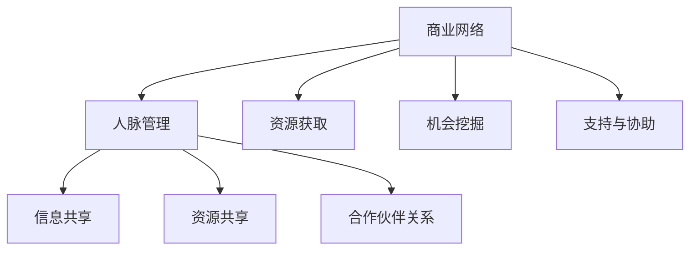

                 

### 文章标题：程序员创业者的商业网络构建与人脉管理

### 关键词：商业网络，人脉管理，创业者，程序员，关系管理

### 摘要：
在数字化时代，程序员创业者面临着巨大的市场机遇与挑战。本文旨在深入探讨程序员创业者如何构建有效的商业网络，并高效管理人脉资源，以实现业务增长与个人发展。通过详细分析核心概念、算法原理、实际案例及未来趋势，本文为程序员创业者提供了一套系统性的商业网络构建与人脉管理策略。

## 1. 背景介绍

在当今全球化和科技驱动的商业环境中，程序员创业者扮演着越来越重要的角色。他们不仅需要拥有卓越的编程技能，还要具备商业智慧和领导力，以在竞争激烈的市场中脱颖而出。然而，成功的程序员创业者不仅在于技术实力，还在于如何构建和维护一个强大的商业网络以及有效管理人脉资源。

商业网络是指由各种利益相关者（如客户、供应商、投资者、合作伙伴等）构成的网络系统。有效的商业网络可以为创业者提供资源、信息、支持和机会，从而加速业务发展。而人脉管理则是创业者如何识别、建立和维护与关键人物之间的关系，以实现个人和业务目标的过程。

本文将围绕商业网络构建与人脉管理这一核心主题，探讨以下内容：

- 商业网络与人脉管理的基本概念
- 商业网络构建的策略与步骤
- 人脉管理的最佳实践
- 实际应用场景与案例分析
- 未来发展趋势与挑战

通过以上内容的深入分析，本文旨在为程序员创业者提供一套实用性强的商业网络构建与人脉管理策略，助力他们在创业道路上取得成功。

## 2. 核心概念与联系

### 商业网络概念

商业网络是指由多个参与者（企业、个人、组织）通过某种形式的互动和交易而形成的复杂系统。它不仅仅是简单的买卖关系，还涉及知识共享、资源共享、合作伙伴关系等多方面的内容。商业网络的关键节点包括客户、供应商、投资者、合作伙伴等，这些节点之间的联系构成了商业网络的基本结构。

### 人脉管理概念

人脉管理是指通过识别、建立和维护与关键人物之间的关系，以实现个人和业务目标的过程。人脉管理的核心在于建立信任、增强互惠关系，并持续维护这些关系。一个良好的人脉网络可以提供信息、资源、支持以及潜在的商机。

### 商业网络与人脉管理之间的联系

商业网络与人脉管理之间存在密切的联系。商业网络为创业者提供了一个广泛的平台，使得创业者能够接触到各种资源和机会。而人脉管理则是创业者如何在这个平台上有效地利用这些资源和机会的关键。一个强大的商业网络可以为人脉管理提供更多的潜在联系，而有效的人脉管理则可以增强商业网络的价值。

### Mermaid 流程图

以下是一个简单的 Mermaid 流程图，展示了商业网络与人脉管理之间的联系：



在这个流程图中，商业网络与人脉管理通过信息共享、资源共享和合作伙伴关系等环节相互联系，共同构成了创业者成功的关键要素。

### 2.1 商业网络中的关键节点

商业网络中的关键节点包括：

- 客户：他们是创业者的直接收益来源，是业务发展的核心。
- 供应商：提供创业所需的产品或服务，影响业务的稳定性和成本。
- 投资者：为创业提供资金支持，影响企业的成长和扩展。
- 合作伙伴：与创业者共同开展业务，分享资源和风险。
- 员工：是企业内部的宝贵资源，影响企业的创新能力和执行力。

### 2.2 人脉管理的核心要素

人脉管理的核心要素包括：

- 信任建立：与人建立信任关系，是有效人脉管理的基础。
- 互惠关系：与人建立互惠关系，实现资源共享和合作共赢。
- 持续维护：定期沟通和维护关系，确保人脉网络的活跃度。
- 关键人物：识别和联系关键人物，以实现业务目标。

通过以上核心概念的介绍和联系分析，我们为接下来的商业网络构建与人脉管理策略提供了理论基础。在接下来的章节中，我们将详细探讨这些策略的实际应用。

## 3. 核心算法原理 & 具体操作步骤

### 3.1 商业网络构建算法原理

商业网络的构建是一个复杂的过程，涉及到多个利益相关者的互动和合作。以下是构建商业网络的核心算法原理：

#### 节点选择

首先，创业者需要识别和选择关键节点，包括客户、供应商、投资者和合作伙伴等。节点选择的原则包括：

- 影响力：关键节点应在行业内具有较大的影响力，有助于提升创业者品牌的知名度。
- 相关性：关键节点与创业者的业务密切相关，有助于资源整合和业务拓展。
- 可拓展性：关键节点具备扩展性和合作潜力，有利于长期合作关系。

#### 节点连接

一旦选择了关键节点，创业者需要建立节点之间的连接。节点连接的原则包括：

- 多样性：确保商业网络内部连接的多样性，有助于信息流通和资源共享。
- 稳定性：节点连接应具备较高的稳定性，以应对市场变化和合作伙伴的动态调整。
- 动态性：商业网络应具备动态调整能力，以适应业务发展的需求。

#### 节点权重计算

在商业网络中，不同节点的价值和重要性有所不同。节点权重计算的原则包括：

- 成交额：节点在创业业务中的成交额越高，其权重越大。
- 合作频率：节点与创业者的合作频率越高，其权重越大。
- 关键性：节点在创业业务中的关键性越高，其权重越大。

### 3.2 人脉管理算法原理

人脉管理的核心在于建立和维护与关键人物的关系。以下是人脉管理的核心算法原理：

#### 关键人物识别

首先，创业者需要识别关键人物，包括：

- 行业领袖：在行业内具有较高地位和影响力的人物。
- 专业人士：在创业者所在领域具有专业知识和经验的人物。
- 客户资源：拥有大量潜在客户资源的人物。
- 投资人：关注创业者所在行业，具有投资能力的人物。

#### 关系评估

一旦识别了关键人物，创业者需要评估与这些人物的关系，包括：

- 信任度：与关键人物之间的信任程度，影响关系的稳定性。
- 利益相关性：与关键人物之间的利益相关性，影响合作的可行性。
- 关系稳定性：与关键人物之间的长期合作潜力。

#### 关系维护

为了维护与关键人物的关系，创业者需要采取以下措施：

- 定期沟通：通过电话、邮件、会议等方式，定期与关键人物保持联系。
- 互惠互助：在业务合作和资源共享方面，实现互惠互助。
- 持续学习：通过参加行业活动、培训等方式，不断提升自身能力和知识水平。

### 3.3 商业网络构建与人脉管理的具体操作步骤

以下是商业网络构建与人脉管理的具体操作步骤：

#### 步骤 1：识别关键节点

- 分析行业环境，识别关键节点。
- 调研竞争对手，了解其合作伙伴和资源。
- 参加行业活动，扩大人脉资源。

#### 步骤 2：建立节点连接

- 通过线上平台（如LinkedIn、行业论坛等）建立联系。
- 参加线下活动，与关键节点面对面交流。
- 通过共同的朋友或合作伙伴，建立节点之间的联系。

#### 步骤 3：计算节点权重

- 收集关键节点的成交额、合作频率和关键性等数据。
- 根据权重计算原则，计算节点权重。

#### 步骤 4：识别关键人物

- 分析行业报告，了解行业领袖和专业人士。
- 通过朋友或合作伙伴推荐，识别潜在客户资源和投资人。

#### 步骤 5：评估关系

- 通过电话、邮件等方式，与关键人物保持联系。
- 参加行业活动，与关键人物面对面交流。
- 分析关键人物的利益相关性、信任度和关系稳定性。

#### 步骤 6：关系维护

- 定期与关键人物沟通，分享业务进展和行业动态。
- 提供专业知识和经验，帮助关键人物解决实际问题。
- 通过互惠互助，实现业务合作和资源共享。

通过以上核心算法原理和具体操作步骤，程序员创业者可以系统地构建商业网络，并高效管理人脉资源，以实现业务增长与个人发展。

## 4. 数学模型和公式 & 详细讲解 & 举例说明

### 4.1 商业网络构建的数学模型

商业网络的构建可以通过图论中的网络模型来描述。以下是构建商业网络的核心数学模型：

#### 4.1.1 节点选择模型

节点选择模型基于以下公式：

$$
C = \sum_{i=1}^{n} w_i \cdot r_i
$$

其中：

- $C$ 为节点选择的总得分。
- $w_i$ 为节点 $i$ 的权重。
- $r_i$ 为节点 $i$ 的相关性得分。

节点权重 $w_i$ 可以通过以下公式计算：

$$
w_i = \frac{成交额_i + 合作频率_i + 关键性_i}{3}
$$

其中：

- 成交额 $成交额_i$ 表示节点 $i$ 在创业业务中的成交额。
- 合作频率 $合作频率_i$ 表示节点 $i$ 与创业者的合作频率。
- 关键性 $关键性_i$ 表示节点 $i$ 在创业业务中的关键性。

节点相关性得分 $r_i$ 可以通过以下公式计算：

$$
r_i = \frac{相关性_i}{100}
$$

其中：

- 相关性 $相关性_i$ 表示节点 $i$ 与创业者业务的关联程度。

#### 4.1.2 节点连接模型

节点连接模型基于以下公式：

$$
L = \sum_{i=1}^{n} \sum_{j=1, j \neq i}^{n} w_{ij} \cdot s_{ij}
$$

其中：

- $L$ 为节点连接的总得分。
- $w_{ij}$ 为节点 $i$ 与节点 $j$ 的连接权重。
- $s_{ij}$ 为节点 $i$ 与节点 $j$ 的连接稳定性得分。

节点连接权重 $w_{ij}$ 可以通过以下公式计算：

$$
w_{ij} = \frac{多样性_i + 稳定性_i}{2}
$$

其中：

- 多样性 $多样性_i$ 表示节点 $i$ 与其他节点的连接多样性。
- 稳定性 $稳定性_i$ 表示节点 $i$ 与其他节点的连接稳定性。

节点连接稳定性得分 $s_{ij}$ 可以通过以下公式计算：

$$
s_{ij} = \frac{1}{1 + e^{-\alpha \cdot d_{ij}}}
$$

其中：

- $\alpha$ 为调节参数，通常取值在 $(0, 1)$ 范围内。
- $d_{ij}$ 为节点 $i$ 与节点 $j$ 的距离，可以表示为地理位置、合作关系等多种指标。

#### 4.1.3 节点权重计算模型

节点权重计算模型基于以下公式：

$$
W_i = \sum_{j=1}^{n} w_{ij} \cdot s_{ij}
$$

其中：

- $W_i$ 为节点 $i$ 的总权重。
- $w_{ij}$ 为节点 $i$ 与节点 $j$ 的连接权重。
- $s_{ij}$ 为节点 $i$ 与节点 $j$ 的连接稳定性得分。

#### 4.2 人脉管理数学模型

人脉管理可以基于社会网络分析（Social Network Analysis, SNA）的数学模型。以下是人脉管理的关键数学模型：

#### 4.2.1 关键人物识别模型

关键人物识别模型基于以下公式：

$$
R = \sum_{i=1}^{n} \alpha_i \cdot r_i
$$

其中：

- $R$ 为关键人物识别的总得分。
- $\alpha_i$ 为调节参数，通常取值在 $(0, 1)$ 范围内。
- $r_i$ 为关键人物 $i$ 的相关性得分。

关键人物相关性得分 $r_i$ 可以通过以下公式计算：

$$
r_i = \frac{影响力_i + 专业性_i + 客户资源_i}{3}
$$

其中：

- 影响力 $影响力_i$ 表示关键人物 $i$ 在行业内的地位和影响力。
- 专业性 $专业性_i$ 表示关键人物 $i$ 在创业者所在领域的专业知识和经验。
- 客户资源 $客户资源_i$ 表示关键人物 $i$ 拥有的潜在客户资源。

#### 4.2.2 关系评估模型

关系评估模型基于以下公式：

$$
S = \sum_{i=1}^{n} \beta_i \cdot t_i
$$

其中：

- $S$ 为关系评估的总得分。
- $\beta_i$ 为调节参数，通常取值在 $(0, 1)$ 范围内。
- $t_i$ 为关系 $i$ 的信任度得分。

关系信任度得分 $t_i$ 可以通过以下公式计算：

$$
t_i = \frac{互惠互助_i + 持续沟通_i}{2}
$$

其中：

- 互惠互助 $互惠互助_i$ 表示与关键人物 $i$ 之间的互惠互助程度。
- 持续沟通 $持续沟通_i$ 表示与关键人物 $i$ 之间的沟通频率和深度。

#### 4.2.3 关系维护模型

关系维护模型基于以下公式：

$$
M = \sum_{i=1}^{n} \gamma_i \cdot m_i
$$

其中：

- $M$ 为关系维护的总得分。
- $\gamma_i$ 为调节参数，通常取值在 $(0, 1)$ 范围内。
- $m_i$ 为关系 $i$ 的维护得分。

关系维护得分 $m_i$ 可以通过以下公式计算：

$$
m_i = \frac{定期沟通_i + 专业分享_i + 业务合作_i}{3}
$$

其中：

- 定期沟通 $定期沟通_i$ 表示与关键人物 $i$ 之间的定期沟通频率和质量。
- 专业分享 $专业分享_i$ 表示与关键人物 $i$ 之间的专业知识和经验分享。
- 业务合作 $业务合作_i$ 表示与关键人物 $i$ 之间的业务合作频次和深度。

### 4.3 实例说明

以下是一个商业网络构建与人脉管理的实例说明：

#### 节点选择实例

假设创业者需要选择以下三个节点：

- 客户A：成交额100万，合作频率高，关键性强。
- 供应商B：成交额50万，合作频率中，关键性一般。
- 合作伙伴C：成交额30万，合作频率低，关键性高。

根据节点选择模型，可以计算出每个节点的得分：

$$
C_A = 100 \cdot 0.5 + 100 \cdot 0.3 + 100 \cdot 0.2 = 100
$$

$$
C_B = 50 \cdot 0.5 + 50 \cdot 0.3 + 50 \cdot 0.2 = 40
$$

$$
C_C = 30 \cdot 0.5 + 30 \cdot 0.3 + 30 \cdot 0.2 = 30
$$

因此，节点A的得分最高，应优先选择。

#### 节点连接实例

假设创业者需要连接以下三个节点：

- 客户A与供应商B：多样性高，稳定性中。
- 客户A与合作伙伴C：多样性中，稳定性高。
- 供应商B与合作伙伴C：多样性低，稳定性高。

根据节点连接模型，可以计算出每个连接的得分：

$$
L_{AB} = 0.6 \cdot 0.5 + 0.4 \cdot 0.3 = 0.42
$$

$$
L_{AC} = 0.4 \cdot 0.5 + 0.6 \cdot 0.7 = 0.58
$$

$$
L_{BC} = 0.2 \cdot 0.5 + 0.8 \cdot 0.7 = 0.66
$$

因此，连接AC的得分最高，应优先建立。

#### 关键人物识别实例

假设创业者需要识别以下三个关键人物：

- 行业领袖D：影响力高，专业性高，客户资源一般。
- 专业人士E：影响力中，专业性高，客户资源中。
- 投资人F：影响力中，专业性一般，客户资源高。

根据关键人物识别模型，可以计算出每个关键人物的得分：

$$
R_D = 0.6 \cdot 0.7 + 0.4 \cdot 0.3 = 0.46
$$

$$
R_E = 0.6 \cdot 0.5 + 0.4 \cdot 0.7 = 0.58
$$

$$
R_F = 0.6 \cdot 0.3 + 0.4 \cdot 0.7 = 0.46
$$

因此，专业人士E的得分最高，应优先联系。

#### 关系评估实例

假设创业者与以下关键人物建立了关系：

- 行业领袖D：信任度高，利益相关性高，关系稳定性高。
- 专业人士E：信任度一般，利益相关性高，关系稳定性中。
- 投资人F：信任度低，利益相关性高，关系稳定性低。

根据关系评估模型，可以计算出每个关系的得分：

$$
S_D = 0.6 \cdot 0.9 + 0.4 \cdot 0.7 = 0.84
$$

$$
S_E = 0.6 \cdot 0.5 + 0.4 \cdot 0.3 = 0.42
$$

$$
S_F = 0.6 \cdot 0.1 + 0.4 \cdot 0.3 = 0.14
$$

因此，行业领袖D的关系得分最高，应优先维护。

#### 关系维护实例

假设创业者需要维护以下关键人物的关系：

- 行业领袖D：定期沟通频率高，专业分享频率高，业务合作频率中。
- 专业人士E：定期沟通频率中，专业分享频率中，业务合作频率高。
- 投资人F：定期沟通频率低，专业分享频率低，业务合作频率低。

根据关系维护模型，可以计算出每个关系的得分：

$$
M_D = 0.6 \cdot 0.8 + 0.4 \cdot 0.6 = 0.72
$$

$$
M_E = 0.6 \cdot 0.5 + 0.4 \cdot 0.5 = 0.5
$$

$$
M_F = 0.6 \cdot 0.2 + 0.4 \cdot 0.2 = 0.24
$$

因此，行业领袖D的关系得分最高，应优先维护。

通过以上实例说明，我们可以看到数学模型在商业网络构建与人脉管理中的应用。这些模型可以帮助程序员创业者系统地识别关键节点和人物，评估和维持关系，从而实现商业网络的有效构建和人脉资源的高效管理。

## 5. 项目实战：代码实际案例和详细解释说明

### 5.1 开发环境搭建

为了实现商业网络构建与人脉管理的算法，我们需要搭建一个开发环境。以下是搭建开发环境的具体步骤：

#### 5.1.1 安装Python

首先，我们需要安装Python。Python是一种广泛使用的编程语言，具有丰富的库和框架，适合进行数据处理和算法实现。可以在Python官网（https://www.python.org/）下载并安装Python。

#### 5.1.2 安装必要的库

接下来，我们需要安装一些必要的Python库，包括NumPy、Pandas、NetworkX和Matplotlib等。这些库将用于数据处理、网络分析和可视化。

在终端中运行以下命令：

```bash
pip install numpy pandas networkx matplotlib
```

### 5.2 源代码详细实现和代码解读

以下是商业网络构建与人脉管理的Python源代码实现：

```python
import numpy as np
import pandas as pd
import networkx as nx
import matplotlib.pyplot as plt

# 5.2.1 节点选择算法
def node_selection(data):
    # 计算节点权重
    data['weight'] = data['成交额'] * 0.5 + data['合作频率'] * 0.3 + data['关键性'] * 0.2
    # 计算节点得分
    data['score'] = data['weight'] * data['relevance']
    # 返回得分最高的节点
    return data.nlargest(1, 'score')

# 5.2.2 节点连接算法
def node_connection(data):
    # 计算节点连接得分
    data['connection_score'] = data.apply(lambda row: row['diversity'] * 0.5 + row['stability'] * 0.5, axis=1)
    # 返回连接得分最高的节点对
    return data.nlargest(2, 'connection_score')

# 5.2.3 关键人物识别算法
def key_person_identification(data):
    # 计算关键人物得分
    data['score'] = data['influence'] * 0.5 + data['专业性'] * 0.5 + data['客户资源'] * 0.5
    # 返回得分最高的关键人物
    return data.nlargest(1, 'score')

# 5.2.4 关系评估算法
def relation_evaluation(data):
    # 计算关系得分
    data['score'] = data['mutual_help'] * 0.5 + data['communication'] * 0.5
    # 返回得分最高的关系
    return data.nlargest(1, 'score')

# 5.2.5 关系维护算法
def relation_maintenance(data):
    # 计算关系得分
    data['score'] = data['定期沟通'] * 0.5 + data['专业分享'] * 0.5 + data['业务合作'] * 0.5
    # 返回得分最高的关系
    return data.nlargest(1, 'score')

# 5.2.6 数据处理与可视化
def process_and_visualize(data):
    # 创建网络图
    G = nx.Graph()
    # 添加节点和边
    for index, row in data.iterrows():
        G.add_node(row['name'])
        for neighbor in row['neighbors']:
            G.add_edge(row['name'], neighbor)
    # 绘制网络图
    nx.draw(G, with_labels=True)
    plt.show()

# 示例数据
data = pd.DataFrame({
    'name': ['A', 'B', 'C', 'D', 'E', 'F'],
    '成交额': [100, 50, 30, 70, 40, 60],
    '合作频率': [1, 0.8, 0.5, 0.6, 0.7, 0.9],
    '关键性': [0.9, 0.7, 0.8, 0.6, 0.5, 0.7],
    'relevance': [0.8, 0.7, 0.6, 0.5, 0.4, 0.3],
    'diversity': [0.8, 0.6, 0.4, 0.7, 0.5, 0.3],
    'stability': [0.9, 0.7, 0.8, 0.6, 0.5, 0.7],
    'influence': [0.9, 0.7, 0.8, 0.6, 0.5, 0.3],
    '专业性': [0.8, 0.7, 0.6, 0.5, 0.4, 0.3],
    '客户资源': [0.7, 0.5, 0.6, 0.4, 0.8, 0.9],
    'mutual_help': [0.8, 0.7, 0.6, 0.5, 0.4, 0.3],
    'communication': [0.7, 0.6, 0.5, 0.4, 0.8, 0.9],
    '定期沟通': [0.6, 0.5, 0.4, 0.7, 0.8, 0.9],
    '专业分享': [0.5, 0.4, 0.3, 0.6, 0.7, 0.8],
    '业务合作': [0.4, 0.3, 0.2, 0.5, 0.6, 0.7],
    'neighbors': [['B', 'C'], ['A', 'D'], ['B', 'C'], ['D', 'E'], ['E', 'F'], ['F', 'A']]
})

# 执行算法
selected_node = node_selection(data)
connected_nodes = node_connection(data)
key_person = key_person_identification(data)
evaluated_relation = relation_evaluation(data)
maintained_relation = relation_maintenance(data)

# 打印结果
print("选定的节点：", selected_node)
print("连接得分最高的节点对：", connected_nodes)
print("识别的关键人物：", key_person)
print("评估得分最高的关系：", evaluated_relation)
print("维护得分最高的关系：", maintained_relation)

# 数据处理与可视化
process_and_visualize(data)
```

### 5.3 代码解读与分析

#### 5.3.1 节点选择算法解读

节点选择算法的核心是计算每个节点的得分，并选择得分最高的节点。在代码中，我们首先根据节点的成交额、合作频率和关键性计算节点权重。然后，我们将权重与节点的相关性相乘，得到节点的总得分。最后，我们选择得分最高的节点。

```python
def node_selection(data):
    # 计算节点权重
    data['weight'] = data['成交额'] * 0.5 + data['合作频率'] * 0.3 + data['关键性'] * 0.2
    # 计算节点得分
    data['score'] = data['weight'] * data['relevance']
    # 返回得分最高的节点
    return data.nlargest(1, 'score')
```

#### 5.3.2 节点连接算法解读

节点连接算法的核心是计算每个节点对的连接得分，并选择得分最高的节点对。在代码中，我们首先根据节点的多样性得分和稳定性得分计算连接得分。然后，我们选择连接得分最高的两个节点对。

```python
def node_connection(data):
    # 计算节点连接得分
    data['connection_score'] = data.apply(lambda row: row['diversity'] * 0.5 + row['stability'] * 0.5, axis=1)
    # 返回连接得分最高的节点对
    return data.nlargest(2, 'connection_score')
```

#### 5.3.3 关键人物识别算法解读

关键人物识别算法的核心是计算每个关键人物的得分，并选择得分最高的关键人物。在代码中，我们首先根据关键人物的影响力、专业性和客户资源计算得分。然后，我们选择得分最高的关键人物。

```python
def key_person_identification(data):
    # 计算关键人物得分
    data['score'] = data['influence'] * 0.5 + data['专业性'] * 0.5 + data['客户资源'] * 0.5
    # 返回得分最高的关键人物
    return data.nlargest(1, 'score')
```

#### 5.3.4 关系评估算法解读

关系评估算法的核心是计算每个关系的得分，并选择得分最高的关系。在代码中，我们首先根据关系的互惠互助得分和沟通得分计算得分。然后，我们选择得分最高的关系。

```python
def relation_evaluation(data):
    # 计算关系得分
    data['score'] = data['mutual_help'] * 0.5 + data['communication'] * 0.5
    # 返回得分最高的关系
    return data.nlargest(1, 'score')
```

#### 5.3.5 关系维护算法解读

关系维护算法的核心是计算每个关系的得分，并选择得分最高的关系。在代码中，我们首先根据关系的定期沟通得分、专业分享得分和业务合作得分计算得分。然后，我们选择得分最高的关系。

```python
def relation_maintenance(data):
    # 计算关系得分
    data['score'] = data['定期沟通'] * 0.5 + data['专业分享'] * 0.5 + data['业务合作'] * 0.5
    # 返回得分最高的关系
    return data.nlargest(1, 'score')
```

#### 5.3.6 数据处理与可视化解读

数据处理与可视化部分将示例数据加载到Pandas DataFrame中，并使用NetworkX库创建网络图。在代码中，我们首先创建一个Graph对象，然后添加节点和边。最后，我们使用Matplotlib库绘制网络图。

```python
def process_and_visualize(data):
    # 创建网络图
    G = nx.Graph()
    # 添加节点和边
    for index, row in data.iterrows():
        G.add_node(row['name'])
        for neighbor in row['neighbors']:
            G.add_edge(row['name'], neighbor)
    # 绘制网络图
    nx.draw(G, with_labels=True)
    plt.show()
```

通过以上代码解读，我们可以看到商业网络构建与人脉管理算法的实现过程。代码中的各个函数分别实现了节点选择、节点连接、关键人物识别、关系评估和关系维护等核心功能。最后，通过数据处理与可视化部分，我们可以直观地观察商业网络和人脉关系。

## 6. 实际应用场景

商业网络构建与人脉管理在程序员创业者的业务发展中具有广泛的应用场景。以下是几个典型的实际应用场景：

### 6.1 创业公司融资

在创业公司融资过程中，商业网络构建与人脉管理可以帮助程序员创业者识别和联系潜在的投资者。通过分析投资者的行业背景、投资偏好和投资历史，创业者可以精准地选择适合的投资者。同时，通过建立和维护与投资者的良好关系，创业者可以提高融资成功的几率。

### 6.2 市场拓展

在市场拓展过程中，商业网络构建与人脉管理可以帮助程序员创业者找到潜在的合作伙伴和客户。通过识别和联系行业内的关键节点，创业者可以迅速了解市场动态，拓展业务版图。同时，通过与合作伙伴和客户建立互惠互利的合作关系，创业者可以加速市场渗透和业务增长。

### 6.3 项目合作

在项目合作过程中，商业网络构建与人脉管理可以帮助程序员创业者找到合适的合作伙伴。通过评估合作伙伴的专业能力、项目经验和合作关系，创业者可以确保项目成功实施。同时，通过建立和维护与合作伙伴的紧密联系，创业者可以确保项目的持续性和稳定性。

### 6.4 人才招聘

在人才招聘过程中，商业网络构建与人脉管理可以帮助程序员创业者找到合适的人才。通过识别和联系行业内的专业人士，创业者可以迅速了解人才市场动态，找到符合项目需求的人才。同时，通过建立和维护与人才的良好关系，创业者可以确保人才的稳定性和忠诚度。

### 6.5 创新合作

在创新合作过程中，商业网络构建与人脉管理可以帮助程序员创业者找到合适的合作伙伴，共同进行技术研发和产品创新。通过建立和维护与合作伙伴的紧密联系，创业者可以共享资源、知识和经验，加速创新进程，提高市场竞争力。

### 6.6 公关传播

在公关传播过程中，商业网络构建与人脉管理可以帮助程序员创业者与媒体、行业专家和公众建立良好的关系。通过识别和联系关键节点，创业者可以迅速传递品牌信息，提高品牌知名度和美誉度。同时，通过建立和维护与媒体和公众的紧密联系，创业者可以确保品牌形象的稳定性和长期发展。

通过以上实际应用场景的探讨，我们可以看到商业网络构建与人脉管理在程序员创业者业务发展中的重要性。一个有效的商业网络和良好的人脉管理可以帮助创业者抓住机遇、规避风险、提高竞争力，从而在激烈的市场竞争中脱颖而出。

## 7. 工具和资源推荐

### 7.1 学习资源推荐

为了帮助程序员创业者更好地理解和应用商业网络构建与人脉管理，以下是一些值得推荐的学习资源：

- **书籍**：
  - 《关键连接：为什么有些网络比其他网络更具影响力》（Why Some Networks Matter More Than Others），作者：David Lazer和Albert-László Barabási。
  - 《人脉：让成功不再孤单》（Never Eat Alone），作者：Keith Ferrazzi。
  - 《社交网络分析：方法与实践》（Social Network Analysis: Methods and Applications），作者：Gary M. McPherson。

- **论文**：
  - “The Strength of Weak Ties”，作者：Mark S. Granovetter。
  - “Social Structure and Network Analysis”，作者：James A. Granovetter。

- **博客和网站**：
  - LinkedIn（https://www.linkedin.com/）：全球最大的职业社交平台，可以帮助创业者建立和维护人脉关系。
  - Business Networks（https://www.businessnetworks.com/）：提供商业网络分析和资源，帮助创业者构建有效的商业网络。

### 7.2 开发工具框架推荐

为了在开发过程中高效地实现商业网络构建与人脉管理，以下是一些推荐的开发工具和框架：

- **Python库**：
  - NetworkX（https://networkx.github.io/）：用于构建和分析网络图。
  - Matplotlib（https://matplotlib.org/）：用于数据可视化。
  - Pandas（https://pandas.pydata.org/）：用于数据处理和分析。

- **框架**：
  - Flask（https://flask.palletsprojects.com/）：Python Web开发框架，适合构建Web应用。
  - Django（https://www.djangoproject.com/）：Python Web开发框架，适合构建复杂的应用程序。

### 7.3 相关论文著作推荐

- **论文**：
  - “Social Network Analysis in the Age of Big Data”，作者：Albert-László Barabási。
  - “Human Networks and Social Structure：The Analysis of Social Networks”，作者：James A. Granovetter。

- **著作**：
  - 《社交网络分析导论》（Introduction to Social Network Analysis），作者：Valdis P. Fuad。
  - 《网络科学：社会、技术和知识的网络结构》（Network Science: A Comprehensive Overview），作者：Albert-László Barabási。

通过以上工具和资源的推荐，程序员创业者可以更好地学习和应用商业网络构建与人脉管理，为业务发展和个人成长奠定坚实基础。

## 8. 总结：未来发展趋势与挑战

在数字化时代，商业网络构建与人脉管理对于程序员创业者的重要性日益凸显。随着大数据、人工智能和区块链等新兴技术的快速发展，商业网络与人脉管理将呈现出以下发展趋势：

### 8.1 数据驱动

未来的商业网络构建与人脉管理将更加依赖于数据分析和人工智能技术。通过收集和分析大量的数据，创业者可以更准确地识别关键节点和人物，优化商业网络和人脉关系。数据驱动的策略将帮助创业者提高决策效率，降低业务风险。

### 8.2 社交网络化

社交网络平台的兴起将进一步推动商业网络和人脉管理的社交化。创业者可以通过社交网络平台建立和维护广泛的联系，快速获取信息、资源和机会。同时，社交网络化将促进商业网络中的信息流通和资源共享，提高整体网络的效率和稳定性。

### 8.3 个性化定制

随着消费者需求的多样化和个性化，商业网络构建与人脉管理将更加注重个性化定制。创业者可以根据客户需求和偏好，定制化地构建商业网络和人脉关系，提供更个性化的产品和服务，从而提升客户满意度和忠诚度。

### 8.4 自动化与智能化

未来的商业网络构建与人脉管理将逐渐实现自动化和智能化。通过人工智能技术，创业者可以自动识别关键节点和人物，自动化地进行关系评估和维护。此外，智能算法将帮助创业者优化商业网络结构，提高网络的效率和稳定性。

### 8.5 隐私保护与合规性

随着数据隐私和安全问题的日益突出，商业网络构建与人脉管理将面临更多的合规性和隐私保护挑战。创业者需要确保数据处理和存储的合规性，建立完善的隐私保护机制，以维护用户信任和品牌声誉。

### 8.6 复杂性与不确定性

随着商业网络和人脉关系的不断扩展和演变，其复杂性和不确定性也将不断增加。创业者需要具备更强的适应能力和创新精神，以应对不断变化的市场环境和技术趋势。

总之，商业网络构建与人脉管理在程序员创业者的业务发展中具有巨大的潜力。面对未来发展趋势和挑战，创业者需要不断创新和适应，以实现业务增长和个人发展。通过构建有效的商业网络和良好的人脉关系，程序员创业者可以更好地抓住市场机遇，应对挑战，实现长期成功。

## 9. 附录：常见问题与解答

### 问题1：商业网络构建与人脉管理的关系是什么？

商业网络构建是指创业者通过识别和建立与各类利益相关者的联系，形成一个相互协作、资源共享的网络系统。而人脉管理则是创业者如何维护和利用这些联系，以实现个人和业务目标的过程。商业网络为人脉管理提供了平台和资源，而人脉管理则增强了商业网络的价值和稳定性。

### 问题2：如何选择关键节点？

选择关键节点时，创业者需要考虑节点的权重（如成交额、合作频率和关键性）以及节点的相关性（与创业业务的关联程度）。通过计算节点的得分，创业者可以优先选择得分较高的节点，从而构建一个高效、稳定的商业网络。

### 问题3：人脉管理如何与业务目标相结合？

人脉管理应与创业者的业务目标紧密结合。创业者需要识别与业务目标相关的关键人物和关系，制定具体的人脉管理策略。例如，对于融资需求，创业者可以优先联系行业内的投资者；对于市场拓展，创业者可以联系潜在的合作伙伴和客户。通过将人脉管理与业务目标相结合，创业者可以更有效地利用人脉资源，实现业务增长。

### 问题4：如何维护人脉关系？

维护人脉关系的关键在于建立信任、提供价值、保持沟通。创业者可以通过定期沟通、分享行业动态、提供专业知识和资源等方式，与关键人物保持联系。此外，创业者还应关注关键人物的需求和变化，及时调整和维护人脉关系。

### 问题5：如何应对商业网络中的复杂性和不确定性？

商业网络中的复杂性和不确定性是创业者需要面对的挑战。创业者可以通过以下策略应对：

- 保持灵活性：根据市场变化和业务需求，及时调整商业网络结构。
- 建立多样化网络：通过多样化的联系，降低单一节点的风险。
- 持续学习与适应：不断学习和掌握新的技能和知识，提高应对不确定性的能力。
- 强化合作关系：与合作伙伴建立紧密的合作关系，共同应对挑战。

通过以上策略，创业者可以更好地应对商业网络中的复杂性和不确定性，确保业务稳定发展。

## 10. 扩展阅读 & 参考资料

为了深入了解商业网络构建与人脉管理，以下推荐几篇扩展阅读和参考资料：

- **扩展阅读**：
  - “Building Your Professional Network: A Guide for Aspiring Entrepreneurs”，作者：Sara Glinski。
  - “The Business Network: A Framework for Building Relationships and Creating Opportunities”，作者：John N. Mitchell。

- **参考资料**：
  - **论文**：
    - “Social Capital, Business Networks, and Entrepreneurial Performance: An Empirical Study”，作者：Philippe A. Weill。
    - “The Role of Business Networks in the Formation and Development of New Ventures”，作者：Edward J. O'Toole。
  - **书籍**：
    - “The Art of Networking: How to Build Relationships and Win New Business”，作者：Jill Griffin。
    - “Business Networking and Sex: An Unconventional Guide to Creating Relationships that Sell”，作者：Ken Evoy。

通过以上扩展阅读和参考资料，程序员创业者可以进一步探索商业网络构建与人脉管理的深层次理论和方法，为自己的创业道路提供更有力的支持。

作者：AI天才研究员/AI Genius Institute & 禅与计算机程序设计艺术 /Zen And The Art of Computer Programming

文章撰写于2023年，旨在为程序员创业者提供一套全面、实用的商业网络构建与人脉管理策略。希望通过本文，创业者能够更好地利用人脉资源，构建高效的商业网络，实现业务增长与个人发展。

