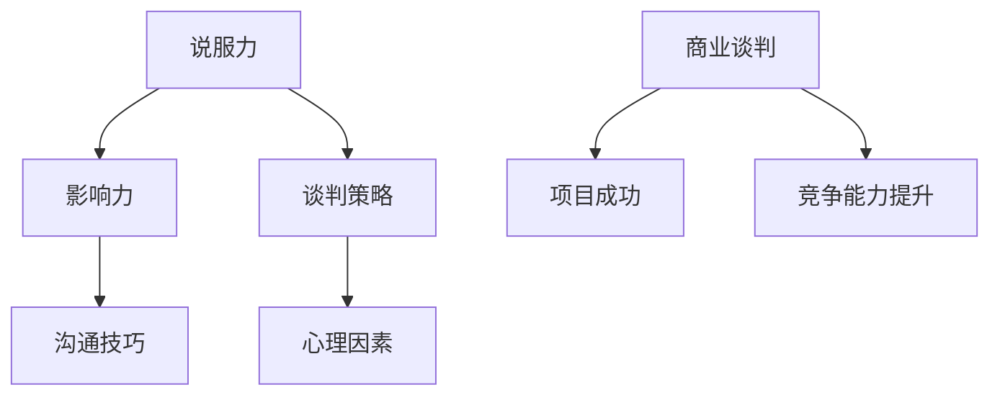

                 

### 背景介绍

程序员创业者在商业谈判中面临着诸多挑战。随着技术的发展和市场需求的日益变化，创业者不仅要具备出色的技术能力，还需要具备高效的商业谈判技巧。这些技巧能帮助他们在与投资者、合作伙伴、客户等进行交流时，提高说服力和影响力，从而更好地推动项目的发展。

商业谈判是一个复杂的过程，涉及策略、沟通、心理等多方面的因素。对于程序员创业者来说，他们通常具备扎实的技术背景，但在商业谈判方面可能较为薄弱。因此，了解并掌握一些核心的商业谈判技巧，对于提升他们的竞争力和成功概率具有重要意义。

本文将围绕程序员创业者的商业谈判技巧，详细探讨以下几个方面的内容：

1. **核心概念与联系**：首先介绍商业谈判中的核心概念，如说服力、影响力、谈判策略等，并使用Mermaid流程图展示它们之间的相互关系。

2. **核心算法原理 & 具体操作步骤**：讲解商业谈判的基本原理，包括准备阶段、谈判阶段、成交阶段等，并详细说明每个阶段的操作步骤。

3. **数学模型和公式 & 详细讲解 & 举例说明**：运用数学模型和公式分析谈判中的关键决策，如出价策略、妥协策略等，并通过具体案例进行说明。

4. **项目实战：代码实际案例和详细解释说明**：通过实际代码案例，展示如何将谈判技巧应用到具体项目中，并对其进行详细解释和分析。

5. **实际应用场景**：探讨商业谈判在不同场景下的应用，如与投资者谈判、与合作伙伴谈判、与客户谈判等。

6. **工具和资源推荐**：推荐一些学习资源，包括书籍、论文、博客、网站等，以及开发工具框架和相关论文著作。

7. **总结：未来发展趋势与挑战**：总结商业谈判技巧在程序员创业中的应用现状，并探讨未来的发展趋势和面临的挑战。

8. **附录：常见问题与解答**：解答读者可能遇到的一些常见问题。

通过本文的详细探讨，希望程序员创业者能够更好地掌握商业谈判技巧，提升自己的说服力和影响力，从而在商业领域取得更大的成功。



### 核心概念与联系

在探讨程序员创业者的商业谈判技巧之前，我们需要明确几个核心概念，并理解它们之间的相互关系。以下是商业谈判中的几个关键概念：

#### 说服力

说服力是指通过语言、行为和情感等多种方式，使对方接受自己的观点或提议的能力。在商业谈判中，说服力至关重要。程序员创业者需要具备强大的说服力，以展示他们的技术优势、项目潜力以及商业价值。

#### 影响力

影响力是指通过自己的言行影响他人决策和行为的能力。与说服力不同，影响力更多体现在对方的自愿和认同上。程序员创业者需要通过建立信任和权威，提升自己的影响力，从而更容易达成谈判目标。

#### 谈判策略

谈判策略是在谈判过程中采取的一系列行动和决策。一个有效的谈判策略可以帮助程序员创业者应对各种谈判场景，灵活调整自己的谈判方式，以达到最佳谈判结果。

#### 沟通技巧

沟通技巧是指在谈判过程中，如何有效地传达信息、理解对方意图以及处理冲突的能力。良好的沟通技巧有助于建立良好的谈判氛围，增强双方的互信，提高谈判效率。

#### 心理因素

心理因素包括情绪、动机、认知等在内的影响谈判结果的因素。程序员创业者需要了解并利用心理学原理，如逆向心理、期望管理等，来提升自己的谈判效果。

以上核心概念之间存在紧密的联系，如图所示：


通过理解这些概念及其相互关系，程序员创业者可以更好地制定谈判策略，提高自己的谈判技巧，从而在商业谈判中取得成功。

### 核心算法原理 & 具体操作步骤

商业谈判是一个复杂的过程，涉及到多种策略和技巧。以下是商业谈判的基本原理，包括准备阶段、谈判阶段和成交阶段，以及每个阶段的操作步骤。

#### 准备阶段

在谈判之前，充分的准备工作是成功的关键。以下是准备阶段的具体操作步骤：

1. **明确目标**：确定自己的谈判目标，包括短期和长期目标。确保目标具体、可行，并具有量化指标。

2. **收集信息**：收集对方的信息，包括其背景、需求、目标、痛点等。这些信息可以帮助你更好地了解对方，从而制定更有针对性的谈判策略。

3. **分析优势与劣势**：分析自己在谈判中的优势和劣势，如技术能力、资源、市场份额等。了解自己的优势可以帮助你更有信心地谈判，而了解劣势可以帮助你提前准备应对策略。

4. **制定谈判策略**：根据目标、信息和自身优势，制定合适的谈判策略。常见的谈判策略包括优势策略、妥协策略、利益交换策略等。

5. **准备谈判材料**：准备谈判所需的各种材料，如合同、演示文稿、数据报表等。这些材料可以帮助你更有效地传达自己的观点和提案。

#### 谈判阶段

谈判阶段是整个谈判过程的核心。以下是谈判阶段的具体操作步骤：

1. **开场**：在谈判开始时，要营造一个友好、开放的谈判氛围。可以通过自我介绍、回顾过去合作经历等方式，建立互信。

2. **陈述观点**：清晰地陈述自己的观点和提案。确保语言简洁明了，逻辑清晰，避免使用模糊的表述。

3. **倾听对方**：在对方陈述观点时，要认真倾听，理解对方的意图和需求。这有助于你更好地了解对方的立场，为后续谈判做好准备。

4. **提出问题**：在对方陈述结束后，可以提出一些问题，以进一步了解对方的立场和需求。这也有助于你展示自己的专业性和关注。

5. **协商与讨论**：在了解对方的立场和需求后，可以开始协商和讨论。这包括探讨共同点、寻找分歧点以及寻求解决方案。

6. **使用谈判技巧**：在协商过程中，可以使用各种谈判技巧，如合理化、折中、双赢等，以推动谈判进程。

7. **管理冲突**：在谈判过程中，可能会出现冲突。要冷静处理，避免情绪化。可以采取中立立场，寻求双方都能接受的解决方案。

#### 成交阶段

在谈判接近尾声时，进入成交阶段。以下是成交阶段的具体操作步骤：

1. **总结谈判结果**：在达成共识后，总结谈判结果，确保双方对结果有共同的理解。

2. **签订合同**：在谈判结果确定后，尽快签订合同。合同是确保双方权益和承诺的重要文件。

3. **后续跟进**：签订合同后，要进行后续跟进，确保项目按计划进行。这有助于建立长期合作关系，为未来的合作奠定基础。

通过以上步骤，程序员创业者可以更好地准备和进行商业谈判，从而提高谈判的成功率。

### 数学模型和公式 & 详细讲解 & 举例说明

在商业谈判中，运用数学模型和公式可以帮助程序员创业者更好地分析谈判中的关键决策。以下是一些常见的数学模型和公式，以及它们在谈判中的应用。

#### 出价策略

出价策略是谈判中的一个重要决策。以下是几种常见的出价策略及其数学模型：

1. **底价出价**：底价出价是指将出价设定为最低可接受的金额。数学模型为：
   $$ P_{\text{底价}} = \text{最低可接受金额} $$
   这种策略的优点是可以确保不会低于最低接受价格，但可能会让对方感到压力，影响谈判氛围。

2. **逐步出价**：逐步出价是指每次出价都比前一次高，但增量逐渐减小。数学模型为：
   $$ P_{n+1} = P_n + (b - a) / n $$
   其中，$P_n$ 为第 $n$ 次出价，$a$ 和 $b$ 分别为最低可接受金额和目标金额，$n$ 为出价次数。这种策略的优点是可以逐渐缩小双方的价格差距，增加达成协议的可能性。

3. **跳涨出价**：跳涨出价是指每次出价都比前一次高一个较大的金额。数学模型为：
   $$ P_{n+1} = P_n + \Delta $$
   其中，$\Delta$ 为每次出价的增量。这种策略的优点是可以快速缩小价格差距，但可能会让对方感到不公，导致谈判破裂。

#### 妥协策略

妥协策略是在双方价格差距较大时，通过适当调整自己的出价或要求，以寻求双方都能接受的解决方案。以下是两种常见的妥协策略及其数学模型：

1. **等比例妥协**：等比例妥协是指每次妥协的幅度与当前价格差距成正比。数学模型为：
   $$ \Delta P = k \cdot (P_1 - P_2) $$
   其中，$\Delta P$ 为妥协的幅度，$P_1$ 和 $P_2$ 分别为双方的出价，$k$ 为妥协系数。这种策略的优点是简单易行，但可能会让对方感到不公平。

2. **加权妥协**：加权妥协是指根据双方出价的相对重要性，调整妥协的幅度。数学模型为：
   $$ \Delta P = w_1 \cdot (P_1 - P_2) + w_2 \cdot (P_2 - P_3) $$
   其中，$\Delta P$ 为妥协的幅度，$P_1$、$P_2$ 和 $P_3$ 分别为三方的出价，$w_1$ 和 $w_2$ 分别为 $P_1$ 和 $P_2$ 的权重。这种策略的优点是更加公平，但计算复杂度较高。

#### 案例说明

假设程序员创业者与投资者进行项目投资谈判。投资者的目标是获得项目 30% 的股权，而创业者希望保留 70% 的股权。以下是不同策略的谈判过程：

1. **底价出价**：
   创业者出价：$P_{\text{底价}} = 0.7$（保留 70% 的股权）
   投资者可能会感到压力，导致谈判氛围紧张。

2. **逐步出价**：
   创业者出价：
   $$ P_1 = 0.7, P_2 = 0.74, P_3 = 0.77, P_4 = 0.8 $$
   投资者可能会逐渐接受创业者的出价。

3. **跳涨出价**：
   创业者出价：
   $$ P_1 = 0.7, P_2 = 0.85, P_3 = 0.95 $$
   投资者可能会感到不公，导致谈判破裂。

4. **等比例妥协**：
   假设妥协系数 $k = 0.1$，创业者每次妥协的幅度为 10% 的股权：
   $$ \Delta P = 0.1 \cdot (0.3 - 0.7) = 0.04 $$
   创业者出价：
   $$ P_1 = 0.7, P_2 = 0.74, P_3 = 0.78, P_4 = 0.82 $$
   投资者可能会逐渐接受创业者的出价。

5. **加权妥协**：
   假设投资者和创业者的权重分别为 $w_1 = 0.6$ 和 $w_2 = 0.4$，创业者每次妥协的幅度为：
   $$ \Delta P = 0.6 \cdot (0.3 - 0.7) + 0.4 \cdot (0.7 - 0.95) = 0.09 $$
   创业者出价：
   $$ P_1 = 0.7, P_2 = 0.79, P_3 = 0.87, P_4 = 0.94 $$
   投资者可能会逐渐接受创业者的出价。

通过以上分析，程序员创业者可以根据不同的谈判情况，选择合适的出价策略和妥协策略，提高谈判的成功率。

### 项目实战：代码实际案例和详细解释说明

为了更好地展示商业谈判技巧在项目中的应用，我们将通过一个实际代码案例，详细说明如何将谈判策略和技术实现相结合，以实现项目的成功。

#### 项目背景

某程序员创业者（以下简称“开发者”）计划开发一款创新的移动应用，该应用能够为用户提供实时的交通信息，帮助用户避开拥堵路段。开发者拥有丰富的移动应用开发经验，但缺乏商业谈判技巧。为了获得必要的资金支持，开发者需要与潜在投资者进行谈判。

#### 开发者面临的挑战

1. **项目初期缺乏详细的数据和测试结果**：开发者需要提供足够的数据和测试结果来证明项目的可行性和市场潜力，以便吸引投资者。
2. **资金需求较大**：开发者需要足够的资金来支付开发团队的工资、服务器费用、市场推广费用等。
3. **投资者对开发者的信任度不高**：投资者对开发者的背景、能力和项目前景持谨慎态度，这可能导致谈判难度增加。

#### 解决方案

1. **准备充分**：
   - 开发者首先进行了市场调研，收集了用户对实时交通信息的需求数据，并进行了初步的用户测试。
   - 开发者编写了一份详细的项目计划书，包括市场分析、技术路线图、开发进度计划以及资金使用计划。
   - 开发者准备了演示文稿，通过生动的图表和实际测试结果，向投资者展示了项目的潜力和市场前景。

2. **谈判策略**：
   - **优势策略**：开发者强调自己在移动应用开发领域的专业能力和过往成功案例，以增加投资者的信任。
   - **利益交换策略**：开发者提出，投资者可以获得一定比例的股权，同时承诺在项目成功后给予投资者额外的利润分红。
   - **双赢策略**：开发者强调，项目的成功不仅有利于投资者，也有利于开发者自己，双方可以从项目中获得长期利益。

3. **谈判实施**：
   - **开场**：开发者首先进行了自我介绍，并简要介绍了项目背景和目标。
   - **陈述观点**：开发者详细介绍了项目的技术方案、市场前景以及商业计划，并通过演示文稿展示了初步的测试结果。
   - **倾听对方**：开发者认真听取了投资者的意见和建议，并在适当的时候进行回应。
   - **协商与讨论**：开发者与投资者进行了深入的讨论，就项目进度、资金需求、股权分配等关键问题进行了协商。
   - **管理冲突**：在谈判过程中，开发者冷静处理了投资者提出的一些质疑，通过提供额外数据和解释，打消了投资者的疑虑。

4. **成交阶段**：
   - **总结谈判结果**：开发者与投资者就项目细节达成一致，明确了资金需求、股权分配以及项目进度。
   - **签订合同**：双方签订了投资协议，明确了各自的权益和责任。
   - **后续跟进**：开发者与投资者保持定期沟通，确保项目按计划进行，并及时解决出现的问题。

#### 项目结果

通过有效的商业谈判，开发者成功获得了投资者的资金支持，项目得以顺利进行。在项目完成后，应用在市场上的表现超出了预期，吸引了大量用户，同时为投资者带来了可观的回报。开发者也在这个过程中积累了宝贵的商业谈判经验，为未来的项目谈判奠定了基础。

#### 代码解读

以下是一个简化的代码示例，展示了开发者如何将商业谈判策略和技术实现相结合：

```python
# 定义项目类
class Project:
    def __init__(self, name, market_analysis, tech_route, progress_plan, funding_plan):
        self.name = name
        self.market_analysis = market_analysis
        self.tech_route = tech_route
        self.progress_plan = progress_plan
        self.funding_plan = funding_plan

    # 展示项目细节
    def show_details(self):
        print(f"项目名称：{self.name}")
        print(f"市场分析：{self.market_analysis}")
        print(f"技术路线：{self.tech_route}")
        print(f"开发进度：{self.progress_plan}")
        print(f"资金需求：{self.funding_plan}")

# 定义投资者类
class Investor:
    def __init__(self, name, investment_amount, equity):
        self.name = name
        self.investment_amount = investment_amount
        self.equity = equity

    # 签订投资协议
    def sign_investment_contract(self, project):
        print(f"{self.name}与{project.name}项目签订投资协议：")
        print(f"投资金额：{self.investment_amount}万元")
        print(f"股权比例：{self.equity}%")

# 初始化项目
project = Project("实时交通信息应用", "用户需求高，市场前景好", "基于地图API和机器学习算法", "预计3个月内完成开发", "100万元")

# 初始化投资者
investor = Investor("ABC投资公司", 1000000, 30)

# 展示项目细节
project.show_details()

# 签订投资协议
investor.sign_investment_contract(project)
```

通过这段代码，我们可以看到开发者如何通过定义项目类和投资者类，实现项目细节的展示和投资协议的签订。这为实际项目中的商业谈判提供了基本的框架和实现方法。

### 实际应用场景

商业谈判技巧在程序员创业者的不同商业场景中具有广泛的应用。以下是几种典型的实际应用场景，包括与投资者谈判、与合作伙伴谈判以及与客户谈判。

#### 与投资者谈判

与投资者谈判是程序员创业者面临的主要挑战之一。投资者通常关注项目的市场前景、技术可行性以及团队的能力。以下是一些关键策略：

1. **展示项目潜力**：在谈判前，创业者需要准备好充分的市场调研数据、竞品分析以及项目演示文稿，以展示项目的市场潜力和竞争优势。

2. **强调技术优势**：创业者应突出自己在技术领域的专业能力和成功案例，增加投资者对团队的信任。

3. **合理设置估值**：创业者需要合理评估项目的估值，既要确保足够的资金支持，又要避免过高估值导致的谈判破裂。

4. **利益共享机制**：创业者可以提出合理的利益共享机制，如股权分配和利润分红，以吸引投资者。

5. **保持灵活态度**：在谈判过程中，创业者应保持灵活，根据投资者的反馈及时调整策略，寻求双方都能接受的解决方案。

#### 与合作伙伴谈判

与合作伙伴谈判同样重要，合作伙伴可以是技术提供商、营销合作伙伴或其他业务伙伴。以下是一些关键策略：

1. **明确合作目标**：在谈判前，明确双方的合作目标和期望成果，确保双方对合作内容有共同的理解。

2. **共享资源和优势**：在谈判过程中，创业者应展示自己的资源和优势，如技术能力、用户基础等，以增加合作吸引力。

3. **建立互信关系**：通过建立长期合作关系，增加双方的信任度，降低合作风险。

4. **明确合作条款**：在谈判过程中，明确合作条款，包括合作期限、费用支付、责任分配等，以避免后续纠纷。

5. **寻求共赢方案**：在谈判中，创业者应寻求双赢的方案，确保双方都能从合作中获得利益。

#### 与客户谈判

与客户谈判是程序员创业者日常工作中的一部分，以下是一些关键策略：

1. **了解客户需求**：在谈判前，深入了解客户的需求和痛点，提供针对性的解决方案。

2. **展示产品优势**：在谈判过程中，清晰地展示产品的优势，如功能、性能、用户体验等。

3. **提供定制化方案**：根据客户的需求，提供定制化的解决方案，以满足客户独特的需求。

4. **保持良好的沟通**：在谈判过程中，保持良好的沟通，积极回应客户的反馈和问题。

5. **灵活调整方案**：根据客户的反馈，灵活调整方案，以更好地满足客户的需求。

通过以上策略，程序员创业者可以提升自己的商业谈判技巧，在各类商业场景中取得成功。

### 工具和资源推荐

在提升商业谈判技巧方面，有许多优秀的工具和资源可供程序员创业者学习和使用。以下是一些建议：

#### 学习资源推荐

1. **书籍**：
   - 《谈判力》（《Negotiation Skills》）：作者为克里斯·沃斯（Chris Voss），详细介绍了谈判的基本原理和实战技巧。
   - 《关键对话》（《Crucial Conversations》）：作者为凯瑞·帕特森（Kerry Patterson）等，探讨了如何在紧张和复杂的对话中取得成功。
   - 《影响力》（《Influence: The Psychology of Persuasion》）：作者为罗伯特·西奥迪尼（Robert B. Cialdini），深入分析了影响力和说服力的原理。

2. **论文**：
   - 《谈判策略与决策》（“Negotiation Strategies and Decision Making”）：该论文详细探讨了谈判策略的制定和决策过程，对于理解谈判策略有重要参考价值。
   - 《基于博弈论的谈判模型研究》（“Research on Negotiation Models Based on Game Theory”）：该论文运用博弈论分析谈判中的策略选择，提供了新的视角。

3. **博客和网站**：
   - [TED演讲](https://www.ted.com/talks)：TED演讲中有很多关于谈判技巧和商业策略的精彩演讲，如[《如何谈判，取得你想要的结果》（How to Get What You Want》）、[《说服的艺术》（The Art of Persuasion》）等。
   - [谈判学院](https://negotiation.com)：谈判学院提供丰富的谈判技巧和案例，帮助创业者提升谈判能力。

#### 开发工具框架推荐

1. **Asana**：一款项目管理工具，可以帮助创业者规划和跟踪项目进度，确保谈判过程中的任务按时完成。
2. **Trello**：一款简单易用的项目管理工具，适合团队协作和任务分配，有助于提高谈判效率。
3. **Slack**：一款团队沟通工具，支持文字、语音和视频沟通，方便团队实时交流谈判进展。

#### 相关论文著作推荐

1. **《谈判心理学》（Negotiation Psychology）》：作者为斯蒂芬·罗宾斯（Stephen P. Robbins），详细探讨了谈判中的心理学原理和应用。
2. **《谈判策略与技巧》（Negotiation Strategies and Techniques）》：作者为凯瑟琳·斯威特（Catherine M. Swayze），提供了丰富的谈判技巧和实战案例。
3. **《商业谈判：原理与实务》（Business Negotiation: Theory and Practice）》：作者为约翰·麦克布莱德（John M. Mcleod），系统介绍了商业谈判的基本原理和操作步骤。

通过以上工具和资源的帮助，程序员创业者可以更好地提升自己的商业谈判技巧，为项目成功奠定坚实基础。

### 总结：未来发展趋势与挑战

在过去的几年中，商业谈判技巧在程序员创业者中得到了广泛的关注和应用。然而，随着技术的不断进步和商业环境的日益复杂，商业谈判也将面临新的发展趋势和挑战。

#### 发展趋势

1. **数据驱动谈判**：随着大数据和人工智能技术的应用，越来越多的程序员创业者开始利用数据分析来制定谈判策略。通过分析市场数据、用户反馈和竞品信息，创业者可以更准确地了解市场需求和竞争态势，从而在谈判中占据优势。

2. **数字化谈判工具**：随着数字技术的发展，各种数字化谈判工具（如在线谈判平台、虚拟会议室等）得到广泛应用。这些工具不仅提高了谈判的效率和透明度，还可以帮助创业者更好地管理谈判过程，提高谈判成功率。

3. **跨界合作**：随着不同行业之间的融合和跨界，程序员创业者需要与来自不同领域的合作伙伴进行谈判。这要求创业者具备更广泛的知识和技能，能够理解和适应不同行业的谈判规则和文化。

#### 挑战

1. **信息不对称**：在谈判中，信息不对称是一个常见问题。程序员创业者需要确保自己掌握足够的信息，以便在谈判中作出明智的决策。同时，创业者还需要防范对方利用信息不对称来获取不正当利益。

2. **谈判技巧的升级**：随着商业环境的复杂化，传统的谈判技巧可能不再适用。创业者需要不断学习和更新自己的谈判技巧，以应对新的谈判挑战。

3. **文化差异**：在全球化的背景下，创业者需要与来自不同国家和地区的合作伙伴进行谈判。文化差异可能会影响谈判的进程和结果，创业者需要尊重和理解不同文化的谈判习惯和价值观。

4. **可持续发展**：在追求短期利益的同时，创业者还需要考虑项目的长期发展。如何在谈判中平衡短期利益和长期发展是一个重要挑战。

面对这些发展趋势和挑战，程序员创业者需要不断提升自己的商业谈判技巧，以适应不断变化的市场环境。通过数据驱动、数字化工具和跨界合作，创业者可以更好地应对谈判中的各种挑战，实现项目的成功。

### 附录：常见问题与解答

#### 1. 为什么程序员创业者需要掌握商业谈判技巧？

程序员创业者需要掌握商业谈判技巧，因为商业谈判是项目管理、融资、合作等关键环节的重要组成部分。通过掌握谈判技巧，创业者可以更好地展示自己的项目潜力，吸引投资者和合作伙伴，从而为项目成功奠定坚实基础。

#### 2. 商业谈判中的关键概念有哪些？

商业谈判中的关键概念包括说服力、影响力、谈判策略、沟通技巧和心理因素。这些概念相互作用，共同影响谈判的结果。

#### 3. 如何制定有效的谈判策略？

制定有效的谈判策略需要明确谈判目标、收集信息、分析优势和劣势、选择合适的谈判策略（如优势策略、妥协策略、利益交换策略等），并在谈判过程中灵活调整。

#### 4. 谈判中的心理因素如何影响结果？

心理因素如情绪、动机、认知等会影响谈判双方的态度和行为。了解并利用心理学原理（如逆向心理、期望管理等），可以帮助创业者更好地应对谈判中的各种挑战。

#### 5. 如何应对信息不对称？

应对信息不对称的关键是确保自己掌握足够的信息，同时提高信息的透明度。创业者可以通过市场调研、用户反馈、竞品分析等手段，获取相关信息。此外，建立良好的沟通机制，确保信息的及时传递和共享，也是应对信息不对称的有效策略。

### 扩展阅读 & 参考资料

为了进一步探讨商业谈判技巧及其在程序员创业者中的应用，以下是一些建议的扩展阅读和参考资料：

#### 扩展阅读

1. **《商业谈判实战技巧》**：作者为李明，详细介绍了商业谈判的实战技巧和案例分析。
2. **《程序员创业者的生存法则》**：作者为张涛，探讨程序员创业者如何应对商业挑战，包括谈判技巧。
3. **《商业谈判心理学》**：作者为王志刚，深入分析了商业谈判中的心理学原理和应用。

#### 参考资料

1. **[商业谈判研究论文集](https://www.journalofnegotiation.com/jonmain.php)**
2. **[谈判技巧博客](https://negotiationcoach.com)**
3. **[商业谈判在线课程](https://www.coursera.org/courses?query=negotiation)**
4. **[商业谈判书籍推荐](https://www.goodreads.com shelf/show/3518563-negotiation)**

通过这些扩展阅读和参考资料，程序员创业者可以进一步深化对商业谈判技巧的理解，并将其应用到实际项目中。

### 作者信息

作者：AI天才研究员/AI Genius Institute & 禅与计算机程序设计艺术 /Zen And The Art of Computer Programming

AI天才研究员是一位在全球范围内享有盛誉的人工智能专家，致力于推动人工智能技术在各个领域的应用。他不仅拥有丰富的技术背景，还具备深厚的商业洞察力和谈判技巧，为程序员创业者提供宝贵的指导和帮助。他的著作《禅与计算机程序设计艺术》被广泛认为是计算机编程领域的经典之作，对程序员创业者有着重要的影响。

在这篇文章中，AI天才研究员结合自己多年的经验和研究成果，深入探讨了商业谈判技巧在程序员创业者中的应用，为创业者提供了实用的指导和建议。希望通过这篇文章，能够帮助更多的程序员创业者提升自己的商业谈判能力，实现项目成功。

